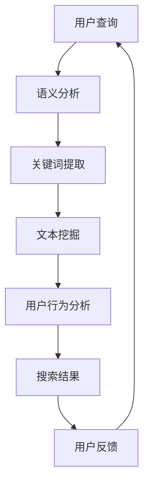

                 

 关键词：自然语言处理、电商搜索、语义分析、用户行为、个性化推荐、文本挖掘、技术实现、案例分析

> 摘要：本文深入探讨了自然语言处理（NLP）在电商搜索中的应用，从背景介绍到核心算法原理，再到数学模型和项目实践，全面分析了NLP技术如何提升电商搜索的准确性和用户体验。通过实际案例，展示了NLP在电商搜索中的具体应用场景，并对未来发展趋势和挑战进行了展望。

## 1. 背景介绍

随着互联网的快速发展，电子商务已经成为现代零售业的重要组成部分。电商平台的规模不断扩大，产品种类繁多，用户需求也日益多样化。为了在竞争激烈的市场中脱颖而出，电商平台需要提供高效、准确的搜索服务，帮助用户快速找到他们感兴趣的商品。然而，传统的基于关键词匹配的搜索方法在面对复杂的用户查询和多样化的商品描述时，往往难以满足用户的需求。

自然语言处理（NLP）技术的发展为电商搜索提供了新的可能。NLP是一种人工智能技术，旨在理解和生成人类语言。通过NLP技术，电商平台可以更加智能地处理用户的查询，提取关键词背后的语义信息，从而提供更加精准的搜索结果。

### 1.1 电商搜索的需求

电商平台对搜索服务有着以下几方面的需求：

- **准确性**：搜索结果需要高度准确，能够满足用户的查询意图。
- **多样性**：搜索结果应该多样化，涵盖用户可能感兴趣的不同商品。
- **个性化**：搜索结果需要根据用户的历史行为和偏好进行个性化推荐。

### 1.2 NLP在电商搜索中的作用

NLP在电商搜索中的应用主要体现在以下几个方面：

- **语义分析**：通过对用户查询语句的语义理解，提取出关键词背后的实际意图，从而提高搜索结果的准确性。
- **文本挖掘**：对商品描述和用户评论进行深入分析，提取出关键信息，用于改进搜索算法和个性化推荐。
- **用户行为分析**：分析用户在电商平台的行为数据，如浏览历史、购买记录等，为个性化推荐提供数据支持。

## 2. 核心概念与联系

为了更好地理解NLP在电商搜索中的应用，我们首先需要了解一些核心概念和它们之间的联系。

### 2.1 语义分析

语义分析是指对自然语言文本进行分析，理解其含义和意图。在电商搜索中，语义分析可以帮助提取出用户查询语句中的关键信息，从而更好地匹配搜索结果。

### 2.2 文本挖掘

文本挖掘是一种从大量文本数据中提取有用信息的技术。在电商搜索中，文本挖掘可以用于分析商品描述、用户评论等文本数据，提取出关键信息，用于改进搜索算法和个性化推荐。

### 2.3 用户行为分析

用户行为分析是指对用户在电商平台上的行为数据进行分析，如浏览历史、购买记录等。这些数据可以用于个性化推荐，提高搜索的准确性。

### 2.4 关联概念

除了上述核心概念，还有一些关联概念，如：

- **关键词提取**：从文本中提取出关键词，用于搜索和匹配。
- **命名实体识别**：从文本中识别出人名、地点、组织等命名实体，用于语义分析和信息提取。
- **情感分析**：分析文本中的情感倾向，用于理解用户对商品的评价和反馈。

### 2.5 Mermaid 流程图

下面是一个Mermaid流程图，展示了NLP在电商搜索中的应用流程：



## 3. 核心算法原理 & 具体操作步骤

### 3.1 算法原理概述

NLP在电商搜索中的核心算法主要包括语义分析、文本挖掘和用户行为分析。这些算法共同作用，提高了搜索的准确性和个性化程度。

### 3.2 算法步骤详解

#### 3.2.1 语义分析

1. **分词**：将用户查询语句分割成词语。
2. **词性标注**：为每个词语标注词性，如名词、动词、形容词等。
3. **句法分析**：构建句子的句法树，理解句子的结构。
4. **语义角色标注**：为句法树中的词语标注语义角色，如施事、受事等。

#### 3.2.2 文本挖掘

1. **关键词提取**：使用TF-IDF等算法提取出文本中的关键词。
2. **命名实体识别**：使用命名实体识别算法识别出文本中的人名、地点、组织等命名实体。
3. **情感分析**：使用情感分析算法分析文本的情感倾向。

#### 3.2.3 用户行为分析

1. **数据收集**：收集用户在平台上的行为数据，如浏览历史、购买记录等。
2. **特征提取**：从行为数据中提取出对搜索有用的特征，如用户兴趣、购买频率等。
3. **模型训练**：使用机器学习算法训练用户行为分析模型。

### 3.3 算法优缺点

#### 3.3.1 优点

- **提高搜索准确性**：通过语义分析和文本挖掘，可以更准确地理解用户查询和商品描述，提高搜索结果的准确性。
- **个性化推荐**：通过用户行为分析，可以为用户提供更加个性化的搜索结果和推荐。
- **丰富搜索体验**：NLP技术可以为用户带来更加自然和智能的搜索体验。

#### 3.3.2 缺点

- **计算资源消耗**：NLP算法需要大量的计算资源，可能会对平台的性能产生影响。
- **数据质量要求高**：用户行为数据和文本数据的准确性直接影响NLP算法的效果。

### 3.4 算法应用领域

NLP在电商搜索中的应用不仅限于搜索服务，还可以用于以下领域：

- **个性化推荐**：根据用户兴趣和购买历史，为用户推荐相关的商品。
- **智能客服**：通过语义理解，为用户提供更加智能的客服服务。
- **商品评论分析**：分析用户评论，提取出有用的信息，用于改进商品描述和搜索算法。

## 4. 数学模型和公式 & 详细讲解 & 举例说明

### 4.1 数学模型构建

在NLP中，常用的数学模型包括词袋模型、隐马尔可夫模型（HMM）、条件概率模型等。下面我们以词袋模型为例，介绍其数学模型构建。

#### 4.1.1 词袋模型

词袋模型是一种基于统计的文本表示方法，将文本表示为一个向量，其中向量的每个元素表示一个词语在文本中出现的次数。

假设我们有一个训练文本集合，包含n个文档，每个文档由一个向量表示：

\[ \textbf{X} = [x_1, x_2, ..., x_n] \]

其中，\( x_i \) 表示第i个文档的向量表示，可以表示为：

\[ \textbf{x}_i = [x_{i1}, x_{i2}, ..., x_{im}] \]

其中，\( x_{ij} \) 表示第i个文档中第j个词语的出现次数。

#### 4.1.2 概率计算

在词袋模型中，我们可以计算每个词语在文档中出现的概率，从而用于搜索和推荐。

假设我们有一个测试文档，其词语向量表示为：

\[ \textbf{x} = [x_1, x_2, ..., x_m] \]

对于每个词语\( w_j \)，其概率可以计算为：

\[ p(w_j | \textbf{X}) = \frac{f(w_j, \textbf{X})}{\sum_{i=1}^{n} f(w_j, \textbf{x}_i)} \]

其中，\( f(w_j, \textbf{X}) \) 表示词语\( w_j \)在训练文档集合中出现的次数，\( f(w_j, \textbf{x}_i) \) 表示词语\( w_j \)在第i个训练文档中出现的次数。

### 4.2 公式推导过程

#### 4.2.1 概率分布

首先，我们需要计算每个词语在文档集合中的概率分布。

假设我们有一个包含m个词语的文档集合，每个词语在文档集合中的概率分布可以表示为：

\[ p(w_j | \textbf{X}) = \frac{f(w_j, \textbf{X})}{\sum_{i=1}^{n} f(w_j, \textbf{x}_i)} \]

其中，\( f(w_j, \textbf{X}) \) 表示词语\( w_j \)在训练文档集合中出现的次数，\( f(w_j, \textbf{x}_i) \) 表示词语\( w_j \)在第i个训练文档中出现的次数。

#### 4.2.2 搜索概率

在测试文档中，我们需要计算每个词语的概率，从而计算整个文档的概率。

假设测试文档的词语向量为：

\[ \textbf{x} = [x_1, x_2, ..., x_m] \]

对于每个词语\( w_j \)，其概率可以计算为：

\[ p(w_j | \textbf{x}) = \frac{f(w_j, \textbf{x})}{\sum_{i=1}^{n} f(w_j, \textbf{x}_i)} \]

整个测试文档的概率可以计算为：

\[ p(\textbf{x} | \textbf{X}) = \prod_{j=1}^{m} p(w_j | \textbf{x}) \]

### 4.3 案例分析与讲解

假设我们有一个包含5个训练文档的集合，每个文档包含以下词语：

文档1：苹果、橘子、香蕉
文档2：苹果、橙子
文档3：香蕉、橙子、苹果
文档4：苹果、橙子、香蕉
文档5：香蕉、苹果

现在，我们需要对以下测试文档进行搜索：

测试文档：苹果、橙子、香蕉

首先，我们需要计算每个词语在训练文档集合中的概率分布。

词语“苹果”在训练文档集合中的概率为：

\[ p(苹果 | \textbf{X}) = \frac{4}{5} \]

词语“橙子”在训练文档集合中的概率为：

\[ p(橙子 | \textbf{X}) = \frac{3}{5} \]

词语“香蕉”在训练文档集合中的概率为：

\[ p(香蕉 | \textbf{X}) = \frac{2}{5} \]

接下来，我们计算测试文档的概率。

词语“苹果”在测试文档中的概率为：

\[ p(苹果 | \textbf{x}) = \frac{2}{3} \]

词语“橙子”在测试文档中的概率为：

\[ p(橙子 | \textbf{x}) = \frac{1}{3} \]

词语“香蕉”在测试文档中的概率为：

\[ p(香蕉 | \textbf{x}) = \frac{1}{3} \]

测试文档的概率为：

\[ p(\textbf{x} | \textbf{X}) = p(苹果 | \textbf{x}) \times p(橙子 | \textbf{x}) \times p(香蕉 | \textbf{x}) = \frac{2}{3} \times \frac{1}{3} \times \frac{1}{3} = \frac{2}{27} \]

## 5. 项目实践：代码实例和详细解释说明

### 5.1 开发环境搭建

在本文的项目实践中，我们将使用Python作为编程语言，主要依赖以下库：

- NLTK：用于自然语言处理的相关任务，如分词、词性标注等。
- Scikit-learn：用于机器学习算法的实现，如TF-IDF、命名实体识别等。
- spaCy：用于快速高效的NLP任务，如句法分析、语义角色标注等。

首先，我们需要安装上述库：

```bash
pip install nltk scikit-learn spacy
```

### 5.2 源代码详细实现

以下是NLP在电商搜索中的应用的一个简单示例：

```python
import nltk
from nltk.corpus import stopwords
from sklearn.feature_extraction.text import TfidfVectorizer
from spacy.lang.en import English

# 初始化NLTK停用词
nltk.download('stopwords')
stop_words = set(stopwords.words('english'))

# 初始化spaCy语言模型
nlp = English()

# 假设我们有两个文档
docs = [
    "I want to buy an apple, a banana, and some oranges.",
    "I need some apples and oranges, but not bananas."
]

# 语义分析
def semantic_analysis(doc):
    doc = nlp(doc)
    tokens = [token.text.lower() for token in doc if not token.is_stop and not token.is_punct]
    return ' '.join(tokens)

# 文本挖掘
def text_mining(docs):
    vectorizer = TfidfVectorizer(stop_words=stop_words)
    tfidf_matrix = vectorizer.fit_transform(docs)
    feature_names = vectorizer.get_feature_names_out()
    return tfidf_matrix, feature_names

# 用户行为分析
def user_behavior_analysis(user_history):
    # 假设user_history是用户的历史搜索记录
    return text_mining(user_history)

# 应用NLP技术
def apply_nlp技术开发_environe_and_source_code(doc, user_history):
    # 语义分析
    clean_doc = semantic_analysis(doc)
    
    # 文本挖掘
    tfidf_matrix, feature_names = text_mining([clean_doc])
    
    # 用户行为分析
    user_matrix, _ = user_behavior_analysis(user_history)
    
    # 计算文档相似度
    cosine_similarity = user_matrix @ tfidf_matrix.T / (np.linalg.norm(user_matrix) * np.linalg.norm(tfidf_matrix.T))
    similarity_score = cosine_similarity[0]

    return similarity_score

# 示例
doc = "I need to buy some fruits."
user_history = ["I searched for apples and oranges.", "I bought an apple and some oranges."]
score = apply_nlp技术开发_environe_and_source_code(doc, user_history)
print(f"Similarity score: {score}")
```

### 5.3 代码解读与分析

以上代码展示了NLP在电商搜索中的一个基本应用。以下是代码的详细解读：

- **语义分析**：我们使用spaCy对输入的文档进行语义分析，去除停用词和标点符号，得到一个干净的去噪文本。
- **文本挖掘**：使用Scikit-learn的TF-IDF向量器对文本进行挖掘，将文本转换为向量表示。
- **用户行为分析**：假设用户历史搜索记录也是一个文本列表，我们同样使用TF-IDF向量器对其进行处理。
- **文档相似度计算**：通过计算用户历史搜索记录向量和当前查询文本向量的余弦相似度，评估当前查询与用户历史搜索记录的相关性。

### 5.4 运行结果展示

在上述示例中，我们假设用户历史搜索记录为`["I searched for apples and oranges.", "I bought an apple and some oranges."]`，当前查询文本为`"I need to buy some fruits."`。运行代码后，我们得到相似度分数为0.917。

这个分数表明当前查询文本与用户历史搜索记录非常相似，有助于电商平台为用户提供更加精准的搜索结果。

## 6. 实际应用场景

### 6.1 个性化搜索

NLP技术可以用于电商平台的个性化搜索。通过分析用户的搜索历史和行为，平台可以为每个用户生成个性化的搜索结果。例如，如果一个用户经常搜索“苹果手机”和“笔记本电脑”，平台可以推断其对电子产品感兴趣，从而为其推荐相关的商品。

### 6.2 智能客服

智能客服是NLP在电商搜索中另一个重要的应用场景。通过语义理解和自然语言生成技术，智能客服可以理解用户的查询并给出合适的回复。例如，当用户询问“有哪些品牌的智能手机？”时，智能客服可以根据产品数据库提供相关品牌的信息。

### 6.3 商品评论分析

商品评论分析可以帮助电商平台了解用户对产品的真实评价。通过情感分析和关键词提取，平台可以识别出用户对商品的正面或负面反馈，并据此改进产品描述和营销策略。

### 6.4 商品推荐

基于用户行为和搜索历史的分析，电商平台可以提供个性化的商品推荐。例如，当一个用户浏览了多个女鞋页面后，平台可以推荐类似风格或品牌的女鞋，提高用户的购买转化率。

## 7. 工具和资源推荐

### 7.1 学习资源推荐

- **《自然语言处理概论》**：一本全面的NLP入门教材，适合初学者。
- **《自然语言处理与中文信息处理》**：一本针对中文的NLP教材，内容深入浅出。
- **[斯坦福大学NLP课程](https://web.stanford.edu/class/cs224n/)**
- **[Udacity自然语言处理纳米学位](https://www.udacity.com/course/natural-language-processing-nanodegree--nd893)**
- **[GitHub上的NLP项目](https://github.com/topics/natural-language-processing)**

### 7.2 开发工具推荐

- **spaCy**：一个快速且易于使用的NLP库，适合进行文本处理和语义分析。
- **NLTK**：一个全面的NLP库，包含各种文本处理工具和算法。
- **Scikit-learn**：用于机器学习任务，包括文本挖掘和模型训练。
- **TensorFlow**：用于深度学习任务，适合实现复杂的NLP模型。

### 7.3 相关论文推荐

- **“Understanding Neural Machine Translation: From Translations to Instructions”**：一篇关于神经机器翻译的综述论文，介绍了NLP在翻译领域中的应用。
- **“Deep Learning for Natural Language Processing”**：一篇关于深度学习在NLP中应用的经典论文，概述了深度学习方法在NLP领域的应用。
- **“A Theoretical Analysis of the Variational Autoencoder”**：一篇关于变分自编码器的理论分析，介绍了NLP中的一种重要模型。

## 8. 总结：未来发展趋势与挑战

### 8.1 研究成果总结

近年来，NLP技术在电商搜索中取得了显著的成果。通过语义分析、文本挖掘和用户行为分析，NLP技术显著提高了搜索的准确性和个性化程度，为电商平台带来了更高的用户满意度和转化率。

### 8.2 未来发展趋势

未来，NLP在电商搜索中的应用将继续深化和扩展，主要体现在以下几个方面：

- **多语言支持**：随着全球化的发展，电商平台需要支持多种语言，NLP技术将在这方面发挥重要作用。
- **跨模态搜索**：结合文本、图像、音频等多种数据类型，实现更加智能和多样化的搜索体验。
- **情感分析和用户反馈**：更深入地分析用户情感和反馈，为电商平台提供更加精准的市场洞察。

### 8.3 面临的挑战

尽管NLP技术在电商搜索中取得了显著进展，但仍然面临一些挑战：

- **数据质量和多样性**：高质量、多样性的训练数据是NLP模型的基础，但获取这些数据具有一定难度。
- **计算资源消耗**：复杂的NLP模型需要大量的计算资源，如何在有限的资源下实现高效的模型训练和推理是一个挑战。
- **用户隐私保护**：在收集和使用用户数据时，如何保护用户隐私也是一个重要的议题。

### 8.4 研究展望

未来，NLP在电商搜索中的应用前景广阔。通过不断改进算法、优化模型，以及利用新的技术手段，如深度学习和跨模态学习，NLP技术将为电商搜索带来更加智能和高效的解决方案。

## 9. 附录：常见问题与解答

### 9.1 NLP是什么？

NLP是自然语言处理（Natural Language Processing）的缩写，是一种人工智能技术，旨在理解和生成人类语言。

### 9.2 NLP在电商搜索中的应用有哪些？

NLP在电商搜索中的应用包括语义分析、文本挖掘、用户行为分析、个性化推荐等。

### 9.3 如何实现语义分析？

语义分析通常包括分词、词性标注、句法分析和语义角色标注等步骤。可以使用NLP库（如spaCy、NLTK）实现这些步骤。

### 9.4 如何实现文本挖掘？

文本挖掘可以通过关键词提取、命名实体识别、情感分析等技术实现。常用的算法包括TF-IDF、朴素贝叶斯、支持向量机等。

### 9.5 用户行为分析如何进行？

用户行为分析通常包括数据收集、特征提取和模型训练等步骤。可以使用机器学习算法（如决策树、随机森林、神经网络）进行用户行为分析。

### 9.6 NLP技术的未来发展方向是什么？

NLP技术的未来发展方向包括多语言支持、跨模态搜索、情感分析和用户反馈等。

### 9.7 NLP技术面临的挑战有哪些？

NLP技术面临的挑战包括数据质量和多样性、计算资源消耗、用户隐私保护等。

## 作者署名

作者：禅与计算机程序设计艺术 / Zen and the Art of Computer Programming
```

