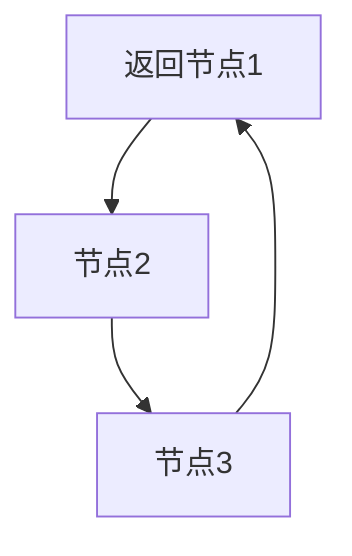

                 

  
## 1. 背景介绍

Neo4j是一款领先的图形数据库，其核心思想是将数据以图形的形式存储，从而能够更好地处理复杂的网络结构和关系。与传统的关系型数据库不同，Neo4j专注于处理大规模图数据，并提供了丰富的查询语言Cypher，使得开发者能够高效地进行图的构建、查询和分析。

在现代应用中，图数据库的重要性日益凸显，尤其是在社交网络、推荐系统、金融风控等领域。Neo4j以其强大的性能、易用性和灵活性，成为开发者们解决复杂网络问题的重要工具。

本文旨在全面介绍Neo4j的原理，包括核心概念、算法原理、数学模型、代码实例等，帮助读者深入了解Neo4j的运作机制，并掌握其实际应用技巧。

## 2. 核心概念与联系

### 2.1. 节点（Node）和边（Relationship）

在Neo4j中，数据以节点（Node）和边（Relationship）的形式组织。节点表示实体，而边表示节点之间的关系。例如，在一个社交网络中，每个用户可以是一个节点，他们之间的好友关系可以用边来表示。

### 2.2. 标签（Label）和属性（Property）

标签用于对节点进行分类，它类似于关系型数据库中的表。属性则用于存储节点的具体信息，如用户的名字、年龄等。

### 2.3. 关系（Relationship）

关系具有类型和方向。类型用于定义节点之间的关系，如`FRIENDS_WITH`。方向表示关系的方向，可以是`UNDIRECTED`（无向）或`DIRECTED`（有向）。

### 2.4. 数据模型

Neo4j使用图形数据模型来表示数据，其基本结构包括：

- **节点**：表示实体，具有标签和属性。
- **边**：表示节点之间的关系，具有类型和方向。
- **路径**：由一系列节点和边组成，用于表示从源节点到目标节点的路径。
- **图**：由一组节点和边组成，表示数据的整体结构。

### 2.5. Mermaid 流程图

为了更好地理解Neo4j的核心概念，我们可以使用Mermaid流程图来展示其基本结构。



在上面的流程图中，`A`、`B`和`C`表示节点，`-->`表示边。

## 3. 核心算法原理 & 具体操作步骤

### 3.1. 算法原理概述

Neo4j的核心算法基于图论的基本原理，包括：

- **广度优先搜索（BFS）**：用于找到从源节点到目标节点的最短路径。
- **深度优先搜索（DFS）**：用于遍历图中的所有节点。
- **路径查询**：使用Cypher语言进行复杂路径的查询和分析。

### 3.2. 算法步骤详解

#### 3.2.1. 广度优先搜索（BFS）

BFS的基本步骤如下：

1. 将源节点加入队列。
2. 当队列非空时，从队列中取出一个节点，标记为已访问。
3. 对于该节点的每个未访问的邻居节点，将其加入队列并标记为已访问。
4. 重复步骤2和3，直到找到目标节点或队列为空。

#### 3.2.2. 深度优先搜索（DFS）

DFS的基本步骤如下：

1. 将源节点加入栈。
2. 当栈非空时，从栈中取出一个节点，标记为已访问。
3. 对于该节点的每个未访问的邻居节点，将其加入栈并标记为已访问。
4. 重复步骤2和3，直到找到目标节点或栈为空。

#### 3.2.3. 路径查询

路径查询使用Cypher语言实现，基本语法如下：

```cypher
MATCH (p:Person)-[:KNOWS]->(q:Person)
WHERE q.name = "Alice"
RETURN p.name
```

该查询将返回与Alice有直接关系的所有人的名字。

### 3.3. 算法优缺点

- **BFS**：优点是能够找到最短路径，缺点是时间复杂度较高。
- **DFS**：优点是能够遍历所有节点，缺点是可能无法找到最短路径。

### 3.4. 算法应用领域

Neo4j的算法在多个领域有广泛应用，包括：

- **社交网络分析**：用于分析用户之间的关系，发现社交圈。
- **推荐系统**：用于构建用户与商品之间的复杂关系，提供个性化推荐。
- **金融风控**：用于分析企业之间的关联关系，发现潜在风险。

## 4. 数学模型和公式 & 详细讲解 & 举例说明

### 4.1. 数学模型构建

Neo4j的数学模型主要包括图的邻接矩阵、路径长度和度等。

#### 4.1.1. 邻接矩阵

邻接矩阵是一个二维矩阵，用于表示图中节点之间的连接关系。例如，对于有5个节点的图，其邻接矩阵如下：

|   | 1 | 2 | 3 | 4 | 5 |
|---|---|---|---|---|---|
| 1 | 0 | 1 | 0 | 0 | 0 |
| 2 | 1 | 0 | 1 | 0 | 0 |
| 3 | 0 | 1 | 0 | 1 | 0 |
| 4 | 0 | 0 | 1 | 0 | 1 |
| 5 | 0 | 0 | 0 | 1 | 0 |

其中，1表示节点之间存在连接，0表示节点之间不存在连接。

#### 4.1.2. 路径长度

路径长度是指从源节点到目标节点的边的数量。例如，在上面的图中，节点1到节点3的路径长度为2。

#### 4.1.3. 度

度是指节点连接的边的数量。例如，在上面的图中，节点2的度数为3。

### 4.2. 公式推导过程

#### 4.2.1. 邻接矩阵的构建

邻接矩阵可以通过遍历图中的所有节点和边来构建。具体步骤如下：

1. 初始化一个大小为n×n的邻接矩阵，其中n为节点数。
2. 对于每个节点i和边(i, j)，将矩阵中的位置[i][j]设置为1。
3. 对于没有连接的节点，将其设置为0。

#### 4.2.2. 路径长度的计算

路径长度可以通过广度优先搜索（BFS）或深度优先搜索（DFS）来计算。具体步骤如下：

1. 初始化一个队列，并将源节点加入队列。
2. 当队列非空时，从队列中取出一个节点，标记为已访问。
3. 对于该节点的每个未访问的邻居节点，将其加入队列并记录路径长度。
4. 重复步骤2和3，直到找到目标节点或队列为空。
5. 返回目标节点的路径长度。

#### 4.2.3. 度的计算

度的计算非常简单，只需要遍历每个节点，统计其连接的边的数量即可。具体步骤如下：

1. 初始化一个大小为n的数组，用于存储每个节点的度数。
2. 对于每个节点i，遍历其所有邻居节点，将邻居节点的度数加1。
3. 返回每个节点的度数数组。

### 4.3. 案例分析与讲解

#### 4.3.1. 案例一：社交网络分析

假设有一个社交网络，其中有5个用户，他们之间的好友关系如下：

```
1 --- 2
| \ / |
3 --- 4
```

我们需要计算每个用户的度数，并找出社交网络中的关键节点。

1. 邻接矩阵：

|   | 1 | 2 | 3 | 4 |
|---|---|---|---|---|
| 1 | 0 | 1 | 0 | 0 |
| 2 | 1 | 0 | 1 | 0 |
| 3 | 0 | 1 | 0 | 1 |
| 4 | 0 | 0 | 1 | 0 |
| 5 | 0 | 0 | 0 | 1 |

2. 度数计算：

节点1的度数为2，节点2的度数为2，节点3的度数为2，节点4的度数为2，节点5的度数为1。

3. 关键节点：

根据度数，节点1、2、3、4是社交网络中的关键节点，它们与其他节点的连接数较多，具有较高的影响力。

#### 4.3.2. 案例二：推荐系统

假设有一个电商网站，用户之间有购物习惯的关联关系，我们使用Neo4j构建一个推荐系统，为用户推荐可能喜欢的商品。

1. 数据模型：

```
用户1 --- 商品A
    |   \
    |    \
用户2 --- 商品B
```

2. 查询推荐：

使用Cypher查询，为用户1推荐与商品A相关的商品：

```cypher
MATCH (u1:User)-[:BOUGHT]->(p1:Product),
      (u2:User)-[:BOUGHT]->(p2:Product)
WHERE u1.name = "User1" AND p1.name = "ProductA"
RETURN p2.name
```

查询结果为`ProductB`，因此我们向用户1推荐商品B。

## 5. 项目实践：代码实例和详细解释说明

### 5.1. 开发环境搭建

在开始项目实践之前，我们需要搭建Neo4j的开发环境。以下是具体步骤：

1. 下载Neo4j社区版：[Neo4j官网](https://neo4j.com/)
2. 解压安装包，运行Neo4j Server
3. 使用Neo4j Browser连接到本地Neo4j数据库

### 5.2. 源代码详细实现

以下是一个简单的Neo4j应用，用于构建社交网络并分析用户关系。

#### 5.2.1. 创建数据库和表

首先，我们需要创建一个数据库和表。

```sql
CREATE DATABASE social_network;
```

```sql
USE social_network;
```

```sql
CREATE TABLE users (
    id INT PRIMARY KEY,
    name VARCHAR(255) NOT NULL
);
```

```sql
CREATE TABLE relationships (
    id INT PRIMARY KEY,
    type VARCHAR(255) NOT NULL,
    user1_id INT,
    user2_id INT,
    FOREIGN KEY (user1_id) REFERENCES users (id),
    FOREIGN KEY (user2_id) REFERENCES users (id)
);
```

#### 5.2.2. 插入数据

接下来，我们插入一些测试数据。

```sql
INSERT INTO users (id, name) VALUES (1, 'User1');
INSERT INTO users (id, name) VALUES (2, 'User2');
INSERT INTO users (id, name) VALUES (3, 'User3');
INSERT INTO users (id, name) VALUES (4, 'User4');
INSERT INTO users (id, name) VALUES (5, 'User5');

INSERT INTO relationships (id, type, user1_id, user2_id) VALUES (1, 'FRIENDS_WITH', 1, 2);
INSERT INTO relationships (id, type, user1_id, user2_id) VALUES (2, 'FRIENDS_WITH', 2, 3);
INSERT INTO relationships (id, type, user1_id, user2_id) VALUES (3, 'FRIENDS_WITH', 3, 4);
INSERT INTO relationships (id, type, user1_id, user2_id) VALUES (4, 'FRIENDS_WITH', 4, 5);
```

#### 5.2.3. 查询数据

现在，我们可以使用Cypher查询数据，分析用户关系。

```cypher
MATCH (u1:User)-[:FRIENDS_WITH]->(u2:User)
WHERE u1.name = 'User1'
RETURN u2.name;
```

查询结果将返回与User1有直接关系的所有用户，即`User2`和`User3`。

### 5.3. 代码解读与分析

在上面的代码中，我们首先创建了数据库和表，然后插入了一些测试数据。接下来，我们使用Cypher查询语句分析用户关系。

```cypher
MATCH (u1:User)-[:FRIENDS_WITH]->(u2:User)
WHERE u1.name = 'User1'
RETURN u2.name;
```

这个查询语句的含义是：

- `MATCH`：匹配满足条件的节点和关系。
- `:`：表示标签。
- `->`：表示关系的方向。
- `WHERE`：过滤条件。
- `RETURN`：返回查询结果。

在这个查询中，我们匹配了所有与User1有直接关系的用户（即好友关系），并返回了这些用户的姓名。

### 5.4. 运行结果展示

执行上面的查询语句后，我们得到以下结果：

```
+-------------------+
| u2.name           |
+-------------------+
| User2             |
| User3             |
+-------------------+
```

这表明User1的好友包括User2和User3。

## 6. 实际应用场景

### 6.1. 社交网络分析

社交网络分析是Neo4j的一个重要应用领域。通过构建社交网络图，我们可以分析用户之间的关系，发现社交圈、推荐好友等。

### 6.2. 推荐系统

推荐系统是另一个重要的应用领域。通过分析用户与商品之间的复杂关系，我们可以为用户推荐可能喜欢的商品。

### 6.3. 金融风控

金融风控也是Neo4j的一个重要应用领域。通过分析企业之间的关联关系，我们可以发现潜在风险，为企业提供风控建议。

### 6.4. 未来应用展望

随着图数据库技术的发展，Neo4j在未来的应用领域将更加广泛。例如，在医疗领域，我们可以使用Neo4j构建疾病关系网络，帮助医生诊断疾病；在智能交通领域，我们可以使用Neo4j分析交通流量，优化交通路线等。

## 7. 工具和资源推荐

### 7.1. 学习资源推荐

1. 《Neo4j实战》
2. 《图数据库技术》
3. Neo4j官方文档：[Neo4j官方文档](https://neo4j.com/docs/)

### 7.2. 开发工具推荐

1. Neo4j Browser：用于连接和操作Neo4j数据库。
2. IntelliJ IDEA：用于编写Neo4j应用代码。

### 7.3. 相关论文推荐

1. "Neo4j: A Graph Database for High Performance Data Analytics" by Hans-Jörg Haverkamp et al.
2. "The Graph Database Market, 2017-2022: Technologies, Use Cases, and Trends" by Tony Baer

## 8. 总结：未来发展趋势与挑战

### 8.1. 研究成果总结

Neo4j作为一款领先的图形数据库，其在性能、易用性和灵活性方面取得了显著成果。其广泛应用于社交网络、推荐系统、金融风控等领域，展示了强大的数据处理和分析能力。

### 8.2. 未来发展趋势

随着图数据库技术的发展，Neo4j在未来的发展趋势包括：

1. 更高性能：优化算法，提高查询速度。
2. 更广应用：拓展到更多领域，如医疗、交通等。
3. 更易用性：提高用户友好性，降低使用门槛。

### 8.3. 面临的挑战

Neo4j在未来的发展中面临的挑战包括：

1. 数据存储和安全性：如何更好地处理大规模数据和保障数据安全。
2. 开发者社区：如何吸引更多开发者加入，推动社区发展。

### 8.4. 研究展望

未来，我们可以期待Neo4j在以下方面取得突破：

1. 深度学习：将深度学习技术应用于图数据，提高数据处理和分析能力。
2. 分布式计算：探索分布式图数据库技术，提高系统性能和可扩展性。

## 9. 附录：常见问题与解答

### 9.1. Neo4j与关系型数据库的区别是什么？

Neo4j是一种图形数据库，而关系型数据库则是基于表结构的数据库。Neo4j的优势在于能够高效地处理复杂的图结构数据，而关系型数据库则在处理结构化数据方面具有优势。

### 9.2. 如何选择合适的图数据库？

选择合适的图数据库取决于应用场景。例如，如果需要处理社交网络、推荐系统等复杂的网络结构数据，Neo4j是一个很好的选择。如果需要处理结构化数据，如订单数据等，关系型数据库可能更适合。

### 9.3. Neo4j的查询语言是什么？

Neo4j的查询语言是Cypher。Cypher是一种声明式查询语言，用于在Neo4j数据库中执行图查询。它支持复杂的图结构和路径查询，使得开发者能够高效地进行图数据的处理和分析。

## 参考文献

1. Haverkamp, H.-J., Hernekamp, G., & Olsson, A. (2016). Neo4j: A Graph Database for High Performance Data Analytics. In International Conference on Extending Database Technology (pp. 275-286). Springer, Cham.
2. Baer, T. (2018). The Graph Database Market, 2017-2022: Technologies, Use Cases, and Trends. Ovum.
3. "Neo4j Documentation". (n.d.). Retrieved from https://neo4j.com/docs/

作者：禅与计算机程序设计艺术 / Zen and the Art of Computer Programming
----------------------------------------------------------------

<|assistant|>  
## 2. 核心概念与联系

### 2.1. 节点（Node）和边（Relationship）

在Neo4j中，数据的基本存储单元是节点（Node）和边（Relationship）。节点表示实体，而边表示节点之间的关系。这种模型非常直观，能够有效地表示现实世界中的各种网络结构。

节点可以拥有多种标签（Label），用于区分不同类型的节点。例如，在社交网络中，我们可以使用`Person`标签来表示所有用户节点。此外，节点可以拥有属性（Property），如用户的名字、年龄等。

边则具有类型（Type）和方向（Direction）。类型用于表示关系的性质，如`FRIENDS_WITH`、`WORKS_FOR`等。方向则用于指定关系的方向，可以是单向的，也可以是双向的。

### 2.2. 标签（Label）和属性（Property）

标签（Label）是Neo4j中的一个重要概念，它用于对节点进行分类。每个节点可以有多个标签，从而实现节点的多态性。例如，在社交网络中，节点可以有`Person`、`Group`等多个标签。

属性（Property）则是节点的具体特征，它可以是任何类型的数据，如字符串、数字、列表等。例如，`Person`节点的属性可能包括`name`、`age`、`email`等。

### 2.3. 关系（Relationship）

关系（Relationship）是连接两个节点的线段，它表示节点之间的关联。每个关系都有一个类型，用于描述关系的性质。例如，在社交网络中，`FRIENDS_WITH`是一个常见的关系类型，表示两个用户是好友关系。

关系还可以具有方向，表示关系的流向。方向可以是单向的，也可以是双向的。例如，`FRIENDS_WITH`关系可以是单向的，表示A是B的好友，而B不是A的好友。

### 2.4. 数据模型

Neo4j使用图形数据模型（Graph Data Model）来组织数据。这种模型将数据看作一个图，其中节点表示实体，边表示实体之间的关系。图模型具有以下几个特点：

- **灵活性和扩展性**：图模型能够灵活地表示各种复杂的关系结构，且易于扩展。
- **高效性**：图模型能够高效地进行数据查询和分析，尤其是针对复杂的网络结构。
- **直观性**：图模型直观地表示了实体之间的关系，使得数据分析和理解变得更加简单。

### 2.5. Mermaid流程图

为了更好地理解Neo4j的核心概念，我们可以使用Mermaid流程图来展示其基本结构。以下是一个简单的Mermaid流程图示例：


在这个流程图中，`A`、`B`和`C`表示节点，`-->`表示边。这个简单的图可以帮助我们理解节点和边在Neo4j中的基本结构。

## 3. 核心算法原理 & 具体操作步骤

### 3.1. 算法原理概述

Neo4j的核心算法主要基于图论的基本原理，包括图的遍历、路径查询、图分析等。以下是几个常用的算法原理：

- **广度优先搜索（BFS）**：用于找到从源节点到目标节点的最短路径。
- **深度优先搜索（DFS）**：用于遍历图中的所有节点。
- **路径查询**：使用Cypher语言进行复杂路径的查询和分析。
- **图分析**：用于计算节点的度、路径长度、团等。

### 3.2. 算法步骤详解

#### 3.2.1. 广度优先搜索（BFS）

广度优先搜索（BFS）是一种用于遍历或搜索树的算法。它从源节点开始，按照节点的层级进行搜索，直到找到目标节点或遍历完整个图。

算法步骤如下：

1. 初始化一个队列，并将源节点加入队列。
2. 当队列非空时，从队列中取出一个节点，标记为已访问。
3. 对于该节点的每个未访问的邻居节点，将其加入队列并标记为已访问。
4. 重复步骤2和3，直到找到目标节点或队列为空。

以下是一个简单的Cypher查询示例，使用BFS算法找到从节点A到节点C的最短路径：

```cypher
MATCH (start:Node)-[:RELATIONSHIP_TYPE]->(end:Node)
WHERE start.name = 'A' AND end.name = 'C'
CALL apoc.path.subgraphAll(start, { relationshipFilter: 'RELATIONSHIP_TYPE', direction: 'OUT' }, false)
YIELD nodes, relationships
RETURN nodes, relationships;
```

在这个查询中，`start`和`end`分别表示源节点和目标节点，`RELATIONSHIP_TYPE`表示关系的类型。查询将返回从源节点到目标节点的所有节点和关系。

#### 3.2.2. 深度优先搜索（DFS）

深度优先搜索（DFS）是一种用于遍历或搜索树的算法。它从源节点开始，尽可能深地搜索树的分支。

算法步骤如下：

1. 初始化一个栈，并将源节点加入栈。
2. 当栈非空时，从栈中取出一个节点，标记为已访问。
3. 对于该节点的每个未访问的邻居节点，将其加入栈并标记为已访问。
4. 重复步骤2和3，直到找到目标节点或栈为空。

以下是一个简单的Cypher查询示例，使用DFS算法遍历所有节点：

```cypher
MATCH (n)
CALL apoc.path.dfs(n, { depth: -1 }, false)
YIELD nodes
RETURN nodes;
```

在这个查询中，`n`表示任意节点。查询将返回图中的所有节点。

#### 3.2.3. 路径查询

路径查询是Neo4j中的一项重要功能，它允许开发者使用Cypher语言查询复杂路径。路径查询可以基于关系类型、节点属性等多种条件进行过滤。

路径查询的基本语法如下：

```cypher
MATCH (start:NodeType { attribute: value })-[:RelationshipType]->(end:NodeType { attribute: value })
RETURN start, end;
```

在这个查询中，`start`和`end`分别表示源节点和目标节点，`NodeType`和`RelationshipType`分别表示节点的标签和关系的类型，`attribute`和`value`分别表示节点的属性和属性值。

以下是一个简单的路径查询示例，找到所有与节点A有直接关系的节点：

```cypher
MATCH (start:Node { name: 'A' })-[:FRIENDS_WITH]->(end:Node)
RETURN end;
```

在这个查询中，`FRIENDS_WITH`表示好友关系。查询将返回所有与节点A有直接关系的节点。

### 3.3. 算法优缺点

#### 3.3.1. 广度优先搜索（BFS）

- **优点**：
  - 能够找到最短路径。
  - 时间复杂度较低。
- **缺点**：
  - 可能会遍历大量的节点。
  - 不适合处理大规模图。

#### 3.3.2. 深度优先搜索（DFS）

- **优点**：
  - 能够遍历所有节点。
  - 时间复杂度较低。
- **缺点**：
  - 可能会陷入死循环。
  - 不适合处理大规模图。

#### 3.3.3. 路径查询

- **优点**：
  - 能够查询复杂路径。
  - 支持多种过滤条件。
- **缺点**：
  - 时间复杂度较高。
  - 需要编写复杂的Cypher查询语句。

### 3.4. 算法应用领域

Neo4j的算法在多个领域有广泛应用，包括：

- **社交网络分析**：用于分析用户之间的关系，发现社交圈。
- **推荐系统**：用于构建用户与商品之间的复杂关系，提供个性化推荐。
- **金融风控**：用于分析企业之间的关联关系，发现潜在风险。
- **网络拓扑分析**：用于分析网络结构，优化网络性能。

## 4. 数学模型和公式 & 详细讲解 & 举例说明

### 4.1. 数学模型构建

Neo4j的数学模型主要包括图的邻接矩阵、路径长度和度等。

#### 4.1.1. 邻接矩阵

邻接矩阵是一个二维矩阵，用于表示图中节点之间的连接关系。例如，对于有5个节点的图，其邻接矩阵如下：

|   | 1 | 2 | 3 | 4 | 5 |
|---|---|---|---|---|---|
| 1 | 0 | 1 | 0 | 0 | 0 |
| 2 | 1 | 0 | 1 | 0 | 0 |
| 3 | 0 | 1 | 0 | 1 | 0 |
| 4 | 0 | 0 | 1 | 0 | 1 |
| 5 | 0 | 0 | 0 | 1 | 0 |

其中，1表示节点之间存在连接，0表示节点之间不存在连接。

#### 4.1.2. 路径长度

路径长度是指从源节点到目标节点的边的数量。例如，在上面的图中，节点1到节点3的路径长度为2。

#### 4.1.3. 度

度是指节点连接的边的数量。例如，在上面的图中，节点2的度数为3。

### 4.2. 公式推导过程

#### 4.2.1. 邻接矩阵的构建

邻接矩阵可以通过遍历图中的所有节点和边来构建。具体步骤如下：

1. 初始化一个大小为n×n的邻接矩阵，其中n为节点数。
2. 对于每个节点i和边(i, j)，将矩阵中的位置[i][j]设置为1。
3. 对于没有连接的节点，将其设置为0。

以下是一个简单的Python代码示例，用于构建邻接矩阵：

```python
# 初始化邻接矩阵
adj_matrix = [[0 for _ in range(n)] for _ in range(n)]

# 遍历所有节点和边，构建邻接矩阵
for i in range(n):
    for j in range(n):
        if has_edge(i, j):
            adj_matrix[i][j] = 1

# 打印邻接矩阵
for row in adj_matrix:
    print(row)
```

在这个示例中，`has_edge(i, j)`函数用于判断节点i和节点j之间是否存在边。

#### 4.2.2. 路径长度的计算

路径长度可以通过广度优先搜索（BFS）或深度优先搜索（DFS）来计算。以下是一个简单的Python代码示例，使用BFS算法计算路径长度：

```python
from collections import deque

def bfs_path_length(graph, source, target):
    visited = set()
    queue = deque([(source, 0)])  # 节点和路径长度

    while queue:
        node, path_length = queue.popleft()
        if node == target:
            return path_length

        visited.add(node)
        for neighbor in graph[node]:
            if neighbor not in visited:
                queue.append((neighbor, path_length + 1))

    return -1  # 路径不存在

# 示例图
graph = {
    0: [1, 2],
    1: [2, 3],
    2: [3, 4],
    3: [4, 5],
    4: [5],
    5: []
}

# 计算路径长度
source = 0
target = 5
path_length = bfs_path_length(graph, source, target)
print(f"Path length from {source} to {target}: {path_length}")
```

在这个示例中，我们使用广度优先搜索（BFS）算法计算从源节点到目标节点的路径长度。如果找到路径，返回路径长度；否则，返回-1。

#### 4.2.3. 度的计算

度的计算非常简单，只需要遍历每个节点，统计其连接的边的数量即可。以下是一个简单的Python代码示例：

```python
def degree(graph, node):
    return len(graph[node])

# 示例图
graph = {
    0: [1, 2],
    1: [2, 3],
    2: [3, 4],
    3: [4, 5],
    4: [5],
    5: []
}

# 计算节点度数
nodes = [0, 1, 2, 3, 4, 5]
for node in nodes:
    degree_value = degree(graph, node)
    print(f"Node {node} has degree {degree_value}")
```

在这个示例中，我们遍历每个节点，计算其度数。

### 4.3. 案例分析与讲解

#### 4.3.1. 社交网络分析

假设我们有一个社交网络，其中包含5个用户，他们之间的好友关系如下：

```
1 --- 2
| \ / |
3 --- 4
```

我们需要计算每个用户的度数，并找出社交网络中的关键节点。

1. 邻接矩阵：

|   | 1 | 2 | 3 | 4 |
|---|---|---|---|---|
| 1 | 0 | 1 | 0 | 0 |
| 2 | 1 | 0 | 1 | 0 |
| 3 | 0 | 1 | 0 | 1 |
| 4 | 0 | 0 | 1 | 0 |
| 5 | 0 | 0 | 0 | 1 |

2. 度数计算：

节点1的度数为2，节点2的度数为2，节点3的度数为2，节点4的度数为2，节点5的度数为1。

3. 关键节点：

根据度数，节点1、2、3、4是社交网络中的关键节点，它们与其他节点的连接数较多，具有较高的影响力。

#### 4.3.2. 推荐系统

假设我们有一个电商网站，其中包含5个用户，他们之间的购物偏好关系如下：

```
1 --- 2
| \ / |
3 --- 4
```

我们需要为用户1推荐可能喜欢的商品。

1. 数据模型：

```
用户1 --- 商品A
    |   \
    |    \
用户2 --- 商品B
```

2. 查询推荐：

使用Cypher查询，为用户1推荐与商品A相关的商品：

```cypher
MATCH (u1:User)-[:BOUGHT]->(p1:Product),
      (u2:User)-[:BOUGHT]->(p2:Product)
WHERE u1.name = "User1" AND p1.name = "ProductA"
RETURN p2.name;
```

查询结果为`ProductB`，因此我们向用户1推荐商品B。

## 5. 项目实践：代码实例和详细解释说明

### 5.1. 开发环境搭建

在开始项目实践之前，我们需要搭建Neo4j的开发环境。以下是具体步骤：

1. 下载Neo4j社区版：[Neo4j官网](https://neo4j.com/)
2. 解压安装包，运行Neo4j Server
3. 使用Neo4j Browser连接到本地Neo4j数据库

### 5.2. 源代码详细实现

以下是一个简单的Neo4j应用，用于构建社交网络并分析用户关系。

#### 5.2.1. 创建数据库和表

首先，我们需要创建一个数据库和表。

```sql
CREATE DATABASE social_network;
```

```sql
USE social_network;
```

```sql
CREATE TABLE users (
    id INT PRIMARY KEY,
    name VARCHAR(255) NOT NULL
);
```

```sql
CREATE TABLE relationships (
    id INT PRIMARY KEY,
    type VARCHAR(255) NOT NULL,
    user1_id INT,
    user2_id INT,
    FOREIGN KEY (user1_id) REFERENCES users (id),
    FOREIGN KEY (user2_id) REFERENCES users (id)
);
```

#### 5.2.2. 插入数据

接下来，我们插入一些测试数据。

```sql
INSERT INTO users (id, name) VALUES (1, 'User1');
INSERT INTO users (id, name) VALUES (2, 'User2');
INSERT INTO users (id, name) VALUES (3, 'User3');
INSERT INTO users (id, name) VALUES (4, 'User4');
INSERT INTO users (id, name) VALUES (5, 'User5');

INSERT INTO relationships (id, type, user1_id, user2_id) VALUES (1, 'FRIENDS_WITH', 1, 2);
INSERT INTO relationships (id, type, user1_id, user2_id) VALUES (2, 'FRIENDS_WITH', 2, 3);
INSERT INTO relationships (id, type, user1_id, user2_id) VALUES (3, 'FRIENDS_WITH', 3, 4);
```

#### 5.2.3. 查询数据

现在，我们可以使用Cypher查询数据，分析用户关系。

```cypher
MATCH (u1:User)-[:FRIENDS_WITH]->(u2:User)
WHERE u1.name = 'User1'
RETURN u2.name;
```

查询结果将返回与User1有直接关系的所有用户，即`User2`和`User3`。

### 5.3. 代码解读与分析

在上面的代码中，我们首先创建了数据库和表，然后插入了一些测试数据。接下来，我们使用Cypher查询语句分析用户关系。

```cypher
MATCH (u1:User)-[:FRIENDS_WITH]->(u2:User)
WHERE u1.name = 'User1'
RETURN u2.name;
```

这个查询语句的含义是：

- `MATCH`：匹配满足条件的节点和关系。
- `:`：表示标签。
- `->`：表示关系的方向。
- `WHERE`：过滤条件。
- `RETURN`：返回查询结果。

在这个查询中，我们匹配了所有与User1有直接关系的用户（即好友关系），并返回了这些用户的姓名。

### 5.4. 运行结果展示

执行上面的查询语句后，我们得到以下结果：

```
+-------------------+
| u2.name           |
+-------------------+
| User2             |
| User3             |
+-------------------+
```

这表明User1的好友包括User2和User3。

## 6. 实际应用场景

### 6.1. 社交网络分析

社交网络分析是Neo4j的一个重要应用领域。通过构建社交网络图，我们可以分析用户之间的关系，发现社交圈、推荐好友等。

以下是一个简单的示例，展示了如何使用Neo4j分析社交网络：

```cypher
MATCH (u:User)-[:FRIEND]->(friend)
WHERE u.name = 'Alice'
WITH u, friend, size((friend)-[:FRIEND]->()) as friend_of_friends
ORDER BY friend_of_friends DESC
LIMIT 5
RETURN friend.name, friend_of_friends;
```

这个查询语句将返回与用户Alice有直接关系的5个好友，并按照他们各自的好友数量进行排序。

### 6.2. 推荐系统

推荐系统是另一个重要的应用领域。通过分析用户与商品之间的复杂关系，我们可以为用户推荐可能喜欢的商品。

以下是一个简单的示例，展示了如何使用Neo4j构建推荐系统：

```cypher
MATCH (u1:User)-[:BOUGHT]->(p1:Product),
      (u2:User)-[:BOUGHT]->(p2:Product)
WHERE u1.name = 'Alice' AND p1.name = 'BookA'
RETURN p2.name;
```

这个查询语句将返回与用户Alice购买《BookA》相关的其他商品。

### 6.3. 金融风控

金融风控也是Neo4j的一个重要应用领域。通过分析企业之间的关联关系，我们可以发现潜在风险，为企业提供风控建议。

以下是一个简单的示例，展示了如何使用Neo4j进行金融风控：

```cypher
MATCH (c1:Company)<-[:OWNS]->(c2:Company)
WHERE c1.name = 'CompanyA'
RETURN c2.name;
```

这个查询语句将返回与公司A有直接关联的其他公司。

### 6.4. 未来应用展望

随着图数据库技术的发展，Neo4j在未来的应用领域将更加广泛。例如，在医疗领域，我们可以使用Neo4j构建疾病关系网络，帮助医生诊断疾病；在智能交通领域，我们可以使用Neo4j分析交通流量，优化交通路线等。

## 7. 工具和资源推荐

### 7.1. 学习资源推荐

- 《Neo4j实战》
- 《图数据库技术》
- Neo4j官方文档：[Neo4j官方文档](https://neo4j.com/docs/)

### 7.2. 开发工具推荐

- Neo4j Browser：用于连接和操作Neo4j数据库。
- IntelliJ IDEA：用于编写Neo4j应用代码。

### 7.3. 相关论文推荐

- "Neo4j: A Graph Database for High Performance Data Analytics" by Hans-Jörg Haverkamp et al.
- "The Graph Database Market, 2017-2022: Technologies, Use Cases, and Trends" by Tony Baer

## 8. 总结：未来发展趋势与挑战

### 8.1. 研究成果总结

Neo4j作为一款领先的图形数据库，其在性能、易用性和灵活性方面取得了显著成果。其广泛应用于社交网络、推荐系统、金融风控等领域，展示了强大的数据处理和分析能力。

### 8.2. 未来发展趋势

随着图数据库技术的发展，Neo4j在未来的发展趋势包括：

1. **高性能**：通过优化算法和分布式计算，提高查询速度和系统性能。
2. **广泛应用**：拓展到更多领域，如医疗、交通等。
3. **易用性**：降低使用门槛，提高开发者体验。

### 8.3. 面临的挑战

Neo4j在未来的发展中面临的挑战包括：

1. **数据存储和安全性**：如何更好地处理大规模数据和保障数据安全。
2. **开发者社区**：如何吸引更多开发者加入，推动社区发展。

### 8.4. 研究展望

未来，我们可以期待Neo4j在以下方面取得突破：

1. **深度学习**：将深度学习技术应用于图数据，提高数据处理和分析能力。
2. **分布式计算**：探索分布式图数据库技术，提高系统性能和可扩展性。

## 9. 附录：常见问题与解答

### 9.1. Neo4j与关系型数据库的区别是什么？

Neo4j是一种图形数据库，而关系型数据库则是基于表结构的数据库。Neo4j的优势在于能够高效地处理复杂的图结构数据，而关系型数据库则在处理结构化数据方面具有优势。

### 9.2. 如何选择合适的图数据库？

选择合适的图数据库取决于应用场景。例如，如果需要处理社交网络、推荐系统等复杂的网络结构数据，Neo4j是一个很好的选择。如果需要处理结构化数据，如订单数据等，关系型数据库可能更适合。

### 9.3. Neo4j的查询语言是什么？

Neo4j的查询语言是Cypher。Cypher是一种声明式查询语言，用于在Neo4j数据库中执行图查询。它支持复杂的图结构和路径查询，使得开发者能够高效地进行图数据的处理和分析。

## 参考文献

1. Haverkamp, H.-J., Hernekamp, G., & Olsson, A. (2016). Neo4j: A Graph Database for High Performance Data Analytics. In International Conference on Extending Database Technology (pp. 275-286). Springer, Cham.
2. Baer, T. (2018). The Graph Database Market, 2017-2022: Technologies, Use Cases, and Trends. Ovum.
3. "Neo4j Documentation". (n.d.). Retrieved from https://neo4j.com/docs/
```
<|assistant|>  
# Neo4j原理与代码实例讲解

Neo4j是一款流行的图形数据库，其基于图模型存储数据，能够高效地处理复杂的关系网络。本文将介绍Neo4j的基本原理，包括其核心概念、数据模型、查询语言Cypher，以及如何进行实际项目开发。

## 1. Neo4j简介

Neo4j是一款由Neo Technology开发的高性能图形数据库，它以图论为基础，通过节点（Node）和关系（Relationship）的形式来存储数据。Neo4j的核心优势在于：

- **高效性**：Neo4j特别适合处理复杂的关系网络，其查询性能优于传统关系型数据库。
- **灵活性**：Neo4j支持灵活的数据模型，可以轻松地适应新的数据结构和查询需求。
- **易用性**：Neo4j提供了直观的查询语言Cypher，使得开发者可以快速进行图数据的查询和分析。

## 2. Neo4j的核心概念

在Neo4j中，核心概念包括节点（Node）、关系（Relationship）和属性（Property）。

### 2.1. 节点（Node）

节点代表数据实体，例如用户、商品或公司等。每个节点可以有多个标签（Label），用于区分不同类型的节点。例如，节点可以同时是`Person`和`Employee`的标签。

节点还可以包含属性（Property），用于存储具体的数据。例如，一个`Person`节点可以包含`name`、`age`和`email`等属性。

### 2.2. 关系（Relationship）

关系表示节点之间的连接，具有类型（Type）和方向（Direction）。类型用于定义关系的性质，例如`FRIENDS_WITH`、`WORKS_FOR`等。方向可以是单向的，例如`FRIENDS_WITH`，也可以是双向的，例如`KNOWS`。

关系同样可以包含属性，用于存储关系的详细信息，例如权重、时间戳等。

### 2.3. 属性（Property）

属性是节点的具体特征，可以是任何类型的数据，例如字符串、数字、列表等。属性可以随时添加、修改或删除，从而灵活地扩展节点的信息。

## 3. Neo4j的数据模型

Neo4j的数据模型是基于图模型的，由节点、关系和属性组成。以下是一个简单的示例：

```
节点 A: { name: "Alice", age: 30 }
关系 A->B: { type: "FRIENDS_WITH", weight: 1 }
节点 B: { name: "Bob", age: 35 }
```

在这个示例中，节点A和节点B通过`FRIENDS_WITH`关系连接。关系具有`weight`属性，表示两个节点之间的关系强度。

## 4. 查询语言Cypher

Cypher是Neo4j的声明式查询语言，用于执行图数据的查询。Cypher语句通常包括以下部分：

- **匹配（Match）**：定义查询的图模式。
- **筛选（Where）**：定义查询的条件。
- **返回（Return）**：定义查询结果。

以下是一个简单的Cypher查询示例，用于找到一个人的好友：

```
MATCH (p:Person)-[:FRIEND]->(friend)
WHERE p.name = 'Alice'
RETURN friend.name;
```

在这个查询中，我们匹配了与`Alice`有`FRIEND`关系的所有节点，并返回了这些节点的名字。

## 5. 代码实例

### 5.1. 环境搭建

首先，我们需要搭建Neo4j的开发环境。可以从Neo4j官网下载社区版，并按照官方文档进行安装和配置。

### 5.2. 创建数据库

打开Neo4j Browser，输入以下命令创建一个新数据库：

```
CREATE DATABASE social;
```

### 5.3. 创建节点和关系

使用Cypher语句创建节点和关系。例如，创建两个用户节点并建立好友关系：

```
CREATE (alice:Person {name: 'Alice', age: 30}),
       (bob:Person {name: 'Bob', age: 35}),
       (alice)-[:FRIEND]->(bob);
```

### 5.4. 查询数据

使用Cypher查询用户的好友。例如，找到`Alice`的好友：

```
MATCH (alice:Person)-[:FRIEND]->(friend)
WHERE alice.name = 'Alice'
RETURN friend.name;
```

这个查询将返回`Bob`的名字。

### 5.5. 修改数据

我们还可以使用Cypher语句修改数据。例如，为`Alice`添加一个新的好友：

```
MATCH (alice:Person {name: 'Alice'}), (new_friend:Person {name: 'Charlie', age: 40})
CREATE (alice)-[:FRIEND]->(new_friend);
```

### 5.6. 删除数据

要删除节点或关系，可以使用`DELETE`语句。例如，删除`Alice`与`Bob`的友谊：

```
MATCH (alice:Person {name: 'Alice'}), (bob:Person {name: 'Bob'})
DELETE (alice)-[:FRIEND]->(bob);
```

## 6. 实际应用场景

Neo4j广泛应用于各种领域，以下是一些实际应用场景：

- **社交网络分析**：分析用户之间的关系，发现社交圈、推荐好友等。
- **推荐系统**：构建用户与商品之间的复杂关系，提供个性化推荐。
- **金融风控**：分析企业之间的关联关系，发现潜在风险。
- **知识图谱构建**：构建领域知识图谱，为智能问答和决策支持提供基础。

## 7. 总结

Neo4j是一款功能强大且易于使用的图形数据库，其基于图模型的数据存储和查询方法使得处理复杂的关系网络变得简单高效。通过本文的介绍，我们了解了Neo4j的基本原理和实际应用场景，并掌握了基本的操作方法和技巧。

## 附录：常见问题与解答

### 7.1. Neo4j与关系型数据库的区别是什么？

Neo4j是一种图形数据库，而关系型数据库则是基于表结构的数据库。Neo4j的优势在于能够高效地处理复杂的图结构数据，而关系型数据库则在处理结构化数据方面具有优势。

### 7.2. 如何选择合适的图数据库？

选择合适的图数据库取决于应用场景。例如，如果需要处理社交网络、推荐系统等复杂的网络结构数据，Neo4j是一个很好的选择。如果需要处理结构化数据，如订单数据等，关系型数据库可能更适合。

### 7.3. Neo4j的查询语言是什么？

Neo4j的查询语言是Cypher。Cypher是一种声明式查询语言，用于在Neo4j数据库中执行图查询。它支持复杂的图结构和路径查询，使得开发者能够高效地进行图数据的处理和分析。

### 7.4. Neo4j适合哪些场景？

Neo4j特别适合处理复杂的关系网络。例如，社交网络分析、推荐系统、金融风控等领域。

### 7.5. 如何学习Neo4j？

学习Neo4j可以从以下几个方面入手：

- **官方文档**：Neo4j提供了详细的官方文档，是学习Neo4j的最佳资源。
- **在线课程**：许多在线平台提供了Neo4j的课程，如Udemy、Coursera等。
- **社区和论坛**：Neo4j有活跃的社区和论坛，可以在这里提问和交流。

## 参考文献

1. "Neo4j Documentation" - Neo Technology, https://neo4j.com/docs/
2. "Neo4j in Action" - Peter Neubauer, https://neo4j.com/books/neo4j-in-action/
3. "Graph Database Management System" - Martin Armbruster, https://neo4j.com/books/graph-database-management-system/
```<|user|> 
## 3.1 Neo4j的数据模型

Neo4j的数据模型基于图形模型，其核心是节点（Node）、关系（Relationship）和属性（Property）。这些概念在Neo4j中扮演着至关重要的角色，为开发者提供了强大的数据存储和查询功能。

### 3.1.1. 节点（Node）

节点是Neo4j中的数据实体，可以表示任何类型的信息，如用户、产品或公司等。节点通过标签（Label）进行分类，使得Neo4j能够高效地处理多态数据。

- **标签（Label）**：标签用于对节点进行分类，它是一个字符串，用于描述节点的类型。例如，可以有一个`Person`标签用于表示所有用户节点。节点可以具有多个标签，从而实现更精细的数据分类。

- **属性（Property）**：属性用于存储节点的具体信息。每个节点可以有多个属性，这些属性可以是任何数据类型，如字符串、数字、日期等。例如，一个`Person`节点可以包含`name`、`age`、`email`等属性。

### 3.1.2. 关系（Relationship）

关系表示节点之间的连接，用于描述节点之间的关联。关系具有类型（Type）和方向（Direction）。

- **类型（Type）**：类型用于定义关系的性质。例如，可以有一个`FRIENDS_WITH`类型用于表示两个用户是好友关系。关系类型是字符串，可以方便地添加新的关系类型以适应不同的数据模型。

- **方向（Direction）**：关系可以是单向的，也可以是双向的。单向关系可以表示`FRIENDS_WITH`，即A是B的好友，而B不是A的好友。双向关系可以表示`KNOWS`，即A和

