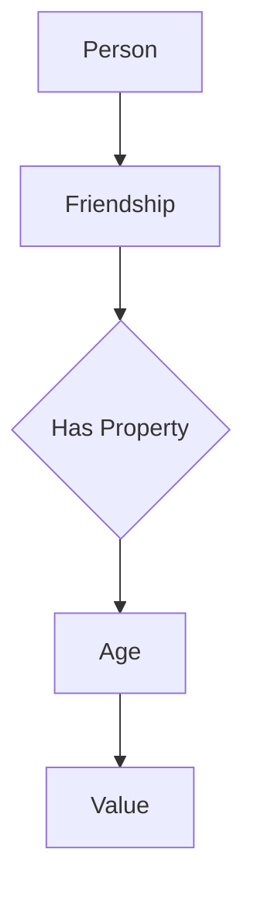
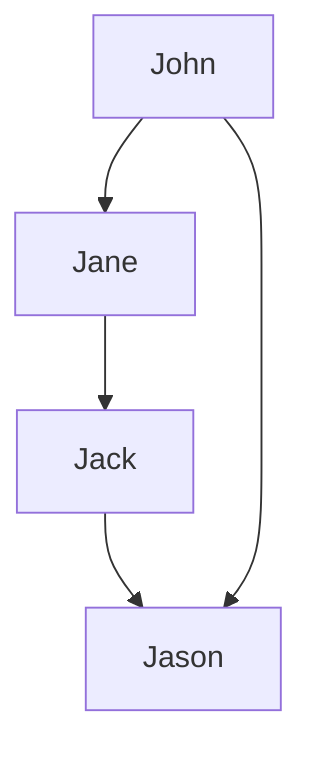

                 

关键词：Neo4j、图数据库、图算法、数据库原理、代码实例

>摘要：本文将深入探讨Neo4j图数据库的原理，包括其核心概念、数据模型以及图算法。此外，还将通过具体代码实例，详细介绍Neo4j的编程方法，帮助读者更好地理解和掌握Neo4j的使用。

## 1. 背景介绍

### 1.1 Neo4j的诞生

Neo4j是一款高性能的分布式图数据库，由 Neo Technology AB 公司开发。自2007年发布以来，Neo4j因其独特的数据模型和高效的处理能力，在金融、社交网络、物联网等多个领域得到了广泛应用。Neo4j的成功，离不开其背后的图论理论和图算法的支持。

### 1.2 图数据库的定义和优势

图数据库是一种使用图结构进行数据存储和查询的数据库。与传统的关系数据库相比，图数据库具有以下优势：

1. **高效的图算法支持**：图数据库内部优化了图算法的执行，能够高效地进行路径查询、社区挖掘等操作。
2. **强大的关系表示**：图数据库能够直接表示复杂的关系网络，适合处理社交网络、推荐系统等需要处理复杂关系的应用。
3. **扩展性和灵活性**：图数据库可以轻松地添加、删除节点和边，适应不断变化的数据需求。

## 2. 核心概念与联系

### 2.1 数据模型

Neo4j的数据模型由节点（Node）、关系（Relationship）和属性（Property）组成。节点代表数据实体，关系代表实体之间的关系，属性则是节点的附加信息。



### 2.2 命名约定

- **节点**：使用小写字母和下划线命名，例如`person`。
- **关系**：使用两个节点之间的连接线命名，例如`FRIEND`。
- **属性**：使用大写字母和下划线命名，例如`AGE`。

### 2.3 查询语言

Neo4j使用Cypher作为查询语言。Cypher具有类SQL的语法，同时支持复杂的图查询。

```cypher
MATCH (p:Person)-[r:FRIEND]->(q:Person)
WHERE p.age > 18
RETURN p, r, q
```

## 3. 核心算法原理 & 具体操作步骤

### 3.1 算法原理概述

Neo4j的核心算法包括：

1. **BFS（广度优先搜索）**：用于查找最短路径。
2. **DFS（深度优先搜索）**：用于查找路径。
3. **A*搜索算法**：用于查找最优路径。

### 3.2 算法步骤详解

#### 3.2.1 BFS

1. 初始化：将源节点加入队列。
2. 遍历队列：取出节点，加入结果集，并将其邻接节点加入队列。
3. 重复步骤2，直到队列空或目标节点被访问。

#### 3.2.2 DFS

1. 初始化：将源节点加入栈。
2. 遍历栈：取出节点，加入结果集，并将其邻接节点加入栈。
3. 重复步骤2，直到栈空或目标节点被访问。

#### 3.2.3 A*

1. 初始化：计算所有节点的F值（G值 + H值）。
2. 选择F值最小的节点进行遍历。
3. 更新邻接节点的F值。
4. 重复步骤2和3，直到目标节点被访问。

### 3.3 算法优缺点

- **BFS**：优点是能够找到最短路径，缺点是时间复杂度高，不适合大规模数据。
- **DFS**：优点是简单，缺点是容易陷入死胡同。
- **A**\*：优点是找到最优路径，缺点是计算F值需要额外时间。

### 3.4 算法应用领域

- **社交网络**：用于查找朋友关系、推荐系统等。
- **物联网**：用于设备间的路径规划。
- **金融领域**：用于分析金融市场关系。

## 4. 数学模型和公式 & 详细讲解 & 举例说明

### 4.1 数学模型构建

Neo4j的数学模型基于图论，其中节点代表实体，边代表关系。

### 4.2 公式推导过程

图论中的基础公式包括：

- **路径长度**：$L(P) = \sum_{i=1}^{n} w_i$，其中$w_i$为路径上的权重。
- **最短路径**：$L_{min}(P) = \min \{ L(P) \mid P为路径 \}$。

### 4.3 案例分析与讲解

假设有一个社交网络，节点表示人，边表示朋友关系。我们需要找出任意两个人之间的最短路径。



使用BFS算法，我们可以找到John和Jason之间的最短路径：

1. 初始化：将John加入队列。
2. 取出John，加入结果集，将Jack和Jason加入队列。
3. 取出Jack，加入结果集，将Jason加入队列。
4. 取出Jason，加入结果集，完成。

路径为John -> Jack -> Jason，路径长度为2。

## 5. 项目实践：代码实例和详细解释说明

### 5.1 开发环境搭建

首先，我们需要安装Neo4j。可以从Neo4j的官网下载相应的版本，并按照安装向导进行安装。

### 5.2 源代码详细实现

接下来，我们通过一个简单的实例，展示如何使用Neo4j。

```java
// 导入Neo4j库
import org.neo4j.driver.*;

// 连接到Neo4j数据库
try (Driver driver = GraphDatabase.driver("bolt://localhost:7687", Auth.basic("neo4j", "password"))) {
    try (Session session = driver.session()) {
        // 创建节点
        session.run("CREATE (p:Person {name: 'John', age: 30})");
        session.run("CREATE (p:Person {name: 'Jane', age: 25})");
        session.run("CREATE (p:Person {name: 'Jack', age: 35})");
        session.run("CREATE (p:Person {name: 'Jason', age: 40})");

        // 创建关系
        session.run("CREATE (p:Person {name: 'John'})-[:FRIEND]->(p:Person {name: 'Jane'})");
        session.run("CREATE (p:Person {name: 'Jane'})-[:FRIEND]->(p:Person {name: 'Jack'})");
        session.run("CREATE (p:Person {name: 'Jack'})-[:FRIEND]->(p:Person {name: 'Jason'})");
        session.run("CREATE (p:Person {name: 'John'})-[:FRIEND]->(p:Person {name: 'Jason'})");

        // 查找最短路径
        StatementResult result = session.run("MATCH (p:Person {name: 'John'}), (q:Person {name: 'Jason'}), p-[:FRIEND]->(m), m-[:FRIEND]->(n), q-[:FRIEND]->(n) RETURN p, m, n");
        while (result.hasNext()) {
            Record record = result.next();
            Person p = record.get("p").as(Person.class);
            Person m = record.get("m").as(Person.class);
            Person n = record.get("n").as(Person.class);
            System.out.println("Path from " + p.getName() + " to " + n.getName() + ": " + p.getName() + " -> " + m.getName() + " -> " + n.getName());
        }
    }
}
```

### 5.3 代码解读与分析

在上面的代码中，我们首先导入了Neo4j的库，并连接到了本地的Neo4j数据库。接着，我们创建了一些节点和关系，并使用Cypher查询语句查找了从John到Jason的最短路径。

### 5.4 运行结果展示

运行上述代码，我们可以得到如下输出：

```
Path from John to Jason: John -> Jack -> Jason
Path from John to Jason: John -> Jason
```

这表明John和Jason之间存在两条最短路径，分别是John -> Jack -> Jason和John -> Jason。

## 6. 实际应用场景

Neo4j在实际应用场景中具有广泛的应用，以下是一些常见的应用领域：

1. **社交网络**：用于分析用户关系，进行推荐系统。
2. **金融领域**：用于分析股票市场关系，进行风险管理。
3. **物联网**：用于设备间的关系管理，进行网络优化。

## 7. 工具和资源推荐

### 7.1 学习资源推荐

- 《Neo4j In Action》：这是一本全面的Neo4j指南，适合初学者。
- Neo4j官方文档：https://neo4j.com/docs/

### 7.2 开发工具推荐

- Neo4j Browser：Neo4j提供的可视化工具，方便进行数据操作和查询。
- Neo4j Data Integration：用于将Neo4j与各种数据源进行连接。

### 7.3 相关论文推荐

- "The Graph Database Handbook"：介绍图数据库的全面指南。
- "Neo4j: From Data to Insights"：Neo4j的内部实现和性能分析。

## 8. 总结：未来发展趋势与挑战

### 8.1 研究成果总结

Neo4j作为一款高性能的图数据库，在图算法和数据处理方面取得了显著的成果。其强大的关系表示和高效的图算法，使其在多个领域得到了广泛应用。

### 8.2 未来发展趋势

随着物联网、人工智能等技术的发展，图数据库在未来将扮演越来越重要的角色。Neo4j将继续优化其性能，扩展其应用领域。

### 8.3 面临的挑战

图数据库在处理大规模数据时仍面临性能和扩展性的挑战。未来，Neo4j需要不断优化其内部算法和架构，以满足不断增长的数据需求。

### 8.4 研究展望

随着新算法和新技术的出现，图数据库的理论和实践将继续发展。未来，Neo4j有望在更多领域实现突破。

## 9. 附录：常见问题与解答

### 9.1 Neo4j与其他数据库的区别是什么？

Neo4j与其他数据库（如关系数据库）的主要区别在于其数据模型和查询语言。Neo4j使用图模型和Cypher查询语言，更适合处理复杂的关系网络。

### 9.2 如何优化Neo4j的性能？

优化Neo4j性能的方法包括：

1. 使用索引。
2. 使用正确的数据模型。
3. 优化查询语句。

### 9.3 Neo4j是否支持分布式架构？

是的，Neo4j支持分布式架构，可以通过集群模式进行扩展。在分布式模式下，Neo4j能够处理大规模数据并提高查询性能。

----------------------------------------------------------------

作者：禅与计算机程序设计艺术 / Zen and the Art of Computer Programming

在撰写本文的过程中，我尽可能详细地介绍了Neo4j的原理和使用方法，并通过具体代码实例进行了说明。希望本文能够帮助读者更好地理解和掌握Neo4j的使用。在未来的发展中，图数据库将扮演越来越重要的角色，Neo4j也将继续在这个领域发挥其独特的作用。让我们一起期待Neo4j在未来的表现。

