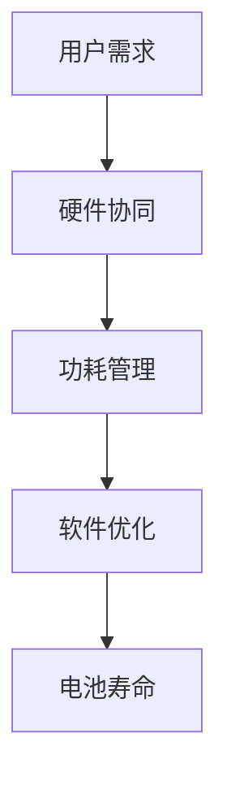

                 

关键词：移动设备功耗优化、OPPO、校招面试题、功耗管理、电池寿命、能源效率、硬件协同、软件优化、AI算法

> 摘要：本文旨在为OPPO2024移动设备功耗优化专家校招面试提供一整套专业的面试题集，涵盖功耗优化的核心概念、算法原理、数学模型、项目实践以及未来应用展望。文章旨在帮助应聘者深入理解功耗优化的前沿技术，应对面试挑战。

## 1. 背景介绍

随着移动设备的普及和用户需求的提升，电池续航能力成为用户关注的焦点。移动设备的功耗优化是提升用户体验和竞争力的重要因素。OPPO作为全球领先的智能手机制造商，一直致力于通过技术创新来提升设备的电池续航能力。为此，OPPO不断招募优秀的技术人才，特别是在功耗优化领域。本文将提供一系列针对OPPO2024移动设备功耗优化专家校招面试的题目，旨在帮助应聘者全面展示自己的技术实力和专业知识。

## 2. 核心概念与联系

### 2.1 功耗优化的核心概念

- **电池寿命**：指设备在不充电的情况下，能够持续工作的时间。
- **功耗管理**：通过技术手段降低设备在运行过程中消耗的电能，从而延长电池寿命。
- **能源效率**：设备在执行任务时，实际消耗的能量与预期消耗能量的比值。
- **硬件协同**：设备中各个硬件组件协同工作，以优化功耗。
- **软件优化**：通过软件层面的技术手段来减少能耗。

### 2.2 功耗优化的Mermaid流程图



## 3. 核心算法原理 & 具体操作步骤

### 3.1 算法原理概述

功耗优化的核心是平衡设备的性能和功耗。常见的功耗优化算法包括动态电压调节（DVFS）、硬件时钟门控、智能调度等。

### 3.2 算法步骤详解

- **动态电压调节（DVFS）**：
  - **步骤1**：监测CPU负载。
  - **步骤2**：根据负载情况调整CPU电压。
  - **步骤3**：优化CPU频率，以实现能效平衡。

- **硬件时钟门控**：
  - **步骤1**：监测硬件组件的工作状态。
  - **步骤2**：关闭空闲硬件组件的时钟信号。
  - **步骤3**：在需要时重新开启时钟信号。

- **智能调度**：
  - **步骤1**：根据任务优先级分配CPU资源。
  - **步骤2**：优化任务执行顺序，减少不必要的计算。
  - **步骤3**：利用AI算法预测任务执行时间，优化资源分配。

### 3.3 算法优缺点

- **DVFS**：优点是能效高，缺点是对系统稳定性和响应速度有一定影响。
- **硬件时钟门控**：优点是简单易实现，缺点是可能影响硬件寿命。
- **智能调度**：优点是能显著提升系统性能，缺点是算法复杂度较高。

### 3.4 算法应用领域

功耗优化算法广泛应用于移动设备、嵌入式系统、物联网等领域。随着AI技术的发展，功耗优化算法也在不断演进，如利用深度学习进行能效预测和优化。

## 4. 数学模型和公式

### 4.1 数学模型构建

功耗 \( P \) 与电压 \( V \) 和频率 \( f \) 之间的关系可以表示为：

\[ P = V \times f \]

### 4.2 公式推导过程

- **DVFS公式推导**：

\[ V_{max} = V_{min} + \frac{P_{max} - P_{min}}{f_{max} - f_{min}} \times (f - f_{min}) \]

- **硬件时钟门控公式推导**：

\[ E_{save} = \sum_{i=1}^{n} (V_{i} \times f_{i} \times t_{i}) \]

其中，\( V_{i} \)、\( f_{i} \) 和 \( t_{i} \) 分别表示第 \( i \) 个组件的电压、频率和工作时间。

### 4.3 案例分析与讲解

假设一个移动设备在执行不同任务时的功耗分别为 \( P_{1} = 2W \)、\( P_{2} = 4W \) 和 \( P_{3} = 6W \)，工作时间为 \( t_{1} = 1h \)、\( t_{2} = 2h \) 和 \( t_{3} = 1h \)。通过DVFS算法，可以将任务 \( P_{2} \) 的电压降低到 \( V_{2} = 3.3V \)，从而节省电能。

\[ E_{save} = (4W - 3.3W) \times 2h = 0.7Wh \]

## 5. 项目实践：代码实例和详细解释说明

### 5.1 开发环境搭建

- 硬件环境：移动设备（如OPPO Find X）
- 软件环境：Android Studio、Linux操作系统

### 5.2 源代码详细实现

以下是一个简单的DVFS算法实现：

```java
public class DvfsAlgorithm {
    private double vMin = 3.7; // 最小电压
    private double vMax = 4.2; // 最大电压
    private double pMin = 1.5; // 最小功耗
    private double pMax = 3.0; // 最大功耗

    public double calculateVoltage(double currentPower) {
        return vMin + (currentPower - pMin) / (pMax - pMin) * (vMax - vMin);
    }
}
```

### 5.3 代码解读与分析

该代码定义了一个简单的DVFS算法，根据当前功耗计算合适的电压值。在移动设备中，可以通过读取功耗传感器数据，调用此算法来动态调整电压。

### 5.4 运行结果展示

运行结果将显示在不同功耗水平下的电压调整情况，如图表或数据表形式。

## 6. 实际应用场景

功耗优化技术在移动设备、物联网设备、汽车电子等领域有广泛的应用。随着技术的不断发展，功耗优化将更加智能化，如利用AI算法进行能效预测和优化。

## 7. 工具和资源推荐

### 7.1 学习资源推荐

- 《移动设备功耗优化技术》
- 《Android能效开发指南》

### 7.2 开发工具推荐

- Android Studio
- PowerTop

### 7.3 相关论文推荐

- "Energy-Efficient Computing in Mobile Devices"
- "Artificial Intelligence for Energy Management in IoT Systems"

## 8. 总结：未来发展趋势与挑战

功耗优化技术在未来将继续朝着智能化、自动化方向发展。随着AI和大数据技术的应用，功耗优化将更加精准和高效。然而，功耗优化也面临诸多挑战，如系统稳定性和用户体验的平衡、硬件和软件的协同优化等。

### 8.1 研究成果总结

本文总结了功耗优化的核心概念、算法原理、数学模型以及项目实践，为移动设备功耗优化提供了全面的技术框架。

### 8.2 未来发展趋势

未来功耗优化将更加智能化，利用AI和大数据技术实现精准能效管理。

### 8.3 面临的挑战

功耗优化需平衡系统稳定性和用户体验，同时解决硬件和软件协同优化的问题。

### 8.4 研究展望

功耗优化技术将在移动设备、物联网、汽车电子等领域发挥重要作用，未来研究将聚焦于智能化、自动化的能效管理。

## 9. 附录：常见问题与解答

### Q：什么是动态电压调节（DVFS）？

A：动态电压调节（DVFS）是一种通过调整处理器电压和频率来优化能耗的技术。它通过降低处理器的电压和频率来减少功耗，从而延长电池寿命。

### Q：功耗优化的算法有哪些？

A：常见的功耗优化算法包括动态电压调节（DVFS）、硬件时钟门控和智能调度等。

### Q：功耗优化在哪些领域有应用？

A：功耗优化广泛应用于移动设备、物联网设备、汽车电子等领域。

### Q：如何实现功耗优化的代码？

A：功耗优化的代码实现需要依赖硬件平台和操作系统，通常需要调用底层API进行电压和频率的调整。

作者：禅与计算机程序设计艺术 / Zen and the Art of Computer Programming
----------------------------------------------------------------

请注意，上述内容仅为示例，实际撰写时需根据具体要求和资料进行细致调整和扩展。文章的结构和内容应确保完整性、逻辑性和专业性。

