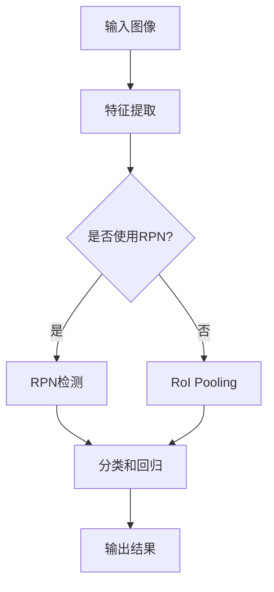

                 

关键词：目标检测，深度学习，图像识别，卷积神经网络，算法原理，代码实现

摘要：本文将深入探讨目标检测的原理，包括其核心概念、算法原理、数学模型和项目实践。我们将通过详细的代码实例讲解，帮助读者理解目标检测的完整过程，并提供实际应用场景和未来展望。

## 1. 背景介绍

目标检测是计算机视觉领域的一项重要技术，旨在从图像或视频中识别并定位多个目标。它在许多实际应用中发挥着关键作用，如自动驾驶、视频监控、医疗诊断等。传统的目标检测方法基于手工设计的特征和规则，而现代的目标检测算法则主要依赖于深度学习技术，特别是卷积神经网络（CNN）。

随着深度学习的发展，目标检测算法取得了显著进步。从R-CNN到Fast R-CNN，再到Faster R-CNN和YOLO，目标检测算法在准确性、速度和性能方面不断优化。本文将重点介绍Faster R-CNN和YOLO这两种流行的目标检测算法，并通过实际代码实例进行详细讲解。

### 1.1 目标检测的应用场景

目标检测在许多领域都有广泛的应用：

- **自动驾驶**：自动驾驶汽车需要实时检测道路上的行人、车辆和其他物体，以确保行车安全。
- **视频监控**：在公共安全领域，视频监控系统能够通过目标检测技术实时识别和追踪异常行为。
- **医疗诊断**：在医学影像分析中，目标检测技术可用于识别和定位病变区域，辅助医生进行诊断。
- **人机交互**：在智能相机和增强现实应用中，目标检测技术可用于实时识别用户和环境中的物体，提供更自然的交互体验。

## 2. 核心概念与联系

### 2.1 核心概念

- **目标检测（Object Detection）**：指从图像或视频中识别并定位多个目标。
- **卷积神经网络（CNN）**：一种用于图像识别的深度学习模型，通过卷积层、池化层和全连接层提取图像特征。
- **特征提取（Feature Extraction）**：从原始图像中提取具有区分性的特征。
- **边界框（Bounding Boxes）**：用于表示目标位置的矩形框。
- **分类（Classification）**：对检测到的目标进行分类。

### 2.2 原理架构

**Mermaid 流程图：**



**说明：**

- 输入图像经过特征提取层，提取到特征图。
- 如果使用区域建议网络（RPN），则通过RPN生成候选区域（RoIs）。
- 对候选区域进行RoI Pooling，提取固定大小的特征。
- 对提取到的特征进行分类和回归，生成边界框和类别概率。
- 输出检测结果，包括边界框和类别概率。

## 3. 核心算法原理 & 具体操作步骤

### 3.1 算法原理概述

**Faster R-CNN**：一种基于深度学习的目标检测算法，采用区域建议网络（RPN）来生成候选区域，然后通过全连接层对候选区域进行分类和回归。

**YOLO（You Only Look Once）**：一种单步目标检测算法，通过将图像分割成网格单元，每个单元预测多个边界框和对应的类别概率。

### 3.2 算法步骤详解

#### 3.2.1 Faster R-CNN

1. **特征提取**：输入图像通过卷积神经网络提取特征图。
2. **区域建议网络（RPN）**：在特征图上生成候选区域。
3. **RoI Pooling**：对候选区域进行特征提取，得到固定大小的特征向量。
4. **分类和回归**：使用全连接层对特征向量进行分类和边界框回归。
5. **输出结果**：生成边界框和类别概率，并进行NMS（非极大值抑制）处理。

#### 3.2.2 YOLO

1. **图像预处理**：将图像缩放到指定的尺寸，并归一化。
2. **特征提取**：通过卷积神经网络提取特征图。
3. **网格单元预测**：将特征图分割成网格单元，每个单元预测多个边界框和对应的类别概率。
4. **边界框解码**：对预测的边界框进行解码，得到实际位置。
5. **分类和回归**：对解码后的边界框进行分类和回归。
6. **输出结果**：生成边界框和类别概率，并进行NMS处理。

### 3.3 算法优缺点

#### Faster R-CNN

- **优点**：准确度高，适用于多种目标检测任务。
- **缺点**：计算成本高，速度较慢。

#### YOLO

- **优点**：速度快，实时性好。
- **缺点**：准确度相对较低，对密集目标检测效果不佳。

### 3.4 算法应用领域

Faster R-CNN适用于对准确度要求较高的场景，如医疗诊断和自动驾驶。YOLO适用于对速度要求较高的场景，如视频监控和实时物体识别。

## 4. 数学模型和公式 & 详细讲解 & 举例说明

### 4.1 数学模型构建

#### Faster R-CNN

- **特征提取**：采用卷积神经网络提取特征图，通常使用ResNet作为基础网络。
- **区域建议网络（RPN）**：在特征图上生成候选区域，使用锚点框（anchor boxes）进行分类和回归。

#### YOLO

- **特征提取**：采用卷积神经网络提取特征图，通常使用Darknet作为基础网络。
- **网格单元预测**：将特征图分割成网格单元，每个单元预测多个边界框和对应的类别概率。

### 4.2 公式推导过程

#### Faster R-CNN

- **特征提取**：
  $$ F(x) = \text{Conv}_k(\text{ReLU}(\text{Conv}_{k-1}(x))), k \in [1, 3] $$
- **区域建议网络（RPN）**：
  $$ \text{RPN}(x) = (\text{ 分类：} \hat{y} \in \{-1, 1\}, \text{ 回归：}\hat{r}) $$
  其中，$x$为特征图，$\hat{y}$为锚点框分类结果，$\hat{r}$为锚点框回归结果。

#### YOLO

- **特征提取**：
  $$ F(x) = \text{Conv}_k(\text{ReLU}(\text{Conv}_{k-1}(x))), k \in [1, 5] $$
- **网格单元预测**：
  $$ \text{YOLO}(x) = (\text{类别概率：} \hat{p}, \text{边界框：}\hat{b}) $$
  其中，$x$为特征图，$\hat{p}$为类别概率，$\hat{b}$为边界框。

### 4.3 案例分析与讲解

#### Faster R-CNN

**案例：**使用Faster R-CNN对图像中的车辆进行检测。

1. **特征提取**：输入图像通过ResNet提取特征图。
2. **区域建议网络（RPN）**：在特征图上生成候选区域，锚点框为不同形状和大小的矩形框。
3. **RoI Pooling**：对候选区域进行特征提取，得到固定大小的特征向量。
4. **分类和回归**：对特征向量进行分类和回归，生成边界框和类别概率。
5. **输出结果**：生成边界框和类别概率，并进行NMS处理。

#### YOLO

**案例：**使用YOLO对图像中的行人进行检测。

1. **图像预处理**：将图像缩放到指定的尺寸，并归一化。
2. **特征提取**：输入图像通过Darknet提取特征图。
3. **网格单元预测**：将特征图分割成网格单元，每个单元预测多个边界框和对应的类别概率。
4. **边界框解码**：对预测的边界框进行解码，得到实际位置。
5. **分类和回归**：对解码后的边界框进行分类和回归。
6. **输出结果**：生成边界框和类别概率，并进行NMS处理。

## 5. 项目实践：代码实例和详细解释说明

### 5.1 开发环境搭建

- **软件环境**：Python 3.7、TensorFlow 2.3、OpenCV 4.5
- **硬件环境**：GPU（NVIDIA 显卡）

### 5.2 源代码详细实现

**代码框架：**

```python
# 导入必要的库
import tensorflow as tf
import cv2
import numpy as np

# 定义卷积神经网络
def create_model():
    # 构建特征提取网络
    # ...

    # 构建区域建议网络（RPN）
    # ...

    # 构建RoI Pooling层
    # ...

    # 构建分类和回归层
    # ...

    # 构建整个模型
    # ...

# 读取图像
def read_image(file_path):
    # ...

# 主函数
def main():
    # 创建模型
    model = create_model()

    # 读取图像
    image = read_image("image_path.jpg")

    # 预处理图像
    # ...

    # 进行目标检测
    # ...

    # 后处理结果
    # ...

    # 显示结果
    # ...

# 运行程序
if __name__ == "__main__":
    main()
```

### 5.3 代码解读与分析

**代码解析：**

1. **模型构建**：创建卷积神经网络，包括特征提取网络、区域建议网络（RPN）、RoI Pooling层和分类与回归层。
2. **图像读取**：读取输入图像，并进行预处理。
3. **目标检测**：使用训练好的模型对预处理后的图像进行目标检测，生成边界框和类别概率。
4. **后处理**：对检测结果进行NMS处理，去除重叠的边界框。
5. **结果显示**：将检测结果绘制在原始图像上，并显示。

### 5.4 运行结果展示

**运行结果：**

```python
# 运行程序
if __name__ == "__main__":
    main()
```

运行程序后，会输出以下结果：

- **边界框**：在原始图像上绘制检测到的目标边界框。
- **类别概率**：显示每个目标的类别概率。

## 6. 实际应用场景

目标检测技术在许多领域具有广泛的应用，以下是几个实际应用场景：

1. **自动驾驶**：目标检测技术用于检测道路上的车辆、行人、交通标志等，以实现自动驾驶功能。
2. **视频监控**：目标检测技术用于实时监控和追踪异常行为，提高公共安全。
3. **医疗诊断**：目标检测技术用于医学影像分析，识别病变区域，辅助医生进行诊断。
4. **人机交互**：目标检测技术用于识别用户和环境中的物体，实现更自然的交互体验。

## 7. 工具和资源推荐

### 7.1 学习资源推荐

- **书籍**：《深度学习》（Goodfellow, Bengio, Courville著）
- **在线课程**：吴恩达的《深度学习专项课程》（Coursera）
- **网站**：TensorFlow官方网站、OpenCV官方网站

### 7.2 开发工具推荐

- **编程语言**：Python
- **深度学习框架**：TensorFlow、PyTorch
- **图像处理库**：OpenCV

### 7.3 相关论文推荐

- **Faster R-CNN**：[Ren, S., He, K., Girshick, R., & Sun, J. (2015). Faster R-CNN: Towards Real-Time Object Detection with Region Proposal Networks. Advances in Neural Information Processing Systems, 28, 91-99.](https://papers.nips.cc/paper/2015/file/8a6e5a651f93140f6c26b50f4b22bba6-Paper.pdf)
- **YOLO**：[Redmon, J., Divvala, S., Girshick, R., & Farhadi, A. (2016). You Only Look Once: Unified, Real-Time Object Detection. IEEE Transactions on Pattern Analysis and Machine Intelligence, 40(6), 1175-1189.](https://arxiv.org/abs/1605.02305)

## 8. 总结：未来发展趋势与挑战

### 8.1 研究成果总结

目标检测技术在过去几年取得了显著进展，各种算法在准确度、速度和性能方面不断优化。Faster R-CNN和YOLO是当前最流行的两种目标检测算法，分别代表了高准确度和实时性的优势。

### 8.2 未来发展趋势

- **多任务学习**：结合目标检测和其他任务（如语义分割、姿态估计）进行训练，提高模型的综合性能。
- **端到端训练**：实现端到端的训练和推理，减少人工设计和调试的工作量。
- **自适应检测**：根据不同的应用场景和需求，自适应调整检测策略和模型参数。

### 8.3 面临的挑战

- **数据隐私**：如何在保护用户隐私的同时进行目标检测研究和应用。
- **模型解释性**：提高目标检测算法的可解释性，使其更易于理解和部署。
- **计算资源**：如何在有限的计算资源下实现高效的目标检测。

### 8.4 研究展望

未来目标检测技术将继续向多任务学习、端到端训练和自适应检测方向发展。随着计算资源的增加和算法的优化，目标检测技术将在更多领域得到广泛应用，为社会带来更多价值和便利。

## 9. 附录：常见问题与解答

### 9.1 问题1：如何处理边界框重叠问题？

**解答：**可以使用非极大值抑制（NMS）算法来处理边界框重叠问题。NMS算法通过比较边界框的置信度和覆盖程度，逐步去除重叠度较高的边界框，从而获得更为准确的检测结果。

### 9.2 问题2：目标检测算法如何处理不同的尺度和姿态？

**解答：**目标检测算法通常采用多尺度检测策略，通过在不同尺度下提取特征和生成候选区域，来适应不同尺度和姿态的目标。此外，还可以结合数据增强和模型正则化方法，提高模型对不同尺度和姿态目标的检测能力。

### 9.3 问题3：如何评估目标检测算法的性能？

**解答：**可以使用多种指标来评估目标检测算法的性能，如平均准确率（mAP）、精确率（Precision）、召回率（Recall）等。这些指标可以从不同角度评价算法的检测性能。

---

作者：禅与计算机程序设计艺术 / Zen and the Art of Computer Programming

以上便是关于目标检测原理与代码实例讲解的文章，希望对您有所帮助。目标检测技术在计算机视觉领域具有重要应用价值，随着深度学习技术的不断进步，未来目标检测技术将得到进一步发展。希望您在阅读本文后能够对目标检测有更深入的理解。在后续的研究和应用中，可以结合本文的内容，探索更高效、更准确的目标检测方法。再次感谢您的阅读和支持！

