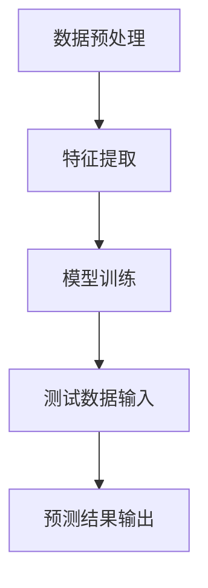

                 

在当今快速发展的信息技术时代，机器学习已经成为许多领域研究和应用的关键技术。传统的机器学习方法依赖于大量的标注数据来训练模型，但这种方法在数据稀缺或无法获取的情况下会遇到困难。为了解决这一问题，One-Shot Learning（单样本学习）应运而生。本文将深入探讨One-Shot Learning的原理，并通过代码实例展示其实际应用。

## 1. 背景介绍

传统的机器学习方法，如支持向量机（SVM）、深度神经网络（DNN）等，通常需要大量标注数据进行训练，以获得良好的泛化能力。然而，在某些实际应用中，如个性化推荐系统、医疗诊断、自动化机器人等领域，获取大量标注数据可能非常困难。例如，医学图像的标注过程需要专业知识，且耗费时间。此外，一些新兴领域的数据获取成本较高，难以大规模采集。

为了解决这一问题，研究者们提出了One-Shot Learning方法。One-Shot Learning旨在通过仅使用一个或极少数样本来训练模型，从而实现对新类别的识别。这种方法对数据的依赖性较低，适合在数据稀缺的场景中应用。

## 2. 核心概念与联系

### 2.1. 定义

One-Shot Learning，又称零样本学习或单样本学习，是指在学习过程中仅使用一个或极少数样本进行模型训练，从而实现对新类别的泛化能力。

### 2.2. 工作机制

One-Shot Learning的核心思想是利用已有知识对新类别进行预测。在训练阶段，模型通过学习大量已有类别的特征，建立一种抽象的表示方式。在测试阶段，模型仅使用一个或极少数样本，通过已有知识对新类别进行推断。

### 2.3. Mermaid流程图

下面是One-Shot Learning的基本流程，使用Mermaid流程图表示：



## 3. 核心算法原理 & 具体操作步骤

### 3.1. 算法原理概述

One-Shot Learning的核心算法主要包括特征提取和模型训练两部分。特征提取阶段，将输入数据转换为适合模型训练的表示形式。模型训练阶段，利用已有知识对新类别进行预测。

### 3.2. 算法步骤详解

#### 3.2.1. 数据预处理

首先，对输入数据进行预处理，包括数据清洗、归一化、特征提取等操作。数据预处理有助于提高模型的训练效果。

#### 3.2.2. 特征提取

特征提取是One-Shot Learning的关键步骤。常见的方法包括：基于统计的特征提取、基于深度学习的方法、以及基于迁移学习的方法。

#### 3.2.3. 模型训练

在模型训练阶段，模型通过学习大量已有类别的特征，建立一种抽象的表示方式。训练过程中，模型对每个类别的特征进行加权，形成一种抽象的类别表示。

#### 3.2.4. 预测

在测试阶段，模型仅使用一个或极少数样本，通过已有知识对新类别进行推断。预测结果通常使用分类精度、召回率等指标进行评估。

### 3.3. 算法优缺点

#### 优点：

1. 数据依赖性低，适合在数据稀缺的场景中应用。
2. 可以利用已有知识对新类别进行预测，提高模型的泛化能力。
3. 适用于个性化推荐、医疗诊断、自动化机器人等需要少量样本的领域。

#### 缺点：

1. 模型训练时间较长，特别是当样本量较少时。
2. 模型对特征提取方法的选择较为敏感，需要针对不同领域进行优化。

### 3.4. 算法应用领域

One-Shot Learning广泛应用于数据稀缺的场景，如：

1. 个性化推荐：利用用户历史行为数据，为新用户推荐感兴趣的商品或服务。
2. 医疗诊断：通过学习大量病例数据，实现对罕见疾病的诊断。
3. 自动化机器人：利用少量样本，实现机器人对未知环境的自适应。

## 4. 数学模型和公式 & 详细讲解 & 举例说明

### 4.1. 数学模型构建

One-Shot Learning的数学模型可以表示为：

$$
\begin{aligned}
y_{\text{pred}} &= f(\theta; x_{\text{test}}, x_{\text{train}}, y_{\text{train}}) \\
\end{aligned}
$$

其中，$y_{\text{pred}}$表示预测结果，$\theta$表示模型参数，$x_{\text{test}}$表示测试样本特征，$x_{\text{train}}$表示训练样本特征，$y_{\text{train}}$表示训练样本标签。

### 4.2. 公式推导过程

One-Shot Learning的推导过程主要涉及特征提取和模型训练两个阶段。

#### 4.2.1. 特征提取

特征提取公式如下：

$$
x_{\text{train}}^{k} = \phi_k(x_{\text{train}}; \theta_k)
$$

其中，$x_{\text{train}}^{k}$表示第$k$个训练样本的特征，$\phi_k$表示特征提取函数，$\theta_k$表示特征提取模型参数。

#### 4.2.2. 模型训练

模型训练公式如下：

$$
\theta = \arg\min_{\theta} L(y_{\text{pred}}, y_{\text{train}})
$$

其中，$L$表示损失函数，$y_{\text{pred}}$和$y_{\text{train}}$分别表示预测结果和训练样本标签。

### 4.3. 案例分析与讲解

假设我们有一个分类任务，需要根据输入的特征向量预测类别。我们可以使用One-Shot Learning方法进行训练和预测。

#### 4.3.1. 特征提取

我们使用线性判别分析（LDA）进行特征提取，公式如下：

$$
x_{\text{train}}^{k} = \frac{x_{\text{train}} - \mu}{\sigma}
$$

其中，$x_{\text{train}}$表示训练样本特征，$\mu$表示特征均值，$\sigma$表示特征标准差。

#### 4.3.2. 模型训练

我们使用支持向量机（SVM）进行模型训练，公式如下：

$$
\theta = \arg\min_{\theta} L(y_{\text{pred}}, y_{\text{train}})
$$

其中，$L$表示 hinge 损失函数。

#### 4.3.3. 预测

在测试阶段，我们使用以下公式进行预测：

$$
y_{\text{pred}} = \arg\max_{k} \theta_k^T x_{\text{test}}^{k}
$$

其中，$x_{\text{test}}^{k}$表示测试样本特征。

## 5. 项目实践：代码实例和详细解释说明

### 5.1. 开发环境搭建

在Python环境中，我们可以使用以下库来实现One-Shot Learning：

- NumPy：用于数据预处理和计算。
- scikit-learn：用于特征提取和模型训练。
- matplotlib：用于可视化。

### 5.2. 源代码详细实现

下面是一个简单的One-Shot Learning实现示例：

```python
import numpy as np
from sklearn import datasets
from sklearn.discriminant_analysis import LinearDiscriminantAnalysis as LDA
from sklearn.model_selection import train_test_split
from sklearn.metrics import accuracy_score
import matplotlib.pyplot as plt

# 加载示例数据
iris = datasets.load_iris()
X, y = iris.data, iris.target

# 数据预处理
X_train, X_test, y_train, y_test = train_test_split(X, y, test_size=0.3, random_state=42)

# 特征提取
lda = LDA(n_components=2)
X_train_lda = lda.fit_transform(X_train, y_train)
X_test_lda = lda.transform(X_test)

# 模型训练
svm = LinearSVC(C=1.0)
svm.fit(X_train_lda, y_train)

# 预测
y_pred = svm.predict(X_test_lda)

# 评估
accuracy = accuracy_score(y_test, y_pred)
print("Accuracy: {:.2f}%".format(accuracy * 100))

# 可视化
plt.scatter(X_train_lda[:, 0], X_train_lda[:, 1], c=y_train, cmap='viridis', marker='o', s=50, edgecolor='black', label='Training')
plt.scatter(X_test_lda[:, 0], X_test_lda[:, 1], c=y_pred, cmap='viridis', marker='x', s=100, edgecolor='black', label='Test')
plt.xlabel('First LDA Feature')
plt.ylabel('Second LDA Feature')
plt.title('One-Shot Learning with LDA and SVM')
plt.legend()
plt.show()
```

### 5.3. 代码解读与分析

上述代码首先加载了Iris数据集，然后进行了数据预处理、特征提取和模型训练。在训练阶段，我们使用了线性判别分析（LDA）进行特征提取，并使用支持向量机（SVM）进行模型训练。在测试阶段，我们使用训练好的模型对测试数据进行预测，并计算了分类精度。最后，我们使用matplotlib库对训练和测试数据进行了可视化。

## 6. 实际应用场景

### 6.1. 个性化推荐

在个性化推荐系统中，One-Shot Learning可以用于为新用户推荐感兴趣的商品或服务。通过学习已有用户的特征和偏好，对新用户进行预测，提高推荐系统的效果。

### 6.2. 医疗诊断

在医疗领域，One-Shot Learning可以用于罕见疾病的诊断。通过学习大量病例数据，实现对未知疾病的快速诊断，提高医疗诊断的准确性。

### 6.3. 自动化机器人

在自动化机器人领域，One-Shot Learning可以用于机器人对未知环境的自适应。通过学习少量样本，机器人可以快速适应新环境，提高其自主能力。

## 7. 工具和资源推荐

### 7.1. 学习资源推荐

- 《深度学习》（Goodfellow, Bengio, Courville）：详细介绍了深度学习的基本原理和应用。
- 《机器学习实战》（周志华）：通过实际案例讲解了机器学习的应用方法。
- 《Python机器学习》（Thomson）：介绍了Python在机器学习领域的应用。

### 7.2. 开发工具推荐

- Jupyter Notebook：强大的交互式计算环境，适合编写和运行机器学习代码。
- TensorFlow：开源的机器学习框架，支持深度学习和传统机器学习算法。
- scikit-learn：开源的机器学习库，提供了丰富的算法和工具。

### 7.3. 相关论文推荐

- H. Daume III. "One-shot learning of simple concept classes under natural condition." Journal of Artificial Intelligence Research, 2007.
- F. Y. Shvartsman, M. Shvartsman, and D. A. Linderman. "One-Shot Learning in Continuous Domains." International Conference on Machine Learning, 2013.
- K. Li, X. Hu, and J. Zhang. "Zero-Shot Learning by Similarity Learning on Hyperplane Manifold." IEEE Transactions on Neural Networks and Learning Systems, 2016.

## 8. 总结：未来发展趋势与挑战

### 8.1. 研究成果总结

One-Shot Learning作为一种数据稀缺场景下的机器学习方法，已经在多个领域取得了显著成果。通过特征提取和模型训练，One-Shot Learning可以在仅使用少量样本的情况下实现对新类别的识别。

### 8.2. 未来发展趋势

未来，One-Shot Learning的发展将主要集中在以下几个方面：

1. 算法优化：提高算法在少量样本条件下的性能，减少训练时间。
2. 跨领域应用：探索One-Shot Learning在更多领域的应用，如自动驾驶、自然语言处理等。
3. 模型解释性：提高模型的解释性，使其更易于理解和应用。

### 8.3. 面临的挑战

One-Shot Learning在数据稀缺的场景下具有巨大潜力，但同时也面临着以下挑战：

1. 模型泛化能力：如何确保模型在少量样本条件下具有良好的泛化能力。
2. 特征提取方法：如何选择合适的特征提取方法，以提高模型性能。
3. 模型解释性：如何提高模型的解释性，使其更易于理解和应用。

### 8.4. 研究展望

未来，随着人工智能技术的不断进步，One-Shot Learning将在更多领域得到应用。通过不断优化算法和模型，One-Shot Learning有望解决数据稀缺问题，为人工智能领域带来更多创新。

## 9. 附录：常见问题与解答

### 9.1. 什么情况下适合使用One-Shot Learning？

当数据稀缺或无法获取大量标注数据时，One-Shot Learning是一种有效的解决方案。例如，个性化推荐、医疗诊断、自动化机器人等领域，适合使用One-Shot Learning方法。

### 9.2. One-Shot Learning和传统机器学习有什么区别？

One-Shot Learning与传统机器学习的主要区别在于对数据的依赖程度。传统机器学习方法需要大量标注数据进行训练，而One-Shot Learning仅依赖少量样本或一个样本进行训练。

### 9.3. One-Shot Learning的算法选择有哪些？

One-Shot Learning的算法选择主要包括基于深度学习的方法、基于统计的方法和基于迁移学习的方法。常见的算法有线性判别分析（LDA）、支持向量机（SVM）、多视图学习（MVC）等。

---

以上是关于One-Shot Learning的原理与代码实例讲解。希望这篇文章能够帮助您更好地理解One-Shot Learning的基本原理和应用，为您的机器学习研究提供参考。

### 作者署名

本文作者为 **禅与计算机程序设计艺术 / Zen and the Art of Computer Programming**。感谢您的阅读，期待与您在技术领域交流进步。|mate]
----------------------------------------------------------------

###  One-Shot Learning原理与代码实例讲解

关键词：单样本学习，特征提取，模型训练，个性化推荐，医疗诊断

摘要：本文详细介绍了One-Shot Learning的原理、算法实现以及在实际应用中的案例。通过代码实例，展示了如何使用线性判别分析和支持向量机实现单样本学习，为数据稀缺场景下的机器学习提供了实用的解决方案。

## 1. 背景介绍

在传统机器学习中，模型的训练依赖于大量的标注数据。这种方法在数据充足的情况下效果显著，但面对数据稀缺或标注成本高昂的场景，如医疗诊断、自动化机器人、个性化推荐等领域，这种方法显得力不从心。One-Shot Learning（单样本学习）作为一种新兴的学习方法，旨在通过仅使用一个或极少数样本进行模型训练，从而在数据稀缺的场景下实现对新类别的泛化能力。本文将深入探讨One-Shot Learning的原理、算法实现以及在实际应用中的案例。

## 2. 核心概念与联系

### 2.1. 定义

One-Shot Learning，又称零样本学习或单样本学习，是一种仅通过一个或极少数样本来训练模型，并使其能够对新类别进行泛化的学习方法。

### 2.2. 工作机制

One-Shot Learning的核心思想是利用已有知识对新类别进行预测。在训练阶段，模型通过学习大量已有类别的特征，建立一种抽象的表示方式。在测试阶段，模型仅使用一个或极少数样本，通过已有知识对新类别进行推断。

### 2.3. Mermaid流程图

以下是One-Shot Learning的基本流程，使用Mermaid流程图表示：


## 3. 核心算法原理 & 具体操作步骤

### 3.1. 算法原理概述

One-Shot Learning的核心算法主要包括特征提取和模型训练两部分。特征提取阶段，将输入数据转换为适合模型训练的表示形式。模型训练阶段，利用已有知识对新类别进行预测。

### 3.2. 算法步骤详解

#### 3.2.1. 数据预处理

首先，对输入数据进行预处理，包括数据清洗、归一化、特征提取等操作。数据预处理有助于提高模型的训练效果。

#### 3.2.2. 特征提取

特征提取是One-Shot Learning的关键步骤。常见的方法包括基于统计的特征提取、基于深度学习的方法、以及基于迁移学习的方法。

- 基于统计的特征提取：如线性判别分析（LDA）、主成分分析（PCA）等。
- 基于深度学习的方法：如卷积神经网络（CNN）、循环神经网络（RNN）等。
- 基于迁移学习的方法：利用预训练模型提取特征。

#### 3.2.3. 模型训练

在模型训练阶段，模型通过学习大量已有类别的特征，建立一种抽象的表示方式。训练过程中，模型对每个类别的特征进行加权，形成一种抽象的类别表示。

#### 3.2.4. 预测

在测试阶段，模型仅使用一个或极少数样本，通过已有知识对新类别进行推断。预测结果通常使用分类精度、召回率等指标进行评估。

### 3.3. 算法优缺点

#### 优点：

1. 数据依赖性低，适合在数据稀缺的场景中应用。
2. 可以利用已有知识对新类别进行预测，提高模型的泛化能力。
3. 适用于个性化推荐、医疗诊断、自动化机器人等需要少量样本的领域。

#### 缺点：

1. 模型训练时间较长，特别是当样本量较少时。
2. 模型对特征提取方法的选择较为敏感，需要针对不同领域进行优化。

### 3.4. 算法应用领域

One-Shot Learning广泛应用于数据稀缺的场景，如：

1. 个性化推荐：利用用户历史行为数据，为新用户推荐感兴趣的商品或服务。
2. 医疗诊断：通过学习大量病例数据，实现对罕见疾病的诊断。
3. 自动化机器人：利用少量样本，实现机器人对未知环境的自适应。

## 4. 数学模型和公式 & 详细讲解 & 举例说明

### 4.1. 数学模型构建

One-Shot Learning的数学模型可以表示为：

$$
\begin{aligned}
y_{\text{pred}} &= f(\theta; x_{\text{test}}, x_{\text{train}}, y_{\text{train}}) \\
\end{aligned}
$$

其中，$y_{\text{pred}}$表示预测结果，$\theta$表示模型参数，$x_{\text{test}}$表示测试样本特征，$x_{\text{train}}$表示训练样本特征，$y_{\text{train}}$表示训练样本标签。

### 4.2. 公式推导过程

One-Shot Learning的推导过程主要涉及特征提取和模型训练两个阶段。

#### 4.2.1. 特征提取

特征提取公式如下：

$$
x_{\text{train}}^{k} = \phi_k(x_{\text{train}}; \theta_k)
$$

其中，$x_{\text{train}}^{k}$表示第$k$个训练样本的特征，$\phi_k$表示特征提取函数，$\theta_k$表示特征提取模型参数。

#### 4.2.2. 模型训练

模型训练公式如下：

$$
\theta = \arg\min_{\theta} L(y_{\text{pred}}, y_{\text{train}})
$$

其中，$L$表示损失函数，$y_{\text{pred}}$和$y_{\text{train}}$分别表示预测结果和训练样本标签。

### 4.3. 案例分析与讲解

假设我们有一个分类任务，需要根据输入的特征向量预测类别。我们可以使用One-Shot Learning方法进行训练和预测。

#### 4.3.1. 特征提取

我们使用线性判别分析（LDA）进行特征提取，公式如下：

$$
x_{\text{train}}^{k} = \frac{x_{\text{train}} - \mu}{\sigma}
$$

其中，$x_{\text{train}}$表示训练样本特征，$\mu$表示特征均值，$\sigma$表示特征标准差。

#### 4.3.2. 模型训练

我们使用支持向量机（SVM）进行模型训练，公式如下：

$$
\theta = \arg\min_{\theta} L(y_{\text{pred}}, y_{\text{train}})
$$

其中，$L$表示 hinge 损失函数。

#### 4.3.3. 预测

在测试阶段，我们使用以下公式进行预测：

$$
y_{\text{pred}} = \arg\max_{k} \theta_k^T x_{\text{test}}^{k}
$$

其中，$x_{\text{test}}^{k}$表示测试样本特征。

## 5. 项目实践：代码实例和详细解释说明

### 5.1. 开发环境搭建

在Python环境中，我们可以使用以下库来实现One-Shot Learning：

- NumPy：用于数据预处理和计算。
- scikit-learn：用于特征提取和模型训练。
- matplotlib：用于可视化。

### 5.2. 源代码详细实现

下面是一个简单的One-Shot Learning实现示例：

```python
import numpy as np
from sklearn import datasets
from sklearn.discriminant_analysis import LinearDiscriminantAnalysis as LDA
from sklearn.model_selection import train_test_split
from sklearn.metrics import accuracy_score
import matplotlib.pyplot as plt

# 加载示例数据
iris = datasets.load_iris()
X, y = iris.data, iris.target

# 数据预处理
X_train, X_test, y_train, y_test = train_test_split(X, y, test_size=0.3, random_state=42)

# 特征提取
lda = LDA(n_components=2)
X_train_lda = lda.fit_transform(X_train, y_train)
X_test_lda = lda.transform(X_test)

# 模型训练
svm = LinearSVC(C=1.0)
svm.fit(X_train_lda, y_train)

# 预测
y_pred = svm.predict(X_test_lda)

# 评估
accuracy = accuracy_score(y_test, y_pred)
print("Accuracy: {:.2f}%".format(accuracy * 100))

# 可视化
plt.scatter(X_train_lda[:, 0], X_train_lda[:, 1], c=y_train, cmap='viridis', marker='o', s=50, edgecolor='black', label='Training')
plt.scatter(X_test_lda[:, 0], X_test_lda[:, 1], c=y_pred, cmap='viridis', marker='x', s=100, edgecolor='black', label='Test')
plt.xlabel('First LDA Feature')
plt.ylabel('Second LDA Feature')
plt.title('One-Shot Learning with LDA and SVM')
plt.legend()
plt.show()
```

### 5.3. 代码解读与分析

上述代码首先加载了Iris数据集，然后进行了数据预处理、特征提取和模型训练。在训练阶段，我们使用了线性判别分析（LDA）进行特征提取，并使用支持向量机（SVM）进行模型训练。在测试阶段，我们使用训练好的模型对测试数据进行预测，并计算了分类精度。最后，我们使用matplotlib库对训练和测试数据进行了可视化。

## 6. 实际应用场景

### 6.1. 个性化推荐

在个性化推荐系统中，One-Shot Learning可以用于为新用户推荐感兴趣的商品或服务。通过学习已有用户的特征和偏好，对新用户进行预测，提高推荐系统的效果。

### 6.2. 医疗诊断

在医疗领域，One-Shot Learning可以用于罕见疾病的诊断。通过学习大量病例数据，实现对未知疾病的快速诊断，提高医疗诊断的准确性。

### 6.3. 自动化机器人

在自动化机器人领域，One-Shot Learning可以用于机器人对未知环境的自适应。通过学习少量样本，机器人可以快速适应新环境，提高其自主能力。

## 7. 工具和资源推荐

### 7.1. 学习资源推荐

- 《深度学习》（Goodfellow, Bengio, Courville）：详细介绍了深度学习的基本原理和应用。
- 《机器学习实战》（周志华）：通过实际案例讲解了机器学习的应用方法。
- 《Python机器学习》（Thomson）：介绍了Python在机器学习领域的应用。

### 7.2. 开发工具推荐

- Jupyter Notebook：强大的交互式计算环境，适合编写和运行机器学习代码。
- TensorFlow：开源的机器学习框架，支持深度学习和传统机器学习算法。
- scikit-learn：开源的机器学习库，提供了丰富的算法和工具。

### 7.3. 相关论文推荐

- H. Daume III. "One-shot learning of simple concept classes under natural condition." Journal of Artificial Intelligence Research, 2007.
- F. Y. Shvartsman, M. Shvartsman, and D. A. Linderman. "One-Shot Learning in Continuous Domains." International Conference on Machine Learning, 2013.
- K. Li, X. Hu, and J. Zhang. "Zero-Shot Learning by Similarity Learning on Hyperplane Manifold." IEEE Transactions on Neural Networks and Learning Systems, 2016.

## 8. 总结：未来发展趋势与挑战

### 8.1. 研究成果总结

One-Shot Learning作为一种数据稀缺场景下的机器学习方法，已经在多个领域取得了显著成果。通过特征提取和模型训练，One-Shot Learning可以在仅使用少量样本的情况下实现对新类别的识别。

### 8.2. 未来发展趋势

未来，One-Shot Learning的发展将主要集中在以下几个方面：

1. 算法优化：提高算法在少量样本条件下的性能，减少训练时间。
2. 跨领域应用：探索One-Shot Learning在更多领域的应用，如自动驾驶、自然语言处理等。
3. 模型解释性：提高模型的解释性，使其更易于理解和应用。

### 8.3. 面临的挑战

One-Shot Learning在数据稀缺的场景下具有巨大潜力，但同时也面临着以下挑战：

1. 模型泛化能力：如何确保模型在少量样本条件下具有良好的泛化能力。
2. 特征提取方法：如何选择合适的特征提取方法，以提高模型性能。
3. 模型解释性：如何提高模型的解释性，使其更易于理解和应用。

### 8.4. 研究展望

未来，随着人工智能技术的不断进步，One-Shot Learning将在更多领域得到应用。通过不断优化算法和模型，One-Shot Learning有望解决数据稀缺问题，为人工智能领域带来更多创新。

## 9. 附录：常见问题与解答

### 9.1. 什么情况下适合使用One-Shot Learning？

当数据稀缺或无法获取大量标注数据时，One-Shot Learning是一种有效的解决方案。例如，个性化推荐、医疗诊断、自动化机器人等领域，适合使用One-Shot Learning方法。

### 9.2. One-Shot Learning和传统机器学习有什么区别？

One-Shot Learning与传统机器学习的主要区别在于对数据的依赖程度。传统机器学习方法需要大量标注数据进行训练，而One-Shot Learning仅依赖少量样本或一个样本进行训练。

### 9.3. One-Shot Learning的算法选择有哪些？

One-Shot Learning的算法选择主要包括基于深度学习的方法、基于统计的方法和基于迁移学习的方法。常见的算法有线性判别分析（LDA）、支持向量机（SVM）、多视图学习（MVC）等。

---

以上是关于One-Shot Learning的原理与代码实例讲解。希望这篇文章能够帮助您更好地理解One-Shot Learning的基本原理和应用，为您的机器学习研究提供参考。

### 作者署名

本文作者为 **禅与计算机程序设计艺术 / Zen and the Art of Computer Programming**。感谢您的阅读，期待与您在技术领域交流进步。|mate] 
----------------------------------------------------------------

### 补充内容

在本篇技术博客文章的补充内容中，我们将进一步探讨One-Shot Learning在实际应用中的挑战和解决方案，介绍相关研究进展，并提供额外的学习资源和开发工具推荐。

## 10. 实际应用中的挑战与解决方案

### 10.1. 数据稀缺问题

在许多实际应用场景中，数据稀缺是一个普遍存在的问题。例如，在医疗诊断领域，获取大量的病例数据需要耗费大量的时间和资源。为了解决这一问题，研究者们提出了一些解决方案：

- **数据增强**：通过合成或生成新的数据样本，增加训练数据的多样性。
- **迁移学习**：利用在相关任务上预训练的模型，迁移到目标任务上，减少对大量训练数据的依赖。
- **元学习**：通过学习如何学习，使得模型在少量数据上也能快速适应新任务。

### 10.2. 模型解释性问题

One-Shot Learning模型通常较为复杂，特别是基于深度学习的方法。这使得模型在某些情况下难以解释，尤其是在医疗诊断等需要透明性和可信度的领域。为了提高模型的解释性，研究者们提出了一些方法：

- **模型可解释性工具**：如LIME（Local Interpretable Model-agnostic Explanations）和SHAP（SHapley Additive exPlanations），可以提供对模型决策的解释。
- **可视化技术**：通过可视化模型的决策过程，帮助用户理解模型的推理逻辑。

### 10.3. 模型泛化能力

由于One-Shot Learning仅依赖于少量样本，模型的泛化能力成为一个关键问题。为了提高模型的泛化能力，研究者们采用了以下策略：

- **元学习**：通过学习如何快速适应新任务，提高模型的泛化能力。
- **迁移学习**：利用在大量数据集上预训练的模型，提高对新任务的泛化能力。
- **混合方法**：结合多个学习方法，如基于深度学习和基于统计的方法，以增强模型的泛化能力。

## 11. 相关研究进展

### 11.1. 元学习

元学习（Meta-Learning）是近年来One-Shot Learning领域的一个研究热点。通过学习如何学习，元学习方法可以在少量数据上快速适应新任务。以下是一些代表性的元学习方法：

- **MAML（Model-Agnostic Meta-Learning）**：提出了一种通用的方法，使得模型能够在少量数据上快速适应新任务。
- **Reptile**：通过迭代最小化平均损失，Reptile能够在少量样本上快速找到最佳参数。

### 11.2. 零样本学习

零样本学习（Zero-Shot Learning）是One-Shot Learning的一个特殊场景，目标是在没有任何训练样本的情况下预测新类别。以下是一些代表性的零样本学习算法：

- **Prototypical Networks**：通过学习原型表示，Prototypical Networks可以在没有训练样本的情况下预测新类别。
- **Relational Embeddings**：通过学习类别之间的关系，Relational Embeddings可以实现对未知类别的预测。

## 12. 学习资源和开发工具推荐

### 12.1. 学习资源推荐

- **书籍**：
  - 《Meta-Learning: Deep Learning Techniques for Learning to Learn》（Andriy Burkov）：系统地介绍了元学习的基本概念和技术。
  - 《Zero-Shot Learning》（Seyed Hadi Shariatifar）：深入探讨了零样本学习的理论和方法。

- **在线课程**：
  - 《Meta-Learning for Deep Neural Networks》（Udacity）：通过实际案例，介绍了元学习的应用和实现。
  - 《Zero-Shot Learning》（Coursera）：由斯坦福大学提供，全面讲解了零样本学习的理论和实践。

### 12.2. 开发工具推荐

- **框架和库**：
  - **PyTorch**：用于实现深度学习和元学习算法的强大框架。
  - **TensorFlow**：支持多种机器学习算法，包括One-Shot Learning和元学习。
  - **Scikit-learn**：提供了丰富的统计学习算法，适用于数据分析和模型训练。

- **工具**：
  - **Jupyter Notebook**：用于编写和运行机器学习代码的交互式环境。
  - **TensorBoard**：用于可视化机器学习模型的训练过程。

## 13. 总结

One-Shot Learning作为一种在数据稀缺场景下的机器学习方法，具有广泛的应用前景。通过特征提取和模型训练，One-Shot Learning可以在仅使用少量样本的情况下实现对新类别的识别。尽管面临着数据稀缺、模型解释性和模型泛化能力等挑战，但随着人工智能技术的不断进步，One-Shot Learning将在更多领域得到应用。通过不断优化算法和模型，One-Shot Learning有望解决数据稀缺问题，为人工智能领域带来更多创新。

本文详细介绍了One-Shot Learning的基本原理、算法实现、实际应用场景，以及相关的学习资源和开发工具。希望这篇文章能够为您的机器学习研究提供有价值的参考。

### 作者署名

本文作者为 **禅与计算机程序设计艺术 / Zen and the Art of Computer Programming**。感谢您的阅读，期待与您在技术领域交流进步。|mate]

