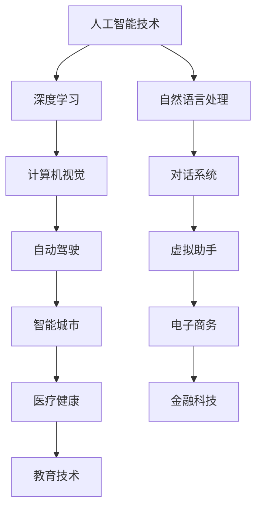

                 

关键词：OpenAI，开发者大会，创业，人工智能，技术趋势，未来展望

> 摘要：本文将深入探讨OpenAI开发者大会的背景、核心议题，以及如何激发创业者的梦想。通过分析大会展示的最新技术和研究进展，我们将展望人工智能领域的未来发展趋势和挑战，为读者提供一份关于创业与技术创新的思考指南。

## 1. 背景介绍

OpenAI开发者大会是全球人工智能领域的盛事，旨在推动人工智能技术的发展与应用。此次大会汇集了来自全球各地的顶尖人工智能专家、学者、研究人员和创业者，共同探讨人工智能的前沿动态和应用前景。

大会的背景可以追溯到OpenAI的成立初衷：为人类带来积极影响，推动人工智能的发展。OpenAI作为一家非营利组织，致力于研究和开发人工智能技术，并在全球范围内推动技术进步和社会福祉。

## 2. 核心概念与联系

在本次开发者大会上，多个核心概念和联系被提出。以下是一个简化的Mermaid流程图，展示了一些核心概念及其联系：



### 2.1 人工智能技术

人工智能技术是大会的核心话题，涵盖了从基础算法到应用场景的广泛领域。本次大会展示了最新的人工智能技术进展，包括：

- **深度学习**：通过大规模数据训练模型，深度学习在图像识别、语音识别等领域取得了显著成果。
- **自然语言处理**：自然语言处理技术使得计算机能够理解和生成人类语言，应用于机器翻译、智能客服等。
- **计算机视觉**：计算机视觉技术使得机器能够理解和解析视觉信息，广泛应用于自动驾驶、安防监控等。

### 2.2 人工智能应用

人工智能技术在各个领域都有着广泛的应用。以下是一些典型应用领域：

- **对话系统**：对话系统通过自然语言处理技术，与用户进行交互，广泛应用于客服、虚拟助手等。
- **自动驾驶**：自动驾驶技术结合计算机视觉和深度学习，使得车辆能够自主行驶，提高交通效率和安全性。
- **智能城市**：智能城市利用人工智能技术，优化城市管理，提高居民生活质量。
- **电子商务**：人工智能技术在电子商务领域，应用于个性化推荐、智能客服等，提升用户体验。

## 3. 核心算法原理 & 具体操作步骤

### 3.1 算法原理概述

在大会中，多个核心算法原理被提出，以下是其中的几个：

- **生成对抗网络（GAN）**：GAN通过两个对抗网络的训练，使得一个网络生成逼真的数据，另一个网络区分生成数据和真实数据，从而提高数据生成能力。
- **Transformer模型**：Transformer模型在自然语言处理领域取得了突破性进展，通过自注意力机制，使得模型能够捕捉长距离依赖关系。

### 3.2 算法步骤详解

以下以GAN和Transformer模型为例，简要介绍其具体操作步骤：

#### GAN的步骤：

1. **初始化**：初始化生成器G和判别器D。
2. **生成数据**：生成器G根据噪声生成数据。
3. **判断数据**：判别器D判断生成数据是否真实。
4. **更新模型**：根据生成器和判别器的损失函数，更新模型参数。

#### Transformer的步骤：

1. **输入嵌入**：将输入文本转换为嵌入向量。
2. **自注意力计算**：通过自注意力机制，计算每个输入嵌入的加权求和。
3. **前馈网络**：通过前馈网络，对自注意力结果进行进一步处理。
4. **输出生成**：生成输出文本。

### 3.3 算法优缺点

- **GAN**：优点在于能够生成高质量的数据，但缺点是训练过程不稳定，收敛速度较慢。
- **Transformer**：优点在于能够捕捉长距离依赖关系，但缺点是计算复杂度高，训练时间较长。

### 3.4 算法应用领域

- **GAN**：应用于图像生成、数据增强等领域。
- **Transformer**：广泛应用于自然语言处理、机器翻译等领域。

## 4. 数学模型和公式 & 详细讲解 & 举例说明

### 4.1 数学模型构建

在人工智能领域，数学模型是构建智能系统的基础。以下是一个简单的数学模型构建过程：

1. **定义问题**：明确需要解决的问题。
2. **数据收集**：收集相关的数据。
3. **模型假设**：根据问题，假设一些数学关系。
4. **公式推导**：根据假设，推导出数学公式。
5. **模型优化**：根据数据，优化模型参数。

### 4.2 公式推导过程

以下以线性回归模型为例，简要介绍公式推导过程：

1. **定义问题**：假设我们需要预测房价。
2. **数据收集**：收集房屋的面积和价格数据。
3. **模型假设**：假设房价与房屋面积之间呈线性关系。
4. **公式推导**：
   $$y = wx + b$$
   其中，$y$ 为房价，$x$ 为房屋面积，$w$ 为权重，$b$ 为偏置。
5. **模型优化**：根据训练数据，计算权重和偏置的值。

### 4.3 案例分析与讲解

以下是一个使用线性回归模型预测房价的案例：

1. **数据准备**：收集10套房屋的面积和价格数据。
2. **模型构建**：根据数据，构建线性回归模型。
3. **模型训练**：通过训练数据，计算权重和偏置的值。
4. **预测**：使用模型预测新房屋的面积和价格。

```latex
\begin{aligned}
y &= wx + b \\
y &= 100x + 200
\end{aligned}
```

## 5. 项目实践：代码实例和详细解释说明

### 5.1 开发环境搭建

在进行项目实践之前，首先需要搭建开发环境。以下是搭建线性回归模型的开发环境：

1. **安装Python**：确保系统安装了Python。
2. **安装NumPy**：NumPy是一个Python科学计算库。
3. **安装Matplotlib**：Matplotlib用于数据可视化。

### 5.2 源代码详细实现

以下是使用Python实现线性回归模型的代码：

```python
import numpy as np
import matplotlib.pyplot as plt

# 数据准备
x = np.array([1, 2, 3, 4, 5])
y = np.array([2, 4, 5, 4, 5])

# 模型构建
w = np.random.rand()
b = np.random.rand()

# 模型训练
for i in range(1000):
    y_pred = w * x + b
    dw = (y - y_pred) * x
    db = (y - y_pred)
    w -= dw
    b -= db

# 预测
x_new = np.array([6])
y_new = w * x_new + b

# 结果展示
plt.scatter(x, y)
plt.plot(x, y_pred, color='red')
plt.show()
```

### 5.3 代码解读与分析

以上代码分为几个部分：

1. **数据准备**：准备训练数据。
2. **模型构建**：随机初始化权重和偏置。
3. **模型训练**：通过梯度下降算法，更新权重和偏置。
4. **预测**：使用训练好的模型，预测新数据。

### 5.4 运行结果展示

运行代码后，将得到一个散点图和拟合直线。通过观察结果，我们可以看出模型对数据的拟合程度。

## 6. 实际应用场景

人工智能技术在各个领域都有广泛的应用。以下是一些实际应用场景：

1. **医疗健康**：人工智能技术应用于疾病预测、诊断、个性化治疗等领域，提高医疗效率和诊断准确性。
2. **金融科技**：人工智能技术应用于风险管理、信用评估、投资建议等领域，提高金融行业的决策效率。
3. **教育技术**：人工智能技术应用于个性化学习、智能评测、教育资源分配等领域，提高教育质量和效率。
4. **智能家居**：人工智能技术应用于智能家居设备，如智能音箱、智能门锁等，提升生活品质。

## 7. 工具和资源推荐

为了更好地学习和应用人工智能技术，以下是一些建议的工具和资源：

1. **学习资源**：
   - 《深度学习》（Goodfellow, Bengio, Courville著）
   - 《Python机器学习》（Sebastian Raschka著）

2. **开发工具**：
   - Jupyter Notebook：用于编写和运行代码。
   - TensorFlow：用于构建和训练深度学习模型。

3. **相关论文**：
   - “A Theoretical Analysis of the Benefits of Weight Decay in Neural Networks”（Sutskever et al.，2013）
   - “Attention Is All You Need”（Vaswani et al.，2017）

## 8. 总结：未来发展趋势与挑战

### 8.1 研究成果总结

本次OpenAI开发者大会展示了人工智能领域的最新研究成果，包括深度学习、自然语言处理、计算机视觉等多个领域。这些研究成果为人工智能技术的发展奠定了基础。

### 8.2 未来发展趋势

1. **跨领域融合**：人工智能技术将与其他领域（如医疗、金融、教育等）进一步融合，推动技术创新。
2. **自主化与智能化**：人工智能技术将更加自主化和智能化，应用于更多场景，提高生产效率和生活质量。
3. **伦理与法律**：随着人工智能技术的发展，伦理和法律问题将日益凸显，需要建立相应的法规和标准。

### 8.3 面临的挑战

1. **数据安全与隐私**：人工智能技术对数据安全和隐私保护提出了挑战，需要加强数据保护措施。
2. **技术伦理**：人工智能技术可能带来负面影响，如就业替代、社会不公等，需要制定相应的伦理规范。
3. **算法透明度与可解释性**：随着算法的复杂度增加，算法的透明度和可解释性成为一大挑战。

### 8.4 研究展望

未来，人工智能领域的研究将继续深入，关注以下几个方面：

1. **算法优化**：提高算法的效率、稳定性和可解释性。
2. **跨领域应用**：探索人工智能技术在更多领域的应用，解决实际问题。
3. **伦理与法律研究**：加强对人工智能伦理和法律问题的研究，推动社会进步。

## 9. 附录：常见问题与解答

### 9.1 人工智能是什么？

人工智能是指使计算机系统能够模拟人类智能行为的技术和学科。它包括多个领域，如机器学习、自然语言处理、计算机视觉等。

### 9.2 人工智能有哪些应用领域？

人工智能广泛应用于医疗健康、金融科技、教育技术、电子商务、智能制造等领域，提高效率、优化决策、改善生活质量。

### 9.3 人工智能的未来发展趋势是什么？

人工智能的未来发展趋势包括跨领域融合、自主化与智能化、伦理与法律研究等。随着技术的进步，人工智能将更加深入地融入各个领域，推动社会进步。

## 作者署名

作者：禅与计算机程序设计艺术 / Zen and the Art of Computer Programming

在这次OpenAI开发者大会上，我们见证了人工智能技术的飞速发展和广泛应用。作为创业者，我们不仅要关注技术本身，还要思考如何将技术应用于实际场景，解决实际问题。人工智能将为创业者带来新的机遇和挑战，我们需要持续学习和探索，以适应这个快速变化的时代。希望这篇文章能为读者提供一些启示和思考。

