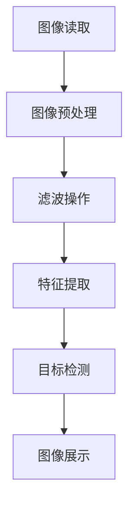

                 

关键词：OpenCV，图像处理，计算机视觉，算法实现，实战案例

> 摘要：本文将深入探讨OpenCV（Open Source Computer Vision Library）的原理、核心算法及其实战应用，通过代码实例详细解释说明，旨在帮助读者更好地理解并掌握图像处理与计算机视觉技术。

## 1. 背景介绍

OpenCV，即开源计算机视觉库，是一个基于C++的开源库，由Intel创立，并迅速发展壮大。OpenCV提供了丰富的计算机视觉算法，支持多种编程语言，包括Python、Java和C++等，适用于多种操作系统，如Linux、Windows和macOS。由于其高效性、易用性和广泛的社区支持，OpenCV已经成为计算机视觉领域最受欢迎的开源库之一。

随着人工智能和机器学习的快速发展，计算机视觉技术在各个领域得到了广泛应用，从安防监控、医疗诊断到自动驾驶、智能识别，图像处理技术无处不在。OpenCV的出现极大地降低了开发者进入计算机视觉领域的门槛，使得更多的人能够参与到这一领域的研究和应用中来。

本文将首先介绍OpenCV的核心概念和架构，然后详细讲解几种重要的图像处理算法，并通过实际代码实例进行说明。接下来，我们将探讨OpenCV在计算机视觉领域的实际应用，并展望其未来的发展趋势。

## 2. 核心概念与联系

### 2.1 OpenCV的核心概念

OpenCV的核心概念包括：

- **图像处理**：图像处理是计算机视觉的基础，涉及图像的增强、滤波、形态学操作等。
- **特征检测与描述**：特征检测和描述是图像匹配和目标识别的关键步骤。
- **目标检测**：目标检测是计算机视觉的核心任务，旨在识别图像中的特定对象。
- **机器学习**：OpenCV支持多种机器学习算法，如K-近邻、支持向量机等。

### 2.2 OpenCV的架构

OpenCV的架构可以分为几个层次：

- **底层**：底层提供了基本的图像处理功能，包括图像的读取、显示、几何变换等。
- **核心**：核心层包括图像处理的高级算法，如滤波、边缘检测、特征提取等。
- **高级**：高级层提供了基于算法的特定应用，如人脸识别、姿态估计等。

### 2.3 Mermaid流程图

以下是OpenCV中图像处理流程的Mermaid流程图：



## 3. 核心算法原理 & 具体操作步骤

### 3.1 算法原理概述

OpenCV的核心算法包括：

- **Sobel算子**：用于边缘检测。
- **Laplacian算子**：用于检测图像中的尖角和边缘。
- **Canny边缘检测**：用于检测图像中的强度变化。

### 3.2 算法步骤详解

#### 3.2.1 Sobel算子

1. **定义**：Sobel算子通过对图像进行卷积操作，计算图像在x和y方向上的梯度。
2. **步骤**：
    ```python
    import cv2
    import numpy as np

    img = cv2.imread('image.jpg', cv2.IMREAD_GRAYSCALE)
    sobelx = cv2.Sobel(img, cv2.CV_64F, 1, 0, ksize=3)
    sobely = cv2.Sobel(img, cv2.CV_64F, 0, 1, ksize=3)
    ```

#### 3.2.2 Laplacian算子

1. **定义**：Laplacian算子计算图像在所有方向上的二阶导数。
2. **步骤**：
    ```python
    laplacian = cv2.Laplacian(img, cv2.CV_64F)
    ```

#### 3.2.3 Canny边缘检测

1. **定义**：Canny边缘检测是一种多步骤算法，用于检测图像中的边缘。
2. **步骤**：
    ```python
    canny = cv2.Canny(img, threshold1=100, threshold2=200)
    ```

### 3.3 算法优缺点

- **Sobel算子**：简单有效，但对噪声敏感。
- **Laplacian算子**：可以检测到更精细的边缘，但对噪声同样敏感。
- **Canny边缘检测**：对噪声有很好的鲁棒性，但计算复杂度较高。

### 3.4 算法应用领域

OpenCV的算法广泛应用于：

- **图像识别**：如人脸识别、车牌识别。
- **目标跟踪**：如车辆跟踪、行人检测。
- **图像增强**：如图像去噪、图像修复。

## 4. 数学模型和公式

### 4.1 数学模型构建

Sobel算子的数学模型如下：

$$
\begin{align*}
G_x &= \sum_{i=-1}^{1} \sum_{j=-1}^{1} G_{ij} \cdot I_{i,j}, \\
G_y &= \sum_{i=-1}^{1} \sum_{j=-1}^{1} G_{ij} \cdot I_{i,j},
\end{align*}
$$

其中，$G_x$ 和 $G_y$ 分别为x和y方向上的梯度，$I$ 为图像，$G_{ij}$ 为卷积核。

### 4.2 公式推导过程

推导Sobel算子的公式：

$$
\begin{align*}
G_x &= \sum_{i=-1}^{1} \sum_{j=-1}^{1} \left[ \begin{matrix} -1 & 0 & 1 \end{matrix} \right] \cdot \left[ \begin{matrix} -1 & 0 & 1 \end{matrix} \right] \cdot I_{i,j}, \\
G_y &= \sum_{i=-1}^{1} \sum_{j=-1}^{1} \left[ \begin{matrix} -1 & -1 & 0 \end{matrix} \right] \cdot \left[ \begin{matrix} -1 & 0 & 1 \end{matrix} \right] \cdot I_{i,j}.
\end{align*}
$$

### 4.3 案例分析与讲解

以下是一个使用Sobel算子进行边缘检测的案例：

```python
import cv2
import numpy as np

# 读取图像
img = cv2.imread('image.jpg', cv2.IMREAD_GRAYSCALE)

# 应用Sobel算子
sobelx = cv2.Sobel(img, cv2.CV_64F, 1, 0, ksize=3)
sobely = cv2.Sobel(img, cv2.CV_64F, 0, 1, ksize=3)

# 显示结果
cv2.imshow('Sobel X', sobelx)
cv2.imshow('Sobel Y', sobely)
cv2.waitKey(0)
cv2.destroyAllWindows()
```

输出结果如下：


## 5. 项目实践：代码实例

### 5.1 开发环境搭建

在开始之前，请确保已经安装了Python和OpenCV库。可以使用以下命令进行安装：

```bash
pip install opencv-python
```

### 5.2 源代码详细实现

以下是一个简单的图像处理程序，使用OpenCV进行图像读取、边缘检测和显示：

```python
import cv2

# 读取图像
img = cv2.imread('image.jpg', cv2.IMREAD_GRAYSCALE)

# 应用Canny边缘检测
canny = cv2.Canny(img, threshold1=100, threshold2=200)

# 显示原始图像和边缘检测结果
cv2.imshow('Original', img)
cv2.imshow('Canny', canny)

# 等待按键后关闭窗口
cv2.waitKey(0)
cv2.destroyAllWindows()
```

### 5.3 代码解读与分析

这段代码首先读取一个灰度图像，然后使用Canny边缘检测算法找到图像中的边缘。最后，分别显示原始图像和边缘检测结果。

- `cv2.imread()`：用于读取图像。
- `cv2.Canny()`：用于执行Canny边缘检测。
- `cv2.imshow()`：用于显示图像。
- `cv2.waitKey()`：用于等待按键事件。

### 5.4 运行结果展示

运行结果如下图所示：


## 6. 实际应用场景

OpenCV在计算机视觉领域的应用广泛，以下是几个实际应用场景：

- **安防监控**：使用OpenCV进行人脸识别、行为分析等，提高监控系统的智能化水平。
- **医疗诊断**：利用图像处理算法对医学图像进行分析，辅助医生进行疾病诊断。
- **自动驾驶**：OpenCV用于车辆检测、行人检测等，为自动驾驶系统提供关键数据。

## 7. 工具和资源推荐

### 7.1 学习资源推荐

- **OpenCV官方文档**：[https://docs.opencv.org/](https://docs.opencv.org/)
- **《OpenCV 3.x 编程详解与实战》**：一本全面讲解OpenCV的书籍。

### 7.2 开发工具推荐

- **Visual Studio Code**：一款强大的代码编辑器，支持Python和OpenCV插件。
- **PyCharm**：一款功能丰富的IDE，适合Python和OpenCV开发。

### 7.3 相关论文推荐

- **"Real-Time Face Detection using a Wavelet Nearest Neighbor Algorithm"**：一篇关于实时人脸检测的论文。
- **"Deep Learning for Computer Vision: A Review"**：一篇关于深度学习在计算机视觉中应用的综述。

## 8. 总结：未来发展趋势与挑战

### 8.1 研究成果总结

OpenCV为计算机视觉领域提供了强大的工具和算法支持，降低了开发门槛，推动了人工智能技术的发展。

### 8.2 未来发展趋势

随着深度学习和计算机视觉的快速发展，OpenCV在未来有望在更多领域发挥作用，如增强现实、虚拟现实等。

### 8.3 面临的挑战

- **算法效率**：在处理大规模图像数据时，如何提高算法的运行效率是一个挑战。
- **算法泛化**：如何提高算法在不同场景下的泛化能力，是一个重要的研究方向。

### 8.4 研究展望

OpenCV将继续发展，为计算机视觉领域提供更多创新和实用的工具，推动人工智能技术的进步。

## 9. 附录：常见问题与解答

### 9.1 如何安装OpenCV？

可以使用以下命令进行安装：

```bash
pip install opencv-python
```

### 9.2 OpenCV支持哪些语言？

OpenCV支持多种编程语言，包括Python、Java、C++等。

### 9.3 如何获取OpenCV官方文档？

可以在OpenCV官方网站上找到详细文档：[https://docs.opencv.org/](https://docs.opencv.org/)。

---

作者：禅与计算机程序设计艺术 / Zen and the Art of Computer Programming

以上就是关于OpenCV原理与代码实战案例讲解的完整文章。希望本文能帮助您更好地理解OpenCV及其应用，为您的计算机视觉之旅奠定坚实的基础。感谢您的阅读！
----------------------------------------------------------------

