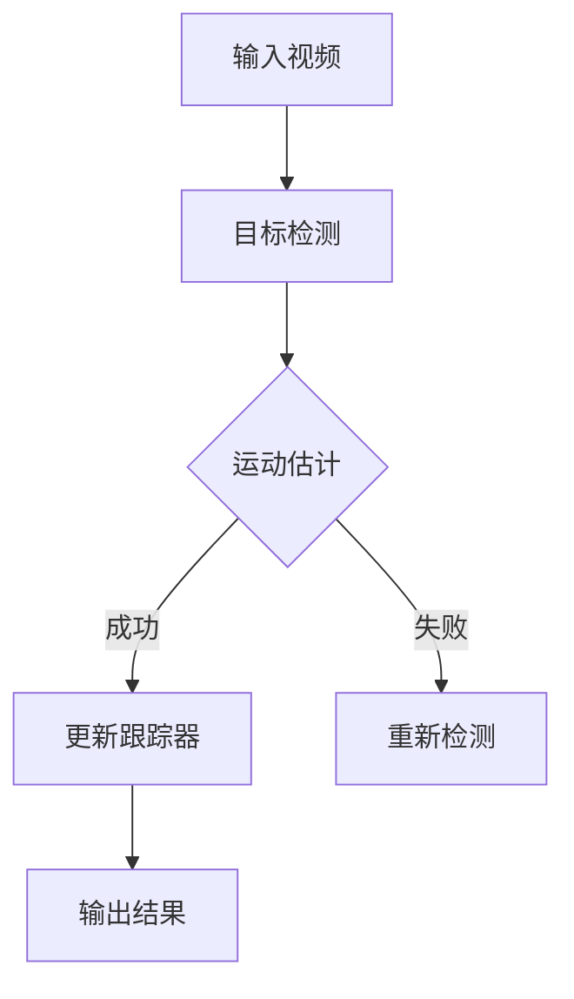

                 

关键词：OpenCV，目标跟踪，视频处理，计算机视觉，对象检测，图像处理，算法实现。

> 摘要：本文将深入探讨OpenCV库中的目标跟踪技术，介绍其在视频数据处理中的应用。我们将首先回顾背景知识，然后详细介绍核心概念与联系，核心算法原理与操作步骤，数学模型与公式推导，项目实践，实际应用场景，未来展望，以及相关工具和资源推荐。

## 1. 背景介绍

目标跟踪是计算机视觉中的一个重要研究领域，旨在实时或离线地识别和跟踪视频序列中的对象。随着计算机性能的提升和算法的进步，目标跟踪技术在很多领域得到了广泛应用，如视频监控、智能交通、医疗影像分析等。

OpenCV（Open Source Computer Vision Library）是一个强大的开源计算机视觉库，支持多种编程语言，如C++、Python等，并且提供了丰富的图像处理和计算机视觉算法。OpenCV在目标跟踪领域有着广泛的应用，包括基于光流、颜色、运动矢量等多种方法的跟踪算法。

本文将基于OpenCV库，详细介绍目标跟踪的相关技术，包括核心概念、算法原理、数学模型以及实际项目实践。

## 2. 核心概念与联系

### 2.1. 图像处理基础

在介绍目标跟踪之前，我们需要了解一些基本的图像处理概念，如像素、图像分辨率、颜色空间等。

- **像素**：图像中最小的显示单元，通常用二维坐标表示。
- **图像分辨率**：图像的宽度和高度，通常以像素为单位。
- **颜色空间**：表示图像颜色信息的数学模型，常见的有RGB、HSV等。

### 2.2. 目标检测

目标检测是目标跟踪的前置任务，旨在识别图像或视频中的对象。常用的目标检测算法包括R-CNN、SSD、YOLO等。

### 2.3. 运动估计

运动估计是目标跟踪的核心步骤，旨在计算视频序列中对象位置的变化。常见的运动估计方法包括光流、卡尔曼滤波等。

### 2.4. Mermaid 流程图

以下是目标跟踪系统的Mermaid流程图：



## 3. 核心算法原理 & 具体操作步骤

### 3.1. 算法原理概述

目标跟踪算法通常分为基于模型的方法和基于匹配的方法。

- **基于模型的方法**：基于对象模型（如外观模型、形状模型等）来匹配和跟踪对象。
- **基于匹配的方法**：通过计算对象在连续帧中的位置匹配度来跟踪对象。

### 3.2. 算法步骤详解

以下是目标跟踪的基本步骤：

1. **初始化**：读取视频文件，初始化跟踪器。
2. **目标检测**：在视频的第一帧或初始帧中进行目标检测，提取目标对象。
3. **运动估计**：计算目标对象在连续帧中的位置变化。
4. **更新跟踪器**：根据运动估计结果更新跟踪器的位置和状态。
5. **输出结果**：将跟踪结果输出，如跟踪轨迹、检测结果等。

### 3.3. 算法优缺点

- **优点**：实时性好，对目标外观变化有一定的鲁棒性。
- **缺点**：对目标外观变化敏感，易受遮挡和光照变化影响。

### 3.4. 算法应用领域

目标跟踪技术在以下领域有着广泛的应用：

- **视频监控**：实时监控目标运动轨迹，用于安全监控和异常检测。
- **智能交通**：实时跟踪车辆和行人，用于交通流量分析和事故预警。
- **医疗影像**：跟踪病变部位，辅助诊断和治疗。

## 4. 数学模型和公式 & 详细讲解 & 举例说明

### 4.1. 数学模型构建

目标跟踪中的数学模型通常包括运动模型和观测模型。

- **运动模型**：描述目标对象在连续帧中的位置变化。常见的运动模型有线性模型、非线性模型等。
- **观测模型**：描述目标对象在图像中的观测值，通常为像素值。

### 4.2. 公式推导过程

以下是目标跟踪中的基本公式推导：

1. **线性运动模型**：

   \[
   x_t = x_{t-1} + v_x \Delta t
   \]

   \[
   y_t = y_{t-1} + v_y \Delta t
   \]

   其中，\(x_t, y_t\)为第\(t\)帧中目标的位置，\(v_x, v_y\)为水平方向和垂直方向的速度。

2. **观测模型**：

   \[
   I_t(x_t, y_t) = I_{t-1}(x_{t-1}, y_{t-1}) + \delta_t
   \]

   其中，\(I_t(x_t, y_t)\)为第\(t\)帧中目标在像素点\((x_t, y_t)\)的观测值，\(\delta_t\)为噪声。

### 4.3. 案例分析与讲解

以下是一个简单的目标跟踪案例：

```python
# 导入相关库
import cv2
import numpy as np

# 初始化视频捕捉对象
cap = cv2.VideoCapture('example.mp4')

# 初始化跟踪器
tracker = cv2.TrackerKCF_create()

# 读取第一帧图像
ret, frame = cap.read()

# 在第一帧图像上绘制目标区域
bbox = cv2.selectROI(frame, False)

# 初始化跟踪器
tracker.init(frame, bbox)

while True:
    # 读取下一帧图像
    ret, frame = cap.read()

    if not ret:
        break

    # 更新跟踪器
    ok, bbox = tracker.update(frame)

    if ok:
        # 绘制跟踪结果
        p1 = (int(bbox[0]), int(bbox[1]))
        p2 = (int(bbox[0] + bbox[2]),
              int(bbox[1] + bbox[3]))
        cv2.rectangle(frame, p1, p2, (0, 255, 0), 2,
                      1)  # 绘制追踪框

    # 显示图像
    cv2.imshow('Tracking', frame)

    # 按键q退出
    if cv2.waitKey(1) & 0xFF == ord('q'):
        break

# 释放资源
cap.release()
cv2.destroyAllWindows()
```

## 5. 项目实践：代码实例和详细解释说明

### 5.1. 开发环境搭建

首先，确保已经安装了OpenCV库。可以使用以下命令安装：

```bash
pip install opencv-python
```

### 5.2. 源代码详细实现

以上面的案例代码为例，详细解释代码实现过程。

1. **导入相关库**：

   ```python
   import cv2
   import numpy as np
   ```

2. **初始化视频捕捉对象**：

   ```python
   cap = cv2.VideoCapture('example.mp4')
   ```

   读取视频文件，初始化视频捕捉对象。

3. **初始化跟踪器**：

   ```python
   tracker = cv2.TrackerKCF_create()
   ```

   创建KCF（Kernelized Correlation Filter）跟踪器。

4. **读取第一帧图像**：

   ```python
   ret, frame = cap.read()
   ```

   读取视频的第一帧图像。

5. **在第一帧图像上绘制目标区域**：

   ```python
   bbox = cv2.selectROI(frame, False)
   ```

   使用OpenCV的`selectROI`函数手动选择目标区域。

6. **初始化跟踪器**：

   ```python
   tracker.init(frame, bbox)
   ```

   使用初始化的第一帧图像和目标区域初始化跟踪器。

7. **循环读取后续帧并更新跟踪器**：

   ```python
   while True:
       # 读取下一帧图像
       ret, frame = cap.read()

       if not ret:
           break

       # 更新跟踪器
       ok, bbox = tracker.update(frame)

       if ok:
           # 绘制跟踪结果
           p1 = (int(bbox[0]), int(bbox[1]))
           p2 = (int(bbox[0] + bbox[2]),
                 int(bbox[1] + bbox[3]))
           cv2.rectangle(frame, p1, p2, (0, 255, 0), 2,
                         1)  # 绘制追踪框

       # 显示图像
       cv2.imshow('Tracking', frame)

       # 按键q退出
       if cv2.waitKey(1) & 0xFF == ord('q'):
           break
   ```

   在这里，我们使用一个循环不断读取视频的后续帧，并使用跟踪器更新目标的位置。

### 5.3. 代码解读与分析

- **视频捕捉**：使用`cv2.VideoCapture`类初始化视频捕捉对象。
- **跟踪器初始化**：创建并初始化跟踪器。
- **目标区域选择**：使用`cv2.selectROI`函数手动选择目标区域。
- **跟踪更新**：在循环中不断读取视频帧，并使用跟踪器更新目标的位置。
- **结果绘制**：在每一帧上绘制跟踪结果。

### 5.4. 运行结果展示

运行代码后，会在窗口中显示视频帧，并在每一帧上绘制跟踪结果。按`q`键退出程序。

## 6. 实际应用场景

目标跟踪技术在多个实际应用场景中发挥着重要作用：

### 6.1. 视频监控

在视频监控中，目标跟踪技术可用于实时监控目标运动轨迹，检测异常行为，如入侵、盗窃等。

### 6.2. 智能交通

在智能交通系统中，目标跟踪技术可用于实时跟踪车辆和行人，分析交通流量，预测交通事故，提高交通安全。

### 6.3. 医疗影像

在医疗影像分析中，目标跟踪技术可用于跟踪病变部位，辅助医生进行诊断和治疗。

## 7. 未来应用展望

随着深度学习和强化学习等技术的发展，目标跟踪技术将越来越智能化和高效。未来，目标跟踪技术有望在自动驾驶、人机交互、虚拟现实等领域得到广泛应用。

## 8. 工具和资源推荐

### 8.1. 学习资源推荐

- **《计算机视觉：算法与应用》**：详细介绍了计算机视觉的基本原理和应用。
- **OpenCV官方文档**：包含丰富的教程、示例代码和API文档。

### 8.2. 开发工具推荐

- **PyCharm**：强大的Python集成开发环境，适合进行OpenCV编程。
- **Visual Studio Code**：轻量级但功能强大的代码编辑器，适合进行OpenCV编程。

### 8.3. 相关论文推荐

- **"Tracking of the Object Motion by Kalman Filter"**：介绍了一种基于卡尔曼滤波的目标跟踪方法。
- **"Kernelized Correlation Filters for Real-Time Object Tracking"**：介绍了一种基于核相关滤波的目标跟踪方法。

## 9. 总结：未来发展趋势与挑战

目标跟踪技术在计算机视觉领域具有重要应用价值。随着算法的进步和计算资源的提升，目标跟踪技术将越来越高效和智能化。然而，目标跟踪仍面临一些挑战，如遮挡、光照变化和目标外观变化等。未来，研究人员将继续探索更鲁棒、更智能的目标跟踪方法。

### 附录：常见问题与解答

1. **Q：目标跟踪和对象检测有什么区别？**

   **A：** 目标跟踪是对象检测的一个子任务。对象检测旨在识别图像或视频中的对象，而目标跟踪则是在时间序列中跟踪已检测到的对象。

2. **Q：如何选择合适的跟踪算法？**

   **A：** 选择跟踪算法时，需要考虑跟踪速度、精度、鲁棒性等因素。常用的跟踪算法包括KCF、TLD、CSRT等，可以根据实际需求选择合适的算法。

3. **Q：目标跟踪过程中如何处理遮挡问题？**

   **A：** 遮挡问题是目标跟踪中常见的问题。处理遮挡问题通常需要结合运动估计和目标检测算法，如使用卡尔曼滤波结合滑动窗口检测等方法。

### 作者署名

作者：禅与计算机程序设计艺术 / Zen and the Art of Computer Programming

----------------------------------------------------------------

文章撰写完毕，请检查是否符合要求，并进行最终调整和润色。如果有任何问题或需要进一步修改，请随时告知。

