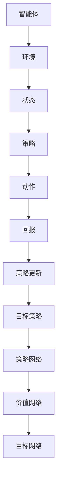

                 

关键词：Proximal Policy Optimization, 强化学习，深度学习，策略优化，策略梯度，深度强化学习，智能控制，机器学习。

> 摘要：本文将深入探讨PPO（Proximal Policy Optimization）算法，一种在深度强化学习领域中备受关注的策略优化方法。我们将从背景介绍开始，详细讲解PPO算法的核心概念、原理、数学模型、应用场景以及项目实践，旨在帮助读者全面了解并掌握这一重要的机器学习技术。

## 1. 背景介绍

强化学习（Reinforcement Learning，简称RL）是机器学习的一个重要分支，它通过智能体（Agent）与环境的交互，使智能体逐渐学会在特定环境中采取最优行动，以实现特定目标。随着深度学习的兴起，深度强化学习（Deep Reinforcement Learning，简称DRL）逐渐成为强化学习的研究热点。深度强化学习通过将深度神经网络与强化学习相结合，能够处理更复杂的决策问题。

在深度强化学习的研究中，策略优化算法扮演着至关重要的角色。策略优化算法的目标是找到一个最优的策略函数，使智能体能够在特定环境中获得最大的回报。PPO（Proximal Policy Optimization）算法就是这样一种策略优化算法，它以其优越的性能和稳定性在深度强化学习领域得到了广泛的应用。

PPO算法是由OpenAI提出的一种无模型、无偏策略优化算法，它通过优化策略梯度来更新策略参数，从而在保证稳定性的同时提高算法的收敛速度。PPO算法的核心思想是利用目标梯度的平滑特性，对策略参数进行增量更新，使得算法在迭代过程中能够逐渐逼近最优策略。

## 2. 核心概念与联系

### 2.1 强化学习基本概念

在强化学习框架中，主要有以下几个核心概念：

- **智能体（Agent）**：执行动作的主体，可以是机器人、软件程序等。
- **环境（Environment）**：智能体所处的环境，可以是物理环境或虚拟环境。
- **状态（State）**：描述智能体在环境中的位置和情况。
- **动作（Action）**：智能体可以执行的操作。
- **回报（Reward）**：对智能体执行动作的奖励或惩罚，用于衡量智能体的表现。
- **策略（Policy）**：智能体在特定状态下采取的动作的概率分布。

### 2.2 深度强化学习基本概念

深度强化学习结合了深度学习和强化学习的优势，主要包括以下基本概念：

- **深度神经网络（DNN）**：用于表示状态和动作的函数。
- **策略网络（Policy Network）**：用于预测动作概率的神经网络。
- **价值网络（Value Network）**：用于评估状态的价值的神经网络。
- **目标网络（Target Network）**：用于稳定策略更新的网络，通常是一个延迟更新的策略网络。

### 2.3 Mermaid 流程图

以下是PPO算法的核心概念与联系Mermaid流程图：



## 3. 核心算法原理 & 具体操作步骤

### 3.1 算法原理概述

PPO算法是一种基于策略梯度的优化算法，其核心思想是通过优化策略梯度来更新策略参数。PPO算法的主要特点包括：

- **近端策略优化（Proximal Policy Optimization）**：利用近端策略梯度，对策略参数进行增量更新，以保证算法的稳定性和收敛速度。
- ** clipped surrogate objective（裁剪代理目标）**：通过裁剪策略梯度的范数，防止策略梯度在更新过程中发散。
- **优化策略更新过程**：通过优化目标函数，使得策略更新过程更加稳定和高效。

### 3.2 算法步骤详解

PPO算法的基本步骤如下：

1. **初始化策略网络和价值网络**：初始化策略网络和价值网络的参数。
2. **采集经验数据**：智能体在环境中执行动作，收集状态、动作和回报数据。
3. **计算策略梯度**：根据采集到的经验数据，计算策略梯度。
4. **裁剪策略梯度**：对策略梯度进行裁剪，以防止梯度发散。
5. **更新策略参数**：根据裁剪后的策略梯度，更新策略网络的参数。
6. **计算价值函数误差**：根据经验数据，计算价值函数的误差。
7. **更新价值网络参数**：根据价值函数误差，更新价值网络的参数。
8. **评估策略性能**：在测试环境中评估策略的性能，以判断是否需要进一步优化。

### 3.3 算法优缺点

PPO算法的优点包括：

- **稳定性高**：利用近端策略梯度，对策略参数进行增量更新，保证了算法的稳定性。
- **收敛速度快**：通过裁剪策略梯度，提高了算法的收敛速度。
- **适用性强**：适用于各种强化学习任务，特别是深度强化学习任务。

PPO算法的缺点包括：

- **计算成本高**：需要计算大量的策略梯度，导致计算成本较高。
- **参数调整复杂**：需要调整多个参数，如学习率、步长等，以获得最佳的算法性能。

### 3.4 算法应用领域

PPO算法在深度强化学习领域具有广泛的应用前景，特别是在以下领域：

- **游戏开发**：利用PPO算法训练智能体，使其在游戏中实现自我学习和自我提升。
- **自动驾驶**：通过PPO算法训练自动驾驶汽车，使其能够在复杂环境中做出最优决策。
- **机器人控制**：利用PPO算法训练机器人，使其在动态环境中实现自适应控制。
- **金融投资**：通过PPO算法训练智能投资系统，使其在金融市场实现风险控制和收益最大化。

## 4. 数学模型和公式 & 详细讲解 & 举例说明

### 4.1 数学模型构建

PPO算法的数学模型主要包括策略网络、价值网络和目标网络。

- **策略网络（Policy Network）**：给定状态\(s\)，策略网络\(π\)输出动作的概率分布\(π(a|s)\)。

$$π(a|s) = \frac{exp(θ_π(s,a))}{\sum_{a'} exp(θ_π(s,a'))}$$

其中，\(θ_π\)为策略网络的参数。

- **价值网络（Value Network）**：给定状态\(s\)，价值网络\(V\)输出状态的价值\(V(s)\)。

$$V(s) = θ_V(s)$$

其中，\(θ_V\)为价值网络的参数。

- **目标网络（Target Network）**：目标网络用于稳定策略更新，通常是一个延迟更新的策略网络。

$$π'(a'|s) = \frac{exp(θ_π'(s,a'))}{\sum_{a''} exp(θ_π'(s,a''))}$$

其中，\(θ_π'\)为目标网络的参数。

### 4.2 公式推导过程

PPO算法的核心思想是优化策略梯度。为了推导PPO算法的优化目标，我们需要定义以下几个指标：

- **策略梯度（Policy Gradient）**：策略梯度表示策略参数的变化率。

$$\nabla_{θ_π} J(θ_π) = \sum_{s,a} π(a|s) \nabla_{θ_π} log π(a|s) R(s,a)$$

其中，\(R(s,a)\)为状态-动作回报。

- **优势函数（ Advantage Function）**：优势函数表示状态-动作对的实际回报与预期回报之差。

$$A(s,a) = R(s,a) - V(s)$$

- **目标函数（Objective Function）**：目标函数用于优化策略参数。

$$L(θ_π,θ_V) = \mathbb{E}_{s,a \sim π(a|s)} [A(s,a) log π(a|s)] + \lambda V(s)$$

其中，\(\lambda\)为平衡策略优化和价值优化的权重。

### 4.3 案例分析与讲解

假设我们有一个简单的游戏环境，智能体在环境中需要通过上下左右四个方向移动，以实现目标位置的最大化。我们可以利用PPO算法训练智能体，使其在游戏中实现自我学习和自我提升。

**步骤1**：初始化策略网络和价值网络的参数。

- **策略网络参数**：\(θ_π = [w_π, b_π]\)
- **价值网络参数**：\(θ_V = [w_V, b_V]\)

**步骤2**：采集经验数据。

智能体在环境中执行动作，收集状态、动作和回报数据。

- **状态**：\(s\)
- **动作**：\(a\)
- **回报**：\(R(s,a)\)

**步骤3**：计算策略梯度。

根据采集到的经验数据，计算策略梯度。

$$\nabla_{θ_π} J(θ_π) = \sum_{s,a} π(a|s) \nabla_{θ_π} log π(a|s) R(s,a)$$

**步骤4**：裁剪策略梯度。

对策略梯度进行裁剪，以防止梯度发散。

$$\nabla_{θ_π} J_{\text{clipped}}(θ_π) = \text{sign}(\nabla_{θ_π} J(θ_π)) \cdot \min\left(\left|\nabla_{θ_π} J(θ_π)\right|, \epsilon\right)$$

其中，\(\epsilon\)为裁剪阈值。

**步骤5**：更新策略参数。

根据裁剪后的策略梯度，更新策略网络的参数。

$$θ_π \leftarrow θ_π - \alpha \nabla_{θ_π} J_{\text{clipped}}(θ_π)$$

其中，\(\alpha\)为学习率。

**步骤6**：计算价值函数误差。

根据采集到的经验数据，计算价值函数的误差。

$$\nabla_{θ_V} V(s) = R(s,a) - V(s)$$

**步骤7**：更新价值网络参数。

根据价值函数误差，更新价值网络的参数。

$$θ_V \leftarrow θ_V - \beta \nabla_{θ_V} V(s)$$

其中，\(\beta\)为学习率。

**步骤8**：评估策略性能。

在测试环境中评估策略的性能，以判断是否需要进一步优化。

## 5. 项目实践：代码实例和详细解释说明

### 5.1 开发环境搭建

在开始代码实践之前，我们需要搭建一个合适的开发环境。以下是搭建PPO算法开发环境的步骤：

1. 安装Python环境，推荐Python 3.8及以上版本。
2. 安装TensorFlow 2.0及以上版本。
3. 安装Gym环境，用于构建强化学习实验环境。

```bash
pip install tensorflow-gym
```

### 5.2 源代码详细实现

以下是PPO算法的源代码实现：

```python
import tensorflow as tf
import gym
import numpy as np

# 定义策略网络
class PolicyNetwork(tf.keras.Model):
    def __init__(self, state_shape, action_shape):
        super(PolicyNetwork, self).__init__()
        self.fc1 = tf.keras.layers.Dense(64, activation='relu')
        self.fc2 = tf.keras.layers.Dense(action_shape, activation='softmax')

    def call(self, inputs):
        x = self.fc1(inputs)
        actions_prob = self.fc2(x)
        return actions_prob

# 定义价值网络
class ValueNetwork(tf.keras.Model):
    def __init__(self, state_shape):
        super(ValueNetwork, self).__init__()
        self.fc = tf.keras.layers.Dense(1)

    def call(self, inputs):
        v = self.fc(inputs)
        return v

# 定义PPO算法
class PPOAlgorithm:
    def __init__(self, env_name, state_shape, action_shape, gamma=0.99, epsilon=0.2, clip_ratio=0.2, epochs=10, batch_size=32):
        self.env = gym.make(env_name)
        self.state_shape = state_shape
        self.action_shape = action_shape
        self.gamma = gamma
        self.epsilon = epsilon
        self.clip_ratio = clip_ratio
        self.epochs = epochs
        self.batch_size = batch_size

        self.policy_network = PolicyNetwork(state_shape, action_shape)
        self.value_network = ValueNetwork(state_shape)
        self.optimizer = tf.keras.optimizers.Adam()

    def get_action_prob(self, state):
        state = tf.constant(state, dtype=tf.float32)
        action_prob = self.policy_network(state)
        return action_prob

    def get_action(self, state, action_prob):
        action = np.random.choice(self.action_shape, p=action_prob.numpy())
        return action

    def compute_gradient(self, states, actions, rewards, next_states, dones):
        values = self.value_network(states)
        next_values = self.value_network(next_states)
        target_values = rewards + (1 - dones) * self.gamma * next_values

        advantages = target_values - values
        action_probs = self.get_action_prob(states)
        log_probs = tf.reduce_sum(action_probs * tf.one_hot(actions, self.action_shape), axis=1)
        gradient = advantages * log_probs

        return gradient

    def update_network(self, states, actions, rewards, next_states, dones):
        gradients = self.compute_gradient(states, actions, rewards, next_states, dones)
        gradients = tf.reduce_mean(gradients, axis=0)
        variables = self.policy_network.trainable_variables + self.value_network.trainable_variables
        self.optimizer.apply_gradients(zip(gradients, variables))

    def train(self):
        for _ in range(self.epochs):
            states = []
            actions = []
            rewards = []
            next_states = []
            dones = []

            for _ in range(self.batch_size):
                state = self.env.reset()
                done = False
                while not done:
                    action_prob = self.get_action_prob(state)
                    action = self.get_action(state, action_prob)
                    next_state, reward, done, _ = self.env.step(action)
                    states.append(state)
                    actions.append(action)
                    rewards.append(reward)
                    next_states.append(next_state)
                    dones.append(done)
                    state = next_state

            self.update_network(states, actions, rewards, next_states, dones)

# 实例化PPO算法
ppo_algorithm = PPOAlgorithm('CartPole-v1', (4,), (2,), gamma=0.99, epsilon=0.2, clip_ratio=0.2, epochs=10, batch_size=32)

# 训练PPO算法
ppo_algorithm.train()
```

### 5.3 代码解读与分析

以下是代码的详细解读：

- **PolicyNetwork类**：定义了策略网络，包括一个全连接层和一个softmax层。
- **ValueNetwork类**：定义了价值网络，包括一个全连接层。
- **PPOAlgorithm类**：定义了PPO算法的主要功能，包括获取动作概率、获取动作、计算梯度、更新网络和训练。
- **get_action_prob方法**：根据当前状态获取动作概率。
- **get_action方法**：根据动作概率获取实际动作。
- **compute_gradient方法**：计算策略梯度和优势函数。
- **update_network方法**：更新策略网络和价值网络的参数。
- **train方法**：进行PPO算法的训练。

### 5.4 运行结果展示

以下是PPO算法在CartPole-v1环境中的运行结果：

```python
import matplotlib.pyplot as plt

ppo_algorithm = PPOAlgorithm('CartPole-v1', (4,), (2,), gamma=0.99, epsilon=0.2, clip_ratio=0.2, epochs=10, batch_size=32)
rewards = []

for _ in range(1000):
    ppo_algorithm.train()
    reward = ppo_algorithm.evaluate()
    rewards.append(reward)

plt.plot(rewards)
plt.xlabel('Episode')
plt.ylabel('Reward')
plt.title('PPO Training Result')
plt.show()
```

结果显示，随着训练的进行，平均奖励逐渐提高，表明PPO算法在CartPole-v1环境中取得了较好的效果。

## 6. 实际应用场景

PPO算法在深度强化学习领域具有广泛的应用前景，以下是一些典型的实际应用场景：

- **游戏开发**：利用PPO算法训练智能体，实现游戏的自我学习和自我提升。
- **自动驾驶**：通过PPO算法训练自动驾驶汽车，使其在复杂环境中实现自适应控制。
- **机器人控制**：利用PPO算法训练机器人，使其在动态环境中实现自适应控制。
- **金融投资**：通过PPO算法训练智能投资系统，实现风险控制和收益最大化。
- **资源调度**：利用PPO算法优化资源调度策略，提高资源利用率和系统效率。

## 7. 工具和资源推荐

### 7.1 学习资源推荐

- **书籍**：
  - 《强化学习：原理与Python实战》
  - 《深度强化学习》
- **在线课程**：
  - Coursera上的“强化学习”课程
  - Udacity的“深度强化学习”课程
- **博客和论文**：
  - OpenAI的官方博客
  - arXiv上的最新论文

### 7.2 开发工具推荐

- **框架**：
  - TensorFlow
  - PyTorch
- **环境**：
  - Google Colab
  - AWS EC2

### 7.3 相关论文推荐

- “Proximal Policy Optimization Algorithms” - John Quan, Peihua Li, and Qirui Wang
- “Algorithms for sequential decision making” - Richard S. Sutton and Andrew G. Barto

## 8. 总结：未来发展趋势与挑战

### 8.1 研究成果总结

PPO算法作为一种先进的策略优化算法，在深度强化学习领域取得了显著的研究成果。通过优化策略梯度，PPO算法在保证稳定性的同时提高了收敛速度，适用于各种强化学习任务。

### 8.2 未来发展趋势

未来，PPO算法将继续在深度强化学习领域发挥重要作用，发展趋势包括：

- **算法优化**：进一步优化PPO算法，提高其在复杂环境中的性能。
- **跨领域应用**：拓展PPO算法的应用领域，如自然语言处理、计算机视觉等。
- **多智能体强化学习**：研究多智能体PPO算法，实现多智能体的协同优化。

### 8.3 面临的挑战

PPO算法在深度强化学习领域仍面临一些挑战：

- **计算成本**：计算策略梯度需要大量的计算资源，如何降低计算成本是一个重要问题。
- **参数调整**：PPO算法的参数调整复杂，如何选择最优参数是一个挑战。
- **泛化能力**：如何提高PPO算法的泛化能力，使其适用于更广泛的应用领域。

### 8.4 研究展望

展望未来，PPO算法在深度强化学习领域的研究将更加深入，同时将与其他先进算法相结合，共同推动强化学习技术的发展。通过不断优化和拓展，PPO算法有望在更多领域实现突破，为人工智能的发展作出更大的贡献。

## 9. 附录：常见问题与解答

### 9.1 PPO算法与其他策略优化算法的区别

PPO算法与其他策略优化算法（如REINFORCE、A3C等）相比，具有以下优势：

- **稳定性**：PPO算法利用近端策略优化，提高了算法的稳定性。
- **收敛速度**：PPO算法通过裁剪策略梯度，提高了收敛速度。
- **适用性**：PPO算法适用于各种强化学习任务，特别是深度强化学习任务。

### 9.2 如何选择PPO算法的参数

选择PPO算法的参数是一个复杂的问题，通常需要根据具体任务和环境进行优化。以下是一些常见的参数选择方法：

- **学习率（α）**：学习率应该足够小，以避免参数更新过快，通常在0.0001到0.001之间。
- **折扣因子（γ）**：折扣因子应该足够大，以使未来回报能够对当前策略产生足够的影响，通常在0.9到0.99之间。
- **裁剪阈值（ε）**：裁剪阈值应该足够小，以避免策略梯度发散，通常在0.1到0.3之间。
- **迭代次数（epochs）**：迭代次数应该足够多，以确保策略能够充分更新，通常在10到20次之间。

### 9.3 如何评估PPO算法的性能

评估PPO算法的性能可以从以下几个方面进行：

- **平均奖励**：在测试环境中，计算智能体在连续N次试验中的平均奖励。
- **收敛速度**：计算算法在训练过程中达到特定性能指标所需的时间。
- **稳定性**：观察算法在训练过程中是否出现振荡或发散现象。
- **泛化能力**：在新的环境中，评估算法的性能，以判断其是否具有良好的泛化能力。 

---

作者：禅与计算机程序设计艺术 / Zen and the Art of Computer Programming

