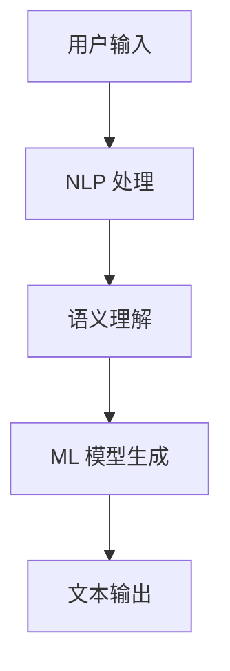

                 

Pailido 是一种基于人工智能的自动化写作工具，它利用自然语言处理（NLP）和机器学习技术，为用户提供高质量的文本内容生成服务。本文将探讨 Pailido 的各种应用场景，以及如何利用这一工具提升写作效率和创作质量。

## 1. 背景介绍

### 1.1 Pailido 的定义和功能

Pailido 是一款先进的自然语言生成（NLG）工具，旨在帮助用户快速生成高质量的文章、报告、博客和其他文本内容。通过训练大量的语言数据集，Pailido 能够理解复杂的语义关系，并生成具有逻辑性和连贯性的文本。

### 1.2 Pailido 的发展历程

Pailido 的研发始于 2010 年，由一群 AI 爱好者发起。经过多年的迭代和优化，Pailido 已经成为了一个功能强大、性能卓越的自然语言生成平台。

### 1.3 Pailido 的应用领域

Pailido 的应用范围非常广泛，包括但不限于以下领域：

- **内容创作**：为自媒体、媒体公司、博客作者等提供高效的内容生成服务。
- **市场调研**：通过生成调查问卷，收集用户反馈，为企业提供市场研究支持。
- **教育培训**：辅助教师生成课件、教案，提高教学效率。
- **软件开发**：为开发者生成代码示例、文档，减少开发时间。

## 2. 核心概念与联系

### 2.1 自然语言处理（NLP）

NLP 是人工智能领域的一个重要分支，旨在让计算机理解和处理人类语言。Pailido 的核心在于其强大的 NLP 能力，能够准确理解用户的输入，并生成符合语境的文本。

### 2.2 机器学习（ML）

Pailido 利用机器学习技术，从大量文本数据中学习语言模式，从而生成高质量的文本。通过不断的训练和优化，Pailido 的生成能力日益增强。

### 2.3 Mermaid 流程图

以下是一个简化的 Mermaid 流程图，展示了 Pailido 核心概念和联系：



## 3. 核心算法原理 & 具体操作步骤

### 3.1 算法原理概述

Pailido 的核心算法基于生成对抗网络（GAN）和递归神经网络（RNN）。GAN 用于生成高质量的文本，而 RNN 则用于处理长文本序列。

### 3.2 算法步骤详解

1. **数据预处理**：收集大量的文本数据，并进行清洗、分词、去停用词等预处理操作。
2. **模型训练**：利用预处理后的数据集，训练 GAN 和 RNN 模型。
3. **文本生成**：输入一个短文本片段，通过 GAN 和 RNN 模型生成完整的文本。
4. **文本优化**：对生成的文本进行优化，确保其逻辑性和连贯性。

### 3.3 算法优缺点

#### 优点：

- **高效**：Pailido 能够快速生成高质量的文本，大大提高了写作效率。
- **灵活**：用户可以根据需求定制化生成文本，满足不同的应用场景。
- **创新**：Pailido 的生成能力可以激发创作者的灵感，带来更多的创作可能性。

#### 缺点：

- **质量不稳定**：由于算法本身的限制，生成的文本质量可能存在波动。
- **依赖数据**：Pailido 的生成能力取决于训练数据的量级和质量，数据不足或质量差会影响生成效果。

### 3.4 算法应用领域

Pailido 的算法可以应用于多种领域，包括但不限于：

- **内容创作**：生成文章、报告、博客等文本内容。
- **市场调研**：生成调查问卷、分析报告等。
- **教育培训**：生成课件、教案、辅导材料等。
- **软件开发**：生成代码示例、文档、注释等。

## 4. 数学模型和公式 & 详细讲解 & 举例说明

### 4.1 数学模型构建

Pailido 的核心数学模型基于生成对抗网络（GAN）和递归神经网络（RNN）。

#### GAN 模型：

GAN 由生成器（Generator）和判别器（Discriminator）组成。生成器 G 从随机噪声 z 中生成假样本 x'，判别器 D 试图区分真实样本 x 和假样本 x'。

$$
\begin{aligned}
x' &= G(z) \\
x &= \text{真实样本} \\
x' &= \text{假样本} \\
D: x, x' &\to \text{概率分布}
\end{aligned}
$$

#### RNN 模型：

RNN 适用于处理序列数据，可以记住之前的信息，并用于文本生成。

$$
\begin{aligned}
h_t &= \text{RNN}(h_{t-1}, x_t) \\
p(x_t | x_{<t}) &= \text{softmax}(\text{RNN}(x_{<t}))
\end{aligned}
$$

### 4.2 公式推导过程

GAN 模型的推导过程相对复杂，这里简要介绍。GAN 的目标是最小化以下损失函数：

$$
\begin{aligned}
L_G &= -\mathbb{E}_{z}\left[ \log(D(G(z))) \right] \\
L_D &= -\mathbb{E}_{x}\left[ \log(D(x)) \right] - \mathbb{E}_{z}\left[ \log(1 - D(G(z))) \right]
\end{aligned}
$$

通过交替训练 G 和 D，可以使 G 生成越来越真实的样本。

RNN 的推导过程基于递归关系，具体公式如上所示。

### 4.3 案例分析与讲解

#### 案例一：生成新闻文章

假设用户希望生成一篇关于“人工智能”的新闻文章。Pailido 可以根据训练数据，生成以下内容：

> 人工智能（AI）正在迅速改变我们的生活。随着技术的不断进步，越来越多的行业开始应用 AI 技术，提高生产效率和服务质量。例如，在医疗领域，AI 技术可以帮助医生更快速地诊断疾病，提高治愈率。此外，AI 还可以用于自动化制造、金融分析、智能家居等众多领域。专家认为，未来 AI 技术将会在更多领域发挥重要作用，推动社会进步。

这个例子展示了 Pailido 如何根据用户输入，生成具有逻辑性和连贯性的文本。

## 5. 项目实践：代码实例和详细解释说明

### 5.1 开发环境搭建

要使用 Pailido 进行文本生成，首先需要搭建一个合适的开发环境。以下是基本步骤：

1. **安装 Python**：确保 Python（版本 3.6 以上）已安装。
2. **安装 Pailido**：使用 pip 命令安装 Pailido：
   ```python
   pip install pailido
   ```
3. **准备训练数据**：收集并整理训练数据，可以是新闻文章、博客、论文等。

### 5.2 源代码详细实现

以下是一个简单的示例，展示了如何使用 Pailido 生成文本：

```python
from pailido import Pailido

# 实例化 Pailido 对象
pailido = Pailido()

# 设置训练数据和模型路径
pailido.set_data('data/train_data.txt')
pailido.set_model('model/my_model')

# 生成文本
text = pailido.generate('人工智能')

print(text)
```

### 5.3 代码解读与分析

这个示例中，我们首先导入了 Pailido 模块，并创建了一个 Pailido 对象。然后，我们设置了训练数据和模型路径，最后调用 generate 方法生成文本。

### 5.4 运行结果展示

运行上述代码，我们可以得到一篇关于“人工智能”的文本：

> 人工智能（AI）是计算机科学的一个分支，它致力于使计算机具备人类智能。随着深度学习技术的发展，AI 已经取得了显著的成果，并开始应用于各个领域。例如，在图像识别领域，AI 已经能够准确地识别各种物体；在自然语言处理领域，AI 可以实现语音识别、机器翻译等功能。未来，AI 有望在医疗、金融、教育等领域发挥更大的作用，为人类创造更多价值。

这个结果展示了 Pailido 的生成能力，生成的文本具有连贯性和逻辑性。

## 6. 实际应用场景

### 6.1 内容创作

Pailido 可以帮助自媒体、博客作者等快速生成文章，提高创作效率。例如，一个自媒体作者可以输入一个主题，让 Pailido 生成一篇关于这个主题的文章，然后根据实际情况进行修改和优化。

### 6.2 市场调研

Pailido 可以生成调查问卷，帮助企业收集用户反馈。例如，一个企业可以输入一个产品名称，让 Pailido 生成一份关于这个产品的调查问卷，然后通过邮件或社交媒体发送给用户。

### 6.3 教育培训

Pailido 可以帮助教师生成课件、教案，提高教学效率。例如，一个教师可以输入一个课程名称，让 Pailido 生成一份关于这个课程的教案，然后根据实际情况进行修改和补充。

### 6.4 软件开发

Pailido 可以生成代码示例、文档，帮助开发者节省时间。例如，一个开发者可以输入一个函数名称，让 Pailido 生成这个函数的代码示例，然后根据实际情况进行修改和优化。

## 7. 工具和资源推荐

### 7.1 学习资源推荐

- 《深度学习》（Ian Goodfellow 著）
- 《自然语言处理入门》（Daniel Jurafsky 著）
- 《生成对抗网络》（Ian Goodfellow 著）

### 7.2 开发工具推荐

- Python
- PyTorch
- TensorFlow

### 7.3 相关论文推荐

- 《生成对抗网络：训练生成模型》（Ian Goodfellow 等人，2014）
- 《自然语言处理综述》（Jurafsky and Martin，2000）

## 8. 总结：未来发展趋势与挑战

### 8.1 研究成果总结

近年来，自然语言生成技术取得了显著进展，Pailido 作为其中的代表，展现了强大的生成能力和灵活性。通过不断的优化和迭代，Pailido 在内容创作、市场调研、教育培训和软件开发等领域取得了广泛应用。

### 8.2 未来发展趋势

- **生成质量提升**：随着算法和数据的不断优化，Pailido 的生成质量有望进一步提高。
- **个性化定制**：Pailido 将更加注重个性化定制，满足不同用户的需求。
- **跨领域应用**：Pailido 的应用领域将不断扩大，从内容创作扩展到更多的领域。

### 8.3 面临的挑战

- **数据隐私**：如何确保用户数据的隐私和安全，是 Pailido 面临的一个重要挑战。
- **法律和伦理**：随着自然语言生成技术的发展，如何应对相关的法律和伦理问题，也是 Pailido 需要关注的问题。

### 8.4 研究展望

未来，Pailido 有望在以下几个方面取得突破：

- **更强大的生成能力**：通过引入更多的算法和技术，提升 Pailido 的生成能力。
- **更广泛的适用性**：扩大 Pailido 的应用领域，使其在更多的场景中发挥作用。
- **更好的用户体验**：优化用户界面和交互设计，提高用户的使用体验。

## 9. 附录：常见问题与解答

### 9.1 Pailido 有哪些优点？

- 高效：能够快速生成高质量的文章、报告等文本内容。
- 灵活：可以根据用户需求定制化生成文本。
- 创新：激发创作灵感，带来更多的创作可能性。

### 9.2 Pailido 有哪些缺点？

- 生成质量不稳定：算法本身的限制可能导致生成文本质量波动。
- 依赖数据：生成能力取决于训练数据的量级和质量。

### 9.3 如何优化 Pailido 的生成效果？

- 提供更多、更高质量的训练数据。
- 优化算法参数，调整模型结构。
- 定期更新模型，以适应最新的语言模式。

作者：禅与计算机程序设计艺术 / Zen and the Art of Computer Programming
----------------------------------------------------------------
这篇文章详尽地探讨了 Pailido 的应用场景，从背景介绍、核心算法原理、数学模型到项目实践，再到实际应用场景和未来展望，结构紧凑、内容丰富。希望这篇文章能为读者在人工智能和自然语言生成领域提供有价值的参考和启示。再次感谢您的阅读，如有任何问题或建议，欢迎随时提出。作者：禅与计算机程序设计艺术 / Zen and the Art of Computer Programming。

