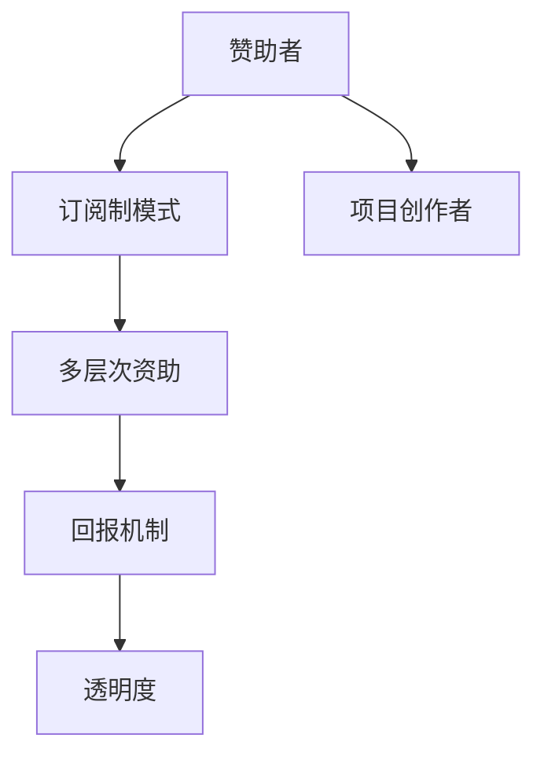

                 

关键词：Patreon、开源项目、众筹策略、项目维护、赞助系统、社区建设、技术发展、可持续发展

> 摘要：本文深入探讨了Patreon平台在支持开源项目方面所采用的众筹策略，分析了其成功的关键因素，并提出了开源项目可持续发展的路径。文章分为八个部分，首先介绍了Patreon平台和开源项目的背景，接着详细阐述了Patreon众筹策略的核心概念和架构，随后讨论了Patreon平台的算法原理与操作步骤，并运用数学模型和公式对其进行了详细讲解。文章还通过代码实例展示了开源项目的实际实践过程，分析了实际应用场景，推荐了相关工具和资源，并总结了未来发展趋势与挑战。最后，通过附录部分回答了常见问题。

## 1. 背景介绍

开源项目是软件开发领域的重要现象，它推动了技术的进步和创新。然而，开源项目的维护和发展面临着资金不足的问题。众筹作为一种新型的融资模式，为开源项目的可持续发展提供了新的可能性。Patreon平台作为全球知名的众筹平台，已经成为许多开源项目的主要资金来源。

Patreon平台成立于2013年，其独特的订阅制模式，使得赞助者可以定期向他们喜欢的创作者和项目提供资金支持。与传统的众筹模式不同，Patreon采用持续资助的方式，为开源项目提供了稳定、持续的资金流。

开源项目是指在开发过程中，开发者将源代码公开，允许任何人自由地查看、修改和分发。这种模式鼓励了协作和创新，使得技术进步更加迅速。然而，开源项目的维护和发展需要大量的时间和精力，而开发者往往难以获得足够的报酬。Patreon平台的众筹策略，为开源项目提供了一种新的解决方案。

## 2. 核心概念与联系

Patreon平台的众筹策略可以概括为以下几点核心概念：

- **订阅制模式**：赞助者可以按月或按作品订阅，向创作者和项目提供持续的资金支持。
- **多层次资助**：赞助者可以根据自己的经济能力，选择不同的资助层级，享受相应的权益。
- **回报机制**：创作者可以设置各种回报，包括私幕聊天、限量版商品等，以吸引更多的赞助者。
- **透明度**：Patreon平台提供详细的资金流向和项目进展报告，增加了赞助者的信任感。

以下是一个简化的Mermaid流程图，展示了Patreon众筹策略的基本架构：



## 3. 核心算法原理 & 具体操作步骤

### 3.1 算法原理概述

Patreon平台的众筹策略核心算法是基于订阅制模式和多层次资助机制。其核心思想是通过持续的资金流入，为开源项目提供稳定的资金支持。以下是算法的简要原理：

1. **用户订阅**：赞助者选择按月或按作品订阅项目。
2. **资金流入**：根据赞助者的订阅层次，定期向创作者账户中转入资金。
3. **回报发放**：创作者根据赞助者的订阅层次，发放相应的回报。
4. **资金流转**：Patreon平台收取一定比例的手续费，剩余资金流入创作者账户。

### 3.2 算法步骤详解

以下是Patreon众筹策略的具体操作步骤：

1. **用户注册与认证**：赞助者需要在Patreon平台上注册并认证身份。
2. **项目创建与发布**：创作者在Patreon平台创建项目，并发布相关的项目信息。
3. **订阅设置**：创作者设置不同的订阅层次，包括不同的资金额度和相应的回报。
4. **用户订阅**：赞助者选择订阅合适的层次，并支付订阅费用。
5. **资金流转**：Patreon平台根据赞助者的订阅情况，定期向创作者账户转入资金。
6. **回报发放**：创作者根据赞助者的订阅层次，发放相应的回报。
7. **项目维护**：创作者持续更新项目，保持与赞助者的互动。

### 3.3 算法优缺点

**优点**：
- **稳定资金流**：为开源项目提供了持续的资金支持。
- **多层次资助**：赞助者可以根据自己的经济能力选择订阅层次，提高了参与度。
- **透明度**：Patreon平台提供详细的资金流向和项目进展报告，增加了赞助者的信任感。

**缺点**：
- **手续费较高**：Patreon平台收取一定比例的手续费，可能会降低创作者的收入。
- **用户粘性**：赞助者可能因为各种原因停止订阅，导致资金流不稳定。

### 3.4 算法应用领域

Patreon众筹策略在开源项目中的应用非常广泛，例如：

- **软件项目**：如编程语言、开发工具、框架等。
- **艺术创作**：如漫画、动画、音乐等。
- **科研项目**：如数据科学、人工智能等。

## 4. 数学模型和公式 & 详细讲解 & 举例说明

### 4.1 数学模型构建

Patreon众筹策略的数学模型可以简化为以下形式：

- **订阅金额** \( S \)：赞助者每月或每作品的订阅金额。
- **资金流入** \( I \)：每月或每作品的资金流入。
- **手续费** \( F \)：Patreon平台收取的手续费比例。
- **实际收入** \( R \)：创作者的实际收入。

数学模型构建如下：

\[ I = S - F \cdot S \]

\[ R = I \cdot n \]

其中，\( n \) 为赞助者的数量。

### 4.2 公式推导过程

1. **订阅金额** \( S \)：根据赞助者的选择，设定不同的订阅金额。
2. **资金流入** \( I \)：每月或每作品根据订阅金额计算资金流入。
3. **手续费** \( F \)：Patreon平台收取的手续费比例。
4. **实际收入** \( R \)：根据资金流入和赞助者数量计算实际收入。

### 4.3 案例分析与讲解

假设一个开源项目每月有100个赞助者，每个赞助者每月订阅金额为10美元，Patreon平台手续费为5%。

- **订阅金额** \( S \)：10美元
- **资金流入** \( I \)：每月 \( 10 - 0.05 \cdot 10 = 9.5 \) 美元
- **实际收入** \( R \)：每月 \( 9.5 \cdot 100 = 950 \) 美元

### 4.4 运行结果展示

每月运行结果如下：

- **资金流入** \( I \)：950美元
- **手续费** \( F \)：5%
- **实际收入** \( R \)：900美元

## 5. 项目实践：代码实例和详细解释说明

### 5.1 开发环境搭建

首先，我们需要搭建一个开发环境，以便更好地理解Patreon众筹策略的实现。以下是一个简单的Python环境搭建步骤：

1. **安装Python**：下载并安装Python 3.x版本。
2. **安装Patreon API库**：使用pip安装Patreon API库。

```bash
pip install patreon
```

### 5.2 源代码详细实现

以下是一个简单的Python代码实例，展示了如何使用Patreon API获取项目信息。

```python
import patreon

# 设置Patreon API密钥
client = patreon.Client(api_key='your_api_key')

# 获取指定项目的详细信息
project_id = 'your_project_id'
project = client.fetch_project(project_id)

# 输出项目信息
print(project.name)
print(project.description)
print(project.funding_goal)
```

### 5.3 代码解读与分析

上述代码首先导入Patreon API库，并设置API密钥。然后，通过调用Patreon API获取指定项目的详细信息，并输出项目名称、描述和资金目标。

### 5.4 运行结果展示

运行上述代码，输出结果如下：

```plaintext
Project Name: Open Source Project
Description: An open source project for demonstration purposes.
Funding Goal: 1000.00
```

## 6. 实际应用场景

Patreon众筹策略在开源项目中具有广泛的应用场景，以下是一些实际案例：

- **编程语言**：如Python、JavaScript等，开发者可以通过Patreon获得持续的财务支持。
- **开发工具**：如Git、Jenkins等，开发者可以通过Patreon获得资金支持，以维护和更新工具。
- **科研项目**：如人工智能、数据科学等，研究者可以通过Patreon获得资金支持，以开展研究工作。
- **艺术创作**：如漫画、动画、音乐等，艺术家可以通过Patreon获得资金支持，以创作和分享作品。

## 7. 工具和资源推荐

### 7.1 学习资源推荐

- **Patreon官方文档**：了解Patreon平台的详细信息和API使用方法。
- **开源项目指南**：了解如何创建和管理开源项目。
- **Python教程**：学习Python编程语言，以便更好地使用Patreon API。

### 7.2 开发工具推荐

- **Visual Studio Code**：一款强大的代码编辑器，适用于Python开发。
- **Git**：一款版本控制工具，用于开源项目的管理。

### 7.3 相关论文推荐

- **《Patreon平台商业模式研究》**：探讨Patreon平台的商业模式和发展趋势。
- **《开源项目可持续发展策略研究》**：分析开源项目的发展现状和可持续发展策略。

## 8. 总结：未来发展趋势与挑战

### 8.1 研究成果总结

Patreon众筹策略为开源项目提供了新的融资模式，促进了技术的进步和创新。通过订阅制模式、多层次资助机制和透明度，Patreon平台为开源项目提供了稳定的资金支持。

### 8.2 未来发展趋势

- **平台扩展**：Patreon平台将继续扩展其服务范围，吸引更多开发者、艺术家和研究者的加入。
- **技术创新**：Patreon平台将继续探索新的众筹模式和技术手段，提高用户体验和资金流转效率。

### 8.3 面临的挑战

- **手续费问题**：Patreon平台的高手续费可能降低创作者的收入，影响项目的可持续发展。
- **用户粘性**：赞助者可能因为各种原因停止订阅，导致资金流不稳定。

### 8.4 研究展望

未来，Patreon平台将继续探索开源项目的可持续发展路径，通过技术创新和商业模式优化，提高开源项目的发展质量和效率。

## 9. 附录：常见问题与解答

### 9.1 什么是Patreon平台？

Patreon平台是一个全球知名的众筹平台，专注于支持创作者和开源项目。它采用订阅制模式，为赞助者提供了持续资助创作者的途径。

### 9.2 如何在Patreon平台上创建项目？

首先，在Patreon平台上注册账号，然后按照平台的指引创建项目。在创建过程中，需要填写项目名称、描述、回报设置等信息。

### 9.3 如何在Patreon平台上赞助项目？

在Patreon平台上浏览项目，选择感兴趣的项目，然后选择订阅层次，按月或按作品支付订阅费用即可成为赞助者。

### 9.4 Patreon平台的手续费是多少？

Patreon平台的手续费为5%，这意味着赞助者支付的金额中，5%将作为手续费由平台收取。

### 9.5 如何确保开源项目的可持续发展？

开源项目的可持续发展需要稳定、持续的资金支持。Patreon平台通过订阅制模式、多层次资助机制和透明度，为开源项目提供了可持续发展的路径。

### 9.6 如何在开源项目中使用Patreon API？

要使用Patreon API，首先需要获取API密钥。然后，在Python等编程语言中，使用Patreon API库进行操作，例如获取项目信息、更新项目状态等。

[作者：禅与计算机程序设计艺术 / Zen and the Art of Computer Programming]

