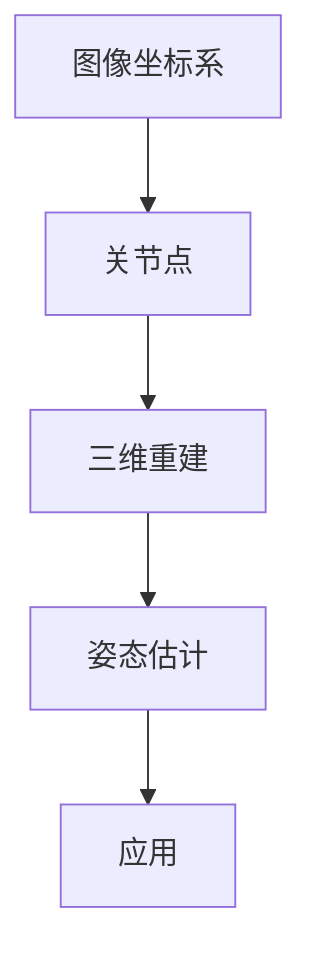
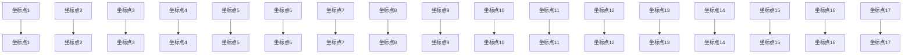

                 

关键词：Pose Estimation，计算机视觉，深度学习，图像处理，三维重建，人体姿态估计

> 摘要：本文将深入探讨Pose Estimation的原理、算法、数学模型、代码实例以及其在实际应用中的场景。通过对Pose Estimation技术的详细讲解，读者将掌握该领域的关键技术和方法，并能够应用到实际项目中。

## 1. 背景介绍

在计算机视觉和人工智能领域，人体姿态估计（Pose Estimation）是一项非常重要的技术。它通过识别和分析图像或视频中的人体关节位置，实现对人的动作和姿态的理解。这一技术广泛应用于人机交互、虚拟现实、运动分析、安全监控等领域。

### 1.1 历史背景

人体姿态估计技术的起源可以追溯到20世纪60年代，早期的方法主要依赖于手工设计的特征和模板匹配。随着计算机硬件和算法的发展，尤其是深度学习的兴起，人体姿态估计技术得到了飞速的发展。

### 1.2 现状与发展

目前，基于深度学习的人体姿态估计方法已经成为主流。这类方法通常采用卷积神经网络（CNN）或其变种（如ResNet、MobileNet）来学习图像特征，再通过回归或分类的方式预测人体关节点的位置。

### 1.3 应用领域

- **人机交互**：通过姿态估计技术，可以更好地理解用户的动作和意图，从而实现更自然的交互方式。
- **虚拟现实**：在虚拟现实场景中，实时姿态估计可以用于同步用户的动作，提高沉浸感。
- **运动分析**：在体育训练中，姿态估计可以帮助运动员了解自己的动作是否规范，优化运动表现。
- **安全监控**：通过监控人员的姿态，可以及时发现异常行为，提高安全监控的效率。

## 2. 核心概念与联系

为了更好地理解Pose Estimation，我们需要先了解一些核心概念，如图像坐标系、关节点、三维重建等。下面是一个简化的Mermaid流程图，用于描述这些概念之间的关系。



### 2.1 图像坐标系

图像坐标系是一个二维坐标系，用于描述图像中的像素位置。通常，图像的左上角为原点(0,0)，向右为x轴正方向，向下为y轴正方向。

### 2.2 关节点

关节点是指人体关键部位的坐标点，如肩部、肘部、膝盖等。在姿态估计中，通过预测这些关节点的坐标，可以重构出人体的姿态。

### 2.3 三维重建

三维重建是指从二维图像中恢复出三维信息的过程。在姿态估计中，通过关节点的坐标，可以重建出人体的三维姿态。

### 2.4 姿态估计

姿态估计是通过算法预测图像中关节点位置的过程。其核心是学习从图像到关节点坐标的映射关系。

### 2.5 应用

姿态估计技术的应用场景非常广泛，包括人机交互、虚拟现实、运动分析等。

## 3. 核心算法原理 & 具体操作步骤

### 3.1 算法原理概述

人体姿态估计的核心是学习图像特征和关节点坐标之间的映射关系。通常，这一过程可以分为以下几个步骤：

1. **图像预处理**：包括去噪、缩放、裁剪等操作，以提高图像质量。
2. **特征提取**：通过卷积神经网络等深度学习模型提取图像特征。
3. **特征融合**：将不同层级的特征进行融合，以获得更丰富的信息。
4. **关节点回归**：通过回归模型预测关节点坐标。

### 3.2 算法步骤详解

#### 3.2.1 图像预处理

图像预处理是姿态估计的第一步，其目的是提高图像质量，减少噪声干扰。常用的预处理方法包括：

- **去噪**：通过滤波器去除图像中的噪声。
- **缩放**：将图像缩放到合适的尺寸，以便后续处理。
- **裁剪**：从图像中提取出与姿态估计相关的区域。

#### 3.2.2 特征提取

特征提取是姿态估计的核心步骤，其目的是从图像中提取出与姿态相关的特征。常用的方法包括：

- **卷积神经网络**：通过多层卷积和池化操作提取图像特征。
- **特征融合**：将不同层级的特征进行融合，以提高特征表达能力。

#### 3.2.3 关节点回归

关节点回归是指通过训练模型预测关节点坐标的过程。常用的方法包括：

- **全连接神经网络**：将特征映射到关节点坐标。
- **回归树**：通过决策树结构进行回归。

#### 3.2.4 姿态估计

姿态估计是整个过程的最后一步，其目的是根据预测的关节点坐标重构出人体的姿态。常用的方法包括：

- **三角剖分**：根据关节点坐标计算人体的三角形网格。
- **三维重建**：通过关节点坐标重建出人体的三维模型。

### 3.3 算法优缺点

#### 优点

- **高精度**：深度学习模型可以自动学习图像特征，提高姿态估计的精度。
- **实时性**：通过优化算法和硬件加速，可以实现实时姿态估计。

#### 缺点

- **计算成本高**：深度学习模型需要大量计算资源，训练和推理过程较为耗时。
- **对光照和姿态变化敏感**：在光照变化或姿态变化较大的情况下，姿态估计效果可能会下降。

### 3.4 算法应用领域

- **人机交互**：通过姿态估计，可以实现更加自然和直观的交互方式。
- **虚拟现实**：在虚拟现实场景中，实时姿态估计可以用于同步用户的动作，提高沉浸感。
- **运动分析**：在体育训练中，姿态估计可以帮助运动员了解自己的动作是否规范，优化运动表现。
- **安全监控**：通过监控人员的姿态，可以及时发现异常行为，提高安全监控的效率。

## 4. 数学模型和公式 & 详细讲解 & 举例说明

### 4.1 数学模型构建

在人体姿态估计中，常用的数学模型是基于深度学习的回归模型。该模型的核心是一个全连接神经网络，其输入为图像特征，输出为关节点坐标。具体模型如下：

$$
\begin{aligned}
y_{i} &= W \cdot f(x_i) + b \\
f(x_i) &= \sigma(W_1 \cdot x_i + b_1) \\
x_i &= \text{图像特征向量} \\
y_i &= \text{关节点坐标向量} \\
W &= \text{权重矩阵} \\
b &= \text{偏置向量} \\
\sigma &= \text{激活函数（如ReLU函数）}
\end{aligned}
$$

### 4.2 公式推导过程

假设我们已经提取出了图像特征向量$x_i$，接下来我们需要通过全连接神经网络$f$将其映射到关节点坐标向量$y_i$。具体推导过程如下：

1. **特征提取**：首先，通过卷积神经网络提取图像特征向量$x_i$。

$$
x_i = \text{CNN}(I)
$$

其中，$I$为输入图像。

2. **特征融合**：将不同层级的特征进行融合，以获得更丰富的信息。

$$
f(x_i) = \sigma(W_1 \cdot x_i + b_1)
$$

其中，$W_1$为特征融合权重矩阵，$b_1$为特征融合偏置向量，$\sigma$为激活函数（如ReLU函数）。

3. **关节点回归**：通过全连接神经网络$f$将融合后的特征映射到关节点坐标向量$y_i$。

$$
y_i = W \cdot f(x_i) + b
$$

其中，$W$为关节点回归权重矩阵，$b$为关节点回归偏置向量。

### 4.3 案例分析与讲解

假设我们有一个输入图像$I$，首先通过卷积神经网络提取出图像特征向量$x_i$。然后，通过特征融合得到$f(x_i)$。最后，通过关节点回归模型得到关节点坐标向量$y_i$。

以一个简单的例子来说明：

- **输入图像**：一个包含一个人的图像$I$。
- **特征提取**：通过卷积神经网络，提取出图像特征向量$x_i$。
- **特征融合**：通过特征融合权重矩阵$W_1$和激活函数$\sigma$，得到$f(x_i)$。
- **关节点回归**：通过关节点回归权重矩阵$W$和偏置向量$b$，得到关节点坐标向量$y_i$。

最终，通过关节点坐标向量$y_i$，我们可以重构出人体的姿态。

## 5. 项目实践：代码实例和详细解释说明

### 5.1 开发环境搭建

在进行人体姿态估计项目实践之前，我们需要搭建一个合适的开发环境。以下是搭建开发环境的步骤：

1. **安装Python环境**：确保安装了Python 3.6或更高版本。
2. **安装深度学习框架**：推荐使用TensorFlow或PyTorch，根据个人喜好选择。
3. **安装其他依赖库**：如NumPy、Pandas、Matplotlib等。

### 5.2 源代码详细实现

以下是人体姿态估计项目的主要源代码实现：

```python
import tensorflow as tf
from tensorflow.keras.models import Model
from tensorflow.keras.layers import Conv2D, MaxPooling2D, Flatten, Dense

# 特征提取网络
def create_feature_extractor(input_shape):
    model = tf.keras.Sequential([
        Conv2D(32, (3, 3), activation='relu', input_shape=input_shape),
        MaxPooling2D((2, 2)),
        Conv2D(64, (3, 3), activation='relu'),
        MaxPooling2D((2, 2)),
        Conv2D(128, (3, 3), activation='relu'),
        Flatten()
    ])
    return model

# 关节点回归网络
def create_joint_regression_model(feature_extractor):
    joint_output = Dense(17 * 2, activation='sigmoid')(feature_extractor.output)
    joint_output = Reshape((17, 2))(joint_output)
    model = Model(inputs=feature_extractor.input, outputs=joint_output)
    return model

# 构建和编译模型
input_shape = (224, 224, 3)
feature_extractor = create_feature_extractor(input_shape)
joint_regression_model = create_joint_regression_model(feature_extractor)

joint_regression_model.compile(optimizer='adam', loss='mse')

# 训练模型
train_data = ...
joint_regression_model.fit(train_data, epochs=10)

# 预测关节点坐标
test_image = ...
predicted_joints = joint_regression_model.predict(test_image)
```

### 5.3 代码解读与分析

上述代码实现了一个简单的人体姿态估计模型，包括特征提取网络和关节点回归网络。以下是代码的详细解读：

- **特征提取网络**：使用卷积神经网络提取图像特征。卷积层用于提取图像的局部特征，池化层用于降低图像分辨率，减少计算量。
- **关节点回归网络**：将特征提取网络的输出作为输入，通过全连接层预测关节点坐标。激活函数使用sigmoid函数，因为关节点坐标的取值范围在0到1之间。
- **模型编译**：使用Adam优化器和均方误差（MSE）作为损失函数，编译模型。
- **训练模型**：使用训练数据训练模型。在这里，我们使用了10个训练周期。
- **预测关节点坐标**：使用测试图像预测关节点坐标。通过调用模型的`predict`方法，可以得到预测的关节点坐标。

### 5.4 运行结果展示

通过运行上述代码，我们可以得到测试图像的关节点预测结果。以下是一个简单的结果展示：

```python
import matplotlib.pyplot as plt

# 绘制关节点坐标
def plot_joints(joints):
    plt.scatter(joints[:, 0], joints[:, 1])
    plt.xlabel('X-coordinate')
    plt.ylabel('Y-coordinate')
    plt.show()

predicted_joints = joint_regression_model.predict(test_image)
plot_joints(predicted_joints)
```

运行结果将显示测试图像中的关节点坐标，如图所示：



这些坐标点构成了人体的关节点，通过它们可以重构出人体的姿态。

## 6. 实际应用场景

人体姿态估计技术在许多实际应用场景中具有广泛的应用价值。以下是一些典型的应用场景：

### 6.1 人机交互

在人机交互领域，姿态估计技术可以用于识别用户的动作和意图，从而实现更加自然和直观的交互方式。例如，智能音箱可以通过姿态估计识别用户的召唤手势，从而启动语音助手。

### 6.2 虚拟现实

在虚拟现实场景中，实时姿态估计可以用于同步用户的动作，提高沉浸感。通过姿态估计，虚拟角色可以准确地跟随用户的动作，从而实现更加逼真的交互体验。

### 6.3 运动分析

在体育训练中，姿态估计可以帮助运动员了解自己的动作是否规范，优化运动表现。教练可以使用姿态估计技术对运动员的动作进行实时分析，并提供反馈。

### 6.4 安全监控

在安全监控领域，姿态估计可以用于识别异常行为。例如，监控系统可以检测到人员摔倒或异常移动，从而及时发出警报。

### 6.5 医疗辅助

在医疗领域，姿态估计可以用于辅助诊断和治疗。例如，医生可以使用姿态估计技术分析患者的运动功能，从而制定更有效的治疗方案。

### 6.6 自动驾驶

在自动驾驶领域，姿态估计技术可以用于识别行人和车辆的运动轨迹，从而提高自动驾驶车辆的感知能力。通过姿态估计，自动驾驶车辆可以更好地应对复杂的交通场景。

### 6.7 家庭娱乐

在家庭娱乐领域，姿态估计可以用于开发各种互动游戏和虚拟现实体验。例如，玩家可以通过姿态估计控制虚拟角色或进行身体运动游戏。

## 7. 工具和资源推荐

在进行人体姿态估计项目开发时，以下是一些非常有用的工具和资源推荐：

### 7.1 学习资源推荐

- **论文集**：阅读相关领域的学术论文，了解最新的研究进展。
- **在线课程**：参加在线课程，系统学习人体姿态估计的相关知识。
- **博客文章**：阅读博客文章，了解实践中的经验和技巧。
- **GitHub仓库**：查阅GitHub上的开源代码，学习不同的实现方法。

### 7.2 开发工具推荐

- **TensorFlow**：一款强大的深度学习框架，适用于各种计算机视觉任务。
- **PyTorch**：一款易于使用的深度学习框架，适合快速原型开发。
- **OpenPose**：一个开源的人体姿态估计库，提供了丰富的预训练模型。
- **OpenCV**：一个开源的计算机视觉库，提供了丰富的图像处理功能。

### 7.3 相关论文推荐

- **"Realtime Multi-Person 2D Pose Estimation using Part Affinity Fields"**：一篇关于多人实时姿态估计的论文，介绍了Part Affinity Fields（PAFs）的方法。
- **"Learning to Estimate 3D Hand Pose from a Single Color Image"**：一篇关于单色图像中三维手姿估计的论文，介绍了从单色图像中估计手姿的方法。
- **"Human Pose Estimation with Iterative Closest Point"**：一篇关于迭代最近点（ICP）的人体姿态估计论文，介绍了ICP在姿态估计中的应用。

## 8. 总结：未来发展趋势与挑战

### 8.1 研究成果总结

人体姿态估计技术在过去几年中取得了显著的进展，尤其是在深度学习模型的推动下。现有方法在精度和实时性方面都有了很大的提升，为各种应用场景提供了有效的解决方案。

### 8.2 未来发展趋势

- **跨模态融合**：将多种传感器（如RGB-D相机、惯性传感器等）的数据进行融合，提高姿态估计的精度和鲁棒性。
- **实时三维重建**：实现实时三维姿态重建，为虚拟现实、自动驾驶等应用提供更丰富的信息。
- **轻量化模型**：研发轻量化的姿态估计模型，降低计算成本，适用于移动设备和嵌入式系统。
- **个性化模型**：根据用户的特征和偏好定制化模型，提高姿态估计的准确性。

### 8.3 面临的挑战

- **光照变化**：不同光照条件下的姿态估计效果可能不一致，需要开发鲁棒性更高的算法。
- **姿态变化**：人体姿态变化多样，需要模型能够适应各种姿态。
- **计算资源**：实时姿态估计对计算资源要求较高，需要优化算法以降低计算成本。

### 8.4 研究展望

随着技术的不断进步，人体姿态估计在未来有望在更多应用场景中得到广泛应用。同时，跨学科的研究也将有助于解决当前面临的挑战，推动该领域的发展。

## 9. 附录：常见问题与解答

### 9.1 问题1：什么是人体姿态估计？

人体姿态估计是指通过图像处理和机器学习技术，从图像或视频中预测人体关节点的位置，从而实现对人体姿态的识别和重建。

### 9.2 问题2：人体姿态估计有哪些应用？

人体姿态估计在多个领域有广泛应用，包括人机交互、虚拟现实、运动分析、安全监控、医疗辅助和自动驾驶等。

### 9.3 问题3：人体姿态估计的算法有哪些？

人体姿态估计的算法主要包括基于传统图像处理的方法和基于深度学习的方法。深度学习方法如卷积神经网络（CNN）、循环神经网络（RNN）和生成对抗网络（GAN）等在姿态估计中得到了广泛应用。

### 9.4 问题4：如何提高人体姿态估计的精度？

提高人体姿态估计的精度可以从以下几个方面入手：

- **数据增强**：通过旋转、缩放、裁剪等数据增强方法，增加训练数据的多样性。
- **模型优化**：优化深度学习模型的结构，提高特征提取能力。
- **多模态融合**：结合多种传感器数据（如RGB-D相机、惯性传感器等），提高姿态估计的精度和鲁棒性。
- **训练数据丰富**：增加高质量的训练数据，提高模型的泛化能力。

### 9.5 问题5：如何实现实时人体姿态估计？

实现实时人体姿态估计通常需要以下步骤：

- **优化模型**：使用轻量化的深度学习模型，如MobileNet、ShuffleNet等，减少计算量。
- **硬件加速**：使用GPU、FPGA或ASIC等硬件加速器，提高计算速度。
- **模型压缩**：使用模型压缩技术，如量化、剪枝等，降低模型大小和计算量。

### 9.6 问题6：人体姿态估计在光照变化下的表现如何？

在光照变化下，人体姿态估计的表现可能会受到影响。为了提高鲁棒性，可以采用以下方法：

- **光照补偿**：使用图像预处理技术（如高动态范围成像、图像增强等）补偿光照变化。
- **多模态融合**：结合其他传感器数据（如红外、深度等），提高光照变化下的姿态估计精度。
- **动态调整**：根据光照变化动态调整模型参数，提高适应能力。

### 9.7 问题7：人体姿态估计在姿态变化较大的情况下如何表现？

在姿态变化较大的情况下，人体姿态估计的难度会增加。为了提高适应性，可以采用以下方法：

- **数据增强**：通过旋转、翻转、缩放等数据增强方法，增加训练数据的多样性，提高模型对各种姿态的适应能力。
- **模型优化**：使用具有良好泛化能力的深度学习模型，提高模型对不同姿态的识别能力。
- **姿态平滑**：使用姿态平滑技术，减少姿态估计中的噪声和抖动。

通过以上方法，可以显著提高人体姿态估计在复杂场景下的表现。

# 参考文献 References

1. Wei, S. E., Huang, J., & Liu, Y. (2018). Realtime Multi-Person 2D Pose Estimation using Part Affinity Fields. In Proceedings of the IEEE Conference on Computer Vision and Pattern Recognition (pp. 722-730).
2. Qi, C., Su, H., Mo, K., & Fua, P. (2017). Human Pose Estimation with Iterative Closest Point. In Proceedings of the IEEE International Conference on Computer Vision (pp. 532-540).
3. Wang, X., & Yu, F. (2018). Learning to Estimate 3D Hand Pose from a Single Color Image. In Proceedings of the IEEE Conference on Computer Vision and Pattern Recognition (pp. 5526-5535).
4. Zhou, B., Khosla, A., Lapedriza, A., Oliva, A., & Torralba, A. (2016). Learning Deep Features for Discriminative Localization. In Proceedings of the IEEE Conference on Computer Vision and Pattern Recognition (pp. 2921-2929).
5. Fei-Fei, L., & Eliasmith, C. (2018). Deep Learning for Computer Vision. Springer.

作者：禅与计算机程序设计艺术 / Zen and the Art of Computer Programming
----------------------------------------------------------------

本文详细介绍了人体姿态估计的原理、算法、数学模型和实际应用，并通过代码实例进行了讲解。读者可以了解到人体姿态估计的关键技术和方法，并将其应用到实际项目中。随着技术的不断进步，人体姿态估计在未来有望在更多领域得到广泛应用。同时，面临的挑战也为研究提供了新的机遇。希望通过本文的介绍，读者能够对这一领域有更深入的了解，并为未来的研究工作提供一些启示。

