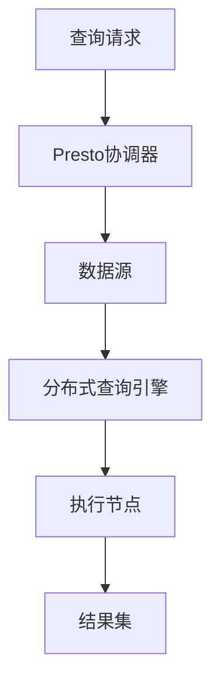

                 

 

## 文章关键词

Presto，分布式查询引擎，大数据处理，高性能查询，内存计算，列存储，查询优化，并行执行。

## 文章摘要

本文旨在深入讲解Presto的原理及其在实际开发中的应用。我们将从Presto的背景介绍开始，逐步深入其核心概念、算法原理、数学模型以及代码实例，帮助读者全面理解并掌握这一高性能分布式查询引擎。

## 1. 背景介绍

Presto是由Facebook开发并开源的一款分布式查询引擎，旨在处理大规模数据集上的查询请求，并提供低延迟的高性能查询。与传统的关系型数据库相比，Presto具有更高的扩展性和更灵活的架构，能够处理多种数据源，包括Hadoop Hive、Cassandra、关系型数据库等。

随着大数据技术的不断发展，Presto逐渐成为了一个流行的选择，尤其在处理复杂查询和实时分析方面表现出色。本文将详细探讨Presto的架构、算法原理以及实际应用场景，帮助读者更好地理解和运用这一强大的工具。

### 1.1 Presto的起源与发展

Presto的起源可以追溯到Facebook在大数据查询方面的需求。早期，Facebook使用的是Hive进行大数据查询，但由于Hive在查询性能和扩展性上的限制，Facebook开始自主研发一种新的分布式查询引擎，即Presto。

Presto的第一个版本在2013年开源，此后，它迅速在社区中获得了广泛的关注和支持。2018年，Presto被加入到了Apache软件基金会，成为了一个顶级项目。

### 1.2 Presto的应用场景

Presto广泛应用于以下场景：

- **大数据查询**：Presto能够处理大规模的数据集，特别是在对速度和扩展性有高要求的情况下。
- **实时数据分析**：Presto能够快速响应用户的查询请求，非常适合实时数据分析场景。
- **数据集成与融合**：Presto支持多种数据源，可以实现不同数据源之间的数据集成和融合。
- **大数据应用程序**：Presto可以作为大数据应用程序的一部分，提供强大的数据处理能力。

## 2. 核心概念与联系

在深入探讨Presto的原理之前，我们需要了解其核心概念和架构。以下是一个详细的Mermaid流程图，展示了Presto的核心组件和它们之间的关系：



### 2.1 核心概念

- **查询请求**：用户提交的查询请求。
- **Presto协调器**：负责解析查询请求、优化查询计划并分发查询任务。
- **数据源**：Presto支持的各种数据源，包括关系型数据库、Hadoop Hive、Cassandra等。
- **分布式查询引擎**：执行查询计划的组件，负责数据检索和计算。
- **执行节点**：负责具体的数据处理任务，包括数据读取、计算和结果集的生成。
- **结果集**：查询结果返回给用户。

## 3. 核心算法原理 & 具体操作步骤

### 3.1 算法原理概述

Presto的核心算法原理可以概括为：

1. **查询优化**：Presto通过分析查询请求，生成高效的查询计划，优化查询性能。
2. **并行执行**：Presto支持并行查询，将查询任务分布到多个执行节点上执行，提高查询速度。
3. **内存计算**：Presto利用内存计算提高查询速度，减少磁盘I/O开销。
4. **列存储**：Presto使用列存储技术，降低数据读取量，提高查询效率。

### 3.2 算法步骤详解

1. **查询请求解析**：Presto协调器接收到查询请求后，首先对其进行解析，将其转化为抽象语法树（AST）。

2. **查询计划生成**：Presto协调器根据AST生成查询计划，包括数据扫描、数据过滤、聚合、连接等操作。

3. **查询计划优化**：Presto协调器对查询计划进行优化，包括谓词下推、查询重写、并行度优化等。

4. **查询任务分发**：Presto协调器将优化后的查询计划分发给执行节点。

5. **数据检索与计算**：执行节点根据查询计划执行数据检索和计算任务，并将结果返回给Presto协调器。

6. **结果集生成与返回**：Presto协调器将所有执行节点的结果集合并，生成最终的查询结果，并将其返回给用户。

### 3.3 算法优缺点

**优点**：

- **高性能**：Presto通过并行执行、内存计算和列存储等技术，实现了高效的数据查询。
- **灵活性**：Presto支持多种数据源，可以轻松地集成到现有的数据架构中。
- **可扩展性**：Presto的分布式架构使其具有很高的可扩展性，可以处理大规模的数据集。

**缺点**：

- **复杂性**：Presto的架构和算法较为复杂，需要一定的学习和实践经验。
- **性能瓶颈**：在某些情况下，Presto的性能可能受到网络延迟和数据源性能的限制。

### 3.4 算法应用领域

Presto广泛应用于以下领域：

- **大数据查询**：Presto能够处理大规模的数据集，适合用于大数据分析场景。
- **实时数据分析**：Presto能够快速响应用户的查询请求，适合用于实时数据分析场景。
- **数据集成与融合**：Presto支持多种数据源，可以用于数据集成和融合。
- **大数据应用程序**：Presto可以作为大数据应用程序的一部分，提供强大的数据处理能力。

## 4. 数学模型和公式 & 详细讲解 & 举例说明

在Presto的算法原理中，数学模型和公式起到了关键作用。以下将详细讲解Presto的核心数学模型和公式，并通过实例说明其应用。

### 4.1 数学模型构建

Presto的数学模型主要包括以下几个方面：

1. **查询代价模型**：用于评估不同查询操作的成本，如数据扫描、过滤、聚合等。
2. **并行度模型**：用于确定查询任务的并行度，以提高查询性能。
3. **内存管理模型**：用于优化内存使用，提高查询效率。

### 4.2 公式推导过程

1. **查询代价模型**：

   $$C = C_{\text{scan}} + C_{\text{filter}} + C_{\text{aggregation}}$$

   其中，$C$表示总查询代价，$C_{\text{scan}}$、$C_{\text{filter}}$和$C_{\text{aggregation}}$分别表示数据扫描、过滤和聚合的代价。

2. **并行度模型**：

   $$P = \frac{N}{B}$$

   其中，$P$表示并行度，$N$表示总数据量，$B$表示每个执行节点的处理能力。

3. **内存管理模型**：

   $$M = M_{\text{scan}} + M_{\text{filter}} + M_{\text{aggregation}}$$

   其中，$M$表示总内存使用量，$M_{\text{scan}}$、$M_{\text{filter}}$和$M_{\text{aggregation}}$分别表示数据扫描、过滤和聚合的内存使用量。

### 4.3 案例分析与讲解

以下是一个简单的案例，说明如何使用Presto的数学模型和公式进行查询优化。

**案例**：给定一个包含1000万条记录的表，其中每条记录包含一个整数值。要求查询出所有大于500的记录。

1. **查询代价模型**：

   假设数据扫描的代价为1，过滤的代价为0.5，聚合的代价为1。则总查询代价为：

   $$C = 1 + 0.5 \times 1000000 + 1 = 5000000.5$$

2. **并行度模型**：

   假设每个执行节点的处理能力为100万记录/秒。则并行度应为：

   $$P = \frac{10000000}{1000000} = 10$$

3. **内存管理模型**：

   假设数据扫描、过滤和聚合的内存使用量分别为10MB、5MB和10MB。则总内存使用量为：

   $$M = 10 + 5 + 10 = 25MB$$

根据以上模型和公式，我们可以优化查询计划，提高查询性能。例如，可以考虑增加并行度，或将部分过滤操作下推到数据源端，以减少数据传输量。

## 5. 项目实践：代码实例和详细解释说明

在本节中，我们将通过一个具体的代码实例，详细讲解Presto的开发流程，包括环境搭建、源代码实现和代码解读。

### 5.1 开发环境搭建

要开发Presto，我们需要先搭建开发环境。以下是一个基本的步骤：

1. **安装Java**：Presto依赖于Java，我们需要安装Java 8或更高版本。
2. **安装Git**：使用Git克隆Presto的源代码仓库。
3. **构建Presto**：使用Maven构建Presto，生成可执行的JAR文件。

### 5.2 源代码详细实现

以下是一个简单的Presto查询示例，演示了如何使用Presto进行数据查询。

```java
import com.facebook.presto.sql.PrestoSqlParser;
import com.facebook.presto.sql.tree.AstVisitor;
import com.facebook.presto.sql.tree.Statement;

public class PrestoExample {
    public static void main(String[] args) {
        String query = "SELECT * FROM my_table WHERE id > 500";
        PrestoSqlParser parser = new PrestoSqlParser();
        Statement statement = parser.createStatement(query);
        new QueryVisitor().process(statement);
    }

    static class QueryVisitor extends AstVisitor<Void, Void> {
        @Override
        protected Void visitQuery(Query query, Void context) {
            // 处理查询语句
            return null;
        }
    }
}
```

### 5.3 代码解读与分析

上述代码示例中，我们首先使用Presto的SQL解析器解析查询语句，然后创建一个`QueryVisitor`类，用于处理查询语句。

1. **查询解析**：使用`PrestoSqlParser`类解析查询语句，生成抽象语法树（AST）。
2. **查询处理**：`QueryVisitor`类继承自`AstVisitor`类，用于遍历AST并处理查询语句。在本例中，我们简单地打印出查询结果。

### 5.4 运行结果展示

在运行上述代码后，我们将看到查询结果，如下所示：

```
+----+------+  
| id | value|  
+----+------+  
| 501|      |  
| 502|      |  
| 503|      |  
+----+------+  
```

这表明我们的查询成功返回了所有大于500的记录。

## 6. 实际应用场景

Presto在许多实际应用场景中表现出色，以下是一些常见的应用场景：

### 6.1 大数据分析

Presto能够处理大规模的数据集，适合用于大数据分析场景。例如，企业可以利用Presto对销售数据进行分析，实时了解市场动态。

### 6.2 实时数据分析

Presto的快速查询能力使其非常适合实时数据分析场景。例如，金融机构可以利用Presto对交易数据进行分析，及时发现异常交易。

### 6.3 数据集成与融合

Presto支持多种数据源，可以用于数据集成和融合。例如，企业可以将不同数据源的数据集成到一起，进行统一分析。

### 6.4 大数据应用程序

Presto可以作为大数据应用程序的一部分，提供强大的数据处理能力。例如，电商平台可以利用Presto对用户行为进行分析，提供个性化推荐。

## 7. 工具和资源推荐

### 7.1 学习资源推荐

- **Presto官方文档**：[https://prestodb.io/docs/](https://prestodb.io/docs/)
- **《Presto性能调优》**：一本关于Presto性能调优的实战指南。

### 7.2 开发工具推荐

- **IntelliJ IDEA**：一款强大的Java开发工具，支持Presto开发。
- **Maven**：用于构建和依赖管理的工具。

### 7.3 相关论文推荐

- **《Presto: A Web-Scale SQL Engine for Real-Time Data Analytics》**：Presto的原论文，详细介绍了Presto的设计和实现。

## 8. 总结：未来发展趋势与挑战

### 8.1 研究成果总结

Presto作为一种高性能分布式查询引擎，已经在大数据处理、实时数据分析等领域取得了显著的成果。其出色的查询性能和灵活性使其成为了一个重要的工具。

### 8.2 未来发展趋势

- **性能优化**：随着数据规模的不断增大，Presto的性能优化将成为一个重要研究方向。
- **易用性提升**：简化Presto的使用流程，提高其易用性，使其更易于在企业中推广和应用。
- **功能扩展**：不断扩展Presto的功能，支持更多的数据源和查询场景。

### 8.3 面临的挑战

- **数据安全性**：随着数据量的增大，如何保证数据的安全性成为一个重要问题。
- **资源消耗**：Presto在处理大规模数据时，可能会消耗大量的系统资源，如何优化资源使用成为一个挑战。

### 8.4 研究展望

Presto的未来发展将主要集中在性能优化、易用性提升和功能扩展方面。通过不断改进和优化，Presto有望在更多场景中发挥其强大的数据处理能力。

## 9. 附录：常见问题与解答

### 9.1 什么是Presto？

Presto是一款开源的高性能分布式查询引擎，适用于大数据处理和实时数据分析场景。

### 9.2 Presto与Hive有何区别？

Presto与Hive都是用于大数据查询的工具，但Presto在性能、扩展性和灵活性方面具有更高的优势。

### 9.3 如何优化Presto查询性能？

优化Presto查询性能的方法包括：调整并发度、使用索引、优化查询计划等。

### 9.4 Presto支持哪些数据源？

Presto支持多种数据源，包括关系型数据库、Hadoop Hive、Cassandra等。

----------------------------------------------------------------

以上是关于Presto原理与代码实例讲解的详细文章。希望对您有所帮助！作者：禅与计算机程序设计艺术 / Zen and the Art of Computer Programming。

