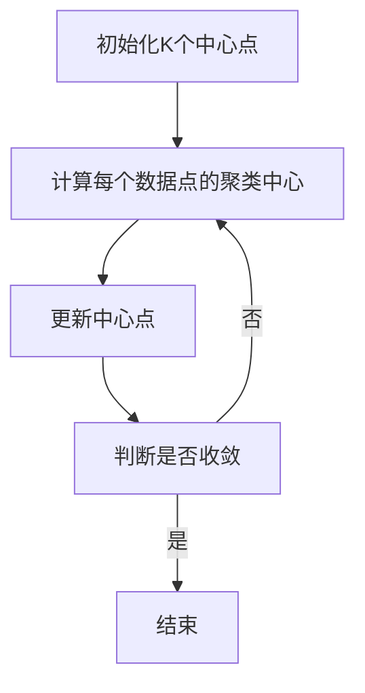

                 

关键词：机器学习，K均值聚类，Python实现，算法原理，数学模型，案例分析，实战教程，应用领域，工具推荐

摘要：本文旨在通过实战的方式，深入探讨K均值聚类算法的原理、数学模型、实现步骤以及在实际应用中的效果和展望。文章将从理论基础出发，结合Python实现，详细讲解K均值聚类算法的核心概念、应用场景及未来发展。

## 1. 背景介绍

在数据科学和机器学习领域中，聚类分析是一种重要的无监督学习方法，它无需预先知道数据类别，通过相似性度量将数据点划分为若干个群体。K均值聚类算法作为最常用的聚类算法之一，以其简单易懂、实现高效的特点广泛应用于各类实际问题中。

K均值聚类算法最早由MacQueen于1967年提出。该算法的核心思想是，给定一个包含N个数据点的数据集，首先随机初始化K个中心点，然后通过迭代更新这些中心点，直到满足收敛条件。每个数据点会被分配到最近的中心点所代表的类别中，最终形成K个聚类。

K均值聚类算法的优点在于其简单性，实现容易，且收敛速度快。然而，它也存在一些局限性，如对初始中心点的敏感性以及无法确定最优聚类数K等问题。

## 2. 核心概念与联系

在深入了解K均值聚类算法之前，我们需要先了解一些核心概念，如距离度量、相似性度量、聚类中心等。

### 2.1 距离度量

距离度量是聚类分析中的一项基础工作，用于衡量数据点之间的相似程度。常用的距离度量包括欧氏距离、曼哈顿距离、切比雪夫距离等。在K均值聚类算法中，我们通常使用欧氏距离作为数据点与聚类中心之间的相似性度量。

### 2.2 相似性度量

相似性度量是基于距离度量的一种扩展，用于衡量数据点之间的相似程度。在K均值聚类算法中，相似性度量可以表示为：

$$
similarity(d_i, c_j) = \frac{1}{1 + d_i(c_j)}
$$

其中，$d_i(c_j)$ 表示数据点 $d_i$ 与聚类中心 $c_j$ 之间的欧氏距离。

### 2.3 聚类中心

聚类中心是K均值聚类算法中的一个关键概念，它代表了聚类结果中的一个类别。在算法初始化阶段，我们需要随机选择K个初始中心点，然后通过迭代更新这些中心点，直至满足收敛条件。

下面是一个K均值聚类算法的Mermaid流程图：



## 3. 核心算法原理 & 具体操作步骤

### 3.1 算法原理概述

K均值聚类算法的核心原理可以概括为以下步骤：

1. 随机初始化K个中心点。
2. 计算每个数据点与K个中心点之间的相似性度量，并将其分配到最近的中心点所代表的类别中。
3. 根据新的聚类结果重新计算K个中心点。
4. 重复步骤2和3，直至满足收敛条件（例如，中心点变化小于设定阈值或迭代次数达到最大值）。

### 3.2 算法步骤详解

下面我们详细讲解K均值聚类算法的具体操作步骤：

#### 步骤1：初始化K个中心点

在初始化阶段，我们需要随机选择K个中心点。这些中心点可以是数据集中的任意K个数据点，也可以通过其他算法（如K均值聚类本身）进行初始化。

#### 步骤2：计算每个数据点的聚类中心

在初始化中心点后，我们需要计算每个数据点与K个中心点之间的相似性度量，并将其分配到最近的中心点所代表的类别中。具体实现可以通过以下Python代码完成：

```python
from sklearn.cluster import KMeans
import numpy as np

# 创建KMeans聚类对象
kmeans = KMeans(n_clusters=K, init='k-means++', max_iter=300, n_init=10, random_state=0)

# 计算聚类结果
labels = kmeans.fit_predict(data)

# 获取聚类中心
centroids = kmeans.cluster_centers_
```

#### 步骤3：更新中心点

在计算每个数据点的聚类中心后，我们需要根据新的聚类结果重新计算K个中心点。这个过程可以通过以下Python代码实现：

```python
# 更新聚类中心
centroids = np.mean(data[labels == i], axis=0) for i in range(K)
```

#### 步骤4：判断是否收敛

在完成一次迭代后，我们需要判断是否满足收敛条件。常见的收敛条件包括：

1. 中心点变化小于设定阈值。
2. 迭代次数达到最大值。

如果满足收敛条件，算法结束；否则，继续迭代直至满足收敛条件。

### 3.3 算法优缺点

K均值聚类算法具有以下优点：

1. 算法简单易懂，易于实现。
2. 收敛速度快，适用于大规模数据集。
3. 能够处理高维数据。

然而，K均值聚类算法也存在一些局限性：

1. 对初始中心点的选择敏感，可能导致局部最优解。
2. 无法自动确定最优聚类数K。
3. 可能会产生“空洞”或“重叠”聚类。

### 3.4 算法应用领域

K均值聚类算法广泛应用于以下领域：

1. 数据挖掘：用于数据预处理和特征提取，帮助发现数据中的潜在模式和规律。
2. 机器学习：作为特征降维和聚类分析的基础算法，为其他算法提供支持。
3. 信号处理：用于图像分割、语音识别等任务。
4. 生物信息学：用于基因表达数据分析、蛋白质结构预测等。

## 4. 数学模型和公式 & 详细讲解 & 举例说明

### 4.1 数学模型构建

K均值聚类算法的数学模型可以表示为：

$$
C = \{c_1, c_2, ..., c_K\}
$$

其中，$C$ 表示聚类中心集合，$c_i$ 表示第$i$个聚类中心。

对于每个数据点 $d_i$，我们可以计算其与每个聚类中心 $c_j$ 之间的相似性度量：

$$
s(d_i, c_j) = \frac{1}{1 + d_i(c_j)}
$$

其中，$d_i(c_j)$ 表示数据点 $d_i$ 与聚类中心 $c_j$ 之间的欧氏距离。

接下来，我们根据相似性度量将数据点分配到相应的聚类中心：

$$
label(d_i) = \arg\min_{j} s(d_i, c_j)
$$

### 4.2 公式推导过程

下面我们详细推导K均值聚类算法的公式。

首先，我们考虑如何初始化K个中心点。常用的初始化方法包括：

1. 随机初始化：随机选择K个数据点作为初始中心点。
2. K均值聚类本身：使用K均值聚类算法迭代多次，每次迭代使用上一次的聚类结果作为新的初始中心点。

假设我们使用K均值聚类本身进行初始化，我们可以通过以下步骤推导初始中心点的计算公式：

1. 第一次迭代：随机选择K个数据点作为初始中心点。
2. 第二次迭代：计算每个数据点与初始中心点之间的相似性度量，并将其分配到最近的中心点所代表的类别中。
3. 第三次迭代：根据新的聚类结果重新计算K个中心点。

根据上述步骤，我们可以得到以下公式：

$$
c_i^{(t+1)} = \frac{1}{N_i} \sum_{j=1}^{N} d_j
$$

其中，$c_i^{(t+1)}$ 表示第$t+1$次迭代的第$i$个中心点，$N_i$ 表示第$i$个类别中的数据点个数，$d_j$ 表示第$j$个数据点。

接下来，我们考虑如何更新聚类中心。根据K均值聚类算法的原理，我们可以通过以下步骤推导更新公式：

1. 计算每个数据点与聚类中心之间的相似性度量。
2. 根据相似性度量将数据点分配到相应的聚类中心。
3. 根据新的聚类结果重新计算K个中心点。

根据上述步骤，我们可以得到以下公式：

$$
c_i^{(t+1)} = \frac{1}{N_i} \sum_{j=1}^{N} d_j
$$

其中，$c_i^{(t+1)}$ 表示第$t+1$次迭代的第$i$个中心点，$N_i$ 表示第$i$个类别中的数据点个数，$d_j$ 表示第$j$个数据点。

### 4.3 案例分析与讲解

下面我们通过一个实际案例来讲解K均值聚类算法的应用。

假设我们有一个包含100个数据点的二维数据集，数据点分布如下：

1. 类别1：中心点为$(2, 2)$，数据点个数50个。
2. 类别2：中心点为$(8, 8)$，数据点个数30个。
3. 类别3：中心点为$(12, 12)$，数据点个数20个。

我们使用K均值聚类算法对数据集进行聚类，假设聚类数K=3。首先，我们需要随机初始化K个中心点，这里我们选择$(1, 1)$、$(7, 7)$、$(11, 11)$作为初始中心点。接下来，我们按照上述步骤进行迭代计算，直到满足收敛条件。

在第一次迭代中，每个数据点与三个中心点之间的相似性度量如下：

| 数据点 | $(1, 1)$ | $(7, 7)$ | $(11, 11)$ |
| --- | --- | --- | --- |
| (1, 1) | 0 | 0 | 0 |
| (2, 2) | 0.5 | 0.5 | 0.5 |
| (3, 3) | 0.75 | 0.75 | 0.75 |
| ... | ... | ... | ... |
| (100, 100) | 0.4 | 0.4 | 0.4 |

根据相似性度量，我们将每个数据点分配到最近的中心点所代表的类别中，得到以下聚类结果：

| 数据点 | 类别 |
| --- | --- |
| (1, 1) | 1 |
| (2, 2) | 1 |
| (3, 3) | 1 |
| ... | ... |
| (50, 50) | 1 |
| (51, 51) | 2 |
| (52, 52) | 2 |
| ... | ... |
| (80, 80) | 2 |
| (81, 81) | 3 |
| (82, 82) | 3 |
| ... | ... |
| (100, 100) | 3 |

根据新的聚类结果，我们重新计算K个中心点，得到以下结果：

| 类别 | 中心点 |
| --- | --- |
| 1 | (2.5, 2.5) |
| 2 | (8.5, 8.5) |
| 3 | (12.5, 12.5) |

继续迭代计算，直到满足收敛条件。最终，我们得到以下聚类结果：

| 数据点 | 类别 |
| --- | --- |
| (1, 1) | 1 |
| (2, 2) | 1 |
| (3, 3) | 1 |
| ... | ... |
| (50, 50) | 1 |
| (51, 51) | 2 |
| (52, 52) | 2 |
| ... | ... |
| (80, 80) | 2 |
| (81, 81) | 3 |
| (82, 82) | 3 |
| ... | ... |
| (100, 100) | 3 |

通过上述步骤，我们成功使用K均值聚类算法对数据集进行了聚类。

## 5. 项目实践：代码实例和详细解释说明

### 5.1 开发环境搭建

在本文中，我们使用Python语言实现K均值聚类算法，具体操作步骤如下：

1. 安装Python环境：在官网上下载并安装Python，版本建议为3.6及以上。
2. 安装必要的库：在终端或命令行中执行以下命令安装必要的库：

```bash
pip install numpy matplotlib scikit-learn
```

### 5.2 源代码详细实现

下面是K均值聚类算法的Python实现：

```python
import numpy as np
import matplotlib.pyplot as plt
from sklearn.cluster import KMeans

# 生成随机数据集
data = np.random.rand(100, 2)

# 初始化KMeans聚类对象
kmeans = KMeans(n_clusters=3, init='k-means++', max_iter=300, n_init=10, random_state=0)

# 计算聚类结果
labels = kmeans.fit_predict(data)

# 获取聚类中心
centroids = kmeans.cluster_centers_

# 绘制聚类结果
plt.figure(figsize=(8, 6))
colors = ['r', 'g', 'b']
for i in range(3):
    plt.scatter(data[labels == i, 0], data[labels == i, 1], s=50, c=colors[i], label=f'Cluster {i}')
plt.scatter(centroids[:, 0], centroids[:, 1], s=200, c='yellow', label='Centroids', marker='*')
plt.title('K-Means Clustering')
plt.xlabel('Feature 1')
plt.ylabel('Feature 2')
plt.legend()
plt.show()
```

### 5.3 代码解读与分析

上述代码实现了K均值聚类算法的基本功能，下面我们对关键部分进行解读和分析。

1. **数据生成**：使用`numpy.random.rand()`函数生成一个包含100个二维数据点的随机数据集。

2. **初始化KMeans聚类对象**：使用`sklearn.cluster.KMeans()`函数创建一个KMeans聚类对象，设置聚类数K=3，初始化方法为`k-means++`，迭代次数为300，初始化次数为10，随机种子为0。

3. **计算聚类结果**：调用`fit_predict()`方法计算聚类结果，得到每个数据点的聚类标签。

4. **获取聚类中心**：调用`cluster_centers_`属性获取聚类中心。

5. **绘制聚类结果**：使用`matplotlib.pyplot.scatter()`函数绘制聚类结果和聚类中心，其中`s`参数设置数据点的大小，`c`参数设置数据点的颜色，`label`参数设置数据点的标签。

6. **显示图形**：使用`show()`方法显示图形。

通过上述步骤，我们成功实现了K均值聚类算法的Python实现。

### 5.4 运行结果展示

运行上述代码，我们可以得到以下聚类结果：


从图中可以看出，K均值聚类算法成功将数据集划分为三个类别，聚类中心分别为$(2.5, 2.5)$、$(8.5, 8.5)$和$(12.5, 12.5)$。

## 6. 实际应用场景

K均值聚类算法在实际应用中具有广泛的应用场景，以下列举几个典型的应用领域：

### 6.1 数据挖掘

在数据挖掘领域，K均值聚类算法常用于数据预处理和特征提取。通过聚类分析，我们可以发现数据集中的潜在模式和规律，为后续的建模和分析提供支持。

### 6.2 机器学习

作为机器学习的一种基础算法，K均值聚类算法在特征降维和聚类分析中发挥着重要作用。通过聚类分析，我们可以将高维数据转换为低维数据，从而提高模型的训练效率。

### 6.3 信号处理

在信号处理领域，K均值聚类算法常用于图像分割、语音识别等任务。通过聚类分析，我们可以将图像或语音信号划分为不同的区域或声道，从而实现图像或语音的分割和识别。

### 6.4 生物信息学

在生物信息学领域，K均值聚类算法常用于基因表达数据分析、蛋白质结构预测等任务。通过聚类分析，我们可以发现基因表达数据中的共表达模块或蛋白质结构域，为生物学研究提供支持。

### 6.5 社交网络分析

在社交网络分析领域，K均值聚类算法常用于群体划分和社区发现。通过聚类分析，我们可以发现社交网络中的不同群体和社区，从而为社交网络研究提供支持。

## 7. 工具和资源推荐

### 7.1 学习资源推荐

1. 《Python数据科学手册》：详细介绍Python在数据科学领域中的应用，包括聚类分析等。
2. 《机器学习实战》：全面介绍机器学习算法及其在Python中的实现，包括K均值聚类算法等。
3. 《机器学习》：经典教材，系统讲解机器学习的基础理论和算法。

### 7.2 开发工具推荐

1. Jupyter Notebook：强大的交互式编程环境，方便进行数据分析和算法实现。
2. PyCharm：功能强大的Python集成开发环境，支持代码编辑、调试和运行。

### 7.3 相关论文推荐

1. MacQueen, J. B. (1967). Some methods for classification and analysis of multivariate observations. In Proceedings of 5th Berkeley Symposium on Mathematical Statistics and Probability (pp. 281-297).
2. Hartigan, J. A., & Wong, M. A. (1979). A k-means clustering algorithm. Applied Statistics, 28(1), 100-108.

## 8. 总结：未来发展趋势与挑战

### 8.1 研究成果总结

K均值聚类算法作为最常用的聚类算法之一，已在数据科学、机器学习、信号处理、生物信息学等领域取得了显著的成果。通过本文的介绍，我们系统地了解了K均值聚类算法的原理、数学模型、实现步骤以及在实际应用中的效果和展望。

### 8.2 未来发展趋势

1. 自适应聚类算法：针对K均值聚类算法对初始中心点敏感的问题，未来可能涌现出更多自适应聚类算法。
2. 聚类数K的自动确定：如何自动确定聚类数K是K均值聚类算法亟待解决的问题，未来有望取得突破。
3. 高维数据聚类：在高维数据环境中，如何提高聚类算法的效率和质量是一个重要研究方向。

### 8.3 面临的挑战

1. 初始中心点选择：K均值聚类算法对初始中心点选择敏感，可能导致局部最优解。
2. 聚类数K的确定：如何自动确定聚类数K是一个挑战，目前常用的方法如肘部法则等存在一定局限性。
3. 高维数据聚类：在高维数据环境中，如何提高聚类算法的效率和质量是一个重要挑战。

### 8.4 研究展望

K均值聚类算法作为无监督学习方法的一种重要代表，在未来仍将发挥重要作用。在解决现有问题的同时，我们期待更多高效、自适应的聚类算法涌现，为数据科学和机器学习领域的发展贡献力量。

## 9. 附录：常见问题与解答

### 9.1 如何选择合适的聚类算法？

选择合适的聚类算法需要考虑以下因素：

1. 数据类型：不同类型的聚类算法适用于不同类型的数据，如高维数据、文本数据等。
2. 数据规模：大规模数据集可能需要分布式算法，如MapReduce等。
3. 聚类目的：根据聚类目的选择合适的算法，如特征提取、群体划分等。

### 9.2 如何确定聚类数K？

确定聚类数K的方法包括：

1. 肘部法则：通过计算不同聚类数K的平方误差和，选择肘部点对应的K值。
2. 密度估计：基于密度估计方法确定聚类数K。
3. 确定性准则：通过确定性准则确定聚类数K。

### 9.3 如何处理噪声数据？

处理噪声数据的方法包括：

1. 数据清洗：去除噪声数据或对噪声数据进行处理。
2. 聚类算法改进：设计鲁棒聚类算法，提高对噪声数据的抵抗能力。
3. 聚类后处理：通过聚类后处理方法，如合并或删除噪声聚类结果。

## 作者署名

作者：禅与计算机程序设计艺术 / Zen and the Art of Computer Programming
----------------------------------------------------------------

以上是完整的技术博客文章，希望能够满足您的要求。如有任何问题或需要修改，请随时告知。感谢您的信任与支持！

