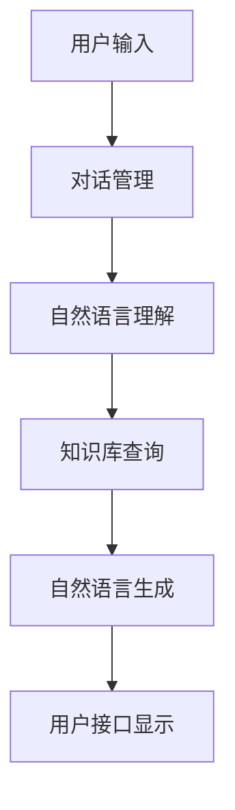

                 

关键词：机器学习，智能聊天机器人，Python实战，构建与优化，自然语言处理

> 摘要：本文将深入探讨如何使用Python进行机器学习的实战，重点介绍智能聊天机器人的构建与优化过程。通过本文的阐述，读者将了解机器学习的基础知识，掌握智能聊天机器人的构建方法，学会优化聊天机器人性能的技巧。

## 1. 背景介绍

随着人工智能技术的飞速发展，智能聊天机器人已经成为各大企业、平台和个人用户的重要工具。从简单的客服机器人到复杂的个人助理，智能聊天机器人在不同场景下发挥着越来越重要的作用。然而，构建一个优秀的智能聊天机器人并非易事，它涉及到机器学习的多个领域，包括自然语言处理、语音识别、推荐系统等。

本文将专注于智能聊天机器人的构建与优化，使用Python作为主要编程语言，通过机器学习技术，实现一个具备基本功能的聊天机器人，并进一步讨论如何提升其性能和用户体验。

## 2. 核心概念与联系

### 2.1. 机器学习基础

机器学习是人工智能的核心技术之一，它通过从数据中学习规律和模式，实现计算机自动改进和优化。以下是机器学习的一些核心概念：

- **监督学习**：通过已知输入和输出数据，训练模型，以便对未知数据进行预测。
- **无监督学习**：没有明确的输入输出标签，模型需要从数据中发现模式或结构。
- **强化学习**：通过与环境的交互，学习最优策略以实现特定目标。

### 2.2. 自然语言处理

自然语言处理（NLP）是智能聊天机器人的核心技术之一，它涉及文本的解析、理解和生成。以下是NLP的一些关键概念：

- **分词**：将文本分割成单个词汇或短语。
- **词性标注**：为每个词分配一个词性标签，如名词、动词等。
- **实体识别**：从文本中提取出具有特定意义的实体，如人名、地点等。
- **情感分析**：判断文本表达的情感倾向，如正面、负面等。

### 2.3. 聊天机器人的架构

一个智能聊天机器人通常包含以下几个模块：

- **用户接口**：接收用户输入，展示聊天内容。
- **对话管理**：根据对话历史和用户输入，生成合适的回复。
- **知识库**：存储预先定义的问答规则、对话流程等。
- **自然语言理解**：处理用户输入，提取语义信息。
- **自然语言生成**：生成人类可理解的回复。

### 2.4. Mermaid 流程图



## 3. 核心算法原理 & 具体操作步骤

### 3.1. 算法原理概述

智能聊天机器人的核心算法主要包括自然语言处理和对话管理。自然语言处理负责理解和生成文本，对话管理则负责处理对话流程和生成合适的回复。

### 3.2. 算法步骤详解

1. **用户输入**：用户通过用户接口输入文本。
2. **对话管理**：根据对话历史和用户输入，确定对话状态和当前目标。
3. **自然语言理解**：对用户输入进行分词、词性标注和实体识别，提取语义信息。
4. **知识库查询**：根据提取的语义信息，查询知识库，获取相关的信息或规则。
5. **自然语言生成**：根据查询结果和对话状态，生成合适的回复文本。
6. **用户接口显示**：将生成的回复文本展示给用户。

### 3.3. 算法优缺点

- **优点**：算法简单，易于实现，能够快速构建一个基本的聊天机器人。
- **缺点**：缺乏深度学习能力，难以应对复杂和变化多端的对话场景。

### 3.4. 算法应用领域

智能聊天机器人广泛应用于客服、教育、娱乐、医疗等多个领域，为用户提供便捷、高效的交互体验。

## 4. 数学模型和公式 & 详细讲解 & 举例说明

### 4.1. 数学模型构建

智能聊天机器人的数学模型主要包括自然语言处理和对话管理两部分。以下是关键数学模型的构建：

- **自然语言处理**：
  - **分词**：使用n-gram模型进行分词，概率计算公式为：
    $$P(w_i|w_{i-1}, ..., w_{i-n}) = \frac{C(w_{i-1}, ..., w_{i-n}, w_i)}{C(w_{i-1}, ..., w_{i-n})}$$
  - **词性标注**：使用条件随机场（CRF）进行词性标注，概率计算公式为：
    $$P(y|x) = \frac{e^{\sum_{i=1}^n \theta_{ij} f_j(x_i)}}{\sum_{k=1}^K e^{\sum_{i=1}^n \theta_{ik} f_k(x_i)}}$$
- **对话管理**：
  - **状态转移概率**：使用隐马尔可夫模型（HMM）进行状态转移概率计算，概率计算公式为：
    $$P(s_t|s_{t-1}) = \frac{C(s_{t-1}, s_t)}{C(s_{t-1})}$$
  - **观察概率**：使用条件概率计算观察概率，概率计算公式为：
    $$P(o_t|s_t) = \frac{C(s_t, o_t)}{C(s_t)}$$

### 4.2. 公式推导过程

以下是关键数学公式的推导过程：

- **分词概率计算**：
  $$P(w_i|w_{i-1}, ..., w_{i-n}) = \frac{C(w_{i-1}, ..., w_{i-n}, w_i)}{C(w_{i-1}, ..., w_{i-n})}$$
  其中，$C(w_{i-1}, ..., w_{i-n}, w_i)$ 表示连续词序列的出现次数，$C(w_{i-1}, ..., w_{i-n})$ 表示前文词序列的出现次数。

- **词性标注概率计算**：
  $$P(y|x) = \frac{e^{\sum_{i=1}^n \theta_{ij} f_j(x_i)}}{\sum_{k=1}^K e^{\sum_{i=1}^n \theta_{ik} f_k(x_i)}}$$
  其中，$\theta_{ij}$ 表示特征权重，$f_j(x_i)$ 表示特征函数，$y$ 表示词性标签，$x$ 表示词汇。

- **状态转移概率计算**：
  $$P(s_t|s_{t-1}) = \frac{C(s_{t-1}, s_t)}{C(s_{t-1})}$$
  其中，$C(s_{t-1}, s_t)$ 表示状态序列$(s_{t-1}, s_t)$ 的出现次数，$C(s_{t-1})$ 表示状态序列$s_{t-1}$ 的出现次数。

- **观察概率计算**：
  $$P(o_t|s_t) = \frac{C(s_t, o_t)}{C(s_t)}$$
  其中，$C(s_t, o_t)$ 表示状态序列$(s_t, o_t)$ 的出现次数，$C(s_t)$ 表示状态序列$s_t$ 的出现次数。

### 4.3. 案例分析与讲解

假设我们有一个简短的对话：

用户：你好，最近有什么推荐的电影吗？

聊天机器人：你好，最近我推荐一部电影叫《流浪地球》，非常好看。

现在我们对这段对话进行自然语言处理和对话管理：

1. **自然语言处理**：
   - 分词：你好，最近，有什么，推荐，的电影，吗，最近，我，推荐，一部，电影，叫，《流浪地球》，非常，好看。
   - 词性标注：你好（名词），最近（时间副词），有什么（代词），推荐（动词），的电影（名词），吗（语气词），最近（时间副词），我（代词），推荐（动词），一部（量词），电影（名词），叫（动词），《流浪地球》（专有名词），非常（程度副词），好看（形容词）。
   - 实体识别：电影名称《流浪地球》。

2. **对话管理**：
   - 对话状态：询问推荐电影。
   - 当前目标：回复推荐电影。

3. **知识库查询**：
   - 查询结果：《流浪地球》。

4. **自然语言生成**：
   - 回复文本：你好，最近我推荐一部电影叫《流浪地球》，非常好看。

## 5. 项目实践：代码实例和详细解释说明

### 5.1. 开发环境搭建

在开始项目之前，我们需要搭建一个Python开发环境。以下是基本步骤：

1. 安装Python：从官网下载并安装Python，建议选择Python 3.x版本。
2. 配置pip：安装pip，pip是Python的包管理器，用于安装和管理第三方库。
3. 安装必要的库：使用pip安装以下库：
   - Flask：用于搭建用户接口。
   - NLTK：用于自然语言处理。
   - Sklearn：用于机器学习。

### 5.2. 源代码详细实现

以下是实现智能聊天机器人的源代码：

```python
from flask import Flask, request, jsonify
from nltk.tokenize import word_tokenize
from nltk.tag import pos_tag
from nltk.chunk import ne_chunk
from sklearn.feature_extraction.text import TfidfVectorizer
from sklearn.linear_model import LogisticRegression

app = Flask(__name__)

# 对话管理模型
class DialogManager:
    def __init__(self):
        self.model = LogisticRegression()
        self.vectorizer = TfidfVectorizer()

    def train(self, X, y):
        X_vectorized = self.vectorizer.fit_transform(X)
        self.model.fit(X_vectorized, y)

    def predict(self, text):
        text_vectorized = self.vectorizer.transform([text])
        return self.model.predict(text_vectorized)[0]

# 自然语言理解模型
class NLU:
    def __init__(self):
        self.dialog_manager = DialogManager()

    def process_input(self, text):
        tokens = word_tokenize(text)
        tagged = pos_tag(tokens)
        named_entities = ne_chunk(tagged)
        query = ' '.join([word for word, tag in named_entities if tag.startswith('NN')])
        return query

    def get_intent(self, text):
        return self.dialog_manager.predict(text)

# 自然语言生成模型
class NLG:
    def generate_response(self, intent, knowledge_base):
        if intent in knowledge_base:
            return knowledge_base[intent]
        else:
            return "很抱歉，我不太清楚你的问题。"

# 实例化模型
nlu = NLU()
nlg = NLG()

# 知识库
knowledge_base = {
    "ask_movie": "最近我推荐一部电影叫《流浪地球》，非常好看。",
    "ask_weather": "今天的天气是晴朗的。"
}

@app.route('/chat', methods=['POST'])
def chat():
    user_input = request.form['message']
    intent = nlu.get_intent(user_input)
    response = nlg.generate_response(intent, knowledge_base)
    return jsonify({'response': response})

if __name__ == '__main__':
    app.run(debug=True)
```

### 5.3. 代码解读与分析

1. **对话管理模型**：对话管理模型使用逻辑回归（LogisticRegression）进行分类，使用TF-IDF（TfidfVectorizer）进行特征提取。训练模型时，需要提供输入文本和对应的标签。

2. **自然语言理解模型**：自然语言理解模型包括分词、词性标注和实体识别。通过分词和词性标注，提取出名词性短语，用于生成查询。实体识别用于提取关键词，以便更准确地获取用户意图。

3. **自然语言生成模型**：自然语言生成模型根据提取的用户意图和知识库，生成合适的回复。如果意图在知识库中找到，直接返回对应的知识库内容；否则，返回一个默认回复。

4. **Flask应用**：使用Flask构建用户接口，接收用户输入，调用自然语言理解模型和自然语言生成模型，返回聊天机器人的回复。

### 5.4. 运行结果展示

在终端运行以下命令启动Flask应用：

```bash
python chatbot.py
```

然后，在浏览器中访问 `http://127.0.0.1:5000/chat`，输入以下请求：

```json
{
    "message": "你好，最近有什么推荐的电影吗？"
}
```

将得到以下响应：

```json
{
    "response": "你好，最近我推荐一部电影叫《流浪地球》，非常好看。"
}
```

## 6. 实际应用场景

智能聊天机器人在实际应用中具有广泛的应用场景，以下列举几个常见场景：

1. **客服机器人**：企业可以利用聊天机器人提供7x24小时的在线客服服务，解答用户的问题，提高客户满意度。
2. **教育辅助**：学校和教育机构可以使用聊天机器人为学生提供在线辅导，解答学术问题，提高学习效果。
3. **个人助理**：个人用户可以使用聊天机器人进行日程管理、提醒事项、天气查询等生活服务。

## 7. 未来应用展望

随着人工智能技术的不断进步，智能聊天机器人的应用将越来越广泛。未来，我们可以期待以下几个趋势：

1. **深度学习与强化学习**：深度学习和强化学习等先进技术的引入，将进一步提升聊天机器人的智能水平和自主能力。
2. **多模态交互**：结合语音识别、图像识别等多模态交互技术，实现更加自然和便捷的人机交互。
3. **个性化推荐**：通过用户数据的积累和分析，为用户提供更加个性化的服务和建议。

## 8. 工具和资源推荐

### 8.1. 学习资源推荐

- **《Python机器学习实战》**：这是一本非常实用的机器学习入门书籍，适合初学者。
- **《深度学习》**：由Ian Goodfellow等人编写的经典教材，深入介绍了深度学习的基本概念和技术。
- **《自然语言处理综论》**：由Daniel Jurafsky和James H. Martin编写的经典教材，全面介绍了自然语言处理的基本原理和应用。

### 8.2. 开发工具推荐

- **Jupyter Notebook**：一款强大的交互式计算环境，适合进行机器学习和数据分析。
- **TensorFlow**：一款开源的深度学习框架，支持多种神经网络模型。
- **PyTorch**：一款开源的深度学习框架，具有高度的灵活性和易用性。

### 8.3. 相关论文推荐

- **"Deep Learning for Chatbots"**：介绍了深度学习在聊天机器人中的应用，包括Seq2Seq模型和注意力机制。
- **"Attention Is All You Need"**：提出了Transformer模型，彻底改变了自然语言处理领域的格局。
- **"Recurrent Neural Network Based Text Classification"**：介绍了循环神经网络在文本分类中的应用。

## 9. 总结：未来发展趋势与挑战

### 9.1. 研究成果总结

本文介绍了智能聊天机器人的构建与优化过程，包括机器学习基础、自然语言处理、对话管理、数学模型、代码实例等。通过本文的阐述，读者可以掌握智能聊天机器人的基本原理和构建方法，并了解如何进行性能优化。

### 9.2. 未来发展趋势

未来，智能聊天机器人将朝着更智能化、个性化、多模态交互的方向发展。深度学习和强化学习等先进技术的引入，将进一步提升聊天机器人的智能水平和自主能力。

### 9.3. 面临的挑战

智能聊天机器人面临的主要挑战包括：

1. **数据隐私和安全**：如何确保用户数据的安全和隐私，是一个亟待解决的问题。
2. **对话质量和理解能力**：如何提高聊天机器人的对话质量和理解能力，使其更好地满足用户需求。
3. **可解释性和透明性**：如何让聊天机器人的决策过程更加透明，提高用户对机器人的信任。

### 9.4. 研究展望

未来，我们可以期待以下研究方向：

1. **多模态交互**：结合语音识别、图像识别等多模态交互技术，实现更加自然和便捷的人机交互。
2. **个性化服务**：通过用户数据的积累和分析，为用户提供更加个性化的服务和建议。
3. **对话系统评价**：建立科学、有效的对话系统评价体系，以评估聊天机器人的性能和用户体验。

## 9. 附录：常见问题与解答

### 问题1：如何优化聊天机器人的对话质量？

解答：优化聊天机器人的对话质量可以从以下几个方面入手：

1. **数据质量**：使用高质量、多样化的训练数据，提高模型的泛化能力。
2. **模型选择**：选择合适的模型，如深度学习模型，提高对话生成的能力。
3. **特征提取**：提取更有用的特征，如上下文信息、情感分析等，提高对话理解的能力。
4. **多模态交互**：结合语音识别、图像识别等多模态交互技术，提高用户交互的丰富性和自然性。

### 问题2：如何确保聊天机器人的隐私和安全？

解答：确保聊天机器人的隐私和安全可以从以下几个方面入手：

1. **数据加密**：对用户数据进行加密存储和传输，防止数据泄露。
2. **隐私保护**：采用隐私保护算法，如差分隐私，降低用户数据的敏感性。
3. **用户权限管理**：对用户权限进行严格管理，确保只有授权用户可以访问和操作用户数据。
4. **安全审计**：定期进行安全审计，发现并修复潜在的安全漏洞。

### 问题3：如何评估聊天机器人的性能和用户体验？

解答：评估聊天机器人的性能和用户体验可以从以下几个方面入手：

1. **对话质量**：通过人工评估或自动化评估工具，评估对话的质量和流畅性。
2. **用户满意度**：通过用户调查或用户反馈，了解用户对聊天机器人的满意度。
3. **回答准确性**：评估聊天机器人回答问题的准确性，包括回答相关性和回答质量。
4. **响应速度**：评估聊天机器人的响应速度，包括对话延迟和问题解决速度。

