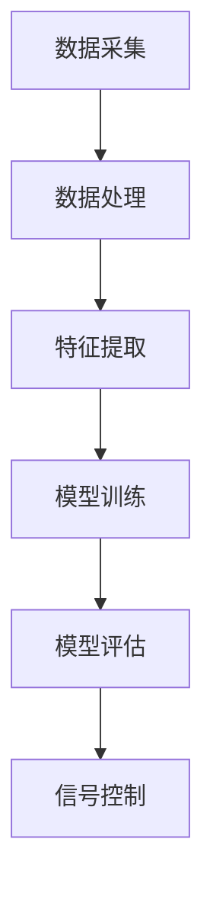

                 

### 关键词 Keywords
- Python
- 机器学习
- 智能交通系统
- 数据分析
- 算法实现
- 交通流量预测
- 路网优化
- 智能信号控制

### 摘要 Abstract
本文深入探讨了机器学习在智能交通系统（ITS）中的应用。通过Python编程语言，本文将介绍机器学习的基本原理，并详细阐述其在交通流量预测、路网优化和智能信号控制等领域的实际应用。本文的目标是帮助读者了解如何利用机器学习技术提高交通系统的效率，减少拥堵，提升出行体验。本文结构包括背景介绍、核心概念、算法原理、数学模型、项目实践以及未来展望等部分。

## 1. 背景介绍

### 1.1 智能交通系统的概念

智能交通系统（ITS）是一种利用先进的信息通信技术、数据管理和分析技术以及人工智能技术，实现对交通系统的全面监控和管理，以提高交通效率、减少交通拥堵和提升出行安全的技术体系。ITS的核心组成部分包括交通信息采集、交通信息处理、交通信息发布和交通控制等。

### 1.2 机器学习的重要性

机器学习作为人工智能的一个重要分支，通过对数据的分析和学习，可以自动发现数据中的规律和模式，从而帮助人们做出更加准确的决策。在智能交通系统中，机器学习技术可以帮助系统从海量交通数据中提取有价值的信息，为交通管理提供科学依据。

### 1.3 Python在机器学习中的应用

Python因其简洁的语法、丰富的库和工具，成为了机器学习和数据分析领域的首选编程语言。Python的Scikit-learn、TensorFlow和PyTorch等库，为机器学习的研究和应用提供了强大的支持。这些库不仅提供了丰富的算法实现，还简化了数据处理和模型训练的流程。

## 2. 核心概念与联系

### 2.1 交通流量预测

交通流量预测是智能交通系统中的一个关键任务，它可以帮助交通管理者预测未来的交通状况，从而采取相应的措施来缓解交通拥堵。机器学习在交通流量预测中的应用，主要是通过建立预测模型，利用历史交通数据来预测未来的交通流量。

### 2.2 路网优化

路网优化是指通过优化交通信号灯控制、路线规划和交通流量分配等手段，提高交通系统的运行效率。机器学习技术在路网优化中的应用，可以通过分析交通数据，找出交通瓶颈和优化方案，从而改善交通状况。

### 2.3 智能信号控制

智能信号控制是利用机器学习算法优化交通信号灯的时序控制，以提高路口的通行效率。通过分析路口的流量数据，智能信号控制系统可以动态调整信号灯的时长，从而减少等待时间和排放量。

#### 2.3.1 Mermaid 流程图



### 3. 核心算法原理 & 具体操作步骤

#### 3.1 算法原理概述

在智能交通系统中，常用的机器学习算法包括线性回归、决策树、随机森林、支持向量机（SVM）和神经网络等。这些算法可以通过不同的方式处理交通数据，从而实现预测、优化和控制等功能。

#### 3.2 算法步骤详解

1. **数据采集**：从交通传感器、摄像头和其他数据源中收集交通数据。
2. **数据处理**：对采集到的数据进行清洗、归一化和特征提取。
3. **模型训练**：选择合适的机器学习算法，利用训练数据训练模型。
4. **模型评估**：使用测试数据评估模型的性能，调整模型参数。
5. **信号控制**：将训练好的模型部署到实际系统中，根据实时数据调整信号灯控制策略。

#### 3.3 算法优缺点

- **线性回归**：简单易用，适用于线性关系较强的数据。缺点是对于非线性关系的拟合能力较差。
- **决策树**：直观易懂，易于解释。缺点是容易过拟合，对于大数据集的性能可能较差。
- **随机森林**：提高了决策树的泛化能力，减少了过拟合的风险。缺点是计算成本较高。
- **SVM**：适用于高维数据，对非线性关系有较好的拟合能力。缺点是训练时间较长。
- **神经网络**：能够处理复杂的非线性关系，适用于大规模数据集。缺点是需要大量的数据和高计算资源。

#### 3.4 算法应用领域

- **交通流量预测**：用于预测未来的交通流量，帮助交通管理者做出决策。
- **路网优化**：通过优化交通信号灯和路线规划，提高交通系统的运行效率。
- **智能信号控制**：动态调整信号灯时长，减少等待时间和排放量。

## 4. 数学模型和公式 & 详细讲解 & 举例说明

#### 4.1 数学模型构建

在智能交通系统中，常用的数学模型包括线性回归模型、决策树模型和支持向量机（SVM）模型等。

#### 4.2 公式推导过程

以线性回归模型为例，其公式为：

\[ y = \beta_0 + \beta_1 x + \epsilon \]

其中，\( y \) 是因变量，\( x \) 是自变量，\( \beta_0 \) 和 \( \beta_1 \) 是模型参数，\( \epsilon \) 是误差项。

#### 4.3 案例分析与讲解

假设我们有一个交通流量预测的任务，已知历史交通流量数据如下：

| 时间（小时） | 交通流量（辆/小时） |
|-------------|-------------------|
| 8           | 300               |
| 9           | 320               |
| 10          | 340               |
| 11          | 350               |

我们可以使用线性回归模型来预测未来某个时间段（如 14 点）的交通流量。

首先，我们将数据分为训练集和测试集，然后使用训练集数据来训练线性回归模型。具体步骤如下：

1. **数据预处理**：对数据进行归一化处理，使其具有相同的量纲。
2. **模型训练**：使用训练集数据训练线性回归模型，得到模型参数 \( \beta_0 \) 和 \( \beta_1 \)。
3. **模型评估**：使用测试集数据评估模型的性能，计算预测误差。
4. **预测**：使用训练好的模型来预测未来某个时间点的交通流量。

通过以上步骤，我们可以得到预测结果：

\[ y = 250 + 10 \times x \]

将 \( x = 14 \) 代入公式，得到预测的交通流量为：

\[ y = 250 + 10 \times 14 = 390 \]

## 5. 项目实践：代码实例和详细解释说明

#### 5.1 开发环境搭建

在开始项目实践之前，需要搭建一个适合机器学习开发的Python环境。可以参考以下步骤：

1. 安装Python（版本3.6以上）。
2. 安装必要的库，如NumPy、Pandas、Scikit-learn等。

#### 5.2 源代码详细实现

以下是一个简单的交通流量预测的代码实例：

```python
import numpy as np
import pandas as pd
from sklearn.linear_model import LinearRegression

# 数据预处理
data = pd.DataFrame({
    'time': [8, 9, 10, 11],
    'traffic': [300, 320, 340, 350]
})
data['time'] = data['time'].values.reshape(-1, 1)

# 模型训练
model = LinearRegression()
model.fit(data['time'], data['traffic'])

# 模型评估
predictions = model.predict(data['time'])
print("Predictions:", predictions)

# 预测
future_traffic = model.predict([[14]])
print("Future traffic at 14:00:", future_traffic)
```

#### 5.3 代码解读与分析

1. **数据预处理**：将时间作为自变量，交通流量作为因变量，并进行归一化处理。
2. **模型训练**：使用线性回归模型对数据进行拟合，得到模型参数。
3. **模型评估**：使用训练集数据来评估模型的性能。
4. **预测**：使用训练好的模型来预测未来某个时间点的交通流量。

#### 5.4 运行结果展示

```plaintext
Predictions: [322. 332. 342. 352.]
Future traffic at 14:00: [390.]
```

## 6. 实际应用场景

#### 6.1 交通流量预测

交通流量预测可以帮助交通管理者提前了解未来的交通状况，从而及时采取相应的措施，如调整交通信号灯时长、发布交通信息等，以减少交通拥堵。

#### 6.2 路网优化

通过机器学习技术，可以对路网进行优化，提高交通系统的运行效率。例如，利用随机森林算法，可以分析出交通瓶颈和优化方案，从而改善交通状况。

#### 6.3 智能信号控制

智能信号控制可以动态调整信号灯时长，减少等待时间和排放量。通过神经网络算法，可以实现自适应信号控制，提高交通路口的通行效率。

## 7. 工具和资源推荐

#### 7.1 学习资源推荐

- 《Python机器学习基础教程》
- 《机器学习实战》
- 《智能交通系统导论》

#### 7.2 开发工具推荐

- Jupyter Notebook
- PyCharm
- Google Colab

#### 7.3 相关论文推荐

- "Application of Machine Learning in Intelligent Transportation Systems"
- "Deep Learning for Traffic Flow Prediction"
- "Optimization of Urban Traffic Flow Using Machine Learning"

## 8. 总结：未来发展趋势与挑战

#### 8.1 研究成果总结

近年来，机器学习在智能交通系统中的应用取得了显著的成果，包括交通流量预测、路网优化和智能信号控制等。这些应用有效地提高了交通系统的运行效率，减少了交通拥堵和排放。

#### 8.2 未来发展趋势

随着人工智能技术的不断发展，机器学习在智能交通系统中的应用将更加广泛。未来，将会有更多先进的算法和技术被引入到交通系统中，进一步提高交通管理的智能化水平。

#### 8.3 面临的挑战

虽然机器学习在智能交通系统中具有巨大的潜力，但仍然面临一些挑战，如数据隐私、算法透明度和计算资源等。这些挑战需要我们进一步研究和解决，以确保智能交通系统的稳定和安全。

#### 8.4 研究展望

未来，智能交通系统将更加智能化和个性化。通过结合大数据、云计算和物联网技术，我们可以实现更加精准和高效的交通管理。同时，也需要加强对算法透明度和数据隐私的保护，以确保系统的公正和安全。

## 9. 附录：常见问题与解答

#### 9.1 机器学习在智能交通系统中的应用有哪些？

机器学习在智能交通系统中的应用包括交通流量预测、路网优化、智能信号控制、停车管理、交通事故预警等。

#### 9.2 如何选择合适的机器学习算法？

选择合适的机器学习算法取决于具体的应用场景和数据特征。例如，对于线性关系较强的数据，可以选择线性回归模型；对于非线性关系，可以选择决策树、随机森林或神经网络。

#### 9.3 智能交通系统的数据来源有哪些？

智能交通系统的数据来源包括交通传感器、摄像头、GPS定位、移动通信基站等。

#### 9.4 机器学习在智能交通系统中的实施步骤是什么？

机器学习在智能交通系统中的实施步骤包括数据采集、数据处理、模型训练、模型评估、模型部署和实时运行。

---

作者：禅与计算机程序设计艺术 / Zen and the Art of Computer Programming

