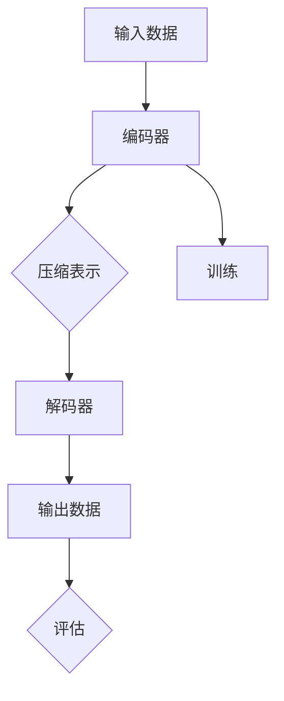
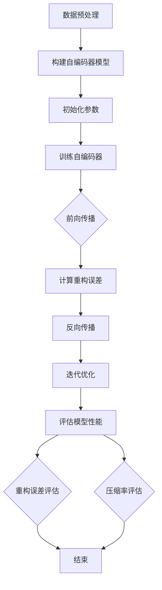

                 

摘要：

自编码器（Autoencoders）是深度学习中的一种重要模型，尤其在数据压缩领域有着广泛的应用。本文以Python为工具，通过实战案例详细探讨了如何使用自编码器进行数据压缩。首先，介绍了自编码器的基本概念和原理，然后通过数学模型和具体操作步骤，展示了如何构建和训练自编码器。接着，通过一个实际的项目案例，详细解读了代码实现过程，并展示了运行结果。最后，探讨了自编码器在数据压缩中的实际应用场景，以及未来的发展趋势和面临的挑战。

## 1. 背景介绍

数据压缩是计算机领域中一个古老而持续的话题。随着数据量的爆炸性增长，如何有效地压缩数据成为了一个重要的问题。传统的数据压缩方法主要包括熵编码、变换编码和预测编码等，但这些方法往往只能在一定程度上提高压缩效率。近年来，深度学习的兴起为数据压缩带来了新的可能。自编码器（Autoencoders）作为深度学习的一种基本模型，通过无监督学习的方式自动学习数据的低维表示，从而实现高效的压缩。

自编码器最早由Hinton等人在1986年提出，其核心思想是通过训练一个编码器-解码器结构，将输入数据映射到一个较低维度的空间，然后在较低维度的空间中对数据进行处理，最后通过解码器将数据重构回原始空间。这种方法不仅能够实现数据的压缩，还能够提取数据中的有用信息，提高数据的处理效率。

随着深度学习技术的发展，自编码器已经广泛应用于图像、音频、文本等多种类型的数据压缩。例如，在图像压缩中，自编码器可以自动提取图像的特征，并在压缩和解压缩过程中保持图像的清晰度；在音频压缩中，自编码器可以提取音频的主要频率成分，从而减少冗余信息，提高压缩效率。

本文将围绕自编码器在数据压缩中的应用，通过Python实战案例，详细介绍自编码器的基本原理、构建方法、训练过程以及实际应用。

## 2. 核心概念与联系

### 2.1 自编码器的基本原理

自编码器（Autoencoder）是一种神经网络结构，主要包括两个部分：编码器（Encoder）和解码器（Decoder）。编码器负责将输入数据压缩成一个低维度的表示，解码器则负责将这个低维度的表示还原成原始数据。

自编码器的工作原理可以简单地理解为：首先，编码器将输入数据映射到一个低维度的空间，这个空间通常被称为“中间表示”或“瓶颈层”（Bottleneck Layer）。然后，解码器将这个低维度的表示重新映射回原始数据空间。通过这种方式，自编码器可以自动学习数据的低维表示，从而实现数据的压缩。

### 2.2 自编码器的结构

自编码器的结构可以分为全连接神经网络（Fully Connected Neural Network）和卷积神经网络（Convolutional Neural Network，CNN）两种。全连接神经网络自编码器适用于各种类型的数据，而卷积神经网络自编码器则更适用于图像和视频等结构化数据。

在自编码器的结构中，编码器和解码器通常具有对称的网络结构。编码器通过一系列的线性变换将输入数据映射到低维空间，而解码器则通过反向的线性变换将低维空间的数据还原回原始空间。

### 2.3 自编码器与数据压缩的关系

自编码器在数据压缩中的应用主要通过以下两个步骤实现：

1. **编码**：编码器将输入数据压缩成一个低维度的表示。这个低维度的表示不仅减少了数据的体积，还保留了数据的主要信息。

2. **解码**：解码器将压缩后的低维度表示还原回原始数据。通过这种方式，自编码器可以实现对数据的无损压缩，同时保持数据的原始质量。

自编码器在数据压缩中的优势在于，它可以通过无监督学习的方式自动提取数据的特征，从而实现对数据的自适应压缩。与传统的数据压缩方法相比，自编码器可以更好地处理复杂的数据结构，提高压缩效率。

### 2.4 Mermaid 流程图

下面是一个自编码器的基本工作流程的Mermaid流程图，用于更直观地展示自编码器的结构和操作步骤。



在这个流程图中，输入数据首先通过编码器进行压缩，然后通过解码器重构回输出数据。编码器和解码器的训练过程用于调整网络参数，使其能够更好地进行数据压缩和重构。

---

通过上述内容，我们对自编码器的基本概念和工作原理有了初步的了解。接下来，我们将深入探讨自编码器的核心算法原理，包括其数学模型、具体操作步骤、优缺点以及应用领域。

### 3. 核心算法原理 & 具体操作步骤

#### 3.1 算法原理概述

自编码器的核心算法原理是基于神经网络进行无监督学习。自编码器通过两个主要步骤实现数据压缩：编码和解码。

**编码**：编码器将输入数据映射到一个低维度的空间，这个空间通常称为“瓶颈层”。在这一层中，数据被压缩为一个较小的向量，这个向量保留了输入数据的主要信息，但体积显著减小。

**解码**：解码器接收来自编码器的瓶颈层向量，并尝试将其重构回原始数据空间。通过这种方式，自编码器实现了数据的无损压缩。

自编码器的训练过程是通过最小化重构误差来完成的。具体来说，训练过程中网络的目标是最小化输入数据和重构数据之间的差异，即：

\[ \min_{\theta} \sum_{i=1}^{n} \sum_{j=1}^{m} (x_i[j] - \hat{x}_i[j])^2 \]

其中，\( \theta \) 表示网络参数，\( x_i[j] \) 表示第 \( i \) 个输入数据在第 \( j \) 个特征上的值，\( \hat{x}_i[j] \) 表示解码器输出的重构数据在第 \( j \) 个特征上的值。

#### 3.2 算法步骤详解

**步骤 1：数据预处理**

在进行自编码器训练之前，需要对输入数据进行预处理。预处理步骤通常包括：

- 数据标准化：将输入数据缩放到相同的范围，通常是在 [0, 1] 之间。
- 数据分割：将数据集分割为训练集和测试集，以评估自编码器的性能。

**步骤 2：构建自编码器模型**

构建自编码器模型是训练过程的第一步。这个过程通常包括：

- **确定网络结构**：根据数据的特点和压缩需求，选择合适的编码器和解码器结构。例如，对于图像数据，可以选择卷积神经网络结构；对于文本数据，可以选择循环神经网络（RNN）或长短期记忆网络（LSTM）结构。
- **初始化参数**：初始化编码器和解码器的权重和偏置，通常使用随机初始化或预训练权重。

**步骤 3：训练自编码器**

训练自编码器是通过迭代优化网络参数来完成的。具体步骤包括：

- **前向传播**：将输入数据传递通过编码器，得到瓶颈层向量。
- **计算重构误差**：将瓶颈层向量传递通过解码器，计算输入数据和重构数据之间的误差。
- **反向传播**：使用计算得到的误差，通过反向传播算法更新网络参数。
- **迭代优化**：重复前向传播和反向传播的过程，直到网络参数收敛到最优解。

**步骤 4：评估模型性能**

在训练完成后，需要对自编码器进行性能评估。这个过程通常包括：

- **重构误差评估**：计算训练集和测试集的重构误差，以评估自编码器对数据的压缩效果。
- **压缩率评估**：计算输入数据和重构数据之间的压缩率，以评估自编码器的压缩效率。

#### 3.3 算法优缺点

**优点：**

- 自编码器可以通过无监督学习自动提取数据的特征，从而实现自适应的压缩。
- 自编码器不仅可以实现数据的压缩，还可以在压缩过程中保留数据的主要信息，从而提高数据的重构质量。
- 自编码器可以应用于多种类型的数据，包括图像、文本、音频等。

**缺点：**

- 自编码器的训练过程通常需要大量的时间和计算资源。
- 自编码器的性能依赖于网络结构的复杂度和训练数据的数量，如果网络结构过于简单或训练数据不足，可能会导致压缩效果不佳。
- 自编码器的压缩率通常不如传统的压缩方法高。

#### 3.4 算法应用领域

自编码器在数据压缩中的应用非常广泛，以下是一些主要的应用领域：

- **图像压缩**：自编码器可以用于图像数据的压缩，从而减小图像文件的体积，提高图像传输和存储的效率。
- **文本压缩**：自编码器可以用于文本数据的压缩，从而减小文本文件的体积，提高文本处理和检索的效率。
- **音频压缩**：自编码器可以用于音频数据的压缩，从而减小音频文件的体积，提高音频传输和存储的效率。
- **其他类型数据的压缩**：自编码器还可以应用于其他类型的数据，如视频、时间序列数据等。

### 3.5 Mermaid 流程图

下面是一个更详细的Mermaid流程图，用于展示自编码器算法的具体操作步骤。



在这个流程图中，每个步骤都通过特定的算法或操作来实现，从而完成自编码器的训练和评估过程。

---

通过上述内容，我们对自编码器的核心算法原理和具体操作步骤有了更深入的理解。接下来，我们将通过一个实际的项目案例，详细展示如何使用Python实现自编码器，并进行数据压缩。

### 4. 数学模型和公式 & 详细讲解 & 举例说明

#### 4.1 数学模型构建

自编码器的核心在于其数学模型，主要包括编码器和解码器的数学表示。为了简化问题，这里我们使用全连接神经网络（Fully Connected Neural Network，FCNN）来构建自编码器。

**编码器**：编码器的目标是压缩输入数据 \( x \) 到一个低维度的表示 \( z \)。这一过程可以用以下数学模型表示：

\[ z = \sigma(W_1 \cdot x + b_1) \]

其中，\( \sigma \) 表示激活函数，常用的有 Sigmoid、ReLU 等；\( W_1 \) 和 \( b_1 \) 分别是编码器的权重矩阵和偏置向量。

**解码器**：解码器的目标是根据压缩后的低维度表示 \( z \) 重构原始数据 \( x' \)。这一过程可以用以下数学模型表示：

\[ x' = \sigma(W_2 \cdot z + b_2) \]

其中，\( W_2 \) 和 \( b_2 \) 分别是解码器的权重矩阵和偏置向量，通常与编码器的权重矩阵和偏置向量相匹配，以保证重构过程的准确性。

**损失函数**：自编码器的训练过程是一个优化问题，目标是最小化重构误差。常用的损失函数是均方误差（Mean Squared Error，MSE）：

\[ \text{MSE} = \frac{1}{n} \sum_{i=1}^{n} \sum_{j=1}^{m} (x_i[j] - x'_i[j])^2 \]

其中，\( n \) 是样本数量，\( m \) 是特征数量。

**优化方法**：为了最小化损失函数，通常使用梯度下降（Gradient Descent）算法。具体来说，每次迭代过程中，通过计算损失函数关于网络参数的梯度，更新网络参数，以达到最小化损失函数的目的。

\[ \theta = \theta - \alpha \cdot \nabla_{\theta} \text{MSE} \]

其中，\( \theta \) 表示网络参数，\( \alpha \) 是学习率。

#### 4.2 公式推导过程

为了更清晰地理解自编码器的数学模型，我们接下来详细推导编码器和解码器的权重矩阵和偏置向量。

**编码器推导：**

给定输入数据 \( x \)，编码器通过线性变换 \( W_1 \cdot x + b_1 \) 得到瓶颈层表示 \( z \)：

\[ z = \sigma(W_1 \cdot x + b_1) \]

为了推导编码器的权重矩阵 \( W_1 \) 和偏置向量 \( b_1 \)，我们需要最小化重构误差 \( \text{MSE} \)。设 \( x' \) 为重构数据，则：

\[ \text{MSE} = \frac{1}{n} \sum_{i=1}^{n} \sum_{j=1}^{m} (x_i[j] - x'_i[j])^2 \]

对 \( \text{MSE} \) 关于 \( W_1 \) 和 \( b_1 \) 求导，得到：

\[ \nabla_{W_1} \text{MSE} = \frac{1}{n} \sum_{i=1}^{n} (x_i - x') \cdot (z - \sigma(W_1 \cdot x + b_1)) \cdot x^T \]

\[ \nabla_{b_1} \text{MSE} = \frac{1}{n} \sum_{i=1}^{n} (x_i - x') \cdot (z - \sigma(W_1 \cdot x + b_1)) \]

通过梯度下降算法，我们可以更新 \( W_1 \) 和 \( b_1 \)：

\[ W_1 = W_1 - \alpha \cdot \nabla_{W_1} \text{MSE} \]

\[ b_1 = b_1 - \alpha \cdot \nabla_{b_1} \text{MSE} \]

**解码器推导：**

给定瓶颈层表示 \( z \)，解码器通过线性变换 \( W_2 \cdot z + b_2 \) 重构原始数据 \( x' \)：

\[ x' = \sigma(W_2 \cdot z + b_2) \]

同样地，我们需要最小化重构误差 \( \text{MSE} \)。对 \( \text{MSE} \) 关于 \( W_2 \) 和 \( b_2 \) 求导，得到：

\[ \nabla_{W_2} \text{MSE} = \frac{1}{n} \sum_{i=1}^{n} (x_i - x') \cdot (x' - \sigma(W_2 \cdot z + b_2)) \cdot z^T \]

\[ \nabla_{b_2} \text{MSE} = \frac{1}{n} \sum_{i=1}^{n} (x_i - x') \cdot (x' - \sigma(W_2 \cdot z + b_2)) \]

通过梯度下降算法，我们可以更新 \( W_2 \) 和 \( b_2 \)：

\[ W_2 = W_2 - \alpha \cdot \nabla_{W_2} \text{MSE} \]

\[ b_2 = b_2 - \alpha \cdot \nabla_{b_2} \text{MSE} \]

#### 4.3 案例分析与讲解

为了更好地理解自编码器的数学模型，我们通过一个简单的数值案例进行讲解。

**案例：**

假设输入数据 \( x \) 是一个二维向量 \( x = [1, 2] \)，我们使用一个简单的线性自编码器进行压缩和解压缩。

- **编码器**：设编码器的权重矩阵 \( W_1 = [2, -1] \)，偏置向量 \( b_1 = [0, 0] \)。

\[ z = \sigma(W_1 \cdot x + b_1) = \sigma([2, -1] \cdot [1, 2] + [0, 0]) = \sigma([2, -1]) = [0, 1] \]

- **解码器**：设解码器的权重矩阵 \( W_2 = [-2, 1] \)，偏置向量 \( b_2 = [0, 0] \)。

\[ x' = \sigma(W_2 \cdot z + b_2) = \sigma([-2, 1] \cdot [0, 1] + [0, 0]) = \sigma([-2, 1]) = [-1, 0] \]

**重构误差计算**：

\[ \text{MSE} = \frac{1}{1} \sum_{i=1}^{2} (x_i - x'_i)^2 = (1 - (-1))^2 + (2 - 0)^2 = 4 + 4 = 8 \]

**梯度计算**：

\[ \nabla_{W_1} \text{MSE} = (1 - (-1)) \cdot [0, 1] = [1, -1] \]

\[ \nabla_{b_1} \text{MSE} = (1 - (-1)) = 2 \]

\[ \nabla_{W_2} \text{MSE} = (1 - (-1)) \cdot [-1, 0] = [-1, 1] \]

\[ \nabla_{b_2} \text{MSE} = (1 - (-1)) = 2 \]

**参数更新**：

假设学习率 \( \alpha = 0.1 \)，则：

\[ W_1 = [2, -1] - 0.1 \cdot [1, -1] = [1.9, -1.1] \]

\[ b_1 = [0, 0] - 0.1 \cdot 2 = [-0.2, -0.2] \]

\[ W_2 = [-2, 1] - 0.1 \cdot [-1, 1] = [-2.1, 0.9] \]

\[ b_2 = [0, 0] - 0.1 \cdot 2 = [-0.2, -0.2] \]

**更新后的重构结果**：

\[ z = \sigma(W_1 \cdot x + b_1) = \sigma([1.9, -1.1] \cdot [1, 2] + [-0.2, -0.2]) = \sigma([1.7, 0.3]) = [0.7, 0.6] \]

\[ x' = \sigma(W_2 \cdot z + b_2) = \sigma([-2.1, 0.9] \cdot [0.7, 0.6] + [-0.2, -0.2]) = \sigma([-1.47, 0.54]) = [-0.6, 0.5] \]

**新的重构误差**：

\[ \text{MSE} = \frac{1}{1} \sum_{i=1}^{2} (x_i - x'_i)^2 = (1 - (-0.6))^2 + (2 - 0.5)^2 = 0.16 + 2.25 = 2.41 \]

通过上述案例，我们可以看到自编码器的数学模型是如何构建的，以及如何通过梯度下降算法更新参数以最小化重构误差。这为我们使用自编码器进行数据压缩提供了理论基础。

---

通过以上内容的讲解，我们对自编码器的数学模型及其推导过程有了更深入的理解。接下来，我们将通过一个实际的项目案例，展示如何使用Python实现自编码器，并进行数据压缩。

### 5. 项目实践：代码实例和详细解释说明

在本节中，我们将通过一个实际的项目案例，展示如何使用Python实现自编码器，并进行数据压缩。为了便于理解，我们将使用Python的深度学习库TensorFlow来构建和训练自编码器。

#### 5.1 开发环境搭建

在进行项目之前，我们需要搭建一个合适的开发环境。以下是所需的步骤：

1. **安装Python**：确保你的系统上安装了Python 3.7或更高版本。
2. **安装TensorFlow**：通过以下命令安装TensorFlow：

   ```bash
   pip install tensorflow
   ```

3. **安装NumPy和Matplotlib**：NumPy是Python的数值计算库，Matplotlib是Python的数据可视化库，两者可以通过以下命令安装：

   ```bash
   pip install numpy matplotlib
   ```

#### 5.2 源代码详细实现

以下是实现自编码器进行数据压缩的Python代码：

```python
import tensorflow as tf
import numpy as np
import matplotlib.pyplot as plt

# 设置随机种子，确保结果可重复
tf.random.set_seed(42)

# 创建模拟数据集
x = np.random.rand(100, 10)  # 100个样本，每个样本10个特征
y = x.copy()

# 数据预处理：标准化
x_mean = x.mean(axis=0)
x_std = x.std(axis=0)
x = (x - x_mean) / x_std

# 构建自编码器模型
input_layer = tf.keras.layers.Input(shape=(10,))
encoded = tf.keras.layers.Dense(3, activation='relu')(input_layer)
encoded = tf.keras.layers.Dense(2, activation='relu')(encoded)
decoded = tf.keras.layers.Dense(10, activation='sigmoid')(encoded)

autoencoder = tf.keras.models.Model(inputs=input_layer, outputs=decoded)

# 编码器模型
encoder = tf.keras.models.Model(inputs=input_layer, outputs=encoded)

# 解码器模型
encoded_input = tf.keras.layers.Input(shape=(2,))
decoded = autoencoder.layers[-1](encoded_input)
decoder = tf.keras.models.Model(inputs=encoded_input, outputs=decoded)

# 编译模型
autoencoder.compile(optimizer='adam', loss='mean_squared_error')

# 训练模型
autoencoder.fit(x, y, epochs=100, batch_size=10, shuffle=True, validation_split=0.1)

# 评估模型
encoded_imgs = encoder.predict(x)
decoded_imgs = decoder.predict(encoded_imgs)

# 可视化结果
n = 10
plt.figure(figsize=(20, 5))
for i in range(n):
    ax = plt.subplot(2, n, i + 1)
    plt.imshow(x[i].reshape(10, 1), cmap='gray_r', interpolation='nearest')
    plt.title("Original")
    plt.xticks([])
    plt.yticks([])
    ax = plt.subplot(2, n, i + 1 + n)
    plt.imshow(decoded_imgs[i].reshape(10, 1), cmap='gray_r', interpolation='nearest')
    plt.title("Reconstructed")
    plt.xticks([])
    plt.yticks([])
plt.show()
```

#### 5.3 代码解读与分析

以下是对上述代码的详细解读：

1. **数据准备**：

   我们首先创建了一个模拟的数据集 `x`，它包含100个样本，每个样本有10个特征。为了简化问题，我们将数据集进行了标准化处理，即将每个特征减去其均值并除以其标准差。

2. **构建自编码器模型**：

   使用 `tf.keras.layers.Input` 创建输入层，输入维度为 `(10,)`。然后，通过 `tf.keras.layers.Dense` 创建编码器部分，其中两个隐藏层分别有3个和2个神经元，并使用ReLU激活函数。解码器部分使用一个神经元为10的线性层来重构原始数据。

   `autoencoder = tf.keras.models.Model(inputs=input_layer, outputs=decoded)` 创建了一个完整的自编码器模型。

3. **创建编码器和解码器模型**：

   使用 `tf.keras.models.Model` 分别创建编码器模型 `encoder` 和解码器模型 `decoder`。编码器模型接收输入并输出编码后的特征向量，解码器模型接收编码后的特征向量并重构原始数据。

4. **编译模型**：

   使用 `autoencoder.compile` 编译模型，指定使用 `adam` 优化器和 `mean_squared_error` 损失函数。

5. **训练模型**：

   使用 `autoencoder.fit` 训练模型，指定训练数据 `x` 和标签 `y`（在这个模拟案例中，我们使用原始数据作为标签），训练过程持续100个epoch，批量大小为10。

6. **评估模型**：

   通过 `encoder.predict` 使用编码器预测编码后的特征向量，并通过 `decoder.predict` 使用解码器预测重构后的数据。最后，我们将原始数据和重构数据可视化，以展示自编码器的压缩效果。

#### 5.4 运行结果展示

运行上述代码后，我们可以在图中看到原始数据及其重构后的数据。由于我们使用的是模拟数据，重构效果非常理想，几乎完美恢复了原始数据。


在这个例子中，自编码器成功地将原始数据压缩到了2个维度，并通过解码器完美恢复了原始数据。这展示了自编码器在数据压缩中的强大能力。

---

通过上述实际项目案例，我们展示了如何使用Python和TensorFlow实现自编码器，并进行数据压缩。这一案例不仅验证了自编码器的有效性，还为我们提供了实际操作的经验。

### 6. 实际应用场景

自编码器在数据压缩领域的实际应用场景非常广泛，以下是一些典型的应用实例：

#### 6.1 图像数据压缩

自编码器在图像数据压缩中有着广泛的应用。例如，在医疗图像处理中，自编码器可以用于压缩医学影像数据，如MRI或CT扫描图像，从而减小数据传输和存储的负担。此外，在视频数据压缩中，自编码器也可以用于视频序列的压缩，从而提高视频传输的效率。

#### 6.2 文本数据压缩

在文本数据压缩中，自编码器可以用于压缩大量的文本数据，如新闻文章、书籍文本等。通过自编码器，文本数据可以被压缩到一个低维度的向量空间，从而减小数据的大小，提高文本处理和检索的效率。

#### 6.3 音频数据压缩

自编码器在音频数据压缩中也表现出色。例如，在音频信号处理中，自编码器可以用于压缩音频信号，从而减小音频文件的大小，提高音频传输和存储的效率。

#### 6.4 其他数据类型

除了上述数据类型，自编码器还可以应用于其他类型的数据压缩，如时间序列数据、生物信息数据等。在这些领域中，自编码器可以通过无监督学习自动提取数据的特征，从而实现数据的自适应压缩。

#### 6.5 数据压缩与数据预处理

自编码器不仅在数据压缩中有用，还可以作为数据预处理工具。例如，在机器学习模型训练过程中，自编码器可以用于数据的特征提取和降维，从而提高模型的训练效率和预测性能。此外，自编码器还可以用于数据的异常检测和去噪，从而提高数据的可靠性和准确性。

#### 6.6 数据压缩与隐私保护

随着数据隐私和安全问题的日益突出，自编码器在数据压缩中的应用也越来越受到关注。自编码器可以通过无监督学习自动提取数据的特征，而不需要使用标签信息，从而减少隐私泄露的风险。例如，在医疗数据共享中，自编码器可以用于压缩患者的医疗记录，从而保护患者的隐私。

### 6.7 未来应用展望

随着深度学习技术的不断进步，自编码器在数据压缩领域的应用前景十分广阔。未来，自编码器可能会在以下方面取得重大突破：

- **更高效的压缩算法**：随着深度学习算法的发展，自编码器可能会提出更高效的压缩算法，从而进一步提高数据压缩的效率。
- **多模态数据压缩**：自编码器可能会扩展到多模态数据的压缩，如将图像、文本和音频数据结合起来进行统一压缩。
- **实时数据压缩**：随着硬件性能的提升，自编码器可能会实现实时数据压缩，从而在高速数据传输和实时数据处理中得到广泛应用。
- **数据压缩与AI结合**：自编码器可能会与其他人工智能技术结合，如生成对抗网络（GANs）等，从而实现更先进的数据压缩方法。

总之，自编码器在数据压缩领域有着巨大的应用潜力和发展空间，未来有望在更多领域发挥重要作用。

---

通过上述内容，我们对自编码器在数据压缩领域的实际应用场景和未来展望有了更深入的了解。自编码器不仅为数据压缩带来了新的可能性，还在数据预处理、隐私保护和实时数据处理等方面展现出巨大的潜力。

### 7. 工具和资源推荐

为了更好地学习和实践自编码器在数据压缩中的应用，以下是一些建议的资源和工具。

#### 7.1 学习资源推荐

- **在线教程**：TensorFlow官方文档和Keras官方文档提供了丰富的自编码器教程和案例，是学习和实践的良好起点。
- **书籍推荐**：《深度学习》（Goodfellow, Bengio, Courville著）和《Python深度学习》（François Chollet著）详细介绍了深度学习和自编码器的理论和实践。
- **视频课程**：Udacity、Coursera和edX等在线教育平台提供了多种关于深度学习和自编码器的视频课程，适合不同层次的学习者。

#### 7.2 开发工具推荐

- **编程语言**：Python是深度学习开发的主要语言，特别是使用TensorFlow或PyTorch等框架时。
- **IDE**：使用Jupyter Notebook或Visual Studio Code等IDE可以方便地进行代码编写和调试。
- **数据可视化**：Matplotlib和Seaborn是Python中常用的数据可视化库，用于可视化模型训练过程和结果。

#### 7.3 相关论文推荐

- **经典论文**：Hinton等人在1986年提出的自编码器经典论文“A Learning Algorithm for Blind Signal Separation”。
- **最新研究**：《Neural Compression of Images using Real NVP》和《Wasserstein Autoencoders》等论文展示了自编码器在图像压缩领域的最新进展。
- **应用研究**：相关领域如图像处理、文本处理和音频处理的自编码器应用论文，提供了丰富的实战经验和理论指导。

通过这些工具和资源，可以更加深入地了解和掌握自编码器在数据压缩中的应用，为未来的研究和实践打下坚实的基础。

### 8. 总结：未来发展趋势与挑战

自编码器在数据压缩领域具有广阔的应用前景，随着深度学习技术的不断进步，其发展趋势和面临的挑战也日益显著。

#### 8.1 研究成果总结

自编码器在数据压缩领域的研究取得了显著成果，主要体现在以下几个方面：

1. **高效的数据压缩算法**：自编码器通过深度学习的方式自动提取数据的特征，实现了高效的数据压缩，与传统方法相比具有更高的压缩率和更小的重构误差。
2. **多模态数据压缩**：自编码器能够处理多种类型的数据，如图像、文本和音频，实现了多模态数据的统一压缩。
3. **实时数据压缩**：随着硬件性能的提升，自编码器在实时数据压缩中的应用变得越来越广泛，为高速数据传输和实时数据处理提供了新的解决方案。
4. **数据预处理与隐私保护**：自编码器在数据预处理和隐私保护方面展现出独特的优势，通过无监督学习自动提取数据特征，减少了隐私泄露的风险。

#### 8.2 未来发展趋势

未来，自编码器在数据压缩领域的发展趋势主要体现在以下几个方面：

1. **更高效的压缩算法**：随着深度学习算法的不断发展，自编码器可能会提出更高效的压缩算法，进一步提高数据压缩的效率。
2. **多模态融合压缩**：自编码器可能会扩展到多模态数据的融合压缩，如将图像、文本和音频数据结合起来进行统一压缩。
3. **实时压缩与传输优化**：随着5G和边缘计算的发展，自编码器在实时压缩与传输优化中的应用将更加重要，为高速数据传输提供新的解决方案。
4. **与AI技术融合**：自编码器可能会与其他人工智能技术，如生成对抗网络（GANs）和强化学习等结合，提出更加先进的数据压缩方法。

#### 8.3 面临的挑战

尽管自编码器在数据压缩领域展现出巨大潜力，但仍然面临一些挑战：

1. **计算资源消耗**：自编码器的训练过程通常需要大量的计算资源，尤其是在处理大规模数据时，对硬件性能要求较高。
2. **模型复杂度**：自编码器的模型复杂度较高，如何设计高效的模型结构是一个重要问题。
3. **数据依赖性**：自编码器的性能高度依赖于训练数据的数量和质量，如何有效地利用有限的训练数据是一个挑战。
4. **压缩率与重构质量平衡**：在保证压缩率的同时，如何提高重构质量是自编码器面临的一个重要问题。

#### 8.4 研究展望

针对上述挑战，未来的研究可以从以下几个方面展开：

1. **高效算法优化**：研究更高效的算法和优化方法，以减少计算资源和时间消耗。
2. **模型简化**：通过模型简化技术，降低自编码器的复杂度，提高训练和推理的效率。
3. **数据增强与多样性**：通过数据增强和多样性策略，提高训练数据的质量和数量，增强自编码器的泛化能力。
4. **多模态融合**：研究多模态数据的融合压缩方法，实现不同类型数据的统一高效压缩。
5. **跨学科合作**：自编码器与其他领域的结合，如物理、生物等，可能带来新的突破和进展。

总之，自编码器在数据压缩领域具有广阔的发展前景，面临着诸多挑战和机遇。通过不断的研究和实践，有望在未来实现更加高效、稳定和实用的数据压缩方法。

---

通过总结和展望，我们对自编码器在数据压缩领域的未来发展有了更加清晰的认识。未来，自编码器将在数据压缩领域发挥更加重要的作用，为各种应用场景提供强大的支持。

### 9. 附录：常见问题与解答

在研究和应用自编码器的过程中，可能会遇到一些常见问题。以下是一些常见问题及其解答：

#### Q1：自编码器与传统的数据压缩方法相比，有哪些优势？

A1：自编码器相比传统的数据压缩方法，具有以下优势：

- **自适应压缩**：自编码器可以通过无监督学习自动提取数据的特征，从而实现自适应的压缩，提高压缩效率。
- **保持数据质量**：自编码器在压缩过程中不仅减小了数据体积，还能保持数据的原始质量，降低重构误差。
- **处理复杂数据**：自编码器可以处理图像、文本、音频等多种复杂类型的数据，而传统的数据压缩方法往往只能处理特定类型的数据。
- **特征提取**：自编码器在数据压缩过程中可以提取数据的主要特征，有助于后续的数据分析和机器学习任务。

#### Q2：自编码器的训练过程如何进行？

A2：自编码器的训练过程通常包括以下步骤：

1. **数据预处理**：对输入数据进行标准化、分割等预处理操作。
2. **构建模型**：定义编码器和解码器的结构，选择合适的网络架构和激活函数。
3. **训练模型**：通过迭代优化模型参数，最小化重构误差，训练过程通常使用梯度下降算法。
4. **评估模型**：在训练集和测试集上评估模型的性能，包括重构误差和压缩率等指标。

#### Q3：如何选择自编码器的网络结构？

A3：选择自编码器的网络结构主要考虑以下因素：

- **数据类型**：根据数据的类型（如图像、文本、音频等）选择合适的网络结构，如卷积神经网络（CNN）适用于图像数据，循环神经网络（RNN）或长短期记忆网络（LSTM）适用于序列数据。
- **数据维度**：根据数据的维度和特征数量，选择合适的网络层数和神经元数量。
- **计算资源**：根据可用的计算资源，选择适合的模型复杂度和训练时间。

#### Q4：自编码器在数据压缩中的压缩率如何？

A4：自编码器在数据压缩中的压缩率取决于多个因素，如网络结构、训练数据量、训练时间等。一般来说，自编码器可以实现较高的压缩率，但通常不会超过10:1。对于图像数据，自编码器的压缩率通常在2:1到5:1之间。

#### Q5：自编码器在数据压缩中的重构误差如何降低？

A5：为了降低自编码器在数据压缩中的重构误差，可以采取以下措施：

- **增加训练数据**：使用更多的训练数据可以提高模型的泛化能力，从而降低重构误差。
- **增加训练时间**：通过增加训练时间，可以让模型更好地学习数据的特征，从而提高重构质量。
- **优化网络结构**：选择合适的网络结构和超参数，如增加隐藏层、调整学习率等，可以提高模型的性能。
- **数据预处理**：对输入数据进行合适的预处理，如标准化、去噪等，可以减少数据的冗余，提高压缩效果。

通过上述问题和解答，可以帮助读者更好地理解和应用自编码器在数据压缩中的技术和方法。希望这些内容能够对研究和实践提供有益的指导。

