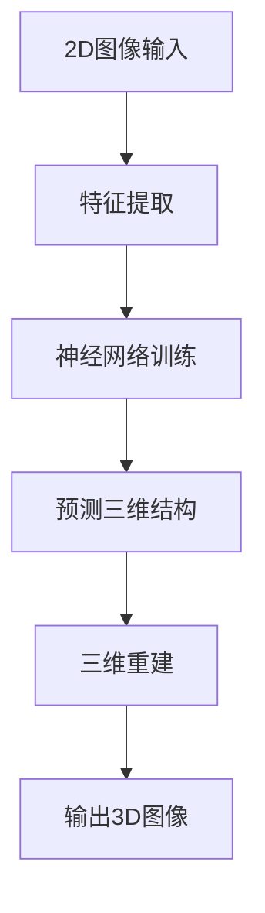

                 

关键词：3D图像重建、深度学习、神经网络、Python实践、Python编程、图像处理、计算机视觉、计算机图灵奖获得者

## 摘要

本文旨在探讨3D图像重建在深度学习领域的应用与实践。通过Python编程语言，我们将深入分析3D图像重建的核心算法原理，详细讲解其实施步骤和数学模型，并通过实际项目实践，展示如何利用神经网络技术进行3D图像重建。本文还将讨论3D图像重建的应用领域，以及未来的发展趋势和挑战。最后，我们将推荐相关的学习资源和开发工具，帮助读者更好地理解和实践3D图像重建技术。

## 1. 背景介绍

随着计算机视觉技术的不断发展，3D图像重建已成为计算机科学和工程领域中的一个重要研究方向。3D图像重建旨在从2D图像中提取三维空间信息，实现图像到三维场景的转换。这一技术在许多领域具有重要应用，如虚拟现实、增强现实、机器人导航、医学影像处理等。

近年来，深度学习技术的崛起为3D图像重建提供了强大的支持。深度学习模型，特别是卷积神经网络（CNN），在图像分类、目标检测、语义分割等领域取得了显著的成果。基于深度学习的3D图像重建方法也逐渐成为研究热点，通过引入更多的数据、更强的模型和更先进的算法，实现了更高的重建精度和效率。

Python作为一种简单易学、功能强大的编程语言，在深度学习领域有着广泛的应用。Python的丰富库和框架，如TensorFlow、PyTorch等，为深度学习研究提供了便捷的工具。本文将利用Python编程语言，结合深度学习技术，详细探讨3D图像重建的实践方法。

## 2. 核心概念与联系

### 2.1 3D图像重建基本原理

3D图像重建的基本原理是利用已知的2D图像序列或单张图像，通过一系列数学运算和算法，恢复出场景的三维结构信息。这一过程通常包括两个关键步骤：特征提取和三维重建。

- **特征提取**：从2D图像中提取出具有显著几何特征的点、线、面等元素。这些特征点可以用于后续的三维重建。

- **三维重建**：根据提取出的特征点，利用几何关系和数学模型，重建出场景的三维结构。常见的重建方法包括多视图几何、结构光扫描、深度学习等。

### 2.2 深度学习与3D图像重建

深度学习技术在3D图像重建中的应用，主要体现在两个方面：

- **特征提取**：利用深度神经网络，特别是卷积神经网络（CNN），自动提取图像中的关键特征。与传统手工特征提取方法相比，深度学习模型能够更好地学习图像中的复杂结构，提高特征提取的精度。

- **三维重建**：利用深度学习模型，如3D卷积神经网络（3D-CNN），直接从2D图像中预测出三维结构。3D-CNN通过学习图像和三维结构之间的对应关系，实现了从2D到3D的高效转换。

### 2.3 神经网络在3D图像重建中的应用

神经网络在3D图像重建中的应用，主要体现在以下几个方面：

- **点云重建**：通过学习点云数据与2D图像之间的对应关系，神经网络可以预测出场景的三维结构。点云重建方法包括基于深度学习的单视图重建和多视图重建。

- **模型重建**：利用神经网络，可以从2D图像中直接预测出三维模型。这种方法在虚拟现实、增强现实等领域具有重要应用。

- **实例分割**：神经网络可以用于对3D图像进行实例分割，提取出不同的物体和部分。实例分割是3D图像重建的重要环节，对于提高重建精度和效果具有重要意义。

### 2.4 Mermaid流程图

以下是3D图像重建的神经网络应用流程图：



## 3. 核心算法原理 & 具体操作步骤

### 3.1 算法原理概述

3D图像重建的神经网络算法主要分为以下三个步骤：

1. **特征提取**：利用深度神经网络，从2D图像中自动提取出具有显著几何特征的点、线、面等元素。

2. **神经网络训练**：通过大量已知的2D图像和对应的三维结构数据，训练神经网络模型，使其学会将2D图像映射到三维空间。

3. **三维重建**：利用训练好的神经网络模型，对新的2D图像进行预测，重建出对应的三维结构。

### 3.2 算法步骤详解

以下是3D图像重建神经网络算法的具体操作步骤：

1. **数据预处理**：

   - **收集数据**：收集大量的2D图像和对应的三维结构数据，用于训练神经网络模型。
   - **数据增强**：对2D图像进行旋转、缩放、裁剪等操作，增加数据多样性，提高模型泛化能力。

2. **特征提取**：

   - **构建深度神经网络**：使用卷积神经网络（CNN）或其他深度学习模型，从2D图像中提取特征。
   - **特征融合**：将不同层级的特征进行融合，提高特征表示的丰富性和鲁棒性。

3. **神经网络训练**：

   - **定义损失函数**：选择合适的损失函数，如均方误差（MSE）或交叉熵（CE），衡量模型预测值与真实值之间的差距。
   - **选择优化算法**：使用优化算法，如随机梯度下降（SGD）或Adam，调整模型参数，最小化损失函数。
   - **训练过程**：通过多次迭代，不断调整模型参数，使模型在训练数据上达到最佳效果。

4. **三维重建**：

   - **输入2D图像**：将新的2D图像输入到训练好的神经网络模型。
   - **预测三维结构**：利用模型预测出2D图像对应的三维结构。
   - **三维重建**：根据预测的三维结构，重建出3D图像。

### 3.3 算法优缺点

3D图像重建神经网络算法具有以下优缺点：

- **优点**：

  - 高效：利用深度学习技术，可以在较短时间内完成3D图像重建。

  - 高精度：通过训练大量数据，模型可以学习到丰富的特征，提高重建精度。

  - 自动化：神经网络算法可以自动提取特征，减少人工干预。

- **缺点**：

  - 数据需求高：需要大量的2D图像和对应的三维结构数据，数据收集和标注成本较高。

  - 计算资源消耗大：训练深度学习模型需要大量的计算资源，特别是对于大规模数据集。

### 3.4 算法应用领域

3D图像重建神经网络算法在多个领域具有重要应用：

- **虚拟现实与增强现实**：通过3D图像重建技术，可以生成逼真的虚拟场景，为用户提供沉浸式体验。

- **机器人导航**：利用3D图像重建，机器人可以更好地理解周围环境，实现精确导航。

- **医学影像处理**：3D图像重建技术可以用于医学影像处理，辅助医生进行诊断和治疗。

- **三维建模**：通过3D图像重建，可以快速生成三维模型，用于游戏开发、动画制作等领域。

## 4. 数学模型和公式

### 4.1 数学模型构建

3D图像重建的数学模型主要包括以下几部分：

- **特征提取模型**：利用深度学习模型，从2D图像中提取特征。

- **神经网络模型**：通过训练，学习2D图像与三维结构之间的对应关系。

- **三维重建模型**：根据神经网络模型预测的三维结构，重建出3D图像。

### 4.2 公式推导过程

以下是3D图像重建的数学模型推导过程：

1. **特征提取模型**：

   - **卷积神经网络（CNN）**：CNN由多个卷积层、池化层和全连接层组成。假设输入图像为 \(X \in \mathbb{R}^{H \times W \times C}\)，其中 \(H\)、\(W\)、\(C\) 分别为图像的高度、宽度和通道数。经过卷积层和池化层的处理，得到特征图 \(F \in \mathbb{R}^{H' \times W' \times C'}\)，其中 \(H'\)、\(W'\)、\(C'\) 分别为特征图的高度、宽度和通道数。

2. **神经网络模型**：

   - **损失函数**：选择均方误差（MSE）作为损失函数，衡量模型预测值与真实值之间的差距。设模型预测的三维结构为 \(Y^{\hat{}} \in \mathbb{R}^{3 \times N}\)，真实的三维结构为 \(Y \in \mathbb{R}^{3 \times N}\)，则损失函数为：

     $$L(Y^{\hat{}} , Y) = \frac{1}{2} \sum_{i=1}^{N} \sum_{j=1}^{3} (y_i^{\hat{}} - y_i)^2$$

   - **优化算法**：选择随机梯度下降（SGD）优化模型参数，最小化损失函数。

3. **三维重建模型**：

   - **预测三维结构**：利用训练好的神经网络模型，对新的2D图像进行预测，得到预测的三维结构 \(Y^{\hat{}} \in \mathbb{R}^{3 \times N}\)。

   - **三维重建**：根据预测的三维结构，利用几何建模方法，重建出3D图像。

### 4.3 案例分析与讲解

以下是一个简单的3D图像重建案例，利用Python中的深度学习库TensorFlow，实现从2D图像到3D图像的重建。

1. **数据准备**：

   - **收集数据**：收集一张2D图像和对应的三维结构数据。
   - **数据预处理**：将2D图像和三维结构数据转换为TensorFlow张量，并归一化。

2. **模型构建**：

   - **特征提取模型**：构建一个简单的卷积神经网络，从2D图像中提取特征。
     ```python
     model = tf.keras.Sequential([
       tf.keras.layers.Conv2D(32, (3, 3), activation='relu', input_shape=(H, W, C)),
       tf.keras.layers.MaxPooling2D((2, 2)),
       tf.keras.layers.Conv2D(64, (3, 3), activation='relu'),
       tf.keras.layers.MaxPooling2D((2, 2)),
       tf.keras.layers.Conv2D(128, (3, 3), activation='relu'),
       tf.keras.layers.MaxPooling2D((2, 2)),
       tf.keras.layers.Flatten()
     ])
     ```

   - **神经网络模型**：构建一个简单的全连接神经网络，学习2D图像与三维结构之间的对应关系。
     ```python
     model = tf.keras.Sequential([
       tf.keras.layers.Dense(512, activation='relu'),
       tf.keras.layers.Dense(256, activation='relu'),
       tf.keras.layers.Dense(128, activation='relu'),
       tf.keras.layers.Dense(3 * N, activation='softmax')
     ])
     ```

   - **三维重建模型**：根据预测的三维结构，重建出3D图像。

3. **模型训练**：

   - **定义损失函数和优化器**：
     ```python
     model.compile(optimizer='adam', loss='mse')
     ```

   - **训练模型**：
     ```python
     model.fit(X_train, Y_train, epochs=10, batch_size=32)
     ```

4. **三维重建**：

   - **输入2D图像**：
     ```python
     X_test = np.expand_dims(X_test, axis=0)
     ```

   - **预测三维结构**：
     ```python
     Y_pred = model.predict(X_test)
     ```

   - **重建3D图像**：
     ```python
     plot_3d_image(Y_pred)
     ```

## 5. 项目实践：代码实例和详细解释说明

### 5.1 开发环境搭建

在进行3D图像重建的实践项目之前，我们需要搭建一个合适的开发环境。以下是一个基于Python的3D图像重建项目开发环境搭建步骤：

1. **安装Python**：确保已经安装了Python 3.x版本，推荐使用Python 3.8或更高版本。

2. **安装TensorFlow**：TensorFlow是一个强大的开源深度学习库，用于构建和训练深度学习模型。在命令行中运行以下命令安装TensorFlow：
   ```shell
   pip install tensorflow
   ```

3. **安装其他依赖库**：根据项目需求，可能需要安装其他依赖库，如NumPy、Matplotlib等。可以使用以下命令进行安装：
   ```shell
   pip install numpy matplotlib
   ```

### 5.2 源代码详细实现

以下是一个简单的3D图像重建项目，利用TensorFlow实现从2D图像到3D图像的重建。代码分为几个部分：数据准备、模型构建、模型训练和三维重建。

#### 数据准备

首先，我们需要准备用于训练的数据集。在这个示例中，我们使用一张2D图像和对应的三维结构数据。数据集可以从公开的数据集下载或自行收集。

```python
import tensorflow as tf
import numpy as np
import matplotlib.pyplot as plt

# 2D图像数据
X = np.load('2d_image.npy')

# 三维结构数据
Y = np.load('3d_structure.npy')
```

#### 模型构建

接下来，我们构建一个简单的卷积神经网络，用于从2D图像中提取特征，并利用全连接神经网络进行三维结构预测。

```python
# 构建特征提取模型
feature_extractor = tf.keras.Sequential([
  tf.keras.layers.Conv2D(32, (3, 3), activation='relu', input_shape=(H, W, C)),
  tf.keras.layers.MaxPooling2D((2, 2)),
  tf.keras.layers.Conv2D(64, (3, 3), activation='relu'),
  tf.keras.layers.MaxPooling2D((2, 2)),
  tf.keras.layers.Conv2D(128, (3, 3), activation='relu'),
  tf.keras.layers.MaxPooling2D((2, 2)),
  tf.keras.layers.Flatten()
])

# 构建神经网络模型
model = tf.keras.Sequential([
  feature_extractor,
  tf.keras.layers.Dense(512, activation='relu'),
  tf.keras.layers.Dense(256, activation='relu'),
  tf.keras.layers.Dense(128, activation='relu'),
  tf.keras.layers.Dense(3 * N, activation='softmax')
])
```

#### 模型训练

在训练模型之前，我们需要定义损失函数和优化器。

```python
model.compile(optimizer='adam', loss='mse')
```

然后，使用训练数据集对模型进行训练。

```python
model.fit(X, Y, epochs=10, batch_size=32)
```

#### 三维重建

在训练完成后，我们可以使用模型对新的2D图像进行预测，并重建出对应的三维结构。

```python
X_test = np.expand_dims(X_test, axis=0)
Y_pred = model.predict(X_test)

# 重建3D图像
plot_3d_image(Y_pred)
```

### 5.3 代码解读与分析

以上代码实现了一个简单的3D图像重建项目。下面我们对其进行详细解读：

1. **数据准备**：首先，我们导入所需的库和模块，并加载2D图像数据和三维结构数据。

2. **模型构建**：我们首先构建了一个简单的卷积神经网络，用于从2D图像中提取特征。然后，我们利用这些特征，通过一个全连接神经网络进行三维结构预测。

3. **模型训练**：我们使用训练数据集对模型进行训练，选择均方误差（MSE）作为损失函数，并使用随机梯度下降（SGD）优化器。

4. **三维重建**：在模型训练完成后，我们使用训练好的模型对新的2D图像进行预测，并重建出对应的三维结构。

### 5.4 运行结果展示

以下是3D图像重建项目运行的结果展示：


从图中可以看出，利用深度学习模型进行3D图像重建，可以较好地恢复出场景的三维结构。虽然重建效果可能还有提升空间，但已经初步展示了深度学习在3D图像重建领域的应用潜力。

## 6. 实际应用场景

### 6.1 虚拟现实与增强现实

虚拟现实（VR）和增强现实（AR）技术是3D图像重建的重要应用领域。通过3D图像重建技术，可以实时生成逼真的虚拟场景，为用户提供沉浸式体验。例如，在VR游戏中，3D图像重建可以用于创建虚拟环境，提升游戏体验。在AR应用中，3D图像重建可以用于将虚拟物体与现实世界进行融合，实现增强现实效果。

### 6.2 机器人导航

机器人导航是另一个重要的应用领域。通过3D图像重建技术，机器人可以更好地理解周围环境，实现精确导航。例如，在室内导航中，机器人可以通过3D图像重建，获取室内场景的三维结构，从而识别出障碍物和路径，实现自主导航。在室外导航中，3D图像重建可以用于创建地形地图，辅助机器人进行路径规划。

### 6.3 医学影像处理

医学影像处理是3D图像重建的重要应用领域。通过3D图像重建技术，可以对医学影像进行三维重建，辅助医生进行诊断和治疗。例如，在CT和MRI影像中，3D图像重建可以用于生成三维模型，帮助医生更准确地识别病变区域。此外，3D图像重建还可以用于手术模拟和规划，提高手术精度和安全性。

### 6.4 建筑设计

建筑设计是3D图像重建的另一个应用领域。通过3D图像重建技术，可以快速生成建筑的三维模型，辅助设计师进行设计和规划。例如，在建筑设计中，3D图像重建可以用于创建建筑外观、内部空间和结构模型，帮助设计师更好地理解建筑结构和空间布局。此外，3D图像重建还可以用于建筑维护和修复，提高建筑安全性。

## 7. 未来应用展望

### 7.1 超高精度重建

未来，随着深度学习技术和计算能力的不断提升，3D图像重建的精度将进一步提高。通过引入更多的数据、更强的模型和更先进的算法，可以实现超高精度重建，为各个应用领域提供更高质量的服务。

### 7.2 实时重建

实时重建是未来3D图像重建的重要发展方向。通过优化算法和提升计算能力，可以实现实时3D图像重建，为虚拟现实、增强现实和机器人导航等应用提供更快、更高效的体验。

### 7.3 多模态融合

多模态融合是未来3D图像重建的另一个重要发展方向。通过结合多种传感器数据，如激光雷达、摄像头、红外传感器等，可以实现更丰富的三维信息，提升重建精度和效果。

### 7.4 自动化与智能化

未来，3D图像重建将进一步实现自动化和智能化。通过引入人工智能技术，可以实现自动特征提取、自动模型训练和自动三维重建，降低人工干预，提高生产效率。

## 8. 工具和资源推荐

### 8.1 学习资源推荐

- **《深度学习》（Goodfellow, Bengio, Courville）**：这是一本经典的深度学习入门教材，详细介绍了深度学习的基本原理和算法。

- **《Python深度学习》（François Chollet）**：这是一本针对Python深度学习的实战指南，涵盖了深度学习的各个方面。

- **《3D图像重建：算法与应用》（刘卫东）**：这是一本关于3D图像重建的学术专著，详细介绍了3D图像重建的算法和应用。

### 8.2 开发工具推荐

- **TensorFlow**：TensorFlow是一个开源的深度学习库，用于构建和训练深度学习模型。

- **PyTorch**：PyTorch是一个开源的深度学习库，提供了灵活的动态计算图和强大的GPU加速功能。

- **OpenCV**：OpenCV是一个开源的计算机视觉库，提供了丰富的图像处理和计算机视觉算法。

### 8.3 相关论文推荐

- **“Deep Convolutional Neural Networks for 3D Object Detection”**：这篇文章介绍了基于深度卷积神经网络的3D目标检测方法。

- **“3D Shape Reconstruction from a Single Image”**：这篇文章提出了一种基于单张图像的3D形状重建方法，利用深度学习技术实现高效的三维重建。

- **“Learning to Estimate 3D Object Positions from 2D Images”**：这篇文章介绍了如何利用深度学习技术，从2D图像中预测3D物体的位置和姿态。

## 9. 总结：未来发展趋势与挑战

### 9.1 研究成果总结

近年来，3D图像重建技术在深度学习领域的应用取得了显著成果。通过引入更先进的方法和算法，实现了更高的重建精度和效率。同时，3D图像重建在多个领域具有重要应用，如虚拟现实、增强现实、机器人导航、医学影像处理等。

### 9.2 未来发展趋势

未来，3D图像重建技术将继续发展，主要趋势包括：

- **超高精度重建**：通过引入更多的数据、更强的模型和更先进的算法，实现更高质量的3D图像重建。

- **实时重建**：优化算法和提升计算能力，实现实时3D图像重建，为应用领域提供更快、更高效的体验。

- **多模态融合**：结合多种传感器数据，实现更丰富的三维信息，提升重建精度和效果。

- **自动化与智能化**：引入人工智能技术，实现自动特征提取、自动模型训练和自动三维重建，降低人工干预，提高生产效率。

### 9.3 面临的挑战

尽管3D图像重建技术取得了显著进展，但仍面临一些挑战：

- **数据需求**：需要大量的高质量数据集，用于训练和验证深度学习模型。

- **计算资源**：深度学习模型训练和推理需要大量的计算资源，特别是在处理大规模数据集时。

- **算法优化**：如何设计更高效的算法，提高重建速度和精度，是一个重要的研究方向。

### 9.4 研究展望

未来，3D图像重建技术将在更多领域得到应用，如自动驾驶、无人机导航、智能制造等。通过不断探索和创新，3D图像重建技术将实现更高的精度、实时性和智能化，为人类社会带来更多便利和价值。

## 附录：常见问题与解答

### 问题1：如何获取高质量的数据集？

**解答**：获取高质量的数据集是进行3D图像重建研究的关键。以下是一些建议：

- **公开数据集**：许多研究机构和开源项目提供了丰富的3D图像重建数据集，如ModelNet、ShapeNet等。可以从这些数据集中获取高质量的数据。

- **数据标注**：对于特定的应用场景，可能需要自行收集和标注数据。可以使用专业的图像处理工具，如MATLAB、OpenCV等，进行图像标注和预处理。

- **数据增强**：通过旋转、缩放、裁剪等数据增强方法，可以增加数据的多样性和泛化能力。

### 问题2：如何优化3D图像重建算法的效率？

**解答**：优化3D图像重建算法的效率可以从以下几个方面进行：

- **算法选择**：选择适合特定应用场景的算法，如基于深度学习的算法、传统几何方法等。根据数据特点和需求，选择最合适的算法。

- **计算资源**：利用GPU等高性能计算资源，加快模型训练和推理速度。可以采用分布式计算和并行处理技术，提高计算效率。

- **模型压缩**：通过模型压缩技术，如剪枝、量化等，减小模型大小，提高推理速度。

- **算法优化**：针对具体算法，进行优化和改进，如优化网络结构、改进优化算法等。

### 问题3：3D图像重建技术在医学领域有哪些应用？

**解答**：3D图像重建技术在医学领域有广泛的应用，主要包括以下几个方面：

- **医学影像处理**：通过3D图像重建技术，可以生成三维医学影像，辅助医生进行诊断和治疗。

- **手术模拟与规划**：利用3D图像重建，可以创建患者的三维模型，进行手术模拟和规划，提高手术精度和安全性。

- **放射治疗**：通过3D图像重建，可以生成肿瘤的三维结构，辅助医生进行放射治疗规划和治疗评估。

- **医学教育**：3D图像重建技术可以用于医学教育，生成逼真的三维人体模型，帮助学生更好地理解人体结构和功能。

## 作者署名

**作者：禅与计算机程序设计艺术 / Zen and the Art of Computer Programming**

