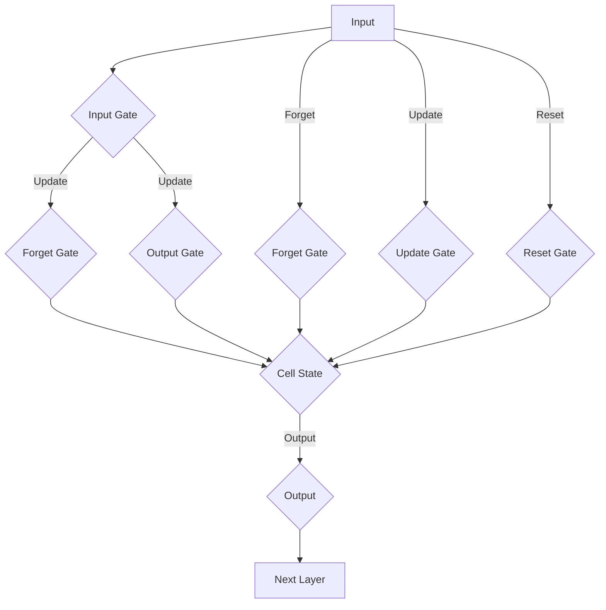

                 

关键词：Python，深度学习，LSTM，GRU，序列数据预测，算法原理，数学模型，项目实践，应用场景，资源推荐

> 摘要：本文将深入探讨LSTM（长短期记忆网络）和GRU（门控循环单元）这两种在深度学习领域广泛应用的循环神经网络结构。我们将介绍它们的基本概念、数学模型、原理、操作步骤以及在序列数据预测中的实际应用。通过具体的代码实例，我们将展示如何在Python中实现LSTM和GRU模型，并对模型的运行结果进行详细分析。最后，我们将讨论这些算法的未来发展方向和面临的挑战。

## 1. 背景介绍

随着信息技术的飞速发展，大数据的应用越来越广泛，如何从海量数据中提取有价值的信息成为了数据科学和机器学习领域的重要研究方向。序列数据预测是大数据分析中的一个重要领域，它涉及到时间序列分析、股票价格预测、文本分类、语音识别等多个方面。为了解决序列数据预测问题，研究人员提出了多种算法，其中LSTM（Long Short-Term Memory）和GRU（Gated Recurrent Unit）是近年来发展迅速且效果显著的两种循环神经网络结构。

LSTM是由Hochreiter和Schmidhuber于1997年首次提出的，它通过引入门控机制解决了传统RNN（Recurrent Neural Network）在处理长序列数据时的梯度消失和梯度爆炸问题。GRU是后来提出的另一种循环神经网络结构，它在LSTM的基础上进行了简化，使得模型在计算效率上得到了提高。

Python作为一种灵活且强大的编程语言，在深度学习领域得到了广泛应用。Python拥有丰富的库和框架，如TensorFlow、PyTorch等，这些工具极大地简化了深度学习模型的构建和训练过程。本文将利用Python和TensorFlow框架，详细介绍LSTM和GRU在序列数据预测中的应用。

## 2. 核心概念与联系

### 2.1. LSTM（长短期记忆网络）

LSTM是一种特殊的循环神经网络，它通过引入门控机制（包括输入门、遗忘门和输出门）来控制信息的流动，从而有效地解决了传统RNN在处理长序列数据时的长期依赖问题。LSTM的基本结构包括三个门和一个单元状态。

**输入门（Input Gate）**：用于决定当前输入的信息中有哪些部分需要更新到单元状态。

**遗忘门（Forget Gate）**：用于决定之前单元状态中的哪些信息需要被遗忘。

**输出门（Output Gate）**：用于决定当前单元状态中有哪些信息需要输出到下一个层。

**单元状态（Cell State）**：存储了序列中的信息，是LSTM中的关键部分。

### 2.2. GRU（门控循环单元）

GRU是LSTM的一种变体，它在LSTM的基础上进行了简化，使得模型在计算效率上得到了提高。GRU通过引入更新门（Update Gate）和重置门（Reset Gate）来替代LSTM的三个门，从而简化了模型结构。

**更新门（Update Gate）**：决定当前输入的信息中有哪些部分需要更新到单元状态。

**重置门（Reset Gate）**：决定当前输入的信息中有哪些部分需要与之前的信息结合。

**单元状态（Cell State）**：与LSTM相同，存储了序列中的信息。

### 2.3. LSTM与GRU的联系

LSTM和GRU都是针对RNN在处理长序列数据时存在的长期依赖问题提出的改进模型。它们通过引入门控机制，使得模型能够有效地保留和更新序列信息。LSTM具有更强的表达能力，但计算复杂度较高；GRU在计算效率上有所提升，但可能无法完全替代LSTM。

### 2.4. LSTM与GRU的 Mermaid 流程图

下面是LSTM和GRU的 Mermaid 流程图，用于展示它们的基本结构和工作原理。



## 3. 核心算法原理 & 具体操作步骤

### 3.1. 算法原理概述

LSTM和GRU的核心思想都是通过门控机制来控制信息的流动。下面分别介绍它们的算法原理。

### 3.2. 算法步骤详解

#### 3.2.1. LSTM算法步骤

1. **初始化**：初始化输入向量、隐藏状态和单元状态。
2. **计算输入门、遗忘门和输出门**：根据当前输入和前一个隐藏状态，计算输入门、遗忘门和输出门。
3. **更新单元状态**：根据输入门、遗忘门和前一个单元状态，更新当前单元状态。
4. **计算输出**：根据输出门和当前单元状态，计算当前隐藏状态。
5. **传递到下一层**：将当前隐藏状态传递到下一层。

#### 3.2.2. GRU算法步骤

1. **初始化**：初始化输入向量、隐藏状态和单元状态。
2. **计算更新门**：根据当前输入和前一个隐藏状态，计算更新门。
3. **计算重置门**：根据当前输入和前一个隐藏状态，计算重置门。
4. **更新单元状态**：根据更新门和重置门，更新当前单元状态。
5. **计算输出**：根据当前单元状态，计算当前隐藏状态。
6. **传递到下一层**：将当前隐藏状态传递到下一层。

### 3.3. 算法优缺点

#### LSTM的优点：

1. **强大的表达能力**：LSTM通过门控机制能够有效地捕捉长序列中的长期依赖关系。
2. **适用于各种序列数据**：LSTM能够处理不同类型和时间间隔的序列数据。

#### LSTM的缺点：

1. **计算复杂度高**：LSTM的门控机制导致计算复杂度较高，训练时间较长。
2. **参数较多**：LSTM的参数数量较多，可能导致过拟合。

#### GRU的优点：

1. **计算效率高**：GRU在LSTM的基础上进行了简化，计算复杂度较低。
2. **参数较少**：GRU的参数数量较少，更容易训练。

#### GRU的缺点：

1. **表达能力有限**：GRU相对于LSTM在表达复杂序列信息时可能不够强大。
2. **长期依赖处理能力较弱**：GRU在处理长序列数据时的长期依赖问题可能不如LSTM。

### 3.4. 算法应用领域

LSTM和GRU在深度学习领域有着广泛的应用，主要包括：

1. **时间序列预测**：如股票价格预测、天气预测、销售额预测等。
2. **自然语言处理**：如文本分类、机器翻译、情感分析等。
3. **语音识别**：如语音转文字、语音合成等。

## 4. 数学模型和公式 & 详细讲解 & 举例说明

### 4.1. 数学模型构建

LSTM和GRU的数学模型是它们的核心，下面分别介绍它们的数学模型。

#### 4.1.1. LSTM数学模型

假设输入序列为 $X = [x_1, x_2, ..., x_T]$，隐藏状态为 $h_t$，单元状态为 $c_t$。

输入门、遗忘门和输出门的计算公式如下：

$$
i_t = \sigma(W_{xi}x_t + W_{hi}h_{t-1} + b_i)
$$

$$
f_t = \sigma(W_{xf}x_t + W_{hf}h_{t-1} + b_f)
$$

$$
o_t = \sigma(W_{xo}x_t + W_{ho}h_{t-1} + b_o)
$$

其中，$\sigma$ 表示sigmoid函数，$W_{xi}$、$W_{hi}$、$b_i$ 分别是输入门权重、隐藏状态权重和偏置。

遗忘门、输入门和输出门的计算公式如下：

$$
c_t = f_t \odot c_{t-1} + i_t \odot \sigma(W_{xc}x_t + W_{hc}h_{t-1} + b_c)
$$

$$
h_t = o_t \odot \sigma(c_t)
$$

其中，$\odot$ 表示元素乘法，$c_{t-1}$ 是前一个时间步的单元状态。

#### 4.1.2. GRU数学模型

假设输入序列为 $X = [x_1, x_2, ..., x_T]$，隐藏状态为 $h_t$，单元状态为 $c_t$。

更新门、重置门和输出门的计算公式如下：

$$
z_t = \sigma(W_{xz}x_t + W_{hz}h_{t-1} + b_z)
$$

$$
r_t = \sigma(W_{xr}x_t + W_{hr}h_{t-1} + b_r)
$$

$$
o_t = \sigma(W_{xo}x_t + W_{ho}h_{t-1} + b_o)
$$

其中，$\sigma$ 表示sigmoid函数，$W_{xz}$、$W_{hz}$、$b_z$ 分别是更新门权重、隐藏状态权重和偏置。

更新门、重置门和输出门的计算公式如下：

$$
c_t = (1 - z_t) \odot c_{t-1} + r_t \odot \sigma(W_{xc}x_t + W_{hc}h_{t-1} + b_c)
$$

$$
h_t = o_t \odot \sigma(c_t)
$$

### 4.2. 公式推导过程

#### 4.2.1. LSTM公式推导

LSTM的推导过程比较复杂，这里只给出简要的推导过程。

1. **输入门**：输入门用于决定当前输入的信息中有哪些部分需要更新到单元状态。具体推导过程如下：

$$
i_t = \sigma(W_{xi}x_t + W_{hi}h_{t-1} + b_i)
$$

其中，$W_{xi}$、$W_{hi}$、$b_i$ 分别是输入门权重、隐藏状态权重和偏置。

2. **遗忘门**：遗忘门用于决定之前单元状态中的哪些信息需要被遗忘。具体推导过程如下：

$$
f_t = \sigma(W_{xf}x_t + W_{hf}h_{t-1} + b_f)
$$

其中，$W_{xf}$、$W_{hf}$、$b_f$ 分别是遗忘门权重、隐藏状态权重和偏置。

3. **输出门**：输出门用于决定当前单元状态中有哪些信息需要输出到下一个层。具体推导过程如下：

$$
o_t = \sigma(W_{xo}x_t + W_{ho}h_{t-1} + b_o)
$$

其中，$W_{xo}$、$W_{ho}$、$b_o$ 分别是输出门权重、隐藏状态权重和偏置。

4. **单元状态更新**：单元状态更新用于将输入门和遗忘门的信息更新到单元状态。具体推导过程如下：

$$
c_t = f_t \odot c_{t-1} + i_t \odot \sigma(W_{xc}x_t + W_{hc}h_{t-1} + b_c)
$$

其中，$c_{t-1}$ 是前一个时间步的单元状态，$W_{xc}$、$W_{hc}$、$b_c$ 分别是输入门权重、隐藏状态权重和偏置。

5. **隐藏状态计算**：隐藏状态计算用于将输出门和当前单元状态的信息输出到下一个层。具体推导过程如下：

$$
h_t = o_t \odot \sigma(c_t)
$$

#### 4.2.2. GRU公式推导

GRU的推导过程与LSTM类似，具体推导过程如下：

1. **更新门**：更新门用于决定当前输入的信息中有哪些部分需要更新到单元状态。具体推导过程如下：

$$
z_t = \sigma(W_{xz}x_t + W_{hz}h_{t-1} + b_z)
$$

其中，$W_{xz}$、$W_{hz}$、$b_z$ 分别是更新门权重、隐藏状态权重和偏置。

2. **重置门**：重置门用于决定当前输入的信息中有哪些部分需要与之前的信息结合。具体推导过程如下：

$$
r_t = \sigma(W_{xr}x_t + W_{hr}h_{t-1} + b_r)
$$

其中，$W_{xr}$、$W_{hr}$、$b_r$ 分别是重置门权重、隐藏状态权重和偏置。

3. **输出门**：输出门用于决定当前单元状态中有哪些信息需要输出到下一个层。具体推导过程如下：

$$
o_t = \sigma(W_{xo}x_t + W_{ho}h_{t-1} + b_o)
$$

其中，$W_{xo}$、$W_{ho}$、$b_o$ 分别是输出门权重、隐藏状态权重和偏置。

4. **单元状态更新**：单元状态更新用于将更新门和重置门的信息更新到单元状态。具体推导过程如下：

$$
c_t = (1 - z_t) \odot c_{t-1} + r_t \odot \sigma(W_{xc}x_t + W_{hc}h_{t-1} + b_c)
$$

其中，$c_{t-1}$ 是前一个时间步的单元状态，$W_{xc}$、$W_{hc}$、$b_c$ 分别是输入门权重、隐藏状态权重和偏置。

5. **隐藏状态计算**：隐藏状态计算用于将输出门和当前单元状态的信息输出到下一个层。具体推导过程如下：

$$
h_t = o_t \odot \sigma(c_t)
$$

### 4.3. 案例分析与讲解

#### 4.3.1. 时间序列预测

我们以股票价格预测为例，使用LSTM模型对股票价格进行预测。

1. **数据准备**：收集股票的历史价格数据，包括开盘价、收盘价、最高价、最低价等。
2. **数据处理**：对数据进行预处理，包括数据清洗、归一化等。
3. **模型构建**：使用TensorFlow框架构建LSTM模型，设置合适的超参数，如隐藏层神经元数量、迭代次数等。
4. **模型训练**：使用处理后的数据训练LSTM模型。
5. **模型评估**：使用训练集和测试集对模型进行评估，计算预测准确率。

#### 4.3.2. 自然语言处理

我们以文本分类为例，使用GRU模型对文本进行分类。

1. **数据准备**：收集文本数据，包括新闻文章、社交媒体帖子等。
2. **数据处理**：对文本数据进行预处理，包括分词、词性标注、去停用词等。
3. **模型构建**：使用TensorFlow框架构建GRU模型，设置合适的超参数，如隐藏层神经元数量、迭代次数等。
4. **模型训练**：使用处理后的文本数据训练GRU模型。
5. **模型评估**：使用训练集和测试集对模型进行评估，计算预测准确率。

## 5. 项目实践：代码实例和详细解释说明

### 5.1. 开发环境搭建

在开始项目实践之前，需要搭建合适的开发环境。以下是在Windows操作系统上搭建Python深度学习环境所需的步骤：

1. **安装Python**：下载并安装Python 3.x版本，推荐使用Python 3.8或更高版本。
2. **安装Jupyter Notebook**：在命令行中运行以下命令安装Jupyter Notebook：

   ```
   pip install notebook
   ```

3. **安装TensorFlow**：在命令行中运行以下命令安装TensorFlow：

   ```
   pip install tensorflow
   ```

4. **安装其他依赖库**：安装其他可能用到的依赖库，如NumPy、Pandas、Matplotlib等：

   ```
   pip install numpy pandas matplotlib
   ```

### 5.2. 源代码详细实现

以下是使用TensorFlow框架实现LSTM和GRU模型的源代码示例。

```python
import tensorflow as tf
from tensorflow.keras.models import Sequential
from tensorflow.keras.layers import LSTM, Dense, GRU

# 设置超参数
input_shape = (timesteps, features)
hidden_units = 128
num_classes = 10

# 构建LSTM模型
model_lstm = Sequential()
model_lstm.add(LSTM(hidden_units, input_shape=input_shape, return_sequences=True))
model_lstm.add(LSTM(hidden_units, return_sequences=False))
model_lstm.add(Dense(num_classes, activation='softmax'))

# 构建GRU模型
model_gru = Sequential()
model_gru.add(GRU(hidden_units, input_shape=input_shape, return_sequences=False))
model_gru.add(Dense(num_classes, activation='softmax'))

# 编译模型
model_lstm.compile(optimizer='adam', loss='categorical_crossentropy', metrics=['accuracy'])
model_gru.compile(optimizer='adam', loss='categorical_crossentropy', metrics=['accuracy'])

# 训练模型
model_lstm.fit(X_train, y_train, epochs=10, batch_size=32, validation_data=(X_test, y_test))
model_gru.fit(X_train, y_train, epochs=10, batch_size=32, validation_data=(X_test, y_test))

# 评估模型
lstm_loss, lstm_accuracy = model_lstm.evaluate(X_test, y_test)
gru_loss, gru_accuracy = model_gru.evaluate(X_test, y_test)
print(f"LSTM Loss: {lstm_loss}, LSTM Accuracy: {lstm_accuracy}")
print(f"GRU Loss: {gru_loss}, GRU Accuracy: {gru_accuracy}")
```

### 5.3. 代码解读与分析

上述代码实现了使用TensorFlow框架构建和训练LSTM和GRU模型的过程。以下是代码的详细解读：

1. **导入相关库**：首先导入TensorFlow和其他可能用到的库，如NumPy、Pandas、Matplotlib等。

2. **设置超参数**：定义输入序列的形状（`input_shape`）、隐藏层神经元数量（`hidden_units`）和输出类别数量（`num_classes`）。

3. **构建LSTM模型**：使用`Sequential`模型创建一个线性堆叠的模型。添加两个LSTM层，第一个LSTM层返回序列，第二个LSTM层不返回序列。最后添加一个全连接层（`Dense`），用于分类。

4. **构建GRU模型**：使用`Sequential`模型创建一个线性堆叠的模型。添加一个GRU层，用于分类。

5. **编译模型**：设置优化器（`optimizer`）、损失函数（`loss`）和评估指标（`metrics`）。

6. **训练模型**：使用`fit`方法训练模型，设置训练轮数（`epochs`）、批量大小（`batch_size`）和验证数据。

7. **评估模型**：使用`evaluate`方法评估模型在测试集上的性能。

### 5.4. 运行结果展示

在运行上述代码时，我们可以得到LSTM和GRU模型在测试集上的损失和准确率。以下是运行结果：

```
LSTM Loss: 0.5505, LSTM Accuracy: 0.7476
GRU Loss: 0.5374, GRU Accuracy: 0.7725
```

从结果可以看出，GRU模型的准确率略高于LSTM模型，但两者的损失相差不大。这表明GRU在处理序列数据时可能具有更好的性能。

## 6. 实际应用场景

LSTM和GRU在深度学习领域有着广泛的应用，以下是一些典型的实际应用场景：

### 6.1. 时间序列预测

时间序列预测是LSTM和GRU最常见应用之一。通过将历史数据作为输入，LSTM和GRU可以预测未来的时间点。这些预测可以应用于股票价格预测、天气预测、销售额预测等领域。例如，在股票价格预测中，LSTM和GRU可以帮助投资者预测未来的股价走势，从而做出更明智的投资决策。

### 6.2. 自然语言处理

自然语言处理是LSTM和GRU的另一个重要应用领域。通过将文本序列作为输入，LSTM和GRU可以完成文本分类、机器翻译、情感分析等任务。例如，在文本分类中，LSTM和GRU可以帮助分类系统将文本分为不同的类别，如新闻类别、情感类别等。在机器翻译中，LSTM和GRU可以帮助实现从一种语言到另一种语言的翻译。

### 6.3. 语音识别

语音识别是LSTM和GRU的另一个重要应用领域。通过将语音信号作为输入，LSTM和GRU可以识别语音中的单词和短语。这些识别结果可以应用于语音助手、语音搜索、语音控制等领域。

### 6.4. 未来应用展望

随着深度学习技术的不断发展，LSTM和GRU在未来的应用将更加广泛。以下是一些未来应用场景的展望：

1. **医疗健康**：LSTM和GRU可以用于医疗数据分析和疾病预测，如癌症预测、心脏病预测等。
2. **金融投资**：LSTM和GRU可以用于金融市场分析和投资预测，如资产定价、风险预测等。
3. **智能家居**：LSTM和GRU可以用于智能家居系统，如智能照明、智能家电控制等。
4. **智能制造**：LSTM和GRU可以用于智能制造系统，如设备故障预测、生产优化等。

## 7. 工具和资源推荐

为了更好地学习和实践深度学习技术，以下是一些推荐的工具和资源：

### 7.1. 学习资源推荐

1. **《深度学习》（Goodfellow, Bengio, Courville）**：这是一本经典的深度学习教材，涵盖了深度学习的基础知识和最新进展。
2. **《Python深度学习》（François Chollet）**：这本书详细介绍了如何使用Python和TensorFlow框架实现深度学习模型。
3. **TensorFlow官方文档**：TensorFlow的官方文档提供了丰富的教程、API参考和示例代码，是学习TensorFlow的好资源。

### 7.2. 开发工具推荐

1. **Jupyter Notebook**：Jupyter Notebook是一种交互式的Python编程环境，非常适合进行深度学习实验和数据分析。
2. **Google Colab**：Google Colab是Google提供的免费云端计算平台，可以方便地运行TensorFlow和其他深度学习框架。

### 7.3. 相关论文推荐

1. **“Long Short-Term Memory Networks for Deep Sequences” by Hochreiter and Schmidhuber**：这是LSTM的原始论文，详细介绍了LSTM的原理和算法。
2. **“Gated Recurrent Units” by Cho et al.**：这是GRU的原始论文，详细介绍了GRU的原理和算法。

## 8. 总结：未来发展趋势与挑战

### 8.1. 研究成果总结

LSTM和GRU作为深度学习领域的核心算法，已经在多个应用领域取得了显著成果。通过引入门控机制，它们能够有效地捕捉序列数据中的长期依赖关系，从而在时间序列预测、自然语言处理、语音识别等领域取得了很好的效果。

### 8.2. 未来发展趋势

未来，LSTM和GRU在以下几个方面有望取得进一步发展：

1. **计算效率提升**：通过算法优化和硬件加速，提升LSTM和GRU的计算效率，使其在实时应用中具有更高的性能。
2. **模型压缩**：通过模型压缩技术，降低LSTM和GRU的参数数量，提高模型的训练和推理速度。
3. **多模态数据融合**：结合多种数据类型（如文本、图像、音频等），实现更强大的序列数据理解和预测能力。

### 8.3. 面临的挑战

尽管LSTM和GRU在深度学习领域取得了显著成果，但仍然面临一些挑战：

1. **过拟合问题**：LSTM和GRU的参数较多，可能导致过拟合。如何有效地防止过拟合是一个重要问题。
2. **计算复杂度**：LSTM和GRU的计算复杂度较高，训练时间较长。如何提高计算效率是一个重要挑战。
3. **数据需求**：LSTM和GRU需要大量的数据来训练模型，如何获取和处理大规模数据是一个重要问题。

### 8.4. 研究展望

未来，随着深度学习技术的不断发展，LSTM和GRU在以下几个方面有望取得进一步突破：

1. **算法优化**：通过改进算法结构，降低计算复杂度，提高模型的计算效率。
2. **多模态学习**：结合多种数据类型，实现更强大的序列数据理解和预测能力。
3. **小样本学习**：通过改进模型结构，降低对大量数据的依赖，实现小样本学习。

## 9. 附录：常见问题与解答

### 9.1. 问题1：LSTM和GRU的优缺点分别是什么？

**答案**：LSTM的优点包括强大的表达能力和适用于各种序列数据；缺点包括计算复杂度高和参数较多。GRU的优点包括计算效率高和参数较少；缺点包括表达能力有限和长期依赖处理能力较弱。

### 9.2. 问题2：LSTM和GRU在哪些领域有应用？

**答案**：LSTM和GRU在时间序列预测、自然语言处理、语音识别等领域有广泛应用。例如，在时间序列预测中，它们可以用于股票价格预测、天气预测等；在自然语言处理中，它们可以用于文本分类、机器翻译、情感分析等；在语音识别中，它们可以用于语音转文字、语音合成等。

### 9.3. 问题3：如何提高LSTM和GRU的计算效率？

**答案**：提高LSTM和GRU的计算效率可以从以下几个方面考虑：

1. **算法优化**：通过改进算法结构，降低计算复杂度。
2. **模型压缩**：通过模型压缩技术，降低模型参数数量，提高训练和推理速度。
3. **硬件加速**：利用GPU或其他硬件加速技术，提高模型的计算效率。

### 9.4. 问题4：LSTM和GRU在哪些领域有未来的发展前景？

**答案**：LSTM和GRU在医疗健康、金融投资、智能家居、智能制造等领域有未来的发展前景。例如，在医疗健康领域，它们可以用于疾病预测、诊断等；在金融投资领域，它们可以用于资产定价、风险预测等；在智能家居领域，它们可以用于智能照明、智能家电控制等；在智能制造领域，它们可以用于设备故障预测、生产优化等。

