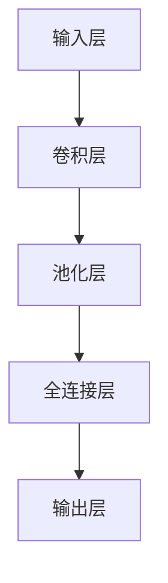

                 

关键词：Python，深度学习，图像分类，实践，算法原理，数学模型，项目实践，实际应用

## 摘要

本文将详细介绍如何使用Python构建一个图像分类器，从而深入了解深度学习在图像处理领域的应用。我们将从背景介绍、核心概念与联系、核心算法原理与具体操作步骤、数学模型和公式、项目实践、实际应用场景、工具和资源推荐、总结与展望等方面进行详细探讨。通过本文的阅读，读者将能够掌握构建图像分类器所需的基础知识和实际操作技能，为深入探索深度学习领域奠定坚实的基础。

## 1. 背景介绍

深度学习作为人工智能领域的重要分支，近年来取得了惊人的发展。随着计算能力的提升和数据量的爆炸性增长，深度学习模型在图像识别、语音识别、自然语言处理等领域取得了显著的突破。在图像分类方面，深度学习模型因其强大的特征提取和分类能力，已成为解决复杂图像识别问题的主要手段。

图像分类是指将图像数据按照其内容进行分类，例如将动物图像分为猫、狗等类别。传统的图像分类方法，如SVM（支持向量机）、KNN（k近邻算法）等，通常依赖于手工设计的特征，其性能受到很大限制。而深度学习模型，如卷积神经网络（CNN）等，能够自动从原始图像中提取具有区分度的特征，从而实现更高效的图像分类。

Python作为一种易于学习和使用的编程语言，已经成为深度学习领域的主要编程语言之一。得益于丰富的深度学习库（如TensorFlow、PyTorch等），Python为深度学习实践提供了强大的支持。本文将利用Python和深度学习框架，构建一个简单的图像分类器，帮助读者掌握图像分类的基本原理和操作步骤。

## 2. 核心概念与联系

### 2.1 深度学习的基本概念

深度学习是一种基于多层神经网络的机器学习方法，其核心思想是通过层层提取图像、语音、文本等数据中的特征，从而实现对复杂模式的识别和分类。深度学习模型主要由以下几部分组成：

- **输入层**：接收原始数据，如图像、音频、文本等。
- **隐藏层**：通过神经网络模型对输入数据进行特征提取和变换。
- **输出层**：对提取到的特征进行分类或回归。

在深度学习模型中，神经元（或称为节点）是基本的计算单元，每个神经元都与输入层、隐藏层和输出层的其他神经元相连。神经元之间的连接称为权重，通过调整权重可以优化模型的性能。激活函数（如ReLU、Sigmoid、Tanh等）用于引入非线性变换，使得神经网络能够处理复杂的问题。

### 2.2 图像分类的基本原理

图像分类是指将图像数据按照其内容进行分类，常见的分类方法包括以下几种：

- **基于特征的分类**：通过手工设计或自动提取图像特征，如边缘、纹理、形状等，然后利用传统机器学习算法（如SVM、KNN等）进行分类。
- **基于模型的分类**：直接利用深度学习模型（如CNN、RNN等）对图像进行分类。其中，CNN是最常用的图像分类模型，通过卷积层、池化层、全连接层等结构，实现对图像的逐层特征提取和分类。

### 2.3 Mermaid流程图

以下是一个简单的Mermaid流程图，展示了图像分类的基本流程：



在卷积层中，通过卷积操作提取图像的特征；在池化层中，对特征进行降维处理；在全连接层中，对提取到的特征进行分类。最后，输出层输出分类结果。

## 3. 核心算法原理 & 具体操作步骤

### 3.1 算法原理概述

图像分类的核心算法是卷积神经网络（CNN）。CNN由卷积层、池化层和全连接层组成，具有以下特点：

- **卷积层**：通过卷积操作提取图像的特征。卷积层中的卷积核（或称为过滤器）在图像上滑动，从而提取出具有局部性的特征。卷积操作可表示为：
  $$ (f_{ij} * g_{kl})_{pqr} = \sum_{x=0}^{M-1} \sum_{y=0}^{N-1} f_{ij + x, kl + y} * g_{pqr + x, y} $$
  其中，$f$ 和 $g$ 分别表示卷积核和图像，$*$ 表示卷积操作，$i, j, k, l, p, q, r$ 分别表示卷积核和图像的位置。

- **池化层**：对卷积层输出的特征进行降维处理。常见的池化操作包括最大池化和平均池化。最大池化选取每个局部区域中的最大值，平均池化则选取每个局部区域中的平均值。

- **全连接层**：将池化层输出的特征映射到输出层。全连接层中的每个神经元都与池化层输出的所有特征相连，从而实现对特征的分类。

### 3.2 算法步骤详解

1. **输入层**：将图像数据输入到CNN中。图像数据通常被调整为固定大小，如$28 \times 28$或$32 \times 32$。

2. **卷积层**：通过卷积操作提取图像的特征。卷积核的大小和数量可以根据具体问题进行调整。例如，可以使用$5 \times 5$的卷积核提取边缘特征，$3 \times 3$的卷积核提取纹理特征。

3. **激活函数**：在卷积层之后添加激活函数（如ReLU函数），引入非线性变换，增强模型的泛化能力。

4. **池化层**：对卷积层输出的特征进行降维处理。最大池化或平均池化可以根据具体问题进行调整。

5. **全连接层**：将池化层输出的特征映射到输出层。输出层的神经元数量等于类别数，每个神经元表示一个类别。

6. **损失函数与优化器**：使用交叉熵损失函数和优化器（如SGD、Adam等）对模型进行训练，优化模型的参数。

7. **评估与测试**：在测试集上评估模型的性能，计算准确率、召回率等指标，以评估模型的泛化能力。

### 3.3 算法优缺点

**优点**：

- **强大的特征提取能力**：CNN能够自动从原始图像中提取具有区分度的特征，从而实现更高效的图像分类。
- **端到端训练**：CNN可以从原始图像直接提取特征并进行分类，无需手动设计特征。
- **良好的泛化能力**：通过多层神经网络的结构，CNN能够处理复杂的图像分类问题。

**缺点**：

- **计算资源消耗大**：CNN需要大量的计算资源进行训练和推理，对硬件要求较高。
- **训练时间较长**：CNN的训练时间较长，尤其在处理大规模数据集时。

### 3.4 算法应用领域

CNN在图像分类领域取得了显著的成果，广泛应用于以下领域：

- **计算机视觉**：如人脸识别、目标检测、图像分割等。
- **医疗影像分析**：如疾病诊断、器官分割等。
- **自动驾驶**：如车道线检测、行人检测等。

## 4. 数学模型和公式 & 详细讲解 & 举例说明

### 4.1 数学模型构建

在CNN中，数学模型主要由以下几部分组成：

- **卷积层**：卷积层的输出可以表示为：
  $$ h_{ij} = f(W \cdot x + b) $$
  其中，$h_{ij}$表示卷积层输出的特征图，$x$表示输入图像，$W$表示卷积核，$b$表示偏置，$f$表示激活函数。

- **池化层**：池化层的输出可以表示为：
  $$ p_{ij} = \text{max}(h_{ij}) $$
  或
  $$ p_{ij} = \text{mean}(h_{ij}) $$
  其中，$p_{ij}$表示池化层输出的特征图。

- **全连接层**：全连接层的输出可以表示为：
  $$ y_i = \sum_j W_{ij} \cdot h_j + b_i $$
  其中，$y_i$表示全连接层输出的特征，$h_j$表示池化层输出的特征，$W_{ij}$和$b_i$分别表示权重和偏置。

- **输出层**：输出层的输出可以表示为：
  $$ \hat{y} = \text{softmax}(y) $$
  其中，$\hat{y}$表示分类结果，$y$表示全连接层的输出。

### 4.2 公式推导过程

以卷积层为例，我们详细推导卷积层的输出公式。设输入图像为$x \in \mathbb{R}^{M \times N}$，卷积核为$W \in \mathbb{R}^{K \times L}$，偏置为$b \in \mathbb{R}$，输出特征图为$h \in \mathbb{R}^{H \times W}$，其中$H = \left\lfloor \frac{M - K + 2p}{s} \right\rfloor$，$W = \left\lfloor \frac{N - L + 2p}{s} \right\rfloor$，$s$为步长，$p$为填充。

首先，对输入图像进行填充，使其尺寸满足卷积核的要求。填充的方式可以有多种，如零填充、边缘填充等。这里以零填充为例，填充后的输入图像为$x'$。

$$ x'_{ij} = \begin{cases} x_{ij}, & \text{if } i > 0, j > 0, i < M+p, j < N+p \\ 0, & \text{otherwise} \end{cases} $$

接下来，进行卷积操作。对于每个输出位置$(i, j)$，计算其对应的特征图值：

$$ h_{ij} = \sum_{x=0}^{K-1} \sum_{y=0}^{L-1} W_{xy} \cdot x'_{i+x, j+y} + b $$

最后，应用激活函数$f$，得到最终的输出特征图：

$$ h_{ij} = f(h_{ij}) $$

### 4.3 案例分析与讲解

假设我们有一个$32 \times 32$的图像，使用一个$5 \times 5$的卷积核进行卷积操作。输入图像的维度为$32 \times 32 \times 3$，卷积核的维度为$5 \times 5 \times 3$。我们选择步长为$1$，填充方式为零填充。

1. **填充**：

   将输入图像填充为$38 \times 38$，填充后的输入图像为$x'$。

2. **卷积操作**：

   对$x'$进行卷积操作，计算每个输出位置$(i, j)$的特征图值。以输出位置$(i, j) = (0, 0)$为例，计算其对应的特征图值：

   $$ h_{00} = \sum_{x=0}^{4} \sum_{y=0}^{4} W_{xy} \cdot x'_{0+x, 0+y} + b $$

   假设卷积核$W$和偏置$b$的值为：

   $$ W = \begin{bmatrix} 1 & 1 & 1 & 1 & 1 \\ 1 & 1 & 1 & 1 & 1 \\ 1 & 1 & 1 & 1 & 1 \\ 1 & 1 & 1 & 1 & 1 \\ 1 & 1 & 1 & 1 & 1 \end{bmatrix}, \quad b = 0 $$

   输入图像$x'$的前$5 \times 5$区域为：

   $$ x'_{00} = \begin{bmatrix} 1 & 0 & 1 & 0 & 1 \\ 0 & 1 & 0 & 1 & 0 \\ 1 & 0 & 1 & 0 & 1 \\ 0 & 1 & 0 & 1 & 0 \\ 1 & 0 & 1 & 0 & 1 \end{bmatrix} $$

   对应的特征图值为：

   $$ h_{00} = \sum_{x=0}^{4} \sum_{y=0}^{4} W_{xy} \cdot x'_{0+x, 0+y} + b = 20 $$

3. **激活函数**：

   使用ReLU函数作为激活函数，得到最终的输出特征图：

   $$ h_{00} = \text{ReLU}(h_{00}) = \text{ReLU}(20) = 20 $$

   同样地，我们可以计算其他输出位置$(i, j)$的特征图值。

通过上述案例，我们了解了卷积层的基本操作步骤和计算过程。在实际应用中，我们可以根据具体问题调整卷积核的大小、步长和填充方式，从而实现对不同特征的提取。

## 5. 项目实践：代码实例和详细解释说明

### 5.1 开发环境搭建

为了构建图像分类器，我们需要安装Python和相关深度学习库。以下是一个简单的开发环境搭建步骤：

1. **安装Python**：下载并安装Python 3.7或更高版本。
2. **安装深度学习库**：通过pip命令安装TensorFlow、NumPy、Matplotlib等库：

   ```bash
   pip install tensorflow numpy matplotlib
   ```

### 5.2 源代码详细实现

以下是一个简单的图像分类器实现，使用TensorFlow和Keras框架：

```python
import tensorflow as tf
from tensorflow.keras import layers, models
import numpy as np

# 加载MNIST数据集
mnist = tf.keras.datasets.mnist
(train_images, train_labels), (test_images, test_labels) = mnist.load_data()

# 预处理数据
train_images = train_images / 255.0
test_images = test_images / 255.0

# 构建CNN模型
model = models.Sequential([
    layers.Conv2D(32, (3, 3), activation='relu', input_shape=(28, 28, 1)),
    layers.MaxPooling2D((2, 2)),
    layers.Conv2D(64, (3, 3), activation='relu'),
    layers.MaxPooling2D((2, 2)),
    layers.Conv2D(64, (3, 3), activation='relu'),
    layers.Flatten(),
    layers.Dense(64, activation='relu'),
    layers.Dense(10, activation='softmax')
])

# 编译模型
model.compile(optimizer='adam',
              loss='sparse_categorical_crossentropy',
              metrics=['accuracy'])

# 训练模型
model.fit(train_images, train_labels, epochs=5)

# 评估模型
test_loss, test_acc = model.evaluate(test_images, test_labels)
print('Test accuracy:', test_acc)

# 输出预测结果
predictions = model.predict(test_images)
predicted_labels = np.argmax(predictions, axis=1)
print('Predicted labels:', predicted_labels)
```

### 5.3 代码解读与分析

1. **数据预处理**：加载MNIST数据集，并将图像数据归一化到[0, 1]范围内。这样有助于提高模型的训练效率。

2. **构建CNN模型**：使用Sequential模型构建CNN模型，包含卷积层、池化层和全连接层。卷积层用于提取图像特征，池化层用于降维处理，全连接层用于分类。

3. **编译模型**：指定优化器、损失函数和评估指标，以便在训练过程中进行优化。

4. **训练模型**：使用训练数据训练模型，指定训练轮数（epochs）。在训练过程中，模型将不断调整参数，以最小化损失函数。

5. **评估模型**：在测试集上评估模型的性能，计算测试准确率。

6. **输出预测结果**：使用训练好的模型对测试集进行预测，输出预测标签。

通过上述代码，我们实现了一个简单的图像分类器，并对其进行了训练和评估。在实际应用中，我们可以根据具体问题调整模型结构和训练参数，以提高分类性能。

## 6. 实际应用场景

图像分类技术在许多领域具有广泛的应用，以下列举几个实际应用场景：

### 6.1 计算机视觉

图像分类技术是计算机视觉领域的重要基础。在图像识别、目标检测、图像分割等任务中，图像分类技术被广泛应用于。例如，在人脸识别中，图像分类技术用于将不同的人脸图像进行分类，从而实现身份验证。

### 6.2 医疗影像分析

医疗影像分析是图像分类技术的重要应用领域。通过对医学图像进行分类，可以帮助医生进行疾病诊断、器官分割等。例如，利用图像分类技术，可以自动识别医学图像中的肿瘤、骨折等病变区域。

### 6.3 自动驾驶

自动驾驶是图像分类技术的另一个重要应用领域。在自动驾驶系统中，图像分类技术用于检测道路标志、车道线、行人等。例如，利用图像分类技术，可以识别道路标志的类型，从而实现自动驾驶系统的智能导航。

### 6.4 物流与安防

图像分类技术在物流和安防领域也有广泛的应用。例如，在物流领域，图像分类技术可以用于识别货物类型、数量等，从而提高物流效率。在安防领域，图像分类技术可以用于监控视频中的异常行为识别，从而提高安全监控的准确性。

## 7. 工具和资源推荐

### 7.1 学习资源推荐

1. **《深度学习》（Goodfellow, Bengio, Courville著）**：这是一本经典的深度学习入门教材，涵盖了深度学习的理论基础和实际应用。
2. **《Python深度学习》（François Chollet著）**：这是一本针对Python深度学习的实践指南，介绍了深度学习在图像、语音和自然语言处理等领域的应用。
3. **《动手学深度学习》（阿斯顿·张、李沐、扎卡里·C. Lipton、亚历山大·J. Smola著）**：这是一本面向实践者的深度学习教材，通过大量实例和代码讲解，帮助读者快速掌握深度学习技术。

### 7.2 开发工具推荐

1. **TensorFlow**：这是一个由Google开发的开源深度学习框架，具有丰富的功能和强大的社区支持。
2. **PyTorch**：这是一个由Facebook开发的深度学习框架，具有灵活的动态计算图和良好的扩展性。
3. **Keras**：这是一个基于TensorFlow和Theano的Python深度学习库，提供了简洁的API和强大的功能。

### 7.3 相关论文推荐

1. **"A Guide to Convolutional Neural Networks for Visual Recognition"（卷积神经网络视觉识别指南）**：这是一篇介绍CNN在视觉识别领域的经典论文，对CNN的结构和原理进行了详细讲解。
2. **"Deep Learning for Image Recognition"（深度学习在图像识别中的应用）**：这是一篇综述论文，介绍了深度学习在图像识别领域的最新进展和挑战。
3. **"Object Detection with Deep Learning"（深度学习在目标检测中的应用）**：这是一篇介绍深度学习在目标检测领域应用的论文，涵盖了目标检测的常见算法和实现方法。

## 8. 总结：未来发展趋势与挑战

随着深度学习技术的不断发展，图像分类技术在各个领域的应用前景十分广阔。未来，图像分类技术将继续朝着以下方向发展：

### 8.1 研究成果总结

- **模型结构优化**：通过改进网络结构、引入新的层结构（如残差网络、Transformer等），进一步提高模型的性能和效率。
- **数据增强**：利用数据增强技术（如随机裁剪、旋转、翻转等）扩大数据集规模，提高模型的泛化能力。
- **迁移学习**：利用预训练模型进行迁移学习，将预训练模型的知识迁移到新的任务中，从而提高模型的性能。

### 8.2 未来发展趋势

- **自动化机器学习（AutoML）**：通过自动化搜索和优化模型结构和超参数，实现高效的图像分类模型。
- **多模态学习**：将图像分类与其他模态（如语音、文本等）进行结合，提高模型的表示能力和鲁棒性。
- **边缘计算**：在边缘设备上部署图像分类模型，实现实时图像分类和推理。

### 8.3 面临的挑战

- **数据隐私和安全**：在处理大规模图像数据时，如何保护用户隐私和数据安全是一个重要挑战。
- **计算资源消耗**：深度学习模型通常需要大量的计算资源和存储空间，如何优化模型结构和算法，降低计算资源消耗是一个关键问题。
- **泛化能力**：如何提高模型在未知数据上的泛化能力，避免过拟合是一个重要挑战。

### 8.4 研究展望

随着深度学习技术的不断进步，图像分类技术将在更多领域发挥重要作用。未来，我们将继续关注以下研究方向：

- **模型压缩与优化**：研究如何降低模型大小和计算复杂度，提高模型的部署效率和性能。
- **可解释性**：研究如何提高模型的可解释性，帮助用户理解模型的决策过程。
- **多任务学习**：研究如何将图像分类与其他任务（如自然语言处理、强化学习等）进行结合，实现更广泛的应用。

## 9. 附录：常见问题与解答

### 9.1 为什么选择CNN进行图像分类？

CNN具有强大的特征提取能力，能够自动从原始图像中提取具有区分度的特征，从而实现更高效的图像分类。与传统机器学习方法相比，CNN在处理复杂图像分类任务时具有更好的性能。

### 9.2 如何处理不平衡数据集？

在处理不平衡数据集时，可以采用以下方法：

- **过采样**：通过复制少数类别的样本，增加少数类别的样本数量，使数据集更加平衡。
- **欠采样**：通过随机删除多数类别的样本，减少多数类别的样本数量，使数据集更加平衡。
- **合成少数类样本**：使用生成对抗网络（GAN）等方法，合成少数类别的样本，以增加少数类别的样本数量。

### 9.3 如何优化模型参数？

可以通过以下方法优化模型参数：

- **调整学习率**：选择合适的学习率，以避免过拟合和欠拟合。
- **使用正则化**：引入正则化项（如L1、L2正则化），降低模型的复杂度，提高模型的泛化能力。
- **使用dropout**：在神经网络中加入dropout层，降低模型的过拟合风险。
- **使用批量归一化**：在神经网络中加入批量归一化层，加速模型的收敛速度。

### 9.4 如何评估模型性能？

可以使用以下指标评估模型性能：

- **准确率（Accuracy）**：模型预测正确的样本数量与总样本数量的比值。
- **召回率（Recall）**：模型预测正确的正样本数量与实际正样本数量的比值。
- **精确率（Precision）**：模型预测正确的正样本数量与预测为正样本的总数量的比值。
- **F1值（F1-score）**：精确率和召回率的调和平均。

### 9.5 如何处理高维特征？

对于高维特征，可以采用以下方法进行降维：

- **主成分分析（PCA）**：通过保留主要成分，降低特征维度。
- **线性判别分析（LDA）**：通过最大化类间散度，降低特征维度。
- **自动编码器（Autoencoder）**：通过自编码器学习编码和解码过程，降低特征维度。

通过以上方法，可以有效地处理高维特征，提高模型的训练效率和性能。

作者：禅与计算机程序设计艺术 / Zen and the Art of Computer Programming
-------------------------------------------------------------------

本文以Python深度学习实践为主题，从背景介绍、核心概念与联系、核心算法原理与具体操作步骤、数学模型和公式、项目实践、实际应用场景、工具和资源推荐、总结与展望等方面，系统地讲解了如何构建图像分类器。通过本文的学习，读者可以掌握深度学习在图像分类领域的应用，为深入探索深度学习领域奠定坚实的基础。在未来的研究中，我们将继续关注图像分类技术的优化和发展，以应对实际应用中的各种挑战。

