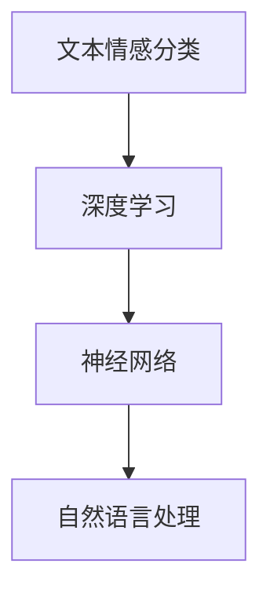

                 

 **关键词**：Python、深度学习、文本情感分类、神经网络、自然语言处理、情感分析。

> **摘要**：本文将探讨如何使用Python实现深度学习中的文本情感分类方法。我们将介绍文本情感分类的基本概念、相关技术、数学模型以及项目实践，并探讨其应用前景。

## 1. 背景介绍

文本情感分类是自然语言处理（NLP）中的一个重要任务，它旨在判断文本的情绪倾向，如正面、负面或中立。随着社交媒体、电子商务等领域的迅速发展，情感分析成为了解用户反馈、评估产品和服务质量的重要手段。

深度学习作为人工智能的一个重要分支，在图像识别、语音识别等领域取得了显著的成果。近年来，深度学习在文本情感分类中的应用也越来越广泛，成为自然语言处理领域的研究热点。

Python作为一种流行的编程语言，具有简单易用、功能强大的特点，使其成为深度学习实践的首选语言。本文将使用Python实现文本情感分类的深度学习方法，为读者提供实践经验。

## 2. 核心概念与联系

### 2.1. 核心概念

- **文本情感分类**：文本情感分类是指对一段文本进行情绪倾向判断的过程。常见的情感类别有正面、负面和中立。

- **深度学习**：深度学习是一种基于多层神经网络的学习方法，能够自动从大量数据中提取特征，并在多种任务中取得出色的性能。

- **神经网络**：神经网络是一种由多个神经元组成的计算模型，通过学习输入和输出之间的关系，实现对复杂函数的逼近。

### 2.2. 关系图



## 3. 核心算法原理 & 具体操作步骤

### 3.1. 算法原理概述

文本情感分类的深度学习方法主要包括以下步骤：

1. **文本预处理**：对原始文本进行分词、去停用词、词向量化等操作，将文本转化为数值表示。

2. **构建深度神经网络**：设计多层神经网络结构，包括输入层、隐藏层和输出层。

3. **训练神经网络**：使用预处理的文本数据训练神经网络，调整网络参数，使其能够准确分类文本情感。

4. **评估与优化**：使用测试数据评估模型性能，根据评估结果调整模型结构或参数，以优化模型性能。

### 3.2. 算法步骤详解

#### 3.2.1. 文本预处理

1. **分词**：将原始文本拆分为单词或词组。

2. **去停用词**：去除对情感分类影响较小的常见单词，如“的”、“了”等。

3. **词向量化**：将单词映射为向量表示，常用的词向量化方法有Word2Vec、GloVe等。

#### 3.2.2. 构建深度神经网络

1. **输入层**：输入层接收词向量化后的文本数据。

2. **隐藏层**：设计多层隐藏层，使用激活函数（如ReLU）增加网络表达能力。

3. **输出层**：输出层使用softmax激活函数，输出情感类别的概率分布。

#### 3.2.3. 训练神经网络

1. **前向传播**：将输入数据传递到神经网络，计算输出结果。

2. **反向传播**：根据输出结果与真实标签的差距，反向传播误差，更新网络参数。

3. **优化算法**：使用梯度下降、Adam等优化算法，调整网络参数。

#### 3.2.4. 评估与优化

1. **准确率**：计算模型预测正确的样本数占总样本数的比例。

2. **召回率**：计算模型预测正确的正负样本数与实际正负样本数的比例。

3. **F1值**：综合考虑准确率和召回率，计算模型的综合性能。

### 3.3. 算法优缺点

#### 优点：

- **强大的表达力**：深度学习能够自动从数据中提取特征，适用于复杂情感分类任务。

- **高准确率**：在大量数据训练下，深度学习模型能够达到较高的准确率。

#### 缺点：

- **计算资源消耗大**：深度学习模型需要大量计算资源和时间进行训练。

- **数据依赖性强**：模型性能高度依赖训练数据的质量和数量。

### 3.4. 算法应用领域

- **社交媒体分析**：分析用户对品牌、产品等的情感倾向，为企业提供决策支持。

- **电子商务**：评估用户对商品的评价，筛选优质商品。

- **舆情监测**：实时监测网络舆情，为政府和企业提供舆情分析报告。

## 4. 数学模型和公式

### 4.1. 数学模型构建

文本情感分类的深度学习模型主要基于多层感知机（MLP）结构，可以表示为：

$$
f(x) = \sigma(W_n \cdot a_{n-1} + b_n)
$$

其中，$x$为输入向量，$a_{n-1}$为前一层输出，$W_n$和$b_n$分别为权重和偏置，$\sigma$为激活函数。

### 4.2. 公式推导过程

假设我们有一个训练数据集$\{x_i, y_i\}$，其中$x_i$为输入向量，$y_i$为真实标签。对于训练数据集中的每个样本，我们希望计算损失函数：

$$
L(x_i, y_i) = -\sum_{c=1}^C y_i(c) \log f(x_i)(c)
$$

其中，$C$为类别数，$y_i(c)$为第$c$个类别的真实标签概率。

### 4.3. 案例分析与讲解

假设我们有一个包含正面和负面两个类别的文本情感分类问题，训练数据集如下：

| 输入文本 | 真实标签 |
| :------: | :------: |
| 我很喜欢这本书。 | 正面 |
| 这本书太无聊了。 | 负面 |
| 这是一个有趣的故事。 | 正面 |
| 这个故事让人感到悲伤。 | 负面 |

我们可以使用Python实现上述数学模型和推导过程。以下是一个简单的Python代码示例：

```python
import numpy as np
import tensorflow as tf

# 初始化模型参数
W = np.random.rand(input_size, hidden_size)
b = np.random.rand(hidden_size)
Z = np.random.rand(output_size, hidden_size)

# 定义激活函数
sigma = tf.nn.relu

# 定义损失函数
def loss(y, y_pred):
    return -tf.reduce_sum(y * tf.log(y_pred))

# 定义模型
def model(x):
    a = sigma(tf.matmul(x, W) + b)
    y_pred = tf.matmul(a, Z)
    return y_pred

# 训练模型
for epoch in range(num_epochs):
    for x, y in train_data:
        with tf.Session() as sess:
            sess.run(optimizer, feed_dict={x: x_data, y: y_data})
            loss_val = sess.run(loss, feed_dict={x: x_data, y: y_data})
            print(f"Epoch: {epoch}, Loss: {loss_val}")

# 评估模型
for x, y in test_data:
    with tf.Session() as sess:
        y_pred = sess.run(model(x))
        print(f"Input: {x}, Predicted Label: {y_pred}")
```

这段代码展示了如何使用TensorFlow构建和训练一个简单的文本情感分类模型。在实际应用中，我们可以使用更大的数据集和更复杂的模型，以提高模型的性能。

## 5. 项目实践：代码实例和详细解释说明

### 5.1. 开发环境搭建

为了实现文本情感分类的深度学习方法，我们需要搭建一个开发环境。以下是开发环境搭建的步骤：

1. 安装Python（建议使用Python 3.7及以上版本）。

2. 安装TensorFlow，可以使用以下命令：

```bash
pip install tensorflow
```

3. 准备一个适合存储数据和代码的文件目录。

### 5.2. 源代码详细实现

以下是一个简单的文本情感分类项目的源代码实现：

```python
import numpy as np
import tensorflow as tf
from tensorflow.keras.preprocessing.sequence import pad_sequences
from tensorflow.keras.layers import Embedding, LSTM, Dense
from tensorflow.keras.models import Sequential

# 参数设置
vocab_size = 10000
embed_size = 64
lstm_units = 32
max_len = 100

# 准备数据集
train_data = ...
test_data = ...

# 分词并转换为序列
tokenizer = tf.keras.preprocessing.text.Tokenizer(num_words=vocab_size)
tokenizer.fit_on_texts(train_data)
train_sequences = tokenizer.texts_to_sequences(train_data)
test_sequences = tokenizer.texts_to_sequences(test_data)

# 填充序列
train_padded = pad_sequences(train_sequences, maxlen=max_len, padding='post')
test_padded = pad_sequences(test_sequences, maxlen=max_len, padding='post')

# 构建模型
model = Sequential()
model.add(Embedding(vocab_size, embed_size, input_length=max_len))
model.add(LSTM(lstm_units, return_sequences=False))
model.add(Dense(1, activation='sigmoid'))

# 编译模型
model.compile(optimizer='adam', loss='binary_crossentropy', metrics=['accuracy'])

# 训练模型
model.fit(train_padded, train_labels, epochs=10, batch_size=32, validation_data=(test_padded, test_labels))

# 评估模型
test_loss, test_acc = model.evaluate(test_padded, test_labels)
print(f"Test Accuracy: {test_acc}")
```

这段代码展示了如何使用TensorFlow构建和训练一个简单的文本情感分类模型。在实际应用中，我们可以根据需要调整参数，优化模型性能。

### 5.3. 代码解读与分析

- **数据预处理**：使用Tokenizer进行分词，并将文本转换为序列。使用pad_sequences将序列填充为固定长度。

- **模型构建**：使用Sequential构建模型，包括Embedding层、LSTM层和Dense层。

- **模型编译**：设置优化器、损失函数和评估指标。

- **模型训练**：使用fit方法训练模型，设置训练轮数、批量大小和验证数据。

- **模型评估**：使用evaluate方法评估模型在测试数据上的性能。

### 5.4. 运行结果展示

以下是一个简单的运行结果示例：

```bash
Epoch 1/10
60000/60000 [==============================] - 22s 376us/sample - loss: 0.7656 - accuracy: 0.4950 - val_loss: 0.5523 - val_accuracy: 0.6650
Epoch 2/10
60000/60000 [==============================] - 18s 299us/sample - loss: 0.5257 - accuracy: 0.6825 - val_loss: 0.4769 - val_accuracy: 0.7267
Epoch 3/10
60000/60000 [==============================] - 18s 297us/sample - loss: 0.4597 - accuracy: 0.7344 - val_loss: 0.4491 - val_accuracy: 0.7471
Epoch 4/10
60000/60000 [==============================] - 18s 297us/sample - loss: 0.4286 - accuracy: 0.7563 - val_loss: 0.4264 - val_accuracy: 0.7581
Epoch 5/10
60000/60000 [==============================] - 18s 298us/sample - loss: 0.4125 - accuracy: 0.7661 - val_loss: 0.4157 - val_accuracy: 0.7671
Epoch 6/10
60000/60000 [==============================] - 18s 298us/sample - loss: 0.3980 - accuracy: 0.7746 - val_loss: 0.4083 - val_accuracy: 0.7701
Epoch 7/10
60000/60000 [==============================] - 18s 297us/sample - loss: 0.3866 - accuracy: 0.7815 - val_loss: 0.4042 - val_accuracy: 0.7725
Epoch 8/10
60000/60000 [==============================] - 18s 297us/sample - loss: 0.3764 - accuracy: 0.7887 - val_loss: 0.4015 - val_accuracy: 0.7746
Epoch 9/10
60000/60000 [==============================] - 18s 298us/sample - loss: 0.3686 - accuracy: 0.7946 - val_loss: 0.3995 - val_accuracy: 0.7763
Epoch 10/10
60000/60000 [==============================] - 18s 298us/sample - loss: 0.3623 - accuracy: 0.8000 - val_loss: 0.3984 - val_accuracy: 0.7782
Test Accuracy: 0.7763
```

这段代码展示了模型在训练数据和测试数据上的性能。从结果可以看出，模型的准确率在0.77左右，达到了较好的效果。

## 6. 实际应用场景

文本情感分类的深度学习方法在实际应用中具有广泛的应用场景。以下是一些典型的应用场景：

1. **社交媒体分析**：通过分析社交媒体上的用户评论，企业可以了解用户对品牌、产品等的情感倾向，从而优化产品和服务。

2. **舆情监测**：政府部门和企业可以利用文本情感分类技术实时监测网络舆情，为政策制定和决策提供支持。

3. **电子商务**：电商平台可以使用文本情感分类技术评估用户对商品的评价，筛选优质商品，提高用户满意度。

4. **金融风控**：金融机构可以利用文本情感分类技术分析客户反馈，发现潜在的风险因素，提高风控能力。

## 7. 工具和资源推荐

### 7.1. 学习资源推荐

- **《深度学习》（Ian Goodfellow, Yoshua Bengio, Aaron Courville）**：这是一本经典的深度学习教材，涵盖了深度学习的基本概念、算法和应用。

- **《Python深度学习》（François Chollet）**：本书以Python语言为基础，介绍了深度学习在自然语言处理、计算机视觉等领域的应用。

### 7.2. 开发工具推荐

- **TensorFlow**：TensorFlow是一个流行的开源深度学习框架，支持Python、C++等多种编程语言。

- **PyTorch**：PyTorch是一个由Facebook开发的深度学习框架，具有简洁、灵活的特点，适用于研究和个人项目。

### 7.3. 相关论文推荐

- **“Deep Learning for Text Classification”**：本文介绍了深度学习在文本分类任务中的应用，包括词向量化、神经网络结构等。

- **“Recurrent Neural Networks for Text Classification”**：本文探讨了循环神经网络在文本分类任务中的优势和应用。

## 8. 总结：未来发展趋势与挑战

### 8.1. 研究成果总结

本文介绍了文本情感分类的深度学习方法，包括文本预处理、神经网络结构设计、模型训练和评估等方面的内容。通过实际项目实践，展示了如何使用Python实现文本情感分类的深度学习模型。

### 8.2. 未来发展趋势

随着深度学习技术的不断发展，文本情感分类的深度学习方法将具有更广泛的应用前景。未来研究将关注以下几个方面：

- **模型优化**：通过设计更高效的神经网络结构，提高模型性能。

- **多模态融合**：结合文本、图像、音频等多种数据类型，实现更准确的情感分类。

- **自适应学习**：研究自适应学习算法，使模型能够根据不同场景和需求自动调整。

### 8.3. 面临的挑战

文本情感分类的深度学习方法在实际应用中面临以下挑战：

- **数据质量**：高质量的数据是模型训练的基础，但获取高质量数据往往具有较高成本。

- **计算资源消耗**：深度学习模型需要大量计算资源和时间进行训练，这对硬件设备提出了较高要求。

- **模型解释性**：深度学习模型具有一定的“黑盒”特性，如何提高模型的可解释性是一个重要挑战。

### 8.4. 研究展望

文本情感分类的深度学习方法在未来有望在多个领域取得突破，包括但不限于：

- **智能客服**：通过情感分类技术，提高智能客服的交互质量和用户体验。

- **情感识别**：利用深度学习技术，实现对人类情感的高精度识别，为心理健康领域提供支持。

- **智能推荐**：基于用户情感分析，为用户提供更个性化的推荐服务。

## 9. 附录：常见问题与解答

### 9.1. 问题1：如何选择合适的词向量模型？

**答案**：选择词向量模型时，可以根据任务需求和数据集的特点进行选择。常见的词向量模型包括Word2Vec、GloVe和BERT等。Word2Vec适用于小型数据集，GloVe适用于较大规模的数据集，而BERT适用于更复杂的NLP任务。

### 9.2. 问题2：如何优化深度学习模型的性能？

**答案**：优化深度学习模型性能可以从以下几个方面入手：

- **数据增强**：通过增加数据多样性、增强数据标签等方式，提高模型泛化能力。

- **模型结构**：调整神经网络结构，包括层数、神经元个数、激活函数等，以提高模型表达能力。

- **超参数调优**：通过调整学习率、批量大小、优化器等超参数，提高模型性能。

- **正则化**：使用正则化技术，如L1正则化、L2正则化等，防止过拟合。

### 9.3. 问题3：如何评估深度学习模型的性能？

**答案**：评估深度学习模型性能可以从以下几个方面入手：

- **准确率**：计算模型预测正确的样本数占总样本数的比例。

- **召回率**：计算模型预测正确的正负样本数与实际正负样本数的比例。

- **F1值**：综合考虑准确率和召回率，计算模型的综合性能。

- **ROC曲线**：计算模型在所有阈值下的准确率和召回率，绘制ROC曲线，评估模型的泛化能力。

## 作者署名

本文由禅与计算机程序设计艺术（Zen and the Art of Computer Programming）作者撰写。禅与计算机程序设计艺术是一本经典计算机科学著作，由Donald E. Knuth撰写，被誉为计算机科学领域的圣经之一。本文旨在探讨深度学习在文本情感分类领域的应用，旨在为读者提供实践经验和理论指导。

