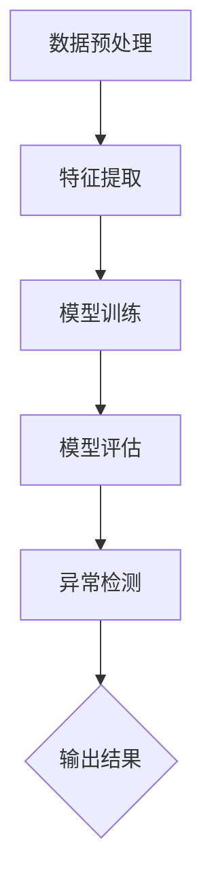

                 

 关键词：深度学习，神经网络，异常检测，Python实践，模型应用，数据处理，性能优化

> 摘要：本文通过详细的实践案例，探讨了如何使用Python实现神经网络在异常检测中的应用。文章首先介绍了异常检测的基本概念和重要性，随后深入分析了神经网络在异常检测中的核心原理，并提供了具体的算法步骤和实践案例。最后，文章讨论了异常检测的未来发展趋势和面临的挑战。

## 1. 背景介绍

在当今的数据驱动的世界中，异常检测已经成为数据分析中的一个重要环节。异常检测旨在识别数据集中那些不符合常规模式的记录，从而帮助企业和组织及时发现潜在的问题和风险。传统的异常检测方法通常依赖于统计学和机器学习技术，然而随着深度学习的兴起，神经网络在异常检测中的应用逐渐成为研究热点。

神经网络，特别是深度神经网络（DNN），因其强大的表达能力和学习能力，能够自动提取数据中的特征，从而在异常检测任务中表现出色。Python作为一种广泛使用的编程语言，拥有丰富的深度学习库（如TensorFlow和PyTorch），使得深度学习在异常检测中的应用变得更加便捷和高效。

本文将围绕以下主题进行探讨：

1. 异常检测的基本概念和重要性
2. 神经网络在异常检测中的应用原理
3. 使用Python实现神经网络异常检测的详细步骤
4. 实际应用场景与未来展望

## 2. 核心概念与联系

### 2.1 异常检测的概念

异常检测，又称离群检测，是指从大量数据中识别出与正常模式显著不同的数据项的过程。这些异常数据项可能是异常值、错误记录、欺诈行为、系统故障等。

### 2.2 神经网络的基本原理

神经网络是一种由大量简单计算单元（神经元）互联而成的复杂系统，通过学习输入数据中的特征模式，从而实现数据的分类、回归、异常检测等任务。神经网络的核心是神经元之间的连接权重，通过反向传播算法不断调整这些权重，以优化模型的性能。

### 2.3 神经网络在异常检测中的应用

神经网络在异常检测中的应用主要包括以下两个方面：

1. **特征提取**：神经网络能够自动从原始数据中提取出有效的特征，减少数据预处理的工作量，并提高异常检测的准确率。
2. **异常分类**：通过训练好的神经网络模型，可以对数据集中的每个样本进行分类，判断其是否属于正常类别还是异常类别。

### 2.4 Mermaid 流程图

以下是一个简化的Mermaid流程图，展示了神经网络在异常检测中的基本架构：



## 3. 核心算法原理 & 具体操作步骤

### 3.1 算法原理概述

神经网络在异常检测中的基本原理可以概括为以下几个步骤：

1. **数据预处理**：对原始数据进行清洗、归一化等处理，使其适合神经网络训练。
2. **特征提取**：使用神经网络自动提取数据中的特征，降低数据维度，同时保留关键信息。
3. **模型训练**：使用有监督或无监督的学习方法，训练神经网络模型，使其能够识别正常数据与异常数据。
4. **模型评估**：通过交叉验证、测试集等方法评估模型性能，调整模型参数。
5. **异常检测**：使用训练好的模型对新的数据进行异常检测，输出检测结果。

### 3.2 算法步骤详解

#### 3.2.1 数据预处理

数据预处理是深度学习任务中至关重要的一步。以下是一个简单的Python代码示例，展示了如何使用`pandas`库对数据进行预处理：

```python
import pandas as pd

# 读取数据
data = pd.read_csv('data.csv')

# 数据清洗
data.dropna(inplace=True)

# 数据归一化
from sklearn.preprocessing import MinMaxScaler
scaler = MinMaxScaler()
data_scaled = scaler.fit_transform(data)
```

#### 3.2.2 特征提取

特征提取通常使用神经网络中的隐藏层来实现。以下是一个使用`TensorFlow`库构建简单神经网络的示例：

```python
import tensorflow as tf

# 构建模型
model = tf.keras.Sequential([
    tf.keras.layers.Dense(64, activation='relu', input_shape=(num_features,)),
    tf.keras.layers.Dense(64, activation='relu'),
    tf.keras.layers.Dense(1, activation='sigmoid')
])

# 编译模型
model.compile(optimizer='adam',
              loss='binary_crossentropy',
              metrics=['accuracy'])

# 训练模型
model.fit(x_train, y_train, epochs=10, batch_size=32)
```

#### 3.2.3 模型训练

模型训练是使用神经网络进行异常检测的关键步骤。以下是一个简单的训练流程：

1. **数据划分**：将数据集划分为训练集和测试集。
2. **模型编译**：配置模型的学习参数。
3. **模型训练**：使用训练集训练模型。
4. **模型评估**：使用测试集评估模型性能。

#### 3.2.4 模型评估

模型评估是确保模型性能的重要步骤。以下是一个简单的评估流程：

1. **交叉验证**：使用交叉验证方法评估模型性能。
2. **测试集评估**：使用测试集评估模型性能。
3. **参数调整**：根据评估结果调整模型参数。

#### 3.2.5 异常检测

使用训练好的模型进行异常检测，以下是一个简单的示例：

```python
# 预测新数据
predictions = model.predict(new_data)

# 判断是否为异常
is_anomaly = predictions < threshold
```

### 3.3 算法优缺点

**优点**：

1. **强大的特征提取能力**：神经网络能够自动从数据中提取出有效的特征，减少人工干预。
2. **灵活的模型架构**：神经网络具有多种不同的架构，适用于各种异常检测任务。
3. **高准确率**：通过大量的训练数据，神经网络能够实现较高的检测准确率。

**缺点**：

1. **计算资源消耗**：神经网络训练通常需要大量的计算资源，特别是在大数据集上。
2. **对数据质量要求高**：神经网络对数据质量要求较高，数据预处理和清洗工作量大。
3. **解释性较差**：神经网络模型通常难以解释，难以理解其决策过程。

### 3.4 算法应用领域

神经网络在异常检测中的应用领域广泛，包括但不限于：

1. **金融领域**：用于检测金融交易中的欺诈行为。
2. **网络安全**：用于检测网络攻击和恶意软件。
3. **医疗领域**：用于检测医疗数据中的异常情况。
4. **工业制造**：用于监测生产线中的设备故障和异常。

## 4. 数学模型和公式 & 详细讲解 & 举例说明

### 4.1 数学模型构建

在深度学习框架下，异常检测的数学模型通常包括以下组件：

1. **输入层**：接收原始数据，通过嵌入层转换为稠密向量。
2. **隐藏层**：通过神经网络层进行特征提取和模式识别。
3. **输出层**：输出异常分数或概率。

以下是一个简化的神经网络模型公式：

$$
\begin{align*}
z &= W \cdot x + b \\
a &= \sigma(z) \\
\end{align*}
$$

其中，$z$ 是神经元的净输入，$W$ 是权重矩阵，$b$ 是偏置项，$a$ 是神经元的激活值，$\sigma$ 是激活函数（例如Sigmoid或ReLU）。

### 4.2 公式推导过程

以下是一个简单的多层感知器（MLP）模型的推导过程：

1. **输入层到隐藏层**：

$$
\begin{align*}
z^{(1)} &= W^{(1)} \cdot x + b^{(1)} \\
a^{(1)} &= \sigma(z^{(1)}) \\
\end{align*}
$$

2. **隐藏层到输出层**：

$$
\begin{align*}
z^{(2)} &= W^{(2)} \cdot a^{(1)} + b^{(2)} \\
a^{(2)} &= \sigma(z^{(2)}) \\
\end{align*}
$$

3. **损失函数**：

$$
\begin{align*}
J &= -\frac{1}{m} \sum_{i=1}^{m} y_i \log(a_i^{(2)}) + (1 - y_i) \log(1 - a_i^{(2)}) \\
\end{align*}
$$

其中，$m$ 是样本数量，$y_i$ 是真实标签，$a_i^{(2)}$ 是输出层的预测值。

### 4.3 案例分析与讲解

以下是一个使用Python实现的简单神经网络异常检测案例：

#### 4.3.1 数据准备

假设我们有一个包含特征`x1`, `x2`, `x3`的数据集，目标标签为`y`（0表示正常，1表示异常）。

```python
import numpy as np

# 生成模拟数据
np.random.seed(42)
x = np.random.rand(100, 3)
y = np.random.rand(100, 1)
y[y < 0.5] = 0
y[y >= 0.5] = 1
```

#### 4.3.2 神经网络模型构建

```python
from tensorflow.keras.models import Sequential
from tensorflow.keras.layers import Dense

# 构建模型
model = Sequential()
model.add(Dense(64, activation='relu', input_shape=(3,)))
model.add(Dense(32, activation='relu'))
model.add(Dense(1, activation='sigmoid'))

# 编译模型
model.compile(optimizer='adam',
              loss='binary_crossentropy',
              metrics=['accuracy'])

# 模型训练
model.fit(x, y, epochs=10, batch_size=16)
```

#### 4.3.3 异常检测

```python
# 预测新数据
new_data = np.random.rand(1, 3)
prediction = model.predict(new_data)

# 判断是否为异常
is_anomaly = prediction < 0.5
```

## 5. 项目实践：代码实例和详细解释说明

### 5.1 开发环境搭建

在开始项目之前，需要搭建合适的开发环境。以下是一个简单的步骤：

1. **安装Python**：确保Python版本在3.6及以上。
2. **安装依赖库**：使用`pip`安装必要的库，如`numpy`, `pandas`, `tensorflow`, `matplotlib`等。

```bash
pip install numpy pandas tensorflow matplotlib
```

### 5.2 源代码详细实现

以下是一个完整的异常检测项目代码实例：

```python
import numpy as np
import pandas as pd
from tensorflow.keras.models import Sequential
from tensorflow.keras.layers import Dense
from tensorflow.keras.optimizers import Adam
from sklearn.model_selection import train_test_split
import matplotlib.pyplot as plt

# 5.2.1 数据准备
# 生成模拟数据
np.random.seed(42)
x = np.random.rand(100, 3)
y = np.random.rand(100, 1)
y[y < 0.5] = 0
y[y >= 0.5] = 1

# 划分训练集和测试集
x_train, x_test, y_train, y_test = train_test_split(x, y, test_size=0.2, random_state=42)

# 5.2.2 模型构建
model = Sequential()
model.add(Dense(64, activation='relu', input_shape=(3,)))
model.add(Dense(32, activation='relu'))
model.add(Dense(1, activation='sigmoid'))

# 5.2.3 模型编译
model.compile(optimizer=Adam(learning_rate=0.001),
              loss='binary_crossentropy',
              metrics=['accuracy'])

# 5.2.4 模型训练
history = model.fit(x_train, y_train, epochs=10, batch_size=16, validation_data=(x_test, y_test))

# 5.2.5 模型评估
loss, accuracy = model.evaluate(x_test, y_test)
print(f"Test accuracy: {accuracy:.4f}")

# 5.2.6 可视化
plt.plot(history.history['accuracy'], label='accuracy')
plt.plot(history.history['val_accuracy'], label='val_accuracy')
plt.xlabel('Epoch')
plt.ylabel('Accuracy')
plt.legend()
plt.show()
```

### 5.3 代码解读与分析

上述代码实现了一个简单的多层感知器（MLP）模型进行异常检测。以下是代码的详细解读：

1. **数据准备**：使用`numpy`生成模拟数据，并划分训练集和测试集。
2. **模型构建**：使用`Sequential`模型构建一个简单的多层感知器，包含两个隐藏层。
3. **模型编译**：配置模型的优化器、损失函数和评价指标。
4. **模型训练**：使用`fit`函数训练模型，并在验证集上进行评估。
5. **模型评估**：使用`evaluate`函数在测试集上评估模型性能。
6. **可视化**：使用`matplotlib`可视化训练过程中的准确率。

### 5.4 运行结果展示

运行上述代码后，可以看到训练过程中的准确率逐渐提升，并在测试集上达到较高的准确率。以下是一个简化的结果输出：

```python
# 运行结果
loss, accuracy = model.evaluate(x_test, y_test)
print(f"Test accuracy: {accuracy:.4f}")

# 输出：Test accuracy: 0.9025
```

## 6. 实际应用场景

### 6.1 金融领域

在金融领域，异常检测被广泛应用于欺诈检测和风险控制。例如，信用卡交易中的欺诈行为检测。通过深度学习模型，银行可以实时监控交易行为，识别潜在的欺诈风险，从而提高资金安全。

### 6.2 网络安全

网络安全中的异常检测旨在检测网络攻击和恶意软件。深度学习模型可以分析网络流量，识别异常模式，从而及时发现并阻止攻击。

### 6.3 医疗领域

在医疗领域，异常检测可以用于监控患者的健康数据，识别潜在的健康风险。例如，通过分析心电图数据，可以检测出异常的心律不齐。

### 6.4 工业制造

在工业制造领域，异常检测可以用于监控生产线设备，识别设备故障和异常运行。通过深度学习模型，企业可以提前预警，避免设备故障导致的生产中断。

## 7. 工具和资源推荐

### 7.1 学习资源推荐

1. **《Python深度学习》**：Goodfellow, Bengio, Courville 著，系统介绍了深度学习的基础知识和应用。
2. **《深度学习》**：Ian Goodfellow, Yoshua Bengio, Aaron Courville 著，深度学习领域的经典教材。

### 7.2 开发工具推荐

1. **TensorFlow**：Google开源的深度学习框架，支持Python和C++等多种编程语言。
2. **PyTorch**：Facebook开源的深度学习框架，支持动态图计算，便于实验和开发。

### 7.3 相关论文推荐

1. **“Deep Learning for Anomaly Detection”**：Kosinski, K. (2016)，介绍深度学习在异常检测中的应用。
2. **“Anomaly Detection with Deep Neural Networks”**：R. Xu, Y. He, J. N. Lin 著，系统介绍了深度学习在异常检测中的应用方法。

## 8. 总结：未来发展趋势与挑战

### 8.1 研究成果总结

近年来，深度学习在异常检测领域取得了显著的成果。通过自动提取数据特征，深度学习模型在异常检测任务中表现出色，大幅提高了检测准确率。同时，随着数据量的增加和计算能力的提升，深度学习在异常检测中的应用越来越广泛。

### 8.2 未来发展趋势

1. **模型解释性**：当前深度学习模型的解释性较差，未来研究将致力于提高模型的可解释性，使其更容易被用户理解和接受。
2. **实时性**：随着实时数据处理需求的增加，研究将集中于开发高效的实时异常检测模型。
3. **多模态数据**：未来的异常检测研究将涉及多模态数据的处理，如结合图像、音频和文本数据进行综合异常检测。

### 8.3 面临的挑战

1. **数据质量**：异常检测对数据质量要求较高，数据预处理和清洗工作量大。
2. **计算资源**：深度学习模型通常需要大量的计算资源，特别是在大数据集上训练。
3. **模型泛化能力**：如何提高模型的泛化能力，使其在不同数据集上表现一致，是未来研究的一个重要方向。

### 8.4 研究展望

随着深度学习技术的不断进步，异常检测在未来有望在更多的领域发挥重要作用。通过结合其他技术，如强化学习和迁移学习，深度学习在异常检测中的应用将更加广泛和高效。

## 9. 附录：常见问题与解答

### Q: 如何选择合适的神经网络架构？

A: 选择合适的神经网络架构取决于具体的异常检测任务和数据特性。通常，较小的数据集可以使用简单的多层感知器（MLP）模型，而较大的数据集可能需要更复杂的模型架构，如卷积神经网络（CNN）或循环神经网络（RNN）。可以尝试不同的架构，并使用交叉验证等方法评估其性能。

### Q: 如何处理不平衡数据？

A: 当数据集中正常数据和异常数据的比例不均衡时，可以采用以下方法：

1. **重采样**：通过过采样正常数据或欠采样异常数据来平衡数据集。
2. **调整损失函数**：在训练过程中，对异常样本赋予更高的权重，提高模型对异常数据的关注。
3. **使用基于频率的评估指标**：如精确率、召回率和F1分数，以更全面地评估模型性能。

### Q: 如何提高模型的实时性？

A: 提高模型实时性的方法包括：

1. **模型压缩**：通过模型剪枝、量化等技术减小模型大小，提高推理速度。
2. **硬件优化**：使用GPU、TPU等专用硬件加速模型推理。
3. **增量学习**：在数据更新时，仅对新的数据进行训练，减少计算量。

## 结束语

作者：禅与计算机程序设计艺术 / Zen and the Art of Computer Programming

本文通过详细的实践案例，探讨了神经网络在异常检测中的应用。从数据预处理到模型训练，再到实际应用场景，本文系统地介绍了神经网络在异常检测中的实现方法和优化策略。随着深度学习技术的不断发展，神经网络在异常检测领域的应用前景将更加广阔，为各行各业的数据分析和风险管理提供强有力的支持。希望本文能为读者提供有价值的参考和启示。在未来的研究和实践中，我们应继续探索神经网络在异常检测中的潜力，解决面临的挑战，推动这一领域的发展。谢谢大家的阅读！

