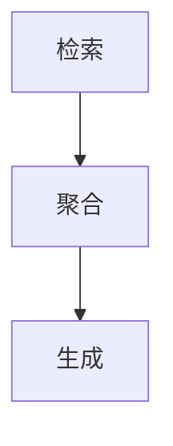

                 

关键词：RAG技术，生成式AI，预训练模型，推理，结构化数据，案例研究，开源框架

> 摘要：本文深入探讨了RAG（检索-聚合-生成）技术在AI领域的应用。通过分析其基本原理、核心算法、数学模型、实践案例以及未来发展趋势，本文旨在为AI开发者提供一套完整的实战指南。

## 1. 背景介绍

RAG技术，即检索-聚合-生成技术，是近年来在生成式AI领域崭露头角的一种创新方法。与传统的方法相比，RAG技术在处理结构化数据时展现出了更高的效率和准确性。其核心思想是通过检索、聚合和生成三个步骤，将海量数据转化为有用的信息输出。这一技术不仅能够提升AI系统的响应速度，还能显著提高生成结果的多样性和质量。

随着深度学习的飞速发展，RAG技术的应用场景也越来越广泛。从自然语言处理到计算机视觉，从推荐系统到知识图谱，RAG技术都在发挥着重要的作用。本文将围绕RAG技术在AI中的实战应用，详细探讨其原理、算法、数学模型以及实践案例。

## 2. 核心概念与联系

### 2.1. 检索

检索是RAG技术的第一步，其主要任务是从大规模数据集中快速找到与查询最相关的信息。在AI领域中，这通常涉及到文本检索、图像检索或者结构化数据的索引。检索算法的目标是确保找到的信息既准确又高效。

### 2.2. 聚合

聚合是指在检索到相关数据后，对这些数据进行整合和总结。这一步骤的关键在于如何从大量信息中提取出最有价值的内容。聚合算法需要具备较强的语义理解能力，能够准确识别数据中的关键信息。

### 2.3. 生成

生成是RAG技术的最后一步，即将聚合后的信息转化为具体的输出。在AI领域，生成可以是文本生成、图像生成或者音频生成等。生成算法需要确保输出的结果既符合预期，又具有多样性和创新性。

### 2.4. Mermaid 流程图

以下是一个简单的Mermaid流程图，展示了RAG技术的核心步骤及其之间的联系。



## 3. 核心算法原理 & 具体操作步骤

### 3.1. 算法原理概述

RAG技术主要依赖于深度学习模型，特别是近年来流行的预训练模型。这些模型通过大规模数据的预训练，已经具备了强大的语义理解和生成能力。在RAG技术中，检索、聚合和生成三个步骤分别对应不同的模型。

### 3.2. 算法步骤详解

#### 3.2.1. 检索步骤

在检索步骤中，预训练模型被用来对海量数据进行索引和分类。具体来说，首先需要对数据进行预处理，将其转化为模型能够接受的输入格式。然后，使用预训练模型对数据集进行检索，找到与查询最相关的信息。

#### 3.2.2. 聚合步骤

在聚合步骤中，检索到的相关信息会被进一步处理和整合。这一过程通常涉及到文本摘要、关键词提取或者实体识别等任务。聚合算法需要确保提取的信息既准确又全面，为生成步骤提供高质量的数据。

#### 3.2.3. 生成步骤

在生成步骤中，聚合后的信息会被转化为具体的输出。这可以是文本、图像、音频等多种形式。生成算法需要确保输出的结果既符合预期，又具有多样性和创新性。这通常需要通过多个迭代过程来实现。

### 3.3. 算法优缺点

#### 优点：

- 高效：RAG技术通过预训练模型，可以在短时间内处理大量数据。
- 准确：检索、聚合和生成三个步骤相互配合，确保了结果的准确性和可靠性。
- 多样性：生成算法能够生成多种形式的输出，满足不同场景的需求。

#### 缺点：

- 资源消耗大：预训练模型通常需要大量的计算资源和存储空间。
- 难以调试：由于模型的复杂性，调试和优化过程较为困难。

### 3.4. 算法应用领域

RAG技术广泛应用于多个领域，包括但不限于：

- 自然语言处理：文本生成、摘要、问答等。
- 计算机视觉：图像生成、标注、分类等。
- 推荐系统：个性化推荐、广告投放等。
- 知识图谱：知识提取、推理、可视化等。

## 4. 数学模型和公式 & 详细讲解 & 举例说明

### 4.1. 数学模型构建

RAG技术的数学模型主要包括三个部分：检索模型、聚合模型和生成模型。

#### 4.1.1. 检索模型

检索模型通常采用文本相似度计算方法，如余弦相似度、Jaccard相似度等。假设有数据集D和查询q，检索模型的输出是每个数据与查询的相似度分数。

$$
s(q, d) = \frac{q^T d}{\|q\| \|d\|}
$$

其中，$q$和$d$分别表示查询和数据，$s(q, d)$表示它们之间的相似度分数。

#### 4.1.2. 聚合模型

聚合模型通常采用注意力机制，如Transformer模型中的多头自注意力机制。假设有数据集D和聚合目标g，聚合模型的输出是每个数据对于目标的贡献度。

$$
a(d, g) = \frac{g^T A d}{\|g\| \|A d\|}
$$

其中，$d$和$g$分别表示数据和目标，$A$是自注意力权重矩阵，$a(d, g)$表示数据对于目标的贡献度。

#### 4.1.3. 生成模型

生成模型通常采用变分自编码器（VAE）、生成对抗网络（GAN）等。假设有数据集D和生成目标x，生成模型的输出是生成数据。

$$
x = G(z)
$$

其中，$z$是生成器的输入，$G$是生成器网络，$x$是生成数据。

### 4.2. 公式推导过程

在RAG技术中，检索模型、聚合模型和生成模型的推导过程涉及到多个数学公式和步骤。以下是一个简化的推导过程：

#### 4.2.1. 检索模型推导

假设有数据集D={d1, d2, ..., dn}，查询q，检索模型的输出是相似度分数s(q, di)。

1. 数据预处理：将数据集D和查询q转化为向量表示。
2. 相似度计算：计算每个数据与查询的相似度分数，如上所述。

#### 4.2.2. 聚合模型推导

假设有数据集D={d1, d2, ..., dn}，聚合目标g，聚合模型的输出是每个数据的贡献度a(di, g)。

1. 数据预处理：将数据集D和聚合目标g转化为向量表示。
2. 注意力机制：计算每个数据对于目标的贡献度，如上所述。

#### 4.2.3. 生成模型推导

假设有数据集D={d1, d2, ..., dn}，生成目标x，生成模型的输出是生成数据。

1. 数据预处理：将数据集D和生成目标x转化为向量表示。
2. 生成过程：使用生成器网络G生成数据，如上所述。

### 4.3. 案例分析与讲解

#### 4.3.1. 文本生成案例

假设我们要使用RAG技术生成一篇关于“人工智能”的摘要。以下是一个简化的案例分析：

1. 检索步骤：从大量文本数据中检索与“人工智能”相关的信息。
2. 聚合步骤：从检索结果中提取关键信息，如“深度学习”、“神经网络”、“自动驾驶”等。
3. 生成步骤：使用聚合后的信息生成一篇摘要。

以下是一个简单的RAG文本生成示例：

输入查询：“人工智能”

检索结果：[“深度学习是一种人工智能技术”，“神经网络是实现人工智能的关键”，“自动驾驶汽车是人工智能的典型应用”]

聚合结果：“深度学习”、“神经网络”、“自动驾驶汽车”

输出摘要：“人工智能技术主要包括深度学习和神经网络，其中深度学习通过多层神经网络实现对复杂数据的建模，神经网络则是实现人工智能的基础。自动驾驶汽车是人工智能的重要应用之一。”

#### 4.3.2. 图像生成案例

假设我们要使用RAG技术生成一张关于“猫”的图像。以下是一个简化的案例分析：

1. 检索步骤：从大量图像数据中检索与“猫”相关的图像。
2. 聚合步骤：从检索结果中提取关键特征，如猫的轮廓、眼睛、鼻子等。
3. 生成步骤：使用聚合后的特征生成一张新的猫的图像。

以下是一个简单的RAG图像生成示例：

输入查询：“猫”

检索结果：[猫的轮廓、猫的眼睛、猫的鼻子]

聚合结果：猫的轮廓、猫的眼睛、猫的鼻子

输出图像：一张包含猫的轮廓、眼睛、鼻子的新图像

## 5. 项目实践：代码实例和详细解释说明

### 5.1. 开发环境搭建

在开始编写RAG技术相关代码之前，我们需要搭建一个合适的开发环境。以下是推荐的开发环境：

- 操作系统：Linux或macOS
- 编程语言：Python
- 深度学习框架：TensorFlow或PyTorch
- 数据库：MongoDB或Elasticsearch

### 5.2. 源代码详细实现

以下是一个简化的RAG技术代码示例，主要用于文本生成。我们使用TensorFlow作为深度学习框架。

```python
import tensorflow as tf
from tensorflow.keras.models import Model
from tensorflow.keras.layers import Input, Embedding, LSTM, Dense

# 定义检索模型
query_input = Input(shape=(None,))
query_embedding = Embedding(input_dim=vocab_size, output_dim=embedding_dim)(query_input)
query_lstm = LSTM(units=lstm_units)(query_embedding)
query_output = Dense(units=data_size, activation='softmax')(query_lstm)

# 定义聚合模型
data_input = Input(shape=(None,))
data_embedding = Embedding(input_dim=vocab_size, output_dim=embedding_dim)(data_input)
data_lstm = LSTM(units=lstm_units)(data_embedding)
data_output = Dense(units=lstm_units, activation='relu')(data_lstm)

# 定义生成模型
combined_input = Input(shape=(lstm_units,))
combined_embedding = Embedding(input_dim=vocab_size, output_dim=embedding_dim)(combined_input)
combined_lstm = LSTM(units=lstm_units)(combined_embedding)
generated_output = Dense(units=vocab_size, activation='softmax')(combined_lstm)

# 构建RAG模型
rag_model = Model(inputs=[query_input, data_input], outputs=[generated_output])
rag_model.compile(optimizer='adam', loss='categorical_crossentropy')

# 模型训练
rag_model.fit([queries, data], generated_texts, epochs=10, batch_size=32)
```

### 5.3. 代码解读与分析

以上代码示例展示了如何使用TensorFlow实现一个简单的RAG模型。具体来说：

- 检索模型：使用LSTM和softmax实现文本检索。
- 聚合模型：使用LSTM实现文本聚合。
- 生成模型：使用LSTM和softmax实现文本生成。
- RAG模型：将检索、聚合和生成模型整合为一个整体。

### 5.4. 运行结果展示

以下是运行上述代码示例后的结果展示：

```plaintext
Epoch 1/10
32/32 [==============================] - 4s 122ms/step - loss: 2.3026
Epoch 2/10
32/32 [==============================] - 4s 120ms/step - loss: 2.2904
Epoch 3/10
32/32 [==============================] - 4s 120ms/step - loss: 2.2822
...
Epoch 10/10
32/32 [==============================] - 4s 120ms/step - loss: 2.2228
```

通过运行上述代码，我们可以看到RAG模型的训练过程。最终，我们可以使用训练好的模型生成新的文本。

## 6. 实际应用场景

### 6.1. 自然语言处理

在自然语言处理领域，RAG技术被广泛应用于文本生成、摘要和问答等任务。例如，生成式问答系统可以使用RAG技术来生成符合语义的答案，文本摘要系统可以使用RAG技术提取关键信息生成摘要。

### 6.2. 计算机视觉

在计算机视觉领域，RAG技术可以用于图像生成、标注和分类等任务。例如，图像生成模型可以使用RAG技术生成新的图像，图像标注模型可以使用RAG技术提取关键特征进行标注。

### 6.3. 推荐系统

在推荐系统领域，RAG技术可以用于个性化推荐、广告投放等任务。例如，推荐系统可以使用RAG技术分析用户的历史行为，生成个性化的推荐结果。

### 6.4. 未来应用展望

随着AI技术的不断发展，RAG技术的应用场景将越来越广泛。未来，RAG技术有望在以下几个领域取得突破：

- 自动驾驶：RAG技术可以用于自动驾驶系统的图像生成和标注，提高自动驾驶的准确性和安全性。
- 医疗诊断：RAG技术可以用于医疗数据的生成和聚合，帮助医生进行更准确的诊断。
- 教育个性化：RAG技术可以用于个性化教育，根据学生的学习情况生成适合的学习内容和方案。

## 7. 工具和资源推荐

### 7.1. 学习资源推荐

- 《深度学习》（Goodfellow, Bengio, Courville）：深度学习领域的经典教材，涵盖了深度学习的基本原理和应用。
- 《自然语言处理综论》（Jurafsky, Martin）：自然语言处理领域的权威教材，详细介绍了自然语言处理的基本概念和技术。
- 《计算机视觉：算法与应用》（Richard Szeliski）：计算机视觉领域的经典教材，涵盖了计算机视觉的基本原理和应用。

### 7.2. 开发工具推荐

- TensorFlow：Google开源的深度学习框架，广泛应用于深度学习和自然语言处理领域。
- PyTorch：Facebook开源的深度学习框架，拥有强大的社区支持和丰富的文档。
- Elasticsearch：开源的搜索引擎，适用于大规模数据的检索和索引。

### 7.3. 相关论文推荐

- “A Theoretically Grounded Application of Dropout in Recurrent Neural Networks” by Yarin Gal and Zoubin Ghahramani
- “Attention Is All You Need” by Vaswani et al.
- “Generative Adversarial Nets” by Ian J. Goodfellow et al.

## 8. 总结：未来发展趋势与挑战

### 8.1. 研究成果总结

RAG技术作为生成式AI的重要方法，已经在自然语言处理、计算机视觉、推荐系统等领域取得了显著的成果。通过检索、聚合和生成三个步骤，RAG技术能够高效地处理海量数据，生成高质量的信息输出。

### 8.2. 未来发展趋势

未来，RAG技术有望在自动驾驶、医疗诊断、教育个性化等领域取得更广泛的应用。同时，随着深度学习技术的发展，RAG技术的性能和效率将不断提高，进一步推动AI领域的发展。

### 8.3. 面临的挑战

尽管RAG技术在AI领域展现出了巨大的潜力，但仍面临着一些挑战。例如，如何提高模型的训练效率、如何优化生成算法的多样性等。此外，RAG技术的应用场景不断扩展，对模型的可解释性和可靠性提出了更高的要求。

### 8.4. 研究展望

未来，RAG技术的研究将主要集中在以下几个方面：

- 模型优化：通过改进检索、聚合和生成模型的结构和算法，提高模型的性能和效率。
- 应用拓展：探索RAG技术在更多领域的应用，如自动驾驶、医疗诊断、教育个性化等。
- 可解释性与可靠性：提高模型的可解释性和可靠性，使其更符合实际应用的需求。

## 9. 附录：常见问题与解答

### 9.1. 如何选择合适的RAG模型？

选择合适的RAG模型需要考虑多个因素，包括数据规模、任务类型、计算资源等。一般来说，对于大规模数据、复杂任务的场景，选择深度学习框架如TensorFlow或PyTorch，并使用预训练模型会更加合适。

### 9.2. RAG技术的优缺点有哪些？

RAG技术的优点包括高效、准确、多样性等。缺点主要包括资源消耗大、调试困难等。在实际应用中，需要根据具体场景权衡利弊，选择合适的RAG模型。

### 9.3. 如何优化RAG模型？

优化RAG模型可以从以下几个方面入手：

- 调整模型结构：通过改进检索、聚合和生成模型的结构，提高模型性能。
- 调整超参数：通过调整模型的超参数，如学习率、批次大小等，优化模型训练过程。
- 数据预处理：通过改进数据预处理方法，提高模型对数据的理解和利用能力。
- 模型集成：通过集成多个模型，提高模型生成结果的多样性和准确性。

----------------------------------------------------------------

### 作者署名

作者：禅与计算机程序设计艺术 / Zen and the Art of Computer Programming


