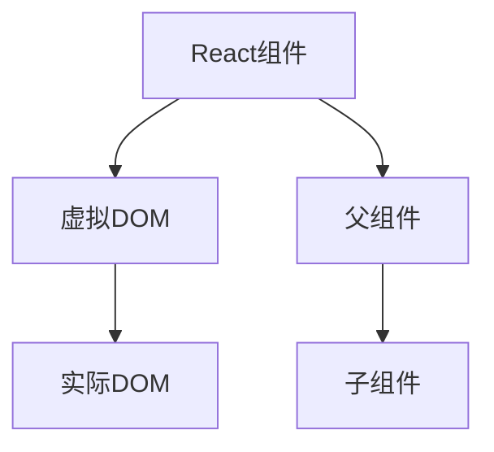
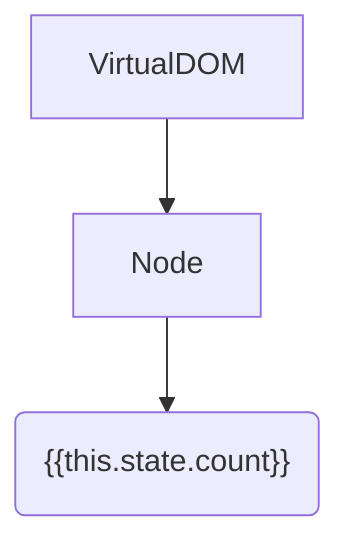
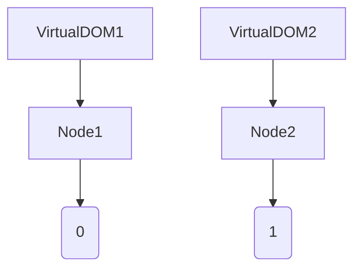

                 

本文旨在探讨React及其相关前端框架在现代Web开发中的重要作用。通过分析其核心概念、算法原理、数学模型以及实际应用，本文将为读者提供全面的技术见解，助力他们在构建动态用户界面上取得成功。

## 文章关键词

React、前端框架、动态用户界面、组件化、虚拟DOM、单向数据流、JavaScript、Web开发

## 文章摘要

本文将深入探讨React及其前端框架在构建动态用户界面方面的核心概念、算法原理、数学模型和实际应用。我们将通过分析React的组件化架构、虚拟DOM、单向数据流等技术，以及其背后的数学原理，帮助读者理解如何利用React及其相关框架构建高性能、可维护的Web应用。此外，本文还将讨论React在实际开发中的应用场景、工具和资源推荐，以及未来发展趋势和面临的挑战。

## 1. 背景介绍

### 1.1 前端框架的崛起

随着互联网的飞速发展，Web应用的用户体验越来越受到重视。为了提高开发效率和代码可维护性，前端框架逐渐崛起。前端框架提供了一套统一的编程模型和抽象语法，使开发者能够更轻松地实现复杂的用户界面和功能。

### 1.2 React的诞生

React是由Facebook于2013年推出的一款开源JavaScript库，旨在帮助开发者构建高效、可维护的Web应用。React的核心思想是组件化、虚拟DOM和单向数据流。这些特性使得React在性能和开发体验上具有显著优势。

## 2. 核心概念与联系

### 2.1 组件化

React采用组件化的设计理念，将UI划分为可复用的组件。组件是React应用的基本构建块，每个组件负责渲染一部分UI，并维护自身的状态。组件化使得代码更加模块化、易于维护，同时也提高了开发效率。

### 2.2 虚拟DOM

虚拟DOM是React的核心特性之一。它通过在内存中构建一个虚拟的DOM树，实现了对实际DOM的操作。当组件的状态或属性发生变化时，React会对比虚拟DOM和实际DOM的差异，并执行必要的更新操作。这种操作方式大大提高了更新效率，降低了浏览器渲染的负担。

### 2.3 单向数据流

React采用单向数据流的设计模式，即数据从父组件流向子组件，而子组件不能直接修改父组件的状态。这种数据流模式使得数据传递更加清晰，降低了组件之间的耦合度，提高了代码的可维护性。

### 2.4 Mermaid流程图

下面是React核心概念的Mermaid流程图，展示了组件化、虚拟DOM和单向数据流之间的联系：



## 3. 核心算法原理 & 具体操作步骤

### 3.1 算法原理概述

React的核心算法包括虚拟DOM、 reconciliation算法、组件生命周期等。下面简要介绍这些算法的原理。

#### 虚拟DOM

虚拟DOM是一种在内存中构建的DOM树，与实际DOM树保持同步。当组件的状态或属性发生变化时，React会通过diff算法对比虚拟DOM和实际DOM的差异，并执行必要的更新操作。这种操作方式大大提高了更新效率。

#### Reconciliation算法

Reconciliation算法是React的更新策略。当组件的状态或属性发生变化时，React会首先执行reconciliation过程，对比虚拟DOM和实际DOM的差异，并生成一个新的虚拟DOM树。然后，React会通过diff算法对新的虚拟DOM树进行优化，并最终更新实际DOM树。

#### 组件生命周期

React组件的生命周期包括创建、挂载、更新和卸载等阶段。在各个生命周期阶段，组件可以执行不同的操作，如初始化状态、处理事件、更新UI等。

### 3.2 算法步骤详解

下面详细解释React的核心算法步骤：

#### 1. 虚拟DOM构建

- 当组件的状态或属性发生变化时，React首先会构建一个新的虚拟DOM树。
- 虚拟DOM树包含新的组件实例和虚拟DOM节点。

#### 2. Diff算法执行

- React使用diff算法对比虚拟DOM树和实际DOM树之间的差异。
- diff算法通过比较虚拟DOM树和实际DOM树的结构、属性和子节点，找出需要更新的部分。

#### 3. 更新实际DOM

- 根据diff算法的结果，React会更新实际DOM树，实现UI的更新。
- React会尽可能减少实际DOM的操作，提高更新效率。

#### 4. 组件生命周期处理

- 在UI更新过程中，React会调用组件的生命周期函数，如`componentDidMount`、`componentDidUpdate`和`componentWillUnmount`等。
- 组件生命周期函数可以用于执行额外的操作，如数据请求、事件绑定和解绑等。

### 3.3 算法优缺点

#### 优点

- **高效更新**：React的虚拟DOM和diff算法提高了UI更新的效率，减少了浏览器渲染的负担。
- **单向数据流**：React的单向数据流降低了组件之间的耦合度，提高了代码的可维护性。
- **组件化**：React的组件化设计使得代码更加模块化，易于维护和复用。

#### 缺点

- **学习曲线**：React的语法和API相对复杂，初学者可能需要一定时间来熟悉。
- **性能瓶颈**：虽然React在大多数情况下都能提供高效的UI更新，但在处理大量组件或复杂交互时，仍可能存在性能瓶颈。

### 3.4 算法应用领域

React的算法原理适用于多种Web应用场景，如：

- **单页应用**：React的单向数据流和组件化设计非常适合构建单页应用，如社交媒体、电商平台等。
- **多页应用**：React可以与路由库（如React Router）结合使用，实现多页应用的功能。
- **桌面应用**：React Native可以将React的组件化思想扩展到原生桌面应用开发。

## 4. 数学模型和公式 & 详细讲解 & 举例说明

### 4.1 数学模型构建

React的核心算法涉及到一系列数学模型，包括：

- **虚拟DOM树**：虚拟DOM树可以用树形结构表示，每个节点包含属性、子节点和值。
- **diff算法**：diff算法用于比较两个树形结构，找出差异。
- **组件生命周期**：组件生命周期可以用状态机模型表示。

### 4.2 公式推导过程

#### 虚拟DOM树构建

假设组件的状态为`state`，属性为`props`，虚拟DOM树可以用以下公式表示：

```latex
V_{DOM} = V_{root} + \{ V_{child1}, V_{child2}, ..., V_{childN} \}
```

其中，`V_{root}`表示根节点，`V_{child1}, V_{child2}, ..., V_{childN}`表示子节点。

#### Diff算法

diff算法可以用以下公式表示：

```latex
diff(V_{DOM1}, V_{DOM2}) = \{ diff(V_{node1}, V_{node2}) \}
```

其中，`V_{node1}, V_{node2}`表示两个需要比较的节点。

#### 组件生命周期

组件生命周期可以用状态机模型表示：

```latex
component\_lifecycle = { 
    "create": create\_component,
    "mount": mount\_component,
    "update": update\_component,
    "unmount": unmount\_component 
}
```

### 4.3 案例分析与讲解

#### 虚拟DOM树构建

假设有一个简单的React组件，其状态和属性如下：

```jsx
const MyComponent = {
  state: {
    count: 0
  },
  props: {
    title: "计数器"
  }
};
```

虚拟DOM树可以表示为：



#### Diff算法

假设更新前后的状态如下：

```jsx
const state1 = { count: 0 };
const state2 = { count: 1 };
```

虚拟DOM树更新前后的对比如下：



通过比较，我们可以发现`C1`和`C2`的值不同，因此需要更新实际DOM树。

#### 组件生命周期

在组件生命周期中，React会在不同的阶段调用相应的生命周期函数。以下是一个简单的组件生命周期示例：

```jsx
class MyComponent extends React.Component {
  constructor(props) {
    super(props);
    this.state = {
      count: 0
    };
  }

  componentDidMount() {
    console.log("组件已挂载");
  }

  componentDidUpdate() {
    console.log("组件已更新");
  }

  componentWillUnmount() {
    console.log("组件将卸载");
  }

  render() {
    return (
      <div>
        <h1>{this.props.title}</h1>
        <p>{this.state.count}</p>
      </div>
    );
  }
}
```

在组件挂载、更新和卸载时，React会依次调用`componentDidMount`、`componentDidUpdate`和`componentWillUnmount`函数。

## 5. 项目实践：代码实例和详细解释说明

### 5.1 开发环境搭建

在开始项目实践之前，我们需要搭建一个React开发环境。以下是搭建过程：

1. 安装Node.js（版本要求：12.0.0以上）。
2. 安装create-react-app工具：

```bash
npm install -g create-react-app
```

3. 创建一个新项目：

```bash
create-react-app my-app
```

4. 进入项目目录：

```bash
cd my-app
```

5. 启动开发服务器：

```bash
npm start
```

### 5.2 源代码详细实现

以下是项目的主要源代码：

```jsx
import React, { useState } from "react";

const MyComponent = () => {
  const [count, setCount] = useState(0);

  const handleClick = () => {
    setCount(count + 1);
  };

  return (
    <div>
      <h1>计数器</h1>
      <p>{count}</p>
      <button onClick={handleClick}>点击增加</button>
    </div>
  );
};

export default MyComponent;
```

### 5.3 代码解读与分析

1. **组件结构**：`MyComponent`是一个功能简单的React组件，包含一个计数器和点击按钮。

2. **状态管理**：使用`useState`钩子管理组件的`count`状态，初始值为0。

3. **事件处理**：点击按钮时，调用`handleClick`函数，将`count`状态值加1。

4. **渲染UI**：根据`count`状态的值渲染计数器和按钮。

5. **虚拟DOM更新**：当点击按钮时，React会更新虚拟DOM树，对比更新前后的差异，并更新实际DOM树，实现计数器的更新。

### 5.4 运行结果展示

在浏览器中打开开发服务器地址（默认为`http://localhost:3000`），将看到以下界面：


点击按钮，计数器将增加1，界面随之更新。

## 6. 实际应用场景

### 6.1 单页应用

React是单页应用（SPA）的理想选择。通过React，开发者可以轻松实现路由、数据绑定等功能，构建一个完整、流畅的用户界面。例如，React Router是一个流行的React路由库，可以用于实现单页应用中的路由功能。

### 6.2 多页应用

React可以与Vue、Angular等前端框架结合，实现多页应用的功能。例如，React可以用于处理用户界面，而Vue或Angular可以用于处理后台数据和页面跳转等。

### 6.3 桌面应用

React Native是一个基于React的桌面应用开发框架，可以用于构建跨平台的桌面应用。React Native使用JavaScript和React语法，可以方便地将Web应用移植到桌面平台。

## 7. 工具和资源推荐

### 7.1 学习资源推荐

- 《React入门教程》：一本非常适合初学者的React入门书籍，内容全面、通俗易懂。
- 《React Router教程》：详细讲解React Router的使用方法和技巧，适用于单页应用开发。
- React官方文档：React的官方文档，涵盖了React的核心概念、API和使用场景。

### 7.2 开发工具推荐

- Webstorm：一款强大的React开发IDE，支持代码高亮、智能提示、调试等功能。
- React Devtools：一款用于调试React应用的浏览器插件，可以查看组件树、状态等。

### 7.3 相关论文推荐

- 《React: A JavaScript Library for Building User Interfaces》：React的官方论文，详细介绍了React的设计理念和核心算法。
- 《Unidirectional Data Flow in React》：介绍React单向数据流的论文，分析了单向数据流的优势和实现方法。

## 8. 总结：未来发展趋势与挑战

### 8.1 研究成果总结

React及其前端框架在Web开发中取得了巨大的成功，为开发者提供了高效的开发工具和丰富的生态系统。React的核心算法、组件化思想和单向数据流等特性，使得React在性能和开发体验上具有显著优势。

### 8.2 未来发展趋势

- **React 18的发布**：React 18带来了更多的性能优化和改进，如并发模式、自动批量更新等，为开发者提供了更好的开发体验。
- **React Native的不断发展**：React Native在桌面应用开发领域取得了显著成果，未来将继续扩展其在移动应用开发中的应用。
- **React Hooks的普及**：React Hooks使得函数组件也能拥有状态和生命周期等特性，简化了组件编写，提高了代码可维护性。

### 8.3 面临的挑战

- **学习成本**：React的语法和API相对复杂，初学者可能需要一定时间来熟悉。
- **性能优化**：在处理大量组件或复杂交互时，React的性能优化仍是一个挑战，开发者需要深入了解React的算法原理和性能优化技巧。

### 8.4 研究展望

未来，React及其前端框架将继续在Web开发和桌面应用开发中发挥重要作用。随着技术的不断进步，React将在性能、开发体验和生态系统等方面取得更多突破，为开发者带来更多的便利。

## 9. 附录：常见问题与解答

### 9.1 什么是React？

React是一个用于构建用户界面的JavaScript库，由Facebook推出。React采用组件化设计、虚拟DOM和单向数据流等技术，提供了高效的UI更新和良好的开发体验。

### 9.2 React的主要优势是什么？

React的主要优势包括：

- **高效更新**：React的虚拟DOM和diff算法提高了UI更新的效率。
- **组件化**：React的组件化设计使得代码更加模块化、易于维护。
- **单向数据流**：React的单向数据流降低了组件之间的耦合度，提高了代码的可维护性。

### 9.3 React适合哪些应用场景？

React适合以下应用场景：

- **单页应用**：React的单向数据流和组件化设计非常适合构建单页应用。
- **多页应用**：React可以与Vue、Angular等前端框架结合，实现多页应用的功能。
- **桌面应用**：React Native可以用于构建跨平台的桌面应用。

## 作者署名

作者：禅与计算机程序设计艺术 / Zen and the Art of Computer Programming
----------------------------------------------------------------
### 总结
本文系统地介绍了React及其前端框架在构建动态用户界面方面的核心概念、算法原理、数学模型和实际应用。通过详细讲解React的组件化、虚拟DOM和单向数据流等技术，以及其在不同应用场景中的优势，本文为读者提供了全面的技术见解。在未来的发展中，React将继续在Web开发和桌面应用开发中发挥重要作用，为开发者带来更多的便利。然而，学习成本和性能优化仍将是React面临的主要挑战。希望本文能帮助读者更好地理解React，为他们在前端开发领域取得成功奠定基础。

