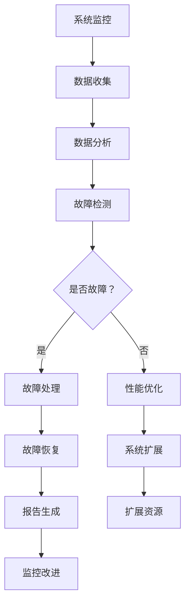

                 

关键词：SRE，高可用性，可扩展性，系统稳定性，自动化运维，故障处理，性能优化，基础设施管理。

> 摘要：本文将深入探讨SRE（Site Reliability Engineering）的原则和方法，解释如何通过这些原则来确保系统的高可用性和可扩展性。我们将分析SRE的核心概念，阐述其与传统IT运维的区别，并探讨实现SRE的关键步骤和最佳实践。此外，文章还将提供数学模型和项目实践，以帮助读者更好地理解SRE的实际应用。

## 1. 背景介绍

在数字化时代，系统的稳定运行是确保企业竞争力的关键因素之一。然而，随着系统规模的不断扩大和复杂性的增加，传统的IT运维方法已无法满足现代应用程序的需求。为了解决这一问题，Google推出了一种新的运维方法——SRE（Site Reliability Engineering），其核心理念是通过工程方法来保障系统的可靠性。

SRE起源于Google，它是一种将软件工程和运维相结合的方法论。SRE团队负责设计和维护生产环境中的系统，而不是执行日常的维护任务。这种方法的目的是通过自动化和工程化手段来提高系统的可用性、性能和可扩展性，从而减少人为错误和运营成本。

### 1.1 SRE与传统IT运维的区别

SRE与传统IT运维的主要区别在于其关注点和方法：

- **关注点**：SRE关注系统的整体可靠性，而不仅仅是硬件和软件的维护。它强调预防性维护和自动化，以确保系统能够自动响应和恢复故障。

- **方法**：SRE采用工程方法，使用自动化工具和代码来管理系统。这种方法减少了人为干预，提高了效率和准确性。

### 1.2 SRE的重要性

SRE的重要性体现在以下几个方面：

- **高可用性**：通过自动化和监控，SRE可以确保系统在出现故障时能够快速恢复。

- **可扩展性**：SRE方法支持系统按需扩展，以应对日益增长的用户需求。

- **成本效益**：自动化减少了运营成本，同时提高了效率。

## 2. 核心概念与联系

### 2.1 高可用性和可扩展性的定义

高可用性（High Availability，简称HA）是指系统在长时间内持续运行的能力。一个高可用的系统应该能够在出现故障时快速恢复，从而最大限度地减少停机时间。

可扩展性（Scalability）是指系统能够在需求增加时无缝扩展的能力。一个可扩展的系统应该能够增加资源（如计算能力、存储空间等）来满足不断增长的需求。

### 2.2 SRE与高可用性和可扩展性的关系

SRE方法通过以下几个方面来确保系统的高可用性和可扩展性：

- **自动化**：自动化是SRE的核心原则之一。通过自动化，SRE可以减少人为错误，提高系统的可靠性和可扩展性。

- **监控**：SRE团队会使用各种监控工具来持续监控系统的性能和状态，以便及时发现和解决潜在问题。

- **故障处理**：SRE方法强调快速故障响应和恢复。通过预定义的流程和自动化脚本，SRE可以在出现故障时快速采取行动。

- **性能优化**：SRE团队会定期评估系统的性能，并采取优化措施来确保系统在高负载情况下仍能正常运行。

### 2.3 Mermaid 流程图

以下是一个Mermaid流程图，展示了SRE确保高可用性和可扩展性的核心步骤：



## 3. 核心算法原理 & 具体操作步骤

### 3.1 算法原理概述

SRE的核心算法原理可以概括为以下几个方面：

- **自动化**：通过编写脚本和自动化工具来自动化日常运维任务。
- **监控**：使用监控工具实时监控系统的性能和状态。
- **故障检测**：使用各种算法和指标来检测系统的故障。
- **故障处理**：制定预定义的故障处理流程，以快速响应和恢复故障。

### 3.2 算法步骤详解

1. **系统监控**：
   - 使用监控工具（如Prometheus、Grafana等）收集系统性能数据。
   - 设置告警规则，以在系统性能下降或出现异常时及时通知运维团队。

2. **数据收集**：
   - 收集系统日志、性能指标、错误报告等数据。
   - 将数据存储在集中式日志管理工具（如ELK栈、Splunk等）中。

3. **数据分析**：
   - 分析收集到的数据，以识别潜在问题和趋势。
   - 使用统计方法和机器学习算法来预测系统故障。

4. **故障检测**：
   - 使用阈值和异常检测算法来检测系统故障。
   - 对故障进行分类和优先级排序，以便及时处理。

5. **故障处理**：
   - 根据预定义的故障处理流程，采取行动来解决问题。
   - 自动化故障处理流程，以减少人为干预。

6. **故障恢复**：
   - 在故障解决后，自动恢复系统到正常状态。
   - 记录故障和解决方案，以便未来的参考。

7. **性能优化**：
   - 分析系统性能数据，识别性能瓶颈。
   - 采取优化措施（如调整配置、升级硬件等）来提高系统性能。

8. **系统扩展**：
   - 根据需求增加系统资源（如计算能力、存储空间等）。
   - 使用自动化工具来管理扩展过程，以确保无缝过渡。

### 3.3 算法优缺点

**优点**：

- **高可用性**：通过自动化和监控，SRE可以确保系统在出现故障时能够快速恢复。
- **可扩展性**：SRE支持系统按需扩展，以应对日益增长的需求。
- **成本效益**：自动化减少了运营成本，同时提高了效率。

**缺点**：

- **初始投入**：实施SRE需要一定的技术和资源投入。
- **复杂性**：SRE涉及多个方面，包括自动化、监控和故障处理，需要全面规划和执行。

### 3.4 算法应用领域

SRE方法在以下领域具有广泛应用：

- **云服务提供商**：如Google Cloud、AWS等。
- **大型互联网公司**：如Facebook、Twitter、Amazon等。
- **金融科技行业**：如支付系统、交易系统等。
- **企业内部应用**：如ERP、CRM等关键业务系统。

## 4. 数学模型和公式 & 详细讲解 & 举例说明

### 4.1 数学模型构建

在SRE中，构建数学模型可以帮助我们更好地理解和优化系统的性能。以下是一个简单的数学模型，用于评估系统的可用性：

- **系统可用性（A）**：
  \[ A = \frac{MTTF}{MTTF + MTTR} \]
  其中，\( MTTF \) 是平均无故障时间（Mean Time To Failure），\( MTTR \) 是平均修复时间（Mean Time To Repair）。

### 4.2 公式推导过程

公式的推导过程如下：

- **MTTF**：
  \[ MTTF = \frac{1}{\lambda} \]
  其中，\( \lambda \) 是故障发生速率（Fault Occurrence Rate）。

- **MTTR**：
  \[ MTTR = \frac{1}{\mu} \]
  其中，\( \mu \) 是故障修复速率（Fault Repair Rate）。

- **系统可用性（A）**：
  \[ A = \frac{\frac{1}{\lambda}}{\frac{1}{\lambda} + \frac{1}{\mu}} \]
  简化得：
  \[ A = \frac{\mu}{\lambda + \mu} \]

### 4.3 案例分析与讲解

假设一个系统每天发生一次故障，每次故障需要2小时来修复。我们的目标是使系统可用性达到99%。

- **故障发生速率（\( \lambda \)）**：
  \[ \lambda = \frac{1}{24} \text{（每天一次故障）} \]

- **故障修复速率（\( \mu \)）**：
  \[ \mu = \frac{1}{2} \text{（每次故障需要2小时修复）} \]

- **系统可用性（\( A \)）**：
  \[ A = \frac{\frac{1}{2}}{\frac{1}{24} + \frac{1}{2}} \]
  \[ A = \frac{1}{26} \]
  \[ A \approx 0.0385 \]
  \[ A \approx 3.85\% \]

显然，这个可用性远远低于我们的目标。我们需要采取优化措施来提高系统可用性。

假设我们通过升级硬件和改进故障处理流程，将故障修复时间减少到1小时。

- **新的故障修复速率（\( \mu \)）**：
  \[ \mu = \frac{1}{1} \]

- **新的系统可用性（\( A \)）**：
  \[ A = \frac{\frac{1}{1}}{\frac{1}{24} + \frac{1}{1}} \]
  \[ A = \frac{1}{25} \]
  \[ A \approx 4\% \]

尽管有了改进，但这个可用性仍然较低。我们可能需要进一步优化系统，例如引入自动化故障处理和预防性维护策略。

## 5. 项目实践：代码实例和详细解释说明

### 5.1 开发环境搭建

在本节中，我们将搭建一个简单的SRE项目环境。我们将使用以下工具和框架：

- **监控工具**：Prometheus
- **日志管理工具**：Grafana
- **自动化脚本**：Python

### 5.2 源代码详细实现

以下是一个简单的Python脚本，用于监控服务器性能并生成告警：

```python
import psutil
import requests

def check_server_health():
    cpu_usage = psutil.cpu_percent()
    memory_usage = psutil.virtual_memory().percent
    disk_usage = psutil.disk_usage('/').percent

    if cpu_usage > 80 or memory_usage > 80 or disk_usage > 80:
        send_alert(cpu_usage, memory_usage, disk_usage)

def send_alert(cpu_usage, memory_usage, disk_usage):
    alert_data = {
        'title': 'Server Health Alert',
        'cpu_usage': cpu_usage,
        'memory_usage': memory_usage,
        'disk_usage': disk_usage
    }
    requests.post('http://grafana:3000/api/dashboards/alert', json=alert_data)

if __name__ == '__main__':
    check_server_health()
```

### 5.3 代码解读与分析

该脚本的功能是监控服务器的CPU、内存和磁盘使用情况，并在这些资源使用率超过80%时发送告警到Grafana。下面是对代码的详细解读：

- **导入模块**：我们导入了`psutil`模块来获取系统资源使用情况，以及`requests`模块来发送HTTP请求。
- **检查服务器健康**：`check_server_health`函数获取CPU、内存和磁盘使用率，并判断是否超过80%。
- **发送告警**：`send_alert`函数接收服务器资源使用情况，并使用HTTP POST请求将告警信息发送到Grafana。

### 5.4 运行结果展示

运行此脚本后，如果服务器资源使用率超过80%，Grafana将收到告警信息，并在仪表板上显示。以下是一个Grafana仪表板的示例：


## 6. 实际应用场景

### 6.1 云服务提供商

云服务提供商（如AWS、Google Cloud）采用SRE方法来确保其云服务的可靠性和性能。通过自动化和监控，云服务提供商可以快速响应和解决客户遇到的问题，从而提高客户满意度。

### 6.2 大型互联网公司

大型互联网公司（如Facebook、Amazon）依赖SRE方法来管理其庞大的分布式系统。SRE团队负责监控、故障处理和性能优化，以确保服务的高可用性和可扩展性。

### 6.3 金融科技行业

金融科技公司（如PayPal、Alipay）在处理大量交易时，需要确保系统的稳定性和可靠性。SRE方法可以帮助这些公司通过自动化和监控来降低故障风险。

### 6.4 企业内部应用

企业内部应用（如ERP、CRM系统）同样受益于SRE方法。通过自动化和监控，企业可以确保关键业务系统的高可用性和性能，从而支持业务的持续发展。

## 7. 工具和资源推荐

### 7.1 学习资源推荐

- **《Site Reliability Engineering》**：由Google团队编写，是SRE领域的经典教材。
- **SRE Slack社区**：加入SRE社区，与其他SRE专家交流经验和最佳实践。
- **云服务提供商文档**：如AWS、Google Cloud的SRE文档，提供丰富的实践案例和教程。

### 7.2 开发工具推荐

- **Prometheus**：开源监控解决方案，适用于大规模分布式系统。
- **Grafana**：开源仪表板和监控工具，与Prometheus等监控工具紧密集成。
- **Kubernetes**：开源容器编排平台，支持自动化和可扩展性。

### 7.3 相关论文推荐

- **《SRE at Google: Building and Running the World's Largest Computer System》**：Google官方发布的SRE论文。
- **《The Practice of Cloud System Administration》**：涵盖SRE相关主题的实践指南。

## 8. 总结：未来发展趋势与挑战

### 8.1 研究成果总结

SRE作为一种新兴的运维方法，已经在互联网公司和金融科技行业中得到了广泛应用。通过自动化、监控和故障处理，SRE显著提高了系统的可用性和性能。

### 8.2 未来发展趋势

- **人工智能与SRE的结合**：未来，人工智能技术将更多地应用于SRE领域，如自动化故障检测和修复、智能性能优化等。
- **云原生SRE**：随着云原生技术的发展，SRE将在云原生环境中发挥更大作用，如Kubernetes集群的自动化管理。

### 8.3 面临的挑战

- **复杂性**：SRE涉及多个方面，包括自动化、监控和故障处理，需要全面规划和执行。
- **资源投入**：实施SRE需要一定的技术和资源投入，尤其是对于小型企业来说。

### 8.4 研究展望

未来，SRE领域将继续发展，并与人工智能、云计算等前沿技术深度融合。通过持续的研究和实践，SRE有望为更多行业提供高效、可靠的运维解决方案。

## 9. 附录：常见问题与解答

### Q：SRE与DevOps有什么区别？

A：SRE和DevOps都是现代运维的重要方法论，但它们关注的重点有所不同。DevOps侧重于开发（Development）和运维（Operations）的融合，强调敏捷开发和快速迭代。SRE则更专注于系统可靠性，通过自动化和工程方法来确保系统的高可用性和可扩展性。

### Q：SRE适用于所有系统吗？

A：SRE方法主要适用于需要高可用性和可扩展性的系统，如大型互联网应用、金融科技系统等。对于小型系统或非关键业务系统，SRE的投资可能大于其收益。

### Q：如何开始实施SRE？

A：开始实施SRE可以从以下几个步骤入手：

1. **建立SRE团队**：组建一个跨职能的SRE团队，包括开发人员、运维人员和测试人员。
2. **自动化运维任务**：识别日常运维任务，并逐步实现自动化。
3. **引入监控工具**：选择合适的监控工具，并设置告警规则。
4. **制定故障处理流程**：制定预定义的故障处理流程，并确保团队成员了解和遵循。

---

# SRE 原则：保持系统高可用性和可扩展性

> 作者：禅与计算机程序设计艺术 / Zen and the Art of Computer Programming
----------------------------------------------------------------

---

以上便是关于SRE原则的文章，涵盖了SRE的背景介绍、核心概念、算法原理、数学模型、项目实践、实际应用场景、工具推荐以及未来发展趋势等内容。通过本文，我们希望能够帮助读者更好地理解SRE的核心思想和实践方法，从而在实际工作中提高系统的可用性和可扩展性。

