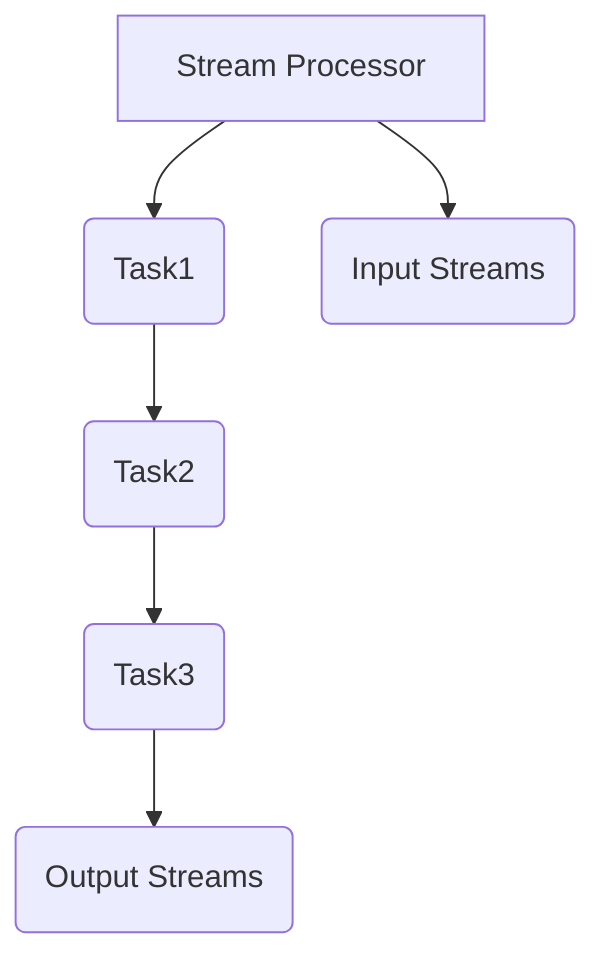

                 

关键词：Samza，分布式流处理，任务调度，代码实例，Apache Samza，流处理框架，实时计算，并行处理，大数据处理，应用场景，性能优化。

## 摘要

本文旨在深入探讨Apache Samza框架中的核心组件——Samza Task的原理及其在分布式流处理中的应用。我们将通过详细的代码实例，逐步讲解如何使用Samza进行实时数据处理，包括环境搭建、任务定义、代码实现和性能分析等方面。通过这篇文章，读者可以了解到Samza Task的工作机制，学会如何利用Samza解决实际的数据处理问题，并掌握其优缺点以及适用的场景。

## 1. 背景介绍

### 1.1 Apache Samza简介

Apache Samza是一个开源的分布式流处理框架，它能够在大规模分布式系统上高效地处理实时数据流。Samza的设计理念是提供一种灵活且可扩展的解决方案，以便开发者能够轻松地构建和管理复杂的实时数据处理应用。与传统的批处理系统（如Hadoop MapReduce）相比，Samza专注于低延迟、高吞吐量的实时数据处理。

### 1.2 分布式流处理

分布式流处理是一种处理大规模实时数据流的计算模型，其主要特点在于数据以流的形式连续到达，并立即进行处理。与批处理不同，流处理能够实时响应用户操作，提供最新的数据处理结果。这种处理方式在大数据环境中尤为重要，因为它们可以减少数据延迟，提高业务响应速度。

### 1.3 Samza Task的重要性

在Samza框架中，Task是处理数据流的核心单元。一个Samza应用由多个Task组成，每个Task负责处理特定类型的数据，并将结果输出到其他Task或外部系统。Task的设计和实现直接关系到整个应用的性能和稳定性。因此，理解Samza Task的工作原理，掌握其实现方法，对于开发高效的实时数据处理系统至关重要。

## 2. 核心概念与联系

### 2.1 核心概念

- **Stream Processor**: 负责处理数据流的组件，可以是一个或多个Task的集合。
- **Task**: Samza应用中的工作单元，负责读取数据、处理数据和输出结果。
- **Input Streams**: 任务的数据输入源，可以是Kafka等消息队列系统。
- **Output Streams**: 任务的输出源，可以将处理结果传递给其他Task或外部系统。

### 2.2 流处理架构

以下是一个简单的Samza流处理架构图，展示了Stream Processor、Task、Input Streams和Output Streams之间的关系。



## 3. 核心算法原理 & 具体操作步骤

### 3.1 算法原理概述

Samza Task的核心算法原理可以概括为以下步骤：

1. **数据读取**：从Input Streams读取数据。
2. **数据处理**：根据具体逻辑对数据进行处理。
3. **数据输出**：将处理后的数据输出到Output Streams。

### 3.2 算法步骤详解

1. **初始化Task**：定义Input Streams和Output Streams，并设置数据处理的逻辑。
2. **数据读取**：使用Samza提供的API从Input Streams中读取数据。
3. **数据处理**：对读取到的数据进行处理，例如过滤、聚合、转换等。
4. **数据输出**：将处理后的数据写入Output Streams。

### 3.3 算法优缺点

**优点**：
- **高扩展性**：能够轻松处理大规模数据流。
- **低延迟**：支持低延迟的数据处理。
- **灵活性强**：可以灵活地定义Task处理逻辑。

**缺点**：
- **依赖外部系统**：如Kafka等消息队列系统，需要确保其稳定运行。
- **开发难度**：相对于批处理系统，开发实时数据处理系统可能需要更多的技术和经验。

### 3.4 算法应用领域

Samza适用于以下场景：
- **实时数据分析**：如网站点击流分析、日志分析等。
- **实时推荐系统**：根据用户行为实时推荐商品或内容。
- **金融领域**：实时处理交易数据，进行风险管理。

## 4. 数学模型和公式 & 详细讲解 & 举例说明

### 4.1 数学模型构建

Samza Task的数学模型主要涉及到数据流的处理速度和吞吐量。以下是一个简单的数学模型：

$$
吞吐量 = \frac{数据总量}{处理时间}
$$

### 4.2 公式推导过程

吞吐量可以通过以下公式计算：

$$
处理时间 = \frac{数据总量}{吞吐量}
$$

其中，数据总量和吞吐量可以通过实际运行数据统计得到。

### 4.3 案例分析与讲解

假设一个Samza Task处理100GB的数据，平均处理时间为10分钟，那么其吞吐量为：

$$
吞吐量 = \frac{100GB}{10分钟} = 10GB/分钟
$$

如果需要将处理时间缩短到5分钟，那么吞吐量需要提高到：

$$
吞吐量 = \frac{100GB}{5分钟} = 20GB/分钟
$$

## 5. 项目实践：代码实例和详细解释说明

### 5.1 开发环境搭建

本文将使用以下开发环境：
- Java版本：1.8
- Samza版本：0.14.0
- Kafka版本：0.11.0.1

安装步骤如下：

1. 安装Java 1.8。
2. 下载并解压Samza和Kafka的源码包。
3. 配置环境变量，确保能够正确调用Samza和Kafka的命令。

### 5.2 源代码详细实现

以下是一个简单的Samza Task示例代码，用于读取Kafka中的数据，对其进行过滤，然后输出到另一个Kafka主题。

```java
import org.apache.samza.config.Config;
import org.apache.samza.config.ConfigFactory;
import org.apache.samza.config.MapConfig;
import org.apache.samza.system.*;
import org.apache.samza.task.*;
import org.apache.samza.util.SystemLoader;
import org.apache.samza.util.SystemLoaderFactory;
import org.apache.kafka.clients.consumer.ConsumerConfig;
import org.apache.kafka.clients.consumer.ConsumerRecord;
import org.apache.kafka.clients.producer.ProducerRecord;
import org.apache.kafka.clients.producer.KafkaProducer;

public class SimpleSamzaTask {

    public static void main(String[] args) {
        Config config = ConfigFactory.builder()
                .withConfig(new MapConfig())
                .build();

        SystemLoader systemLoader = SystemLoaderFactory.createSystemLoader(config);
        SystemConsumer<String, String> consumer = systemLoader.getConsumer();
        SystemProducer<String, String> producer = systemLoader.getProducer();

        consumer.registerStream("input_stream", new StringProcessor());
        producer.registerStream("output_stream");

        consumer.start();
        producer.start();

        try {
            consumer.poll(1000);
        } catch (InterruptedException e) {
            e.printStackTrace();
        } finally {
            consumer.stop();
            producer.stop();
        }
    }

    public static class StringProcessor implements StreamTask {

        @ProcessMessage
        public void processMessage(Message<String, String> message, MessageStream<ProcessorOutput> outputStream) {
            if (message.getMessage().startsWith("Hello")) {
                outputStream.emit(new ProcessorOutput(message.getKey(), message.getMessage()));
            }
        }

        @ProcessSysMessage
        public void processSysMessage(SysMessage<String, String> message, MessageStream<ProcessorOutput> outputStream) {
            // 处理系统消息
        }
    }

    public static class ProcessorOutput {
        private final String key;
        private final String value;

        public ProcessorOutput(String key, String value) {
            this.key = key;
            this.value = value;
        }

        public String getKey() {
            return key;
        }

        public String getValue() {
            return value;
        }
    }
}
```

### 5.3 代码解读与分析

- **配置读取**：使用`ConfigFactory.builder().withConfig(new MapConfig()).build()`创建一个配置对象，用于读取Samza应用的配置。
- **系统加载**：使用`SystemLoaderFactory.createSystemLoader(config)`创建一个系统加载器，用于加载Samza应用所需的系统组件（如系统Consumer和系统Producer）。
- **注册流**：使用`consumer.registerStream("input_stream", new StringProcessor())`和`producer.registerStream("output_stream")`注册输入和输出流。
- **处理消息**：在`StringProcessor`类中实现`@ProcessMessage`方法，用于处理输入流中的消息。
- **输出消息**：使用`outputStream.emit(new ProcessorOutput(message.getKey(), message.getMessage()))`将处理后的消息输出到输出流。

### 5.4 运行结果展示

在运行Samza Task后，可以观察到输入主题（如`input_stream`）中的消息被过滤并输出到输出主题（如`output_stream`）。具体的结果取决于输入消息的内容和过滤条件。

## 6. 实际应用场景

Samza在以下实际应用场景中表现出色：

- **实时数据分析**：处理来自各种数据源（如数据库、API等）的实时数据流，进行实时分析和可视化。
- **实时推荐系统**：根据用户行为实时推荐商品或内容。
- **金融领域**：处理交易数据，进行实时风险管理。

## 7. 工具和资源推荐

### 7.1 学习资源推荐

- **官方文档**：[Apache Samza官方文档](https://samza.apache.org/docs/latest/)
- **在线教程**：[Apache Samza教程](https://www.tutorialspoint.com/apache_samza/apache_samza_overview.htm)
- **技术博客**：[Samza技术博客](https://www.samza.io/blog/)

### 7.2 开发工具推荐

- **IDE**：使用Eclipse或IntelliJ IDEA等IDE进行开发。
- **Docker**：使用Docker简化开发环境和部署过程。

### 7.3 相关论文推荐

- **Samza: Stream Processing at Scale**：详细介绍了Samza的设计和实现。
- **The Data Flow Model for Stream Processing**：讨论了流处理系统的数据流模型。

## 8. 总结：未来发展趋势与挑战

### 8.1 研究成果总结

Samza在分布式流处理领域取得了显著的成果，其设计理念和技术实现为开发者提供了强大的工具。通过本文的讲解，读者可以了解Samza Task的原理和应用，学会如何利用Samza进行实时数据处理。

### 8.2 未来发展趋势

随着大数据和云计算的不断发展，分布式流处理技术将继续演进，有望在以下几个方面取得突破：

- **性能优化**：提高处理速度和吞吐量，降低延迟。
- **易用性提升**：简化开发流程，降低使用门槛。
- **生态拓展**：与其他大数据工具（如Spark、Hadoop等）更好地集成。

### 8.3 面临的挑战

- **系统稳定性**：在分布式环境中确保系统的稳定运行。
- **开发难度**：实时数据处理系统的开发复杂度较高，需要丰富的技术经验。
- **成本控制**：分布式流处理系统可能带来较高的硬件和运维成本。

### 8.4 研究展望

未来，分布式流处理技术将继续发展，有望在以下方面取得进展：

- **自动化运维**：提高系统的自动化程度，降低运维成本。
- **智能化处理**：引入机器学习等技术，实现更智能的数据处理和分析。
- **跨平台兼容性**：提高与不同平台和技术的兼容性，实现更广泛的应用场景。

## 9. 附录：常见问题与解答

### 9.1 Samza与Spark Streaming的区别是什么？

**解答**：
- **处理方式**：Samza是基于消息队列的分布式流处理框架，而Spark Streaming是基于内存的分布式流处理框架。
- **延迟和吞吐量**：Samza通常具有更低的延迟和更高的吞吐量。
- **适用场景**：Samza更适合处理大规模、低延迟的实时数据流，而Spark Streaming更适合处理较小规模、更复杂的实时数据流。

### 9.2 Samza Task如何处理失败的情况？

**解答**：
- **重试机制**：Samza Task在处理消息时可以设置重试次数和间隔，以应对处理失败的情况。
- **幂等性处理**：确保Task在处理消息时具有幂等性，避免重复处理同一消息。
- **日志记录**：记录详细的日志信息，以便在处理失败时进行故障排除。

### 9.3 Samza与Kafka的集成如何实现？

**解答**：
- **配置设置**：在Samza配置中指定Kafka的地址、主题等参数。
- **系统加载**：使用Samza提供的Kafka系统组件进行消息的读取和写入。
- **API调用**：使用Samza提供的API进行消息的处理和传输。

---

本文从多个角度详细介绍了Samza Task的原理、实现和应用。通过本文的讲解，读者可以更好地理解分布式流处理技术，学会如何使用Samza进行实时数据处理。在未来的技术发展中，分布式流处理技术将继续发挥重要作用，为各个领域带来更多创新和突破。作者：禅与计算机程序设计艺术 / Zen and the Art of Computer Programming。

