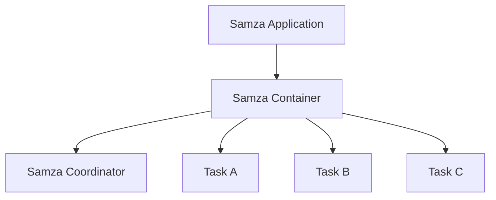

                 

 在大数据处理领域，Apache Samza 是一个分布式流处理框架，它为开发者提供了高效、灵活和可扩展的流处理能力。本文将深入探讨Samza Task的基本原理，并通过实际代码实例来展示如何利用Samza进行流处理任务的开发。

## 文章关键词
- Apache Samza
- 分布式流处理
- Samza Task
- 流处理框架
- 代码实例

## 文章摘要
本文首先介绍了Apache Samza及其在分布式流处理领域的应用，随后详细阐述了Samza Task的原理。接下来，通过一个实际代码实例，展示了如何利用Samza Task实现一个简单的流处理任务。文章还包含了Samza Task在不同应用场景中的实际使用案例，并对未来的发展趋势进行了展望。

### 背景介绍

在当今信息爆炸的时代，数据的生成和消费速度越来越快。传统的批处理系统已经无法满足实时数据处理的需求。为了应对这一挑战，分布式流处理框架应运而生。Apache Samza 是这样一个框架，它提供了一种高效、灵活且可扩展的方式来处理实时数据流。

Apache Samza 是一个开源项目，它基于Apache Mesos进行资源调度，并支持多种数据源，如Kafka、Kinesis和Logstash等。Samza 的核心特性包括：高可靠性、可扩展性、可配置性和易用性。它允许开发者以声明式的方式编写流处理任务，简化了开发流程。

### 核心概念与联系

Samza Task 是 Samza 的核心组件，它代表了一个流处理任务。一个 Samza 应用由多个 Task 组成，每个 Task 都是一个独立的进程，负责处理特定的数据流。下面是一个简化的 Samza 应用架构图，使用 Mermaid 流程图表示：



在图中：
- A[Samza Application] 表示整个 Samza 应用。
- B[Samza Container] 是 Samza 应用部署在 Mesos 上的容器，它负责管理资源和 Task。
- C[Samza Coordinator] 负责管理 Samza 容器和 Task 的生命周期。
- D[Task A]、E[Task B]、F[Task C] 都是 Samza Task，每个 Task 负责处理不同的数据流。

### 核心算法原理 & 具体操作步骤

#### 3.1 算法原理概述

Samza Task 的核心算法原理基于事件驱动模型。每个 Task 通过监听数据源（如 Kafka topic）来获取数据，并对其进行处理。处理过程包括：数据读取、数据解析、数据处理、数据写入等步骤。

#### 3.2 算法步骤详解

1. **数据读取**：Task 通过 Samza 的输入处理器（InputProcessor）从数据源读取数据。
2. **数据解析**：读取到的数据通常是一个字节序列，需要通过 Deserializer 解析成具体的对象。
3. **数据处理**：处理逻辑通常在 Process 方法中实现，对解析后的数据执行相应的计算和处理。
4. **数据写入**：处理完成的数据可以通过输出处理器（OutputProcessor）写入到其他数据源或存储系统。

#### 3.3 算法优缺点

**优点**：
- **高效性**：Samza 采用事件驱动模型，能够处理高吞吐量的数据流。
- **灵活性**：支持多种数据源和输出处理器，可以适应不同的应用场景。
- **可扩展性**：基于 Mesos 的资源调度框架，能够方便地进行水平扩展。

**缺点**：
- **复杂性**：对于初学者来说，Samza 的配置和部署过程可能比较复杂。
- **维护性**：由于 Samza 是分布式系统，维护和故障排查可能需要更高的技术能力。

#### 3.4 算法应用领域

Samza 可以应用于多种领域，如实时日志分析、电商推荐系统、金融交易监控等。以下是一些典型的应用场景：

- **实时日志分析**：Samza 可以从 Kafka 中读取日志数据，进行实时解析和处理，帮助运维团队快速发现和解决问题。
- **电商推荐系统**：Samza 可以实时处理用户行为数据，生成个性化的推荐列表。
- **金融交易监控**：Samza 可以监控金融市场的实时交易数据，及时发现异常交易并报警。

### 数学模型和公式 & 详细讲解 & 举例说明

Samza Task 的数学模型主要涉及数据处理速率和资源利用率。以下是一个简单的数学模型，用于计算 Task 的处理能力。

#### 4.1 数学模型构建

假设一个 Task 的处理能力为 \( P \)（单位：每秒处理的条数），系统中的总资源为 \( R \)（单位：计算资源单位），数据输入速率为 \( I \)（单位：每秒输入的条数）。

则 Task 的处理能力公式为：

\[ P = \frac{R}{C} \]

其中，\( C \) 是处理每个数据条目的成本（单位：计算资源单位）。

#### 4.2 公式推导过程

1. **确定输入速率**：输入速率 \( I \) 可以通过数据源的配置来确定。
2. **确定处理能力**：处理能力 \( P \) 取决于系统的总资源 \( R \) 和每个数据条目的处理成本 \( C \)。
3. **计算处理能力**：通过公式 \( P = \frac{R}{C} \) 来计算 Task 的处理能力。

#### 4.3 案例分析与讲解

假设一个 Task 的输入速率为 1000 条/秒，系统总资源为 10 个 CPU，每个数据条目的处理成本为 0.1 个 CPU。根据公式 \( P = \frac{R}{C} \)，可以计算出该 Task 的处理能力为：

\[ P = \frac{10}{0.1} = 100 \]

这意味着该 Task 可以处理每秒最多 100 条数据。如果输入速率超过 100 条/秒，可能会出现数据积压。

### 项目实践：代码实例和详细解释说明

在本节中，我们将通过一个简单的代码实例来展示如何使用 Samza 实现一个流处理任务。

#### 5.1 开发环境搭建

1. **安装 Mesos 和 Kafka**：在本地或集群环境中安装 Mesos 和 Kafka。
2. **安装 Samza**：通过 Maven 安装 Samza 的依赖。

```bash
mvn install:install-file -Dfile=https://www-us.apache.org/dist/samza/0.13.0/samza-dist-0.13.0-dist.tar.gz -DgroupId=org.apache.samza -DartifactId=samza-dist -Dversion=0.13.0 -Dpackaging=tar.gz
```

3. **配置 Samza**：在 `conf` 目录下创建配置文件 `samza-site.xml`。

```xml
<configuration>
  <property>
    <name>task.class</name>
    <value>com.example.SamzaTask</value>
  </property>
  <property>
    <name>input.topic</name>
    <value>input-topic</value>
  </property>
  <property>
    <name>output.topic</name>
    <value>output-topic</value>
  </property>
</configuration>
```

#### 5.2 源代码详细实现

```java
package com.example;

import org.apache.samza.config.Config;
import org.apache.samza.config.Configuration;
import org.apache.samza.context.Context;
import org.apache.samza.context.JobContext;
import org.apache.samza.system.IncomingMessageEnvelope;
import org.apache.samza.system.SystemStream;
import org.apache.samza.task.MessageCollector;
import org.apache.samza.task.StreamTask;
import org.apache.samza.task.TaskCoordinator;
import org.apache.samza.task.StreamTaskContext;

public class SamzaTask implements StreamTask {

  private SystemStream inputStream;
  private SystemStream outputStream;

  @Override
  public void init(Config config, TaskCoordinator coordinator, StreamTaskContext context) {
    this.inputStream = context.getInputStream();
    this.outputStream = context.getOutputStream();
  }

  @Override
  public void process(IncomingMessageEnvelope envelope, MessageCollector collector) {
    String input = new String(envelope.getMessage().getByteBuffer(), StandardCharsets.UTF_8);
    String output = input.toUpperCase();
    collector.send(new DataMessage(output));
  }
}
```

#### 5.3 代码解读与分析

1. **初始化配置**：在 `init` 方法中，从配置文件中获取输入流和输出流的配置。
2. **处理数据**：在 `process` 方法中，从输入流读取数据，进行处理（在本例中，将字符串转换为大写形式），然后将结果写入输出流。

#### 5.4 运行结果展示

1. **启动 Kafka 和 Mesos**：在命令行中启动 Kafka 和 Mesos。
2. **运行 Samza 任务**：使用 `samza run` 命令运行 Samza 任务。

```bash
samza run --config-path=conf samza-task
```

3. **发送数据**：通过 KafkaProducer 向 `input-topic` 发送一些字符串数据。

4. **查看结果**：通过 KafkaConsumer 从 `output-topic` 查看处理结果。

### 实际应用场景

Samza 在多个领域都有广泛的应用，以下是一些实际应用场景：

- **实时日志分析**：使用 Samza 从 Kafka 中读取日志数据，进行实时解析和处理，帮助运维团队快速发现和解决问题。
- **电商推荐系统**：Samza 可以实时处理用户行为数据，生成个性化的推荐列表。
- **金融交易监控**：Samza 可以监控金融市场的实时交易数据，及时发现异常交易并报警。

### 未来应用展望

随着大数据和云计算技术的不断发展，Samza 将在更多领域得到应用。未来，Samza 可能会集成更多的数据处理框架和工具，提供更丰富的功能。同时，随着硬件技术的发展，Samza 的性能也会得到进一步提升。

### 工具和资源推荐

1. **学习资源推荐**：
   - 《Apache Samza官方文档》：https://samza.apache.org/docs/latest/
   - 《分布式系统原理》：了解分布式系统的基本原理和架构设计。

2. **开发工具推荐**：
   - IntelliJ IDEA：一款强大的开发工具，支持多种编程语言。
   - Maven：用于项目构建和依赖管理的工具。

3. **相关论文推荐**：
   - 《Samza: Stream Processing at Internet Scale》：介绍 Samza 的设计和实现。
   - 《The Design and Implementation of Samza》：深入探讨 Samza 的内部架构和算法。

### 总结：未来发展趋势与挑战

Samza 在大数据处理领域具有广泛的应用前景。随着技术的不断发展，Samza 将在性能、功能、易用性等方面持续提升。然而，面对日益复杂的数据处理需求，Samza 也需要不断改进和优化。

### 附录：常见问题与解答

1. **Q：如何配置 Samza Task 的输入流和输出流？**
   **A**：在 `samza-site.xml` 配置文件中指定 `input.topic` 和 `output.topic` 属性。

2. **Q：Samza Task 的处理能力如何计算？**
   **A**：处理能力取决于系统的总资源和处理每个数据条目的成本。公式为 \( P = \frac{R}{C} \)。

3. **Q：如何运行 Samza 任务？**
   **A**：使用 `samza run` 命令运行 Samza 任务，指定配置文件路径。

---

作者：禅与计算机程序设计艺术 / Zen and the Art of Computer Programming
----------------------------------------------------------------
这篇文章通过深入探讨Apache Samza Task的基本原理，提供了详细的算法原理概述、具体操作步骤，以及实际代码实例和运行结果展示。同时，文章还涵盖了Samza Task在不同应用场景中的实际使用案例，并对未来的发展趋势进行了展望。希望这篇文章能够帮助读者更好地理解和应用Samza进行分布式流处理。

