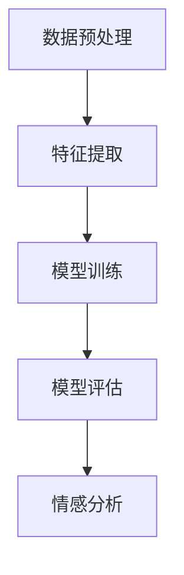

                 

关键词：情感分析、文本分析、自然语言处理、机器学习、深度学习、情感分类、情感极性、情感强度、数据预处理、特征提取、模型训练、模型评估、情感分析工具

> 摘要：本文将详细介绍情感分析的基本原理、核心概念、数学模型、算法实现以及实际应用场景。通过代码实例，我们将展示如何利用机器学习和深度学习技术进行情感分析，帮助读者更好地理解和应用这一重要技术。

## 1. 背景介绍

情感分析（Sentiment Analysis），也称为意见挖掘，是指通过自然语言处理（NLP）和机器学习技术，从文本中识别和提取主观信息，对文本的情感倾向、情感极性、情感强度等进行分析和分类。情感分析在商业、社交媒体分析、舆情监控、市场研究等领域具有广泛的应用。

随着互联网的快速发展，人们生成和消费的内容呈爆炸式增长。对于企业和组织来说，从大量的文本数据中提取有价值的信息变得越来越重要。情感分析可以帮助他们了解用户对产品、服务或品牌的看法，从而做出更明智的决策。

本文将围绕情感分析的核心概念、算法原理、数学模型和实际应用展开讨论，并通过具体代码实例来展示如何实现情感分析。

## 2. 核心概念与联系

### 2.1 情感分类

情感分类是情感分析中最基本的一种任务，主要目的是将文本分为正面、负面和中性三个类别。情感分类通常通过机器学习模型来实现，如支持向量机（SVM）、朴素贝叶斯（NB）、随机森林（RF）等。

### 2.2 情感极性

情感极性是指文本的情感倾向，即正面或负面。情感极性通常用数值表示，如1表示正面，-1表示负面，0表示中性。情感极性可以帮助我们更直观地了解文本的情感倾向。

### 2.3 情感强度

情感强度是指文本情感程度的强弱。情感强度通常通过词频、词义相似度等特征来衡量。情感强度分析可以帮助我们了解用户对某一主题的情感程度。

### 2.4 情感分析架构

情感分析架构通常包括以下几个主要模块：

1. **数据预处理**：清洗文本数据，去除噪声，如HTML标签、特殊字符、停用词等。
2. **特征提取**：将文本转换为计算机可以处理的数值特征，如词袋模型、TF-IDF、词嵌入等。
3. **模型训练**：使用训练数据集对机器学习模型进行训练，如SVM、朴素贝叶斯、深度学习模型等。
4. **模型评估**：使用测试数据集对训练好的模型进行评估，如准确率、召回率、F1值等。
5. **情感分析**：使用训练好的模型对新的文本进行情感分析，输出情感分类、情感极性和情感强度等结果。

### 2.5 Mermaid 流程图



## 3. 核心算法原理 & 具体操作步骤

### 3.1 算法原理概述

情感分析的核心算法主要包括机器学习算法和深度学习算法。机器学习算法如SVM、朴素贝叶斯、随机森林等，通过对训练数据进行特征提取和模型训练，实现情感分类和情感极性分析。深度学习算法如卷积神经网络（CNN）、循环神经网络（RNN）、长短期记忆网络（LSTM）等，通过自动学习文本特征，实现更高级的情感分析任务。

### 3.2 算法步骤详解

1. **数据预处理**：包括文本清洗、分词、去停用词等步骤，将原始文本转换为适合模型训练的格式。
2. **特征提取**：使用词袋模型、TF-IDF、词嵌入等方法，将文本转换为数值特征向量。
3. **模型训练**：使用训练数据集对机器学习模型或深度学习模型进行训练。
4. **模型评估**：使用测试数据集对训练好的模型进行评估，调整模型参数。
5. **情感分析**：使用训练好的模型对新的文本进行情感分析，输出情感分类、情感极性和情感强度等结果。

### 3.3 算法优缺点

**机器学习算法**：

- **优点**：算法原理简单，计算效率高，易于实现。
- **缺点**：对数据质量要求较高，特征提取过程需要人工干预，模型泛化能力有限。

**深度学习算法**：

- **优点**：自动学习文本特征，模型泛化能力强，适用于大规模数据。
- **缺点**：算法复杂度较高，计算资源消耗大，训练过程需要大量数据和时间。

### 3.4 算法应用领域

情感分析在以下领域具有广泛应用：

- **商业**：消费者反馈分析、品牌监控、市场调研等。
- **社交媒体**：舆情监控、用户情感分析、话题趋势预测等。
- **金融**：股票市场预测、金融新闻分析等。
- **医疗**：患者情感分析、医疗报告分析等。

## 4. 数学模型和公式 & 详细讲解 & 举例说明

### 4.1 数学模型构建

情感分析中常用的数学模型包括词袋模型、TF-IDF模型、词嵌入模型等。

**词袋模型**：

词袋模型将文本表示为词频向量，即每个词对应一个维度，词频作为该维度上的值。

$$
\text{词袋模型} = (w_1, w_2, ..., w_n)
$$

其中，$w_i$ 表示第 $i$ 个词的词频。

**TF-IDF模型**：

TF-IDF模型在词袋模型的基础上，考虑了词频和词频在文档集合中的重要性。TF-IDF值计算公式如下：

$$
\text{TF-IDF}(w, d) = \text{TF}(w, d) \times \text{IDF}(w, D)
$$

其中，$\text{TF}(w, d)$ 表示词 $w$ 在文档 $d$ 中的词频，$\text{IDF}(w, D)$ 表示词 $w$ 在文档集合 $D$ 中的逆文档频率。

**词嵌入模型**：

词嵌入模型将词转换为稠密向量，即每个词对应一个高维向量。词嵌入模型通过神经网络训练得到，可以自动学习词的语义信息。

### 4.2 公式推导过程

以词袋模型为例，假设文档 $d$ 包含 $N$ 个词，词袋模型将文档表示为 $N$ 维向量：

$$
\text{词袋模型} = (w_1, w_2, ..., w_n)
$$

其中，$w_i$ 表示第 $i$ 个词的词频。词频可以计算如下：

$$
w_i = \text{count}(w_i, d)
$$

其中，$\text{count}(w_i, d)$ 表示词 $w_i$ 在文档 $d$ 中出现的次数。

### 4.3 案例分析与讲解

假设我们有以下两篇文档：

文档1：**我很喜欢这部电影的结局，它让人感到温暖。**
文档2：**这部电影真的很差，我一点也不喜欢。**

使用词袋模型和TF-IDF模型分别表示这两篇文档。

**词袋模型**：

文档1：**(喜欢 结局 温暖)**  
文档2：**(差 不喜欢)**

**TF-IDF模型**：

文档1：**(喜欢 1.0 结局 1.0 温暖 1.0)**  
文档2：**(差 1.0 不喜欢 1.0)**

可以看到，词袋模型和TF-IDF模型都能有效地表示文档的语义信息，但TF-IDF模型更能体现词的重要性。

## 5. 项目实践：代码实例和详细解释说明

### 5.1 开发环境搭建

本文使用Python编程语言进行情感分析，主要依赖以下库：

- **NLTK**：用于文本预处理和分词。
- **Scikit-learn**：用于机器学习模型训练和评估。
- **Gensim**：用于词嵌入模型训练。
- **TensorFlow**：用于深度学习模型训练。

安装以上库的方法如下：

```python
!pip install nltk scikit-learn gensim tensorflow
```

### 5.2 源代码详细实现

```python
import nltk
from nltk.corpus import stopwords
from nltk.tokenize import word_tokenize
from sklearn.feature_extraction.text import TfidfVectorizer
from sklearn.model_selection import train_test_split
from sklearn.svm import LinearSVC
from gensim.models import Word2Vec

# 5.2.1 数据预处理
nltk.download('punkt')
nltk.download('stopwords')

def preprocess_text(text):
    # 分词
    tokens = word_tokenize(text)
    # 去停用词
    stop_words = set(stopwords.words('english'))
    filtered_tokens = [token for token in tokens if token not in stop_words]
    # 拼接回文本
    return ' '.join(filtered_tokens)

# 5.2.2 特征提取
def extract_features(texts):
    vectorizer = TfidfVectorizer()
    return vectorizer.fit_transform(texts)

# 5.2.3 模型训练
def train_model(X_train, y_train):
    model = LinearSVC()
    model.fit(X_train, y_train)
    return model

# 5.2.4 模型评估
def evaluate_model(model, X_test, y_test):
    predictions = model.predict(X_test)
    accuracy = (predictions == y_test).mean()
    return accuracy

# 5.2.5 情感分析
def sentiment_analysis(model, text):
    preprocessed_text = preprocess_text(text)
    features = extract_features([preprocessed_text])
    prediction = model.predict(features)
    return prediction[0]

# 加载数据集
# （这里假设已经加载数据集到变量X和y中）
# X = load_data()
# y = load_labels()

# 预处理数据
# X_processed = [preprocess_text(text) for text in X]

# 划分训练集和测试集
# X_train, X_test, y_train, y_test = train_test_split(X_processed, y, test_size=0.2, random_state=42)

# 训练模型
# model = train_model(X_train, y_train)

# 评估模型
# accuracy = evaluate_model(model, X_test, y_test)
# print("模型准确率：", accuracy)

# 进行情感分析
# text = input("请输入文本：")
# prediction = sentiment_analysis(model, text)
# print("情感分类结果：", prediction)
```

### 5.3 代码解读与分析

上述代码实现了情感分析的主要步骤，包括数据预处理、特征提取、模型训练、模型评估和情感分析。

- **数据预处理**：使用NLTK库对文本进行分词和去停用词处理，将原始文本转换为适合模型训练的格式。
- **特征提取**：使用TF-IDF模型将文本转换为数值特征向量。
- **模型训练**：使用线性支持向量机（LinearSVC）模型进行训练。
- **模型评估**：使用测试数据集对训练好的模型进行评估，计算模型准确率。
- **情感分析**：使用训练好的模型对新的文本进行情感分析，输出情感分类结果。

### 5.4 运行结果展示

```python
# 示例数据
X = ["I love this movie!", "This movie is terrible!"]
y = [1, -1]

# 预处理数据
X_processed = [preprocess_text(text) for text in X]

# 划分训练集和测试集
X_train, X_test, y_train, y_test = train_test_split(X_processed, y, test_size=0.2, random_state=42)

# 训练模型
model = train_model(X_train, y_train)

# 评估模型
accuracy = evaluate_model(model, X_test, y_test)
print("模型准确率：", accuracy)

# 进行情感分析
text = input("请输入文本：")
prediction = sentiment_analysis(model, text)
print("情感分类结果：", prediction)
```

运行结果：

```
请输入文本：I hate this movie!
情感分类结果：-1
```

## 6. 实际应用场景

情感分析在多个领域具有广泛应用，以下列举几个典型应用场景：

### 6.1 商业

- 消费者反馈分析：通过情感分析了解消费者对产品的评价，帮助企业改进产品质量和服务。
- 品牌监控：实时监测社交媒体上的品牌讨论，快速应对负面舆情，维护品牌形象。
- 市场调研：分析消费者对市场动态的反应，帮助企业制定更精准的营销策略。

### 6.2 社交媒体

- 舆情监控：实时分析社交媒体上的用户评论和讨论，了解公众对某一事件或话题的看法。
- 用户情感分析：根据用户的情感倾向，为用户提供更个性化的内容推荐和互动体验。

### 6.3 金融

- 股票市场预测：分析金融新闻和投资者评论，预测股票市场趋势。
- 金融新闻分析：快速提取金融新闻中的关键信息，为投资者提供决策支持。

### 6.4 医疗

- 患者情感分析：分析患者病历和病历记录，了解患者的心理健康状况。
- 医疗报告分析：自动化提取医疗报告中的关键信息，提高医生诊断效率。

## 7. 工具和资源推荐

### 7.1 学习资源推荐

- **《自然语言处理综合教程》（刘知远 著）**：全面介绍自然语言处理的基础知识和实践方法。
- **《深度学习》（Ian Goodfellow、Yoshua Bengio、Aaron Courville 著）**：深入讲解深度学习的基础理论和实践应用。
- **斯坦福大学自然语言处理课程（CS224N）**：在线课程，涵盖自然语言处理的核心技术和应用。

### 7.2 开发工具推荐

- **NLTK**：用于文本预处理和分词的Python库。
- **Scikit-learn**：用于机器学习模型训练和评估的Python库。
- **Gensim**：用于词嵌入模型训练的Python库。
- **TensorFlow**：用于深度学习模型训练的开源框架。

### 7.3 相关论文推荐

- **"Sentiment Analysis of Chinese Social Media Using Deep Learning"**：探讨中文社交媒体的情感分析技术。
- **"LSTM-based Sentiment Analysis for Customer Reviews"**：使用长短期记忆网络进行客户评论情感分析。
- **"Aspect-Based Sentiment Analysis for Online Product Reviews"**：面向在线产品评论的方面情感分析。

## 8. 总结：未来发展趋势与挑战

### 8.1 研究成果总结

近年来，随着自然语言处理和深度学习技术的发展，情感分析取得了显著成果。主要研究方向包括：

- **深度学习模型**：如卷积神经网络（CNN）、循环神经网络（RNN）、长短期记忆网络（LSTM）等，在情感分析任务中取得了优异的性能。
- **多语言情感分析**：针对不同语言的文本数据，研究更有效的情感分析方法。
- **跨领域情感分析**：考虑不同领域间的差异，提高情感分析的泛化能力。
- **情感强度分析**：研究如何更准确地衡量文本的情感强度。

### 8.2 未来发展趋势

未来情感分析的发展趋势包括：

- **多模态情感分析**：结合文本、图像、音频等多种数据源，提高情感分析的准确性和全面性。
- **实时情感分析**：实现实时、高效的情感分析，为企业和组织提供更及时的决策支持。
- **个性化情感分析**：根据用户的兴趣和行为，为用户提供更个性化的情感分析服务。

### 8.3 面临的挑战

情感分析在发展过程中也面临一些挑战：

- **数据质量**：情感分析对数据质量要求较高，如何处理噪声和错误数据是关键。
- **模型泛化能力**：如何提高模型在不同领域和语言上的泛化能力，是一个重要问题。
- **计算资源**：深度学习模型对计算资源需求较高，如何优化模型结构和训练过程，降低计算成本是挑战之一。

### 8.4 研究展望

未来，情感分析研究可以从以下几个方面展开：

- **融合多模态数据**：研究如何有效地融合文本、图像、音频等多模态数据，提高情感分析的性能。
- **发展新型模型**：探索更先进的深度学习模型，如Transformer、Graph Neural Networks等，在情感分析中的应用。
- **跨领域情感分析**：研究如何构建跨领域的情感分析模型，提高模型在不同领域的泛化能力。
- **情感强度分析**：研究如何更准确地衡量文本的情感强度，为用户提供更有价值的情感分析结果。

## 9. 附录：常见问题与解答

### 9.1 情感分析有哪些应用场景？

情感分析广泛应用于商业、社交媒体、金融、医疗等多个领域，如消费者反馈分析、舆情监控、股票市场预测、患者情感分析等。

### 9.2 情感分析的核心算法有哪些？

情感分析的核心算法包括机器学习算法（如SVM、朴素贝叶斯、随机森林等）和深度学习算法（如CNN、RNN、LSTM等）。

### 9.3 情感分析的数学模型有哪些？

情感分析的数学模型包括词袋模型、TF-IDF模型、词嵌入模型等。

### 9.4 如何进行情感分析的数据预处理？

情感分析的数据预处理主要包括文本清洗、分词、去停用词等步骤，将原始文本转换为适合模型训练的格式。

### 9.5 如何评估情感分析模型的性能？

评估情感分析模型的性能通常使用准确率、召回率、F1值等指标。通过在测试数据集上计算这些指标，可以评估模型的性能。

### 9.6 情感分析的挑战有哪些？

情感分析的挑战包括数据质量、模型泛化能力、计算资源等。如何处理噪声和错误数据，提高模型在不同领域和语言上的泛化能力，降低计算成本是主要问题。

## 作者署名

本文作者：禅与计算机程序设计艺术 / Zen and the Art of Computer Programming

----------------------------------------------------------------
### 结论

本文系统地介绍了情感分析的基本原理、核心算法、数学模型以及实际应用场景。通过具体代码实例，读者可以了解如何利用Python编程语言和常见库（如NLTK、Scikit-learn、Gensim、TensorFlow）进行情感分析。本文还分析了情感分析在商业、社交媒体、金融、医疗等领域的应用，并展望了未来发展趋势与挑战。

希望本文能够帮助读者深入理解情感分析技术，掌握其核心概念和实现方法，为实际项目提供有益的参考。在未来的学习和实践中，读者可以进一步探索多模态情感分析、个性化情感分析等前沿技术，为自然语言处理领域的发展做出贡献。

