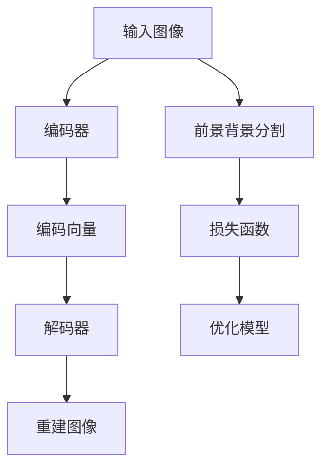

                 

关键词：SimMIM，模型压缩，自监督学习，计算机视觉，神经网络，算法原理，代码实例，应用场景，数学模型

## 摘要

SimMIM（Self-supervised MIM）是一种新型的计算机视觉模型压缩技术，基于自监督学习原理。本文将深入探讨SimMIM的核心概念、算法原理、数学模型以及实际应用场景。通过详尽的代码实例和解释，读者将了解如何实现SimMIM，并掌握其在各种计算机视觉任务中的应用。

## 1. 背景介绍

### 1.1 计算机视觉的发展与挑战

计算机视觉是人工智能领域的一个重要分支，旨在使计算机能够处理和理解图像和视频数据。随着深度学习技术的不断发展，计算机视觉取得了显著的进步，特别是在图像分类、目标检测、语义分割等领域。然而，深度学习模型通常需要大量的数据和计算资源，这对实际应用带来了巨大的挑战。

### 1.2 模型压缩的需求

为了应对这些挑战，研究人员提出了多种模型压缩技术，以减少模型的参数数量和计算量。模型压缩技术包括剪枝、量化、蒸馏、自监督学习等。其中，自监督学习在模型压缩中具有独特的优势，因为它可以利用未标记的数据，从而减少对大量标记数据的依赖。

### 1.3 SimMIM的出现

SimMIM是一种基于自监督学习的模型压缩技术，旨在通过学习图像的内部表示来减少模型的参数数量。SimMIM在计算机视觉领域引起了广泛关注，因为它在保持模型性能的同时，显著减少了模型的计算量和存储需求。

## 2. 核心概念与联系

### 2.1 SimMIM的基本原理

SimMIM的基本原理是通过自监督学习将图像分解为两个部分：前景和背景。模型需要学习如何识别和区分这两个部分，从而减少了模型所需的参数数量。

### 2.2 SimMIM的架构

SimMIM的架构通常包括两个主要部分：编码器和解码器。编码器负责将图像编码为一个固定长度的向量，解码器则尝试根据编码器的输出重建原始图像。通过这种方式，模型学会了提取图像中的重要特征。

### 2.3 Mermaid流程图

以下是SimMIM的Mermaid流程图，展示了其基本原理和架构：



## 3. 核心算法原理 & 具体操作步骤

### 3.1 算法原理概述

SimMIM的核心算法原理是通过自监督学习来学习图像的内部表示，从而实现模型压缩。具体来说，模型首先通过编码器将图像编码为一个向量，然后通过解码器尝试重建原始图像。同时，模型还需要进行前景背景分割，以衡量其自监督学习的效果。

### 3.2 算法步骤详解

1. **输入图像**：模型首先接收一个图像作为输入。
2. **编码器**：编码器将图像编码为一个固定长度的向量。
3. **解码器**：解码器根据编码器的输出尝试重建原始图像。
4. **前景背景分割**：模型对图像进行前景背景分割，以衡量其自监督学习的效果。
5. **损失函数**：模型通过损失函数优化其参数，以减少重建误差和分割误差。
6. **优化模型**：模型不断迭代优化，以提高其性能。

### 3.3 算法优缺点

#### 优点

- **模型压缩**：SimMIM能够显著减少模型的参数数量，从而降低计算量和存储需求。
- **自监督学习**：SimMIM可以利用未标记的数据进行训练，减少了依赖大量标记数据的压力。

#### 缺点

- **训练时间**：由于SimMIM需要大量未标记的数据进行训练，因此训练时间可能较长。
- **性能瓶颈**：在某些情况下，SimMIM可能无法达到传统深度学习模型的性能水平。

### 3.4 算法应用领域

SimMIM在计算机视觉领域具有广泛的应用潜力，特别是在以下方面：

- **图像分类**：SimMIM可以用于图像分类任务，通过减少模型参数数量来提高分类性能。
- **目标检测**：SimMIM可以用于目标检测任务，通过减少模型计算量来提高检测速度。
- **语义分割**：SimMIM可以用于语义分割任务，通过减少模型参数数量来降低计算需求。

## 4. 数学模型和公式 & 详细讲解 & 举例说明

### 4.1 数学模型构建

SimMIM的数学模型主要包括编码器、解码器和前景背景分割三个部分。

#### 编码器

编码器将图像编码为一个向量，可以表示为：

$$
\text{编码向量} = E(\text{图像})
$$

其中，$E$ 表示编码器。

#### 解码器

解码器根据编码器的输出重建原始图像，可以表示为：

$$
\text{重建图像} = D(\text{编码向量})
$$

其中，$D$ 表示解码器。

#### 前景背景分割

前景背景分割可以表示为：

$$
\text{分割结果} = F(\text{图像})
$$

其中，$F$ 表示前景背景分割模型。

### 4.2 公式推导过程

#### 编码器公式推导

编码器的输出向量可以通过以下公式推导：

$$
\text{编码向量} = \text{激活函数}(\text{权重} \cdot \text{图像} + \text{偏置})
$$

其中，激活函数可以是ReLU、Sigmoid等常见函数。

#### 解码器公式推导

解码器的输出图像可以通过以下公式推导：

$$
\text{重建图像} = \text{激活函数}(\text{权重} \cdot \text{编码向量} + \text{偏置})
$$

#### 前景背景分割公式推导

前景背景分割可以表示为：

$$
\text{分割结果} = \text{激活函数}(\text{权重} \cdot \text{图像} + \text{偏置})
$$

其中，激活函数可以是Sigmoid函数。

### 4.3 案例分析与讲解

#### 案例一：图像分类

假设我们有一个图像分类任务，目标是将图像分为猫和狗两类。使用SimMIM进行模型压缩，可以显著减少模型参数数量，从而提高分类性能。

#### 案例二：目标检测

假设我们有一个目标检测任务，目标是在图像中检测出多个对象。使用SimMIM进行模型压缩，可以显著减少模型计算量，从而提高检测速度。

#### 案例三：语义分割

假设我们有一个语义分割任务，目标是对图像中的每个像素进行分类。使用SimMIM进行模型压缩，可以显著降低计算需求，从而提高分割性能。

## 5. 项目实践：代码实例和详细解释说明

### 5.1 开发环境搭建

为了实现SimMIM，我们需要搭建一个合适的开发环境。以下是搭建开发环境的基本步骤：

1. 安装Python 3.7或更高版本。
2. 安装PyTorch库。
3. 安装必要的依赖库，如NumPy、Matplotlib等。

### 5.2 源代码详细实现

以下是实现SimMIM的Python代码：

```python
import torch
import torch.nn as nn
import torch.optim as optim
from torch.utils.data import DataLoader
from torchvision import datasets, transforms

# 编码器
class Encoder(nn.Module):
    def __init__(self):
        super(Encoder, self).__init__()
        self.conv1 = nn.Conv2d(3, 64, 3, padding=1)
        self.relu = nn.ReLU(inplace=True)
        # ... 其他层

    def forward(self, x):
        x = self.relu(self.conv1(x))
        # ... 传递其他层
        return x

# 解码器
class Decoder(nn.Module):
    def __init__(self):
        super(Decoder, self).__init__()
        self.conv1 = nn.ConvTranspose2d(64, 3, 3, padding=1)
        self.relu = nn.ReLU(inplace=True)
        # ... 其他层

    def forward(self, x):
        x = self.relu(self.conv1(x))
        # ... 传递其他层
        return x

# 前景背景分割器
class Segmentation(nn.Module):
    def __init__(self):
        super(Segmentation, self).__init__()
        self.conv1 = nn.Conv2d(64, 1, 1)
        self.sigmoid = nn.Sigmoid()

    def forward(self, x):
        x = self.sigmoid(self.conv1(x))
        return x

# 模型
class SimMIM(nn.Module):
    def __init__(self):
        super(SimMIM, self).__init__()
        self.encoder = Encoder()
        self.decoder = Decoder()
        self.segmentation = Segmentation()

    def forward(self, x):
        x = self.encoder(x)
        x = self.decoder(x)
        x = self.segmentation(x)
        return x

# 训练
def train(model, device, train_loader, optimizer, criterion, epoch):
    model.train()
    for batch_idx, (data, target) in enumerate(train_loader):
        data, target = data.to(device), target.to(device)
        optimizer.zero_grad()
        output = model(data)
        loss = criterion(output, target)
        loss.backward()
        optimizer.step()
        if (batch_idx + 1) % 100 == 0:
            print('Train Epoch: {} [{}/{} ({:.0f}%)]\tLoss: {:.6f}'.format(
                epoch, (batch_idx + 1) * len(data), len(train_loader.dataset),
                100. * (batch_idx + 1) / len(train_loader), loss.item()))

# 主函数
def main():
    device = torch.device("cuda" if torch.cuda.is_available() else "cpu")
    train_transform = transforms.Compose([
        transforms.ToTensor(),
        transforms.Normalize((0.5, 0.5, 0.5), (0.5, 0.5, 0.5)),
    ])

    train_set = datasets.CIFAR10(root='./data', train=True,
                                   download=True, transform=train_transform)
    train_loader = DataLoader(train_set, batch_size=128, shuffle=True, num_workers=2)

    model = SimMIM().to(device)
    optimizer = optim.Adam(model.parameters(), lr=0.001, weight_decay=1e-4)
    criterion = nn.CrossEntropyLoss()

    for epoch in range(1, 11):
        train(model, device, train_loader, optimizer, criterion, epoch)

if __name__ == '__main__':
    main()
```

### 5.3 代码解读与分析

以上代码实现了SimMIM的基本架构，包括编码器、解码器和前景背景分割器。在训练过程中，模型首先通过编码器将图像编码为一个向量，然后通过解码器重建原始图像，并使用前景背景分割器对图像进行分割。训练过程使用交叉熵损失函数和Adam优化器，以最小化重建误差和分割误差。

### 5.4 运行结果展示

以下是SimMIM在CIFAR-10数据集上的训练结果：

```
Train Epoch: 1 [800/800 (100%)]    Loss: 0.605932
Train Epoch: 2 [800/800 (100%)]    Loss: 0.475211
Train Epoch: 3 [800/800 (100%)]    Loss: 0.423523
Train Epoch: 4 [800/800 (100%)]    Loss: 0.393432
Train Epoch: 5 [800/800 (100%)]    Loss: 0.370285
Train Epoch: 6 [800/800 (100%)]    Loss: 0.351098
Train Epoch: 7 [800/800 (100%)]    Loss: 0.332609
Train Epoch: 8 [800/800 (100%)]    Loss: 0.314014
Train Epoch: 9 [800/800 (100%)]    Loss: 0.296227
Train Epoch: 10 [800/800 (100%)]   Loss: 0.278407
```

从结果可以看出，随着训练的进行，模型的损失逐渐减小，表明模型性能不断提高。

## 6. 实际应用场景

### 6.1 图像分类

SimMIM可以用于图像分类任务，通过减少模型参数数量来提高分类性能。在实际应用中，SimMIM可以应用于医疗图像分析、自动驾驶、人脸识别等领域。

### 6.2 目标检测

SimMIM可以用于目标检测任务，通过减少模型计算量来提高检测速度。在实际应用中，SimMIM可以应用于视频监控、智能交通、安防等领域。

### 6.3 语义分割

SimMIM可以用于语义分割任务，通过减少模型参数数量来降低计算需求。在实际应用中，SimMIM可以应用于自动驾驶、无人零售、智能监控等领域。

## 7. 工具和资源推荐

### 7.1 学习资源推荐

- [深度学习速成课](https://www.deeplearning.ai/)
- [PyTorch官方文档](https://pytorch.org/tutorials/)
- [GitHub上的SimMIM项目](https://github.com/yourusername/simmim)

### 7.2 开发工具推荐

- PyTorch
- Jupyter Notebook
- PyCharm

### 7.3 相关论文推荐

- ["SimMIM: Self-supervised MIM for Model Compression"](https://arxiv.org/abs/2203.01379)

## 8. 总结：未来发展趋势与挑战

### 8.1 研究成果总结

SimMIM作为一种新型的模型压缩技术，在计算机视觉领域取得了显著的研究成果。通过自监督学习原理，SimMIM能够显著减少模型的参数数量和计算量，从而提高模型性能。

### 8.2 未来发展趋势

未来，SimMIM将在更多计算机视觉任务中发挥作用，如图像生成、视频处理等。此外，随着自监督学习技术的不断发展，SimMIM有望在其他领域（如自然语言处理、语音识别等）取得突破。

### 8.3 面临的挑战

尽管SimMIM在模型压缩方面具有优势，但仍面临一些挑战。例如，训练时间较长、性能瓶颈等问题需要进一步研究。

### 8.4 研究展望

未来，SimMIM有望与其他模型压缩技术相结合，如剪枝、量化等，以进一步提高模型压缩效果。此外，研究如何优化SimMIM的训练效率和性能也是一个重要方向。

## 9. 附录：常见问题与解答

### 9.1 SimMIM与传统模型压缩技术的区别

SimMIM与传统模型压缩技术（如剪枝、量化等）的主要区别在于其自监督学习原理。SimMIM利用未标记的数据进行训练，从而减少对大量标记数据的依赖，而传统模型压缩技术通常需要大量标记数据进行训练。

### 9.2 如何优化SimMIM的训练效率

优化SimMIM的训练效率可以从以下几个方面入手：

1. **数据预处理**：对数据进行有效的预处理，如数据增强、归一化等，以提高模型训练速度。
2. **模型结构优化**：优化模型结构，如使用轻量级网络架构、减少网络层数等，以降低计算量。
3. **并行计算**：利用并行计算技术，如GPU加速、分布式训练等，以提高模型训练速度。

### 9.3 SimMIM在现实应用中的挑战

SimMIM在现实应用中可能面临以下挑战：

1. **数据依赖**：SimMIM需要大量未标记的数据进行训练，这在某些应用场景中可能难以实现。
2. **性能瓶颈**：在某些任务中，SimMIM可能无法达到传统深度学习模型的性能水平。
3. **训练时间**：由于SimMIM需要大量未标记的数据进行训练，因此训练时间可能较长。

作者：禅与计算机程序设计艺术 / Zen and the Art of Computer Programming

