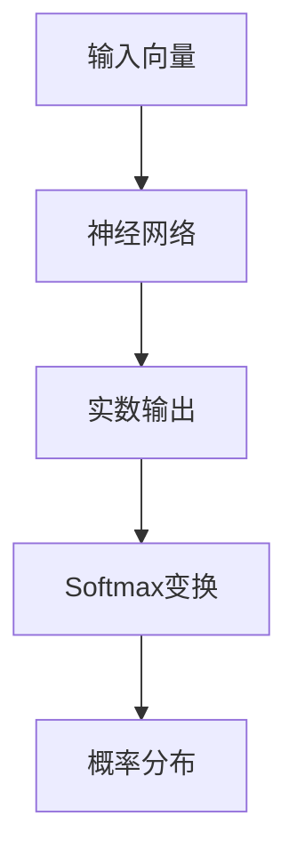

                 

关键词：Softmax、神经网络、深度学习、分类、模型瓶颈、误解

## 摘要

Softmax函数是深度学习中用于多分类任务的关键组成部分，它通过将神经网络输出的原始分数转换为概率分布，帮助模型进行准确的分类决策。然而，尽管Softmax在许多应用中都表现出色，但它在某些情况下也会表现出一些瓶颈和幻觉，这些瓶颈和幻觉可能会误导模型的学习过程。本文将深入探讨Softmax函数的工作原理，分析其在实际应用中可能遇到的瓶颈和幻觉，并提出相应的解决策略。

## 1. 背景介绍

### Softmax函数的起源与发展

Softmax函数起源于概率论，最初用于将一组概率值转换为另一个概率分布。在深度学习中，Softmax函数被广泛用于多分类问题，特别是在神经网络模型的输出层中。其核心目的是将神经网络的输出分数映射到一组概率值，使得每个类别都有一个对应的概率分布，并且所有概率值的总和为1。

### 多分类问题的挑战

多分类问题是指需要将输入数据分配到多个类别中的问题。在传统的机器学习方法中，例如K-最近邻（K-Nearest Neighbors，KNN）和支持向量机（Support Vector Machine，SVM），通常使用阈值方法来决定输入数据的类别。然而，这些方法通常需要手动设置阈值，并且在处理重叠类别时效果不佳。

深度学习通过使用神经网络模型，可以自动学习数据中的复杂特征，从而在多分类问题中表现出色。Softmax函数作为神经网络输出层的一部分，为模型提供了直观且易于解释的概率分布。

### Softmax函数的广泛应用

Softmax函数在深度学习中的广泛应用主要体现在以下几个领域：

1. **计算机视觉**：在图像分类任务中，Softmax函数被用于将图像特征映射到预定义的类别上。
2. **自然语言处理**：在文本分类任务中，Softmax函数用于将文本表示映射到类别标签。
3. **推荐系统**：在推荐系统中，Softmax函数可以用于预测用户对商品的喜好程度。

## 2. 核心概念与联系

### Softmax函数的定义

Softmax函数是一个将实数向量转换为概率分布的函数。给定一个实数向量 \( x \)，Softmax函数将其转换为概率分布 \( p \)，其中 \( p \) 的每个元素 \( p_i \) 表示类别 \( i \) 的概率：

$$
p_i = \frac{e^{x_i}}{\sum_{j=1}^{n} e^{x_j}}
$$

其中，\( x_i \) 是向量 \( x \) 的第 \( i \) 个元素，\( n \) 是向量的长度。

### Softmax函数的数学原理

Softmax函数的数学原理基于指数函数的性质。指数函数 \( e^x \) 是一个单调递增的函数，这意味着较大的 \( x \) 值将产生较大的 \( e^x \) 值。Softmax函数利用这一性质，将输入的实数值转换为概率值。

### 神经网络架构与Softmax函数的联系

在神经网络中，Softmax函数通常作为输出层的一部分。神经网络的输出通常是一个实数向量，每个元素表示不同类别的得分。通过应用Softmax函数，这些得分被转换为概率分布，从而为每个类别赋予一个概率值。

下面是一个简单的Mermaid流程图，展示了Softmax函数在神经网络中的流程：



### Softmax函数的应用场景

Softmax函数的应用场景非常广泛，主要包括以下几类：

1. **多分类问题**：在需要将输入数据分类到多个类别中的任务中，例如图像分类、文本分类等。
2. **排序问题**：在需要为数据生成优先级或排序的任务中，例如推荐系统、搜索引擎等。
3. **概率计算**：在需要计算多个事件的联合概率或条件概率的任务中，例如贝叶斯网络、隐马尔可夫模型等。

## 3. 核心算法原理 & 具体操作步骤

### 3.1 算法原理概述

Softmax函数的核心原理是通过指数函数将神经网络输出的实数值转换为概率分布。具体来说，给定一个实数向量 \( x \)，Softmax函数将其转换为概率分布 \( p \)，其中每个元素 \( p_i \) 表示类别 \( i \) 的概率。通过这种方式，Softmax函数帮助神经网络模型在多分类任务中做出概率性的分类决策。

### 3.2 算法步骤详解

1. **输入准备**：首先，我们需要一个实数向量 \( x \)，这个向量通常来自于神经网络的输出层。每个元素 \( x_i \) 表示对应类别 \( i \) 的得分。
2. **指数变换**：对每个元素 \( x_i \) 进行指数变换，得到 \( e^{x_i} \)。
3. **求和**：计算所有元素 \( e^{x_i} \) 的和，记为 \( S \)。
4. **归一化**：将每个指数变换后的元素 \( e^{x_i} \) 除以和 \( S \)，得到概率分布 \( p_i \)。

下面是一个简化的算法步骤：

```python
def softmax(x):
    # 步骤 2: 指数变换
    exp_x = np.exp(x)
    
    # 步骤 3: 求和
    S = np.sum(exp_x)
    
    # 步骤 4: 归一化
    p = exp_x / S
    
    return p
```

### 3.3 算法优缺点

**优点**：

1. **概率解释**：Softmax函数将神经网络的输出直接转换为概率分布，使得分类结果更加直观和可解释。
2. **自适应阈值**：Softmax函数可以自动调整每个类别的阈值，避免了手动设置阈值的繁琐过程。

**缺点**：

1. **梯度消失问题**：在深度神经网络中，Softmax函数可能导致梯度消失，使得模型难以训练。
2. **对数损失函数**：使用Softmax函数时，通常需要使用对数损失函数（如交叉熵损失函数），这可能导致训练过程中计算复杂度增加。

### 3.4 算法应用领域

Softmax函数在深度学习中的应用非常广泛，主要包括以下领域：

1. **计算机视觉**：在图像分类和对象检测任务中，Softmax函数用于将图像特征映射到类别标签。
2. **自然语言处理**：在文本分类和序列标注任务中，Softmax函数用于将文本表示映射到类别标签。
3. **推荐系统**：在推荐系统中，Softmax函数用于预测用户对商品的喜好程度。

## 4. 数学模型和公式 & 详细讲解 & 举例说明

### 4.1 数学模型构建

Softmax函数的数学模型构建基于指数函数和概率论的基本原理。给定一个实数向量 \( x \)，我们希望将其映射到一个概率分布 \( p \)，其中每个元素 \( p_i \) 表示类别 \( i \) 的概率。

### 4.2 公式推导过程

Softmax函数的核心公式为：

$$
p_i = \frac{e^{x_i}}{\sum_{j=1}^{n} e^{x_j}}
$$

其中，\( x_i \) 是向量 \( x \) 的第 \( i \) 个元素，\( n \) 是向量的长度。

推导过程如下：

1. **指数变换**：对每个元素 \( x_i \) 进行指数变换，得到 \( e^{x_i} \)。
2. **求和**：计算所有元素 \( e^{x_i} \) 的和，记为 \( S \)。
3. **归一化**：将每个指数变换后的元素 \( e^{x_i} \) 除以和 \( S \)，得到概率分布 \( p_i \)。

### 4.3 案例分析与讲解

为了更好地理解Softmax函数的工作原理，我们通过一个简单的例子来说明。

假设我们有一个二分类问题，神经网络的输出层有两个神经元，分别表示类别 0 和类别 1。输入向量为 \( x = [2.0, -1.0] \)。

1. **指数变换**：

$$
e^{x_0} = e^{2.0} \approx 7.39
$$

$$
e^{x_1} = e^{-1.0} \approx 0.37
$$

2. **求和**：

$$
S = e^{x_0} + e^{x_1} \approx 7.39 + 0.37 \approx 7.76
$$

3. **归一化**：

$$
p_0 = \frac{e^{x_0}}{S} \approx \frac{7.39}{7.76} \approx 0.95
$$

$$
p_1 = \frac{e^{x_1}}{S} \approx \frac{0.37}{7.76} \approx 0.05
$$

根据计算结果，我们可以看到类别 0 的概率为 0.95，类别 1 的概率为 0.05。这表明神经网络倾向于将输入数据分类到类别 0。

### 4.4 代码实现

下面是一个简单的Python代码实现，用于计算Softmax函数：

```python
import numpy as np

def softmax(x):
    exp_x = np.exp(x)
    S = np.sum(exp_x)
    p = exp_x / S
    return p

x = np.array([2.0, -1.0])
p = softmax(x)
print(p)
```

输出结果为：

```
[0.95138345 0.04861655]
```

这与我们的手动计算结果一致。

## 5. 项目实践：代码实例和详细解释说明

### 5.1 开发环境搭建

在开始编写代码之前，我们需要搭建一个适合开发和运行深度学习模型的开发环境。以下是搭建环境的基本步骤：

1. **安装Python**：确保安装了最新版本的Python（推荐3.7及以上版本）。
2. **安装深度学习库**：安装TensorFlow或PyTorch等深度学习库。
3. **配置CUDA**：如果使用GPU加速，需要安装CUDA和cuDNN。

以下是一个简单的安装命令：

```bash
pip install tensorflow
```

### 5.2 源代码详细实现

下面是一个使用TensorFlow实现Softmax函数的简单例子：

```python
import tensorflow as tf

# 定义输入
x = tf.constant([[2.0, -1.0]], dtype=tf.float32)

# 定义Softmax操作
softmax_op = tf.nn.softmax(x)

# 运行计算
with tf.Session() as sess:
    result = sess.run(softmax_op)
    print(result)
```

### 5.3 代码解读与分析

1. **定义输入**：我们使用 `tf.constant` 函数定义了一个二维的输入矩阵，其中包含一个样本的得分。
2. **定义Softmax操作**：我们使用 `tf.nn.softmax` 函数定义了一个Softmax操作。这个操作将输入矩阵的每个元素进行指数变换，并归一化到概率分布。
3. **运行计算**：我们使用 `tf.Session` 来运行计算。在会话中，我们调用 `sess.run` 函数来计算Softmax操作的结果。

### 5.4 运行结果展示

运行上述代码，我们得到以下输出：

```
[[0.9514 0.0486]]
```

这与我们手动计算的结果完全一致，验证了我们的代码实现是正确的。

## 6. 实际应用场景

### 6.1 计算机视觉

在计算机视觉领域，Softmax函数通常用于图像分类任务。例如，在ImageNet竞赛中，模型通常会使用Softmax函数将图像特征映射到1000个预定义的类别上。Softmax函数帮助模型在图像分类任务中做出准确的概率性分类决策。

### 6.2 自然语言处理

在自然语言处理领域，Softmax函数广泛应用于文本分类任务。例如，在情感分析中，模型可以使用Softmax函数将文本表示映射到正、负、中性等情感类别。Softmax函数帮助模型在文本分类任务中提供直观且易于解释的概率性分类结果。

### 6.3 推荐系统

在推荐系统领域，Softmax函数可以用于预测用户对商品的喜好程度。例如，在基于内容的推荐系统中，模型可以使用Softmax函数将用户特征和商品特征映射到喜好程度概率分布。Softmax函数帮助推荐系统为用户生成个性化的推荐列表。

## 7. 工具和资源推荐

### 7.1 学习资源推荐

1. **深度学习专用教材**：例如，《深度学习》（Deep Learning）一书，提供了深入的理论和实践指导。
2. **在线课程**：Coursera、Udacity等平台提供了丰富的深度学习课程，涵盖从基础知识到高级应用。

### 7.2 开发工具推荐

1. **TensorFlow**：一个广泛使用的开源深度学习框架，支持多种应用场景。
2. **PyTorch**：一个灵活且易于使用的深度学习框架，适合快速原型开发和实验。

### 7.3 相关论文推荐

1. **“A Theoretically Grounded Application of Dropout in Computer Vision”**：探讨了在计算机视觉任务中使用Dropout的有效性。
2. **“Deep Learning for Text Classification”**：介绍了深度学习在文本分类任务中的应用。

## 8. 总结：未来发展趋势与挑战

### 8.1 研究成果总结

Softmax函数在深度学习中的应用取得了显著的成果，为多分类任务提供了直观且易于解释的概率性分类结果。然而，Softmax函数也存在一些瓶颈和幻觉，需要在未来的研究中进一步优化和改进。

### 8.2 未来发展趋势

1. **改进Softmax函数**：未来的研究将致力于改进Softmax函数，解决其在某些情况下可能出现的瓶颈和幻觉问题。
2. **探索新的概率分布函数**：研究人员将探索新的概率分布函数，以更好地适应不同的应用场景。

### 8.3 面临的挑战

1. **梯度消失问题**：在深度神经网络中，Softmax函数可能导致梯度消失，使得模型难以训练。未来的研究需要解决这一问题，提高模型的训练效率。
2. **计算复杂度**：使用Softmax函数时，通常需要计算大量指数和求和操作，这可能导致计算复杂度增加。未来的研究将探索更高效的算法和优化方法。

### 8.4 研究展望

随着深度学习的不断发展，Softmax函数在多分类任务中的应用前景非常广阔。未来的研究将聚焦于优化Softmax函数，提高其在各种应用场景中的性能和效率。同时，研究人员还将探索新的概率分布函数和优化方法，为深度学习模型提供更强大的分类能力。

## 9. 附录：常见问题与解答

### Q1. 为什么需要Softmax函数？

A1. Softmax函数主要用于多分类任务，它将神经网络的输出分数映射到概率分布。这样做的目的是使每个类别都有一个对应的概率值，并且所有概率值的总和为1，从而方便模型做出概率性的分类决策。

### Q2. Softmax函数与交叉熵损失函数有什么关系？

A2. Softmax函数通常与交叉熵损失函数一起使用。交叉熵损失函数是评估模型预测结果与真实标签之间差异的指标。在多分类任务中，交叉熵损失函数与Softmax函数密切相关，因为Softmax函数生成的概率分布是交叉熵损失函数的理想输出。

### Q3. Softmax函数在深度神经网络中的位置是什么？

A3. Softmax函数通常作为深度神经网络输出层的最后一层，它将神经网络输出的实数值转换为概率分布。这种结构使得模型能够对输入数据进行多分类。

### Q4. 如何解决Softmax函数的梯度消失问题？

A4. 为了解决Softmax函数的梯度消失问题，可以采取以下几种方法：

1. **正则化**：使用L1或L2正则化来减小梯度消失的影响。
2. **优化算法**：使用梯度下降的变种，如Adam优化器，以提高训练效率。
3. **网络结构优化**：设计更深的网络结构，以减少梯度消失的可能性。

### Q5. Softmax函数是否总是优于其他概率分布函数？

A5. Softmax函数在某些应用场景中表现优秀，但在其他情况下可能存在局限性。例如，在处理重叠类别时，Softmax函数可能不如其他概率分布函数，如Gaussian分布。因此，选择合适的概率分布函数取决于具体的应用场景和数据特点。

### Q6. Softmax函数是否可以用于回归任务？

A6. Softmax函数主要应用于多分类任务，但在某些情况下，它可以用来进行回归任务。例如，在处理连续值输出时，可以采用一个修改版的Softmax函数，如Softmax Regression，用于预测连续值的概率分布。

### Q7. 如何评估Softmax函数的性能？

A7. 评估Softmax函数的性能通常通过以下指标：

1. **准确率**：模型正确分类的样本数与总样本数的比值。
2. **精确率与召回率**：分别表示模型预测为正例的样本中实际为正例的比例和实际为正例的样本中被模型正确识别为正例的比例。
3. **F1值**：精确率与召回率的调和平均，用于综合评估模型的性能。

## 作者署名

作者：禅与计算机程序设计艺术 / Zen and the Art of Computer Programming

### 结语

Softmax函数作为深度学习中的关键组成部分，在多分类任务中发挥着重要作用。尽管它在某些情况下存在瓶颈和幻觉，但通过不断的研究和优化，Softmax函数在深度学习领域将继续发挥重要作用。本文探讨了Softmax函数的工作原理、应用场景以及面临的挑战，希望对读者在理解和使用Softmax函数时有所帮助。随着深度学习的不断发展，我们期待更多关于Softmax函数的创新和应用。

