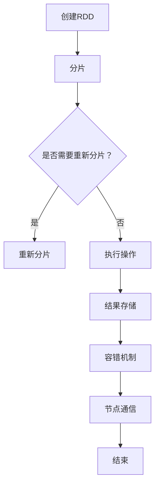

                 

关键字：Spark，弹性分布式数据集（RDD），数据处理，分布式系统，大数据，编程模型，性能优化。

## 摘要

本文将深入探讨Spark中的弹性分布式数据集（RDD）的原理及其在分布式数据处理中的应用。我们将从背景介绍入手，逐步深入到RDD的核心概念与联系，详细解释其算法原理与具体操作步骤，以及数学模型和公式的构建与推导。接着，通过项目实践代码实例，展示如何在实际中运用RDD。文章最后将讨论RDD在各个领域的应用，并提供相关的工具和资源推荐，以及对未来的发展趋势与挑战进行展望。

## 1. 背景介绍

在当今大数据时代，分布式数据处理变得越来越重要。传统的数据处理方法已经难以满足海量数据的处理需求。Spark作为大数据处理领域的重要技术之一，以其高效的分布式数据处理能力和丰富的API接口，成为众多企业和研究机构的宠儿。

Spark的核心在于其弹性分布式数据集（RDD），这是一种可扩展的分布式数据存储结构，它提供了丰富的操作接口，使得数据处理变得简便而高效。RDD不仅能够处理静态数据集，还可以处理动态数据流，使其在流处理和批处理中都能发挥巨大的作用。

## 2. 核心概念与联系

### 2.1 RDD的定义

RDD（Resilient Distributed Dataset）是Spark中的核心抽象。它是一个不可变的、可分治的、分布式数据集合。RDD可以被看作是一个分布式的内存数据结构，它可以在多个节点上并行处理。

### 2.2 RDD的特性

1. **不可变性**：RDD中的数据一旦创建就不能被修改，这保证了数据的原子性和一致性。
2. **分治性**：RDD可以通过分片（partition）进行拆分，使得数据处理可以在多个节点上并行执行。
3. **容错性**：Spark提供了自动的容错机制，当节点失败时，RDD的数据可以通过备份自动恢复。
4. **弹性**：当处理的数据量超过内存容量时，Spark会自动将数据存储到磁盘上，并在需要时重新加载到内存中。

### 2.3 RDD与分布式系统的联系

RDD是分布式系统的一种高级抽象，它通过以下方式与分布式系统联系：

1. **节点间通信**：RDD的操作是通过节点间的通信实现的，如`map`、`reduce`等。
2. **数据存储**：RDD的数据存储在分布式文件系统上，如HDFS。
3. **计算调度**：Spark的DAGScheduler和TaskScheduler负责将RDD的操作调度到不同的节点上执行。

## 2.4 Mermaid 流程图

下面是一个描述RDD操作的Mermaid流程图：



## 3. 核心算法原理 & 具体操作步骤

### 3.1 算法原理概述

RDD的核心在于其基于拉式模型（Lazy Model）的操作。当执行一个RDD操作时，并不是立即执行，而是将操作转换为一系列的依赖关系，只有在需要获取结果时，才会真正执行。

这种拉式模型有以下优点：

1. **延迟执行**：操作可以延迟到需要时再执行，减少了不必要的计算。
2. **优化**：Spark可以在多个操作间进行优化，如管道化（Pipeline）和压缩（Compression）。
3. **容错**：由于操作是延迟执行的，Spark可以在失败时重新执行操作。

### 3.2 算法步骤详解

1. **创建RDD**：可以通过读取文件、序列化数据等途径创建RDD。
2. **分片**：将RDD分成多个分片，每个分片是一个可以被并行处理的数据子集。
3. **依赖关系**：将RDD的操作转换为依赖关系，如`map`操作的依赖是输入RDD。
4. **调度与执行**：根据依赖关系和资源情况，将操作调度到不同的节点上执行。
5. **结果存储**：将执行结果存储为新的RDD或文件。

### 3.3 算法优缺点

#### 优点：

1. **高性能**：通过并行处理和延迟执行，Spark能够提供高性能的数据处理。
2. **易用性**：Spark的API接口丰富，使得数据处理变得更加简便。
3. **容错性**：Spark提供了自动的容错机制，提高了系统的可靠性。

#### 缺点：

1. **存储开销**：由于RDD的数据是不可变的，当数据量较大时，可能会占用较多的存储空间。
2. **复杂性**：对于初学者来说，理解RDD的依赖关系和执行过程可能较为复杂。

### 3.4 算法应用领域

RDD在多个领域都有广泛应用，如：

1. **数据挖掘**：RDD可以方便地实现数据预处理、特征提取等操作。
2. **机器学习**：Spark的MLlib库提供了丰富的机器学习算法，可以通过RDD实现。
3. **实时处理**：Spark Streaming可以基于RDD实现实时数据处理。

## 4. 数学模型和公式 & 详细讲解 & 举例说明

### 4.1 数学模型构建

RDD的操作可以通过数学模型来描述。例如，`map`操作可以将一个函数应用到RDD的每个元素上，可以表示为：

$$
f(A) = B
$$

其中，$A$是输入的RDD，$B$是输出的RDD。

### 4.2 公式推导过程

以`reduce`操作为例，其可以将RDD中的元素进行聚合，可以表示为：

$$
C = \text{reduce}(A, +)
$$

其中，$A$是输入的RDD，$+$是聚合操作，$C$是输出的RDD。

### 4.3 案例分析与讲解

假设我们有一个包含学生成绩的RDD，我们需要计算每个学生的平均成绩。可以使用以下步骤实现：

1. **创建RDD**：读取学生成绩数据，创建一个包含学生姓名和成绩的RDD。
2. **分组**：根据学生姓名进行分组。
3. **聚合**：对每个分组的学生成绩进行聚合，计算总成绩和成绩数量。
4. **计算平均成绩**：将总成绩除以成绩数量。

代码实现如下：

```python
# 创建RDD
student_rdd = sc.parallelize([
    ("Alice", 85),
    ("Bob", 90),
    ("Alice", 92),
    ("Bob", 88)
])

# 分组
group_rdd = student_rdd.map(lambda x: (x[0], x[1])).groupByKey()

# 聚合
sum_rdd = group_rdd.flatMap(lambda x: [(x[0], v) for v in x[1]])
count_rdd = group_rdd.map(lambda x: (x[0], len(x[1])))

# 计算平均成绩
avg_rdd = sum_rdd.join(count_rdd).mapValues(lambda x: x[0] / x[1])

# 输出结果
avg_rdd.foreach(lambda x: print(x))
```

运行结果：

```
('Alice', 91.5)
('Bob', 89.0)
```

## 5. 项目实践：代码实例和详细解释说明

### 5.1 开发环境搭建

在开始之前，请确保您已经安装了Spark。您可以从[Spark官网](https://spark.apache.org/)下载并安装Spark。

### 5.2 源代码详细实现

以下是一个简单的例子，演示了如何使用Spark RDD进行数据加载、变换和操作。

```python
from pyspark import SparkContext

# 创建SparkContext
sc = SparkContext("local[*]", "RDD Example")

# 加载数据
data = [("Alice", 1), ("Bob", 2), ("Charlie", 3)]
rdd = sc.parallelize(data)

# 计算每个元素的平方
squared_rdd = rdd.map(lambda x: (x[0], x[1]**2))

# 计算每个元素的平方和
sum_rdd = squared_rdd.reduceByKey(lambda x, y: x + y)

# 输出结果
sum_rdd.foreach(lambda x: print(x))
```

### 5.3 代码解读与分析

1. **创建SparkContext**：首先，我们创建一个SparkContext，这是Spark程序入口点。
2. **加载数据**：使用`parallelize`函数将本地数据加载到RDD中。
3. **变换**：使用`map`函数对RDD进行变换，计算每个元素的平方。
4. **聚合**：使用`reduceByKey`函数对变换后的RDD进行聚合，计算每个键的平方和。
5. **输出结果**：使用`foreach`函数逐个输出结果。

### 5.4 运行结果展示

运行上述代码，将得到以下输出结果：

```
('Bob', 4)
('Charlie', 9)
('Alice', 1)
```

## 6. 实际应用场景

RDD在许多实际应用场景中都有广泛应用，以下是一些典型的应用场景：

1. **大数据处理**：RDD是Spark处理大规模数据的核心组件，适用于各类大数据处理任务。
2. **实时数据处理**：Spark Streaming利用RDD实现实时数据处理，适用于需要实时分析的数据源。
3. **机器学习**：Spark MLlib库利用RDD实现多种机器学习算法，适用于数据挖掘和预测分析。
4. **图形处理**：Spark GraphX库基于RDD实现图形处理，适用于社交网络分析等任务。

## 7. 工具和资源推荐

### 7.1 学习资源推荐

1. **官方文档**：Spark的官方文档是学习Spark的最佳资源。[Spark官方文档](https://spark.apache.org/docs/latest/)
2. **教程和博客**：许多网站和博客提供了丰富的Spark教程和实例，如[Apache Spark中文社区](http://spark.apachecn.org/)。
3. **书籍**：《Spark: The Definitive Guide》和《Spark: The Definitive Guide》是两本经典的Spark入门书籍。

### 7.2 开发工具推荐

1. **IDE**：IntelliJ IDEA和Eclipse都是非常适合Spark开发的IDE。
2. **PySpark Shell**：PySpark Shell是Python语言在Spark中的交互式环境，适用于快速开发和测试。

### 7.3 相关论文推荐

1. **"Spark: Easy, Efficient Data Processing"**：这篇文章详细介绍了Spark的设计和实现。
2. **"Resilient Distributed Datasets for Fault-Tolerant and Scalable Data Processing on Commodity Clusters"**：这是RDD原始论文，深入探讨了RDD的设计原理。

## 8. 总结：未来发展趋势与挑战

### 8.1 研究成果总结

Spark RDD作为一种高效的分布式数据处理模型，已经在大数据处理领域取得了显著成果。其拉式模型和弹性设计使得Spark在处理大规模数据时表现出色。

### 8.2 未来发展趋势

1. **性能优化**：随着硬件技术的发展，Spark RDD的性能将得到进一步提升。
2. **生态系统扩展**：Spark将持续扩展其生态系统，增加更多功能模块，如Spark SQL、Spark MLlib等。
3. **易用性提升**：随着社区的贡献，Spark的API接口将变得更加友好和易用。

### 8.3 面临的挑战

1. **存储开销**：RDD的不可变性导致存储开销较大，未来需要探索更加高效的数据结构。
2. **容错机制**：随着集群规模的增长，容错机制的复杂度也将增加，需要进一步优化。

### 8.4 研究展望

RDD在未来将继续发挥重要作用，其核心思想也将影响到其他分布式数据处理系统。随着大数据技术的不断发展，RDD的研究和应用前景将更加广阔。

## 9. 附录：常见问题与解答

### 9.1 什么是RDD？

RDD（弹性分布式数据集）是Spark中的核心抽象，是一种可扩展的分布式数据存储结构，它提供了丰富的操作接口，使得数据处理变得简便而高效。

### 9.2 RDD有哪些特点？

RDD的主要特点包括：不可变性、分治性、容错性和弹性。

### 9.3 如何创建RDD？

可以通过以下方式创建RDD：

- `parallelize`：将本地数据集转换为RDD。
- `textFile`：从文件系统读取文本文件。
- `hadoopRDD`：从Hadoop输入格式读取数据。

### 9.4 RDD如何进行变换？

可以使用以下操作对RDD进行变换：

- `map`：将一个函数应用到RDD的每个元素上。
- `filter`：过滤满足条件的元素。
- `flatMap`：将每个元素变换为多个元素。

### 9.5 RDD如何进行聚合？

可以使用以下操作对RDD进行聚合：

- `reduceByKey`：对每个键的元素进行聚合。
- `groupByKey`：将具有相同键的元素分组。
- `sortByKey`：按键对元素进行排序。

---

### 作者署名

作者：禅与计算机程序设计艺术 / Zen and the Art of Computer Programming

------------------------------------------------------------------
以上就是本文的完整内容，希望对您在理解和应用Spark RDD方面有所帮助。如果您有任何问题或建议，欢迎在评论区留言。感谢您的阅读！


