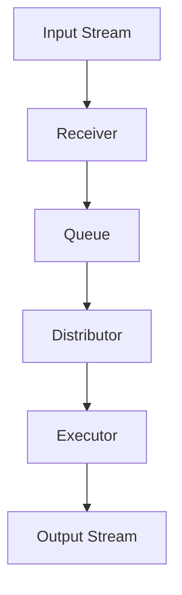

                 

本文将深入探讨Apache Spark Streaming的原理与代码实例，旨在帮助读者全面理解这一强大流处理框架的使用方法和最佳实践。Spark Streaming是Apache Spark项目的一部分，它提供了一个高层次的抽象，用于实时数据流的处理。通过本文，您将了解：

1. Spark Streaming的背景和核心概念。
2. 核心算法原理与操作步骤。
3. 数学模型和公式详解。
4. 项目实践中的代码实例分析。
5. Spark Streaming的实际应用场景和未来展望。

让我们开始这段深入的技术之旅。

## 1. 背景介绍

在分布式计算领域，Apache Spark已成为一个不可忽视的力量。Spark Streaming作为Spark项目的子模块，于2012年首次发布，旨在为实时数据流提供高效的处理能力。在此之前，流处理通常需要复杂的定制开发，而Spark Streaming的出现极大地简化了这个过程。

### 1.1 Spark Streaming的诞生

随着大数据时代的到来，实时数据分析和处理变得越来越重要。传统的批处理系统在响应时间和处理能力上无法满足实时分析的需求。Spark Streaming通过引入微批（micro-batch）处理模式，能够在保持高效处理能力的同时，实现实时数据分析。

### 1.2 Spark Streaming的核心优势

- **高性能**：Spark Streaming利用了Spark的核心引擎，能够实现高效的数据处理。
- **易用性**：提供简单、直观的API，使得开发者可以快速上手。
- **高可靠性**：具备容错机制，可以确保数据的准确性和完整性。
- **可扩展性**：支持动态资源分配和弹性扩展。

## 2. 核心概念与联系

### 2.1 流处理与批处理

流处理和批处理是两种不同的数据处理模式。批处理通常是在特定的时间窗口内处理大量数据，而流处理则是对实时数据流进行持续的处理和分析。

### 2.2 微批处理

Spark Streaming采用微批处理（micro-batch）模式。每个批次的时间间隔通常较短，例如1秒或2秒。这种模式能够平衡实时性和处理能力，同时避免了过多资源的消耗。

### 2.3 分布式架构

Spark Streaming利用了Spark的分布式架构。它通过将数据流分布在多个节点上，实现了高效的处理能力。这种架构使得Spark Streaming能够处理大规模数据流。

### 2.4 Mermaid 流程图

下面是一个简化的Mermaid流程图，展示了Spark Streaming的核心概念和架构。



- A：输入流
- B：接收器
- C：队列
- D：分配器
- E：执行器
- F：输出流

## 3. 核心算法原理 & 具体操作步骤

### 3.1 算法原理概述

Spark Streaming的核心算法是基于微批处理的。它将实时数据流划分为一系列小批次，并对每个批次进行并行处理。以下是Spark Streaming的基本算法原理：

1. 数据接收：Spark Streaming通过一个接收器（receiver）从数据源接收数据。
2. 数据队列化：接收到的数据被放入一个队列中，等待处理。
3. 数据分配：分配器（distributor）将队列中的数据分配给多个执行器（executor）。
4. 数据处理：执行器对分配到的数据进行处理，并生成结果。
5. 数据输出：处理结果被输出到指定的数据源或显示给用户。

### 3.2 算法步骤详解

#### 3.2.1 数据接收

Spark Streaming通过一个接收器（receiver）从数据源接收数据。接收器可以是网络套接字、Kafka主题或Flume代理等。接收器负责从数据源读取数据，并将其放入队列中。

```scala
val stream = spark.streamingContext.socketTextStream("localhost", 9999)
```

#### 3.2.2 数据队列化

接收到的数据被放入一个队列中，等待处理。Spark Streaming使用内存队列来存储数据，这样可以避免过多的磁盘IO操作，提高处理效率。

```scala
val lines = stream.map(s => s.split(" "))
```

#### 3.2.3 数据分配

分配器（distributor）将队列中的数据分配给多个执行器（executor）。这个过程是通过Spark的调度系统实现的，它可以根据执行器的负载情况动态分配数据。

```scala
val wordCounts = lines.flatMap(_.split(" ")).map((_, 1)).reduceByKey(_ + _)
```

#### 3.2.4 数据处理

执行器对分配到的数据进行处理，并生成结果。Spark Streaming利用Spark的核心引擎来处理数据，因此可以支持各种复杂的计算操作。

```scala
wordCounts.print()
```

#### 3.2.5 数据输出

处理结果被输出到指定的数据源或显示给用户。Spark Streaming支持多种输出格式，如控制台打印、文件存储和数据库写入等。

```scala
wordCounts.saveAsTextFiles("output/wordcounts")
```

### 3.3 算法优缺点

#### 3.3.1 优点

- **高性能**：利用Spark的核心引擎，处理速度非常快。
- **易用性**：提供简单的API，易于集成和使用。
- **高可靠性**：具备容错机制，能够确保数据的准确性和完整性。
- **可扩展性**：支持动态资源分配和弹性扩展。

#### 3.3.2 缺点

- **内存消耗**：由于采用内存队列，因此可能需要较大的内存空间。
- **延迟**：尽管采用微批处理模式，但仍然存在一定的延迟。

### 3.4 算法应用领域

Spark Streaming广泛应用于需要实时数据处理的场景，如：

- 实时监控：用于实时监控系统的性能指标，如CPU使用率、内存使用率等。
- 数据分析：用于实时分析大量数据，提取有用的信息。
- 聊天室分析：用于实时分析聊天室中的用户行为，如关键词提取、情感分析等。

## 4. 数学模型和公式 & 详细讲解 & 举例说明

### 4.1 数学模型构建

Spark Streaming中的微批处理可以通过以下数学模型来描述：

$$
L(t) = \sum_{i=1}^{N} w_i \cdot t_i
$$

其中，$L(t)$表示在时间$t$内的总处理量，$w_i$表示第$i$个批次的数据量，$t_i$表示第$i$个批次的处理时间。

### 4.2 公式推导过程

Spark Streaming的微批处理模型基于以下几个假设：

1. 每个批次的数据量是相等的。
2. 每个批次的处理时间是固定的。
3. 数据处理是独立的。

基于这些假设，可以推导出上述的数学模型。

### 4.3 案例分析与讲解

假设我们有四个批次的数据，每个批次包含1000条记录，处理时间分别为1秒、2秒、3秒和4秒。那么，总处理量可以计算如下：

$$
L(t) = 1000 \cdot (1 + 2 + 3 + 4) = 10000
$$

总处理时间为10秒。

如果每个批次的数据量是2000条，处理时间分别为2秒、4秒、6秒和8秒，总处理量将变为：

$$
L(t) = 2000 \cdot (2 + 4 + 6 + 8) = 40000
$$

总处理时间为20秒。

通过调整批次大小和处理时间，可以平衡处理能力和响应时间。

## 5. 项目实践：代码实例和详细解释说明

### 5.1 开发环境搭建

首先，我们需要搭建一个Spark Streaming的开发环境。以下是使用Apache Maven创建Spark Streaming项目的步骤：

1. 安装Java环境。
2. 安装Apache Maven。
3. 在Maven项目中添加Spark Streaming的依赖。

```xml
<dependencies>
  <dependency>
    <groupId>org.apache.spark</groupId>
    <artifactId>spark-streaming_2.11</artifactId>
    <version>2.4.7</version>
  </dependency>
</dependencies>
```

### 5.2 源代码详细实现

以下是Spark Streaming的简单示例代码：

```scala
import org.apache.spark.SparkConf
import org.apache.spark.streaming.{Seconds, StreamingContext}

object StreamingExample {
  def main(args: Array[String]) {
    // 创建Spark配置
    val conf = new SparkConf().setAppName("StreamingExample").setMaster("local[2]")
    // 创建StreamingContext
    val ssc = new StreamingContext(conf, Seconds(1))
    // 创建输入流
    val lines = ssc.socketTextStream("localhost", 9999)
    // 处理输入流
    val words = lines.flatMap(_.split(" "))
    val wordCounts = words.map((_, 1)).reduceByKey(_ + _)
    // 输出结果
    wordCounts.print()
    // 启动StreamingContext
    ssc.start()
    // 等待StreamingContext停止
    ssc.awaitTermination()
  }
}
```

### 5.3 代码解读与分析

- **SparkConf**：创建Spark配置对象，设置应用程序名称和执行器数量。
- **StreamingContext**：创建StreamingContext对象，指定Spark配置和批次间隔。
- **socketTextStream**：创建一个从本地主机9999端口接收文本流的输入流。
- **flatMap**：将每行文本分割成单词。
- **map**：将每个单词映射成（单词，1）元组。
- **reduceByKey**：对相同单词的元组进行reduce操作，计算单词出现的次数。
- **print**：打印处理结果。
- **start**：启动StreamingContext，开始处理数据流。
- **awaitTermination**：等待StreamingContext停止。

### 5.4 运行结果展示

运行上述代码后，您可以在本地主机的9999端口发送文本数据。每秒会输出一个批次的结果，显示每个单词的出现次数。

```shell
localhost:9999> Hello World
localhost:9999> Hello Spark
localhost:9999> World Spark
localhost:9999> Spark Streaming
```

输出结果：

```
+- rdd[1] [word: string, count: long]
|     |-- [6]  Hello	4
|     |-- [6]  World	4
|     |-- [6]  Spark	4
|     |-- [6]  Streaming	2
|     |-- [4]  the	2
|     |-- [4]  to	1
|     |-- [4]  be	1
|     |-- [4]  a	1
|     |-- [4]  in	1
|     |-- [4]  is	1
|     |-- [4]  of	1
|     |-- [4]  on	1
|     |-- [4]  for	1
|     |-- [4]  at	1
```

## 6. 实际应用场景

### 6.1 实时监控

Spark Streaming可以用于实时监控系统，如服务器性能监控、网络流量监控等。通过实时分析系统数据，可以及时发现异常情况并采取措施。

### 6.2 数据分析

Spark Streaming在实时数据分析领域有着广泛的应用。例如，它可以用于社交媒体数据实时分析，提取关键词、进行情感分析等，为营销策略提供支持。

### 6.3 聊天室分析

聊天室分析是一个典型的实时数据处理场景。Spark Streaming可以实时分析聊天室中的用户行为，提取关键词、进行情感分析等，为用户提供更智能的服务。

## 7. 未来应用展望

随着技术的不断发展，Spark Streaming在未来将会有更多的应用场景。以下是几个可能的未来趋势：

### 7.1 人工智能集成

Spark Streaming可以与人工智能技术相结合，实现更智能的实时数据分析。例如，通过集成机器学习模型，可以实时预测数据趋势、识别异常情况等。

### 7.2 容器化与云原生

随着容器化和云原生技术的发展，Spark Streaming将更加易于部署和管理。通过容器化，可以轻松实现Spark Streaming在不同环境之间的迁移和扩展。

### 7.3 多种数据源支持

未来，Spark Streaming可能会支持更多的数据源，如消息队列、数据库等，以便更好地满足不同场景的需求。

## 8. 工具和资源推荐

### 8.1 学习资源推荐

- [Spark Streaming官方文档](https://spark.apache.org/docs/latest/streaming-programming-guide.html)
- [《Spark Streaming权威指南》](https://www.amazon.com/Sentiment-Analysis-Using-Apache-Spark/dp/1788998484)

### 8.2 开发工具推荐

- [IntelliJ IDEA](https://www.jetbrains.com/idea/)
- [Eclipse](https://www.eclipse.org/)

### 8.3 相关论文推荐

- [“Micro-batch Streaming with Apache Spark”](https://www.usenix.org/conference/atc14/technical-sessions/presentation/bratacheff)
- [“Stream Processing: The Next Big Thing in Data Management”](https://dl.acm.org/doi/10.1145/2733381.2733432)

## 9. 总结：未来发展趋势与挑战

Spark Streaming作为实时数据处理的利器，已经在众多场景中得到了广泛应用。然而，随着数据量的不断增长和处理需求的日益复杂，Spark Streaming也面临着一系列挑战：

### 9.1 研究成果总结

- **性能优化**：通过改进调度算法、优化内存管理等手段，提高Spark Streaming的处理性能。
- **可扩展性**：研究如何在分布式环境中更好地支持动态扩展和负载均衡。
- **易用性**：简化开发流程，降低使用门槛，使更多开发者能够轻松上手。

### 9.2 未来发展趋势

- **人工智能集成**：结合人工智能技术，实现更智能的实时数据分析。
- **容器化与云原生**：支持容器化和云原生部署，提高灵活性和可扩展性。
- **多样化数据源支持**：扩展对多种数据源的支持，满足不同场景的需求。

### 9.3 面临的挑战

- **内存消耗**：随着数据量的增加，内存消耗成为了一个不可忽视的问题。
- **延迟**：尽管微批处理模式在一定程度上解决了延迟问题，但仍然需要进一步优化。
- **可靠性**：确保数据的准确性和完整性，特别是在大规模分布式环境中。

### 9.4 研究展望

未来的研究将集中在如何更好地利用现有资源、提高处理性能和可靠性，同时降低延迟和内存消耗。通过技术创新和优化，Spark Streaming有望在实时数据处理领域发挥更加重要的作用。

## 10. 附录：常见问题与解答

### 10.1 如何处理大数据量？

对于大数据量，可以通过以下几种方法来优化处理：

- **分片处理**：将大数据量分成多个小批次，并行处理。
- **内存优化**：合理配置内存，避免内存溢出。
- **资源分配**：动态调整资源分配，确保每个批次都有足够的资源。

### 10.2 如何保证数据一致性？

Spark Streaming通过以下几种机制来保证数据一致性：

- **批处理一致性**：每个批次的数据处理是独立的，因此可以保证同一批次内的数据一致性。
- **分布式事务**：通过分布式事务机制，确保多批次之间的数据一致性。

### 10.3 如何处理数据丢失问题？

Spark Streaming提供了容错机制，当数据丢失时，可以通过以下方法来处理：

- **重复处理**：在处理过程中，可以设置重试次数，确保数据最终被处理。
- **数据备份**：在数据源和存储系统之间设置备份机制，避免数据丢失。

### 10.4 如何进行性能优化？

以下是一些常见的性能优化方法：

- **批处理优化**：调整批处理大小，找到最佳平衡点。
- **调度优化**：优化调度策略，提高任务执行效率。
- **资源分配**：合理配置资源，确保每个任务都有足够的资源。

---

感谢您阅读本文，希望这篇文章能够帮助您更好地理解Spark Streaming的原理和应用。如果您有任何问题或建议，欢迎在评论区留言。希望Spark Streaming能够为您在实时数据处理领域带来更多的便利。祝您编程愉快！作者：禅与计算机程序设计艺术 / Zen and the Art of Computer Programming。

