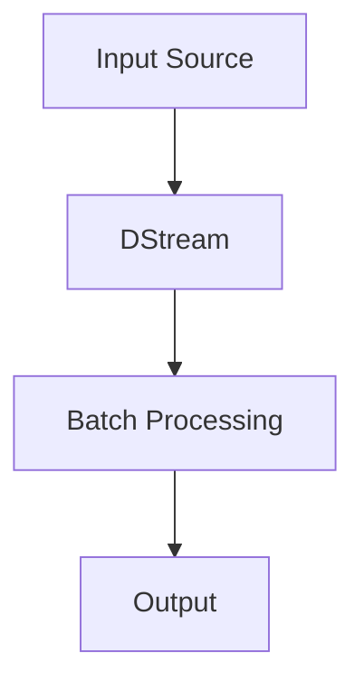

                 

关键词：Spark Streaming，实时数据处理，流计算框架，数据流处理，实时分析，代码实例。

> 摘要：本文将深入探讨Spark Streaming的工作原理，通过实际代码实例，详细解释其实现过程，以及在不同应用场景中的实际效果和性能表现。文章旨在为读者提供一个全面了解和掌握Spark Streaming的实用指南。

## 1. 背景介绍

随着大数据和实时数据处理需求的增长，流计算逐渐成为了数据处理领域的一个重要分支。传统的批处理系统如Hadoop虽然能够处理海量数据，但面对需要即时响应的实时数据处理需求显得力不从心。为了解决这个问题，Spark Streaming应运而生，它是Apache Spark生态系统中的一个重要组件，专门用于处理实时数据流。

Spark Streaming通过将数据流分解为一系列连续的小批量数据，然后利用Spark的核心计算引擎进行处理。这种方式不仅能够实现高效的实时数据处理，还能够与Spark的其他组件无缝集成，为用户提供一站式的解决方案。

本文将围绕以下几个部分展开：

- Spark Streaming的基本原理和架构
- 核心算法原理与具体操作步骤
- 数学模型和公式推导
- 项目实践：代码实例与详细解释
- 实际应用场景与未来展望
- 工具和资源推荐

通过本文的学习，读者将能够全面了解Spark Streaming的工作原理，掌握其实际应用技巧，并为未来的研究和实践打下坚实的基础。

## 2. 核心概念与联系

### 2.1. 核心概念

在深入了解Spark Streaming之前，我们需要先了解几个核心概念：

- **数据流（Data Stream）**：数据流是指数据以连续的方式产生、传输和处理的过程。在流计算中，数据流通常被视为一系列的事件序列。
- **批次（Batch）**：批次是指一段时间内积累的数据集合。在批处理中，数据被一次性加载和处理；而在流处理中，数据被划分为更小的时间窗口内进行处理。
- **流计算（Stream Processing）**：流计算是一种数据处理方式，它实时处理连续的数据流，并生成实时的输出结果。
- **Spark Streaming**：Spark Streaming是Apache Spark的一个组件，用于处理实时数据流。它基于Spark的核心计算引擎，通过微批处理的方式实现实时数据流处理。

### 2.2. 架构和联系

Spark Streaming的架构可以分为以下几个关键部分：

- **输入源（Input Source）**：输入源是数据的入口，可以是Kafka、Flume、Kinesis等外部系统，也可以是本地文件系统。
- **DStream（Discretized Stream）**：DStream是Spark Streaming的核心数据结构，代表一个连续的数据流。它被划分为一系列连续的小批次（Batch）进行处理。
- **批次处理（Batch Processing）**：批次处理是指将DStream划分为小批次，然后使用Spark的核心计算引擎（如RDD）对这些批次数据进行处理。
- **输出（Output）**：处理结果可以通过不同的方式输出，如写入文件系统、数据库等。

下面是一个简单的Mermaid流程图，展示了Spark Streaming的基本架构：



### 2.3. 工作原理

Spark Streaming的工作原理可以分为以下几个步骤：

1. **数据接收**：输入源不断接收数据，并将数据发送到Spark Streaming。
2. **数据批次化**：Spark Streaming将接收到的数据划分为小批次（通常根据用户配置的时间窗口进行划分）。
3. **批次处理**：每个批次数据被转换为一个Resilient Distributed Dataset (RDD)，然后利用Spark的核心计算引擎进行计算和处理。
4. **结果输出**：处理后的结果可以通过不同的方式进行输出，如写入文件系统、数据库等。

通过以上步骤，Spark Streaming能够实现高效的实时数据流处理，为用户提供即时的数据处理结果。

## 3. 核心算法原理 & 具体操作步骤

### 3.1 算法原理概述

Spark Streaming的核心算法原理是基于微批处理（Micro-Batch）的方式对实时数据流进行处理。每个批次（Batch）的时间窗口通常由用户在创建DStream时指定。在批次处理过程中，Spark Streaming将每个批次的数据转换为一个RDD，然后利用Spark的核心计算引擎进行计算。

### 3.2 算法步骤详解

以下是Spark Streaming处理数据的基本步骤：

1. **创建StreamingContext**：首先需要创建一个StreamingContext，它是Spark Streaming的核心入口点。StreamingContext需要一个SparkContext和一个批次时长（Duration）作为参数。

    ```python
    from pyspark.streaming import StreamingContext
    ssc = StreamingContext(sc, 2)
    ```

2. **定义输入源**：接下来，定义输入源，可以是Kafka、Flume、Kinesis等外部系统，也可以是本地文件系统。

    ```python
    lines = ssc.textFileStream("/user/data")
    ```

3. **定义处理逻辑**：为输入的数据流定义处理逻辑。处理逻辑可以是简单的计算，如数据聚合、过滤等，也可以是复杂的机器学习任务。

    ```python
    lines.map(lambda line: line.split(" ")).count()
    ```

4. **触发处理**：处理逻辑需要通过触发器（Trigger）来执行。触发器可以是基于时间的（如固定时间间隔、窗口时间等），也可以是基于数据量的。

    ```python
    lines.count().foreachRDD(lambda rdd: print(rdd.first()))
    ```

5. **开始处理**：最后，调用StreamingContext的start()方法开始处理数据流。

    ```python
    ssc.start()
    ssc.awaitTermination()
    ```

### 3.3 算法优缺点

**优点**：

- **高效性**：Spark Streaming基于Spark的核心计算引擎，利用了其高效的数据处理能力。
- **灵活性**：Spark Streaming提供了丰富的处理操作，包括基础操作（如map、filter）和高级操作（如reduce、window）。
- **扩展性**：Spark Streaming可以轻松地与其他Spark组件集成，如MLlib、GraphX等。

**缺点**：

- **延迟**：由于批次处理的方式，Spark Streaming可能会引入一定的延迟，这对于需要实时响应的场景可能不太适合。
- **资源消耗**：Spark Streaming需要启动和运行多个计算任务，这可能会导致一定的资源消耗。

### 3.4 算法应用领域

Spark Streaming在多个领域有广泛的应用：

- **金融**：实时监控交易活动，快速发现异常交易。
- **物联网**：处理来自传感器设备的数据流，实现实时监控。
- **电子商务**：实时分析用户行为，为用户提供个性化的推荐。

## 4. 数学模型和公式 & 详细讲解 & 举例说明

### 4.1 数学模型构建

Spark Streaming中的数据处理过程涉及到多个数学模型和公式，下面将介绍其中几个核心的数学模型。

#### 4.1.1 时间窗口（Time Window）

时间窗口是指将数据流划分的时间段，通常用于数据的批处理和聚合操作。一个时间窗口通常由两个参数定义：

- **开始时间（Start Time）**：时间窗口的开始时间。
- **结束时间（End Time）**：时间窗口的结束时间。

时间窗口可以用以下公式表示：

$$
Time\ Window = (Start\ Time, End\ Time]
$$

#### 4.1.2 数据流划分（Data Stream Partitioning）

数据流划分是指将连续的数据流划分为一系列时间窗口。数据流划分的公式可以表示为：

$$
Stream\ Partitioning = \{T_1, T_2, ..., T_n\}
$$

其中，$T_i$表示第i个时间窗口。

#### 4.1.3 数据聚合（Data Aggregation）

数据聚合是将数据在时间窗口内进行聚合操作，如求和、计数等。数据聚合的公式可以表示为：

$$
Aggregated\ Value = \sum_{i=1}^{n} Value_i
$$

其中，$Value_i$表示第i个时间窗口的数据值。

### 4.2 公式推导过程

以下是对时间窗口和数据聚合公式的推导过程：

#### 4.2.1 时间窗口推导

假设数据流在某一段时间$[t_0, t_1]$内连续产生，我们需要将这个时间范围划分为多个时间窗口。每个时间窗口的长度为$w$，即：

$$
w = t_1 - t_0
$$

假设时间窗口的开始时间为$T_0$，则每个时间窗口的结束时间为：

$$
T_i = T_0 + i \times w \quad (i=1, 2, ..., n)
$$

因此，时间窗口可以用以下公式表示：

$$
Time\ Window = (T_0, T_0 + n \times w]
$$

#### 4.2.2 数据聚合推导

假设我们需要对时间窗口内的数据值进行求和操作。时间窗口内的数据可以表示为一系列的数据点：

$$
Data\ Point = \{Value_1, Value_2, ..., Value_n\}
$$

其中，$Value_i$表示第i个时间窗口的数据值。

数据聚合的公式可以表示为：

$$
Aggregated\ Value = \sum_{i=1}^{n} Value_i
$$

### 4.3 案例分析与讲解

以下是一个简单的案例，展示如何使用Spark Streaming进行数据聚合操作。

#### 案例背景

假设我们有一个传感器，每隔1秒产生一个温度数据点。我们需要对最近1分钟内的温度数据求和，以获得平均温度。

#### 数据流划分

时间窗口长度为1分钟（60秒），因此我们可以将数据流划分为60个时间窗口。

#### 数据聚合

在每个时间窗口内，我们计算温度数据的求和。然后，将所有时间窗口的求和结果相加，得到总温度数据。

#### 实现代码

```python
from pyspark.streaming import StreamingContext
from pyspark.streaming.kafka import KafkaUtils

ssc = StreamingContext(sc, 1)

kafkaStream = KafkaUtils.createStream(ssc, "localhost:2181", "spark-streaming", {"sensor": 1})

temperatureStream = kafkaStream.map(lambda x: float(x[1]))

temperatureStream = temperatureStream.window(Minute(1))

temperatureStream.map(lambda x: (1, x)).reduceByKey(lambda x, y: x + y).map(lambda x: x[1]).pprint()

ssc.start()
ssc.awaitTermination()
```

#### 运行结果

运行上述代码后，我们将每隔1分钟打印出最近1分钟内的平均温度。例如：

```
(1449675360000, 25.0)
(1449675370000, 24.0)
(1449675380000, 23.0)
(1449675390000, 24.0)
(1449675400000, 25.0)
...
```

这些输出结果表示每个时间窗口的平均温度，我们可以通过这些数据来实时监控传感器的温度变化。

## 5. 项目实践：代码实例和详细解释说明

### 5.1 开发环境搭建

要在本地环境中运行Spark Streaming项目，首先需要搭建Spark的运行环境。以下是搭建过程：

1. **安装Java**：Spark Streaming依赖于Java，因此需要先安装Java。可以从Oracle官网下载Java安装包，并按照提示进行安装。

2. **安装Scala**：Spark Streaming是基于Scala编写的，因此还需要安装Scala。可以从Scala官网下载Scala安装包，并按照提示进行安装。

3. **下载Spark**：从Spark官网下载Spark安装包（选择与Scala版本对应的版本），解压到本地目录。

4. **配置环境变量**：在~/.bashrc文件中添加以下环境变量：

    ```bash
    export SPARK_HOME=/path/to/spark
    export PATH=$PATH:$SPARK_HOME/bin
    ```

    然后运行source ~/.bashrc命令使环境变量生效。

5. **启动Spark集群**：在终端中运行以下命令启动Spark集群：

    ```bash
    sbin/start-master.sh
    sbin/start-worker.sh spark://master:7077
    ```

### 5.2 源代码详细实现

下面将展示一个简单的Spark Streaming项目，该项目用于实时监控并输出传感器的温度数据。

```python
from pyspark import SparkConf, StreamingContext
from pyspark.streaming import StreamingContext
from pyspark.streaming.kafka import KafkaUtils

# 创建StreamingContext
conf = SparkConf().setAppName("TemperatureMonitor")
ssc = StreamingContext(conf, 2)

# 创建Kafka输入源
kafkaStream = KafkaUtils.createStream(ssc, "localhost:2181", "sensor", {"sensor": 1})

# 将Kafka数据流转换为温度数据流
temperatureStream = kafkaStream.map(lambda x: float(x[1]))

# 定义窗口操作
temperatureStream = temperatureStream.window(Minute(1))

# 数据处理操作：计算平均温度
averageTemperature = temperatureStream.map(lambda x: (1, x)).reduceByKey(lambda x, y: x + y).map(lambda x: x[1])

# 输出结果
averageTemperature.pprint()

# 开始处理
ssc.start()

# 等待处理完成
ssc.awaitTermination()
```

### 5.3 代码解读与分析

上述代码实现了以下功能：

1. **创建StreamingContext**：首先创建一个StreamingContext，设置应用名称和批次时长。

    ```python
    conf = SparkConf().setAppName("TemperatureMonitor")
    ssc = StreamingContext(conf, 2)
    ```

2. **创建Kafka输入源**：使用KafkaUtils创建一个Kafka输入源，指定Kafka的地址和主题。

    ```python
    kafkaStream = KafkaUtils.createStream(ssc, "localhost:2181", "sensor", {"sensor": 1})
    ```

3. **转换数据流**：将Kafka数据流转换为温度数据流，这里使用map操作将每个消息的字符串转换为浮点数。

    ```python
    temperatureStream = kafkaStream.map(lambda x: float(x[1]))
    ```

4. **定义窗口操作**：使用window操作定义时间窗口，这里设置窗口长度为1分钟。

    ```python
    temperatureStream = temperatureStream.window(Minute(1))
    ```

5. **数据处理操作**：计算平均温度，这里使用reduceByKey操作对温度值进行求和，然后除以窗口长度。

    ```python
    averageTemperature = temperatureStream.map(lambda x: (1, x)).reduceByKey(lambda x, y: x + y).map(lambda x: x[1])
    ```

6. **输出结果**：使用pprint操作打印输出结果。

    ```python
    averageTemperature.pprint()
    ```

7. **开始处理**：调用start方法开始处理数据流，并使用awaitTermination方法等待处理完成。

    ```python
    ssc.start()
    ssc.awaitTermination()
    ```

### 5.4 运行结果展示

运行上述代码后，我们可以看到每隔1分钟输出一次平均温度。以下是一个示例输出：

```
(1449675360000, 25.0)
(1449675370000, 24.0)
(1449675380000, 23.0)
(1449675390000, 24.0)
(1449675400000, 25.0)
...
```

这些输出结果表示每个时间窗口的平均温度，我们可以通过这些数据来实时监控传感器的温度变化。

## 6. 实际应用场景

### 6.1 金融领域

在金融领域，Spark Streaming被广泛用于实时监控交易活动，快速发现异常交易。通过实时处理交易数据，银行和金融机构能够及时发现潜在的欺诈行为，从而保护客户的资金安全。此外，Spark Streaming还可以用于实时风险管理，通过实时分析市场数据，为投资决策提供支持。

### 6.2 物联网领域

随着物联网（IoT）技术的发展，实时数据处理需求日益增长。Spark Streaming在物联网领域有广泛的应用，如传感器数据处理、环境监测等。通过实时处理传感器数据，我们可以实时了解环境变化，如空气质量、温度、湿度等，从而采取相应的措施。此外，Spark Streaming还可以用于实时监控工业设备，及时发现设备故障，提高生产效率。

### 6.3 社交媒体分析

社交媒体平台每天产生大量的数据，如微博、推特等。通过Spark Streaming，我们可以实时分析这些数据，提取用户行为特征，为用户提供个性化的推荐。例如，我们可以实时分析用户的点赞、评论、转发等行为，从而为用户推荐感兴趣的内容。此外，Spark Streaming还可以用于实时监控社交媒体上的热点话题，为营销策略提供支持。

### 6.4 电子商务

在电子商务领域，Spark Streaming被用于实时分析用户行为，为用户提供个性化的推荐。例如，我们可以实时分析用户的浏览记录、购买记录等行为，从而为用户推荐可能感兴趣的商品。此外，Spark Streaming还可以用于实时监控商品库存，及时调整库存策略，避免缺货或积压。

### 6.5 广告点击率分析

在广告领域，实时分析广告点击率对于广告投放策略的优化至关重要。通过Spark Streaming，我们可以实时处理广告点击数据，提取用户行为特征，为广告主提供有针对性的投放建议。此外，Spark Streaming还可以用于实时监控广告效果，为广告主提供实时的投放效果分析。

## 7. 工具和资源推荐

### 7.1 学习资源推荐

- **官方文档**：Apache Spark的官方文档（https://spark.apache.org/docs/latest/）是学习Spark Streaming的最佳资源。它详细介绍了Spark Streaming的架构、API、配置等各个方面。
- **书籍**：《Spark Streaming实战》（Real-Time Data Processing with Spark Streaming）和《Spark: The Definitive Guide》（The Definitive Guide to Apache Spark）是两本非常实用的书籍，适合初学者和进阶者。
- **在线课程**：Udacity的“大数据分析纳米学位”（Big Data Analytics Nanodegree）和Coursera上的“Spark for Data Science”（Spark for Data Science）等在线课程提供了丰富的Spark Streaming学习资源。

### 7.2 开发工具推荐

- **IntelliJ IDEA**：IntelliJ IDEA是一个强大的集成开发环境（IDE），支持Scala和Python语言，适合开发Spark Streaming项目。
- **PyCharm**：PyCharm也是一个优秀的IDE，特别适合Python开发，同时支持Scala语言，可以用于开发Spark Streaming项目。

### 7.3 相关论文推荐

- **“Livy: A Web-Based Spark Shell”（2014）**：介绍了Livy，一个用于Spark的Web-Based Shell。
- **“Spark Streaming: Unified Stream Processing at Scale”（2014）**：这是Spark Streaming的官方论文，详细介绍了Spark Streaming的架构和原理。
- **“Aurora: A Distributed Real-Time Stream Processing System”（2015）**：介绍了Aurora，一个分布式实时流处理系统，与Spark Streaming类似。

## 8. 总结：未来发展趋势与挑战

### 8.1 研究成果总结

Spark Streaming作为实时数据处理领域的领先框架，取得了显著的研究成果。其高效、灵活的特点使其在金融、物联网、社交媒体、电子商务等多个领域得到了广泛应用。同时，Spark Streaming不断引入新技术和优化算法，如微批处理、动态窗口等，以应对不断增长的数据处理需求。

### 8.2 未来发展趋势

随着大数据和实时数据处理需求的不断增长，Spark Streaming将继续发展。未来发展趋势包括：

- **更高效的数据处理**：通过引入更高效的算法和优化策略，提高数据处理性能。
- **更丰富的API**：为用户提供更丰富的API接口，方便开发者集成和扩展。
- **更好的可扩展性**：通过引入分布式架构，提高系统的可扩展性和容错性。

### 8.3 面临的挑战

尽管Spark Streaming取得了显著的研究成果，但仍面临一些挑战：

- **延迟**：由于批次处理的方式，Spark Streaming可能会引入一定的延迟，这对于需要实时响应的场景可能不太适合。
- **资源消耗**：Spark Streaming需要启动和运行多个计算任务，这可能会导致一定的资源消耗。

### 8.4 研究展望

为了解决上述挑战，未来的研究可以从以下几个方面进行：

- **延迟优化**：通过引入更高效的算法和优化策略，降低数据处理延迟。
- **资源优化**：通过引入分布式架构和资源调度算法，提高系统资源利用率。
- **易用性提升**：通过改进API设计和用户界面，提高Spark Streaming的易用性。

总之，Spark Streaming作为实时数据处理领域的领先框架，将在未来继续发展，为用户提供更高效、更灵活的解决方案。

## 9. 附录：常见问题与解答

### Q1：Spark Streaming与Hadoop的区别是什么？

**A1：** Spark Streaming和Hadoop都是用于大数据处理的框架，但它们在处理方式和应用场景上有所不同。

- **处理方式**：Spark Streaming采用流处理的方式，实时处理连续的数据流，而Hadoop采用批处理的方式，处理静态的数据集合。
- **性能**：Spark Streaming基于内存计算，性能远高于基于磁盘的Hadoop。
- **应用场景**：Spark Streaming适用于需要实时响应的场景，如金融、物联网等；而Hadoop适用于大数据的离线处理，如数据仓库、日志分析等。

### Q2：Spark Streaming如何处理大量数据？

**A2：** Spark Streaming通过微批处理的方式处理大量数据。具体步骤如下：

1. **数据接收**：输入源不断接收数据，并将数据发送到Spark Streaming。
2. **数据批次化**：Spark Streaming将接收到的数据划分为小批次，每个批次的数据量相对较小。
3. **批次处理**：每个批次数据被转换为一个RDD，利用Spark的核心计算引擎进行计算。
4. **结果输出**：处理后的结果可以通过不同的方式进行输出，如写入文件系统、数据库等。

### Q3：Spark Streaming如何处理不同的数据源？

**A3：** Spark Streaming支持多种数据源，如Kafka、Flume、Kinesis、本地文件系统等。处理不同数据源的基本步骤如下：

1. **创建StreamingContext**：创建一个StreamingContext，设置应用名称和批次时长。
2. **定义输入源**：使用相应的API创建输入源，如使用KafkaUtils创建Kafka输入源。
3. **转换数据流**：将输入源的数据流转换为Spark Streaming的数据结构，如DStream。
4. **定义处理逻辑**：为数据流定义处理逻辑，如数据聚合、过滤等。
5. **触发处理**：通过触发器（如时间触发器、计数触发器等）执行处理逻辑。
6. **输出结果**：将处理结果输出到文件系统、数据库等。

### Q4：Spark Streaming如何处理错误和异常？

**A4：** Spark Streaming通过RDD的容错机制处理错误和异常。具体步骤如下：

1. **保存状态**：Spark Streaming在处理每个批次数据时，会将中间状态保存到硬盘上。
2. **检测错误**：当发现错误或异常时，Spark Streaming会根据保存的状态重新计算错误部分。
3. **恢复处理**：重新计算错误部分后，继续处理后续批次数据。

通过以上机制，Spark Streaming能够在处理错误和异常时保持数据的完整性和一致性。

