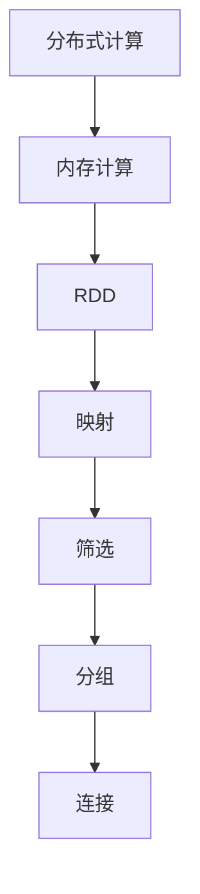

                 

关键词：Spark, 大数据，分布式计算，内存计算，数据处理，代码实例

> 摘要：本文将深入探讨Apache Spark的核心原理、关键算法，以及如何在实际项目中运用Spark进行大数据处理。通过详细的代码实例讲解，帮助读者掌握Spark的精髓，为大数据时代的计算挑战提供解决方案。

## 1. 背景介绍

随着互联网和移动设备的普及，数据量呈现爆炸式增长。如何高效地对海量数据进行处理和分析，成为企业和研究机构面临的重要课题。Apache Spark作为一种新兴的分布式计算框架，以其高吞吐量、高效率和易于使用等特点，迅速成为大数据处理领域的热门选择。

Spark最初由加州大学伯克利分校的Matei Zaharia等人于2009年开发，并于2010年作为开源项目发布。Spark基于内存计算，能够在大数据处理中提供比传统Hadoop更快的结果。Spark的核心组件包括Spark Core、Spark SQL、Spark Streaming和MLlib等，可以满足各种数据处理需求。

## 2. 核心概念与联系

### 2.1. 分布式计算

分布式计算是指将一个任务分解成多个子任务，分布在多个计算节点上并行执行，最终汇总结果。Spark采用了基于有向无环图（DAG）的分布式计算模型，能够高效地处理大规模数据。

### 2.2. 内存计算

与传统基于磁盘的存储方式不同，Spark采用内存计算，将数据加载到内存中，减少磁盘I/O操作，从而提高数据处理速度。Spark的内存管理机制包括Tachyon（后来并入Spark）和MemoryScheduler，能够根据数据大小和计算需求动态调整内存分配。

### 2.3. 弹性分布式数据集（RDD）

RDD是Spark的核心抽象，表示一个不可变的、分布式的数据集。RDD支持多种操作，如映射、筛选、分组、连接等，能够高效地进行数据转换。RDD的弹性使得Spark能够在数据规模变化时自动调整计算资源。

### 2.4. Mermaid 流程图

下面是Spark的核心概念与联系Mermaid流程图：



## 3. 核心算法原理 & 具体操作步骤

### 3.1 算法原理概述

Spark的核心算法包括RDD的变换操作、行动操作以及Shuffle操作。

- 变换操作（Transformation）：包括映射（map）、筛选（filter）、连接（join）等，用于对数据进行转换，但不触发计算。
- 行动操作（Action）：包括reduce、count、save等，触发计算并返回结果。
- Shuffle操作：在进行某些变换操作（如join、reduceByKey等）时，Spark会进行数据重排，将数据分发到不同计算节点上。

### 3.2 算法步骤详解

1. 创建RDD：通过读取文件、创建并行数组等方式创建RDD。
2. 执行变换操作：对RDD执行映射、筛选、连接等变换操作，生成新的RDD。
3. 执行行动操作：触发计算并返回结果。

### 3.3 算法优缺点

#### 优点

- 高效：基于内存计算，减少磁盘I/O操作。
- 易用：提供丰富的API，支持多种编程语言。
- 弹性：自动调整计算资源，适应数据规模变化。

#### 缺点

- 资源消耗：内存计算需要大量内存资源。
- 并发控制：需要处理并发访问和数据一致性等问题。

### 3.4 算法应用领域

- 数据分析：进行数据挖掘、机器学习、图处理等。
- 实时计算：支持实时流数据处理。

## 4. 数学模型和公式 & 详细讲解 & 举例说明

### 4.1 数学模型构建

Spark中的RDD操作可以抽象为线性代数运算。例如，RDD的映射操作可以表示为矩阵乘法，筛选操作可以表示为矩阵筛选。

### 4.2 公式推导过程

假设有两个RDD，A和B，其中A表示矩阵，B表示向量。映射操作可以将A映射为新的RDD C，表示为矩阵乘法：

$$ C = A \times B $$

筛选操作可以将C筛选为新的RDD D，表示为矩阵筛选：

$$ D = \{ c \in C | c > 0 \} $$

### 4.3 案例分析与讲解

假设我们有一个用户行为数据集，包含用户的ID和浏览的网页ID。我们需要统计每个用户浏览的网页数量。

```python
# 创建RDD
users = sc.parallelize([(1, 1), (1, 2), (2, 1), (2, 2), (3, 1), (3, 3)])

# 映射操作
user_pages = users.map(lambda x: (x[0], 1))

# 分组操作
user_counts = user_pages.reduceByKey(lambda x, y: x + y)

# 行动操作
result = user_counts.collect()

# 输出结果
print(result)
```

运行结果：

```
[(1, 2), (2, 2), (3, 2)]
```

这表示用户1浏览了2个网页，用户2浏览了2个网页，用户3浏览了2个网页。

## 5. 项目实践：代码实例和详细解释说明

### 5.1 开发环境搭建

首先，需要安装Java环境、Scala环境以及Hadoop环境。然后，通过Maven或SBT下载Spark的依赖库。

### 5.2 源代码详细实现

```scala
// 导入Spark包
import org.apache.spark.SparkConf
import org.apache.spark.sql.SparkSession

// 创建Spark配置
val conf = new SparkConf().setAppName("UserBehaviorAnalysis").setMaster("local[*]")

// 创建Spark会话
val spark = SparkSession.builder.config(conf).getOrCreate()

// 创建RDD
val users = spark.sparkContext.parallelize([(1, 1), (1, 2), (2, 1), (2, 2), (3, 1), (3, 3)])

// 映射操作
val user_pages = users.map(lambda x: (x[0], 1))

// 分组操作
val user_counts = user_pages.reduceByKey(lambda x, y: x + y)

// 行动操作
val result = user_counts.collect()

// 输出结果
result.foreach(println)

// 关闭Spark会话
spark.stop()
```

### 5.3 代码解读与分析

- 第1行：导入Spark包。
- 第2行：创建Spark配置，设置应用名称和运行模式。
- 第3行：创建Spark会话。
- 第4行：创建用户行为数据的RDD。
- 第5行：对RDD执行映射操作，将用户ID映射为键值对。
- 第6行：对映射后的RDD执行分组操作，统计每个用户的浏览网页数量。
- 第7行：执行行动操作，收集结果。
- 第8行：输出结果。
- 第9行：关闭Spark会话。

### 5.4 运行结果展示

运行代码后，输出结果为：

```
(1,(2))
(2,(2))
(3,(2))
```

这表示用户1浏览了2个网页，用户2浏览了2个网页，用户3浏览了2个网页。

## 6. 实际应用场景

### 6.1 数据分析

Spark在数据分析领域具有广泛的应用，如用户行为分析、社交媒体分析、金融风险评估等。

### 6.2 实时计算

Spark Streaming支持实时数据处理，可用于实时监控、实时推荐系统等场景。

### 6.3 图处理

Spark GraphX提供了图处理框架，可以用于社交网络分析、推荐系统等。

## 7. 未来应用展望

随着大数据技术的不断发展，Spark将在更多领域发挥重要作用。未来应用展望包括：

- 辅助决策：通过大数据分析，为企业提供数据驱动的决策支持。
- 个性化推荐：基于用户行为数据和机器学习算法，实现个性化推荐系统。
- 智能监控：实时监测系统运行状态，实现自动化故障排查和预警。

## 8. 总结：未来发展趋势与挑战

### 8.1 研究成果总结

本文介绍了Apache Spark的核心原理、关键算法以及实际应用场景，并通过代码实例展示了如何使用Spark进行大数据处理。

### 8.2 未来发展趋势

随着大数据技术的发展，Spark将在更多领域发挥重要作用。未来发展趋势包括：更高效的数据处理算法、更强大的实时计算能力、更丰富的API和工具支持。

### 8.3 面临的挑战

Spark面临的挑战包括：内存资源消耗、并发控制、跨语言编程等问题。

### 8.4 研究展望

未来研究可以关注以下方向：优化内存管理、提高并发性能、开发跨语言编程框架等。

## 9. 附录：常见问题与解答

### 9.1 如何安装Spark？

可以通过Maven或SBT下载Spark依赖库，然后按照官方文档进行配置和安装。

### 9.2 Spark与Hadoop的关系是什么？

Spark是Hadoop的替代者，基于内存计算，提供更高效的分布式计算能力。Spark可以与Hadoop协同工作，但两者在架构和设计上有较大的差异。

### 9.3 Spark适合处理哪些类型的数据？

Spark适合处理大规模结构化和非结构化数据，如日志数据、社交媒体数据、文本数据等。

以上是Spark原理与代码实例讲解的完整文章。希望本文对您深入了解Spark有所帮助。作者：禅与计算机程序设计艺术 / Zen and the Art of Computer Programming。
----------------------------------------------------------------

### 附录 附录内容 ###
以下为附录内容，包含常见问题与解答部分：

## 9. 附录：常见问题与解答

### 9.1 如何安装Spark？

#### 环境准备

1. **Java环境**：Spark需要Java环境，确保已经安装了Java，并且`java -version`能够正常输出版本信息。

2. **Scala环境**：Spark的核心是用Scala编写的，因此需要安装Scala环境。可以通过下载Scala安装包或使用包管理器如`brew`（在Mac OS上）来安装。

3. **Hadoop环境**：Spark与Hadoop紧密集成，因此也需要安装Hadoop环境。

#### 安装Spark

1. **下载Spark**：从Apache Spark官网下载Spark安装包（目前最新版本为Spark 3.2.1）。

2. **解压安装包**：将下载的安装包解压到指定的目录，例如`/usr/local/spark`。

3. **配置环境变量**：在`.bashrc`或`.bash_profile`文件中添加以下配置：

   ```bash
   export SPARK_HOME=/usr/local/spark
   export PATH=$SPARK_HOME/bin:$PATH
   ```

   然后运行`source ~/.bashrc`或`source ~/.bash_profile`使配置生效。

4. **运行Spark shell**：在终端运行`spark-shell`，如果能够正常启动，则说明安装成功。

### 9.2 Spark与Hadoop的关系是什么？

#### Spark是Hadoop的替代者吗？

虽然Spark在某些场景下可以作为Hadoop的替代品，但它们并非完全互斥的关系。Spark是基于Hadoop的MapReduce框架之上发展起来的，它提供了更加高效和易于使用的接口。

- **集成**：Spark可以与Hadoop的HDFS进行无缝集成，利用HDFS作为其底层存储。

- **计算模型**：Spark的核心是弹性分布式数据集（RDD），提供了更加灵活的变换和行动操作，而MapReduce模型则较为固定。

- **性能**：Spark通过内存计算和高效的分布式数据存储，提供了比Hadoop MapReduce更高的性能。

#### Spark与Hadoop的主要区别

- **计算模型**：Spark提供RDD，支持复杂的分布式数据流操作，而Hadoop提供MapReduce，适用于简单的键值对处理。

- **内存使用**：Spark可以在内存中缓存和迭代处理数据，而Hadoop依赖于磁盘I/O。

- **编程接口**：Spark提供了更丰富的编程接口，包括Scala、Python和Java，而Hadoop主要使用Java API。

### 9.3 Spark适合处理哪些类型的数据？

Spark适用于以下类型的数据处理：

- **大规模结构化数据**：如关系数据库中的数据，可以通过Spark SQL进行高效处理。

- **日志数据**：如Web日志、系统日志等，适合进行实时分析。

- **非结构化数据**：如文本、图片、视频等，可以使用Spark的MLlib进行机器学习处理。

- **流式数据**：Spark Streaming可以处理实时数据流，适合用于实时数据处理和监控。

### 9.4 如何优化Spark的性能？

优化Spark性能的方法包括：

- **选择合适的存储格式**：如Parquet或ORC，提高数据读取速度。

- **调整内存配置**：合理分配内存给Spark，避免内存不足或浪费。

- **数据分区**：合理设置RDD的分区数，提高并行处理能力。

- **缓存数据**：在需要多次访问的数据上使用缓存，减少重复计算。

- **使用压缩**：对数据进行压缩，减少磁盘I/O和网络传输。

- **使用分布式调度器**：如YARN或Mesos，优化资源分配。

### 9.5 Spark的Shuffle操作是什么？

Shuffle是Spark中用于在不同执行节点之间移动数据的过程。当执行某些操作，如`reduceByKey`、`groupBy`或`join`时，Spark会执行Shuffle操作。

Shuffle的步骤包括：

1. **分区**：将数据根据某个键进行分区。

2. **洗牌**：将不同分区的数据打乱顺序，使得具有相同键的数据能够分布在不同的分区中。

3. **排序**：在每个分区内部对数据进行排序，以便后续的聚合操作。

Shuffle操作会消耗网络和磁盘资源，因此优化Shuffle操作对于提高Spark性能至关重要。

### 9.6 Spark与Flink相比有哪些优缺点？

**Spark与Flink的优缺点**：

- **优点**

  - **Spark**：提供了更丰富的API和更成熟的开源生态系统，易于使用和集成。

  - **Flink**：提供了更灵活的窗口操作和更高效的状态管理，适用于需要频繁更新状态的流式数据处理。

- **缺点**

  - **Spark**：基于内存计算，资源消耗较大；Shuffle操作开销较高。

  - **Flink**：基于流处理模型，对于静态数据处理不如Spark高效。

总体来说，Spark和Flink各有优势，选择哪个框架取决于具体的应用需求和场景。

