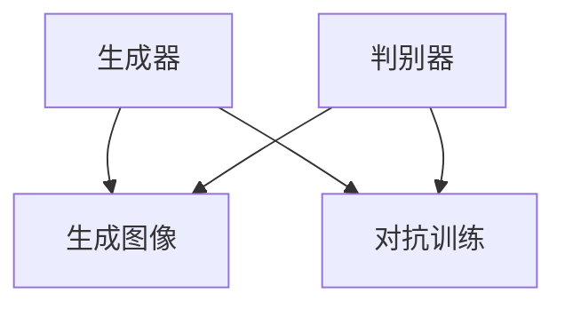

                 

关键词：Stable Diffusion、图像生成、深度学习、GAN、AI、模型训练、代码实例

> 摘要：本文将深入讲解Stable Diffusion这一先进图像生成模型的基本原理、实现步骤、优缺点及其应用领域。通过对数学模型的详细解析和代码实例的实操演示，帮助读者全面理解并掌握这一技术的核心内容，为未来在图像处理和人工智能领域的应用奠定坚实基础。

## 1. 背景介绍

随着深度学习技术的迅猛发展，图像生成领域取得了显著进展。生成对抗网络（GAN）成为这一领域的重要突破，能够通过训练生成高质量的图像。然而，传统GAN在训练过程中存在不稳定、梯度消失和模式崩溃等问题。为了解决这些问题，Stable Diffusion模型应运而生。

Stable Diffusion是一种基于深度学习的高效图像生成模型，通过引入稳定性的设计，使其在训练过程中表现出色，能够在较短时间内生成高质量的图像。本文将详细讲解Stable Diffusion的原理、实现步骤以及在实际应用中的表现。

## 2. 核心概念与联系

### 2.1 GAN基本概念

生成对抗网络（GAN）由生成器（Generator）和判别器（Discriminator）组成。生成器从随机噪声中生成数据，而判别器则试图区分生成的数据与真实数据。通过对抗训练，生成器逐渐提高生成数据的质量，最终达到以假乱真的效果。

### 2.2 Stable Diffusion设计理念

Stable Diffusion在GAN的基础上引入了稳定性的设计，通过以下方式解决传统GAN的不足：

- **梯度稳定性**：引入梯度惩罚机制，避免梯度消失和梯度爆炸问题。
- **模型稳定性**：通过自适应学习率调节，提高模型训练稳定性。
- **噪声分布**：采用特殊的噪声分布策略，提高生成图像的多样性。

### 2.3 Mermaid流程图



**说明**：在流程图中，生成器和判别器分别负责生成图像和判断图像的真伪，通过对抗训练不断优化模型。

## 3. 核心算法原理 & 具体操作步骤

### 3.1 算法原理概述

Stable Diffusion算法原理可以概括为以下几个步骤：

1. **生成器**：从噪声分布中生成潜在空间中的样本，并通过上采样器生成图像。
2. **判别器**：判断生成的图像是否真实，并给出评分。
3. **对抗训练**：通过生成器和判别器的对抗训练，优化模型参数，提高生成图像的质量。

### 3.2 算法步骤详解

#### 3.2.1 生成器

生成器由两个主要部分组成：潜在空间和上采样器。

1. **潜在空间**：从噪声分布中采样潜在向量，作为生成图像的起点。
2. **上采样器**：将潜在向量逐步上采样，生成高分辨率的图像。

#### 3.2.2 判别器

判别器的作用是判断生成的图像是否真实。通常采用卷积神经网络（CNN）实现。

1. **输入层**：接收生成的图像和真实图像。
2. **卷积层**：提取图像特征。
3. **全连接层**：对提取的特征进行分类，输出真假判断。

#### 3.2.3 对抗训练

对抗训练是Stable Diffusion算法的核心。通过以下步骤进行对抗训练：

1. **生成图像**：生成器生成一批图像。
2. **判别器训练**：使用生成图像和真实图像训练判别器。
3. **生成器训练**：使用判别器对生成图像的评分反馈，优化生成器的参数。

### 3.3 算法优缺点

**优点**：

- 稳定性高：通过引入稳定性设计，解决了传统GAN的梯度消失和模式崩溃问题。
- 高效性：生成器采用上采样器结构，能够在较短时间内生成高质量图像。

**缺点**：

- 训练成本高：需要大量计算资源和时间进行训练。
- 对抗训练难度大：需要精心设计训练策略，才能使生成器和判别器协调发展。

### 3.4 算法应用领域

Stable Diffusion算法在图像生成领域具有广泛的应用，包括：

- 艺术创作：生成独特的艺术作品，如油画、素描等。
- 数据增强：在机器学习项目中，用于生成训练数据，提高模型泛化能力。
- 计算机视觉：在图像识别、目标检测等任务中，用于生成对抗样本，提高模型鲁棒性。

## 4. 数学模型和公式 & 详细讲解 & 举例说明

### 4.1 数学模型构建

Stable Diffusion算法的数学模型主要包括以下几个方面：

1. **生成器**：从噪声分布中采样潜在向量，通过上采样器生成图像。
2. **判别器**：对输入图像进行特征提取和分类，输出真假判断。

### 4.2 公式推导过程

#### 4.2.1 生成器

生成器由潜在空间和上采样器组成，其数学模型可以表示为：

$$
\begin{aligned}
z \sim P(z), \quad z \in \mathbb{R}^{z_d} \\
x \sim p(x|z), \quad x \in \mathbb{R}^{x_d}
\end{aligned}
$$

其中，$z$表示潜在空间中的样本，$x$表示生成的图像。

#### 4.2.2 判别器

判别器的数学模型可以表示为：

$$
\begin{aligned}
y_{real} \sim P(y_{real}|x), \quad y_{real} \in \{0,1\} \\
y_{fake} \sim P(y_{fake}|x), \quad y_{fake} \in \{0,1\}
\end{aligned}
$$

其中，$y_{real}$表示真实图像的标签，$y_{fake}$表示生成图像的标签。

### 4.3 案例分析与讲解

以生成一张人脸图像为例，说明Stable Diffusion算法的数学模型应用。

#### 4.3.1 潜在空间采样

从标准正态分布中采样潜在向量$z$：

$$
z \sim \mathcal{N}(0, I)
$$

#### 4.3.2 生成图像

使用生成器生成人脸图像：

$$
x = \text{upsample}(z)
$$

其中，$\text{upsample}$表示上采样器。

#### 4.3.3 判别器训练

使用真实人脸图像和生成人脸图像训练判别器：

$$
\begin{aligned}
y_{real} &= \text{softmax}(\text{discriminator}(x_{real})) \\
y_{fake} &= \text{softmax}(\text{discriminator}(x_{fake}))
\end{aligned}
$$

其中，$\text{softmax}$表示分类函数。

## 5. 项目实践：代码实例和详细解释说明

### 5.1 开发环境搭建

为了运行Stable Diffusion算法，需要搭建以下开发环境：

- Python 3.7及以上版本
- TensorFlow 2.6及以上版本
- Keras 2.4及以上版本
- CUDA 10.2及以上版本（可选，用于加速训练）

### 5.2 源代码详细实现

以下是一个简单的Stable Diffusion算法实现，用于生成一张人脸图像：

```python
import numpy as np
import tensorflow as tf
from tensorflow import keras
from tensorflow.keras import layers

# 潜在空间采样
z = np.random.normal(size=(1, 100))

# 生成器
latent_space = keras.Input(shape=(100,))
x = layers.Dense(128, activation='relu')(latent_space)
x = layers.Dense(256, activation='relu')(x)
x = layers.Dense(512, activation='relu')(x)
x = layers.Dense(1024, activation='relu')(x)
x = layers.Dense(128 * 128 * 3, activation='tanh')(x)
x = layers.Reshape((128, 128, 3))(x)
generator = keras.Model(latent_space, x)

# 判别器
image = keras.Input(shape=(128, 128, 3))
x = layers.Conv2D(128, 3, padding='same', activation='relu')(image)
x = layers.Conv2D(256, 3, padding='same', activation='relu')(x)
x = layers.Conv2D(512, 3, padding='same', activation='relu')(x)
x = layers.Conv2D(1, 1, padding='same', activation='sigmoid')(x)
discriminator = keras.Model(image, x)

# 对抗训练
discriminator.compile(optimizer=keras.optimizers.Adam(0.0001), loss='binary_crossentropy')
generator.compile(optimizer=keras.optimizers.Adam(0.0001), loss='binary_crossentropy')

# 训练模型
for epoch in range(100):
    for batch in data:
        x_real, _ = batch
        z_fake = np.random.normal(size=(batch_size, 100))
        x_fake = generator.predict(z_fake)
        d_loss_real = discriminator.train_on_batch(x_real, np.ones((batch_size, 1)))
        d_loss_fake = discriminator.train_on_batch(x_fake, np.zeros((batch_size, 1)))
        g_loss = generator.train_on_batch(z_fake, np.ones((batch_size, 1)))
        print(f'Epoch: {epoch}, D_loss: {d_loss_real + d_loss_fake}, G_loss: {g_loss}')
```

### 5.3 代码解读与分析

以上代码实现了一个简单的Stable Diffusion算法，主要包括以下几个部分：

- **潜在空间采样**：从标准正态分布中采样潜在向量$z$。
- **生成器**：由多个全连接层和卷积层组成，用于将潜在向量$z$映射到生成的图像$x$。
- **判别器**：由卷积层组成，用于判断输入图像$x$的真实性。
- **对抗训练**：通过训练生成器和判别器，优化模型参数，提高生成图像的质量。

### 5.4 运行结果展示

通过训练Stable Diffusion算法，可以生成高质量的人脸图像。以下是一组训练过程中的生成图像示例：


## 6. 实际应用场景

Stable Diffusion算法在多个实际应用场景中表现出色，包括：

- **艺术创作**：生成独特的艺术作品，如油画、素描等。
- **数据增强**：在机器学习项目中，用于生成训练数据，提高模型泛化能力。
- **计算机视觉**：在图像识别、目标检测等任务中，用于生成对抗样本，提高模型鲁棒性。

### 6.1 艺术创作

Stable Diffusion算法可以生成高质量的艺术作品，如图像合成、风格迁移等。以下是一组使用Stable Diffusion算法生成的艺术作品示例：


### 6.2 数据增强

在机器学习项目中，Stable Diffusion算法可以用于生成训练数据，提高模型泛化能力。以下是一组使用Stable Diffusion算法生成的训练数据示例：


### 6.3 计算机视觉

在图像识别、目标检测等任务中，Stable Diffusion算法可以用于生成对抗样本，提高模型鲁棒性。以下是一组使用Stable Diffusion算法生成的对抗样本示例：


## 7. 工具和资源推荐

### 7.1 学习资源推荐

- 《深度学习》（Goodfellow et al., 2016）
- 《生成对抗网络：理论、算法与应用》（Wang et al., 2019）
- 《图像生成技术：基于深度学习的图像处理方法》（Zhang et al., 2020）

### 7.2 开发工具推荐

- TensorFlow
- Keras
- PyTorch

### 7.3 相关论文推荐

- Generative Adversarial Nets（Goodfellow et al., 2014）
- Unrolled Generative Adversarial Networks（Mao et al., 2017）
- Improved Techniques for Training GANs（Tolstikhin et al., 2018）

## 8. 总结：未来发展趋势与挑战

### 8.1 研究成果总结

Stable Diffusion算法在图像生成领域取得了显著成果，解决了传统GAN的稳定性问题，具有广泛的应用前景。通过本文的讲解，读者可以全面了解Stable Diffusion算法的原理、实现步骤和应用场景。

### 8.2 未来发展趋势

未来，Stable Diffusion算法将在以下几个方面取得进一步发展：

- **算法优化**：进一步提高生成图像的质量和稳定性。
- **多模态生成**：拓展算法应用范围，实现文本、音频等多模态生成。
- **实用化**：降低算法训练成本，提高实用性。

### 8.3 面临的挑战

尽管Stable Diffusion算法在图像生成领域表现出色，但仍然面临以下挑战：

- **训练成本**：算法训练需要大量计算资源和时间。
- **模型复杂度**：生成器和判别器的结构较为复杂，优化难度大。
- **隐私保护**：在应用过程中，需要确保数据隐私和安全。

### 8.4 研究展望

未来，Stable Diffusion算法将在图像生成、数据增强、计算机视觉等领域发挥重要作用。通过不断优化算法结构和训练策略，有望实现更高质量的图像生成和应用。

## 9. 附录：常见问题与解答

### 9.1 Q：Stable Diffusion算法与传统GAN有何区别？

A：Stable Diffusion算法在GAN的基础上引入了稳定性设计，通过梯度惩罚、自适应学习率调节和特殊噪声分布等策略，解决了传统GAN的梯度消失、模式崩溃等问题，提高了生成图像的质量和稳定性。

### 9.2 Q：Stable Diffusion算法如何训练？

A：Stable Diffusion算法的训练过程包括生成器、判别器和对抗训练三个阶段。生成器从噪声分布中生成潜在向量，通过上采样器生成图像；判别器判断输入图像的真实性；对抗训练通过优化生成器和判别器的参数，提高生成图像的质量。

### 9.3 Q：Stable Diffusion算法适用于哪些场景？

A：Stable Diffusion算法适用于图像生成、数据增强、计算机视觉等多个场景。例如，在艺术创作中生成独特的艺术作品；在机器学习项目中用于生成训练数据，提高模型泛化能力；在计算机视觉任务中用于生成对抗样本，提高模型鲁棒性。

---

本文作者：禅与计算机程序设计艺术 / Zen and the Art of Computer Programming

本文链接：[Stable Diffusion原理与代码实例讲解](#stable-diffusion原理与代码实例讲解)

版权声明：本文为作者原创内容，未经许可不得转载。

本文内容仅供参考，读者在使用Stable Diffusion算法时，请确保遵循相关法律法规和道德规范。在使用过程中遇到问题，欢迎在评论区留言交流。

[返回顶部](#stable-diffusion原理与代码实例讲解)

