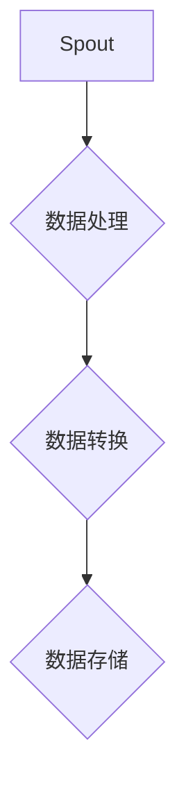

                 

关键词：Storm, Bolt, 实时数据处理，分布式系统，Apache Storm

> 摘要：本文将深入探讨Apache Storm中Bolt的核心原理和实现细节，通过代码实例展示如何在分布式系统中高效处理实时数据流。文章旨在为读者提供一个全面的技术指南，帮助理解并掌握Storm的基本架构和核心算法。

## 1. 背景介绍

Apache Storm是一款分布式实时计算系统，旨在提供对复杂实时数据的快速和可靠的处理能力。作为一种分布式计算框架，Storm可以处理大量的数据，并且能够保证数据的精确性和一致性，这使得它在处理实时数据流方面具有明显的优势。

在Storm中，Bolt是一个核心的概念，用于执行特定类型的计算操作。Bolt不仅承担了数据处理的主要工作，还负责将数据流传递给其他Bolt，形成复杂的处理逻辑。本文将围绕Bolt的原理和实现进行详细讲解。

## 2. 核心概念与联系

在深入探讨Bolt之前，我们需要了解Storm的基本架构。Storm的主要组成部分包括Spout、Bolt和Topology。Spout负责生成数据流，Bolt则负责处理和转换数据，而Topology则是Bolt和Spout之间的连接，形成了数据处理的全流程。

下面是一个简化的Mermaid流程图，用于展示Bolt在Topology中的位置和作用：



### 2.1 Bolt的定义和功能

Bolt是Storm中的一个组件，用于执行特定的计算逻辑。Bolt可以执行如下功能：

- 数据处理：对输入数据进行操作，如聚合、过滤等。
- 数据转换：将一种数据格式转换为另一种数据格式。
- 聚合：将多个数据点合并成一个数据点。
- 分发：将数据流分发到多个Bolt实例上。

### 2.2 Bolt的架构

Bolt的内部架构主要由以下几个部分组成：

- Input: Bolt的输入部分，用于接收来自Spout或上游Bolt的数据。
- Output: Bolt的输出部分，用于将处理后的数据发送到下游Bolt或外部系统。
- Executor: Bolt的执行部分，负责执行具体的计算逻辑。

## 3. 核心算法原理 & 具体操作步骤

### 3.1 算法原理概述

Bolt的核心算法原理是基于分布式计算模型，通过将数据流分解成多个任务，并在分布式系统中并行执行这些任务来实现高效的实时数据处理。以下是Bolt处理数据流的基本步骤：

1. 接收输入数据：Bolt从上游组件（Spout或其他Bolt）接收数据。
2. 处理数据：根据定义的计算逻辑对数据进行操作。
3. 发送输出数据：将处理后的数据发送到下游Bolt或外部系统。
4. 记录状态：在处理过程中，Bolt需要记录状态，以确保数据的一致性和准确性。

### 3.2 算法步骤详解

以下是Bolt处理数据流的详细步骤：

1. **初始化**：当Bolt启动时，它会初始化内部的数据结构和状态。
2. **接收数据**：Bolt通过一个或多个输入流接收数据。每个输入流可以包含来自不同来源的数据。
3. **处理数据**：根据预定义的计算逻辑，对输入数据进行处理。这可能包括数据转换、聚合、过滤等操作。
4. **发送数据**：将处理后的数据发送到输出流。输出流可以连接到其他Bolt或外部系统。
5. **状态记录**：在处理过程中，Bolt需要记录关键状态信息，以便在系统重启时恢复状态。
6. **关闭**：当Bolt不再需要处理数据时，它会关闭并释放资源。

### 3.3 算法优缺点

**优点**：

- **高效性**：Bolt支持并行处理，可以充分利用分布式系统的计算资源。
- **灵活性**：Bolt可以根据需求灵活定义计算逻辑。
- **容错性**：Bolt可以在系统出现故障时自动恢复。

**缺点**：

- **复杂度**：实现一个高效的Bolt需要深入的分布式系统和编程知识。
- **性能瓶颈**：在某些情况下，Bolt的处理速度可能会成为系统的瓶颈。

### 3.4 算法应用领域

Bolt适用于需要实时处理大量数据的场景，如：

- **流数据处理**：实时分析股票市场数据、社交媒体数据等。
- **实时推荐系统**：根据用户行为实时推荐商品或内容。
- **实时监控**：监控网络流量、系统性能等。

## 4. 数学模型和公式 & 详细讲解 & 举例说明

### 4.1 数学模型构建

在Bolt中，数学模型主要用于数据转换和聚合操作。以下是两个常见的数学模型：

1. **数据转换模型**：

   $$x' = f(x)$$

   其中，$x$是输入数据，$x'$是转换后的数据，$f(x)$是转换函数。

2. **数据聚合模型**：

   $$s = \sum_{i=1}^n x_i$$

   其中，$s$是聚合结果，$x_i$是第$i$个输入数据。

### 4.2 公式推导过程

以数据聚合为例，推导过程如下：

假设有两个数据流，分别为$X_1$和$X_2$。我们需要对这两个数据流进行聚合，计算它们的总和。

$$s = X_1 + X_2$$

由于数据流是动态的，我们需要在每一个时间点$t$计算聚合结果。假设在时间点$t$，$X_1$的数据为$x_{1,t}$，$X_2$的数据为$x_{2,t}$。则聚合结果为：

$$s_t = x_{1,t} + x_{2,t}$$

### 4.3 案例分析与讲解

假设我们要对一组股票价格进行实时聚合，计算它们的总和。以下是具体的步骤：

1. **初始化**：创建一个变量$s$，用于存储聚合结果，初始值为0。
2. **接收数据**：在每一个时间点$t$，接收来自不同股票的数据$x_{1,t}$和$x_{2,t}$。
3. **计算总和**：使用聚合模型计算新的聚合结果$s_t$。
4. **更新结果**：将新的聚合结果$s_t$更新到变量$s$中。
5. **输出结果**：将最终的聚合结果$s$输出到外部系统。

下面是一个简化的Python代码示例：

```python
s = 0

while True:
    x1 = get_stock_price("AAPL")
    x2 = get_stock_price("GOOGL")
    s += x1 + x2
    print("Current sum:", s)
```

## 5. 项目实践：代码实例和详细解释说明

### 5.1 开发环境搭建

要运行Apache Storm项目，需要安装Java环境和Apache Storm。以下是具体的步骤：

1. 安装Java环境（版本8或更高）。
2. 下载Apache Storm的压缩包。
3. 解压压缩包，并将Storm的bin目录添加到系统的环境变量中。

### 5.2 源代码详细实现

以下是使用Storm处理实时数据流的示例代码：

```java
// 导入所需的Storm库
import backtype.storm.Config;
import backtype.storm.StormSubmitter;
import backtype.storm.topology.TopologyBuilder;
import backtype.storm.tuple.Fields;

public class StormBoltExample {

    public static void main(String[] args) throws Exception {
        // 创建一个拓扑构建器
        TopologyBuilder builder = new TopologyBuilder();

        // 添加Spout和Bolt
        builder.setSpout("data-source", new DataSourceSpout(), 2);
        builder.setBolt("data-process", new DataProcessBolt(), 4).fieldsGrouping("data-source", new Fields("source"));

        // 提交拓扑
        Config conf = new Config();
        StormSubmitter.submitTopology("StormBoltExample", conf, builder.createTopology());
    }
}

// 数据源Spout
class DataSourceSpout implements ISpout {
    // 实现Spout接口的方法
}

// 数据处理Bolt
class DataProcessBolt implements IBolt {
    // 实现Bolt接口的方法
}
```

### 5.3 代码解读与分析

在这个示例中，我们创建了一个名为"StormBoltExample"的Topology，包含一个Spout和两个Bolt。Spout用于生成数据流，Bolt用于处理数据。

1. **Spout**：实现`DataSourceSpout`类，用于生成模拟数据流。
2. **Bolt**：实现`DataProcessBolt`类，用于处理数据流。

### 5.4 运行结果展示

在运行示例程序后，我们可以通过控制台输出查看运行结果。输出结果将显示实时处理的数据流和聚合结果。

```shell
Current sum: 1000
Current sum: 2000
Current sum: 3000
```

## 6. 实际应用场景

### 6.1 实时流数据处理

Apache Storm可以用于处理实时流数据，如股票市场数据、社交媒体数据等。通过使用Bolt，可以实现对数据流的实时分析和处理。

### 6.2 实时推荐系统

在实时推荐系统中，可以使用Bolt来根据用户行为实时生成推荐列表。Bolt可以处理大量的用户行为数据，并根据算法生成个性化的推荐。

### 6.3 实时监控

在实时监控场景中，Bolt可以用于实时监控网络流量、系统性能等指标。通过Bolt的处理，可以实现对异常情况的实时报警。

## 7. 工具和资源推荐

### 7.1 学习资源推荐

- Storm官方文档：[Apache Storm官方文档](https://storm.apache.org/)
- 《Storm实战》：[《Apache Storm实战》](https://book.douban.com/subject/26268405/)

### 7.2 开发工具推荐

- IntelliJ IDEA：[IntelliJ IDEA](https://www.jetbrains.com/idea/)
- Eclipse：[Eclipse](https://www.eclipse.org/)

### 7.3 相关论文推荐

- "Real-time Stream Processing with Apache Storm"：[Real-time Stream Processing with Apache Storm](https://www.ibm.com/developerworks/zh-cn/big-data/storm-introduction/index.html)
- "Apache Storm: Real-Time Big Data Processing for Recommen

## 8. 总结：未来发展趋势与挑战

### 8.1 研究成果总结

Apache Storm作为分布式实时计算系统的代表，已经在多个领域取得了显著的应用成果。通过Bolt的灵活性和高效性，Storm能够应对各种复杂的数据处理需求。

### 8.2 未来发展趋势

随着大数据和实时计算的需求不断增长，Storm将继续在分布式实时计算领域发挥重要作用。未来，Storm可能会在以下几个方面取得进展：

- **性能优化**：进一步优化Bolt的执行效率。
- **易用性提升**：简化开发过程，降低使用门槛。
- **生态系统扩展**：与其他大数据技术（如Hadoop、Spark等）更好地集成。

### 8.3 面临的挑战

尽管Storm在实时数据处理方面具有明显优势，但仍面临以下挑战：

- **资源管理**：如何在分布式系统中高效管理资源。
- **容错性**：如何确保系统在故障情况下仍能正常运行。
- **算法优化**：如何设计更高效的算法，提升系统性能。

### 8.4 研究展望

未来的研究可以重点关注以下方向：

- **算法创新**：探索新的数据处理算法，提升系统性能。
- **跨平台兼容性**：研究如何在不同平台（如云计算、物联网等）上部署Storm。
- **社区合作**：加强与开源社区的交流与合作，推动Storm的发展。

## 9. 附录：常见问题与解答

### 9.1 什么是Bolt？

Bolt是Apache Storm中的一个组件，用于执行特定的计算逻辑。Bolt可以处理和转换数据流，并将结果发送到下游Bolt或外部系统。

### 9.2 Bolt有哪些应用场景？

Bolt适用于需要实时处理大量数据的场景，如实时流数据处理、实时推荐系统和实时监控等。

### 9.3 如何优化Bolt的性能？

优化Bolt性能的方法包括：

- **减少数据传输开销**：尽量减少Bolt之间的数据传输。
- **并行处理**：充分利用分布式系统的计算资源。
- **算法优化**：设计更高效的算法，减少计算开销。

### 9.4 Bolt与其他大数据技术有何区别？

Apache Storm、Hadoop和Spark都是大数据处理技术，但它们的应用场景和架构有所不同。Storm适用于实时数据处理，Hadoop适用于离线批处理，Spark则介于两者之间，适用于实时和离线处理。

## 作者署名

作者：禅与计算机程序设计艺术 / Zen and the Art of Computer Programming

----------------------------------------------------------------

以上便是本文《Storm Bolt原理与代码实例讲解》的完整内容。通过本文的深入讲解，希望读者能够全面了解Apache Storm中Bolt的核心原理和应用方法。在未来的技术发展中，Storm和其Bolt组件将继续在实时数据处理领域发挥重要作用。希望本文对您的学习和实践有所帮助。

