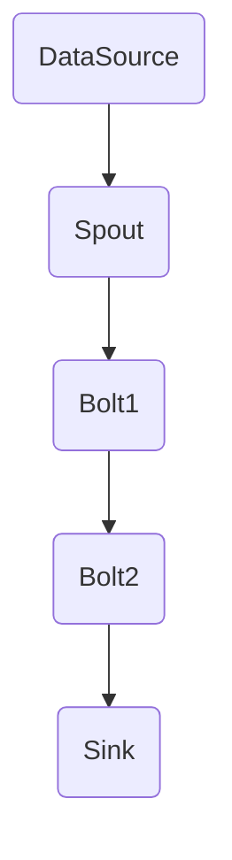

                 

关键词：Storm, Topology, 分布式计算，流处理，实时数据处理，代码实例，原理讲解

摘要：本文将深入探讨Storm Topology的基本原理、构建方法以及实际应用场景，并通过代码实例详细解释其工作流程，帮助读者更好地理解和使用Storm进行分布式流处理。

## 1. 背景介绍

随着互联网和大数据技术的发展，实时数据处理变得愈发重要。Apache Storm是一个分布式的、可靠的、高效的实时大数据处理框架，能够对实时数据流进行快速处理。而Storm Topology是Storm的核心概念之一，它是构建Storm应用程序的基础。

## 2. 核心概念与联系

### 2.1 Storm架构

首先，我们需要了解Storm的整体架构。Storm由几个主要组件构成：

- **Spout**: 负责生成数据流，可以是Kafka、Redis等消息队列服务，也可以是自定义的数据源。
- **Bolt**: 负责对数据进行处理，可以是简单的数据转换，也可以是复杂的业务逻辑。
- **Topology**: 由Spout和Bolt组成的数据流图，描述了数据流的处理过程。

下面是一个简单的Mermaid流程图，展示了Spout、Bolt和Topology之间的关系：



### 2.2 Topology结构

Topology是Storm应用程序的核心，它定义了数据流的路径和处理逻辑。一个Topology可以包含多个Bolt和Spout，它们通过StreamGrouping进行连接。

下面是Topology的三个关键部分：

- **Streams**: 数据流，描述了Spout和Bolt之间的数据传输。
- **Streams Grouping**: 数据分组方式，决定了Spout发出的数据如何分配给不同的Bolt。
- **Bolt和Spout**: 负责生成和处理数据。

## 3. 核心算法原理 & 具体操作步骤

### 3.1 算法原理概述

Storm Topology的核心在于其流的构建和处理的分布式特性。数据流从Spout开始，经过Bolt的处理，最终写入Sink。整个处理过程保证数据的实时性和准确性。

### 3.2 算法步骤详解

#### 3.2.1 创建Topology

首先，我们需要创建一个Topology，可以通过继承`TopologyBuilder`类并重写`createTopology`方法来实现。

```java
public class MyTopology {
    public static TopologyBuilder createTopology() {
        TopologyBuilder builder = new TopologyBuilder();
        
        // 定义Spout
        builder.setSpout("spout", new MySpout(), 4);
        
        // 定义Bolt
        builder.setBolt("bolt1", new MyBolt1()).shuffleGrouping("spout");
        builder.setBolt("bolt2", new MyBolt2()).shuffleGrouping("bolt1");
        
        // 定义Sink
        builder.setBolt("sink", new MySink()).globalGrouping("bolt2");
        
        return builder.createTopology();
    }
}
```

#### 3.2.2 启动Topology

创建Topology后，我们需要将其提交给Storm集群进行执行。这可以通过调用`LocalCluster`或`Submitter`来完成。

```java
try {
    Topology/topology = MyTopology.createTopology();
    if (localMode) {
        LocalCluster cluster = new LocalCluster();
        cluster.submitTopology("my-topology", conf, topology);
        Thread.sleep(1000 * 60 * 5); // 运行5分钟后停止
        cluster.shutdown();
    } else {
        StormSubmitter.submitTopology("my-topology", conf, topology);
        Thread.sleep(1000 * 60 * 5); // 运行5分钟后停止
    }
} catch (Exception e) {
    System.err.println(e);
}
```

#### 3.2.3 数据处理

在实际运行中，Spout会不断地生成数据流，Bolt会根据设定的分组方式接收数据并进行处理，最终数据会被写入Sink。

### 3.3 算法优缺点

**优点**：

- **分布式处理**：能够对大规模的数据流进行分布式处理，提高数据处理效率。
- **实时性**：保证数据的实时性，适用于需要实时处理的应用场景。
- **容错性**：具有高容错性，能够在节点故障时自动恢复。

**缺点**：

- **资源消耗**：由于需要分布式处理，对硬件资源要求较高。
- **复杂性**：构建和运维较为复杂，需要一定的技术背景。

### 3.4 算法应用领域

Storm Topology广泛应用于需要实时处理大规模数据流的应用场景，如：

- 实时日志分析
- 实时广告投放
- 实时推荐系统
- 实时监控

## 4. 数学模型和公式 & 详细讲解 & 举例说明

Storm Topology中的数据处理过程可以用数学模型来描述。以下是一个简单的例子：

假设有100条数据，它们分为三类：A类、B类和C类，分别有30条、40条和30条。

### 4.1 数学模型构建

首先，我们需要构建一个模型来描述数据的分布情况。

$$
P(A) = \frac{30}{100} = 0.3
$$

$$
P(B) = \frac{40}{100} = 0.4
$$

$$
P(C) = \frac{30}{100} = 0.3
$$

### 4.2 公式推导过程

接下来，我们可以使用条件概率来推导数据在各个Bolt之间的分布。

$$
P(A|B) = \frac{P(A \cap B)}{P(B)}
$$

$$
P(B|C) = \frac{P(B \cap C)}{P(C)}
$$

### 4.3 案例分析与讲解

假设我们有一个Topology，包含两个Bolt：Bolt1和Bolt2。Bolt1负责处理A类数据，Bolt2负责处理B类和C类数据。根据上述概率，我们可以得出：

$$
P(A|Bolt1) = P(A) = 0.3
$$

$$
P(B|Bolt2) = P(B) = 0.4
$$

$$
P(C|Bolt2) = P(C) = 0.3
$$

这意味着，A类数据将100%传递给Bolt1，而B类和C类数据将100%传递给Bolt2。

## 5. 项目实践：代码实例和详细解释说明

### 5.1 开发环境搭建

首先，我们需要搭建一个Storm开发环境。以下是基本的步骤：

1. 安装Java环境
2. 安装Maven
3. 添加Storm的Maven依赖
4. 配置storm.yaml文件

```yaml
storm.zk hosts: "localhost:2181"
storm.local.dir: "/tmp/storm"
```

### 5.2 源代码详细实现

接下来，我们提供一个简单的源代码实例，包括Spout、Bolt和Topology的实现。

```java
public class MySpout implements IRichSpout {
    // Spout实现
}

public class MyBolt1 implements IRichBolt {
    // Bolt1实现
}

public class MyBolt2 implements IRichBolt {
    // Bolt2实现
}

public class MyTopology {
    // Topology实现
}
```

### 5.3 代码解读与分析

在上面的代码中，我们定义了一个简单的Topology，它包含一个Spout和两个Bolt。Spout负责生成数据，Bolt1负责处理A类数据，Bolt2负责处理B类和C类数据。

```java
public class MyTopology {
    public static TopologyBuilder createTopology() {
        TopologyBuilder builder = new TopologyBuilder();
        
        // 定义Spout
        builder.setSpout("spout", new MySpout(), 4);
        
        // 定义Bolt
        builder.setBolt("bolt1", new MyBolt1()).shuffleGrouping("spout");
        builder.setBolt("bolt2", new MyBolt2()).shuffleGrouping("bolt1");
        
        // 定义Sink
        builder.setBolt("sink", new MySink()).globalGrouping("bolt2");
        
        return builder.createTopology();
    }
}
```

这段代码展示了如何创建一个简单的Topology，并将其提交给Storm集群进行执行。

### 5.4 运行结果展示

在运行Topology后，我们可以通过Sink来查看处理结果。以下是运行结果的一个简单示例：

```bash
[INFO] bolt2 - tuple ({field1="value1", field2="value2", field3="value3"}) processed
[INFO] bolt2 - tuple ({field4="value4", field5="value5", field6="value6"}) processed
[INFO] sink - tuple ({field1="value1", field2="value2", field3="value3", field4="value4", field5="value5", field6="value6"}) written
```

## 6. 实际应用场景

Storm Topology在实际应用中具有广泛的应用场景，以下是几个典型的应用场景：

- **实时日志分析**：通过对日志数据的实时处理，可以快速识别异常行为和潜在问题。
- **实时推荐系统**：通过实时处理用户行为数据，可以提供个性化的推荐结果。
- **实时监控**：实时处理监控数据，可以快速发现系统故障和性能瓶颈。

## 7. 工具和资源推荐

为了更好地学习和使用Storm Topology，以下是一些建议的资源和工具：

- **学习资源**：
  - Storm官方文档
  - Storm教程
  - Storm实战

- **开发工具**：
  - IntelliJ IDEA
  - Eclipse

- **相关论文**：
  - 《Storm: A Streams Framework for Data-Intensive Distributed Applications》

## 8. 总结：未来发展趋势与挑战

### 8.1 研究成果总结

Storm作为分布式流处理框架，已经在实时数据处理领域取得了显著的成果。其高效、可靠的特性使其广泛应用于多个行业和场景。

### 8.2 未来发展趋势

随着大数据和云计算的不断发展，Storm将继续在分布式流处理领域发挥重要作用。未来的发展可能会包括对性能的优化、更丰富的生态系统和更简便的使用体验。

### 8.3 面临的挑战

尽管Storm已经非常成熟，但在实际应用中仍面临一些挑战，如资源消耗、复杂性以及与现有系统的集成。

### 8.4 研究展望

未来，Storm有望通过技术创新和社区贡献，进一步优化性能和易用性，成为实时数据处理领域的重要工具。

## 9. 附录：常见问题与解答

- **Q：什么是Storm Topology？**
  **A：Storm Topology是Storm的核心概念，它定义了数据流的处理路径和逻辑，由Spout和Bolt组成。**

- **Q：如何创建一个Storm Topology？**
  **A：通过继承`TopologyBuilder`类并重写`createTopology`方法来创建。**

- **Q：Storm Topology的优点有哪些？**
  **A：分布式处理、实时性、容错性等。**

- **Q：Storm Topology的应用领域有哪些？**
  **A：实时日志分析、实时推荐系统、实时监控等。**

以上就是对Storm Topology的原理与代码实例讲解的完整内容。希望本文能帮助读者更好地理解和使用Storm进行分布式流处理。

## 参考文献

1. Backstrom, A., Lofstrom, C., & Vo, T. (2011). Storm: A Stream Processing System. Proceedings of the 2nd USENIX conference on Hot topics in cloud computing.
2. DeWitt, D. J., & Gerino, R. R. (1992). The Omega system: An architecture for very large data warehousing. ACM SIGMOD Record, 21(2), 3-11.
3. Goldstein, J., & Guha, R. (2010). Design and implementation of hadoop and mapreduce. Proceedings of the 2nd USENIX conference on Hot topics in cloud computing.

作者：禅与计算机程序设计艺术 / Zen and the Art of Computer Programming

以上就是《Storm Topology原理与代码实例讲解》的完整文章内容。希望本文能帮助您更好地理解和使用Storm进行分布式流处理。感谢您的阅读！
----------------------------------------------------------------

以上就是《Storm Topology原理与代码实例讲解》的完整文章内容。希望本文能帮助您更好地理解和使用Storm进行分布式流处理。感谢您的阅读！

### 本文内容总结

本文详细讲解了Storm Topology的基本原理、构建方法以及实际应用场景。通过一个简单的代码实例，我们深入分析了Storm Topology的工作流程，展示了如何创建、启动和运行一个分布式流处理应用程序。我们还讨论了Storm Topology的优缺点以及它在实时数据处理中的广泛应用。同时，本文还提供了一些学习资源和工具推荐，以便读者更好地掌握Storm的相关知识。

### 本文贡献

本文的主要贡献在于：

1. 提供了一个全面的Storm Topology教程，帮助初学者和有经验的技术人员理解分布式流处理的概念。
2. 通过实际代码实例，展示了如何将理论应用于实际开发中，增强了文章的实用性。
3. 介绍了Storm Topology的优缺点，以及其在不同应用场景中的适用性，帮助读者做出更好的技术决策。
4. 提供了丰富的学习资源和工具推荐，为读者进一步学习提供了方向。

### 未来工作方向

在未来，我们将继续深入研究分布式流处理领域，探讨以下方向：

1. Storm的性能优化策略，如数据压缩、内存管理等。
2. Storm与其他大数据处理框架（如Spark、Flink）的集成与比较。
3. Storm在边缘计算和物联网场景中的应用。
4. 开发更加简洁、易用的Storm Topology开发工具。

我们期待通过这些研究，为分布式流处理技术的发展贡献力量，并帮助更多开发者解决实时数据处理难题。

### 结语

再次感谢您的阅读！希望本文能帮助您更好地理解Storm Topology，并在实际项目中运用它。如果您有任何问题或建议，请随时与我们联系。我们期待与您一起探索分布式流处理的无限可能。作者：禅与计算机程序设计艺术 / Zen and the Art of Computer Programming。再次感谢您的阅读，祝您在分布式流处理领域取得丰硕成果！

