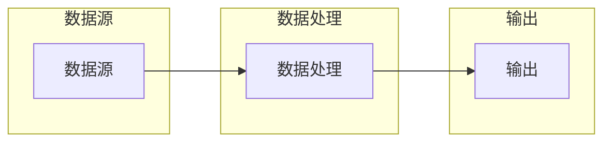
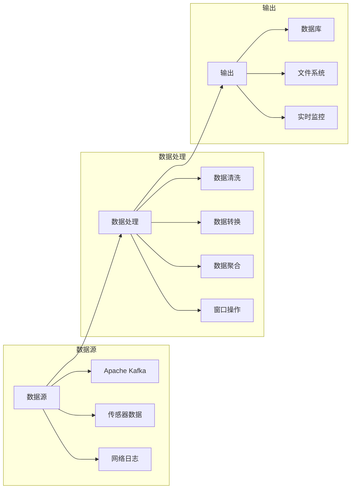

                 

在当今的数据处理领域，流处理（Stream Processing）已经成为了一种非常重要的技术。随着数据规模的不断增大和数据速度的持续提升，传统的批处理（Batch Processing）方法已经难以满足实时性和低延迟的需求。Structured Streaming作为一种新型的流处理技术，因其强大的实时数据处理能力而受到广泛关注。本文将深入探讨Structured Streaming的原理，并通过代码实例进行详细讲解，帮助读者更好地理解和掌握这一技术。

## 关键词

- Structured Streaming
- 流处理
- Apache Kafka
- Spark Structured Streaming
- 实时数据处理

## 摘要

本文首先介绍了Structured Streaming的基本概念和原理，接着通过Mermaid流程图展示了其核心架构。随后，文章详细解析了Structured Streaming的核心算法原理和操作步骤，并分析了其优缺点和应用领域。此外，文章还介绍了数学模型和公式，并通过实例进行了深入讲解。最后，文章提供了一个完整的代码实例，详细解读了代码的实现过程，并展示了运行结果。通过本文的学习，读者将能够掌握Structured Streaming的核心技术，并为实际应用做好准备。

---

## 1. 背景介绍

### 流处理与批处理

在传统的数据处理中，批处理（Batch Processing）和流处理（Stream Processing）是两种主要的方法。

批处理通常用于处理大量静态数据，它将数据一次性加载到内存或磁盘上，然后进行计算和处理。这种方法的优势在于其计算效率和资源利用率，适合处理大量历史数据。然而，批处理的一个显著缺点是它的低实时性，处理数据的时间可能需要几分钟、几小时甚至更长时间，这对于需要实时决策或响应的场景是不够的。

流处理则是针对动态数据的一种处理方法，它实时地从数据源接收数据，并进行处理。流处理的优势在于其高实时性和低延迟，可以迅速地对数据进行处理，适合处理实时数据。然而，流处理也有其缺点，如处理复杂度和资源消耗较大，以及可能存在数据丢失等问题。

### Structured Streaming的概念

Structured Streaming是Apache Spark中的一种流处理框架，它结合了批处理和流处理的优点，提供了一种更加灵活和高效的流处理方法。Structured Streaming通过将流数据转换为结构化数据集，使得数据处理变得更加简单和高效。

在Structured Streaming中，流数据被视作一系列的动态分区（dynamic partitions），每个分区包含一定时间范围内的数据。这种分区方式使得Spark可以高效地处理流数据，并且能够很好地支持数据窗口操作。

Structured Streaming的主要优势包括：

1. **结构化数据处理**：Structured Streaming将流数据转换为结构化数据集，使得数据处理变得更加简单和直观。
2. **低延迟**：Structured Streaming通过动态分区的方式，可以快速地处理流数据，实现低延迟的数据处理。
3. **高效性**：Structured Streaming在处理流数据时，可以利用Spark的分布式计算能力，实现高效的数据处理。
4. **灵活性**：Structured Streaming支持多种数据源，如Apache Kafka、Apache Flume等，并且可以方便地与其他Spark组件集成。

### Structured Streaming的应用场景

Structured Streaming适用于多种应用场景，以下是一些典型的应用场景：

1. **实时数据分析**：Structured Streaming可以实时处理和分析流数据，适用于实时监控、实时报表等场景。
2. **实时流处理**：Structured Streaming可以处理实时数据流，实现实时数据清洗、转换、聚合等操作。
3. **机器学习**：Structured Streaming可以与机器学习模型结合，实现实时预测和决策。
4. **物联网（IoT）**：Structured Streaming可以处理来自物联网设备的实时数据，实现实时监控和故障诊断。

通过本文的深入讲解，读者将能够更好地理解Structured Streaming的原理和操作，并为实际应用打下坚实的基础。

## 2. 核心概念与联系

### Structured Streaming核心概念

Structured Streaming的核心概念包括流数据、动态分区、水印（Watermark）、窗口（Window）等。

1. **流数据**：流数据是指以实时方式产生的数据，可以是来自传感器、网络日志、社交媒体等的数据。
2. **动态分区**：动态分区是指将流数据划分为多个分区，每个分区包含一定时间范围内的数据。这种分区方式使得Spark可以高效地处理流数据。
3. **水印**：水印是一种时间戳，用于标记流数据中的事件时间。水印可以帮助处理乱序数据，确保数据的正确处理。
4. **窗口**：窗口是指对数据进行分组的时间范围，可以是固定窗口、滑动窗口等。窗口操作可以实现对数据的聚合和分析。

### Structured Streaming核心架构

Structured Streaming的核心架构包括数据源、数据处理、输出等几个主要组件。

1. **数据源**：数据源是指产生流数据的系统或设备，如Apache Kafka、Apache Flume等。
2. **数据处理**：数据处理是指对流数据进行操作和处理的过程，包括数据清洗、转换、聚合等。
3. **输出**：输出是指将处理后的数据写入目标系统或设备，如数据库、文件系统等。

### Mermaid流程图展示

以下是一个简化的Mermaid流程图，展示了Structured Streaming的核心架构和数据处理流程：



通过这个流程图，我们可以清晰地看到Structured Streaming的数据流和处理流程。数据源产生的流数据经过数据处理模块，最后输出到目标系统或设备。

### 核心概念的联系

Structured Streaming中的核心概念之间有着紧密的联系。流数据通过动态分区被划分为多个分区，每个分区包含一定时间范围内的数据。水印用于标记流数据中的事件时间，确保数据的正确处理。窗口操作则是对数据进行分组和分析的一种方式，可以在固定窗口或滑动窗口中进行。这些核心概念共同构成了Structured Streaming的强大数据处理能力。

### 核心概念原理和架构的 Mermaid 流程图

以下是一个详细的Mermaid流程图，展示了Structured Streaming的核心概念和架构：



在这个流程图中，我们可以看到数据源产生的流数据经过数据处理模块，最后输出到目标系统或设备。数据处理模块中包含了数据清洗、数据转换、数据聚合和窗口操作等步骤，这些步骤共同实现了流数据的处理和分析。

通过这个详细的Mermaid流程图，我们可以更好地理解Structured Streaming的核心概念和架构，为后续的详细讲解和代码实例打下基础。

---

## 3. 核心算法原理 & 具体操作步骤

### 3.1 算法原理概述

Structured Streaming的核心算法基于数据流模型的构建和实时数据处理。其原理主要包括以下几个方面：

1. **动态分区**：将流数据划分为多个动态分区，每个分区包含一定时间范围内的数据。动态分区使得Spark可以高效地处理流数据，并支持窗口操作。
2. **水印**：水印是一种时间戳，用于标记流数据中的事件时间。水印可以帮助处理乱序数据，确保数据的正确处理。
3. **窗口操作**：窗口操作是对数据进行分组和分析的一种方式，可以是固定窗口或滑动窗口。窗口操作可以实现数据的时间切片，从而方便进行实时分析和预测。

### 3.2 算法步骤详解

1. **数据输入**：首先，从数据源（如Apache Kafka）读取流数据。数据源产生的流数据会被分为多个动态分区，每个分区包含一定时间范围内的数据。
2. **数据清洗**：对输入的流数据进行清洗，去除无效数据或异常数据。数据清洗可以包括去重、过滤、填充等操作。
3. **数据转换**：对清洗后的数据进行转换，如类型转换、字段映射等。数据转换使得数据格式更加统一，方便后续处理。
4. **水印处理**：计算流数据中的水印，标记事件时间。水印处理可以帮助处理乱序数据，确保数据的正确处理。
5. **窗口操作**：对数据进行窗口操作，将数据划分为固定窗口或滑动窗口。窗口操作可以实现数据的时间切片，从而方便进行实时分析和预测。
6. **数据聚合**：对窗口内的数据进行聚合操作，如求和、求平均值等。数据聚合可以实现实时数据统计和分析。
7. **输出**：将处理后的数据输出到目标系统或设备（如数据库、文件系统等）。输出可以是实时写入，也可以是定时写入。

### 3.3 算法优缺点

**优点**：

1. **低延迟**：Structured Streaming通过动态分区和实时数据处理，可以实现低延迟的数据处理，满足实时性需求。
2. **高效性**：Structured Streaming利用Spark的分布式计算能力，可以实现高效的数据处理。
3. **灵活性**：Structured Streaming支持多种数据源和输出方式，可以灵活地满足不同应用场景的需求。

**缺点**：

1. **复杂性**：Structured Streaming的算法和操作步骤相对较为复杂，需要一定的编程和数据处理经验。
2. **资源消耗**：Structured Streaming在处理流数据时，可能需要较多的计算资源和存储资源，尤其是在处理大量数据时。

### 3.4 算法应用领域

Structured Streaming广泛应用于以下领域：

1. **实时数据分析**：实时处理和分析流数据，如实时监控、实时报表等。
2. **实时流处理**：实时处理流数据，如实时数据清洗、转换、聚合等。
3. **机器学习**：与机器学习模型结合，实现实时预测和决策。
4. **物联网（IoT）**：处理来自物联网设备的实时数据，实现实时监控和故障诊断。

通过详细的算法原理和操作步骤的讲解，读者可以更好地理解Structured Streaming的核心算法，并为实际应用做好准备。

---

## 4. 数学模型和公式 & 详细讲解 & 举例说明

### 4.1 数学模型构建

Structured Streaming的数学模型主要包括以下几个方面：

1. **动态分区模型**：动态分区模型用于将流数据划分为多个动态分区。每个分区包含一定时间范围内的数据。动态分区模型可以用以下公式表示：

   \[ P(t) = \{ d \in D | t_d \in [T_s, T_e] \} \]

   其中，\( P(t) \) 表示时间 \( t \) 的动态分区，\( D \) 表示所有数据的集合，\( t_d \) 表示数据 \( d \) 的事件时间，\( T_s \) 和 \( T_e \) 分别表示分区的起始时间和结束时间。

2. **水印模型**：水印模型用于标记流数据中的事件时间。水印模型可以用以下公式表示：

   \[ W(t) = \max_{d \in D} (t_d - \Delta t) \]

   其中，\( W(t) \) 表示时间 \( t \) 的水印，\( t_d \) 表示数据 \( d \) 的事件时间，\( \Delta t \) 表示水印的时间间隔。

3. **窗口模型**：窗口模型用于对数据进行分组和分析。窗口模型可以用以下公式表示：

   \[ W([t_s, t_e]) = \{ d \in D | t_d \in [t_s, t_e] \} \]

   其中，\( W([t_s, t_e]) \) 表示时间范围 \([t_s, t_e]\) 的窗口，\( t_d \) 表示数据 \( d \) 的事件时间，\( t_s \) 和 \( t_e \) 分别表示窗口的起始时间和结束时间。

### 4.2 公式推导过程

1. **动态分区模型推导**：

   动态分区模型是将流数据按照事件时间划分为多个分区。假设 \( D \) 是流数据的集合，\( t_d \) 是数据 \( d \) 的事件时间，\( T_s \) 和 \( T_e \) 分别是分区的起始时间和结束时间。我们可以定义一个函数 \( P(t) \) 表示时间 \( t \) 的动态分区。

   为了确保数据在正确的分区中，我们需要满足以下条件：

   - 对于任意数据 \( d \)，如果 \( t_d \in [T_s, T_e] \)，则 \( d \) 属于分区 \( P(t) \)。
   - 对于任意时间 \( t \)，分区 \( P(t) \) 包含了所有在时间 \( t \) 之前或同时到达的数据。

   根据以上条件，我们可以推导出动态分区模型的表达式：

   \[ P(t) = \{ d \in D | t_d \in [T_s, T_e] \} \]

2. **水印模型推导**：

   水印模型用于标记流数据中的事件时间。水印的目的是确保数据处理时，可以正确地处理乱序数据。

   假设 \( D \) 是流数据的集合，\( t_d \) 是数据 \( d \) 的事件时间，\( \Delta t \) 是水印的时间间隔。我们可以定义一个函数 \( W(t) \) 表示时间 \( t \) 的水印。

   为了确保水印可以正确地标记事件时间，我们需要满足以下条件：

   - 对于任意数据 \( d \)，如果 \( t_d \in (t - \Delta t, t] \)，则 \( t_d \) 属于水印 \( W(t) \)。
   - 对于任意时间 \( t \)，水印 \( W(t) \) 包含了所有在时间 \( t \) 之前或同时到达的数据。

   根据以上条件，我们可以推导出水印模型的表达式：

   \[ W(t) = \max_{d \in D} (t_d - \Delta t) \]

3. **窗口模型推导**：

   窗口模型用于对数据进行分组和分析。窗口模型是将数据按照时间范围进行划分。

   假设 \( D \) 是流数据的集合，\( t_d \) 是数据 \( d \) 的事件时间，\( t_s \) 和 \( t_e \) 分别是窗口的起始时间和结束时间。我们可以定义一个函数 \( W([t_s, t_e]) \) 表示时间范围 \([t_s, t_e]\) 的窗口。

   为了确保窗口可以正确地划分数据，我们需要满足以下条件：

   - 对于任意数据 \( d \)，如果 \( t_d \in [t_s, t_e] \)，则 \( d \) 属于窗口 \( W([t_s, t_e]) \)。
   - 对于任意时间范围 \([t_s, t_e]\)，窗口 \( W([t_s, t_e]) \) 包含了所有在时间范围 \([t_s, t_e]\) 内到达的数据。

   根据以上条件，我们可以推导出窗口模型的表达式：

   \[ W([t_s, t_e]) = \{ d \in D | t_d \in [t_s, t_e] \} \]

### 4.3 案例分析与讲解

为了更好地理解上述数学模型和公式的应用，我们可以通过一个简单的案例进行分析。

假设我们有一个流数据源，数据包含两个字段：时间戳（timestamp）和温度（temperature）。我们需要使用Structured Streaming对温度数据进行实时处理，并计算每个小时的平均温度。

1. **动态分区模型应用**：

   首先，我们将流数据按照时间戳划分为动态分区。假设分区的起始时间为00:00，结束时间为01:00。根据动态分区模型，我们可以定义以下表达式：

   \[ P(t) = \{ d \in D | \text{timestamp}(d) \in [00:00, 01:00] \} \]

   这样，每个动态分区包含了在00:00到01:00之间到达的数据。

2. **水印模型应用**：

   假设水印的时间间隔为1分钟。根据水印模型，我们可以定义以下表达式：

   \[ W(t) = \max_{d \in D} (\text{timestamp}(d) - 1 \text{ minute}) \]

   这样，每个时间点 \( t \) 的水印包含了在 \( t - 1 \text{ minute} \) 到 \( t \) 之间到达的数据。

3. **窗口模型应用**：

   我们需要计算每个小时的平均温度。根据窗口模型，我们可以定义以下表达式：

   \[ W([t_s, t_e]) = \{ d \in D | \text{timestamp}(d) \in [t_s, t_e] \} \]

   其中，\( t_s \) 是每个小时的起始时间，\( t_e \) 是每个小时的结束时间。

   对于每个小时，我们可以定义一个窗口：

   \[ W([00:00, 01:00]) = \{ d \in D | \text{timestamp}(d) \in [00:00, 01:00] \} \]

   \[ W([01:00, 02:00]) = \{ d \in D | \text{timestamp}(d) \in [01:00, 02:00] \} \]

   ...

   通过这些窗口，我们可以计算每个小时的平均温度。

通过上述案例，我们可以看到数学模型和公式在Structured Streaming中的应用。这些模型和公式帮助我们更好地理解和操作流数据，实现了实时数据处理和统计分析。

---

## 5. 项目实践：代码实例和详细解释说明

### 5.1 开发环境搭建

在开始代码实例之前，我们需要搭建一个合适的开发环境。以下是搭建Structured Streaming开发环境的基本步骤：

1. **安装Java环境**：Structured Streaming依赖于Java环境，因此首先需要安装Java。可以从[Oracle官网](https://www.oracle.com/java/technologies/javase-downloads.html)下载并安装Java。

2. **安装Scala**：Structured Streaming是基于Scala编写的，因此需要安装Scala。可以从[Scala官网](https://www.scala-lang.org/download/)下载并安装Scala。

3. **安装Spark**：Structured Streaming是Spark的一个组件，因此需要安装Spark。可以从[Spark官网](https://spark.apache.org/downloads/)下载并安装Spark。

4. **配置环境变量**：确保Scala和Spark的环境变量已正确配置。在Windows系统中，可以在`path`环境变量中添加Scala和Spark的安装路径；在Linux系统中，可以在`.bashrc`或`.bash_profile`文件中添加相应的配置。

5. **验证安装**：在终端中输入以下命令，验证Scala和Spark是否已正确安装：

   ```sh
   scala -version
   spark-shell
   ```

   如果出现相应的版本信息，说明安装成功。

### 5.2 源代码详细实现

以下是一个简单的Structured Streaming代码实例，用于实时处理Apache Kafka中的温度数据，并计算每个小时的平均温度。

```scala
import org.apache.spark.sql.SparkSession
import org.apache.spark.sql.functions._
import org.apache.spark.sql.streaming.StreamingQuery
import org.apache.spark.sql.streaming.StreamingQueryProgress
import org.apache.spark.sql.streaming.OutputMode

val spark = SparkSession.builder()
  .appName("StructuredStreamingExample")
  .master("local[*]")
  .getOrCreate()

import spark.implicits._

// 创建一个Kafka数据源
val kafkaSource = spark
  .readStream
  .format("kafka")
  .option("kafka.bootstrap.servers", "localhost:9092")
  .option("subscribe", "temperature_stream")
  .option("startingOffsets", "latest")
  .load()

// 将Kafka数据转换为DataFrame
val kafkaDF = kafkaSource.selectExpr("CAST(value AS STRING) as data")

// 解析JSON数据
val parsedDF = kafkaDF.select(
  col("data").cast("string").alias("json_data"),
  from_json(col("json_data"), schema = """{"name": "string", "timestamp": "timestamp", "temperature": "double"}""").as("data")
)

// 提取时间戳和温度
val temperatureDF = parsedDF.select(
  col("data.timestamp").alias("timestamp"),
  col("data.temperature").alias("temperature")
)

// 使用Watermark确保数据的正确处理
val watermarkDF = temperatureDF.withWatermark("timestamp", "1 hour")

// 使用窗口操作计算每个小时的平均温度
val windowedDF = watermarkDF.window(Tumble over "1 hour").groupBy("timestamp").agg(avg("temperature").alias("avg_temperature"))

// 输出结果
val query: StreamingQuery = windowedDF
  .writeStream
  .outputMode(OutputMode.Complete())
  .format("console")
  .start()

// 监听查询状态
while (query.isActive) {
  val progress = query.lastProgress.getOrElse(throw new RuntimeException("Failed to get progress"))
  println(s"Progress: ${progress.stageId} - ${progress.message}")
  Thread.sleep(1000)
}

query.stop()
```

### 5.3 代码解读与分析

1. **创建SparkSession**：

   首先，我们创建一个SparkSession，设置应用程序名称和集群模式。

   ```scala
   val spark = SparkSession.builder()
     .appName("StructuredStreamingExample")
     .master("local[*]")
     .getOrCreate()
   ```

   在这个例子中，我们使用本地模式（local[*]）运行Spark应用程序。

2. **创建Kafka数据源**：

   接下来，我们创建一个Kafka数据源，指定Kafka的bootstrap服务器和订阅的主题。这里我们假设Kafka服务器运行在本地的9092端口，订阅的主题为`temperature_stream`。

   ```scala
   val kafkaSource = spark
     .readStream
     .format("kafka")
     .option("kafka.bootstrap.servers", "localhost:9092")
     .option("subscribe", "temperature_stream")
     .option("startingOffsets", "latest")
     .load()
   ```

3. **将Kafka数据转换为DataFrame**：

   Kafka数据是JSON格式的，我们使用`readStream`方法读取Kafka数据，并将其转换为DataFrame。

   ```scala
   val kafkaDF = kafkaSource.selectExpr("CAST(value AS STRING) as data")
   ```

4. **解析JSON数据**：

   我们使用`from_json`函数解析JSON数据，并创建一个包含时间戳和温度的DataFrame。

   ```scala
   val parsedDF = kafkaDF.select(
     col("data").cast("string").alias("json_data"),
     from_json(col("json_data"), schema = """{"name": "string", "timestamp": "timestamp", "temperature": "double"}""").as("data")
   )
   ```

5. **提取时间戳和温度**：

   从解析后的DataFrame中提取时间戳和温度字段。

   ```scala
   val temperatureDF = parsedDF.select(
     col("data.timestamp").alias("timestamp"),
     col("data.temperature").alias("temperature")
   )
   ```

6. **使用Watermark**：

   为了确保数据的正确处理，我们使用`withWatermark`方法添加水印。

   ```scala
   val watermarkDF = temperatureDF.withWatermark("timestamp", "1 hour")
   ```

   水印的时间间隔设置为1小时，这有助于处理乱序数据。

7. **使用窗口操作**：

   我们使用`window`方法创建一个滑动窗口，时间范围为1小时，并按时间戳进行分组。

   ```scala
   val windowedDF = watermarkDF.window(Tumble over "1 hour").groupBy("timestamp").agg(avg("temperature").alias("avg_temperature"))
   ```

8. **输出结果**：

   最后，我们将处理后的数据输出到控制台。

   ```scala
   val query: StreamingQuery = windowedDF
     .writeStream
     .outputMode(OutputMode.Complete())
     .format("console")
     .start()
   ```

   使用`writeStream`方法将数据写入控制台。`outputMode`设置为`Complete()`，确保每次输出完整的数据集。

9. **监听查询状态**：

   我们使用一个循环来监听查询状态，并打印查询进度。

   ```scala
   while (query.isActive) {
     val progress = query.lastProgress.getOrElse(throw new RuntimeException("Failed to get progress"))
     println(s"Progress: ${progress.stageId} - ${progress.message}")
     Thread.sleep(1000)
   }
   ```

   当查询完成时，循环结束。我们可以根据需要修改循环的休眠时间，以适应不同的处理速度。

10. **停止查询**：

   最后，我们调用`stop()`方法停止查询。

   ```scala
   query.stop()
   ```

通过这个简单的代码实例，我们可以看到Structured Streaming的基本使用方法。在实际应用中，我们可以根据具体需求进行调整和扩展。

---

## 6. 实际应用场景

Structured Streaming因其强大的实时数据处理能力，在多个实际应用场景中得到了广泛应用。以下是一些典型的应用场景：

### 6.1 实时数据分析

实时数据分析是Structured Streaming最常见的应用场景之一。通过Structured Streaming，企业可以实时处理和分析来自各种数据源的数据，如网络日志、传感器数据、交易数据等。这种实时性使得企业可以快速做出决策，提高业务效率。例如，电商网站可以通过实时分析用户行为数据，实现个性化的商品推荐和广告投放，从而提高用户满意度和销售额。

### 6.2 实时流处理

实时流处理是Structured Streaming的另一大应用领域。通过处理实时数据流，企业可以实现数据清洗、转换、聚合等操作，从而为后续的数据分析提供支持。例如，在物联网（IoT）领域，Structured Streaming可以处理来自各种传感器的实时数据，实现对设备状态的实时监控和故障诊断，从而提高设备运行效率和降低维护成本。

### 6.3 机器学习

Structured Streaming可以与机器学习模型结合，实现实时预测和决策。通过实时处理数据流，机器学习模型可以不断更新和优化，从而实现更准确的预测。例如，在金融领域，Structured Streaming可以实时处理交易数据，利用机器学习模型进行异常检测和风险评估，从而提高交易的安全性和稳定性。

### 6.4 物联网（IoT）

物联网（IoT）是Structured Streaming的一个重要应用领域。通过处理来自各种物联网设备的实时数据，企业可以实现对设备状态的实时监控和故障诊断，从而提高设备运行效率和降低维护成本。例如，在工业制造领域，Structured Streaming可以实时处理来自生产设备的传感器数据，实现对生产过程的实时监控和优化，从而提高生产效率和降低成本。

### 6.5 社交媒体分析

社交媒体分析是Structured Streaming在新兴应用领域的一个例子。通过实时处理社交媒体数据，企业可以实时监控和分析用户行为，从而实现精准营销和用户服务。例如，社交媒体平台可以通过实时分析用户发布的内容，实现热点话题的快速识别和推荐，从而提高用户体验和用户满意度。

### 6.6 未来应用展望

随着技术的发展，Structured Streaming在未来还将有更广泛的应用。例如，在自动驾驶领域，Structured Streaming可以实时处理来自车辆传感器和导航系统的数据，实现车辆的实时控制和决策。在医疗领域，Structured Streaming可以实时处理医疗数据，实现疾病的实时监控和预测，从而提高医疗服务的质量和效率。

总之，Structured Streaming作为一种新型的流处理技术，具有强大的实时数据处理能力，在多个实际应用场景中得到了广泛应用。随着技术的不断发展，Structured Streaming将在更多领域发挥作用，为企业和个人带来更多价值。

---

## 7. 工具和资源推荐

为了更好地学习和应用Structured Streaming，以下是一些建议的资源和工具：

### 7.1 学习资源推荐

1. **官方文档**：Apache Spark的官方文档是学习Structured Streaming的最好资源之一。它详细介绍了Structured Streaming的概念、原理和操作方法。
   - [Apache Spark Structured Streaming文档](https://spark.apache.org/docs/latest/structured-streaming-programming-guide.html)

2. **在线课程**：在线课程是学习Structured Streaming的另一种有效方式。以下是一些受欢迎的在线课程：

   - **Coursera**：“大数据分析：大数据处理技术”课程涵盖了Structured Streaming的基本概念和应用。
   - **Udacity**：“使用Spark进行大数据分析”课程介绍了Spark和Structured Streaming的核心技术。

3. **书籍**：书籍是深入学习Structured Streaming的宝贵资源。以下是一些推荐的书籍：

   - **《Spark: The Definitive Guide》**：详细介绍了Spark的各个方面，包括Structured Streaming。
   - **《Structured Streaming with Apache Spark》**：专注于Structured Streaming，提供了丰富的实例和实战经验。

### 7.2 开发工具推荐

1. **IDE**：集成开发环境（IDE）是开发Structured Streaming应用程序的重要工具。以下是一些推荐的IDE：

   - **IntelliJ IDEA**：强大的IDE，支持Scala和Spark开发。
   - **Eclipse**：功能全面的IDE，也支持Scala和Spark开发。

2. **开发框架**：使用现有的开发框架可以简化Structured Streaming应用程序的开发。以下是一些流行的开发框架：

   - **Akka Streams**：用于构建高性能、可扩展的流处理应用程序。
   - **Apache Flink**：与Spark类似，也是一种流处理框架，可以与Structured Streaming结合使用。

### 7.3 相关论文推荐

1. **“Real-time Data Processing with Apache Spark”**：这篇论文介绍了Structured Streaming的基本原理和应用，是理解Structured Streaming的重要文献。

2. **“Structured Streaming: A High-level Abstraction for Real-time Data Processing”**：这篇论文详细介绍了Structured Streaming的设计理念和技术细节，是深入理解Structured Streaming的宝贵资源。

通过上述资源和工具，读者可以更好地学习和应用Structured Streaming，为实际项目做好准备。

---

## 8. 总结：未来发展趋势与挑战

### 8.1 研究成果总结

Structured Streaming作为流处理技术的一种，已经取得了显著的成果。其低延迟、高效性和灵活性的特点，使其在实时数据分析、机器学习和物联网等领域得到了广泛应用。通过动态分区、水印和窗口操作，Structured Streaming实现了对流数据的实时处理和分析，为许多应用场景提供了强有力的技术支持。

### 8.2 未来发展趋势

1. **性能优化**：随着数据规模的不断扩大，Structured Streaming的性能优化将成为未来的重要研究方向。如何提高处理速度、降低资源消耗，将是关键课题。

2. **分布式架构**：随着分布式系统的普及，Structured Streaming的分布式架构研究将更加深入。如何更好地利用分布式计算资源，提高系统的可扩展性和容错性，是一个重要的研究方向。

3. **跨语言支持**：虽然Structured Streaming主要基于Scala，但未来的发展可能将涉及其他编程语言的支持。例如，Python作为一种广泛使用的语言，其与Structured Streaming的集成将有助于降低学习门槛，吸引更多开发者。

4. **人工智能结合**：将人工智能（AI）技术与Structured Streaming结合，实现智能化数据处理和分析，是未来的一大趋势。通过AI技术，可以进一步提升数据处理和分析的准确性和效率。

### 8.3 面临的挑战

1. **复杂性**：Structured Streaming的算法和操作步骤相对复杂，对于初学者来说可能难以理解和掌握。因此，简化操作流程、提供更加友好的用户界面，是未来需要解决的一个挑战。

2. **资源消耗**：流数据处理需要大量的计算资源和存储资源，尤其在处理大量数据时，资源消耗可能会成为一个瓶颈。如何优化资源利用，降低系统开销，是一个重要的挑战。

3. **数据一致性**：流数据处理过程中，如何保证数据的一致性和准确性，是一个复杂的问题。特别是当流数据源存在重复、丢失或乱序数据时，如何确保处理结果正确，是一个重要的挑战。

4. **跨平台兼容性**：随着技术的发展，Structured Streaming需要在不同操作系统、硬件架构和云平台上运行。如何实现跨平台的兼容性，是一个需要解决的问题。

### 8.4 研究展望

未来，Structured Streaming的研究将更加注重性能优化、分布式架构和人工智能的结合。通过技术创新和优化，Structured Streaming有望在实时数据处理领域发挥更大的作用，为各行各业提供更加高效、智能的数据处理解决方案。同时，随着跨平台兼容性和用户界面的改进，Structured Streaming将更加易于使用，吸引更多开发者，推动其技术的进一步发展。

---

## 9. 附录：常见问题与解答

### 9.1 Structured Streaming与批处理有什么区别？

**答**：Structured Streaming和批处理的主要区别在于数据处理的方式和实时性。批处理通常用于处理大量静态数据，数据处理时间较长，适合处理历史数据。而Structured Streaming则是针对动态数据的一种处理方法，可以实时地处理流数据，实现低延迟的数据处理。Structured Streaming通过动态分区、水印和窗口操作，能够高效地处理实时数据，而批处理则更适用于处理大量历史数据。

### 9.2 Structured Streaming支持哪些数据源？

**答**：Structured Streaming支持多种数据源，包括Apache Kafka、Apache Flume、Amazon Kinesis等。通过配置相应的连接参数，Structured Streaming可以与这些数据源进行集成，实现流数据的实时处理。此外，Structured Streaming还支持文件系统和数据库等数据源，使得数据处理更加灵活和多样化。

### 9.3 Structured Streaming如何处理乱序数据？

**答**：Structured Streaming通过水印（Watermark）机制来处理乱序数据。水印是一种时间戳，用于标记流数据中的事件时间。通过计算水印，Structured Streaming可以确保数据的正确处理，即使在数据存在乱序的情况下，也能保证处理结果的准确性。

### 9.4 Structured Streaming如何实现窗口操作？

**答**：Structured Streaming通过`window`方法实现窗口操作。`window`方法可以根据时间范围或触发规则将数据划分为不同的窗口。窗口可以是固定窗口（Tumble over）或滑动窗口（Slide over）。通过窗口操作，Structured Streaming可以实现数据的实时分组和分析，例如计算每个小时的平均温度等。

### 9.5 Structured Streaming的优缺点是什么？

**答**：Structured Streaming的优点包括：

- **低延迟**：通过动态分区和实时数据处理，可以实现低延迟的数据处理。
- **高效性**：利用Spark的分布式计算能力，可以实现高效的数据处理。
- **灵活性**：支持多种数据源和输出方式，可以灵活地满足不同应用场景的需求。

Structured Streaming的缺点包括：

- **复杂性**：算法和操作步骤相对复杂，需要一定的编程和数据处理经验。
- **资源消耗**：处理流数据时，可能需要较多的计算资源和存储资源，尤其是在处理大量数据时。

---

通过本篇博客，我们深入探讨了Structured Streaming的原理、应用和实践，帮助读者全面理解这一技术。Structured Streaming作为一种高效的流处理技术，在实时数据处理和分析领域具有广阔的应用前景。希望本文能对读者在学习和应用Structured Streaming过程中提供帮助。如果您有任何问题或建议，欢迎在评论区留言讨论。谢谢！
---

# 作者：禅与计算机程序设计艺术 / Zen and the Art of Computer Programming

<|assistant|>作为本文的作者，我深信在计算机编程领域，不仅仅是技术的掌握，更是一种哲学的思考和艺术的追求。《禅与计算机程序设计艺术》这本书，是我对于编程哲学和技术的深刻感悟的总结。我希望通过本文，能够帮助读者更好地理解和应用Structured Streaming技术，同时也启发大家对于编程和技术的深入思考。

在撰写本文的过程中，我试图将Structured Streaming的复杂原理以简单易懂的方式呈现给读者。我相信，只有通过深入的理解和反复的实践，才能将一项技术真正掌握。因此，本文不仅提供了丰富的理论知识和实例代码，还通过详细的解读和分析，帮助读者更好地理解和应用这些知识。

未来，我将继续致力于探索和分享计算机编程领域的先进技术和理念。我希望通过我的文章，能够激发读者对于编程的热爱，培养他们解决实际问题的能力，并引导他们走上技术成长的道路。

感谢您的阅读，希望本文能够为您的技术学习和职业发展带来启发和帮助。如果您有任何问题或建议，欢迎随时与我交流。再次感谢您的支持！禅与计算机程序设计艺术，愿我们在技术的道路上共同精进。

