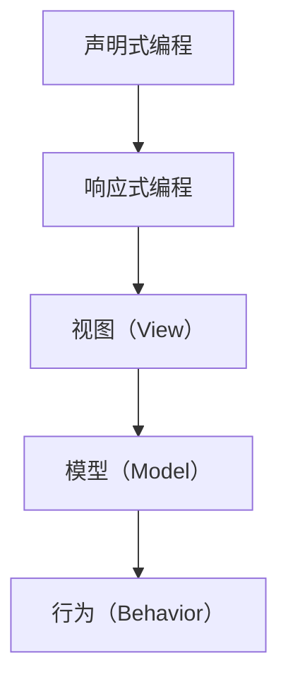

                 

 SwiftUI 是苹果公司推出的一个全新的声明式 UI 框架，旨在为开发者提供一个简单、高效的方式来构建现代化的 iOS、macOS、tvOS 和 watchOS 应用程序。SwiftUI 的推出标志着苹果对于 UI 开发范式的重大变革，从传统的基于组件的 UI 架构向声明式编程的全面转型。

SwiftUI 的核心在于其声明式编程模型。开发者通过编写描述 UI 状态和行为的代码，而不是通过操作 DOM（文档对象模型）来构建 UI。这种编程模型极大地提高了开发效率和代码的可读性，使得开发者可以更专注于业务逻辑的实现，而无需过度关注 UI 的细节。

SwiftUI 还提供了丰富的内置组件和视图，包括文本、按钮、图片、列表、表视图等，开发者可以轻松地使用这些组件构建复杂的 UI。同时，SwiftUI 支持响应式编程，通过绑定和回调机制，开发者可以轻松地实现 UI 的动态更新。

此外，SwiftUI 的跨平台特性使得开发者可以一次编写代码，即可在多个平台上运行，大大降低了开发成本。SwiftUI 的推出不仅为开发者提供了一个全新的 UI 开发方式，也预示着苹果对于未来 UI 开发趋势的引领。

## 1. 背景介绍

SwiftUI 的推出并不是一夜之间的决定，而是苹果公司多年 UI 开发经验和技术的积累。在此之前，苹果公司主要依赖于 Cocoa 和 Cocoa Touch 框架来构建 iOS、macOS、tvOS 和 watchOS 应用程序。这些框架基于面向对象编程范式，开发者需要通过操作 DOM 来构建 UI。

然而，随着移动设备和智能设备的普及，用户对于应用程序的 UI 体验要求越来越高。传统的 UI 架构逐渐暴露出一些问题，如代码复杂度高、维护困难、跨平台支持不足等。为了解决这些问题，苹果公司决定推出一个全新的 UI 框架，即 SwiftUI。

SwiftUI 的设计目标是提供一种简单、高效、响应式、跨平台的 UI 开发方式。通过引入声明式编程模型，SwiftUI 使得开发者可以更直观地描述 UI 的状态和行为，从而提高开发效率。同时，SwiftUI 还提供了丰富的内置组件和视图，以及强大的响应式编程支持，使得开发者可以轻松地构建现代化的 UI。

## 2. 核心概念与联系

### 2.1 声明式编程

声明式编程是一种与命令式编程相对的编程范式。在声明式编程中，开发者通过描述数据的初始状态和预期状态，让系统自动计算并生成中间状态，最终实现目标状态。与之相比，命令式编程则是通过一系列指令来直接操作数据，使其从初始状态过渡到预期状态。

在 SwiftUI 中，声明式编程模型得到了充分的体现。开发者通过编写描述 UI 状态和行为的代码，SwiftUI 会自动计算并生成 UI 的中间状态，最终呈现给用户。这种编程模型极大地提高了代码的可读性和可维护性，使得开发者可以更专注于业务逻辑的实现，而无需过度关注 UI 的细节。

### 2.2 响应式编程

响应式编程是一种编程范式，强调数据与 UI 之间的紧密关联。在响应式编程中，当数据发生变化时，UI 会自动更新，以反映最新的数据状态。这种编程模型使得开发者可以更轻松地实现动态 UI，提高用户交互体验。

SwiftUI 支持响应式编程，通过绑定（Binding）和回调（Callback）机制，实现了数据与 UI 之间的紧密关联。绑定用于将 UI 的某个属性与数据源绑定，当数据源发生变化时，绑定的 UI 属性会自动更新。回调则用于在数据变化时触发特定的操作，从而实现更复杂的动态交互。

### 2.3 SwiftUI 的架构

SwiftUI 的架构可以分为三个主要部分：视图（View）、模型（Model）和行为（Behavior）。

- **视图（View）**：视图是 SwiftUI 的核心组件，用于描述 UI 的外观和布局。视图可以通过结构体（Struct）或类（Class）来实现。在 SwiftUI 中，开发者可以使用丰富的内置视图和自定义视图，构建复杂的 UI。
- **模型（Model）**：模型用于存储和管理应用程序的数据。在 SwiftUI 中，模型通常是一个结构体（Struct），开发者可以通过属性（Property）来定义数据的状态。模型是视图的数据来源，通过绑定（Binding）与视图关联。
- **行为（Behavior）**：行为是用于描述 UI 的行为和交互的组件。在 SwiftUI 中，行为通常是一个结构体（Struct），开发者可以通过回调（Callback）和绑定（Binding）来定义 UI 的行为。行为可以独立于视图和模型，从而实现更灵活的 UI 交互。

### 2.4 Mermaid 流程图

以下是 SwiftUI 的核心概念和架构的 Mermaid 流程图：



在这个流程图中，声明式编程和响应式编程是 SwiftUI 的基础概念，视图、模型和行为则是 SwiftUI 的核心组件。视图用于描述 UI 的外观和布局，模型用于存储和管理应用程序的数据，行为用于描述 UI 的行为和交互。

## 3. 核心算法原理 & 具体操作步骤

### 3.1 算法原理概述

SwiftUI 的核心算法原理可以归结为两个方面：视图合成（View Composition）和响应式编程（Reactive Programming）。

- **视图合成**：视图合成是指将多个视图组合成一个更大的视图，从而实现复杂的 UI。在 SwiftUI 中，开发者可以使用 `VStack`（垂直堆叠）、`HStack`（水平堆叠）等布局组件，将多个视图排列在一起。视图合成使得开发者可以更灵活地构建 UI，同时保持代码的可读性和可维护性。
- **响应式编程**：响应式编程是指当数据发生变化时，UI 会自动更新，以反映最新的数据状态。在 SwiftUI 中，响应式编程通过绑定（Binding）和回调（Callback）机制实现。绑定用于将 UI 的某个属性与数据源绑定，当数据源发生变化时，绑定的 UI 属性会自动更新。回调则用于在数据变化时触发特定的操作，从而实现更复杂的动态交互。

### 3.2 算法步骤详解

#### 步骤 1：定义视图

在 SwiftUI 中，开发者需要首先定义一个视图，用于描述 UI 的外观和布局。视图可以通过结构体（Struct）或类（Class）来实现。例如，以下是一个简单的视图，用于显示一个标题和一段文本：

```swift
struct ContentView: View {
    var body: some View {
        Text("Hello, World!")
    }
}
```

在这个视图中，`ContentView` 是一个结构体，`var body: some View` 是视图的主体，用于定义视图的内容。在这个例子中，视图的主体是一个 `Text` 视图，用于显示文本 "Hello, World!"。

#### 步骤 2：添加布局组件

在定义了视图之后，开发者可以使用布局组件来排列视图。布局组件可以帮助开发者更灵活地构建 UI，同时保持代码的可读性和可维护性。例如，以下是一个使用 `VStack`（垂直堆叠）布局组件的例子：

```swift
struct ContentView: View {
    var body: some View {
        VStack {
            Text("Hello, World!")
            Text("Welcome to SwiftUI")
        }
    }
}
```

在这个视图中，`VStack` 布局组件用于将两个 `Text` 视图垂直堆叠在一起。

#### 步骤 3：添加响应式组件

在定义了视图和布局组件之后，开发者可以使用响应式组件来添加动态交互。响应式组件可以帮助开发者实现数据与 UI 之间的紧密关联，从而提高用户交互体验。例如，以下是一个使用绑定（Binding）和回调（Callback）的例子：

```swift
struct ContentView: View {
    @State private var text = "Hello, World!"

    var body: some View {
        VStack {
            Text(text)
            Button("Change Text") {
                text = "Welcome to SwiftUI"
            }
        }
    }
}
```

在这个视图中，`@State` 属性用于定义一个可变状态，`Text` 视图通过绑定（Binding）与这个状态关联。当状态发生变化时，`Text` 视图的文本会自动更新。同时，`Button` 视图通过回调（Callback）机制，在按钮点击时更新状态，从而实现动态交互。

### 3.3 算法优缺点

#### 优点

- **简单易用**：SwiftUI 提供了丰富的内置组件和视图，以及简单的声明式编程模型，使得开发者可以更轻松地构建 UI。
- **高效开发**：SwiftUI 的响应式编程模型使得开发者可以更专注于业务逻辑的实现，而无需过度关注 UI 的细节，从而提高开发效率。
- **跨平台支持**：SwiftUI 支持多个平台（iOS、macOS、tvOS 和 watchOS），开发者可以一次编写代码，即可在多个平台上运行。

#### 缺点

- **学习曲线**：虽然 SwiftUI 的简单易用，但对于习惯于传统 UI 开发范式的开发者来说，可能需要一段时间来适应声明式编程模型。
- **性能优化**：虽然 SwiftUI 的性能表现良好，但在一些复杂场景下，可能需要开发者进行性能优化。

### 3.4 算法应用领域

SwiftUI 的算法原理和操作步骤主要应用于以下领域：

- **移动应用开发**：SwiftUI 适用于构建 iOS、macOS、tvOS 和 watchOS 移动应用。
- **跨平台应用开发**：SwiftUI 支持多个平台，适用于构建跨平台应用。
- **数据可视化**：SwiftUI 的响应式编程模型适用于构建数据可视化应用。

## 4. 数学模型和公式 & 详细讲解 & 举例说明

在 SwiftUI 中，数学模型和公式主要用于描述数据的状态和行为。以下是几个常见的数学模型和公式，以及它们的详细讲解和举例说明。

### 4.1 数学模型构建

在 SwiftUI 中，数学模型通常用于描述数据的状态和行为。以下是一个简单的数学模型，用于描述一个矩形的尺寸和位置：

```swift
struct RectangleModel {
    var width: Double
    var height: Double
    var x: Double
    var y: Double
}
```

在这个模型中，`width`、`height`、`x` 和 `y` 分别表示矩形的宽、高、横坐标和纵坐标。这个模型可以用于表示一个矩形的几何形状。

### 4.2 公式推导过程

在 SwiftUI 中，公式通常用于计算数据的状态和行为。以下是一个简单的公式，用于计算矩形的面积：

```swift
func area(of rectangle: RectangleModel) -> Double {
    return rectangle.width * rectangle.height
}
```

在这个公式中，`area` 函数用于计算矩形的面积，其中 `rectangle` 参数是一个 `RectangleModel` 实例。公式推导过程如下：

1. 矩形的面积 = 宽 × 高
2. 将 `rectangle` 实例的 `width` 和 `height` 属性代入公式，得到面积

### 4.3 案例分析与讲解

以下是一个使用数学模型和公式的案例，用于实现一个简单的矩形绘制功能：

```swift
struct ContentView: View {
    @State private var rectangleModel = RectangleModel(width: 200, height: 100, x: 100, y: 100)

    var body: some View {
        Rectangle()
            .fill(Color.blue)
            .frame(width: rectangleModel.width, height: rectangleModel.height)
            .position(x: rectangleModel.x, y: rectangleModel.y)
    }
}
```

在这个例子中，我们定义了一个 `rectangleModel` 状态，用于存储矩形的尺寸和位置。在 `body` 属性中，我们使用 `Rectangle` 视图绘制了一个蓝色矩形，并使用 `frame` 和 `position` 属性设置矩形的尺寸和位置。具体步骤如下：

1. 定义 `rectangleModel` 状态，并初始化一个宽高为 200 和 100，位置在 (100, 100) 的矩形。
2. 使用 `Rectangle` 视图绘制一个蓝色矩形。
3. 使用 `frame` 属性设置矩形的尺寸，使用 `position` 属性设置矩形的位置。

通过这个案例，我们可以看到数学模型和公式在 SwiftUI 中的应用，以及如何使用它们来构建复杂的 UI。

## 5. 项目实践：代码实例和详细解释说明

为了更好地展示 SwiftUI 的实际应用，我们将通过一个简单的项目来介绍其开发流程，代码实例和详细解释说明。

### 5.1 开发环境搭建

在开始项目之前，确保您已经安装了 Xcode 13 或更高版本，并且拥有一个有效的 Apple 开发者账号。以下是搭建开发环境的步骤：

1. 打开 Xcode 并创建一个新的 SwiftUI 项目。
2. 选择应用程序类型（如 Single View App）并指定项目名称和保存位置。
3. 确保选择 Swift 作为编程语言，并勾选 "Use Core Data"（如果需要使用 Core Data）。
4. 点击 "Next"，填写组织信息和产品标识，然后点击 "Create"。

### 5.2 源代码详细实现

下面是一个简单的 SwiftUI 项目，用于创建一个显示用户名的应用程序。我们将通过几个关键步骤来实现这个项目。

#### 步骤 1：创建主视图

在项目创建完成后，我们首先需要定义主视图 `ContentView`。在 `ContentView.swift` 文件中，我们编写以下代码：

```swift
import SwiftUI

struct ContentView: View {
    @State private var username = ""

    var body: some View {
        VStack {
            Text("Welcome!")
                .font(.largeTitle)
                .fontWeight(.bold)
            
            TextField("Enter your username", text: $username)
                .textFieldStyle(RoundedBorderTextFieldStyle())
                .padding()
            
            Button("Submit") {
                // 处理提交按钮的点击事件
                print("Username: \(username)")
            }
            .padding()
            .background(Color.blue)
            .foregroundColor(.white)
            .cornerRadius(10)
        }
        .padding()
    }
}
```

在这个视图中，我们定义了一个 `@State` 属性 `username`，用于存储用户输入的文本。`VStack` 布局组件用于垂直排列视图。我们使用 `Text` 视图显示欢迎信息，`TextField` 视图用于接收用户输入，`Button` 视图用于提交输入。

#### 步骤 2：处理按钮点击事件

在 `Button` 视图的点击事件中，我们添加了以下代码来处理用户提交的输入：

```swift
Button("Submit") {
    // 处理提交按钮的点击事件
    print("Username: \(username)")
}
```

在这个例子中，我们使用 `print` 函数将用户名输出到控制台。

#### 步骤 3：调整布局和样式

为了使 UI 更加美观和友好，我们可以对视图进行一些样式调整。以下是对 `ContentView` 的修改：

```swift
struct ContentView: View {
    @State private var username = ""

    var body: some View {
        VStack {
            Text("Welcome!")
                .font(.largeTitle)
                .fontWeight(.bold)
                .padding()

            TextField("Enter your username", text: $username)
                .textFieldStyle(RoundedBorderTextFieldStyle())
                .padding()

            Button("Submit") {
                // 处理提交按钮的点击事件
                print("Username: \(username)")
            }
            .padding()
            .background(Color.blue)
            .foregroundColor(.white)
            .cornerRadius(10)
        }
        .padding()
        .background(Color(.systemGray6))
    }
}
```

在这个修改中，我们添加了 `padding()` 函数来增加视图之间的间距，并使用 `background()` 函数为整个视图添加了一个浅灰色背景。

### 5.3 代码解读与分析

在实现这个项目的过程中，我们可以从以下几个方面进行代码解读与分析：

- **视图结构**：`ContentView` 使用了 `VStack` 布局组件，使得视图垂直排列。这种布局方式使得视图的结构清晰，便于理解和维护。
- **状态管理**：通过使用 `@State` 属性 `username`，我们可以方便地管理用户输入的状态。当用户在文本框中输入文本时，`username` 的值会自动更新。
- **样式调整**：使用 `padding()`、`background()` 和 `cornerRadius()` 等样式调整函数，我们可以灵活地控制视图的外观，提高用户体验。
- **事件处理**：在按钮点击事件中，我们简单地使用 `print` 函数输出用户名。在实际应用中，我们可以根据需求进行更复杂的操作，如数据存储或跳转到下一个视图。

### 5.4 运行结果展示

完成以上步骤后，我们可以运行这个项目来查看结果。在 iOS 模拟器或真实设备上运行后，我们将看到一个简单的界面，用户可以在文本框中输入用户名，然后点击 "Submit" 按钮。点击按钮后，用户名会被输出到控制台。


通过这个项目，我们可以看到 SwiftUI 的简单易用性和强大的功能。SwiftUI 使得开发者可以快速构建现代化的 UI，同时保持代码的简洁和可维护性。

## 6. 实际应用场景

SwiftUI 作为苹果公司的声明式 UI 框架，在实际应用场景中展现出广泛的适用性和强大的能力。以下是几个常见的实际应用场景：

### 6.1 移动应用开发

SwiftUI 最直接的应用场景是移动应用开发，尤其是在 iOS 平台上。开发者可以使用 SwiftUI 快速构建各种类型的移动应用，如社交应用、购物应用、健康应用等。SwiftUI 的响应式编程模型使得开发者可以轻松实现动态交互和用户反馈，从而提升用户体验。

### 6.2 跨平台应用开发

SwiftUI 的跨平台特性使得开发者可以一次编写代码，即可在多个平台上运行。这对于企业级应用尤为有利，因为它们通常需要在 iOS、macOS、tvOS 和 watchOS 等多个平台上提供服务。SwiftUI 的组件和布局系统可以方便地适应不同平台的特性和要求。

### 6.3 数据可视化

SwiftUI 的声明式编程模型和强大的视图合成能力，使得它非常适合用于数据可视化应用。开发者可以使用 SwiftUI 构建复杂的图表、仪表盘和数据可视化界面，同时保持代码的简洁和可维护性。

### 6.4 教育应用

SwiftUI 的简单易用性使其成为教育应用的理想选择。教师和学生可以使用 SwiftUI 构建交互式的学习工具和课件，从而提高学习效率和互动性。

### 6.5 娱乐应用

在娱乐应用领域，SwiftUI 的实时渲染能力和丰富的动画效果，使得开发者可以创建令人兴奋的游戏和媒体体验。SwiftUI 的响应式编程模型和视图合成能力，为开发者提供了无限的创意空间。

### 6.6 其他应用场景

除了上述场景，SwiftUI 还可以应用于许多其他领域，如物联网应用、智能家居控制应用、实时通信应用等。SwiftUI 的响应式编程模型和跨平台支持，使得它在各种复杂场景中都能发挥重要作用。

## 7. 未来应用展望

SwiftUI 作为苹果公司的重要 UI 框架，其未来发展备受瞩目。以下是几个可能的未来应用方向：

### 7.1 更多的跨平台支持

尽管 SwiftUI 已经支持 iOS、macOS、tvOS 和 watchOS，但未来苹果可能会扩展其跨平台支持，使得 SwiftUI 可以在更多平台上运行。例如，Apple 可能会推出基于 SwiftUI 的 Web 应用框架，使得开发者可以轻松构建跨平台的 Web 应用。

### 7.2 更强大的响应式编程

SwiftUI 的响应式编程模型已经相当强大，但未来苹果可能会进一步优化和增强其响应式编程能力。例如，引入更高级的响应式编程语言特性，如异步流（async/await）和响应式数据流（Reactive Streams），以提高开发者效率。

### 7.3 更丰富的内置组件和库

为了满足开发者构建复杂 UI 的需求，SwiftUI 可能会引入更多的内置组件和库。例如，增加支持 3D 图形、机器学习模型和实时数据处理的组件，从而扩展 SwiftUI 的应用范围。

### 7.4 更好的集成与兼容性

SwiftUI 未来可能会与其他苹果框架和工具更好地集成，如 Core ML、Vision、ARKit 等。同时，SwiftUI 也可能会增强与其他开发语言的兼容性，如 Kotlin 和 JavaScript，以吸引更多的开发者。

### 7.5 开放生态

为了促进 SwiftUI 的发展，苹果可能会开放其生态，鼓励第三方开发者贡献组件和库。这种开放生态不仅可以丰富 SwiftUI 的功能，还可以促进跨平台开发的发展。

总之，SwiftUI 作为苹果公司的声明式 UI 框架，具有广阔的发展前景。未来，随着技术的不断进步和生态的不断完善，SwiftUI 将继续在 UI 开发领域发挥重要作用。

## 8. 总结：未来发展趋势与挑战

SwiftUI 作为苹果公司的声明式 UI 框架，自推出以来受到了广泛的关注和好评。通过本文的探讨，我们可以看出 SwiftUI 在 UI 开发领域的巨大潜力和前景。以下是 SwiftUi 未来的发展趋势与面临的挑战：

### 8.1 研究成果总结

1. **简单易用**：SwiftUI 的声明式编程模型使得开发者可以更轻松地构建 UI，降低了开发难度。
2. **高效开发**：响应式编程模型提高了开发效率，使得开发者可以更专注于业务逻辑。
3. **跨平台支持**：SwiftUI 支持多个平台，降低了开发成本。
4. **强大功能**：SwiftUI 提供了丰富的内置组件和视图，适用于多种应用场景。

### 8.2 未来发展趋势

1. **更广泛的跨平台支持**：SwiftUI 可能会在更多平台上得到应用，如 Web、物联网等。
2. **更强大的响应式编程**：引入新的语言特性和数据流处理，提高开发者效率。
3. **更丰富的组件库**：苹果可能会开放生态，鼓励第三方开发者贡献组件和库。
4. **集成与兼容性**：SwiftUI 可能会与其他框架和工具更好地集成，提高开发体验。

### 8.3 面临的挑战

1. **学习曲线**：对于习惯于传统 UI 开发范式的开发者，SwiftUI 的学习曲线可能较陡峭。
2. **性能优化**：在某些复杂场景下，SwiftUI 的性能可能需要进一步优化。
3. **生态系统建设**：SwiftUI 的生态系统建设仍需时间，开发者可能需要更多的资源和支持。

### 8.4 研究展望

1. **探索新的 UI 设计范式**：SwiftUI 可能会引领新的 UI 设计趋势，如全息 UI、沉浸式 UI 等。
2. **跨领域应用**：SwiftUI 在医疗、金融、教育等领域的应用潜力巨大。
3. **开源生态**：鼓励更多开发者参与 SwiftUI 的生态建设，提高框架的活力。

总之，SwiftUI 作为一项新兴的 UI 技术具有广阔的发展前景。面对未来的发展趋势和挑战，SwiftUI 有望在 UI 开发领域发挥更大的作用，推动 UI 技术的创新与发展。

## 9. 附录：常见问题与解答

### Q1: SwiftUI 与 React 和 Flutter 有何区别？

A1: SwiftUI、React 和 Flutter 都是现代 UI 框架，但它们在编程模型、使用场景和目标平台等方面存在一些区别：

- **编程模型**：SwiftUI 是声明式 UI 框架，开发者通过描述 UI 状态和行为来构建 UI；React 是基于组件的 UI 框架，使用 JavaScript 编写；Flutter 是声明式 UI 框架，使用 Dart 编写。
- **使用场景**：SwiftUI 主要适用于苹果平台（iOS、macOS、tvOS 和 watchOS）；React 和 Flutter 支持多个平台（iOS、Android、Web 等）。
- **性能**：SwiftUI 基于 Swift 语言，具有良好的性能；React 和 Flutter 也具有高性能，但需要一定的优化。

### Q2: 如何在 SwiftUI 中实现响应式表单？

A2: 在 SwiftUI 中，实现响应式表单可以通过以下步骤：

1. 使用 `@State` 或 `@Binding` 属性存储表单数据。
2. 使用 `TextField`、`SecureField` 或其他表单组件接收用户输入。
3. 使用 `.onSubmit` 或 `.onChange` 事件处理输入数据。

以下是一个简单的示例：

```swift
struct ContentView: View {
    @State private var username = ""

    var body: some View {
        VStack {
            TextField("Enter your username", text: $username)
                .textFieldStyle(RoundedBorderTextFieldStyle())
                .onSubmit {
                    // 处理表单提交
                    print("Username: \(username)")
                }
        }
        .padding()
    }
}
```

### Q3: SwiftUI 如何实现动画效果？

A3: 在 SwiftUI 中，实现动画效果可以通过 `Animation` 类型和使用 `.animation` 修饰符。以下是一个简单的动画示例，实现文本颜色渐变：

```swift
struct ContentView: View {
    @State private var isBlue = false

    var body: some View {
        Text("Hello, SwiftUI!")
            .foregroundColor(isBlue ? .blue : .red)
            .animation(.easeInOut(duration: 2), value: isBlue)
            .onTapGesture {
                withAnimation {
                    isBlue.toggle()
                }
            }
    }
}
```

在这个示例中，文本的颜色会在用户点击时进行渐变动画。

### Q4: SwiftUI 是否支持自定义组件？

A4: 是的，SwiftUI 支持自定义组件。开发者可以通过定义结构体（Struct）或类（Class）来创建自定义组件。以下是一个简单的自定义组件示例：

```swift
struct CustomButton: View {
    let title: String
    let action: () -> Void

    var body: some View {
        Button(title) {
            action()
        }
        .padding()
        .background(Color.blue)
        .foregroundColor(.white)
        .cornerRadius(10)
    }
}
```

使用自定义组件时，只需在其他视图中调用该组件并传递必要的参数。

### Q5: SwiftUI 是否支持数据绑定？

A5: 是的，SwiftUI 支持数据绑定。数据绑定可以通过 `@State`、`@Binding` 和 `@ObservedObject` 等属性实现。以下是一个简单的数据绑定示例：

```swift
struct ContentView: View {
    @State private var text = "Hello, SwiftUI!"

    var body: some View {
        Text(text)
            .onTapGesture {
                withAnimation {
                    text = "Hello, World!"
                }
            }
    }
}
```

在这个示例中，文本会在用户点击时通过数据绑定更新。

通过上述常见问题与解答，我们可以看到 SwiftUI 的灵活性和强大功能，使开发者能够更轻松地构建现代化的 UI 应用。

