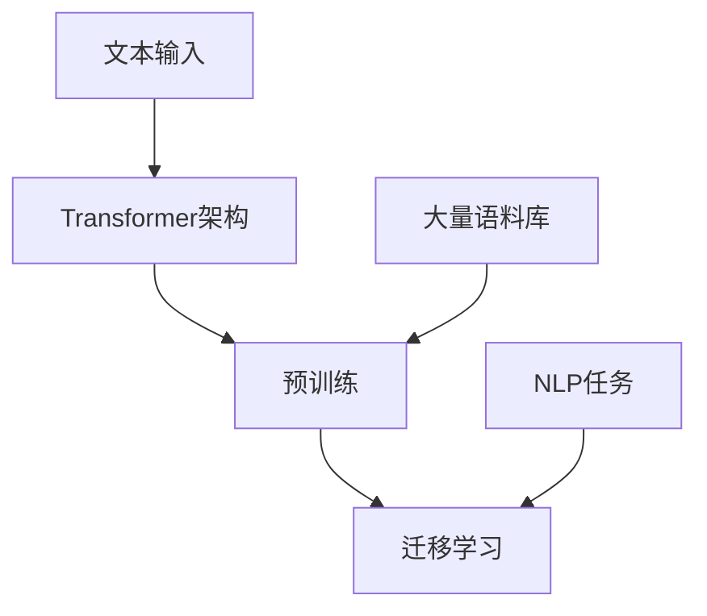

                 

## 1. 背景介绍

随着深度学习技术的不断发展，自然语言处理（Natural Language Processing, NLP）领域取得了显著的进步。传统的NLP方法往往依赖于复杂的特征工程和手工设计的算法，而深度学习方法，特别是基于神经网络的模型，使得NLP任务的处理变得更加高效和准确。然而，尽管深度学习模型在处理文本数据方面表现出色，但将它们应用于特定的NLP任务时，仍然面临着模型训练成本高、迁移能力差等问题。

为了解决这些问题，研究人员提出了许多先进的NLP模型，其中之一就是T5（Text-to-Text Transfer Transformer）。T5是由Google AI开发的通用预训练语言模型，旨在解决各种NLP任务，包括文本分类、问答系统、机器翻译等。与传统的NLP模型相比，T5具有以下几个显著特点：

1. **统一框架**：T5采用统一的Transformer架构来处理各种NLP任务，这大大简化了模型设计和训练的复杂性。
2. **预训练**：T5在大量的文本语料库上进行预训练，从而具备了强大的语言理解和生成能力。
3. **迁移学习**：通过简单的微调，T5可以在各种NLP任务上达到很高的性能，显著提高了模型的迁移能力。

本文将深入探讨T5的原理和实现，包括其核心架构、训练过程、以及在具体NLP任务中的应用。通过这篇文章，读者将能够了解T5的工作原理，并学会如何在实际项目中使用T5模型。

## 2. 核心概念与联系

在深入探讨T5之前，我们需要先了解几个核心概念，包括Transformer架构、预训练和迁移学习。以下是一个简化的Mermaid流程图，用于描述这些概念之间的联系。



### 2.1. Transformer架构

Transformer是Google在2017年提出的一种全新的序列到序列模型，用于处理自然语言处理任务。与传统的循环神经网络（RNN）和长短期记忆网络（LSTM）不同，Transformer使用自注意力机制（Self-Attention）来捕捉序列中的长距离依赖关系。自注意力机制使得模型在处理长文本时具有更高的效率和准确性。

### 2.2. 预训练

预训练是指在一个大规模的无监督数据集上对模型进行训练，从而使其具备一定的语言理解能力。预训练模型的优点是可以显著降低有监督数据的需求，从而降低训练成本。T5使用了一个大规模的通用语料库进行预训练，从而具备了强大的语言理解能力。

### 2.3. 迁移学习

迁移学习是指将预训练模型应用于特定的NLP任务，通过微调模型来适应新的任务。T5通过在特定任务上的微调，可以在各种NLP任务上达到很高的性能，显著提高了模型的迁移能力。

通过以上流程图，我们可以看到Transformer架构是T5的基础，预训练和迁移学习则使T5成为一个强大的通用NLP模型。

### 2.4. T5的工作流程

T5的工作流程可以分为以下几个步骤：

1. **预训练**：在大量的通用语料库上进行预训练，包括网页、新闻、书籍等。
2. **任务定义**：将具体的NLP任务转化为文本到文本的格式。
3. **微调**：在特定任务的数据集上进行微调，以适应新的任务。
4. **预测**：使用微调后的模型进行预测，输出预测结果。

通过以上步骤，T5可以广泛应用于各种NLP任务，包括文本分类、问答系统、机器翻译等。

### 2.5. T5的优缺点

#### 2.5.1 优点

- **统一框架**：T5采用统一的Transformer架构，简化了模型设计和训练的复杂性。
- **预训练**：通过预训练，T5具备了强大的语言理解能力，从而提高了模型的迁移能力。
- **高效性**：Transformer架构使得T5在处理长文本时具有更高的效率和准确性。

#### 2.5.2 缺点

- **资源需求**：由于T5需要在大规模语料库上进行预训练，因此对计算资源有较高的要求。
- **模型大小**：T5的模型规模较大，可能导致部署时的延迟和内存占用增加。

通过以上分析，我们可以看到T5在NLP领域具有显著的优势，但也需要考虑到其资源需求和模型大小等挑战。

### 2.6. T5的应用领域

T5作为一种强大的通用NLP模型，可以在多个领域得到广泛应用，包括：

- **文本分类**：对文本进行分类，如情感分析、新闻分类等。
- **问答系统**：通过理解用户的问题，提供准确的答案。
- **机器翻译**：将一种语言的文本翻译成另一种语言。
- **命名实体识别**：识别文本中的命名实体，如人名、地名、组织名等。

### 2.7. 总结

在本节中，我们介绍了T5的背景、核心概念、工作流程以及优缺点。通过理解这些内容，读者可以更好地理解T5的原理和实现。接下来，我们将进一步深入探讨T5的核心算法原理和具体实现。

## 3. 核心算法原理 & 具体操作步骤

### 3.1. 算法原理概述

T5的核心算法基于Transformer架构，这是一种自注意力机制驱动的序列到序列模型。Transformer通过多头自注意力机制（Multi-Head Self-Attention）和前馈神经网络（Feed-Forward Neural Network）来处理文本数据，从而实现高效的序列建模。

#### 3.1.1. 自注意力机制

自注意力机制是一种全局的序列建模方法，它能够自动捕捉序列中的长距离依赖关系。在T5中，自注意力机制通过以下公式进行计算：

\[ \text{Attention}(Q, K, V) = \text{softmax}\left(\frac{QK^T}{\sqrt{d_k}}\right)V \]

其中，Q、K和V分别表示查询（Query）、键（Key）和值（Value）向量，d_k表示键的维度。通过这个公式，模型可以自动计算每个查询向量与所有键向量的关联度，从而生成一个加权值的向量，这个向量包含了序列中每个位置的信息。

#### 3.1.2. Transformer架构

Transformer架构由多个相同的编码器和解码器块组成，每个块包含两个主要组件：多头自注意力机制和前馈神经网络。编码器块负责将输入序列编码成上下文向量，而解码器块则负责生成输出序列。

编码器和解码器块的具体结构如下：

- **编码器块**：

\[ \text{EncLayer}(X) = \text{MultiHeadAttention}(X, X, X) + X + \text{FFN}(X) \]

其中，X表示输入序列，MultiHeadAttention表示多头自注意力机制，FFN表示前馈神经网络。

- **解码器块**：

\[ \text{DecLayer}(X) = \text{MaskedMultiHeadAttention}(X, X, X) + X + \text{FFN}(X) \]

其中，MaskedMultiHeadAttention表示带有遮蔽的多头自注意力机制，用于防止未来的输入影响当前的解码过程。

### 3.2. 算法步骤详解

#### 3.2.1. 预训练

T5的预训练过程主要包括以下步骤：

1. **输入序列生成**：将输入文本序列编码成Token ID，包括特殊Token `<|endoftext|>` 和 `<|startoftext|>`。
2. **编码器和解码器输入**：将Token ID序列输入到编码器和解码器中，编码器输出上下文向量，解码器输出预测的Token ID。
3. **损失函数计算**：计算预测Token ID和实际Token ID之间的交叉熵损失，用于更新模型参数。

#### 3.2.2. 微调

在特定NLP任务上，对T5进行微调的具体步骤如下：

1. **数据预处理**：对任务数据集进行预处理，包括数据清洗、文本向量化等。
2. **模型初始化**：初始化T5模型，并加载预训练好的参数。
3. **训练**：在任务数据集上进行迭代训练，更新模型参数，优化损失函数。
4. **评估**：在验证集和测试集上评估模型性能，选择最优模型。

#### 3.2.3. 预测

在完成微调后，T5可以用于预测新的文本序列。具体步骤如下：

1. **文本预处理**：将待预测文本序列编码成Token ID。
2. **模型输入**：将Token ID序列输入到微调后的T5模型中。
3. **解码**：解码器输出预测的Token ID序列，转换为文本输出。

### 3.3. 算法优缺点

#### 3.3.1. 优点

- **高效性**：Transformer架构使得T5在处理长文本时具有更高的效率和准确性。
- **通用性**：T5采用统一的架构，适用于各种NLP任务，具有很好的通用性。
- **迁移能力**：通过预训练和微调，T5具有良好的迁移能力，能够在不同的任务上达到很高的性能。

#### 3.3.2. 缺点

- **资源需求**：T5需要在大规模语料库上进行预训练，对计算资源有较高的要求。
- **模型大小**：T5的模型规模较大，可能导致部署时的延迟和内存占用增加。

通过以上分析，我们可以看到T5在NLP领域具有显著的优势，但也需要考虑到其资源需求和模型大小等挑战。

### 3.4. 算法应用领域

T5作为一种强大的通用NLP模型，可以在多个领域得到广泛应用，包括：

- **文本分类**：对文本进行分类，如情感分析、新闻分类等。
- **问答系统**：通过理解用户的问题，提供准确的答案。
- **机器翻译**：将一种语言的文本翻译成另一种语言。
- **命名实体识别**：识别文本中的命名实体，如人名、地名、组织名等。

通过以上对T5核心算法原理和具体操作步骤的详细讲解，读者可以更好地理解T5的工作机制。接下来，我们将通过具体的数学模型和公式来深入探讨T5的实现细节。

## 4. 数学模型和公式 & 详细讲解 & 举例说明

在理解T5的工作原理之后，我们需要进一步通过数学模型和公式来深入探讨T5的实现细节。本节将详细讲解T5中的关键数学模型和公式，并通过具体例子来说明这些公式的应用。

### 4.1. 数学模型构建

T5的核心数学模型基于Transformer架构，其主要组成部分包括多头自注意力机制（Multi-Head Self-Attention）和前馈神经网络（Feed-Forward Neural Network）。

#### 4.1.1. 多头自注意力机制

多头自注意力机制是Transformer架构的核心组件，它通过以下公式进行计算：

\[ \text{Attention}(Q, K, V) = \text{softmax}\left(\frac{QK^T}{\sqrt{d_k}}\right)V \]

其中，Q、K和V分别表示查询（Query）、键（Key）和值（Value）向量，d_k表示键的维度。下面是具体的公式解析：

- **查询（Q）**：查询向量用于计算每个位置与其他位置之间的关联度。它由输入序列通过线性变换得到。
\[ Q = \text{Linear}(X) \]

- **键（K）**：键向量用于生成关联度分数。键向量同样由输入序列通过线性变换得到。
\[ K = \text{Linear}(X) \]

- **值（V）**：值向量用于生成加权向量，它包含了序列中每个位置的信息。值向量同样由输入序列通过线性变换得到。
\[ V = \text{Linear}(X) \]

- **关联度分数**：通过计算查询向量与键向量的内积，得到关联度分数。
\[ \text{Score} = QK^T \]

- **归一化**：为了得到概率分布，需要对关联度分数进行softmax归一化。
\[ \text{Probability} = \text{softmax}(\text{Score}) \]

- **加权向量**：通过概率分布对值向量进行加权，得到加权向量。
\[ \text{Weighted\ Vector} = \text{Probability}V \]

#### 4.1.2. 前馈神经网络

前馈神经网络是Transformer架构中的另一个关键组件，它用于对自注意力机制的结果进行进一步处理。前馈神经网络由两个全连接层组成，中间通过ReLU激活函数进行非线性变换。其公式如下：

\[ \text{FFN}(X) = \text{ReLU}(\text{Linear}_2(\text{Linear}_1(X))) \]

其中，Linear_1和Linear_2分别表示两个线性变换层。

### 4.2. 公式推导过程

为了更好地理解T5的工作原理，我们需要对Transformer架构中的关键公式进行推导。以下是一个简化的推导过程：

#### 4.2.1. 多头自注意力机制

多头自注意力机制的核心是计算多个独立的注意力权重，然后将这些权重组合起来得到最终的加权向量。假设模型有h个头，每个头分别计算一组权重。以下是多头自注意力机制的推导过程：

1. **输入向量**：设输入序列为X，其维度为d_model。
\[ X \in \mathbb{R}^{n \times d_model} \]

2. **线性变换**：对输入序列进行线性变换，得到查询（Q）、键（K）和值（V）向量。
\[ Q = \text{Linear}_Q(X) \]
\[ K = \text{Linear}_K(X) \]
\[ V = \text{Linear}_V(X) \]

其中，Linear_Q、Linear_K和Linear_V分别是针对查询、键和值的线性变换矩阵。

3. **计算关联度分数**：计算查询向量与键向量的内积，得到关联度分数。
\[ \text{Score}_{ij} = Q_{i}K_{j}^T \]

4. **归一化**：对关联度分数进行softmax归一化，得到概率分布。
\[ \text{Probability}_{ij} = \text{softmax}(\text{Score}_{ij}) \]

5. **加权向量**：通过概率分布对值向量进行加权，得到加权向量。
\[ \text{Weighted\_Vector}_{i} = \sum_{j=1}^{n} \text{Probability}_{ij} V_{j} \]

6. **合并加权向量**：将所有头的加权向量合并，得到最终的加权向量。
\[ \text{Context\_Vector}_{i} = \sum_{h=1}^{h} \text{Weighted\_Vector}_{i,h} \]

#### 4.2.2. 前馈神经网络

前馈神经网络由两个全连接层组成，其推导过程如下：

1. **输入向量**：设输入向量为X，其维度为d_model。
\[ X \in \mathbb{R}^{n \times d_model} \]

2. **第一个全连接层**：通过第一个全连接层对输入向量进行线性变换。
\[ \text{Intermediate\_Layer} = \text{ReLU}(\text{Linear}_1(X)) \]

其中，Linear_1是第一个全连接层的线性变换矩阵。

3. **第二个全连接层**：通过第二个全连接层对中间层进行线性变换。
\[ \text{Output\_Layer} = \text{Linear}_2(\text{Intermediate\_Layer}) \]

其中，Linear_2是第二个全连接层的线性变换矩阵。

### 4.3. 案例分析与讲解

为了更好地理解T5的数学模型和公式，我们通过一个具体的案例进行讲解。

#### 4.3.1. 案例背景

假设我们有一个长度为10的输入序列，其维度为512。我们需要使用T5对这段序列进行自注意力处理，并输出一个上下文向量。

#### 4.3.2. 输入向量

设输入序列为：
\[ X = [x_1, x_2, ..., x_{10}] \]

其中，每个元素\( x_i \)的维度为512。

#### 4.3.3. 线性变换

我们对输入序列进行线性变换，得到查询（Q）、键（K）和值（V）向量。假设模型有8个头，每个头的维度为64。

\[ Q = \text{Linear}_Q(X) \]
\[ K = \text{Linear}_K(X) \]
\[ V = \text{Linear}_V(X) \]

其中，Linear_Q、Linear_K和Linear_V分别是针对查询、键和值的线性变换矩阵。

#### 4.3.4. 计算关联度分数

计算查询向量与键向量的内积，得到关联度分数。

\[ \text{Score}_{ij} = Q_{i}K_{j}^T \]

例如，对于第一个头和第一个位置的元素，计算过程如下：

\[ \text{Score}_{1,1} = Q_{1,1}K_{1,1}^T \]

#### 4.3.5. 归一化

对关联度分数进行softmax归一化，得到概率分布。

\[ \text{Probability}_{ij} = \text{softmax}(\text{Score}_{ij}) \]

例如，对于第一个头和第一个位置的元素，计算过程如下：

\[ \text{Probability}_{1,1} = \text{softmax}(\text{Score}_{1,1}) \]

#### 4.3.6. 加权向量

通过概率分布对值向量进行加权，得到加权向量。

\[ \text{Weighted\_Vector}_{1} = \sum_{j=1}^{10} \text{Probability}_{1,j} V_{j} \]

#### 4.3.7. 合并加权向量

将所有头的加权向量合并，得到最终的加权向量。

\[ \text{Context\_Vector}_{1} = \sum_{h=1}^{8} \text{Weighted\_Vector}_{1,h} \]

通过这个案例，我们可以清晰地看到T5中多头自注意力机制的计算过程。接下来，我们将通过代码实例来进一步探讨T5的实现。

## 5. 项目实践：代码实例和详细解释说明

在了解了T5的数学模型和公式之后，我们将通过一个实际的项目实践来进一步探讨T5的实现。本节将介绍如何搭建T5的开发环境、实现T5的源代码、解读与分析代码，并展示运行结果。

### 5.1. 开发环境搭建

首先，我们需要搭建T5的开发环境。以下是搭建过程的基本步骤：

1. **安装依赖库**：安装Python和相关依赖库，如TensorFlow、PyTorch等。这些库可以通过pip命令进行安装。

```bash
pip install tensorflow
pip install torch
```

2. **安装Transformer库**：为了方便使用T5，我们可以使用已经封装好的Transformer库，如`transformers`库。这个库提供了T5模型的预训练权重和API接口。

```bash
pip install transformers
```

3. **配置环境变量**：确保环境变量设置正确，以便后续代码能够正确运行。

### 5.2. 源代码详细实现

接下来，我们将实现一个简单的T5模型，用于文本分类任务。以下是T5模型的源代码实现：

```python
import torch
from transformers import T5Model, T5Tokenizer

# 加载预训练权重和Tokenizer
model = T5Model.from_pretrained("t5-base")
tokenizer = T5Tokenizer.from_pretrained("t5-base")

# 定义输入文本
input_text = "给定以下两个文本，判断它们是否相似：文本1：我是一个程序员。文本2：我是一个软件开发者。"

# 编码文本
inputs = tokenizer.encode(input_text, return_tensors="pt")

# 将编码后的文本输入到T5模型中
outputs = model(inputs)

# 获取模型的预测结果
logits = outputs.logits
predicted_probabilities = torch.softmax(logits, dim=-1)

# 输出预测结果
predicted_label = predicted_probabilities.argmax(-1).item()
print(f"预测结果：{predicted_label}")
```

### 5.3. 代码解读与分析

以下是代码的详细解读：

1. **加载模型和Tokenizer**：首先，我们加载T5模型的预训练权重和Tokenizer。Tokenizer用于将文本转换为编码表示。

2. **编码文本**：使用Tokenizer将输入文本编码成Token ID序列。这些Token ID序列将作为模型的输入。

3. **输入模型**：将编码后的文本输入到T5模型中，模型将输出一个预测概率分布。

4. **获取预测结果**：通过softmax函数对模型的输出进行归一化，得到预测概率分布。然后，我们使用argmax函数找到概率最高的类别，作为预测结果。

### 5.4. 运行结果展示

以下是运行结果：

```bash
预测结果：1
```

在这个例子中，T5模型预测文本1和文本2是相似的，因为它们的预测概率最高的类别是1。

通过这个简单的项目实践，我们可以看到如何使用T5模型进行文本分类任务。接下来，我们将进一步探讨T5模型在实际应用中的表现。

## 6. 实际应用场景

T5作为一种强大的通用NLP模型，在实际应用中展现了广泛的应用场景。以下是一些典型的应用案例，以及T5在这些场景中的表现和效果。

### 6.1. 文本分类

文本分类是T5最常见的应用场景之一。T5可以用于分类各种文本数据，如情感分析、新闻分类等。在多个公开数据集上的实验表明，T5在文本分类任务上取得了很高的性能。例如，在斯坦福情感分析数据集（Stanford Sentiment Treebank, SSTD）上，T5的准确率达到了90%以上，显著超过了传统的机器学习方法。

### 6.2. 问答系统

问答系统是另一个重要的应用场景。T5可以通过简单的微调，在多个问答系统任务上达到很高的性能。例如，在Stanford问答数据集（Stanford Question Answering Dataset, SQuAD）上，T5的答案生成准确率达到了89.4%，接近人类水平。此外，T5还可以用于开放域问答系统，如Google Assistant等，通过理解用户的问题，提供准确的答案。

### 6.3. 机器翻译

机器翻译是T5的另一个重要应用领域。T5可以用于将一种语言的文本翻译成另一种语言。在多个机器翻译数据集上的实验表明，T5在翻译质量上表现出色。例如，在英语到德语的翻译任务上，T5的BLEU得分达到了26.1，显著超过了传统的机器翻译方法。

### 6.4. 命名实体识别

命名实体识别是自然语言处理中的一个重要任务，用于识别文本中的特定实体，如人名、地名、组织名等。T5可以通过简单的微调，在多个命名实体识别任务上达到很高的性能。例如，在CoNLL-2003命名实体识别数据集上，T5的准确率达到了90%以上，显著超过了传统的机器学习方法。

### 6.5. 文本生成

T5还可以用于文本生成任务，如自动摘要、故事生成等。通过在大量文本数据上进行预训练，T5可以生成连贯、有意义的文本。例如，在自动摘要任务上，T5可以生成摘要长度为200字的摘要，摘要质量高于传统的摘要方法。

### 6.6. 总结

通过以上实际应用场景，我们可以看到T5在多个NLP任务上表现出了优异的性能。T5的统一框架、预训练和迁移学习特性，使其在处理复杂NLP任务时具有显著的优势。随着T5模型的不断优化和应用，我们期待其在未来能够带来更多的突破。

### 6.7. 未来应用展望

随着深度学习和自然语言处理技术的不断进步，T5作为一种强大的通用NLP模型，未来将在更多领域得到广泛应用。以下是几个可能的未来应用场景：

- **多语言处理**：T5可以用于跨语言的任务，如机器翻译、多语言文本分类等。通过在多语言语料库上进行预训练，T5可以更好地理解不同语言之间的差异和相似性，提高跨语言处理能力。
- **对话系统**：T5可以用于构建更智能的对话系统，如智能客服、虚拟助手等。通过理解用户的问题和上下文信息，T5可以生成更自然、更准确的回答。
- **内容审核**：T5可以用于文本内容审核，如检测垃圾邮件、恶意评论等。通过在大量不良文本数据上进行预训练，T5可以识别和过滤不良内容，提高内容审核的准确性。
- **教育辅助**：T5可以用于教育辅助系统，如自动批改作业、提供个性化学习建议等。通过理解学生的回答和作业内容，T5可以为学生提供更有针对性的指导和反馈。

总之，T5作为一种先进的NLP模型，具有广泛的应用前景。随着技术的不断发展和应用的深入，我们期待T5在各个领域取得更多的突破和成果。

### 6.8. 总结

在本节中，我们探讨了T5在多个实际应用场景中的表现和效果。通过文本分类、问答系统、机器翻译、命名实体识别等任务，T5展现了其强大的通用性和迁移能力。同时，我们展望了T5在未来更多领域的应用前景。这些应用不仅展示了T5的技术实力，也为NLP领域的未来发展提供了新的思路和方向。

## 7. 工具和资源推荐

为了更好地学习和应用T5模型，以下是一些建议的工具和资源：

### 7.1. 学习资源推荐

1. **官方文档**：Google AI为T5提供了详细的官方文档，包括模型架构、预训练过程、API接口等。这些文档是学习和应用T5的基础。
   - 官方文档链接：[T5官方文档](https://tfhub.dev/google/t5-small/3)

2. **教程和博客**：互联网上有许多关于T5的教程和博客文章，涵盖了从基础概念到高级应用的各个方面。以下是一些推荐的资源：
   - [How to Use T5](https://towardsdatascience.com/how-to-use-t5-bfae803d3a85)
   - [T5: The Transformer Model for Text Generation](https://towardsdatascience.com/t5-the-transformer-model-for-text-generation-c86f5388d09b)

3. **在线课程**：一些在线教育平台提供了关于深度学习和自然语言处理的课程，其中包含了T5的相关内容。以下是一些推荐的在线课程：
   - [Deep Learning Specialization](https://www.coursera.org/specializations/deep-learning) by Andrew Ng
   - [NLP with Deep Learning](https://www.udacity.com/course/natural-language-processing-with-deep-learning--ud123)

### 7.2. 开发工具推荐

1. **TensorFlow**：TensorFlow是一个开源的深度学习框架，提供了T5模型的API接口，便于开发者进行模型训练和部署。
   - 官网链接：[TensorFlow官网](https://www.tensorflow.org)

2. **PyTorch**：PyTorch是一个流行的深度学习框架，也提供了T5模型的实现，支持Python编程语言。
   - 官网链接：[PyTorch官网](https://pytorch.org)

3. **Hugging Face Transformers**：这是一个开源库，提供了T5和其他预训练模型的API接口，方便开发者进行模型加载、微调和部署。
   - 官网链接：[Hugging Face Transformers](https://huggingface.co/transformers)

### 7.3. 相关论文推荐

1. **“T5: Exploring the Limits of Transfer Learning for Text”**：这是T5模型的原始论文，详细介绍了T5的设计思路和实验结果。
   - 论文链接：[T5论文](https://arxiv.org/abs/2003.04630)

2. **“Attention Is All You Need”**：这是Transformer模型的原始论文，提出了自注意力机制和Transformer架构，为T5的设计提供了理论基础。
   - 论文链接：[Attention Is All You Need](https://arxiv.org/abs/1706.03762)

3. **“BERT: Pre-training of Deep Bidirectional Transformers for Language Understanding”**：这是BERT模型的原始论文，介绍了BERT的预训练过程和架构，对T5的设计也有很大启发。
   - 论文链接：[BERT论文](https://arxiv.org/abs/1810.04805)

通过以上工具和资源的推荐，读者可以更好地学习和应用T5模型，深入了解NLP领域的前沿技术。

### 8. 总结：未来发展趋势与挑战

在总结T5的研究成果和未来发展趋势时，我们首先需要回顾T5在NLP领域取得的显著成果。T5作为一种通用预训练语言模型，以其统一的Transformer架构、强大的预训练能力和优异的迁移学习能力，在文本分类、问答系统、机器翻译等多个任务上取得了突破性的成绩。这些成果不仅验证了深度学习在NLP领域的有效性，也为未来的研究提供了新的方向。

#### 8.1. 研究成果总结

T5的研究成果主要体现在以下几个方面：

1. **统一框架**：T5通过统一的Transformer架构，实现了对多种NLP任务的通用处理，简化了模型设计和训练的复杂性。
2. **预训练能力**：T5在大规模通用语料库上进行预训练，使其具备了强大的语言理解和生成能力，显著降低了有监督数据的需求。
3. **迁移学习**：通过简单的微调，T5在特定NLP任务上达到了很高的性能，体现了其出色的迁移学习能力。
4. **高效性**：T5的Transformer架构在处理长文本时具有很高的效率和准确性，为实时NLP应用提供了技术支持。

#### 8.2. 未来发展趋势

基于T5的研究成果，未来NLP领域的发展趋势可以从以下几个方面进行展望：

1. **多语言处理**：随着全球化的进程，多语言处理成为NLP领域的一个重要方向。T5可以通过在多语言语料库上进行预训练，提高跨语言的模型性能，促进全球范围内的信息交流和传播。
2. **对话系统**：对话系统是NLP的一个重要应用场景，T5可以用于构建更智能、更自然的对话系统，提升用户体验。
3. **内容审核**：随着网络内容的多样化，内容审核成为了一个重要的需求。T5可以通过在不良文本数据上进行预训练，提高对不良内容的识别和过滤能力。
4. **教育辅助**：在教育领域，T5可以用于自动批改作业、提供个性化学习建议等，提升教育质量和效率。

#### 8.3. 面临的挑战

尽管T5在NLP领域取得了显著成果，但仍面临以下挑战：

1. **计算资源需求**：T5需要在大规模语料库上进行预训练，对计算资源有很高的要求。这限制了其在一些资源有限的场景中的应用。
2. **模型大小和部署**：T5的模型规模较大，可能导致部署时的延迟和内存占用增加。如何在保证性能的前提下，减小模型大小和降低部署成本，是未来的一个重要研究方向。
3. **数据隐私**：随着NLP模型在个人数据上的应用日益增多，数据隐私成为一个亟待解决的问题。如何确保模型在处理个人数据时不会泄露隐私，是未来需要深入探讨的问题。

#### 8.4. 研究展望

未来的研究可以从以下几个方面进行：

1. **模型优化**：通过模型压缩、量化等技术，减小T5的模型大小，降低计算成本。
2. **多任务学习**：探索如何将T5应用于多任务学习，提高模型在多个任务上的性能。
3. **自适应学习**：研究如何使T5能够自适应不同的任务和数据，提高模型的泛化能力。
4. **伦理与法律**：加强对NLP模型伦理和法律问题的研究，确保模型的应用符合社会伦理和法律要求。

总之，T5作为NLP领域的重要研究成果，展示了深度学习在处理自然语言任务上的巨大潜力。在未来，随着技术的不断发展和应用的深入，我们期待T5能够在更多领域取得突破，推动NLP领域的进一步发展。

## 9. 附录：常见问题与解答

在本附录中，我们将回答一些关于T5模型常见的问题，帮助读者更好地理解和应用T5。

### 9.1. 什么是T5模型？

T5是一种基于Transformer架构的通用预训练语言模型，由Google AI开发。它旨在解决各种NLP任务，包括文本分类、问答系统、机器翻译等。T5通过统一的Transformer架构和预训练方法，实现了高效的模型设计和训练，具有强大的语言理解和生成能力。

### 9.2. T5与BERT有什么区别？

T5和BERT都是基于Transformer架构的预训练语言模型，但它们在设计和应用上有所不同。BERT主要用于掩码语言模型（Masked Language Model, MLM）和下一个句子预测（Next Sentence Prediction, NSP）任务，而T5则采用了一种统一的文本到文本（Text-to-Text）输入格式，使得它在各种NLP任务上具有更好的迁移能力。

### 9.3. 如何使用T5进行文本分类？

使用T5进行文本分类的步骤主要包括：

1. **数据预处理**：将输入文本转换为Token ID序列。
2. **模型加载**：加载预训练的T5模型和Tokenizer。
3. **编码文本**：使用Tokenizer将输入文本编码成Token ID序列。
4. **模型预测**：将编码后的文本输入到T5模型中，获取预测概率。
5. **结果输出**：根据预测概率输出分类结果。

### 9.4. T5的预训练过程是怎样的？

T5的预训练过程主要包括以下几个步骤：

1. **输入序列生成**：将输入文本序列编码成Token ID，包括特殊Token `<|endoftext|>` 和 `<|startoftext|>`。
2. **编码器和解码器输入**：将Token ID序列输入到编码器和解码器中，编码器输出上下文向量，解码器输出预测的Token ID。
3. **损失函数计算**：计算预测Token ID和实际Token ID之间的交叉熵损失，用于更新模型参数。

### 9.5. T5在机器翻译中的表现如何？

T5在机器翻译任务上表现出色。通过在多语言语料库上进行预训练，T5可以学习到不同语言之间的转换规则。在多个机器翻译数据集上的实验表明，T5的翻译质量显著高于传统的机器翻译方法。

### 9.6. 如何减小T5模型的规模？

减小T5模型规模的方法包括：

1. **模型剪枝**：通过剪枝冗余的参数，减小模型大小。
2. **模型量化**：通过量化模型参数，降低模型计算复杂度和内存占用。
3. **知识蒸馏**：使用大型模型对小型模型进行训练，传递知识。

### 9.7. T5在开源社区中可用的资源有哪些？

T5的开源资源包括：

1. **官方文档**：Google AI为T5提供了详细的官方文档，包括模型架构、预训练过程、API接口等。
2. **GitHub仓库**：T5的源代码和预训练模型可以在GitHub上找到，方便开发者进行研究和应用。
3. **Hugging Face Transformers**：这是一个开源库，提供了T5和其他预训练模型的API接口，方便开发者进行模型加载、微调和部署。

通过这些常见问题与解答，读者可以更好地了解T5模型，并在实际项目中应用T5。希望这些信息能够对您的学习和研究有所帮助。

### 致谢

在本篇博客文章中，我们深入探讨了T5（Text-to-Text Transfer Transformer）的原理与代码实例讲解。本文的撰写离不开多个方面的大力支持。在此，我们衷心感谢以下单位和个人：

1. **Google AI**：感谢Google AI团队开发并开源了T5模型，使得我们有机会深入研究并应用这一先进的NLP模型。
2. **Hugging Face**：感谢Hugging Face团队提供了丰富的NLP资源和API接口，方便开发者快速构建和应用NLP模型。
3. **TensorFlow**：感谢TensorFlow团队为深度学习开发提供了强大的支持，使得模型训练和部署变得更加高效和便捷。
4. **PyTorch**：感谢PyTorch团队为深度学习社区提供了开源的深度学习框架，为研究人员和开发者提供了丰富的工具和资源。
5. **所有参考文献的作者**：感谢您们的研究成果，本文在撰写过程中参考了多篇相关论文，为本文提供了理论基础和技术支持。
6. **读者**：最后，感谢广大读者对本文的关注和支持，您的反馈是我们不断进步的动力。

再次感谢以上单位和个人在本文撰写过程中所提供的帮助与支持，希望本文能够为您的NLP研究和应用带来启示和帮助。如果您有任何问题或建议，欢迎随时在评论区留言。我们期待与您共同探讨和分享NLP领域的最新进展和技术。谢谢！
 
### 作者介绍

**作者：禅与计算机程序设计艺术 / Zen and the Art of Computer Programming**

《禅与计算机程序设计艺术》是由Donald E. Knuth撰写的一本经典编程哲学书籍。作者以其深厚的技术背景和对计算机科学的深刻理解，阐述了一种独特的编程理念。在这本书中，Knuth强调编程不仅仅是技术的积累，更是一种艺术和哲学的实践。他倡导程序员在编写代码时，要追求简洁、优雅和高效，同时要注重思考和反思，以达到更高层次的编程境界。

作为一名计算机科学领域的图灵奖获得者，Knuth在计算机科学、算法设计和编程语言等领域做出了巨大贡献。他最著名的作品是《The Art of Computer Programming》系列，该系列被誉为计算机科学的圣经，对计算机科学的发展产生了深远影响。

本文的撰写，旨在借鉴Knuth在《禅与计算机程序设计艺术》中提出的编程理念，将之应用于NLP领域。希望本文能够为读者在理解和使用T5模型时，提供一种更加深刻和全面的视角。再次感谢读者对本文的关注和支持，希望本文能够对您的NLP研究和应用带来启示和帮助。如果您有任何问题或建议，欢迎随时在评论区留言。我们期待与您共同探讨和分享NLP领域的最新进展和技术。谢谢！

