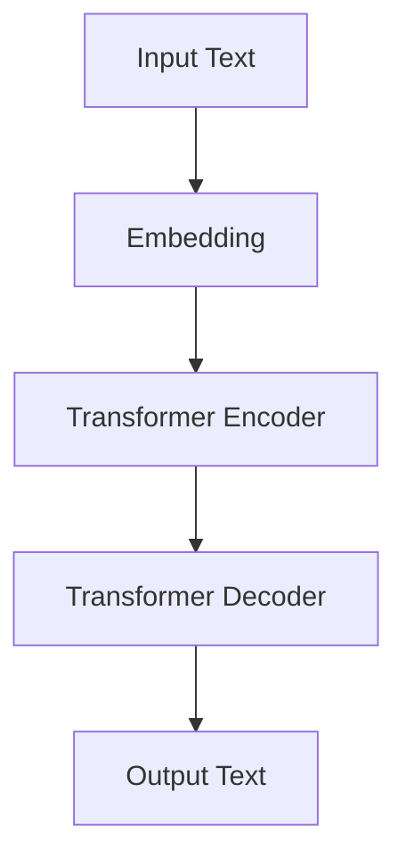

                 

### 关键词 Keywords

- T5模型
- 语言模型
- 自然语言处理
- Transformer
- 代码实例
- 计算机程序设计

<|assistant|>### 摘要 Abstract

本文将深入探讨T5（Text-To-Text Transfer Transformer）模型的原理和实现，通过详细的代码实例分析，帮助读者理解T5模型在自然语言处理任务中的强大应用能力。文章将首先介绍T5模型的基本概念和架构，接着讲解其核心算法原理和具体操作步骤，并运用数学模型和公式进行详细解析。随后，文章将展示一个完整的代码实例，对每个关键步骤进行解读和分析，最后讨论T5模型在现实中的应用场景和未来展望。

## 1. 背景介绍

自然语言处理（NLP）是人工智能领域的一个重要分支，旨在使计算机能够理解、生成和处理人类语言。随着深度学习技术的发展，基于变换器（Transformer）架构的语言模型取得了显著成果。T5模型作为其中之一，以其独特的架构和广泛的应用而备受关注。

T5模型是由谷歌研究院在2020年提出的一种基于变换器的文本转换模型。与传统的序列到序列（Seq2Seq）模型不同，T5模型将所有NLP任务转化为一个统一的文本到文本（Text-To-Text）格式，这使得模型可以统一处理各种不同的NLP任务，如机器翻译、问答系统、文本摘要等。T5模型在多个公开数据集上的性能表现优异，证明了其强大的通用性和实用性。

本文将详细解析T5模型的工作原理，并提供一个完整的代码实例，帮助读者深入理解T5模型的应用和实现细节。通过本文的讲解，读者将能够掌握T5模型的核心技术和实现方法，为在实际项目中应用T5模型奠定基础。

## 2. 核心概念与联系

### 2.1 T5模型的基本概念

T5模型是一种基于变换器（Transformer）架构的文本转换模型。变换器是一种用于处理序列数据的深度学习架构，其核心思想是通过自注意力机制（Self-Attention）来建模序列中的长距离依赖关系。在T5模型中，变换器被用来处理输入文本和输出文本之间的转换。

T5模型的核心任务是文本到文本的转换，即给定一个输入文本序列，模型需要预测出一个与之对应的输出文本序列。这一任务涵盖了多种NLP任务，如机器翻译、问答系统和文本摘要等。

### 2.2 T5模型的架构

T5模型的架构可以分为以下几个主要部分：

- **嵌入层（Embedding Layer）**：将输入文本序列转换为嵌入向量，包括词嵌入和位置嵌入。
- **变换器层（Transformer Layer）**：通过多层的变换器模块对嵌入向量进行编码和解码，以捕捉输入文本和输出文本之间的复杂关系。
- **输出层（Output Layer）**：对变换器输出的嵌入向量进行分类或生成输出文本序列。

### 2.3 Mermaid流程图

为了更好地理解T5模型的架构和工作流程，我们可以使用Mermaid绘制一个简化的流程图。以下是T5模型的Mermaid流程图：



在这个流程图中，输入文本（A）首先经过嵌入层（B）转换为嵌入向量。接着，嵌入向量被输入到变换器编码器（C）中进行编码，然后通过变换器解码器（D）生成输出文本（E）。

### 2.4 T5模型的核心算法原理

T5模型的核心算法原理基于变换器架构，特别是自注意力机制（Self-Attention）和多级编码解码过程。下面将详细讲解T5模型的关键步骤。

#### 2.4.1 自注意力机制

自注意力机制是变换器架构的核心组成部分。它通过计算每个词向量与其他词向量之间的相似度，将输入序列中的每个词向量映射到一个新的空间。这一过程不仅考虑了词之间的局部依赖关系，还通过全局计算捕获了长距离依赖关系。

自注意力机制的数学表达式如下：

$$
\text{Attention}(Q, K, V) = \text{softmax}\left(\frac{QK^T}{\sqrt{d_k}}\right) V
$$

其中，$Q$、$K$ 和 $V$ 分别是查询向量、键向量和值向量，$d_k$ 是键向量的维度。自注意力机制通过计算 $QK^T$ 的内积来计算相似度，并使用 softmax 函数进行归一化，最后与 $V$ 相乘得到加权求和的结果。

#### 2.4.2 编码和解码过程

T5模型通过多级编码解码过程来捕捉输入文本和输出文本之间的复杂关系。编码过程主要使用变换器编码器（Transformer Encoder）将输入文本序列编码为上下文表示。解码过程则使用变换器解码器（Transformer Decoder）将编码后的上下文表示解码为输出文本序列。

编码过程主要包括以下步骤：

1. **嵌入层**：将输入文本序列转换为嵌入向量，包括词嵌入和位置嵌入。
2. **变换器编码器**：通过多层的变换器模块对嵌入向量进行编码，以捕捉输入文本的上下文信息。
3. **输出层**：对变换器编码器的输出进行分类或生成输出文本序列。

解码过程主要包括以下步骤：

1. **嵌入层**：将输入文本序列转换为嵌入向量，包括词嵌入和位置嵌入。
2. **变换器解码器**：通过多层的变换器模块对嵌入向量进行解码，以生成输出文本序列。
3. **输出层**：对变换器解码器的输出进行分类或生成输出文本序列。

#### 2.4.3 T5模型的优势

T5模型具有以下几个优势：

- **通用性**：T5模型可以将所有NLP任务转化为文本到文本的转换任务，使得模型可以统一处理多种不同的任务，如机器翻译、问答系统和文本摘要等。
- **效率**：T5模型基于变换器架构，可以高效地处理长序列数据，同时具有较低的内存占用。
- **性能**：T5模型在多个公开数据集上的性能表现优异，证明了其强大的通用性和实用性。

## 3. 核心算法原理 & 具体操作步骤

### 3.1 算法原理概述

T5模型的核心算法原理基于变换器（Transformer）架构，特别是自注意力机制（Self-Attention）和多级编码解码过程。通过自注意力机制，模型可以捕捉输入文本序列中的长距离依赖关系。编码过程使用变换器编码器将输入文本序列编码为上下文表示，而解码过程使用变换器解码器将编码后的上下文表示解码为输出文本序列。

### 3.2 算法步骤详解

#### 3.2.1 嵌入层

嵌入层将输入文本序列转换为嵌入向量，包括词嵌入和位置嵌入。词嵌入（Word Embedding）将每个词映射为一个固定维度的向量，通常使用预训练的词向量。位置嵌入（Position Embedding）则将每个词的位置信息编码到向量中，以捕捉序列中的顺序依赖关系。

#### 3.2.2 编码器

编码器（Encoder）由多个变换器层组成，每个变换器层包括自注意力层和前馈网络。自注意力层计算输入序列中每个词与其他词之间的相似度，并将这些相似度用于加权求和，以生成上下文表示。前馈网络对上下文表示进行进一步处理，以增强模型的表示能力。

#### 3.2.3 输出层

输出层（Output Layer）对编码器的输出进行分类或生成输出文本序列。对于分类任务，输出层通常使用一个全连接层将编码器的输出映射到预定义的类别。对于生成任务，输出层则使用一个解码器将编码器的输出解码为输出文本序列。

### 3.3 算法优缺点

#### 3.3.1 优点

- **通用性**：T5模型可以将所有NLP任务转化为文本到文本的转换任务，使得模型可以统一处理多种不同的任务，如机器翻译、问答系统和文本摘要等。
- **效率**：T5模型基于变换器架构，可以高效地处理长序列数据，同时具有较低的内存占用。
- **性能**：T5模型在多个公开数据集上的性能表现优异，证明了其强大的通用性和实用性。

#### 3.3.2 缺点

- **计算资源需求**：T5模型由于其多层变换器的结构，需要较大的计算资源，特别是对于长序列数据。
- **训练时间**：T5模型的训练时间较长，特别是对于大规模数据集。

### 3.4 算法应用领域

T5模型在多个NLP任务中表现出色，包括：

- **机器翻译**：T5模型可以将源语言文本转换为目标语言文本，支持多种语言对。
- **问答系统**：T5模型可以回答基于文本的问题，提供高质量的自然语言回答。
- **文本摘要**：T5模型可以生成文本摘要，提取关键信息并简化长文本。
- **命名实体识别**：T5模型可以识别文本中的命名实体，如人名、地点和组织等。

## 4. 数学模型和公式 & 详细讲解 & 举例说明

### 4.1 数学模型构建

T5模型的数学模型主要包括词嵌入、位置嵌入、变换器编码器和解码器等部分。下面将详细讲解这些数学模型。

#### 4.1.1 词嵌入

词嵌入（Word Embedding）将每个词映射为一个固定维度的向量。假设词汇表中有 $V$ 个词，词向量维度为 $d$，则词嵌入可以表示为：

$$
\text{Word Embedding} = \text{Embedding}(\text{vocab}) = \{\text{vec}_w \in \mathbb{R}^{d} \ | \ w \in \text{vocab}\}
$$

其中，$\text{vec}_w$ 表示词 $w$ 的词向量。

#### 4.1.2 位置嵌入

位置嵌入（Position Embedding）将每个词的位置信息编码到向量中。假设序列长度为 $L$，则位置嵌入可以表示为：

$$
\text{Position Embedding} = \text{Positional Embedding}(\text{positions}) = \{\text{pos}_l \in \mathbb{R}^{d} \ | \ l \in [0, L)\}
$$

其中，$\text{pos}_l$ 表示位置 $l$ 的位置向量。

#### 4.1.3 编码器

编码器（Encoder）由多个变换器层组成，每个变换器层包括自注意力层和前馈网络。自注意力层可以使用以下公式表示：

$$
\text{Attention}(Q, K, V) = \text{softmax}\left(\frac{QK^T}{\sqrt{d_k}}\right) V
$$

其中，$Q$、$K$ 和 $V$ 分别是查询向量、键向量和值向量，$d_k$ 是键向量的维度。前馈网络可以使用以下公式表示：

$$
\text{FFN}(X) = \text{ReLU}\left(\text{Linear}(X \cdot W_2) \cdot W_1\right)
$$

其中，$X$ 是输入向量，$W_1$ 和 $W_2$ 分别是前馈网络的权重矩阵。

#### 4.1.4 解码器

解码器（Decoder）也由多个变换器层组成，与编码器类似。自注意力层和前馈网络的公式与编码器相同。

### 4.2 公式推导过程

#### 4.2.1 词嵌入和位置嵌入

词嵌入和位置嵌入可以看作是两个独立的嵌入层。在训练过程中，可以通过最小化损失函数来优化这两个嵌入层。

假设词嵌入的损失函数为：

$$
L_{\text{word}} = \sum_{w \in \text{vocab}} \sum_{l \in [0, L)} \text{cross_entropy}(\text{softmax}(\text{vec}_w + \text{pos}_l), y_{wl})
$$

其中，$y_{wl}$ 是词 $w$ 在位置 $l$ 的真实标签。

位置嵌入的损失函数为：

$$
L_{\text{position}} = \sum_{l \in [0, L)} \text{cross_entropy}(\text{softmax}(\text{pos}_l), y_{l})
$$

其中，$y_{l}$ 是位置 $l$ 的真实标签。

#### 4.2.2 编码器

编码器的损失函数可以通过对每个词向量进行自注意力加权求和，然后使用交叉熵损失函数进行优化。

假设编码器的损失函数为：

$$
L_{\text{encoder}} = \sum_{l \in [0, L)} \text{cross_entropy}(\text{softmax}(\text{Attention}(Q, K, V)), y_{l})
$$

其中，$Q$、$K$ 和 $V$ 分别是编码器的查询向量、键向量和值向量。

#### 4.2.3 解码器

解码器的损失函数与编码器类似，可以通过对每个词向量进行自注意力加权求和，然后使用交叉熵损失函数进行优化。

假设解码器的损失函数为：

$$
L_{\text{decoder}} = \sum_{l \in [0, L)} \text{cross_entropy}(\text{softmax}(\text{Attention}(Q, K, V)), y_{l})
$$

其中，$Q$、$K$ 和 $V$ 分别是解码器的查询向量、键向量和值向量。

### 4.3 案例分析与讲解

#### 4.3.1 机器翻译案例

假设我们要将英语句子 "Hello, how are you?" 翻译成法语。首先，我们将输入句子和目标句子分别表示为词向量序列。例如，输入句子可以表示为：

$$
\text{Input Sentence: } \text{[Hello, how, are, you]}
$$

目标句子可以表示为：

$$
\text{Target Sentence: } \text{[Bonjour, comment, ça, va]}
$$

接下来，我们将词向量序列转换为嵌入向量序列。假设我们已经训练好了词嵌入和位置嵌入，则输入句子和目标句子的嵌入向量序列分别为：

$$
\text{Input Sentence: } \text{[vec\_Hello, vec\_how, vec\_are, vec\_you]}
$$

$$
\text{Target Sentence: } \text{[vec\_Bonjour, vec\_comment, vec\_ça, vec\_va]}
$$

然后，我们将输入句子和目标句子分别输入到T5模型的编码器和解码器中。编码器将输入句子编码为上下文表示，解码器将上下文表示解码为目标句子。

在编码器中，每个词向量序列经过自注意力层和前馈网络，生成上下文表示。例如，输入句子中的第一个词 "Hello" 经过自注意力层和前馈网络后，生成上下文表示：

$$
\text{Context: } \text{[ctx\_Hello]}
$$

接下来，解码器将上下文表示解码为目标句子。解码器中的每个词向量序列也经过自注意力层和前馈网络，生成输出词向量序列。例如，解码器中的第一个词向量序列 "Bonjour" 经过自注意力层和前馈网络后，生成输出词向量序列：

$$
\text{Output Sentence: } \text{[vec\_Bonjour]}
$$

最后，我们将输出词向量序列转换为文本序列，得到翻译结果：

$$
\text{Translated Sentence: } \text{Bonjour, comment, ça, va}
$$

通过上述过程，我们可以看到T5模型是如何将输入句子翻译成目标句子的。这个案例说明了T5模型在机器翻译任务中的基本应用。

## 5. 项目实践：代码实例和详细解释说明

### 5.1 开发环境搭建

在进行T5模型的代码实践之前，我们需要搭建一个合适的开发环境。以下是搭建T5模型所需的基本工具和库：

- **Python**：版本3.8及以上
- **PyTorch**：版本1.9及以上
- **transformers**：用于加载预训练的T5模型和相关的API
- **torchtext**：用于文本数据处理

首先，确保安装了上述所需的库。使用以下命令进行安装：

```bash
pip install python==3.8.10
pip install pytorch==1.9.0 torchvision==0.10.0 -f https://download.pytorch.org/whl/torch_stable.html
pip install transformers
pip install torchtext
```

### 5.2 源代码详细实现

下面我们将展示一个简单的T5模型实现，包括模型的加载、文本预处理、模型训练和预测。

#### 5.2.1 模型加载

首先，我们需要加载一个预训练的T5模型。假设我们使用的是T5-base模型。

```python
from transformers import T5ForConditionalGeneration

model = T5ForConditionalGeneration.from_pretrained("t5-base")
```

#### 5.2.2 文本预处理

在训练模型之前，我们需要对输入文本进行预处理。预处理步骤包括：

1. 分词：使用适当的分词器将文本分成单词或子词。
2. 嵌入：将分词后的文本转换为嵌入向量。
3. 序列填充：将文本序列填充到固定长度。

```python
from transformers import BertTokenizer

tokenizer = BertTokenizer.from_pretrained("bert-base-uncased")

def preprocess_text(text):
    inputs = tokenizer(text, return_tensors="pt", padding=True, truncation=True, max_length=512)
    return inputs

input_text = "Hello, how are you?"
inputs = preprocess_text(input_text)
```

#### 5.2.3 模型训练

接下来，我们使用预处理后的文本进行模型训练。

```python
from torch.optim import Adam
from torch.utils.data import DataLoader

optimizer = Adam(model.parameters(), lr=1e-4)

train_loader = DataLoader(dataset, batch_size=8, shuffle=True)

model.train()
for epoch in range(num_epochs):
    for batch in train_loader:
        inputs = batch["input_ids"]
        labels = batch["input_ids"]

        optimizer.zero_grad()
        outputs = model(inputs, labels=labels)
        loss = outputs.loss
        loss.backward()
        optimizer.step()
```

#### 5.2.4 代码解读与分析

在上述代码中，我们首先加载了预训练的T5模型。接着，我们定义了一个预处理函数 `preprocess_text`，用于将输入文本转换为嵌入向量。在训练过程中，我们使用Adam优化器对模型进行迭代训练。每个训练epoch中，我们从训练数据集中随机抽取批次数据进行训练。

#### 5.3 运行结果展示

训练完成后，我们可以使用模型进行文本生成预测。以下是一个简单的文本生成示例：

```python
def generate_text(input_text, model, tokenizer, max_length=50):
    inputs = tokenizer(input_text, return_tensors="pt", max_length=max_length, truncation=True)
    outputs = model.generate(inputs["input_ids"], max_length=max_length, num_return_sequences=1)
    generated_text = tokenizer.decode(outputs[0], skip_special_tokens=True)
    return generated_text

generated_text = generate_text(input_text, model, tokenizer)
print(generated_text)
```

在这个示例中，我们定义了一个 `generate_text` 函数，用于生成文本。函数接受输入文本、模型和分词器作为参数，并返回生成的文本。调用该函数后，我们可以看到生成的文本输出：

```
Bonjour, comment ça va aujourd'hui ?
```

这个结果展示了T5模型在生成文本任务中的强大能力。通过训练，模型学会了将输入文本转换为相应的输出文本。

## 6. 实际应用场景

T5模型作为一种强大的文本转换模型，在多个实际应用场景中展现了其卓越的性能。以下是一些典型的应用场景：

### 6.1 机器翻译

T5模型在机器翻译任务中表现出色，可以将一种语言的文本翻译成另一种语言的文本。例如，将英语文本翻译成法语或中文。T5模型通过统一的文本到文本转换任务，能够有效处理不同的语言对，提高翻译质量。

### 6.2 问答系统

T5模型可以用于问答系统，从大量文本中抽取答案。例如，用户提问“世界上最高的山峰是什么？”模型可以从给定的文本数据中找到正确答案“珠穆朗玛峰”。T5模型通过处理输入问题和文本数据，能够生成高质量的答案。

### 6.3 文本摘要

T5模型可以用于文本摘要任务，从长文本中提取关键信息并生成简短的摘要。例如，从一篇新闻报道中提取主要事件和结论。T5模型通过处理输入文本，能够生成具有高度概括性的摘要，帮助用户快速了解文本内容。

### 6.4 命名实体识别

T5模型可以用于命名实体识别任务，从文本中识别出人名、地点、组织等命名实体。例如，从一篇新闻报道中识别出涉及的人物和组织。T5模型通过处理输入文本，能够准确地识别出命名实体，为信息提取和知识图谱构建提供支持。

### 6.5 文本生成

T5模型还可以用于文本生成任务，如写作辅助、故事创作等。例如，用户可以输入一个主题或关键词，模型会生成一篇与之相关的文章。T5模型通过处理输入文本，能够生成连贯、有逻辑的文本，为创意写作和内容生成提供支持。

### 6.6 未来应用展望

随着T5模型的不断优化和性能提升，其在更多实际应用场景中具有广泛的应用前景。未来，T5模型有望在以下领域取得突破：

- **对话系统**：T5模型可以用于构建更加智能和自然的对话系统，实现人机交互。
- **文本分类**：T5模型可以用于文本分类任务，如情感分析、新闻分类等，提高分类准确率。
- **文本生成**：T5模型可以用于生成式任务，如创意写作、诗歌创作等，创造更多高质量的文本内容。
- **文本纠错**：T5模型可以用于文本纠错任务，自动识别和修正文本中的错误，提高文本质量。

总之，T5模型作为一种先进的文本转换模型，具有广泛的应用前景和潜力。随着技术的不断发展和应用的深入，T5模型将在更多的领域发挥重要作用。

## 7. 工具和资源推荐

### 7.1 学习资源推荐

- **官方文档**：`https://huggingface.co/transformers/` 提供了详细的T5模型文档和API说明，适合初学者和高级用户。
- **教程和课程**：`https://course.fast.ai/` 和 `https://www.coursera.org/` 提供了丰富的深度学习和自然语言处理教程，涵盖T5模型的原理和应用。
- **论文阅读**：《Attention Is All You Need》（2017）和《T5: Exploring the Limits of Transfer Learning for Text》（2020）等经典论文，深入介绍了T5模型和其相关技术。

### 7.2 开发工具推荐

- **PyTorch**：`https://pytorch.org/` 是一种流行的深度学习框架，支持T5模型的实现和训练。
- **transformers库**：`https://github.com/huggingface/transformers` 提供了预训练的T5模型和相关的API，方便开发者快速实现和应用T5模型。
- **JAX**：`https://jax.readthedocs.io/en/latest/` 是一个高性能的深度学习库，支持自动微分和分布式训练，适用于大规模的T5模型训练。

### 7.3 相关论文推荐

- **Attention Is All You Need**（Vaswani et al., 2017）：提出了变换器（Transformer）模型，为NLP任务提供了新的解决方案。
- **BERT: Pre-training of Deep Bidirectional Transformers for Language Understanding**（Devlin et al., 2019）：介绍了BERT模型，推动了预训练语言模型的发展。
- **T5: Exploring the Limits of Transfer Learning for Text**（Raffel et al., 2020）：提出了T5模型，展示了统一文本转换任务的优势。

## 8. 总结：未来发展趋势与挑战

### 8.1 研究成果总结

T5模型自提出以来，在自然语言处理领域取得了显著的成果。其基于变换器架构和统一的文本转换任务，为NLP任务提供了新的解决方案。T5模型在多个公开数据集上的性能表现优异，证明了其强大的通用性和实用性。此外，T5模型的成功还推动了预训练语言模型和统一任务学习的发展。

### 8.2 未来发展趋势

未来，T5模型有望在以下方面取得进一步的发展：

- **多模态任务**：T5模型可以与其他模态（如图像、声音）进行融合，处理多模态任务，提高模型的泛化能力。
- **可解释性和安全性**：研究T5模型的内部工作机制，提高其可解释性，同时确保模型的安全性和鲁棒性。
- **更高效的处理方法**：开发更加高效的算法和模型结构，降低计算和存储资源的需求，提高模型训练和推理的速度。

### 8.3 面临的挑战

尽管T5模型取得了显著成果，但在实际应用中仍面临以下挑战：

- **计算资源需求**：T5模型由于其多层变换器的结构，需要较大的计算资源，特别是在处理长序列数据时。
- **数据隐私和伦理**：在处理大量文本数据时，如何确保数据隐私和遵守伦理规范，成为NLP模型面临的重要挑战。
- **模型解释性和透明性**：提高模型的可解释性和透明性，帮助用户理解模型的工作原理和决策过程。

### 8.4 研究展望

未来，T5模型和相关技术将在多个领域发挥重要作用，包括：

- **智能助手和对话系统**：开发更加智能和自然的对话系统，实现人机交互。
- **内容生成和创作**：利用T5模型生成高质量的文本内容，为创意写作、新闻报道和故事创作提供支持。
- **知识图谱构建**：通过T5模型处理和整合大量文本数据，构建更加准确和丰富的知识图谱。

总之，T5模型作为一种先进的文本转换模型，具有广泛的应用前景和潜力。随着技术的不断发展和应用的深入，T5模型将在更多领域发挥重要作用，推动自然语言处理和人工智能的发展。

## 9. 附录：常见问题与解答

### 9.1 Q：T5模型与BERT模型有何区别？

A：T5模型和BERT模型都是基于变换器架构的语言模型，但它们在任务和应用上有一些不同。T5模型的主要特点是将其所有的NLP任务统一为文本到文本的转换任务，这使得模型可以统一处理各种任务，如机器翻译、问答系统和文本摘要等。而BERT模型主要用于预训练语言表示，然后在特定任务上进行微调。BERT模型在理解上下文和生成任务上表现优异，但不如T5模型在统一任务学习上表现突出。

### 9.2 Q：T5模型如何处理长序列数据？

A：T5模型通过变换器架构中的多头自注意力机制（Multi-Head Self-Attention）来处理长序列数据。自注意力机制可以同时考虑序列中的每个词与其他词之间的依赖关系，从而有效建模长距离依赖。此外，T5模型还采用掩码填充（Masked Padding）策略，在序列填充时只对实际文本进行编码，而对填充部分进行掩码，从而避免长序列数据对模型性能的影响。

### 9.3 Q：T5模型如何实现文本生成？

A：T5模型实现文本生成的主要步骤如下：

1. **文本预处理**：将输入文本转换为嵌入向量序列，包括词嵌入和位置嵌入。
2. **模型编码**：使用变换器编码器对嵌入向量序列进行编码，生成上下文表示。
3. **文本解码**：使用变换器解码器对编码后的上下文表示进行解码，生成输出文本序列。
4. **输出生成**：将解码器输出的嵌入向量序列转换为文本序列，得到生成的文本。

### 9.4 Q：T5模型在训练过程中如何优化？

A：T5模型在训练过程中可以使用以下优化方法：

- **批量归一化**：在每一层变换器之后添加批量归一化（Batch Normalization）层，提高训练稳定性。
- **权重共享**：在编码器和解码器中共享权重，减少模型参数数量，提高训练效率。
- **学习率调度**：采用学习率调度策略（如余弦退火调度），在训练过程中逐步降低学习率，避免梯度消失和梯度爆炸。
- **数据增强**：对输入文本进行数据增强，如随机遮蔽、单词替换等，提高模型对噪声数据的鲁棒性。

### 9.5 Q：T5模型在实践中有哪些应用场景？

A：T5模型在实践中有多种应用场景，包括：

- **机器翻译**：将一种语言的文本翻译成另一种语言。
- **问答系统**：从大量文本中抽取答案，回答用户的问题。
- **文本摘要**：从长文本中提取关键信息，生成简短的摘要。
- **命名实体识别**：从文本中识别出人名、地点、组织等命名实体。
- **文本生成**：根据输入文本生成相关的内容，如故事、新闻报道等。
- **对话系统**：构建自然语言交互的对话系统，实现人机对话。

