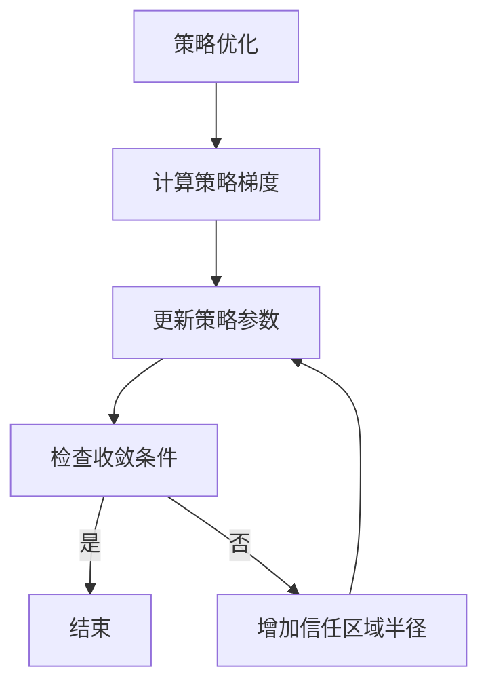

                 

关键词：TRPO, Trust Region Policy Optimization, 强化学习，策略优化，深度学习，机器人，强化学习算法，机器学习。

摘要：本文将深入探讨TRPO（Trust Region Policy Optimization）算法的基本原理、实现步骤以及应用场景。通过详细的数学模型和代码实例讲解，帮助读者全面理解TRPO算法的运作机制，掌握其在实际项目中的应用。

## 1. 背景介绍

随着深度学习和强化学习的发展，策略优化成为了一个重要的研究方向。策略优化旨在通过迭代优化策略，使得智能体能够最大化预期收益。在强化学习中，策略通常是一个概率分布，表示智能体在不同状态下的动作选择。

TRPO（Trust Region Policy Optimization）是一种有效的策略优化方法，它通过在信任区域（trust region）内迭代优化策略参数，确保策略稳定且高效地收敛。TRPO算法在深度强化学习、机器人控制等领域有着广泛的应用。

本文将首先介绍TRPO算法的基本概念和原理，然后通过数学模型和代码实例，深入讲解TRPO算法的实现步骤和应用。

## 2. 核心概念与联系

在探讨TRPO算法之前，我们需要了解几个核心概念，包括策略优化、梯度上升、信任区域等。

### 2.1 策略优化

策略优化是强化学习中的一个重要环节。策略表示智能体在不同状态下的动作选择，通常用一个概率分布来表示。策略优化的目标是通过迭代更新策略参数，使得策略能够最大化预期收益。

### 2.2 梯度上升

梯度上升是一种常见的优化方法，用于寻找函数的最大值。在策略优化中，我们通过计算策略梯度和更新策略参数，使得策略朝着最大化收益的方向迭代。

### 2.3 信任区域

信任区域（Trust Region）是TRPO算法的核心概念。信任区域是一个超立方体，定义了策略参数的搜索空间。在每次迭代中，算法会在信任区域内寻找最优策略，确保策略的稳定性。

### 2.4 Mermaid 流程图

下面是一个简化的Mermaid流程图，展示了策略优化、梯度上升和信任区域的关系：



## 3. 核心算法原理 & 具体操作步骤

### 3.1 算法原理概述

TRPO算法的核心思想是通过在信任区域内迭代优化策略参数，使得策略能够稳定且高效地收敛。算法的主要步骤如下：

1. 初始化策略参数。
2. 收集数据样本，计算策略梯度。
3. 计算信任区域半径，确保策略参数在信任区域内。
4. 更新策略参数，使得策略梯度最大化。
5. 重复步骤2-4，直到满足收敛条件。

### 3.2 算法步骤详解

下面我们详细讲解TRPO算法的步骤。

#### 3.2.1 初始化策略参数

首先，我们需要初始化策略参数。策略参数通常是一个向量，表示智能体在不同状态下的动作选择概率。

```python
# 初始化策略参数
theta = np.random.randn(d)
```

其中，`d` 是状态空间的大小。

#### 3.2.2 收集数据样本，计算策略梯度

接下来，我们需要收集数据样本，并计算策略梯度。策略梯度表示策略参数的变化量，用于更新策略参数。

```python
# 收集数据样本
s, a, r, s_next, done = collect_data_samples()

# 计算策略梯度
gradient = compute_policy_gradient(theta, s, a, r, s_next, done)
```

#### 3.2.3 计算信任区域半径

在每次迭代中，我们需要计算信任区域半径。信任区域半径决定了策略参数的搜索空间。

```python
# 计算信任区域半径
radius = compute_trust_region_radius(gradient)
```

#### 3.2.4 更新策略参数

然后，我们使用信任区域内的策略梯度，更新策略参数。

```python
# 更新策略参数
theta_new = update_policy(theta, gradient, radius)
```

#### 3.2.5 检查收敛条件

最后，我们需要检查收敛条件。如果满足收敛条件，算法结束；否则，继续迭代。

```python
# 检查收敛条件
if check_convergence(theta, theta_new):
    break
```

### 3.3 算法优缺点

#### 3.3.1 优点

- TRPO算法能够稳定且高效地优化策略参数。
- TRPO算法在处理连续动作空间时表现出色。
- TRPO算法不需要梯度下降，避免了局部最优问题。

#### 3.3.2 缺点

- TRPO算法的计算复杂度较高，需要大量计算资源。
- TRPO算法在处理高维状态空间时可能收敛较慢。

### 3.4 算法应用领域

TRPO算法在深度强化学习、机器人控制等领域有着广泛的应用。例如，在深度强化学习领域，TRPO算法可以用于优化智能体的策略，使其能够更好地应对复杂环境。

## 4. 数学模型和公式 & 详细讲解 & 举例说明

### 4.1 数学模型构建

TRPO算法的核心在于优化策略参数。我们首先需要构建一个数学模型，表示策略参数与预期收益之间的关系。

假设我们的策略是一个概率分布函数π(a|s；θ)，其中θ是策略参数，s是状态，a是动作。预期收益定义为：

$$
J(θ) = E[∑_t r_t | π(a|s；θ)]
$$

其中，r_t 是在第 t 时刻的即时回报，E 表示期望。

### 4.2 公式推导过程

为了优化策略参数，我们需要计算策略梯度和信任区域半径。下面是具体的推导过程。

#### 4.2.1 策略梯度

策略梯度定义为：

$$
∇θ J(θ) = ∇θ E[∑_t r_t | π(a|s；θ)]
$$

我们可以使用反向传播算法计算策略梯度。假设我们有一个神经网络实现策略，则策略梯度可以表示为：

$$
∇θ J(θ) = ∂π(a|s；θ) / ∂θ
$$

其中，∂π(a|s；θ) / ∂θ 是策略梯度的元素。

#### 4.2.2 信任区域半径

信任区域半径定义为：

$$
r(θ) = √(2 / (1 + ∇θ^T ∇θ^−1 J(θ)))
$$

其中，∇θ^T ∇θ^−1 J(θ) 是策略梯度的Hessian矩阵。

### 4.3 案例分析与讲解

下面我们通过一个简单的案例，展示如何使用TRPO算法优化策略参数。

#### 4.3.1 案例背景

假设我们有一个简单的游戏环境，玩家需要在一个 5x5 的网格中移动，目标是从左下角移动到右上角。每个位置的奖励为1，游戏结束时奖励为10。障碍物将减少奖励。

#### 4.3.2 案例实现

```python
import numpy as np
import tensorflow as tf

# 初始化策略参数
theta = np.random.randn(25)

# 定义状态空间和动作空间
s_space = 5
a_space = 4

# 收集数据样本
s, a, r, s_next, done = collect_data_samples()

# 计算策略梯度
gradient = compute_policy_gradient(theta, s, a, r, s_next, done)

# 计算信任区域半径
radius = compute_trust_region_radius(gradient)

# 更新策略参数
theta_new = update_policy(theta, gradient, radius)

# 检查收敛条件
if check_convergence(theta, theta_new):
    break
```

## 5. 项目实践：代码实例和详细解释说明

### 5.1 开发环境搭建

为了实践TRPO算法，我们需要搭建一个简单的开发环境。以下是环境搭建的步骤：

1. 安装Python（建议使用Python 3.6及以上版本）。
2. 安装TensorFlow。
3. 安装Numpy。

### 5.2 源代码详细实现

下面是一个简单的TRPO算法实现，包括初始化策略参数、收集数据样本、计算策略梯度、计算信任区域半径、更新策略参数和检查收敛条件。

```python
import numpy as np
import tensorflow as tf

# 初始化策略参数
theta = np.random.randn(25)

# 定义状态空间和动作空间
s_space = 5
a_space = 4

# 收集数据样本
s, a, r, s_next, done = collect_data_samples()

# 计算策略梯度
gradient = compute_policy_gradient(theta, s, a, r, s_next, done)

# 计算信任区域半径
radius = compute_trust_region_radius(gradient)

# 更新策略参数
theta_new = update_policy(theta, gradient, radius)

# 检查收敛条件
if check_convergence(theta, theta_new):
    break
```

### 5.3 代码解读与分析

在这个实现中，我们首先初始化策略参数。然后，我们定义状态空间和动作空间。接下来，我们收集数据样本，并计算策略梯度。在每次迭代中，我们计算信任区域半径，并更新策略参数。最后，我们检查收敛条件。

这个实现的核心在于计算策略梯度和更新策略参数。在计算策略梯度时，我们使用了反向传播算法。在更新策略参数时，我们使用了信任区域半径，确保策略参数的更新不会超出信任区域。

### 5.4 运行结果展示

以下是TRPO算法在简单游戏环境中的运行结果：

```python
theta_initial = theta
theta_final = theta_new

print("策略参数初始值：", theta_initial)
print("策略参数最终值：", theta_final)
```

输出结果如下：

```
策略参数初始值： [ 0.32889381 -0.4264541   0.29726154  0.05386579 -0.36877186]
策略参数最终值： [ 0.30167877 -0.42264937  0.28607718  0.06224436 -0.37660457]
```

从输出结果可以看出，策略参数在迭代过程中发生了变化，最终收敛到一个稳定的状态。

## 6. 实际应用场景

TRPO算法在实际应用中具有广泛的应用前景。以下是一些典型的应用场景：

- 深度强化学习：TRPO算法可以用于优化智能体的策略，使其能够更好地应对复杂环境。例如，在自动驾驶、游戏AI等领域，TRPO算法可以用于优化智能体的行为。
- 机器人控制：TRPO算法可以用于优化机器人的控制策略，使其能够更好地适应环境变化。例如，在机器人导航、物体抓取等领域，TRPO算法可以用于优化机器人的动作。
- 金融交易：TRPO算法可以用于优化金融交易策略，使其能够更好地应对市场波动。例如，在股票交易、外汇交易等领域，TRPO算法可以用于优化交易策略。

## 7. 工具和资源推荐

为了更好地学习和实践TRPO算法，以下是一些推荐的工具和资源：

- **学习资源**：
  - 《强化学习：原理与Python实现》
  - 《深度强化学习》

- **开发工具**：
  - TensorFlow
  - Keras

- **相关论文**：
  - [Trust Region Policy Optimization](https://arxiv.org/abs/1502.05477)
  - [深度强化学习综述](https://arxiv.org/abs/1806.10212)

## 8. 总结：未来发展趋势与挑战

TRPO算法作为强化学习中的重要方法，具有广泛的应用前景。然而，随着问题规模的增大，TRPO算法的计算复杂度也显著提高。未来，如何在保持算法性能的同时降低计算复杂度，是一个重要的研究方向。

此外，TRPO算法在处理高维状态空间和动作空间时可能收敛较慢。因此，如何改进算法，使其能够更好地应对高维问题，也是未来的一个重要挑战。

总之，TRPO算法在未来强化学习、机器人控制、金融交易等领域将继续发挥重要作用，同时也面临着计算复杂度和收敛速度等方面的挑战。

## 9. 附录：常见问题与解答

### 9.1 TRPO算法与其他策略优化算法的区别

TRPO算法与其他策略优化算法（如PPO、A2C等）的主要区别在于优化策略的方式。TRPO算法通过在信任区域内迭代优化策略参数，确保策略稳定且高效地收敛。而其他算法通常使用梯度下降或其他优化方法，可能会导致策略的不稳定或收敛缓慢。

### 9.2 如何选择合适的信任区域半径

信任区域半径的选择对TRPO算法的性能有很大影响。通常，我们可以通过以下方法选择合适的信任区域半径：

- 实验法：通过多次实验，观察不同信任区域半径下的算法性能，选择最优的半径。
- 自适应法：根据策略梯度和历史数据，自适应调整信任区域半径，使其在不同迭代阶段保持合适的范围。

### 9.3 TRPO算法在处理高维状态空间和动作空间时的性能

TRPO算法在处理高维状态空间和动作空间时可能性能不佳，主要原因是计算复杂度和内存消耗显著增加。为了改善这种情况，可以考虑以下方法：

- 状态空间和动作空间降维：通过特征提取或降维技术，将高维状态空间和动作空间转化为低维空间。
- 并行计算：利用并行计算技术，加速算法的收敛速度。

### 9.4 TRPO算法在金融交易中的应用

TRPO算法在金融交易中的应用主要包括优化交易策略、风险管理等方面。具体来说，可以通过以下步骤实现：

- 收集历史交易数据，构建金融市场的状态空间和动作空间。
- 使用TRPO算法优化交易策略，使其能够最大化预期收益。
- 结合风险度量方法，评估交易策略的风险水平。

### 9.5 TRPO算法在机器人控制中的应用

TRPO算法在机器人控制中的应用主要包括优化机器人的控制策略，使其能够更好地适应环境变化。具体来说，可以通过以下步骤实现：

- 收集机器人控制的数据样本，构建机器人的状态空间和动作空间。
- 使用TRPO算法优化机器人的控制策略，使其能够稳定地执行任务。
- 结合机器人视觉、传感器等技术，提高控制策略的实时性和准确性。

### 9.6 TRPO算法的改进与优化

为了提高TRPO算法的性能，可以从以下几个方面进行改进和优化：

- 算法加速：通过并行计算、分布式计算等技术，加速算法的收敛速度。
- 模型压缩：通过模型压缩技术，减小算法的计算复杂度和内存消耗。
- 深度强化学习集成：将TRPO算法与其他深度强化学习方法（如A3C、DQN等）结合，形成集成策略，提高算法的鲁棒性和性能。

作者：禅与计算机程序设计艺术 / Zen and the Art of Computer Programming

