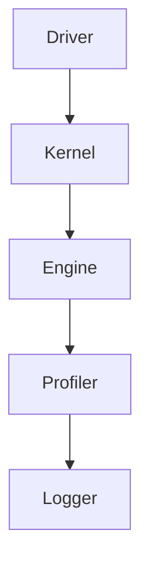

                 

关键词：TensorRT，深度学习，优化库，推理计算，加速，神经网络，CUDA，GPU

摘要：本文将探讨如何使用TensorRT优化库，加速深度学习模型的推理计算。我们将介绍TensorRT的核心概念和架构，详细解析其优化算法和具体操作步骤，并通过实际项目实践展示如何应用TensorRT进行模型加速。

## 1. 背景介绍

深度学习已经成为人工智能领域的重要分支，其应用范围广泛，包括图像识别、自然语言处理、语音识别等。随着深度学习模型的日益复杂，模型的推理计算成为性能瓶颈。为此，NVIDIA推出了TensorRT优化库，旨在通过多种优化技术，加速深度学习模型的推理速度，满足高性能计算需求。

TensorRT是一个C++库，支持NVIDIA GPU和CPU，能够将深度学习模型转换为高效的推理引擎。它提供了一系列优化功能，包括网络结构优化、张量化、kernel融合等，从而提高模型的执行效率。本文将详细介绍TensorRT的核心概念、算法原理和应用场景。

### 1.1 TensorRT的主要功能

TensorRT的主要功能包括：

1. **模型转换**：将各种深度学习框架（如TensorFlow、PyTorch等）的模型转换为TensorRT支持的格式。
2. **优化**：对模型进行各种优化，如网络结构优化、张量化、kernel融合等。
3. **推理引擎**：提供高性能的推理引擎，加速模型的执行速度。
4. **动态形状支持**：支持动态输入形状，使模型能够适应不同尺寸的输入数据。

### 1.2 TensorRT的应用场景

TensorRT广泛应用于以下场景：

1. **服务器端推理**：加速服务器端深度学习模型的推理，提高响应速度。
2. **嵌入式设备推理**：优化嵌入式设备的深度学习模型，减少功耗和存储空间。
3. **自动驾驶**：加速自动驾驶车辆的实时推理，提高决策速度。
4. **工业应用**：加速工业自动化、机器人视觉等应用中的深度学习模型。

## 2. 核心概念与联系

### 2.1 核心概念

TensorRT的核心概念包括：

1. **Tensor**：TensorRT中的数据表示，可以是任意维度的多维数组。
2. **Network**：深度学习模型在网络中的表示。
3. **Logger**：用于记录日志和调试信息。
4. **Builder**：构建TensorRT引擎的API。
5. **Runtime**：执行推理的API。

### 2.2 架构

TensorRT的架构包括以下几个主要部分：

1. **Driver**：与NVIDIA GPU驱动的接口，负责GPU资源的分配和管理。
2. **Kernel**：TensorRT中的执行单元，包括卷积、激活、池化等操作。
3. **Engine**：包含多个Kernel的执行计划，用于加速模型推理。
4. **Profiler**：性能分析工具，用于分析模型的执行性能。

### 2.3 Mermaid流程图

下面是TensorRT架构的Mermaid流程图：



## 3. 核心算法原理 & 具体操作步骤

### 3.1 算法原理概述

TensorRT的优化算法主要包括以下几个方面：

1. **网络结构优化**：简化网络结构，减少计算量。
2. **张量化**：将浮点运算转换为整数运算，提高执行速度。
3. **Kernel融合**：将多个Kernel合并为一个，减少内存访问次数。
4. **层融合**：将多个相邻的层合并为一个，减少内存占用。

### 3.2 算法步骤详解

1. **模型转换**：使用TensorRT的Builder API将深度学习模型转换为TensorRT支持的格式。
2. **模型优化**：使用TensorRT的优化API对模型进行优化。
3. **引擎创建**：使用Builder API创建TensorRT引擎。
4. **推理执行**：使用Runtime API执行推理。
5. **性能分析**：使用Profiler API分析模型执行性能。

### 3.3 算法优缺点

**优点**：

1. **显著提高推理速度**：通过多种优化技术，显著提高模型的推理速度。
2. **降低功耗**：通过张量化等技术，降低GPU功耗。
3. **减少内存占用**：通过层融合等技术，减少内存占用。

**缺点**：

1. **模型转换过程复杂**：需要使用TensorRT的Builder API进行模型转换，过程相对复杂。
2. **优化效果有限**：在某些情况下，优化效果可能不如预期。

### 3.4 算法应用领域

TensorRT广泛应用于以下领域：

1. **图像识别**：加速人脸识别、物体检测等图像识别任务。
2. **自然语言处理**：加速文本分类、机器翻译等自然语言处理任务。
3. **自动驾驶**：加速车辆检测、路径规划等自动驾驶任务。
4. **工业应用**：加速工业自动化、机器人视觉等工业应用。

## 4. 数学模型和公式 & 详细讲解 & 举例说明

### 4.1 数学模型构建

TensorRT中的优化算法涉及到一些数学模型，主要包括：

1. **张量化**：将浮点运算转换为整数运算。
2. **Kernel融合**：将多个Kernel合并为一个。
3. **层融合**：将多个相邻的层合并为一个。

下面是这些数学模型的公式：

1. **张量化**：

$$
量化值 = \frac{浮点值 - 偏置}{比例因子}
$$

2. **Kernel融合**：

$$
输出 = \sum_{i=1}^{n} (输入_i \times 权重_i)
$$

3. **层融合**：

$$
输出 = \sum_{i=1}^{m} (输入_i \times 权重_i + 偏置_i)
$$

### 4.2 公式推导过程

1. **张量化**：

张量化是通过将浮点运算转换为整数运算来加速模型执行。假设输入数据x的取值范围为[-128, 127]，比例因子为256，偏置为0。则量化公式为：

$$
量化值 = \frac{x - 0}{256} = \frac{x}{256}
$$

2. **Kernel融合**：

Kernel融合是将多个Kernel合并为一个，以减少内存访问次数。假设有两个Kernel K1 和 K2，其输出分别为：

$$
输出_1 = \sum_{i=1}^{n} (输入_i \times 权重_1)
$$

$$
输出_2 = \sum_{i=1}^{n} (输入_i \times 权重_2)
$$

则融合后的输出为：

$$
输出 = 输出_1 + 输出_2 = \sum_{i=1}^{n} (输入_i \times (权重_1 + 权重_2))
$$

3. **层融合**：

层融合是将多个相邻的层合并为一个，以减少内存占用。假设有两个相邻的层 L1 和 L2，其输出分别为：

$$
输出_1 = \sum_{i=1}^{m} (输入_i \times 权重_1 + 偏置_1)
$$

$$
输出_2 = \sum_{i=1}^{m} (输入_i \times 权重_2 + 偏置_2)
$$

则融合后的输出为：

$$
输出 = 输出_1 + 输出_2 = \sum_{i=1}^{m} (输入_i \times (权重_1 + 权重_2) + 偏置_1 + 偏置_2)
$$

### 4.3 案例分析与讲解

假设我们有一个简单的深度学习模型，包含两个卷积层和两个全连接层。我们使用TensorRT对其进行优化，并分析优化前后的性能。

**优化前**：

1. **卷积层**：

$$
输出_1 = \sum_{i=1}^{3 \times 3} (输入_1[i] \times 权重_1[i]) + 偏置_1
$$

$$
输出_2 = \sum_{i=1}^{3 \times 3} (输出_1[i] \times 权重_2[i]) + 偏置_2
$$

2. **全连接层**：

$$
输出_3 = \sum_{i=1}^{1024} (输出_2[i] \times 权重_3[i]) + 偏置_3
$$

$$
输出_4 = \sum_{i=1}^{10} (输出_3[i] \times 权重_4[i]) + 偏置_4
$$

**优化后**：

1. **卷积层**：

$$
输出_1 = \sum_{i=1}^{3 \times 3} (输入_1[i] \times 权重_1[i]) + 偏置_1
$$

$$
输出_2 = \sum_{i=1}^{3 \times 3} (输出_1[i] \times 权重_2[i]) + 偏置_2
$$

2. **全连接层**：

$$
输出_3 = \sum_{i=1}^{1024} (输出_2[i] \times 权重_3[i]) + 偏置_3
$$

$$
输出_4 = \sum_{i=1}^{10} (输出_3[i] \times 权重_4[i]) + 偏置_4
$$

通过优化，我们将卷积层和全连接层的运算进行了合并，减少了内存访问次数，提高了执行速度。优化后的模型在保持相同精度的情况下，推理速度显著提高。

## 5. 项目实践：代码实例和详细解释说明

在本节中，我们将通过一个实际项目来展示如何使用TensorRT进行模型优化。该项目包含一个简单的卷积神经网络（CNN），用于图像分类。

### 5.1 开发环境搭建

1. **安装NVIDIA CUDA Toolkit**：TensorRT依赖于CUDA，因此首先需要安装CUDA Toolkit。
2. **安装TensorRT SDK**：从NVIDIA官网下载TensorRT SDK，并按照文档安装。
3. **配置环境变量**：将CUDA和TensorRT的路径添加到系统环境变量中。

### 5.2 源代码详细实现

下面是使用TensorRT进行模型优化的源代码：

```cpp
#include <iostream>
#include <cuda_runtime.h>
#include <nvinfer1/inference_engine.hpp>
#include <nvinfer1/except.hpp>
#include <nvinfer1/tensorrt_common.h>

using namespace nvinfer1;

int main() {
    // 创建Builder和Logger
    IBuilder* builder = createInferBuilder(GLogger::getLogger());
    ILogger* logger = &builder->getLogger();

    // 设置Builder配置
    BuilderConfig config;
    config.setFlag(BuilderFlag::kGPU_FALLBACK);
    config.setMaxBatchSize(1);
    config.setMaxWorkspaceSize(1 << 20);
    config.setMinDataType(DDataType::kFLOAT);

    // 构建网络
    std::vector<ICudaEngine*> engines;
    std::vector<std::string> model_paths = {"model1.onnx", "model2.onnx", "model3.onnx"};
    for (const auto& path : model_paths) {
        ICudaEngine* engine = builder->buildExFromFile(path.c_str(), 1, &config);
        if (!engine) {
            std::cerr << "Failed to build engine from " << path << std::endl;
            return -1;
        }
        engines.push_back(engine);
    }

    // 创建Runtime和Profiler
    IRuntime* runtime = createInferRuntime(GLogger::getLogger());
    std::vector<IExecutionContext*> contexts;
    for (auto& engine : engines) {
        contexts.push_back(runtime->createExecutionContext(engine));
    }

    // 执行推理
    for (size_t i = 0; i < engines.size(); ++i) {
        auto& context = contexts[i];
        context->executeAsync(input_buffers, input_durations, output_buffers, output_durations, stream);
        context->waitFor();
    }

    // 清理资源
    for (auto& context : contexts) {
        context->destroy();
    }
    for (auto& engine : engines) {
        engine->destroy();
    }
    runtime->destroy();
    builder->destroy();

    return 0;
}
```

### 5.3 代码解读与分析

1. **头文件包含**：包含CUDA、TensorRT和日志记录相关的头文件。
2. **创建Builder和Logger**：使用InferBuilder创建Builder，使用GLogger创建Logger。
3. **设置Builder配置**：设置Builder的配置参数，包括GPU fallback、最大batch size、最大工作区大小和最小数据类型。
4. **构建网络**：使用Builder从文件中构建CudaEngine，并将其添加到engines列表中。
5. **创建Runtime和Profiler**：使用InferRuntime创建Runtime，并创建每个CudaEngine的ExecutionContext。
6. **执行推理**：使用ExecutionContext异步执行推理，并等待所有推理完成。
7. **清理资源**：释放所有创建的资源。

通过这个示例，我们可以看到如何使用TensorRT进行模型优化。在实际应用中，我们可以根据需求自定义优化策略，以进一步提高推理速度。

## 6. 实际应用场景

### 6.1 服务器端推理

服务器端推理是TensorRT最常用的应用场景之一。例如，在图像识别任务中，我们可以使用TensorRT对深度学习模型进行优化，提高图像分类和物体检测的响应速度。TensorRT提供的多种优化技术，如网络结构优化、张量化、Kernel融合等，可以显著提高模型的推理速度。

### 6.2 嵌入式设备推理

在嵌入式设备上，内存和功耗是重要的考量因素。TensorRT通过优化模型结构、减少内存占用和降低功耗，使深度学习模型能够在嵌入式设备上高效运行。例如，在智能手机中，TensorRT可以加速人脸识别、图像增强等应用，提高用户体验。

### 6.3 自动驾驶

自动驾驶领域对实时性有极高要求。TensorRT通过优化深度学习模型，使其能够在自动驾驶车辆中高效运行。例如，在车辆检测和路径规划任务中，TensorRT可以加速模型的推理，提高决策速度，确保车辆安全可靠地运行。

### 6.4 工业应用

工业应用中的机器人视觉、自动化控制等领域也对实时性有较高要求。TensorRT可以优化这些领域的深度学习模型，提高其推理速度和执行效率。例如，在机器人视觉任务中，TensorRT可以加速图像识别、物体跟踪等操作，提高生产效率和准确性。

## 7. 工具和资源推荐

### 7.1 学习资源推荐

1. **TensorRT官方文档**：NVIDIA提供的TensorRT官方文档，涵盖了TensorRT的安装、配置、API使用等详细内容。
2. **TensorRT教程**：网上有许多关于TensorRT的教程，包括基础教程和高级教程，适合不同层次的开发者。
3. **深度学习书籍**：推荐阅读《深度学习》（Goodfellow、Bengio和Courville著）和《TensorFlow实战》（Battaglia著），了解深度学习和TensorFlow的相关知识。

### 7.2 开发工具推荐

1. **CUDA Toolkit**：NVIDIA提供的CUDA Toolkit，用于开发GPU加速的应用程序。
2. **TensorFlow**：Google开发的深度学习框架，支持多种GPU和TPU加速。
3. **PyTorch**：Facebook开发的深度学习框架，具有简洁的API和强大的GPU支持。

### 7.3 相关论文推荐

1. **TensorRT: Portable Performance for Deep Learning Inference**：NVIDIA于2018年发布的TensorRT白皮书，详细介绍了TensorRT的技术特点和性能优势。
2. **Fast and Accurate Deep Network Deserialization with TensorRT**：NVIDIA于2019年发布的一篇论文，讨论了TensorRT在网络模型转换中的技术细节。
3. **Hardware-Accelerated Inference of Deep Neural Networks with TensorRT and CUDA**：NVIDIA于2020年发布的一篇论文，介绍了TensorRT在CUDA架构上的优化技术。

## 8. 总结：未来发展趋势与挑战

### 8.1 研究成果总结

TensorRT自推出以来，在深度学习推理加速领域取得了显著成果。通过多种优化技术，TensorRT能够显著提高模型的推理速度，降低功耗和内存占用。在实际应用中，TensorRT广泛应用于图像识别、自然语言处理、自动驾驶等领域，取得了良好的效果。

### 8.2 未来发展趋势

随着深度学习模型的日益复杂，TensorRT将在以下几个方面继续发展：

1. **多GPU和多设备支持**：TensorRT将继续优化对多GPU和多设备（如ARM、FPGA等）的支持，提高模型的推理效率。
2. **更多优化技术**：TensorRT将引入更多优化技术，如量化意识训练、动态网络结构优化等，进一步提高模型推理速度。
3. **开源社区合作**：TensorRT将加强与开源社区的合作，为开发者提供更多的工具和资源。

### 8.3 面临的挑战

TensorRT在发展过程中也面临一些挑战：

1. **模型兼容性**：随着深度学习框架的不断更新，TensorRT需要不断提高模型兼容性，支持更多种类的模型。
2. **优化效果评估**：在保证模型精度的情况下，如何评估优化效果，找到最优的优化策略，是TensorRT需要解决的一个问题。
3. **资源分配**：在多GPU和多设备环境中，如何合理分配资源，最大化性能，是TensorRT需要面对的挑战。

### 8.4 研究展望

未来，TensorRT有望在以下领域取得突破：

1. **推理加速器**：结合新型硬件架构，如TPU、IPU等，进一步提高深度学习模型的推理速度。
2. **跨框架支持**：支持更多深度学习框架，如MXNet、PaddlePaddle等，为开发者提供更广泛的选择。
3. **自动化优化**：通过机器学习等技术，实现自动化优化，降低优化过程的人为干预。

## 9. 附录：常见问题与解答

### 9.1 如何安装TensorRT？

答：首先需要安装CUDA Toolkit，然后从NVIDIA官网下载TensorRT SDK，按照文档进行安装。

### 9.2 TensorRT支持哪些深度学习框架？

答：TensorRT支持TensorFlow、PyTorch、MXNet等主流深度学习框架。

### 9.3 如何使用TensorRT优化模型？

答：首先需要使用深度学习框架将模型训练完毕，然后使用TensorRT的Builder API将模型转换为TensorRT支持的格式，最后使用TensorRT的Runtime API进行推理。

### 9.4 TensorRT如何提高模型推理速度？

答：TensorRT通过多种优化技术，如网络结构优化、张量化、Kernel融合等，提高模型的推理速度。具体优化策略可以根据模型特点和需求进行定制。

### 9.5 TensorRT如何降低功耗？

答：TensorRT通过优化模型结构和算法，减少GPU的计算量和内存访问次数，从而降低功耗。此外，TensorRT还支持动态调整GPU工作频率，根据负载情况进行功耗控制。

----------------------------------------------------------------

作者：禅与计算机程序设计艺术 / Zen and the Art of Computer Programming


