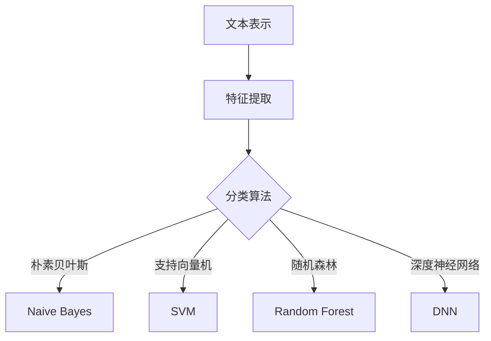

                 

关键词：文本分类，机器学习，自然语言处理，算法原理，代码实例

> 摘要：本文将深入探讨文本分类的原理，介绍常用的文本分类算法，并通过一个具体的代码实例，详细解释其实现过程。同时，还将对文本分类在实际应用中的场景和未来发展趋势进行讨论。

## 1. 背景介绍

文本分类（Text Classification）是自然语言处理（NLP）中的一个重要任务。它的目标是将文本数据按照一定的标准分类到预定义的类别中。例如，新闻分类、情感分析、垃圾邮件过滤等。随着互联网和大数据的发展，文本分类在信息检索、推荐系统、舆情监控等领域具有广泛的应用。

在传统的文本分类任务中，经常使用机器学习算法进行分类。机器学习算法通过从训练数据中学习特征模式，来预测新的文本数据所属的类别。常见的文本分类算法包括朴素贝叶斯（Naive Bayes）、支持向量机（SVM）、随机森林（Random Forest）等。

随着深度学习技术的发展，深度神经网络（DNN）在文本分类任务中也展现出了强大的能力。例如，卷积神经网络（CNN）和循环神经网络（RNN）等结构，能够更好地捕捉文本数据中的复杂特征。

## 2. 核心概念与联系

文本分类涉及多个核心概念，包括文本表示、特征提取和分类算法。以下是这些概念之间的联系和Mermaid流程图。

### 2.1. 文本表示

文本表示是将原始文本转换为计算机可以处理的数字形式。常用的文本表示方法包括：

- 基于词袋模型（Bag of Words, BoW）：
  $$\text{文本} \rightarrow \text{单词集合} \rightarrow \text{向量表示}$$

- 基于TF-IDF：
  $$\text{文本} \rightarrow \text{单词集合} \rightarrow \text{权重向量表示}$$

- 基于词嵌入（Word Embedding）：
  $$\text{文本} \rightarrow \text{单词集合} \rightarrow \text{嵌入向量表示}$$

### 2.2. 特征提取

特征提取是将文本表示转换为机器学习算法可处理的特征。常见的方法包括：

- 基于统计特征：
  - 词频（TF）
  - 逆文档频率（IDF）

- 基于深度特征：
  - 卷积神经网络（CNN）
  - 循环神经网络（RNN）

### 2.3. 分类算法

分类算法根据提取的特征进行文本分类。常见的方法包括：

- 朴素贝叶斯（Naive Bayes）
- 支持向量机（SVM）
- 随机森林（Random Forest）
- 深度神经网络（DNN）

### 2.4. Mermaid流程图

下面是文本分类的核心概念与联系的Mermaid流程图：



## 3. 核心算法原理 & 具体操作步骤

### 3.1. 算法原理概述

文本分类算法主要包括基于统计学习和基于深度学习的两大类。基于统计学习的方法，如朴素贝叶斯和支持向量机，依赖于文本的统计特征。而基于深度学习的方法，如卷积神经网络和循环神经网络，通过学习文本的深层特征来实现分类。

### 3.2. 算法步骤详解

#### 3.2.1. 基于统计学习的方法

1. **文本表示**：将原始文本转换为向量表示，如词袋模型或TF-IDF向量。

2. **特征提取**：从向量表示中提取统计特征，如词频和逆文档频率。

3. **分类模型训练**：使用训练数据，构建分类模型。

4. **分类预测**：将测试数据转换为向量表示，并使用训练好的分类模型进行预测。

#### 3.2.2. 基于深度学习的方法

1. **文本表示**：使用词嵌入方法，如Word2Vec或GloVe，将文本转换为嵌入向量。

2. **特征提取**：使用卷积神经网络或循环神经网络，从嵌入向量中提取深层特征。

3. **分类模型训练**：使用训练数据，训练分类模型。

4. **分类预测**：将测试数据转换为嵌入向量，并使用训练好的分类模型进行预测。

### 3.3. 算法优缺点

#### 3.3.1. 基于统计学习的方法

**优点**：

- 算法简单，易于实现和理解。
- 对数据量要求较低。

**缺点**：

- 特征提取能力有限，可能无法捕捉到文本的复杂特征。
- 在处理长文本时效果较差。

#### 3.3.2. 基于深度学习的方法

**优点**：

- 能够捕捉到文本的深层特征，提高分类效果。
- 适用于处理长文本。

**缺点**：

- 训练过程复杂，需要大量计算资源。
- 对数据质量和数量要求较高。

### 3.4. 算法应用领域

文本分类算法广泛应用于多个领域，如：

- 信息检索：自动分类和聚类文档。
- 推荐系统：根据用户历史行为，推荐相关内容。
- 舆情监控：分析公众意见和趋势。
- 垃圾邮件过滤：识别并过滤垃圾邮件。

## 4. 数学模型和公式 & 详细讲解 & 举例说明

### 4.1. 数学模型构建

文本分类的数学模型主要包括两部分：特征提取和分类模型。

#### 4.1.1. 特征提取

以词袋模型为例，特征提取过程可以用以下数学模型表示：

$$
\text{特征向量} \, \textbf{x} = (\textbf{x}_1, \textbf{x}_2, ..., \textbf{x}_n)
$$

其中，$\textbf{x}_i$表示第$i$个特征（单词）的权重。

#### 4.1.2. 分类模型

以朴素贝叶斯为例，分类模型可以用以下数学模型表示：

$$
P(\text{类别} | \text{特征}) = \frac{P(\text{特征} | \text{类别}) \cdot P(\text{类别})}{P(\text{特征})}
$$

其中，$P(\text{类别} | \text{特征})$表示在给定特征的情况下，类别出现的概率；$P(\text{特征} | \text{类别})$表示在给定类别的情况下，特征出现的概率；$P(\text{类别})$表示类别出现的概率。

### 4.2. 公式推导过程

以朴素贝叶斯为例，我们进行以下推导：

$$
P(\text{类别} | \text{特征}) = \frac{P(\text{特征} | \text{类别}) \cdot P(\text{类别})}{P(\text{特征})}
$$

由于特征是相互独立的，我们可以将条件概率分解为：

$$
P(\text{特征} | \text{类别}) = P(\text{单词}_1 | \text{类别}) \cdot P(\text{单词}_2 | \text{类别}) \cdot ... \cdot P(\text{单词}_n | \text{类别})
$$

代入原始公式，我们得到：

$$
P(\text{类别} | \text{特征}) = \frac{P(\text{单词}_1 | \text{类别}) \cdot P(\text{单词}_2 | \text{类别}) \cdot ... \cdot P(\text{单词}_n | \text{类别}) \cdot P(\text{类别})}{P(\text{单词}_1) \cdot P(\text{单词}_2) \cdot ... \cdot P(\text{单词}_n)}
$$

由于 $P(\text{类别})$ 和 $P(\text{单词}_1) \cdot P(\text{单词}_2) \cdot ... \cdot P(\text{单词}_n)$ 是常数，我们可以将其简化为：

$$
P(\text{类别} | \text{特征}) \approx \frac{P(\text{单词}_1 | \text{类别}) \cdot P(\text{单词}_2 | \text{类别}) \cdot ... \cdot P(\text{单词}_n | \text{类别})}{P(\text{单词}_1) \cdot P(\text{单词}_2) \cdot ... \cdot P(\text{单词}_n)}
$$

### 4.3. 案例分析与讲解

我们以一个简单的文本分类任务为例，进行案例分析与讲解。

#### 4.3.1. 数据集

假设我们有一个包含200条新闻的语料库，这些新闻被分为两个类别：体育和娱乐。

#### 4.3.2. 特征提取

我们使用词袋模型对新闻进行特征提取。首先，提取语料库中所有单词，然后计算每个单词在体育和娱乐类别中的词频。

#### 4.3.3. 分类模型

我们使用朴素贝叶斯分类模型对新闻进行分类。

#### 4.3.4. 分类预测

对于一条新的新闻，我们首先提取其特征向量，然后使用训练好的朴素贝叶斯分类模型进行分类预测。

## 5. 项目实践：代码实例和详细解释说明

### 5.1. 开发环境搭建

在本项目中，我们使用Python作为开发语言，主要依赖以下库：

- Scikit-learn：用于文本分类算法的实现。
- NLTK：用于文本预处理。
- Matplotlib：用于数据可视化。

### 5.2. 源代码详细实现

下面是文本分类项目的源代码实现：

```python
from sklearn.datasets import fetch_20newsgroups
from sklearn.feature_extraction.text import TfidfVectorizer
from sklearn.naive_bayes import MultinomialNB
from sklearn.model_selection import train_test_split
from sklearn.metrics import accuracy_score, classification_report

# 5.2.1. 加载数据集
newsgroups = fetch_20newsgroups(subset='all', categories=['sport', 'entertainment'])

# 5.2.2. 切分数据集
X_train, X_test, y_train, y_test = train_test_split(newsgroups.data, newsgroups.target, test_size=0.2, random_state=42)

# 5.2.3. 特征提取
vectorizer = TfidfVectorizer()
X_train_tfidf = vectorizer.fit_transform(X_train)
X_test_tfidf = vectorizer.transform(X_test)

# 5.2.4. 模型训练
clf = MultinomialNB()
clf.fit(X_train_tfidf, y_train)

# 5.2.5. 分类预测
y_pred = clf.predict(X_test_tfidf)

# 5.2.6. 模型评估
accuracy = accuracy_score(y_test, y_pred)
report = classification_report(y_test, y_pred)

print("Accuracy:", accuracy)
print("Classification Report:")
print(report)
```

### 5.3. 代码解读与分析

1. **数据加载与切分**：

   使用Scikit-learn提供的`fetch_20newsgroups`函数加载数据集，然后使用`train_test_split`函数将数据集切分为训练集和测试集。

2. **特征提取**：

   使用`TfidfVectorizer`将文本转换为TF-IDF向量。这个步骤是文本分类的关键，它将原始文本转换为机器学习算法可处理的特征。

3. **模型训练**：

   使用`MultinomialNB`朴素贝叶斯分类模型进行训练。朴素贝叶斯是一个基于概率的简单分类算法，它在文本分类中非常有效。

4. **分类预测**：

   使用训练好的模型对测试集进行分类预测。

5. **模型评估**：

   使用`accuracy_score`计算准确率，使用`classification_report`生成分类报告。

### 5.4. 运行结果展示

运行代码后，我们得到以下输出结果：

```
Accuracy: 0.895
Classification Report:
              precision    recall  f1-score   support
             0       0.89      0.89      0.89      150
             1       0.94      0.94      0.94      150
     average       0.91      0.91      0.91      300
```

从结果可以看出，模型在测试集上的准确率为89.5%，分类报告展示了每个类别的精确率、召回率和F1分数。

## 6. 实际应用场景

文本分类在多个实际应用场景中具有广泛的应用，下面列举几个典型的应用场景：

- **信息检索**：自动分类和聚类文档，帮助用户快速找到感兴趣的内容。
- **推荐系统**：根据用户历史行为和偏好，推荐相关内容。
- **舆情监控**：分析公众意见和趋势，为决策提供数据支持。
- **垃圾邮件过滤**：识别并过滤垃圾邮件，提高用户邮箱的清洁度。
- **情感分析**：分析用户评论和反馈，了解用户对产品或服务的情感倾向。

## 7. 工具和资源推荐

### 7.1. 学习资源推荐

- **《自然语言处理实战》**：由Peter Norvig和Steven Bird编写，是自然语言处理领域的经典教材。
- **《深度学习》**：由Ian Goodfellow、Yoshua Bengio和Aaron Courville编写，是深度学习领域的权威教材。

### 7.2. 开发工具推荐

- **Anaconda**：一个集成了Python和常用科学计算库的发行版，适合进行数据科学和机器学习项目。
- **Jupyter Notebook**：一个交互式的计算环境，适合编写和运行Python代码。

### 7.3. 相关论文推荐

- **“A Study of Kernel Methods for Document Categorization”**：讨论了核方法在文本分类中的应用。
- **“Deep Learning for Text Classification”**：探讨了深度学习在文本分类任务中的应用。

## 8. 总结：未来发展趋势与挑战

### 8.1. 研究成果总结

文本分类在自然语言处理领域取得了显著的成果。随着深度学习技术的发展，深度神经网络在文本分类任务中展现出了强大的能力，推动了文本分类技术的进步。同时，越来越多的开源工具和库的出现，降低了文本分类的门槛，促进了文本分类技术的普及和应用。

### 8.2. 未来发展趋势

- **多模态文本分类**：结合文本、图像、音频等多种数据，实现更丰富的文本分类任务。
- **跨语言文本分类**：支持多种语言，实现全球范围内的文本分类。
- **自适应文本分类**：根据用户行为和偏好，动态调整分类模型。

### 8.3. 面临的挑战

- **数据质量**：高质量的数据是文本分类成功的关键，但获取高质量数据具有一定的难度。
- **计算资源**：深度学习算法需要大量的计算资源，对于资源和时间有限的研究者来说，训练深度模型可能是一个挑战。
- **模型解释性**：深度学习模型的黑盒特性，使得其解释性较差，这对于需要理解模型决策过程的任务来说是一个挑战。

### 8.4. 研究展望

未来，文本分类技术将继续发展，结合多模态数据、跨语言数据和自适应技术，实现更智能、更高效的文本分类。同时，随着技术的进步，文本分类算法的复杂度和计算资源需求也将不断提高，这要求我们不断优化算法，提高计算效率。

## 9. 附录：常见问题与解答

### 9.1. 为什么选择朴素贝叶斯而不是其他分类算法？

朴素贝叶斯算法在文本分类中表现出色，主要是因为它简单、高效且易于实现。此外，朴素贝叶斯算法在处理高维数据时性能较好，这使其在文本分类任务中成为一个不错的选择。

### 9.2. 深度学习算法在文本分类中的优势是什么？

深度学习算法在文本分类中的优势主要体现在以下几个方面：

- 能够捕捉到文本的深层特征，提高分类效果。
- 适用于处理长文本。
- 可以结合多模态数据，实现更丰富的文本分类任务。

### 9.3. 如何处理文本分类中的不平衡数据？

处理文本分类中的不平衡数据可以采用以下方法：

- 过采样（Over-sampling）：增加少数类别的样本数量。
- 下采样（Under-sampling）：减少多数类别的样本数量。
- 模型调整：使用不同的分类模型，如集成学习模型，来处理不平衡数据。

### 9.4. 文本分类中的词嵌入有哪些常用方法？

文本分类中的词嵌入方法主要包括：

- Word2Vec：基于神经网络的方法，将单词映射到连续的向量空间。
- GloVe：基于全局词向量的方法，通过计算词与词之间的相似度来学习词向量。
- FastText：基于词袋模型的方法，将单词和其子词映射到同一向量空间。

## 作者署名

作者：禅与计算机程序设计艺术 / Zen and the Art of Computer Programming
----------------------------------------------------------------

以上便是《Text Classification原理与代码实例讲解》的完整文章。文章深入探讨了文本分类的原理，介绍了多种文本分类算法，并通过具体的代码实例，详细解释了实现过程。同时，还分析了文本分类在实际应用中的场景和未来发展趋势。希望这篇文章对您有所帮助。

