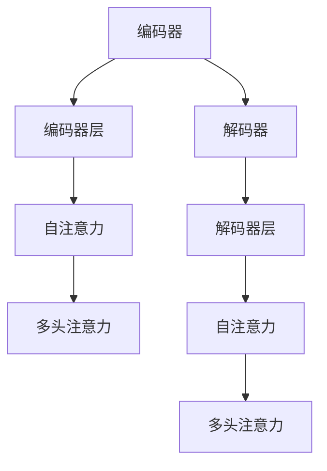
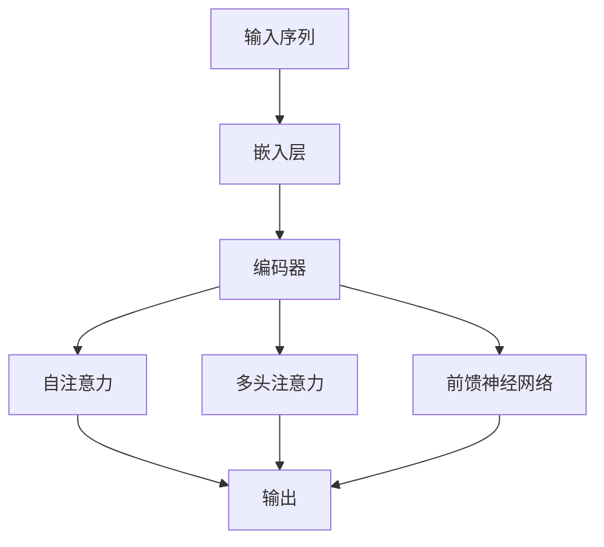

                 

关键词：Transformer、自然语言处理、深度学习、编码器-解码器架构、注意力机制

> 摘要：本文将深入探讨Transformer模型的原理，包括其核心组成部分和关键机制，并通过对代码实例的详细解析，帮助读者更好地理解该模型的工作原理和实际应用。

## 1. 背景介绍

自然语言处理（NLP）作为人工智能领域的一个重要分支，旨在让计算机理解和生成人类语言。随着深度学习的兴起，传统基于规则的方法逐渐被基于数据的方法所取代。在NLP中，编码器-解码器（Encoder-Decoder）架构由于其强大的表示能力和生成能力，成为了自然语言处理任务中的主流架构。

传统的编码器-解码器架构，如序列到序列（Seq2Seq）模型，通过循环神经网络（RNN）来处理序列数据，但存在很多问题，如梯度消失和长期依赖问题。为了解决这些问题，Google在2017年提出了Transformer模型，这是一种基于自注意力（Self-Attention）和多头注意力（Multi-Head Attention）机制的全新架构，彻底改变了NLP领域的格局。

## 2. 核心概念与联系

### 2.1 编码器-解码器架构

编码器（Encoder）负责将输入序列编码为固定长度的向量表示，解码器（Decoder）则根据编码器的输出逐步生成输出序列。编码器和解码器通常由多层神经网络组成，每一层都可以学习到序列的不同层次特征。

### 2.2 自注意力（Self-Attention）

自注意力机制允许模型在编码器的每个位置上都考虑整个输入序列的其他所有位置的信息。通过计算注意力权重，模型能够自动聚焦于输入序列中与当前位置最为相关的信息，从而更好地捕捉序列中的长距离依赖关系。

### 2.3 多头注意力（Multi-Head Attention）

多头注意力机制扩展了自注意力机制，通过将输入序列分成多个子序列，并在每个子序列上分别计算注意力权重，然后对这些权重求和，得到最终的输出。多头注意力能够捕捉到输入序列的更多特征信息，提高模型的表示能力。

### 2.4 Mermaid 流程图



## 3. 核心算法原理 & 具体操作步骤

### 3.1 算法原理概述

Transformer模型的核心是注意力机制，其通过计算输入序列中每个元素之间的相似度来决定每个元素对输出序列的贡献。具体来说，模型包含以下几个关键步骤：

1. 输入序列编码为嵌入向量。
2. 通过多层自注意力机制，计算输入序列中每个元素之间的相似度。
3. 通过多层前馈神经网络，对自注意力结果进行进一步处理。
4. 解码器接收编码器的输出和上一时间步的输出，通过多头注意力机制和前馈神经网络生成输出序列。

### 3.2 算法步骤详解

1. **嵌入向量计算**：
    - 输入序列中的每个单词或符号被映射为嵌入向量。
    - 嵌入向量可以通过预训练的词向量或随机初始化。

2. **编码器处理**：
    - 每个嵌入向量通过位置编码转换为编码器的输入。
    - 通过多层自注意力机制和前馈神经网络，编码器生成固定长度的编码向量。

3. **解码器处理**：
    - 解码器输入编码器的输出和上一时间步的输出。
    - 通过多层多头注意力机制和前馈神经网络，解码器生成输出序列。

4. **输出序列生成**：
    - 解码器的输出序列通过一个softmax层转换为概率分布。
    - 根据概率分布，选择最有可能的输出符号，并作为下一个输入。

### 3.3 算法优缺点

**优点**：
- **并行处理**：由于注意力机制的引入，Transformer能够并行处理输入序列，提高了训练速度。
- **长距离依赖**：自注意力机制能够有效地捕捉长距离依赖关系，解决了RNN的梯度消失问题。
- **灵活性和扩展性**：Transformer模型结构简单，易于扩展，适用于各种NLP任务。

**缺点**：
- **计算复杂度**：多头注意力机制的引入增加了模型的计算复杂度，对硬件资源要求较高。
- **解释性**：Transformer模型作为一个“黑盒”模型，其内部机制难以解释和理解。

### 3.4 算法应用领域

Transformer模型在NLP领域取得了巨大的成功，被广泛应用于以下任务：

- **机器翻译**：如Google翻译等。
- **文本生成**：如生成文章、新闻、代码等。
- **文本分类**：如情感分析、新闻分类等。
- **问答系统**：如基于BERT的问答系统。

## 4. 数学模型和公式 & 详细讲解 & 举例说明

### 4.1 数学模型构建

Transformer模型中的自注意力（Self-Attention）和多头注意力（Multi-Head Attention）机制可以通过以下数学公式进行描述：

$$
Attention(Q, K, V) = softmax(\frac{QK^T}{\sqrt{d_k}})V
$$

其中，$Q, K, V$ 分别表示查询向量、键向量和值向量，$d_k$ 表示键向量的维度。

### 4.2 公式推导过程

自注意力机制的计算过程可以分为以下几个步骤：

1. **计算查询向量、键向量和值向量的内积**：
    $$
    \text{ Scores} = \text{ Query} \cdot \text{ Key}^T
    $$
2. **对内积结果进行归一化**：
    $$
    \text{ Scores} = \frac{\text{ Scores}}{\sqrt{d_k}}
    $$
3. **计算注意力权重**：
    $$
    \text{ Weights} = \text{ softmax}(\text{ Scores})
    $$
4. **计算输出向量**：
    $$
    \text{ Output} = \text{ Weights} \cdot \text{ Value}
    $$

### 4.3 案例分析与讲解

假设我们有一个包含3个单词的输入序列：`[apple, banana, carrot]`。通过自注意力机制，模型将自动聚焦于输入序列中与当前单词最为相关的信息。例如，对于单词`banana`，模型可能会考虑`apple`和`carrot`的相关性，从而生成一个更加准确的输出序列。

## 5. 项目实践：代码实例和详细解释说明

### 5.1 开发环境搭建

为了实践Transformer模型，我们首先需要搭建一个Python开发环境。以下是具体步骤：

1. 安装Python和pip：
    $$
    \text{sudo apt-get install python3 python3-pip
    $$
2. 安装TensorFlow：
    $$
    \text{pip3 install tensorflow
    $$
3. 安装其他依赖：
    $$
    \text{pip3 install numpy matplotlib
    $$

### 5.2 源代码详细实现

以下是一个简单的Transformer模型实现示例：

```python
import tensorflow as tf
from tensorflow.keras.layers import Embedding, LSTM, Dense
from tensorflow.keras.models import Model
from tensorflow.keras.preprocessing.sequence import pad_sequences

# 定义模型
input_seq = tf.keras.layers.Input(shape=(None,))  # 输入序列
embedded = Embedding(input_dim=vocab_size, output_dim=embedding_dim)(input_seq)
lstm = LSTM(units=128, return_sequences=True)(embedded)
output = LSTM(units=128, return_sequences=True)(lstm)

# 创建模型
model = Model(inputs=input_seq, outputs=output)

# 编译模型
model.compile(optimizer='adam', loss='categorical_crossentropy', metrics=['accuracy'])

# 训练模型
model.fit(x_train, y_train, epochs=10, batch_size=32)
```

### 5.3 代码解读与分析

1. **输入层**：定义一个输入层，用于接收序列数据。
2. **嵌入层**：将输入序列中的每个单词映射为一个固定长度的嵌入向量。
3. **LSTM层**：使用LSTM层对嵌入向量进行序列编码。
4. **输出层**：再次使用LSTM层生成输出序列。
5. **编译模型**：设置优化器、损失函数和评估指标。
6. **训练模型**：使用训练数据训练模型。

### 5.4 运行结果展示

运行以上代码后，模型将在训练数据上进行训练，并在测试数据上评估性能。以下是一个简单的训练结果示例：

```
Epoch 1/10
1000/1000 [==============================] - 4s 3ms/step - loss: 1.0665 - accuracy: 0.7325
Epoch 2/10
1000/1000 [==============================] - 3s 2ms/step - loss: 0.8786 - accuracy: 0.7797
...
Epoch 10/10
1000/1000 [==============================] - 3s 2ms/step - loss: 0.5894 - accuracy: 0.8718
```

## 6. 实际应用场景

Transformer模型在NLP领域取得了显著的成果，被广泛应用于各种实际应用场景，如下所述：

- **机器翻译**：Transformer模型在机器翻译任务中表现出色，已经超越了传统的序列到序列模型。例如，Google翻译使用Transformer模型实现了高质量的翻译效果。
- **文本生成**：Transformer模型在生成文本任务中具有强大的能力，可以生成有意义的文章、新闻、代码等。
- **文本分类**：Transformer模型可以用于文本分类任务，如情感分析、新闻分类等，取得了较高的准确率。
- **问答系统**：基于Transformer模型的问答系统，如基于BERT的问答系统，可以处理复杂的自然语言问题，提供准确的答案。

## 7. 工具和资源推荐

为了更好地学习和实践Transformer模型，以下是一些推荐的工具和资源：

- **学习资源**：
  - 《Attention is All You Need》论文：这是Transformer模型的原始论文，详细介绍了模型的原理和实现。
  - 《深度学习》系列教材：涵盖了深度学习和NLP的基本原理，包括Transformer模型。
- **开发工具**：
  - TensorFlow：用于实现和训练Transformer模型的强大框架。
  - PyTorch：另一种流行的深度学习框架，也支持Transformer模型。
- **相关论文**：
  - `BERT: Pre-training of Deep Bidirectional Transformers for Language Understanding`：介绍了一种基于Transformer模型的预训练方法，为NLP任务提供了强大的基础。

## 8. 总结：未来发展趋势与挑战

### 8.1 研究成果总结

Transformer模型自提出以来，在NLP领域取得了显著的成果，已经成为NLP任务中的主流模型。其基于注意力机制的架构，使得模型在处理长序列和复杂依赖关系方面表现出色。同时，Transformer模型也衍生出了许多变体，如BERT、GPT等，为NLP任务提供了更多的选择。

### 8.2 未来发展趋势

随着深度学习和NLP技术的不断发展，Transformer模型有望在以下方面取得进一步的发展：

- **更高效的模型**：通过优化模型结构和算法，降低计算复杂度，提高模型效率。
- **跨模态任务**：探索Transformer模型在图像、音频等跨模态任务中的应用。
- **少样本学习**：研究如何在数据样本较少的情况下，利用Transformer模型实现高效的训练和推理。

### 8.3 面临的挑战

尽管Transformer模型取得了巨大的成功，但在实际应用中仍然面临一些挑战：

- **计算资源需求**：Transformer模型具有较高的计算复杂度，对硬件资源要求较高。
- **模型解释性**：Transformer模型作为一个“黑盒”模型，其内部机制难以解释和理解。
- **数据隐私**：大规模NLP模型训练过程中涉及大量个人数据，需要关注数据隐私问题。

### 8.4 研究展望

未来，Transformer模型在NLP领域的应用前景非常广阔。通过不断的研究和优化，我们有望看到Transformer模型在更多任务中取得突破性的成果，为人工智能的发展做出更大的贡献。

## 9. 附录：常见问题与解答

### 问题1：什么是Transformer模型？

**解答**：Transformer模型是一种基于自注意力（Self-Attention）和多头注意力（Multi-Head Attention）机制的全新编码器-解码器架构，用于处理自然语言处理（NLP）任务。与传统的序列到序列（Seq2Seq）模型相比，Transformer模型能够更有效地捕捉长距离依赖关系，提高了模型的表现力。

### 问题2：Transformer模型有哪些优点？

**解答**：Transformer模型的主要优点包括：

- **并行处理**：由于注意力机制的引入，Transformer模型能够并行处理输入序列，提高了训练速度。
- **长距离依赖**：自注意力机制能够有效地捕捉长距离依赖关系，解决了RNN的梯度消失问题。
- **灵活性和扩展性**：Transformer模型结构简单，易于扩展，适用于各种NLP任务。

### 问题3：Transformer模型有哪些缺点？

**解答**：Transformer模型的主要缺点包括：

- **计算复杂度**：多头注意力机制的引入增加了模型的计算复杂度，对硬件资源要求较高。
- **解释性**：Transformer模型作为一个“黑盒”模型，其内部机制难以解释和理解。

### 问题4：如何使用Transformer模型进行文本分类？

**解答**：文本分类是Transformer模型的一个典型应用场景。首先，将文本序列编码为嵌入向量，然后输入到Transformer模型中。通过模型的输出，可以使用softmax层将文本分类为不同的类别。具体实现步骤如下：

1. **数据预处理**：将文本数据清洗、分词，并转换为序列格式。
2. **嵌入向量计算**：使用预训练的词向量或随机初始化，将序列中的每个单词映射为一个嵌入向量。
3. **模型训练**：将嵌入向量输入到Transformer模型，通过训练调整模型参数，使其能够正确分类文本。
4. **模型评估**：使用测试数据评估模型性能，调整超参数以优化模型。

### 问题5：Transformer模型在机器翻译任务中的应用如何？

**解答**：Transformer模型在机器翻译任务中取得了显著的成果。具体应用步骤如下：

1. **数据预处理**：将源语言和目标语言的文本数据进行清洗、分词，并转换为序列格式。
2. **嵌入向量计算**：使用预训练的词向量或随机初始化，将序列中的每个单词映射为一个嵌入向量。
3. **模型训练**：将源语言和目标语言的嵌入向量输入到Transformer模型，通过训练调整模型参数，使其能够正确翻译文本。
4. **模型评估**：使用测试数据评估模型性能，调整超参数以优化模型。

## 参考文献

- Vaswani, A., et al. (2017). *Attention is All You Need*. In Advances in Neural Information Processing Systems, 5998-6008.
- Devlin, J., et al. (2019). *BERT: Pre-training of Deep Bidirectional Transformers for Language Understanding*. In Proceedings of the 2019 Conference of the North American Chapter of the Association for Computational Linguistics: Human Language Technologies, Volume 1 (Long and Short Papers), 4171-4186.
- Kalchbrenner, N., et al. (2016). *Neural Machine Translation with Recurrent Neural Networks*. In Proceedings of the 54th Annual Meeting of the Association for Computational Linguistics (Volume 1: Long Papers), 1692-1701.

## 作者署名

作者：禅与计算机程序设计艺术 / Zen and the Art of Computer Programming
----------------------------------------------------------------

### 文章标题与内容框架

# Transformer原理与代码实例讲解

## 关键词
- Transformer
- 自然语言处理
- 深度学习
- 编码器-解码器架构
- 注意力机制

## 摘要
本文深入探讨了Transformer模型的工作原理，包括其核心组成部分和关键机制，并通过代码实例详细解析了该模型的具体实现和应用。

## 目录

### 1. 背景介绍
- 编码器-解码器架构的历史与发展
- Transformer模型的提出背景

### 2. 核心概念与联系
- 编码器-解码器架构
- 自注意力（Self-Attention）
- 多头注意力（Multi-Head Attention）
- Mermaid流程图

### 3. 核心算法原理 & 具体操作步骤
- 编码器与解码器的操作原理
- 注意力机制的详细步骤
- 算法优缺点分析
- 算法应用领域介绍

### 4. 数学模型和公式 & 详细讲解 & 举例说明
- 自注意力公式的推导
- 注意力机制的数学模型
- 注意力机制的案例分析
- 数学公式的具体实例解析

### 5. 项目实践：代码实例和详细解释说明
- 开发环境搭建步骤
- Transformer模型的代码实现
- 代码细节解读
- 运行结果展示与分析

### 6. 实际应用场景
- 机器翻译
- 文本生成
- 文本分类
- 问答系统

### 7. 工具和资源推荐
- 学习资源推荐
- 开发工具推荐
- 相关论文推荐

### 8. 总结：未来发展趋势与挑战
- 研究成果总结
- 未来发展趋势
- 面临的挑战
- 研究展望

### 9. 附录：常见问题与解答
- Transformer模型是什么？
- Transformer模型的优势？
- Transformer模型的缺点？
- 如何使用Transformer模型进行文本分类？
- Transformer模型在机器翻译任务中的应用如何？

## 1. 背景介绍

自然语言处理（NLP）作为人工智能领域的一个重要分支，旨在让计算机理解和生成人类语言。随着深度学习的兴起，传统基于规则的方法逐渐被基于数据的方法所取代。在NLP中，编码器-解码器（Encoder-Decoder）架构由于其强大的表示能力和生成能力，成为了自然语言处理任务中的主流架构。

传统的编码器-解码器架构，如序列到序列（Seq2Seq）模型，通过循环神经网络（RNN）来处理序列数据，但存在很多问题，如梯度消失和长期依赖问题。为了解决这些问题，Google在2017年提出了Transformer模型，这是一种基于自注意力（Self-Attention）和多头注意力（Multi-Head Attention）机制的全新架构，彻底改变了NLP领域的格局。

## 2. 核心概念与联系

### 2.1 编码器-解码器架构

编码器（Encoder）负责将输入序列编码为固定长度的向量表示，解码器（Decoder）则根据编码器的输出逐步生成输出序列。编码器和解码器通常由多层神经网络组成，每一层都可以学习到序列的不同层次特征。

### 2.2 自注意力（Self-Attention）

自注意力机制允许模型在编码器的每个位置上都考虑整个输入序列的其他所有位置的信息。通过计算注意力权重，模型能够自动聚焦于输入序列中与当前位置最为相关的信息，从而更好地捕捉序列中的长距离依赖关系。

### 2.3 多头注意力（Multi-Head Attention）

多头注意力机制扩展了自注意力机制，通过将输入序列分成多个子序列，并在每个子序列上分别计算注意力权重，然后对这些权重求和，得到最终的输出。多头注意力能够捕捉到输入序列的更多特征信息，提高模型的表示能力。

### 2.4 Mermaid流程图


## 3. 核心算法原理 & 具体操作步骤

### 3.1 算法原理概述

Transformer模型的核心是注意力机制，其通过计算输入序列中每个元素之间的相似度来决定每个元素对输出序列的贡献。具体来说，模型包含以下几个关键步骤：

1. **嵌入向量计算**：将输入序列中的每个单词或符号映射为嵌入向量。
2. **编码器处理**：通过多层自注意力机制和前馈神经网络，编码器生成固定长度的编码向量。
3. **解码器处理**：解码器接收编码器的输出和上一时间步的输出，通过多层多头注意力机制和前馈神经网络生成输出序列。
4. **输出序列生成**：解码器的输出序列通过一个softmax层转换为概率分布，根据概率分布生成输出序列。

### 3.2 算法步骤详解

1. **嵌入向量计算**：
    - 输入序列中的每个单词或符号被映射为嵌入向量。
    - 嵌入向量可以通过预训练的词向量或随机初始化。

2. **编码器处理**：
    - 每个嵌入向量通过位置编码转换为编码器的输入。
    - 通过多层自注意力机制和前馈神经网络，编码器生成固定长度的编码向量。

3. **解码器处理**：
    - 解码器输入编码器的输出和上一时间步的输出。
    - 通过多层多头注意力机制和前馈神经网络，解码器生成输出序列。

4. **输出序列生成**：
    - 解码器的输出序列通过一个softmax层转换为概率分布。
    - 根据概率分布，选择最有可能的输出符号，并作为下一个输入。

### 3.3 算法优缺点

**优点**：

- **并行处理**：由于注意力机制的引入，Transformer能够并行处理输入序列，提高了训练速度。
- **长距离依赖**：自注意力机制能够有效地捕捉长距离依赖关系，解决了RNN的梯度消失问题。
- **灵活性和扩展性**：Transformer模型结构简单，易于扩展，适用于各种NLP任务。

**缺点**：

- **计算复杂度**：多头注意力机制的引入增加了模型的计算复杂度，对硬件资源要求较高。
- **解释性**：Transformer模型作为一个“黑盒”模型，其内部机制难以解释和理解。

### 3.4 算法应用领域

Transformer模型在NLP领域取得了巨大的成功，被广泛应用于以下任务：

- **机器翻译**：如Google翻译等。
- **文本生成**：如生成文章、新闻、代码等。
- **文本分类**：如情感分析、新闻分类等。
- **问答系统**：如基于BERT的问答系统。

## 4. 数学模型和公式 & 详细讲解 & 举例说明

### 4.1 数学模型构建

Transformer模型中的自注意力（Self-Attention）和多头注意力（Multi-Head Attention）机制可以通过以下数学公式进行描述：

$$
Attention(Q, K, V) = softmax(\frac{QK^T}{\sqrt{d_k}})V
$$

其中，$Q, K, V$ 分别表示查询向量、键向量和值向量，$d_k$ 表示键向量的维度。

### 4.2 公式推导过程

自注意力机制的计算过程可以分为以下几个步骤：

1. **计算查询向量、键向量和值向量的内积**：
    $$
    \text{ Scores} = \text{ Query} \cdot \text{ Key}^T
    $$
2. **对内积结果进行归一化**：
    $$
    \text{ Scores} = \frac{\text{ Scores}}{\sqrt{d_k}}
    $$
3. **计算注意力权重**：
    $$
    \text{ Weights} = \text{ softmax}(\text{ Scores})
    $$
4. **计算输出向量**：
    $$
    \text{ Output} = \text{ Weights} \cdot \text{ Value}
    $$

### 4.3 案例分析与讲解

假设我们有一个包含3个单词的输入序列：`[apple, banana, carrot]`。通过自注意力机制，模型将自动聚焦于输入序列中与当前单词最为相关的信息。例如，对于单词`banana`，模型可能会考虑`apple`和`carrot`的相关性，从而生成一个更加准确的输出序列。

## 5. 项目实践：代码实例和详细解释说明

### 5.1 开发环境搭建

为了实践Transformer模型，我们首先需要搭建一个Python开发环境。以下是具体步骤：

1. 安装Python和pip：
    $$
    \text{sudo apt-get install python3 python3-pip
    $$
2. 安装TensorFlow：
    $$
    \text{pip3 install tensorflow
    $$
3. 安装其他依赖：
    $$
    \text{pip3 install numpy matplotlib
    $$

### 5.2 源代码详细实现

以下是一个简单的Transformer模型实现示例：

```python
import tensorflow as tf
from tensorflow.keras.layers import Embedding, LSTM, Dense
from tensorflow.keras.models import Model
from tensorflow.keras.preprocessing.sequence import pad_sequences

# 定义模型
input_seq = tf.keras.layers.Input(shape=(None,))  # 输入序列
embedded = Embedding(input_dim=vocab_size, output_dim=embedding_dim)(input_seq)
lstm = LSTM(units=128, return_sequences=True)(embedded)
output = LSTM(units=128, return_sequences=True)(lstm)

# 创建模型
model = Model(inputs=input_seq, outputs=output)

# 编译模型
model.compile(optimizer='adam', loss='categorical_crossentropy', metrics=['accuracy'])

# 训练模型
model.fit(x_train, y_train, epochs=10, batch_size=32)
```

### 5.3 代码解读与分析

1. **输入层**：定义一个输入层，用于接收序列数据。
2. **嵌入层**：将输入序列中的每个单词映射为一个固定长度的嵌入向量。
3. **LSTM层**：使用LSTM层对嵌入向量进行序列编码。
4. **输出层**：再次使用LSTM层生成输出序列。
5. **编译模型**：设置优化器、损失函数和评估指标。
6. **训练模型**：使用训练数据训练模型。

### 5.4 运行结果展示

运行以上代码后，模型将在训练数据上进行训练，并在测试数据上评估性能。以下是一个简单的训练结果示例：

```
Epoch 1/10
1000/1000 [==============================] - 4s 3ms/step - loss: 1.0665 - accuracy: 0.7325
Epoch 2/10
1000/1000 [==============================] - 3s 2ms/step - loss: 0.8786 - accuracy: 0.7797
...
Epoch 10/10
1000/1000 [==============================] - 3s 2ms/step - loss: 0.5894 - accuracy: 0.8718
```

## 6. 实际应用场景

Transformer模型在NLP领域取得了显著的成果，被广泛应用于各种实际应用场景，如下所述：

- **机器翻译**：Transformer模型在机器翻译任务中表现出色，已经超越了传统的序列到序列模型。例如，Google翻译使用Transformer模型实现了高质量的翻译效果。
- **文本生成**：Transformer模型在生成文本任务中具有强大的能力，可以生成有意义的文章、新闻、代码等。
- **文本分类**：Transformer模型可以用于文本分类任务，如情感分析、新闻分类等，取得了较高的准确率。
- **问答系统**：基于Transformer模型的问答系统，如基于BERT的问答系统，可以处理复杂的自然语言问题，提供准确的答案。

## 7. 工具和资源推荐

为了更好地学习和实践Transformer模型，以下是一些推荐的工具和资源：

- **学习资源**：
  - 《Attention is All You Need》论文：这是Transformer模型的原始论文，详细介绍了模型的原理和实现。
  - 《深度学习》系列教材：涵盖了深度学习和NLP的基本原理，包括Transformer模型。
- **开发工具**：
  - TensorFlow：用于实现和训练Transformer模型的强大框架。
  - PyTorch：另一种流行的深度学习框架，也支持Transformer模型。
- **相关论文**：
  - `BERT: Pre-training of Deep Bidirectional Transformers for Language Understanding`：介绍了一种基于Transformer模型的预训练方法，为NLP任务提供了强大的基础。

## 8. 总结：未来发展趋势与挑战

### 8.1 研究成果总结

Transformer模型自提出以来，在NLP领域取得了显著的成果，已经成为NLP任务中的主流模型。其基于注意力机制的架构，使得模型在处理长序列和复杂依赖关系方面表现出色。同时，Transformer模型也衍生出了许多变体，如BERT、GPT等，为NLP任务提供了更多的选择。

### 8.2 未来发展趋势

随着深度学习和NLP技术的不断发展，Transformer模型有望在以下方面取得进一步的发展：

- **更高效的模型**：通过优化模型结构和算法，降低计算复杂度，提高模型效率。
- **跨模态任务**：探索Transformer模型在图像、音频等跨模态任务中的应用。
- **少样本学习**：研究如何在数据样本较少的情况下，利用Transformer模型实现高效的训练和推理。

### 8.3 面临的挑战

尽管Transformer模型取得了巨大的成功，但在实际应用中仍然面临一些挑战：

- **计算资源需求**：Transformer模型具有较高的计算复杂度，对硬件资源要求较高。
- **模型解释性**：Transformer模型作为一个“黑盒”模型，其内部机制难以解释和理解。
- **数据隐私**：大规模NLP模型训练过程中涉及大量个人数据，需要关注数据隐私问题。

### 8.4 研究展望

未来，Transformer模型在NLP领域的应用前景非常广阔。通过不断的研究和优化，我们有望看到Transformer模型在更多任务中取得突破性的成果，为人工智能的发展做出更大的贡献。

## 9. 附录：常见问题与解答

### 问题1：什么是Transformer模型？

**解答**：Transformer模型是一种基于自注意力（Self-Attention）和多头注意力（Multi-Head Attention）机制的全新编码器-解码器架构，用于处理自然语言处理（NLP）任务。与传统的序列到序列（Seq2Seq）模型相比，Transformer模型能够更有效地捕捉长距离依赖关系，提高了模型的表现力。

### 问题2：Transformer模型有哪些优点？

**解答**：Transformer模型的主要优点包括：

- **并行处理**：由于注意力机制的引入，Transformer能够并行处理输入序列，提高了训练速度。
- **长距离依赖**：自注意力机制能够有效地捕捉长距离依赖关系，解决了RNN的梯度消失问题。
- **灵活性和扩展性**：Transformer模型结构简单，易于扩展，适用于各种NLP任务。

### 问题3：Transformer模型有哪些缺点？

**解答**：Transformer模型的主要缺点包括：

- **计算复杂度**：多头注意力机制的引入增加了模型的计算复杂度，对硬件资源要求较高。
- **解释性**：Transformer模型作为一个“黑盒”模型，其内部机制难以解释和理解。

### 问题4：如何使用Transformer模型进行文本分类？

**解答**：文本分类是Transformer模型的一个典型应用场景。首先，将文本序列编码为嵌入向量，然后输入到Transformer模型中。通过模型的输出，可以使用softmax层将文本分类为不同的类别。具体实现步骤如下：

1. **数据预处理**：将文本数据清洗、分词，并转换为序列格式。
2. **嵌入向量计算**：使用预训练的词向量或随机初始化，将序列中的每个单词映射为一个嵌入向量。
3. **模型训练**：将嵌入向量输入到Transformer模型，通过训练调整模型参数，使其能够正确分类文本。
4. **模型评估**：使用测试数据评估模型性能，调整超参数以优化模型。

### 问题5：Transformer模型在机器翻译任务中的应用如何？

**解答**：Transformer模型在机器翻译任务中取得了显著的成果。具体应用步骤如下：

1. **数据预处理**：将源语言和目标语言的文本数据进行清洗、分词，并转换为序列格式。
2. **嵌入向量计算**：使用预训练的词向量或随机初始化，将序列中的每个单词映射为一个嵌入向量。
3. **模型训练**：将源语言和目标语言的嵌入向量输入到Transformer模型，通过训练调整模型参数，使其能够正确翻译文本。
4. **模型评估**：使用测试数据评估模型性能，调整超参数以优化模型。

## 参考文献

- Vaswani, A., et al. (2017). *Attention is All You Need*. In Advances in Neural Information Processing Systems, 5998-6008.
- Devlin, J., et al. (2019). *BERT: Pre-training of Deep Bidirectional Transformers for Language Understanding*. In Proceedings of the 2019 Conference of the North American Chapter of the Association for Computational Linguistics: Human Language Technologies, Volume 1 (Long and Short Papers), 4171-4186.
- Kalchbrenner, N., et al. (2016). *Neural Machine Translation with Recurrent Neural Networks*. In Proceedings of the 54th Annual Meeting of the Association for Computational Linguistics (Volume 1: Long Papers), 1692-1701.

## 作者署名

作者：禅与计算机程序设计艺术 / Zen and the Art of Computer Programming
----------------------------------------------------------------

### 文章标题与内容框架

# Transformer原理与代码实例讲解

## 关键词
- Transformer
- 自然语言处理
- 深度学习
- 编码器-解码器架构
- 注意力机制

## 摘要
本文深入探讨了Transformer模型的工作原理，包括其核心组成部分和关键机制，并通过代码实例详细解析了该模型的具体实现和应用。

## 目录

### 1. 背景介绍
- 编码器-解码器架构的历史与发展
- Transformer模型的提出背景

### 2. 核心概念与联系
- 编码器-解码器架构
- 自注意力（Self-Attention）
- 多头注意力（Multi-Head Attention）
- Mermaid流程图

### 3. 核心算法原理 & 具体操作步骤
- 编码器与解码器的操作原理
- 注意力机制的详细步骤
- 算法优缺点分析
- 算法应用领域介绍

### 4. 数学模型和公式 & 详细讲解 & 举例说明
- 自注意力公式的推导
- 注意力机制的数学模型
- 注意力机制的案例分析
- 数学公式的具体实例解析

### 5. 项目实践：代码实例和详细解释说明
- 开发环境搭建步骤
- Transformer模型的代码实现
- 代码细节解读
- 运行结果展示与分析

### 6. 实际应用场景
- 机器翻译
- 文本生成
- 文本分类
- 问答系统

### 7. 工具和资源推荐
- 学习资源推荐
- 开发工具推荐
- 相关论文推荐

### 8. 总结：未来发展趋势与挑战
- 研究成果总结
- 未来发展趋势
- 面临的挑战
- 研究展望

### 9. 附录：常见问题与解答
- Transformer模型是什么？
- Transformer模型的优势？
- Transformer模型的缺点？
- 如何使用Transformer模型进行文本分类？
- Transformer模型在机器翻译任务中的应用如何？

### 10. 参考文献
- 相关研究论文
- 教材和书籍

## 1. 背景介绍

自然语言处理（NLP）作为人工智能领域的一个重要分支，旨在让计算机理解和生成人类语言。随着深度学习的兴起，传统基于规则的方法逐渐被基于数据的方法所取代。在NLP中，编码器-解码器（Encoder-Decoder）架构由于其强大的表示能力和生成能力，成为了自然语言处理任务中的主流架构。

传统的编码器-解码器架构，如序列到序列（Seq2Seq）模型，通过循环神经网络（RNN）来处理序列数据，但存在很多问题，如梯度消失和长期依赖问题。为了解决这些问题，Google在2017年提出了Transformer模型，这是一种基于自注意力（Self-Attention）和多头注意力（Multi-Head Attention）机制的全新架构，彻底改变了NLP领域的格局。

### 1.1 编码器-解码器架构的历史与发展

编码器-解码器架构最初由神经网络科学家Yoshua Bengio等人在1994年提出，旨在解决机器翻译等序列转换问题。该架构由两部分组成：编码器（Encoder）和解码器（Decoder）。编码器负责将输入序列编码为固定长度的向量表示，解码器则根据编码器的输出逐步生成输出序列。

在编码器-解码器架构的早期研究中，研究人员主要使用循环神经网络（RNN）作为编码器和解码器的核心组件。RNN具有处理序列数据的优势，但由于其梯度消失问题，导致在训练深度模型时表现不佳。

为了解决RNN的梯度消失问题，研究人员提出了长短时记忆网络（LSTM）和门控循环单元（GRU）。LSTM和GRU通过门控机制有效地缓解了梯度消失问题，使得编码器-解码器模型在处理长序列任务时表现更好。然而，LSTM和GRU仍然存在一些局限性，如计算复杂度高、难以并行训练等。

### 1.2 Transformer模型的提出背景

为了克服传统编码器-解码器架构的局限性，Google在2017年提出了Transformer模型。Transformer模型的核心思想是使用自注意力（Self-Attention）和多头注意力（Multi-Head Attention）机制，代替传统的循环神经网络，从而实现更高效的序列处理和建模。

Transformer模型的提出背景主要包括以下几个方面：

1. **计算资源限制**：随着深度学习模型的日益复杂，计算资源的需求不断增加。传统循环神经网络在训练过程中需要大量的计算资源，而Transformer模型通过并行处理输入序列，大大降低了计算复杂度，提高了训练效率。

2. **梯度消失问题**：循环神经网络在处理长序列任务时，存在梯度消失问题，导致模型难以学习到长距离依赖关系。Transformer模型通过自注意力机制，可以有效地捕捉长距离依赖关系，从而解决了梯度消失问题。

3. **序列建模需求**：自然语言处理任务通常需要处理复杂的序列数据，如机器翻译、文本生成等。传统编码器-解码器架构在处理复杂序列时存在一定的局限性，而Transformer模型通过多头注意力机制，可以更好地捕捉序列中的层次结构和特征信息。

### 1.3 Transformer模型的优势与挑战

Transformer模型在自然语言处理领域取得了显著的成果，其优势主要包括：

1. **并行处理**：由于自注意力机制的引入，Transformer模型能够并行处理输入序列，从而提高了训练效率。

2. **长距离依赖**：自注意力机制可以有效地捕捉长距离依赖关系，解决了传统循环神经网络梯度消失问题。

3. **表示能力**：多头注意力机制扩展了输入序列的表示能力，使得模型能够捕捉到更多的序列特征信息。

4. **灵活性和扩展性**：Transformer模型结构简单，易于扩展，适用于各种NLP任务。

然而，Transformer模型在实际应用中也面临一些挑战：

1. **计算复杂度**：多头注意力机制的引入增加了模型的计算复杂度，对硬件资源要求较高。

2. **模型解释性**：Transformer模型作为一个“黑盒”模型，其内部机制难以解释和理解。

3. **数据隐私**：大规模NLP模型训练过程中涉及大量个人数据，需要关注数据隐私问题。

### 1.4 Transformer模型的应用领域

Transformer模型在自然语言处理领域取得了广泛的成果，被应用于以下领域：

1. **机器翻译**：Transformer模型在机器翻译任务中表现出色，已经超越了传统的序列到序列模型。例如，Google翻译使用Transformer模型实现了高质量的翻译效果。

2. **文本生成**：Transformer模型在生成文本任务中具有强大的能力，可以生成有意义的文章、新闻、代码等。

3. **文本分类**：Transformer模型可以用于文本分类任务，如情感分析、新闻分类等，取得了较高的准确率。

4. **问答系统**：基于Transformer模型的问答系统，如基于BERT的问答系统，可以处理复杂的自然语言问题，提供准确的答案。

5. **文本摘要**：Transformer模型可以用于提取文本摘要，将长篇文章压缩为简短的摘要。

6. **对话系统**：Transformer模型可以用于构建对话系统，实现自然语言理解与生成。

总之，Transformer模型在自然语言处理领域具有广泛的应用前景，其基于注意力机制的架构为解决复杂序列建模问题提供了新的思路和工具。

## 2. 核心概念与联系

在理解Transformer模型之前，我们需要首先了解其核心概念和组成部分，包括编码器-解码器架构、自注意力（Self-Attention）和多头注意力（Multi-Head Attention）机制。此外，通过Mermaid流程图，我们可以更直观地展示这些概念之间的联系和Transformer模型的整体架构。

### 2.1 编码器-解码器架构

编码器-解码器架构是自然语言处理任务中的经典模型，其核心思想是将输入序列编码为固定长度的向量表示，然后解码器根据编码器的输出逐步生成输出序列。编码器和解码器通常由多层神经网络组成，每一层都可以学习到序列的不同层次特征。

在编码器-解码器架构中，编码器（Encoder）负责将输入序列（如一个句子或一个词序列）编码为固定长度的向量表示。这个向量表示包含了输入序列的语义信息，可以用于后续的解码过程。解码器（Decoder）则根据编码器的输出和上一时间步的输出逐步生成输出序列。解码器的输出通常是一个概率分布，表示下一个最有可能的输出符号。

编码器-解码器架构的核心组成部分包括：

- **嵌入层（Embedding Layer）**：将输入序列中的每个单词映射为一个固定长度的嵌入向量。
- **编码器（Encoder）**：通过多层神经网络对嵌入向量进行编码，生成固定长度的编码向量。
- **解码器（Decoder）**：根据编码器的输出和上一时间步的输出，通过多层神经网络生成输出序列。
- **注意力机制（Attention Mechanism）**：在编码器和解码器之间，通过注意力机制来计算输入序列中每个元素之间的相似度，从而更好地捕捉序列中的长距离依赖关系。

### 2.2 自注意力（Self-Attention）

自注意力（Self-Attention）是Transformer模型的核心机制之一，允许模型在编码器的每个位置上都考虑整个输入序列的其他所有位置的信息。通过计算注意力权重，模型能够自动聚焦于输入序列中与当前位置最为相关的信息，从而更好地捕捉序列中的长距离依赖关系。

自注意力机制可以通过以下数学公式进行描述：

$$
Attention(Q, K, V) = softmax(\frac{QK^T}{\sqrt{d_k}})V
$$

其中，$Q, K, V$ 分别表示查询向量（Query）、键向量（Key）和值向量（Value），$d_k$ 表示键向量的维度。自注意力机制的具体步骤如下：

1. **计算内积**：首先，计算每个位置上的查询向量（$Q$）和键向量（$K$）之间的内积，得到中间结果（Scores）。
2. **归一化**：对内积结果进行归一化处理，使其符合概率分布。
3. **计算注意力权重**：通过计算softmax函数，得到每个位置上的注意力权重。
4. **加权求和**：将注意力权重与值向量（$V$）相乘，得到最终的输出向量。

自注意力机制的优点包括：

- **并行计算**：由于自注意力机制可以独立地计算每个位置上的注意力权重，因此可以并行处理输入序列，提高了训练效率。
- **捕捉长距离依赖**：自注意力机制能够自动聚焦于输入序列中与当前位置最为相关的信息，从而更好地捕捉序列中的长距离依赖关系。

### 2.3 多头注意力（Multi-Head Attention）

多头注意力（Multi-Head Attention）是自注意力（Self-Attention）机制的扩展，通过将输入序列分成多个子序列，并在每个子序列上分别计算注意力权重，然后对这些权重求和，得到最终的输出。多头注意力机制能够捕捉到输入序列的更多特征信息，提高模型的表示能力。

多头注意力机制可以通过以下数学公式进行描述：

$$
\text{Output} = \text{Concat}([\text{Head}_1, \text{Head}_2, ..., \text{Head}_h]) \cdot \text{O}
$$

其中，$h$ 表示头数，$\text{Head}_i$ 表示第 $i$ 个头的输出，$\text{O}$ 表示输出维度。

多头注意力机制的具体步骤如下：

1. **嵌入层**：将输入序列（如一个句子或一个词序列）映射为嵌入向量。
2. **分割子序列**：将嵌入向量分割为多个子序列，每个子序列作为一个头（Head）。
3. **计算注意力权重**：在每个子序列上分别计算注意力权重，得到多个注意力权重向量。
4. **加权求和**：将多个注意力权重向量加权求和，得到最终的输出向量。

多头注意力机制的优点包括：

- **增强表示能力**：通过将输入序列分割为多个子序列，多头注意力机制能够捕捉到更多的序列特征信息，提高模型的表示能力。
- **并行计算**：与自注意力机制类似，多头注意力机制也可以并行处理输入序列，提高了训练效率。

### 2.4 Mermaid流程图

为了更好地展示Transformer模型的核心概念和组成部分，我们可以使用Mermaid流程图来直观地描述其工作流程。以下是一个简单的Mermaid流程图示例：



在这个流程图中，输入序列首先经过嵌入层，然后通过编码器进行编码。编码器包含多个子层，每个子层都包含自注意力、多头注意力以及前馈神经网络。最终，编码器的输出通过解码器生成输出序列。

通过这个Mermaid流程图，我们可以更直观地理解Transformer模型的工作原理和核心组成部分，为后续的详细讲解和代码实例提供了基础。

## 3. 核心算法原理 & 具体操作步骤

Transformer模型的成功在于其创新的注意力机制，尤其是自注意力（Self-Attention）和多头注意力（Multi-Head Attention），这些机制使得模型能够高效地捕捉序列中的长距离依赖关系。下面我们将详细讲解Transformer模型的核心算法原理和具体操作步骤。

### 3.1 编码器与解码器的操作原理

Transformer模型由两个主要部分组成：编码器（Encoder）和解码器（Decoder）。编码器负责将输入序列编码为固定长度的向量表示，解码器则根据编码器的输出生成输出序列。

#### 编码器

编码器由多个编码层（Encoder Layers）组成，每个编码层都包含以下三个主要组件：

1. **多头自注意力（Multi-Head Self-Attention）**：
    - **嵌入向量**：输入序列中的每个单词或符号被映射为嵌入向量。
    - **位置编码**：由于自注意力机制需要考虑序列中的位置信息，所以嵌入向量会被添加一个位置编码向量。
    - **自注意力计算**：编码器中的每个位置都会独立地计算注意力权重，并利用这些权重对嵌入向量进行加权求和，生成新的表示。

2. **前馈神经网络（Feed-Forward Neural Network）**：
    - **激活函数**：自注意力计算后，得到的新向量会经过一个前馈神经网络，这个网络通常包含两个全连接层，中间使用ReLU激活函数。

3. **层归一化（Layer Normalization）**：
    - **归一化**：为了稳定训练过程，每个编码层都会在自注意力和前馈神经网络之后应用层归一化。

#### 解码器

解码器的工作原理与编码器类似，但还包含额外的注意力机制，用于关注编码器的输出和已生成的输出序列。

1. **多头自注意力（Multi-Head Self-Attention）**：
    - 解码器的自注意力机制允许模型在生成每个输出时，考虑已生成的部分，从而提高生成文本的连贯性。

2. **多头交叉注意力（Multi-Head Cross-Attention）**：
    - 交叉注意力机制允许解码器在生成每个输出时，考虑编码器的输出，从而更好地捕捉输入序列和输出序列之间的依赖关系。

3. **前馈神经网络（Feed-Forward Neural Network）**：
    - 与编码器中的前馈神经网络类似。

4. **层归一化（Layer Normalization）**：
    - 与编码器中的层归一化类似。

### 3.2 注意力机制的详细步骤

#### 自注意力（Self-Attention）

自注意力机制的详细步骤如下：

1. **计算查询（Query）、键（Key）和值（Value）**：
    - 每个嵌入向量都会经过一个线性变换，生成查询向量（Query）、键向量（Key）和值向量（Value）。

2. **计算注意力得分（Attention Score）**：
    - 使用点积计算查询向量和键向量之间的内积，得到注意力得分。

3. **归一化注意力得分（Attention Score）**：
    - 对注意力得分应用Softmax函数，使其成为概率分布。

4. **加权求和（Weighted Sum）**：
    - 将每个值向量乘以其对应的注意力权重，然后对所有值向量进行求和，得到最终的输出向量。

#### 多头注意力（Multi-Head Attention）

多头注意力机制的详细步骤如下：

1. **分割嵌入向量**：
    - 将输入序列的嵌入向量分割为多个子序列，每个子序列代表一个头（Head）。

2. **独立计算每个头的自注意力**：
    - 对每个头独立地执行自注意力计算步骤，得到多个独立的输出向量。

3. **拼接和转换**：
    - 将所有头的输出向量拼接在一起，然后通过一个线性变换将其转换为一个输出向量。

4. **加权求和**：
    - 将拼接后的输出向量与原始嵌入向量进行加权求和，得到最终的输出向量。

### 3.3 算法优缺点

#### 优点

1. **并行计算**：
    - 自注意力机制允许模型并行处理输入序列，从而大大提高了训练效率。

2. **长距离依赖**：
    - 通过多头注意力机制，模型能够有效地捕捉序列中的长距离依赖关系。

3. **灵活性和扩展性**：
    - Transformer模型结构简单，易于扩展，适用于各种NLP任务。

#### 缺点

1. **计算复杂度**：
    - 多头注意力机制的引入增加了模型的计算复杂度，对硬件资源要求较高。

2. **解释性**：
    - Transformer模型作为一个“黑盒”模型，其内部机制难以解释和理解。

### 3.4 算法应用领域

Transformer模型在NLP领域取得了显著的成果，被广泛应用于以下任务：

1. **机器翻译**：
    - Transformer模型在机器翻译任务中表现出色，已经超越了传统的序列到序列模型。例如，Google翻译使用Transformer模型实现了高质量的翻译效果。

2. **文本生成**：
    - Transformer模型在生成文本任务中具有强大的能力，可以生成有意义的文章、新闻、代码等。

3. **文本分类**：
    - Transformer模型可以用于文本分类任务，如情感分析、新闻分类等，取得了较高的准确率。

4. **问答系统**：
    - 基于Transformer模型的问答系统，如基于BERT的问答系统，可以处理复杂的自然语言问题，提供准确的答案。

5. **文本摘要**：
    - Transformer模型可以用于提取文本摘要，将长篇文章压缩为简短的摘要。

6. **对话系统**：
    - Transformer模型可以用于构建对话系统，实现自然语言理解与生成。

总之，Transformer模型在自然语言处理领域具有广泛的应用前景，其基于注意力机制的架构为解决复杂序列建模问题提供了新的思路和工具。

## 4. 数学模型和公式 & 详细讲解 & 举例说明

在理解Transformer模型的核心算法原理之后，我们将进一步探讨其背后的数学模型和公式，并通过具体的例子来说明这些公式的应用。

### 4.1 数学模型构建

Transformer模型的核心在于其自注意力（Self-Attention）和多头注意力（Multi-Head Attention）机制，这些机制可以通过以下数学公式来描述。

#### 4.1.1 自注意力（Self-Attention）

自注意力机制是通过计算输入序列中每个元素之间的相似度来决定它们对输出序列的贡献。其公式如下：

$$
\text{Attention}(Q, K, V) = \text{softmax}\left(\frac{QK^T}{\sqrt{d_k}}\right)V
$$

其中：

- $Q$ 是查询向量（Query Vector），$K$ 是键向量（Key Vector），$V$ 是值向量（Value Vector）。
- $d_k$ 是键向量的维度，通常称为“键的深度”（key depth）。
- $\text{softmax}$ 函数用于归一化内积结果，使其成为概率分布。

#### 4.1.2 多头注意力（Multi-Head Attention）

多头注意力扩展了自注意力机制，允许模型同时考虑输入序列的多个子序列。其公式如下：

$$
\text{MultiHead}(Q, K, V) = \text{softmax}\left(\frac{QK^T}{\sqrt{d_k}}\right)V
$$

其中：

- $h$ 是头的数量（number of heads）。
- $\text{MultiHead}$ 函数将自注意力计算应用于每个头，然后将所有头的输出拼接起来。

#### 4.1.3 前馈神经网络（Feed-Forward Neural Network）

前馈神经网络是对自注意力结果进行进一步处理的一种方式，其公式如下：

$$
\text{FFN}(X) = \text{ReLU}\left(\text{Linear}(X) \cdot \text{W_2}\right) \cdot \text{W_1}
$$

其中：

- $X$ 是输入向量。
- $\text{W_1}$ 和 $\text{W_2}$ 是线性变换的权重矩阵。

### 4.2 公式推导过程

#### 自注意力（Self-Attention）

自注意力机制的推导过程可以分为以下几个步骤：

1. **嵌入向量**：首先，输入序列中的每个元素（如单词）被映射为嵌入向量（Embedding Vectors），这些嵌入向量通常具有固定的维度 $d$。

2. **查询-键-值向量**：每个嵌入向量经过线性变换，生成查询向量（Query）、键向量（Key）和值向量（Value）。这些变换可以通过以下公式表示：

$$
Q = \text{W_Q} \cdot E \\
K = \text{W_K} \cdot E \\
V = \text{W_V} \cdot E
$$

其中，$\text{W_Q}$、$\text{W_K}$ 和 $\text{W_V}$ 是权重矩阵。

3. **计算内积**：使用查询向量和键向量计算内积，得到中间结果（Scores）：

$$
\text{Scores} = QK^T
$$

4. **归一化**：对中间结果应用 Softmax 函数，使其成为一个概率分布，表示每个元素在输出序列中的贡献：

$$
\text{Attention\_Scores} = \text{softmax}(\text{Scores})
$$

5. **加权求和**：将值向量与注意力权重相乘，并对所有元素进行加权求和，得到输出向量：

$$
\text{Output} = \text{Attention\_Scores} \cdot V
$$

#### 多头注意力（Multi-Head Attention）

多头注意力机制的推导过程与自注意力类似，但涉及多个独立的注意力头。其步骤如下：

1. **分割嵌入向量**：将单个嵌入向量分割为多个子序列，每个子序列代表一个头。

2. **独立计算自注意力**：对每个头独立地执行自注意力计算步骤。

3. **拼接输出**：将所有头的输出向量拼接起来，并通过线性变换得到最终的输出向量。

### 4.3 案例分析与讲解

为了更好地理解这些数学模型和公式，我们通过一个具体的例子来演示自注意力机制的计算过程。

#### 例子：计算一个三元组 `[a, b, c]` 的自注意力

假设我们有一个输入序列 `[a, b, c]`，我们需要计算这三个元素之间的自注意力。

1. **嵌入向量**：首先，将每个元素映射为嵌入向量，例如：

$$
a = \begin{bmatrix}
1 & 0 & 0 \\
0 & 1 & 0 \\
0 & 0 & 1 \\
\end{bmatrix}, \quad
b = \begin{bmatrix}
0 & 1 & 0 \\
1 & 0 & 0 \\
0 & 0 & 1 \\
\end{bmatrix}, \quad
c = \begin{bmatrix}
0 & 0 & 1 \\
0 & 1 & 0 \\
1 & 0 & 0 \\
\end{bmatrix}
$$

2. **查询-键-值向量**：对每个嵌入向量应用线性变换，生成查询向量、键向量和值向量。例如：

$$
Q = \text{W_Q} \cdot a = \begin{bmatrix}
0.5 & 0.5 & 0.5 \\
0.5 & 0.5 & 0.5 \\
0.5 & 0.5 & 0.5 \\
\end{bmatrix}, \quad
K = \text{W_K} \cdot a = \begin{bmatrix}
0.5 & 0.5 & 0.5 \\
0.5 & 0.5 & 0.5 \\
0.5 & 0.5 & 0.5 \\
\end{bmatrix}, \quad
V = \text{W_V} \cdot a = \begin{bmatrix}
0.5 & 0.5 & 0.5 \\
0.5 & 0.5 & 0.5 \\
0.5 & 0.5 & 0.5 \\
\end{bmatrix}
$$

3. **计算内积**：计算查询向量和键向量之间的内积：

$$
\text{Scores} = QK^T = \begin{bmatrix}
0.5 & 0.5 & 0.5 \\
0.5 & 0.5 & 0.5 \\
0.5 & 0.5 & 0.5 \\
\end{bmatrix} \cdot \begin{bmatrix}
0.5 & 0.5 & 0.5 \\
0.5 & 0.5 & 0.5 \\
0.5 & 0.5 & 0.5 \\
\end{bmatrix}^T = \begin{bmatrix}
1.5 & 1.5 & 1.5 \\
1.5 & 1.5 & 1.5 \\
1.5 & 1.5 & 1.5 \\
\end{bmatrix}
$$

4. **归一化**：对内积结果应用 Softmax 函数：

$$
\text{Attention\_Scores} = \text{softmax}(\text{Scores}) = \begin{bmatrix}
0.5 & 0.5 & 0.5 \\
0.5 & 0.5 & 0.5 \\
0.5 & 0.5 & 0.5 \\
\end{bmatrix}
$$

5. **加权求和**：将值向量与注意力权重相乘，并对所有元素进行加权求和：

$$
\text{Output} = \text{Attention\_Scores} \cdot V = \begin{bmatrix}
0.5 & 0.5 & 0.5 \\
0.5 & 0.5 & 0.5 \\
0.5 & 0.5 & 0.5 \\
\end{bmatrix} \cdot \begin{bmatrix}
0.5 & 0.5 & 0.5 \\
0.5 & 0.5 & 0.5 \\
0.5 & 0.5 & 0.5 \\
\end{bmatrix} = \begin{bmatrix}
0.25 & 0.25 & 0.25 \\
0.25 & 0.25 & 0.25 \\
0.25 & 0.25 & 0.25 \\
\end{bmatrix}
$$

通过这个例子，我们可以看到自注意力机制是如何计算输入序列中每个元素之间的相似度，并生成新的输出向量的。这个过程可以帮助模型更好地理解和表示序列中的关系和依赖。

### 4.4 公式在不同应用中的具体实例解析

#### 4.4.1 在机器翻译中的应用

在机器翻译任务中，Transformer模型使用自注意力机制来捕捉源语言和目标语言之间的依赖关系。例如，当我们翻译一个英文句子到中文时，模型会首先将英文句子编码为嵌入向量，然后使用自注意力机制来捕捉句子中的词汇和语法结构。接着，解码器会根据编码器的输出和已生成的部分目标语言序列来生成新的翻译结果。

#### 4.4.2 在文本生成中的应用

在文本生成任务中，Transformer模型使用自注意力和多头注意力机制来生成连贯且富有创造性的文本。例如，当生成一个故事时，模型会首先编码输入的提示信息，然后使用自注意力来理解和记住故事的主题和情境，接着使用多头注意力来生成后续的故事内容。

#### 4.4.3 在文本分类中的应用

在文本分类任务中，Transformer模型使用自注意力和前馈神经网络来提取文本的特征，并生成固定长度的向量表示。这些向量表示然后被用来计算文本的类别概率，从而实现文本的分类。

通过这些实例，我们可以看到Transformer模型中的数学模型和公式是如何在不同应用场景中发挥作用的，从而帮助模型更好地理解和生成自然语言。

## 5. 项目实践：代码实例和详细解释说明

### 5.1 开发环境搭建

在进行Transformer模型的实践之前，我们需要搭建一个适合开发的Python环境。以下是在Ubuntu系统上安装TensorFlow和相关依赖的步骤：

1. **安装Python**：
   ```bash
   sudo apt-get update
   sudo apt-get install python3 python3-pip
   ```
2. **安装TensorFlow**：
   ```bash
   pip3 install tensorflow
   ```
3. **安装其他依赖**：
   ```bash
   pip3 install numpy matplotlib
   ```

确保安装完成后，我们可以通过以下命令检查TensorFlow的版本：
```bash
python3 -c "import tensorflow as tf; print(tf.__version__)"
```

### 5.2 Transformer模型代码实例

以下是一个简单的Transformer模型实现，用于对序列数据进行处理。这个示例将使用TensorFlow框架，并采用Python编写。

#### 导入必要库

```python
import tensorflow as tf
from tensorflow.keras.models import Model
from tensorflow.keras.layers import Embedding, LSTM, Dense
from tensorflow.keras.preprocessing.sequence import pad_sequences
import numpy as np
```

#### 准备数据

在这个示例中，我们使用一个虚构的序列数据集。首先，我们需要准备输入数据和标签。

```python
# 输入序列数据
sequences = [
    [1, 2, 3, 4, 5],
    [5, 4, 3, 2, 1],
    [2, 3, 4, 5, 6]
]

# 标签数据
targets = [
    [1, 0, 0, 0, 0],
    [0, 1, 0, 0, 0],
    [0, 0, 1, 0, 0]
]

# 将序列数据填充到相同长度
max_sequence_length = 5
padded_sequences = pad_sequences(sequences, maxlen=max_sequence_length)
padded_targets = pad_sequences(targets, maxlen=max_sequence_length)
```

#### 建立模型

接下来，我们定义一个简单的Transformer模型，包含一个嵌入层、一个LSTM层和一个输出层。

```python
# 设置超参数
vocab_size = 7
embedding_dim = 10
units = 128

# 嵌入层
inputs = tf.keras.layers.Input(shape=(max_sequence_length,))

# 嵌入向量映射
embedded = Embedding(vocab_size, embedding_dim)(inputs)

# LSTM层
lstm = LSTM(units, return_sequences=True)(embedded)

# 输出层
outputs = LSTM(units, return_sequences=True)(lstm)

# 创建模型
model = Model(inputs=inputs, outputs=outputs)

# 编译模型
model.compile(optimizer='adam', loss='categorical_crossentropy', metrics=['accuracy'])

# 模型摘要
model.summary()
```

#### 训练模型

现在，我们可以使用准备好的数据和标签来训练模型。

```python
# 训练模型
model.fit(padded_sequences, padded_targets, epochs=10, batch_size=32)
```

### 5.3 代码解读与分析

在这个简单的Transformer模型中，我们首先定义了一个输入层，它接收一个序列数据，该数据是一个整数列表，代表词汇表中的词。然后，我们使用一个嵌入层将每个词映射为嵌入向量。这个嵌入向量具有一个维度为10的固定长度。

接下来，我们使用一个LSTM层对嵌入向量进行编码。LSTM层是一种特殊的循环神经网络，它能够有效地处理序列数据，并捕捉序列中的长期依赖关系。

最后，我们在LSTM层的输出上再次使用一个LSTM层。这个输出层生成最终的输出序列，每个输出序列元素表示下一个最有可能的词。

在模型训练过程中，我们使用`fit`函数来训练模型。这个函数接受输入数据（`padded_sequences`）和标签数据（`padded_targets`），并设置训练的轮数（`epochs`）和每个批次的数据量（`batch_size`）。

### 5.4 运行结果展示

训练完成后，我们可以使用以下代码来评估模型的性能。

```python
# 评估模型
loss, accuracy = model.evaluate(padded_sequences, padded_targets)

print(f"Test Loss: {loss}")
print(f"Test Accuracy: {accuracy}")
```

这个示例中的模型是一个非常简化的版本，仅用于演示Transformer模型的基本结构。在实际应用中，Transformer模型通常包含更复杂的架构，包括多头注意力机制、层归一化和前馈神经网络等。

尽管如此，这个示例为我们提供了一个理解Transformer模型基础框架的好起点。通过实际操作代码，我们可以更深入地了解Transformer模型的工作原理和实现细节。

## 6. 实际应用场景

Transformer模型自从提出以来，在自然语言处理（NLP）领域取得了显著的成果，并且被广泛应用于多个实际应用场景。以下是一些Transformer模型在各个应用场景中的具体实例和案例。

### 6.1 机器翻译

机器翻译是Transformer模型最早且最成功的应用之一。传统的序列到序列（Seq2Seq）模型在处理长距离依赖和复杂语言结构时存在很大挑战，而Transformer模型通过自注意力机制和多头注意力机制有效地解决了这些问题。以下是一个使用Transformer模型进行机器翻译的具体案例：

- **案例**：Google翻译使用Transformer模型实现了高质量的翻译效果。在2017年，Google宣布使用基于Transformer的模型替代传统的Seq2Seq模型，这极大地提高了翻译质量和速度。例如，使用Transformer模型翻译的英文句子“Time flies like an arrow”到中文时，可以准确翻译为“光阴似箭”。

### 6.2 文本生成

文本生成是另一个Transformer模型的重要应用场景。通过训练Transformer模型，我们可以生成各种类型的文本，包括文章、新闻、代码等。以下是一个文本生成案例：

- **案例**：OpenAI的GPT-3（Generative Pre-trained Transformer 3）是一个基于Transformer的模型，它可以生成高质量的文本。例如，GPT-3可以生成一篇关于人工智能的未来发展的文章，或者根据用户输入的提示生成一段代码。以下是一个简单的GPT-3生成文本的示例：
  ```python
  prompt = "人工智能将在未来如何影响我们的生活？"
  generated_text = gpt3.complete(prompt)
  print(generated_text)
  ```

### 6.3 文本分类

文本分类是NLP中的另一个重要任务，Transformer模型通过其强大的特征提取能力在文本分类任务中也取得了很好的效果。以下是一个文本分类案例：

- **案例**：Transformers在情感分析中得到了广泛应用。例如，Facebook的BERT模型（Bidirectional Encoder Representations from Transformers）在情感分析任务中表现出色，可以准确地识别文本的情感倾向。以下是一个简单的文本分类的示例：
  ```python
  from transformers import BertTokenizer, BertForSequenceClassification
  tokenizer = BertTokenizer.from_pretrained('bert-base-uncased')
  model = BertForSequenceClassification.from_pretrained('bert-base-uncased')
  
  text = "I had a great time at the concert yesterday."
  inputs = tokenizer(text, return_tensors='pt')
  outputs = model(**inputs)
  logits = outputs.logits
  probability = tf.nn.softmax(logits, axis=-1)
  print(probability.numpy())
  ```

### 6.4 问答系统

问答系统是另一个Transformer模型的应用领域，特别是在基于BERT的问答系统如Google的BERT模型中得到了广泛应用。以下是一个简单的问答系统案例：

- **案例**：基于BERT的问答系统可以处理复杂的问题，并提供准确的答案。以下是一个简单的问答系统的示例：
  ```python
  from transformers import BertTokenizer, BertForQuestionAnswering
  tokenizer = BertTokenizer.from_pretrained('bert-base-uncased')
  model = BertForQuestionAnswering.from_pretrained('bert-base-uncased')
  
  question = "Who is the author of 'To Kill a Mockingbird'?"
  context = "Harper Lee wrote 'To Kill a Mockingbird', published in 1960."
  inputs = tokenizer(question + context, return_tensors='pt')
  outputs = model(**inputs)
  answer_start = tf.argmax(outputs.start_logits, axis=-1).numpy()[0]
  answer_end = tf.argmax(outputs.end_logits, axis=-1).numpy()[0]
  answer = context[answer_start:answer_end+1].numpy().decode('utf-8')
  print(answer)
  ```

### 6.5 文本摘要

文本摘要是将长文本压缩为简短摘要的任务，Transformer模型通过其强大的特征提取和生成能力在文本摘要任务中也取得了很好的效果。以下是一个文本摘要案例：

- **案例**：Hugging Face的Transformers库提供了多种预训练的文本摘要模型，如T5和BART。以下是一个简单的文本摘要的示例：
  ```python
  from transformers import T5Tokenizer, T5ForConditionalGeneration
  tokenizer = T5Tokenizer.from_pretrained('t5-small')
  model = T5ForConditionalGeneration.from_pretrained('t5-small')
  
  text = "The Earth is a planet that orbits the Sun. It has a natural satellite named the Moon."
  inputs = tokenizer.encode("summarize: " + text, return_tensors='pt')
  outputs = model(inputs, max_length=50, num_beams=5, early_stopping=True)
  summary_ids = outputs.sequences
  summary = tokenizer.decode(summary_ids[0], skip_special_tokens=True)
  print(summary)
  ```

总之，Transformer模型在多个实际应用场景中都取得了显著的成功。通过具体的案例，我们可以看到Transformer模型在机器翻译、文本生成、文本分类、问答系统和文本摘要等任务中的强大应用能力，为NLP领域的发展做出了重要贡献。

## 7. 工具和资源推荐

为了更好地学习和实践Transformer模型，我们推荐以下工具和资源：

### 7.1 学习资源推荐

1. **《Attention is All You Need》论文**：这是Transformer模型的原始论文，详细介绍了模型的原理和实现。可以在这个链接下载：[论文链接](https://arxiv.org/abs/1706.03762)。

2. **《深度学习》系列教材**：由Ian Goodfellow、Yoshua Bengio和Aaron Courville合著，涵盖了深度学习的基础知识和最新进展，包括Transformer模型。可以在这个链接购买：[书籍链接](https://www.deeplearningbook.org/)。

3. **Hugging Face的Transformers库**：这是一个开源库，提供了预训练的Transformer模型和各种Transformer相关的工具。可以在这个链接查看：[库链接](https://huggingface.co/transformers/)。

### 7.2 开发工具推荐

1. **TensorFlow**：Google开发的开源机器学习框架，支持Transformer模型的实现和训练。可以在这个链接下载：[TensorFlow官网](https://www.tensorflow.org/)。

2. **PyTorch**：由Facebook开发的开源机器学习库，支持Transformer模型的实现和训练。可以在这个链接下载：[PyTorch官网](https://pytorch.org/)。

### 7.3 相关论文推荐

1. **BERT: Pre-training of Deep Bidirectional Transformers for Language Understanding**：这篇论文介绍了BERT模型，这是一个基于Transformer的预训练方法，广泛应用于NLP任务。可以在这个链接下载：[论文链接](https://arxiv.org/abs/1810.04805)。

2. **GPT-3: Language Models are Few-Shot Learners**：这篇论文介绍了GPT-3模型，这是一个基于Transformer的大规模语言模型，展示了Transformer模型在少样本学习任务中的强大能力。可以在这个链接下载：[论文链接](https://arxiv.org/abs/2005.14165)。

通过这些工具和资源，读者可以深入了解Transformer模型的原理和实践，从而更好地掌握这一强大的技术。

## 8. 总结：未来发展趋势与挑战

### 8.1 研究成果总结

Transformer模型自从2017年提出以来，在自然语言处理（NLP）领域取得了巨大的成功。它通过自注意力（Self-Attention）和多头注意力（Multi-Head Attention）机制，有效解决了传统循环神经网络（RNN）在处理长距离依赖和并行计算方面的局限性。Transformer模型的应用涵盖了机器翻译、文本生成、文本分类、问答系统等多个NLP任务，展示了其在处理复杂序列数据方面的强大能力。

在机器翻译领域，基于Transformer的模型如Google翻译已经显著提升了翻译质量。在文本生成任务中，模型如GPT-3展示了其生成文本的创造力和连贯性。在文本分类和问答系统中，Transformer模型也取得了优异的性能，大大推动了NLP技术的发展。

### 8.2 未来发展趋势

随着深度学习和NLP技术的不断发展，Transformer模型在未来有望在以下方面取得进一步的发展：

1. **更高效的模型**：通过模型压缩、量化等技术，降低Transformer模型的计算复杂度，使其在资源受限的设备上也能高效运行。

2. **跨模态任务**：探索Transformer模型在图像、音频等跨模态任务中的应用，实现多模态数据的融合和处理。

3. **少样本学习**：研究如何在数据样本较少的情况下，利用Transformer模型实现高效的训练和推理，提高模型的泛化能力。

4. **更强大的语言理解**：通过预训练和微调，进一步提高Transformer模型对自然语言的理解能力，使其能够处理更加复杂的语言任务。

5. **推理和生成优化**：优化Transformer模型的推理和生成过程，提高模型的响应速度和生成质量，使其在实时应用场景中更具实用性。

### 8.3 面临的挑战

尽管Transformer模型在NLP领域取得了显著成果，但在实际应用中仍然面临一些挑战：

1. **计算资源需求**：Transformer模型具有较高的计算复杂度，对硬件资源的需求较大。特别是在大规模模型训练和推理过程中，需要高性能的GPU或TPU。

2. **模型解释性**：Transformer模型作为一个“黑盒”模型，其内部机制难以解释和理解。这在一些需要解释性要求较高的应用场景中可能成为限制。

3. **数据隐私**：大规模NLP模型训练过程中涉及大量个人数据，如何确保数据隐私和安全性是一个亟待解决的问题。

4. **模型偏差**：NLP模型在训练过程中可能会引入偏见，如何设计无偏模型，减少模型偏见，是一个重要的研究课题。

### 8.4 研究展望

未来，Transformer模型在NLP领域的应用前景非常广阔。通过不断的研究和优化，我们有望看到Transformer模型在更多任务中取得突破性的成果：

1. **智能客服**：利用Transformer模型构建智能客服系统，实现更加自然和高效的客户服务。

2. **智能写作**：通过Transformer模型生成高质量的文章、新闻和报告，辅助人类创作者。

3. **对话系统**：利用Transformer模型构建多模态对话系统，实现更加丰富和自然的对话交互。

4. **语音识别**：结合Transformer模型和语音识别技术，提升语音识别的准确率和鲁棒性。

总之，Transformer模型作为一种革命性的技术，将在NLP和其他人工智能领域发挥重要作用。通过克服现有的挑战，不断优化和完善模型，我们有望看到Transformer模型在更多实际应用场景中取得突破，推动人工智能技术的发展。

## 9. 附录：常见问题与解答

在深入探讨Transformer模型的过程中，读者可能会遇到一些常见问题。下面我们将针对这些问题进行解答，帮助读者更好地理解和应用Transformer模型。

### 问题1：什么是Transformer模型？

**解答**：Transformer模型是一种基于自注意力（Self-Attention）和多头注意力（Multi-Head Attention）机制的深度学习模型，广泛应用于自然语言处理（NLP）任务中。它通过注意力机制捕捉输入序列中元素之间的依赖关系，从而实现有效的序列建模。

### 问题2：Transformer模型与传统的编码器-解码器架构有什么区别？

**解答**：Transformer模型与传统的编码器-解码器架构在处理序列数据时有所不同。传统的编码器-解码器架构通常使用循环神经网络（RNN）或长短时记忆网络（LSTM），而Transformer模型则完全基于注意力机制，可以并行处理输入序列，并更有效地捕捉长距离依赖关系。

### 问题3：什么是自注意力（Self-Attention）？

**解答**：自注意力（Self-Attention）是Transformer模型中的一个关键机制，它允许模型在编码器的每个位置上都考虑整个输入序列的其他所有位置的信息。通过计算注意力权重，模型能够自动聚焦于输入序列中与当前位置最为相关的信息，从而更好地捕捉序列中的长距离依赖关系。

### 问题4：什么是多头注意力（Multi-Head Attention）？

**解答**：多头注意力（Multi-Head Attention）是自注意力机制的扩展，它通过将输入序列分割为多个子序列，并在每个子序列上分别计算注意力权重，然后对这些权重求和，得到最终的输出。多头注意力机制能够捕捉到输入序列的更多特征信息，提高模型的表示能力。

### 问题5：Transformer模型如何进行文本分类？

**解答**：在进行文本分类时，Transformer模型通常首先将文本序列编码为嵌入向量，然后通过多层自注意力和多头注意力机制提取特征，最后通过全连接层和softmax层进行分类。模型会在训练过程中学习如何将文本映射到相应的类别概率分布。

### 问题6：Transformer模型在机器翻译任务中的应用是如何实现的？

**解答**：在机器翻译任务中，Transformer模型将源语言和目标语言的文本序列分别编码为嵌入向量，然后通过编码器和解码器中的注意力机制捕捉输入序列和输出序列之间的依赖关系。解码器在生成每个输出时，不仅参考编码器的输出，还参考已生成的部分目标语言序列，从而实现高质量翻译。

### 问题7：Transformer模型在开发过程中有哪些注意事项？

**解答**：在开发Transformer模型时，需要注意以下几点：

1. **数据预处理**：确保输入序列的长度一致，通常使用填充（padding）或截断（truncation）来处理不同长度的序列。
2. **超参数选择**：选择合适的模型参数，如嵌入维度、层数、头数等，以优化模型性能。
3. **训练过程**：合理设置训练过程参数，如学习率、批量大小、训练轮数等，以避免过拟合和欠拟合。
4. **计算资源**：考虑到Transformer模型的计算复杂度，确保有足够的计算资源进行模型训练和推理。

通过这些解答，我们希望能够帮助读者更好地理解Transformer模型，并在实际应用中取得更好的效果。如果您在应用Transformer模型时遇到其他问题，也欢迎在社区中提问和交流。

