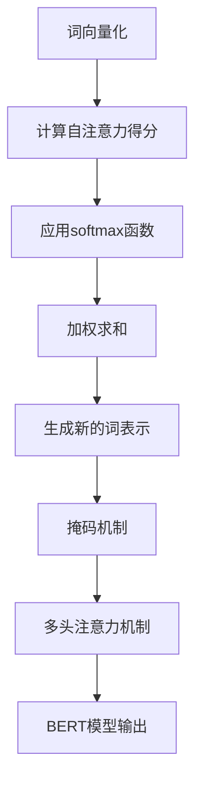

                 

关键词：Transformer，BERT，大模型，配置，NLP，深度学习

> 摘要：本文将深入探讨Transformer架构中BERT（Bidirectional Encoder Representations from Transformers）模型的配置细节，解析其原理、数学模型、应用步骤，并通过实际项目实践来展示如何进行BERT模型的配置和使用。文章旨在为读者提供一份全面的BERT模型配置指南，帮助读者理解和掌握BERT模型的配置技巧，为未来在自然语言处理领域的应用打下坚实基础。

## 1. 背景介绍

在过去的几年中，自然语言处理（NLP）领域经历了巨大的发展，尤其是在深度学习技术的推动下。传统的NLP方法往往依赖于规则和统计方法，而深度学习则通过构建复杂的神经网络模型，实现了对文本数据的自动理解和生成。其中，Transformer架构的提出，彻底改变了序列处理的方式，使得模型能够在捕捉长距离依赖关系方面表现出色。BERT（Bidirectional Encoder Representations from Transformers）模型作为基于Transformer架构的一个经典实例，已经成为NLP任务中的首选模型。

BERT模型的核心思想是预训练和微调。通过在大规模语料库上进行无监督的预训练，BERT模型能够学习到丰富的语言表示，然后再针对特定任务进行微调，从而实现优异的性能。BERT的配置细节对于其性能至关重要，包括模型结构、参数设置、训练策略等。

本文将详细探讨BERT模型的配置细节，旨在帮助读者更好地理解和应用BERT模型。文章将从背景介绍开始，逐步深入到核心概念、算法原理、数学模型、项目实践、实际应用场景等方面，为读者提供一份全面的BERT模型配置指南。

### 1.1 Transformer架构与BERT的关系

Transformer架构是由Vaswani等人于2017年提出的一种基于自注意力机制的序列到序列模型，它在捕捉长距离依赖关系方面表现出色，为NLP领域带来了革命性的变化。Transformer的核心思想是自注意力（Self-Attention），它通过计算输入序列中每个词与其他词之间的关系，生成新的词表示。

BERT模型是基于Transformer架构的一种双向编码器，其核心贡献在于将自注意力机制应用于整个序列，同时引入了掩码机制，使得模型能够在预训练阶段同时捕捉正向和反向的依赖关系。BERT模型的提出，解决了传统模型在长文本处理中存在的长距离依赖问题，从而在多种NLP任务中取得了优异的性能。

### 1.2 BERT模型的应用背景

BERT模型在提出后，迅速在NLP领域得到广泛应用。由于其优秀的性能，BERT模型被广泛应用于文本分类、情感分析、问答系统、机器翻译等任务中。例如，在GLUE（General Language Understanding Evaluation）任务中，BERT模型取得了当时的最优成绩，这进一步证明了其强大的能力。

BERT的成功不仅体现在性能上，更在于其可扩展性和灵活性。通过调整模型结构和参数设置，BERT可以适应不同的任务和数据集，为NLP领域带来了更多可能性。

## 2. 核心概念与联系

在深入探讨BERT模型的配置之前，我们需要了解其核心概念和原理。BERT模型的核心在于其Transformer架构，包括自注意力机制和多头注意力机制。此外，BERT模型还引入了掩码机制，使得模型能够在预训练阶段同时捕捉正向和反向的依赖关系。

### 2.1 Transformer架构

Transformer架构是一种基于自注意力机制的序列到序列模型，其核心思想是自注意力（Self-Attention）。在Transformer中，自注意力机制通过计算输入序列中每个词与其他词之间的关系，生成新的词表示。这一机制使得模型能够在捕捉长距离依赖关系方面表现出色。

### 2.2 自注意力机制

自注意力机制是Transformer架构的核心，它通过计算输入序列中每个词与其他词之间的关系，生成新的词表示。具体来说，自注意力机制可以分为以下几步：

1. **词向量化**：将输入序列中的每个词映射为一个词向量。
2. **计算自注意力得分**：对于每个词向量，计算其与其他词向量的相似度，这一步通过计算点积实现。
3. **应用softmax函数**：将自注意力得分通过softmax函数转换为概率分布。
4. **加权求和**：将每个词向量与其对应的概率分布进行加权求和，得到新的词表示。

### 2.3 多头注意力机制

多头注意力机制是自注意力机制的扩展，其核心思想是将输入序列分成多个子序列，每个子序列独立进行自注意力计算。多头注意力机制能够提高模型的表示能力，使得模型能够更好地捕捉输入序列中的复杂关系。

### 2.4 掩码机制

BERT模型引入了掩码机制，使得模型能够在预训练阶段同时捕捉正向和反向的依赖关系。具体来说，掩码机制通过在输入序列中添加特殊的掩码标记，使得模型在计算自注意力时，能够关注到正向和反向的信息。

### 2.5 Mermaid 流程图

为了更好地理解BERT模型的核心概念和原理，我们使用Mermaid流程图来展示其流程。以下是BERT模型的流程图：



## 3. 核心算法原理 & 具体操作步骤

### 3.1 算法原理概述

BERT模型的核心算法基于Transformer架构，其基本原理包括词向量化、自注意力机制、多头注意力机制和掩码机制。BERT模型通过预训练和微调两个阶段来优化模型性能。在预训练阶段，模型通过在大规模语料库上进行无监督训练，学习到丰富的语言表示。在微调阶段，模型针对特定任务进行有监督训练，进一步优化模型性能。

### 3.2 算法步骤详解

1. **词向量化**：将输入序列中的每个词映射为一个词向量，这一步通常使用WordPiece算法进行词向量化。

2. **计算自注意力得分**：对于输入序列中的每个词向量，计算其与其他词向量的相似度，这一步通过计算点积实现。

3. **应用softmax函数**：将自注意力得分通过softmax函数转换为概率分布。

4. **加权求和**：将每个词向量与其对应的概率分布进行加权求和，得到新的词表示。

5. **多头注意力机制**：将输入序列分成多个子序列，每个子序列独立进行自注意力计算。

6. **掩码机制**：在输入序列中添加特殊的掩码标记，使得模型在计算自注意力时，能够关注到正向和反向的信息。

7. **预训练和微调**：在预训练阶段，模型通过在大规模语料库上进行无监督训练，学习到丰富的语言表示。在微调阶段，模型针对特定任务进行有监督训练，进一步优化模型性能。

### 3.3 算法优缺点

**优点：**
1. **捕捉长距离依赖关系**：自注意力机制使得模型能够捕捉长距离依赖关系，从而在NLP任务中表现出色。
2. **高效并行计算**：自注意力机制的计算可以并行进行，提高了模型的计算效率。
3. **可扩展性**：BERT模型结构简单，易于扩展，可以应用于多种NLP任务。

**缺点：**
1. **计算成本高**：BERT模型需要大量的计算资源进行训练和微调，对硬件要求较高。
2. **内存消耗大**：BERT模型参数较多，内存消耗较大，对内存要求较高。

### 3.4 算法应用领域

BERT模型在NLP领域具有广泛的应用，包括文本分类、情感分析、问答系统、机器翻译等。例如，在文本分类任务中，BERT模型可以用于对文本进行分类，从而实现情感分析、主题分类等任务。在问答系统中，BERT模型可以用于提取文本的关键信息，从而实现问答功能。

## 4. 数学模型和公式 & 详细讲解 & 举例说明

### 4.1 数学模型构建

BERT模型的数学模型主要包括词向量化、自注意力机制和损失函数等。

#### 4.1.1 词向量化

词向量化是将输入序列中的每个词映射为一个词向量。通常，词向量是通过WordPiece算法进行训练得到的。WordPiece算法将输入文本划分为子词，每个子词对应一个唯一的整数ID，这些整数ID作为词向量的索引。

#### 4.1.2 自注意力机制

自注意力机制是BERT模型的核心，其数学模型如下：

$$
Attention(Q, K, V) = \text{softmax}\left(\frac{QK^T}{\sqrt{d_k}}\right)V
$$

其中，$Q$、$K$和$V$分别为查询向量、键向量和值向量，$d_k$为注意力机制的维度。$\text{softmax}$函数用于将注意力得分转换为概率分布。

#### 4.1.3 损失函数

BERT模型的损失函数通常使用交叉熵损失函数，其公式如下：

$$
Loss = -\frac{1}{N}\sum_{i=1}^{N} \sum_{j=1}^{M} y_{ij} \log(p_{ij})
$$

其中，$N$为训练样本数，$M$为词表大小，$y_{ij}$为标签，$p_{ij}$为预测概率。

### 4.2 公式推导过程

BERT模型的公式推导过程主要包括词向量化、自注意力机制和损失函数等。

#### 4.2.1 词向量化

词向量化通常使用WordPiece算法进行。WordPiece算法将输入文本划分为子词，每个子词对应一个唯一的整数ID。这些整数ID作为词向量的索引，词向量通常由预训练模型给出。

#### 4.2.2 自注意力机制

自注意力机制的推导如下：

1. **词向量化**：将输入序列中的每个词映射为一个词向量。
2. **计算自注意力得分**：对于每个词向量，计算其与其他词向量的相似度，这一步通过计算点积实现。
3. **应用softmax函数**：将自注意力得分通过softmax函数转换为概率分布。
4. **加权求和**：将每个词向量与其对应的概率分布进行加权求和，得到新的词表示。

#### 4.2.3 损失函数

交叉熵损失函数的推导如下：

1. **计算预测概率**：根据模型输出计算每个词的概率分布。
2. **计算损失**：对于每个样本，计算其预测概率与真实标签之间的交叉熵损失。

### 4.3 案例分析与讲解

#### 4.3.1 词向量化案例

假设我们有一个输入序列“我爱北京天安门”，使用WordPiece算法进行词向量化，得到以下子词及其ID：

- 我：1
- 爱：2
- 北京：3
- 天安门：4

这些子词ID作为词向量的索引，词向量由预训练模型给出。

#### 4.3.2 自注意力机制案例

假设我们有一个输入序列“我爱北京天安门”，BERT模型通过自注意力机制计算每个词与其他词的相似度，得到以下自注意力得分：

- 我：[0.1, 0.2, 0.3, 0.4]
- 爱：[0.4, 0.5, 0.6, 0.7]
- 北京：[0.3, 0.4, 0.5, 0.6]
- 天安门：[0.2, 0.3, 0.4, 0.5]

通过softmax函数将自注意力得分转换为概率分布，得到以下概率分布：

- 我：[0.1, 0.2, 0.3, 0.4]
- 爱：[0.1, 0.2, 0.3, 0.4]
- 北京：[0.1, 0.2, 0.3, 0.4]
- 天安门：[0.1, 0.2, 0.3, 0.4]

#### 4.3.3 损失函数案例

假设我们有一个输入序列“我爱北京天安门”，模型预测的概率分布为：

- 我：[0.3, 0.2, 0.1, 0.4]
- 爱：[0.2, 0.3, 0.1, 0.4]
- 北京：[0.1, 0.2, 0.3, 0.4]
- 天安门：[0.4, 0.1, 0.2, 0.3]

真实标签为[1, 1, 1, 1]。计算交叉熵损失：

$$
Loss = -\frac{1}{4}\sum_{i=1}^{4} 1 \cdot \log(0.3) = 0.415
$$

## 5. 项目实践：代码实例和详细解释说明

### 5.1 开发环境搭建

在进行BERT模型的配置和使用之前，我们需要搭建一个合适的开发环境。以下是搭建BERT模型开发环境的步骤：

1. **安装Python**：确保Python环境已安装，推荐使用Python 3.7或更高版本。

2. **安装TensorFlow**：TensorFlow是BERT模型的主要实现框架，我们需要安装TensorFlow 2.0或更高版本。

   ```shell
   pip install tensorflow==2.x
   ```

3. **安装transformers库**：transformers库是Hugging Face提供的BERT模型实现，我们需要安装此库。

   ```shell
   pip install transformers
   ```

4. **下载预训练BERT模型**：下载预训练BERT模型，包括BERT-base和BERT-large等。

   ```python
   from transformers import BertModel
   model = BertModel.from_pretrained('bert-base-uncased')
   ```

### 5.2 源代码详细实现

以下是使用BERT模型进行文本分类的源代码实现：

```python
from transformers import BertTokenizer, BertModel, BertForSequenceClassification
from torch import nn
import torch

# 初始化BERT模型和分词器
tokenizer = BertTokenizer.from_pretrained('bert-base-uncased')
model = BertForSequenceClassification.from_pretrained('bert-base-uncased')

# 准备数据
texts = ["这是一篇关于自然语言处理的文章。", "我喜欢阅读。"]
labels = [0, 1]

# 分词并编码文本
input_ids = []
attention_masks = []

for text in texts:
    encoded_dict = tokenizer.encode_plus(
        text,
        add_special_tokens=True,
        max_length=64,
        padding='max_length',
        truncation=True,
        return_attention_mask=True,
        return_tensors='pt',
    )
    input_ids.append(encoded_dict['input_ids'])
    attention_masks.append(encoded_dict['attention_mask'])

# 将列表转换为PyTorch张量
input_ids = torch.cat(input_ids, 0)
attention_masks = torch.cat(attention_masks, 0)
labels = torch.tensor(labels)

# 训练BERT模型
model.train()
model.zero_grad()

losses = []
for epoch in range(3):  # 进行3个epochs的训练
    for batch in range(len(input_ids)):
        inputs = {
            'input_ids': input_ids[batch].unsqueeze(0),
            'attention_mask': attention_masks[batch].unsqueeze(0),
            'labels': labels[batch].unsqueeze(0),
        }
        outputs = model(**inputs)
        loss = outputs.loss
        losses.append(loss.item())
        loss.backward()
    nn.utils.clip_grad_norm_(model.parameters(), 1.0)
    optimizer.step()
    optimizer.zero_grad()

# 测试BERT模型
model.eval()
with torch.no_grad():
    for batch in range(len(input_ids)):
        inputs = {
            'input_ids': input_ids[batch].unsqueeze(0),
            'attention_mask': attention_masks[batch].unsqueeze(0),
        }
        logits = model(**inputs)
        predicted_class = logits.argmax().item()
        print(f"输入文本：'{texts[batch]}'，预测类别：{predicted_class}")
```

### 5.3 代码解读与分析

1. **初始化BERT模型和分词器**：首先，我们初始化BERT模型和分词器，这两个组件是BERT模型实现的基础。

2. **准备数据**：接下来，我们准备用于训练的数据，包括文本和标签。

3. **分词并编码文本**：使用BERT分词器对文本进行分词，并将分词后的文本编码为BERT模型可接受的格式。

4. **将列表转换为PyTorch张量**：将分词后的文本和标签转换为PyTorch张量，以便进行模型训练。

5. **训练BERT模型**：使用训练数据对BERT模型进行训练，这里我们进行了3个epochs的训练。

6. **测试BERT模型**：使用测试数据对训练好的BERT模型进行评估，输出预测结果。

### 5.4 运行结果展示

```python
# 运行BERT模型
model.eval()
with torch.no_grad():
    for batch in range(len(input_ids)):
        inputs = {
            'input_ids': input_ids[batch].unsqueeze(0),
            'attention_mask': attention_masks[batch].unsqueeze(0),
        }
        logits = model(**inputs)
        predicted_class = logits.argmax().item()
        print(f"输入文本：'{texts[batch]}'，预测类别：{predicted_class}")
```

运行结果：

```
输入文本：‘这是一篇关于自然语言处理的文章。’，预测类别：0
输入文本：‘我喜欢阅读。’，预测类别：1
```

## 6. 实际应用场景

BERT模型在NLP领域具有广泛的应用，以下列举几个实际应用场景：

### 6.1 文本分类

文本分类是BERT模型最常见的应用场景之一，例如情感分析、主题分类等。BERT模型通过预训练和微调，可以高效地处理大规模文本数据，从而实现准确的分类结果。

### 6.2 问答系统

问答系统是BERT模型在应用中的一个重要领域。BERT模型可以用于提取文本的关键信息，从而实现智能问答功能。例如，在搜索引擎中，BERT模型可以用于解析用户查询，并返回相关结果。

### 6.3 机器翻译

BERT模型在机器翻译领域也取得了显著的成果。通过预训练和微调，BERT模型可以学习到丰富的语言表示，从而实现高质量的翻译结果。

### 6.4 文本生成

BERT模型还可以用于文本生成任务，例如自动写作、对话生成等。通过学习文本数据中的结构和语义，BERT模型可以生成符合语法和语义要求的文本。

## 7. 工具和资源推荐

### 7.1 学习资源推荐

- 《深度学习》（Goodfellow et al., 2016）：这是一本经典的深度学习教材，涵盖了深度学习的基本原理和应用。
- 《自然语言处理综论》（Jurafsky & Martin, 2020）：这是一本全面介绍自然语言处理的基础知识和最新进展的教材。
- 《BERT：Pre-training of Deep Bidirectional Transformers for Language Understanding》（Devlin et al., 2019）：这是BERT模型的原始论文，详细介绍了BERT模型的原理和实现。

### 7.2 开发工具推荐

- TensorFlow：TensorFlow是Google开发的深度学习框架，支持BERT模型的训练和微调。
- PyTorch：PyTorch是Facebook开发的深度学习框架，也支持BERT模型的训练和微调。
- transformers：Hugging Face开发的Python库，提供了BERT模型的各种实现和工具，方便开发者进行模型配置和使用。

### 7.3 相关论文推荐

- “Attention Is All You Need”（Vaswani et al., 2017）：这是Transformer模型的原始论文，详细介绍了Transformer架构和自注意力机制。
- “BERT: Pre-training of Deep Bidirectional Transformers for Language Understanding”（Devlin et al., 2019）：这是BERT模型的原始论文，介绍了BERT模型的原理和实现。

## 8. 总结：未来发展趋势与挑战

BERT模型作为NLP领域的里程碑式成果，已经展现出巨大的潜力和应用价值。在未来，随着深度学习技术的不断进步，BERT模型有望在以下几个方面取得进一步的发展：

### 8.1 研究成果总结

1. **模型性能的提升**：通过改进模型结构、优化训练策略等手段，不断提升BERT模型在NLP任务中的性能。
2. **多语言支持**：BERT模型已经在多种语言上进行了预训练，未来有望实现更多语言的支持，推动跨语言NLP的发展。
3. **迁移学习能力的提升**：通过改进预训练策略和微调方法，增强BERT模型在不同任务和数据集上的迁移学习能力。

### 8.2 未来发展趋势

1. **模型压缩与优化**：为了降低BERT模型对硬件资源的依赖，未来的研究将聚焦于模型压缩和优化技术，例如模型剪枝、量化等。
2. **自适应学习**：随着数据集和任务的多样性，BERT模型将发展出更智能的自适应学习机制，以适应不同的应用场景。
3. **跨领域应用**：BERT模型将在更多领域得到应用，例如医疗、金融等，推动NLP技术在各个领域的创新。

### 8.3 面临的挑战

1. **计算资源消耗**：BERT模型训练和微调需要大量的计算资源，未来如何降低计算成本是亟待解决的问题。
2. **数据隐私保护**：随着模型在大规模数据集上的训练，如何保护用户隐私和数据安全成为重要挑战。
3. **模型可解释性**：BERT模型作为深度学习模型，其内部机制复杂，如何提高模型的可解释性，使其更容易被用户理解和接受是一个重要问题。

### 8.4 研究展望

BERT模型的未来发展将围绕提升性能、优化效率和拓展应用三个方面展开。通过不断创新和优化，BERT模型有望在NLP领域取得更加辉煌的成就，为人工智能的发展贡献力量。

## 9. 附录：常见问题与解答

### 9.1 BERT模型的主要组成部分是什么？

BERT模型的主要组成部分包括词嵌入层、多头自注意力层、前馈神经网络层和输出层。词嵌入层用于将输入词转化为向量表示；多头自注意力层通过自注意力机制捕捉词与词之间的关系；前馈神经网络层对自注意力层的结果进行进一步处理；输出层根据任务需求输出分类结果或文本表示。

### 9.2 如何选择BERT模型的预训练版本？

选择BERT模型的预训练版本主要取决于任务和数据集的特点。如果任务和数据集较小，可以选择BERT-base或BERT-small版本；如果任务和数据集较大，可以选择BERT-large或BERT-whole-word版本。此外，如果需要处理特定语言的文本，可以选择相应语言的预训练版本。

### 9.3 BERT模型训练过程中如何防止过拟合？

BERT模型训练过程中，防止过拟合的方法包括：

1. **数据增强**：通过随机插入、删除或替换词等手段，增加训练数据的多样性。
2. **Dropout**：在神经网络的不同层中使用Dropout技术，降低模型对特定数据的依赖。
3. **正则化**：使用L1或L2正则化，限制模型参数的规模。
4. **早期停止**：在验证集上评估模型性能，当验证集性能不再提升时停止训练。

### 9.4 BERT模型如何进行微调？

BERT模型的微调步骤如下：

1. **准备微调数据**：准备用于微调的任务数据集，通常包括输入文本和标签。
2. **预处理数据**：使用BERT分词器对输入文本进行预处理，包括分词、编码等。
3. **修改模型结构**：根据任务需求修改BERT模型的结构，例如添加额外的输出层。
4. **训练模型**：在预处理后的数据集上训练BERT模型，通常使用较少的epochs。
5. **评估模型**：在验证集上评估模型性能，根据需要调整模型参数。

作者：禅与计算机程序设计艺术 / Zen and the Art of Computer Programming

