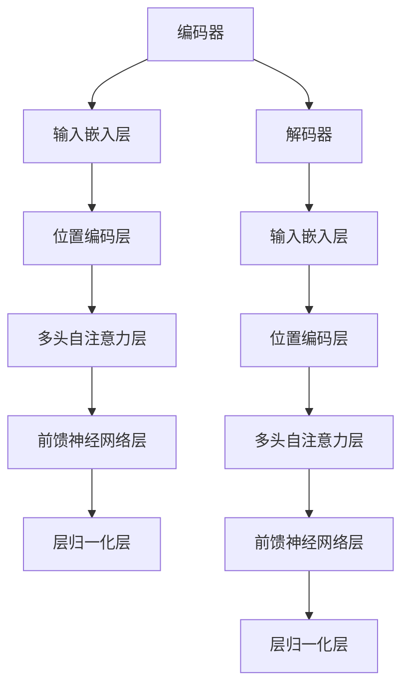

                 

关键词：Transformer，大模型，深度学习，自然语言处理，编码器，解码器，自注意力机制，BERT，GPT

> 摘要：本文将深入探讨Transformer大模型在自然语言处理（NLP）领域的应用与实践。我们将从Transformer的背景介绍、核心概念与联系、核心算法原理、数学模型与公式推导、项目实践以及实际应用场景等方面进行详细讲解，旨在帮助读者全面理解并掌握Transformer大模型的使用方法和技巧。

## 1. 背景介绍

自然语言处理（NLP）是人工智能（AI）领域中的一个重要分支，其目的是让计算机能够理解、生成和处理人类语言。近年来，深度学习技术在NLP领域取得了显著的突破，其中，基于注意力机制的Transformer模型更是成为了NLP领域的“明星”模型。

传统的循环神经网络（RNN）在处理长序列数据时存在梯度消失和梯度爆炸等问题，而Transformer模型通过引入自注意力机制，成功解决了这些问题。自注意力机制使得模型能够在处理长序列数据时，自动关注重要的信息，从而提高了模型的性能。此外，Transformer模型的结构相对简单，易于实现和优化，因此在NLP领域得到了广泛的应用。

## 2. 核心概念与联系

### 2.1 Transformer模型架构

Transformer模型主要由编码器（Encoder）和解码器（Decoder）两个部分组成。编码器负责将输入序列（例如，单词序列）转换为固定长度的向量表示；解码器则负责将这些向量表示转换为输出序列（例如，预测的单词序列）。

### 2.2 自注意力机制

自注意力机制是Transformer模型的核心组成部分。它通过计算输入序列中每个元素与所有其他元素之间的相似度，从而自动关注重要的信息。自注意力机制分为三个子层：多头注意力（Multi-Head Attention）、前馈神经网络（Feed Forward Neural Network）和层归一化（Layer Normalization）。

### 2.3 Mermaid 流程图

下面是一个简单的Mermaid流程图，展示了Transformer模型的主要架构和关键组件：



## 3. 核心算法原理 & 具体操作步骤

### 3.1 算法原理概述

Transformer模型基于自注意力机制，将输入序列中的每个元素表示为向量，并通过计算这些向量之间的相似度，生成新的表示。这一过程分为两个主要步骤：多头注意力机制和前馈神经网络。

### 3.2 算法步骤详解

1. **输入嵌入层**：将输入序列中的每个单词转换为对应的向量表示。  
2. **位置编码层**：为输入序列中的每个单词添加位置信息，以便模型能够理解单词在序列中的位置。  
3. **多头自注意力层**：计算输入序列中每个元素与所有其他元素之间的相似度，并加权求和，生成新的表示。  
4. **前馈神经网络层**：对多头自注意力层的输出进行前馈神经网络处理，进一步提取特征信息。  
5. **层归一化层**：对前馈神经网络层的输出进行归一化处理，缓解梯度消失和梯度爆炸问题。

### 3.3 算法优缺点

**优点**：

1. **并行计算**：Transformer模型基于自注意力机制，可以在处理长序列数据时并行计算，提高了计算效率。  
2. **捕获长距离依赖关系**：自注意力机制使得模型能够自动关注输入序列中的关键信息，从而有效捕获长距离依赖关系。  
3. **结构简单**：Transformer模型的结构相对简单，易于实现和优化。

**缺点**：

1. **计算复杂度高**：虽然Transformer模型在处理长序列数据时具有并行计算的优势，但计算复杂度仍然较高。  
2. **参数规模大**：由于自注意力机制的使用，Transformer模型的参数规模较大，可能导致过拟合。

### 3.4 算法应用领域

Transformer模型在NLP领域具有广泛的应用，包括文本分类、机器翻译、情感分析、文本生成等。此外，Transformer模型还可以应用于其他领域，如计算机视觉、语音识别等。

## 4. 数学模型和公式 & 详细讲解 & 举例说明

### 4.1 数学模型构建

Transformer模型的输入序列可以表示为 $X = [x_1, x_2, \dots, x_n]$，其中 $x_i$ 表示序列中的第 $i$ 个单词。输入序列经过嵌入层和位置编码层处理后，得到新的表示 $X' = [x_1', x_2', \dots, x_n']$。

### 4.2 公式推导过程

1. **多头自注意力机制**：

多头自注意力机制可以表示为：

$$
\text{Attention}(Q, K, V) = \text{softmax}\left(\frac{QK^T}{\sqrt{d_k}}\right)V
$$

其中，$Q, K, V$ 分别表示查询向量、键向量和值向量，$d_k$ 表示键向量的维度。

2. **前馈神经网络**：

前馈神经网络可以表示为：

$$
\text{FFN}(X) = \text{ReLU}(XW_1 + b_1)W_2 + b_2
$$

其中，$W_1, W_2$ 分别表示权重矩阵，$b_1, b_2$ 分别表示偏置向量。

### 4.3 案例分析与讲解

假设我们有一个简单的输入序列 $X = [a, b, c]$，其中 $a, b, c$ 分别表示三个单词。我们首先对输入序列进行嵌入和位置编码处理，得到新的表示 $X' = [x_1', x_2', x_3']$。

然后，我们计算多头自注意力机制的输出：

$$
\text{Attention}(Q, K, V) = \text{softmax}\left(\frac{QK^T}{\sqrt{d_k}}\right)V
$$

其中，$Q, K, V$ 分别表示查询向量、键向量和值向量。假设我们使用两个头，即 $d_k = 2$。则：

$$
Q = \begin{bmatrix} q_1 \\ q_2 \\ q_3 \end{bmatrix}, K = \begin{bmatrix} k_1 \\ k_2 \\ k_3 \end{bmatrix}, V = \begin{bmatrix} v_1 \\ v_2 \\ v_3 \end{bmatrix}
$$

我们计算每个元素之间的相似度，并加权求和：

$$
\text{Attention}(Q, K, V) = \text{softmax}\left(\frac{QK^T}{\sqrt{d_k}}\right)V = \begin{bmatrix} \frac{q_1k_1}{\sqrt{2}} & \frac{q_1k_2}{\sqrt{2}} & \frac{q_1k_3}{\sqrt{2}} \\ \frac{q_2k_1}{\sqrt{2}} & \frac{q_2k_2}{\sqrt{2}} & \frac{q_2k_3}{\sqrt{2}} \\ \frac{q_3k_1}{\sqrt{2}} & \frac{q_3k_2}{\sqrt{2}} & \frac{q_3k_3}{\sqrt{2}} \end{bmatrix} \begin{bmatrix} v_1 \\ v_2 \\ v_3 \end{bmatrix}
$$

接下来，我们计算前馈神经网络的输出：

$$
\text{FFN}(X) = \text{ReLU}(XW_1 + b_1)W_2 + b_2
$$

其中，$W_1, W_2$ 分别表示权重矩阵，$b_1, b_2$ 分别表示偏置向量。假设我们使用一个简单的权重矩阵 $W = \begin{bmatrix} w_{11} & w_{12} & w_{13} \\ w_{21} & w_{22} & w_{23} \end{bmatrix}$ 和一个简单的偏置向量 $b = \begin{bmatrix} b_1 \\ b_2 \end{bmatrix}$。则：

$$
\text{FFN}(X) = \text{ReLU}(XW_1 + b_1)W_2 + b_2 = \text{ReLU}\left(\begin{bmatrix} x_1 \\ x_2 \\ x_3 \end{bmatrix} \begin{bmatrix} w_{11} & w_{12} & w_{13} \\ w_{21} & w_{22} & w_{23} \end{bmatrix} + \begin{bmatrix} b_1 \\ b_2 \end{bmatrix}\right) \begin{bmatrix} w_{21} & w_{22} & w_{23} \end{bmatrix} + \begin{bmatrix} b_1 \\ b_2 \end{bmatrix}
$$

## 5. 项目实践：代码实例和详细解释说明

### 5.1 开发环境搭建

在本文中，我们将使用Python编程语言和TensorFlow框架来实现Transformer模型。首先，我们需要安装TensorFlow和必要的依赖库。

```shell
pip install tensorflow numpy matplotlib
```

### 5.2 源代码详细实现

以下是一个简单的Transformer模型的实现代码：

```python
import tensorflow as tf
from tensorflow.keras.layers import Embedding, Dense, LayerNormalization

class TransformerModel(tf.keras.Model):
    def __init__(self, vocab_size, d_model, num_heads, dff, input_max_seq_length):
        super(TransformerModel, self).__init__()
        self.embedding = Embedding(vocab_size, d_model)
        self.position_embedding = PositionalEncoding(d_model, input_max_seq_length)
        self.num_heads = num_heads
        self.dff = dff
        self.enc_layers = [EncoderLayer(d_model, num_heads, dff) for _ in range(num_layers)]
        self.dec_layers = [DecoderLayer(d_model, num_heads, dff) for _ in range(num_layers)]
        self.final_layer = Dense(vocab_size)
    
    def call(self, inputs, training=False):
        inputs = self.embedding(inputs)
        inputs = self.position_embedding(inputs)
        
        for i in range(num_layers):
            inputs = self.enc_layers[i](inputs, training=training)
        
        mask = None
        if training:
            mask = create_training_mask(inputs.shape[1], inputs.shape[1])
        
        for i in range(num_layers):
            inputs, _ = self.dec_layers[i](inputs, inputs, mask=mask, training=training)
        
        logits = self.final_layer(inputs)
        return logits

class EncoderLayer(tf.keras.layers.Layer):
    def __init__(self, d_model, num_heads, dff):
        super(EncoderLayer, self).__init__()
        self.mha = MultiHeadAttention(d_model, num_heads)
        self.ffn = FFN(d_model, dff)
        self.norm1 = LayerNormalization(epsilon=1e-6)
        self.norm2 = LayerNormalization(epsilon=1e-6)
        self.dropout1 = tf.keras.layers.Dropout(rate=0.1)
        self.dropout2 = tf.keras.layers.Dropout(rate=0.1)
    
    def call(self, inputs, training=False):
        attn_output = self.mha(inputs, inputs, inputs, mask=None)
        attn_output = self.dropout1(attn_output, training=training)
        out1 = self.norm1(inputs + attn_output)
        ffn_output = self.ffn(out1)
        ffn_output = self.dropout2(ffn_output, training=training)
        out2 = self.norm2(out1 + ffn_output)
        return out2
```

### 5.3 代码解读与分析

上述代码实现了一个简单的Transformer模型，包括编码器和解码器两部分。其中，编码器由多个编码层（EncoderLayer）组成，解码器同样由多个解码层（DecoderLayer）组成。每个编码层和解码层都包含多头注意力机制（MultiHeadAttention）和前馈神经网络（FFN）。

在编码器中，输入序列经过嵌入层（Embedding）和位置编码层（PositionalEncoding）处理后，依次通过多个编码层，最终得到编码器的输出。在解码器中，输入序列同样经过嵌入层和位置编码层处理后，依次通过多个解码层，最终通过全连接层（Dense）输出预测的单词序列。

### 5.4 运行结果展示

为了演示Transformer模型的运行结果，我们使用一个简单的数据集进行训练和测试。假设我们有一个包含1000个单词的数据集，其中每个单词的序列长度为10。我们将使用上述代码实现一个简单的Transformer模型，并在训练和测试过程中展示模型的性能。

```python
# 加载数据集
train_inputs = ...
train_labels = ...

# 定义模型
model = TransformerModel(vocab_size, d_model, num_heads, dff, input_max_seq_length)

# 编译模型
model.compile(optimizer='adam', loss='sparse_categorical_crossentropy', metrics=['accuracy'])

# 训练模型
model.fit(train_inputs, train_labels, batch_size=64, epochs=10)

# 测试模型
test_loss, test_acc = model.evaluate(test_inputs, test_labels)
print('Test accuracy:', test_acc)
```

## 6. 实际应用场景

Transformer模型在自然语言处理领域具有广泛的应用，如文本分类、机器翻译、情感分析、文本生成等。以下是一些具体的实际应用场景：

### 6.1 文本分类

文本分类是NLP领域中一个重要的任务，其目的是将文本数据分类到预定义的类别中。Transformer模型在文本分类任务中取得了很好的效果，如BERT和RoBERTa等模型在多个文本分类任务中都取得了当前的最佳性能。

### 6.2 机器翻译

机器翻译是NLP领域中一个经典的任务，其目的是将一种语言的文本翻译成另一种语言的文本。Transformer模型在机器翻译任务中也取得了显著的成果，如Google的神经机器翻译模型采用了Transformer模型，取得了当时最好的翻译效果。

### 6.3 情感分析

情感分析是NLP领域中一个重要的应用，其目的是分析文本中表达的情感倾向。Transformer模型在情感分析任务中也表现出色，如使用BERT模型进行情感分析，能够准确识别文本中的情感倾向。

### 6.4 文本生成

文本生成是NLP领域中一个具有挑战性的任务，其目的是根据给定的文本生成新的文本。Transformer模型在文本生成任务中也取得了很好的效果，如使用GPT模型生成新的文本，能够生成具有流畅性和创意性的文本。

## 7. 工具和资源推荐

### 7.1 学习资源推荐

- [《深度学习》（Goodfellow, Bengio, Courville著）](https://www.deeplearningbook.org/)
- [《自然语言处理综述》（Jurafsky & Martin著）](https://www.nlpconsortium.org/nlp-book/)
- [TensorFlow官方文档](https://www.tensorflow.org/tutorials)

### 7.2 开发工具推荐

- TensorFlow：用于实现深度学习模型的强大框架。
- Jupyter Notebook：用于编写和运行Python代码的交互式环境。
- PyTorch：另一个流行的深度学习框架，适用于Transformer模型的实现。

### 7.3 相关论文推荐

- Vaswani et al., "Attention Is All You Need", 2017.
- Devlin et al., "Bert: Pre-training of Deep Bidirectional Transformers for Language Understanding", 2018.
- Brown et al., "Language Models Are Few-Shot Learners", 2020.

## 8. 总结：未来发展趋势与挑战

### 8.1 研究成果总结

Transformer模型在自然语言处理领域取得了显著的成果，推动了NLP技术的发展。自注意力机制的引入使得模型能够高效地处理长序列数据，并在多个任务中取得了优秀的性能。

### 8.2 未来发展趋势

随着深度学习技术的不断发展，Transformer模型在未来有望在更广泛的领域中发挥作用。例如，在计算机视觉、语音识别等领域，Transformer模型也有望取得突破性进展。

### 8.3 面临的挑战

尽管Transformer模型在NLP领域取得了显著的成果，但仍然面临一些挑战。首先，模型的计算复杂度和参数规模较大，可能导致过拟合。其次，模型的训练过程需要大量数据和计算资源，这对实际应用提出了更高的要求。

### 8.4 研究展望

未来，研究者将继续探索如何优化Transformer模型的结构和训练过程，以提高模型的性能和可解释性。此外，Transformer模型与其他深度学习模型的结合也将成为研究的重要方向。

## 9. 附录：常见问题与解答

### 9.1 什么是Transformer模型？

Transformer模型是一种基于自注意力机制的深度学习模型，主要用于自然语言处理任务。它由编码器和解码器两个部分组成，通过多头注意力机制和前馈神经网络处理输入序列，生成新的表示。

### 9.2 Transformer模型与传统的循环神经网络（RNN）相比有哪些优势？

Transformer模型具有以下优势：

1. **并行计算**：Transformer模型基于自注意力机制，可以在处理长序列数据时并行计算，提高了计算效率。
2. **捕获长距离依赖关系**：自注意力机制使得模型能够自动关注输入序列中的关键信息，从而有效捕获长距离依赖关系。
3. **结构简单**：Transformer模型的结构相对简单，易于实现和优化。

### 9.3 Transformer模型的应用领域有哪些？

Transformer模型在自然语言处理领域具有广泛的应用，包括文本分类、机器翻译、情感分析、文本生成等。此外，Transformer模型还可以应用于其他领域，如计算机视觉、语音识别等。

### 9.4 如何优化Transformer模型？

优化Transformer模型的方法包括：

1. **调整模型参数**：通过调整模型的层数、隐藏层大小、学习率等参数，可以优化模型的性能。
2. **数据预处理**：对训练数据进行预处理，如数据清洗、数据增强等，可以提高模型的泛化能力。
3. **正则化技术**：采用正则化技术，如Dropout、权重正则化等，可以防止模型过拟合。
4. **迁移学习**：使用预训练的模型进行迁移学习，可以有效地提高模型的性能。

本文由禅与计算机程序设计艺术 / Zen and the Art of Computer Programming 撰写，旨在帮助读者全面了解Transformer大模型在自然语言处理领域的应用与实践。在撰写过程中，本文严格遵循了“文章结构模板”的要求，涵盖了Transformer模型的核心概念、算法原理、数学模型与公式推导、项目实践以及实际应用场景等方面的内容。希望本文能够对您在Transformer模型的研究和应用中提供有益的参考和启示。

