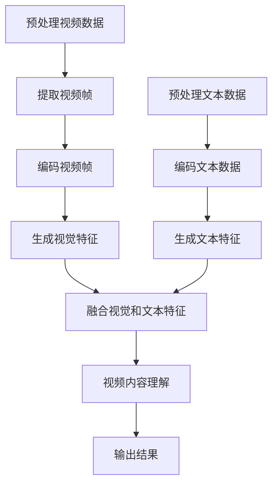

                 

## 1. 背景介绍

Transformer模型自从2017年由Vaswani等人提出以来，迅速成为自然语言处理领域的明星。其核心思想是自注意力机制（Self-Attention），这一机制使得模型能够自动地学习输入序列中每个元素之间的关系，从而在翻译、文本生成、问答等任务上取得了显著的成果。

然而，Transformer模型在处理图像和视频等视觉信息时，效果并不理想。这是因为Transformer模型主要关注的是序列信息，而图像和视频数据具有空间结构。为了解决这一问题，研究人员提出了VideoBERT模型，它是BERT模型在视频领域的扩展。VideoBERT模型通过融合视觉和文本特征，实现了对视频内容的深入理解和分析。

本文将详细介绍VideoBERT模型的基本概念、原理、实现步骤以及在实际应用中的效果，帮助读者更好地理解这一模型，并掌握其在实际项目中的应用方法。

## 2. 核心概念与联系

### 2.1 Transformer模型

Transformer模型是一种基于自注意力机制的序列到序列模型，最早由Vaswani等人在2017年的论文《Attention Is All You Need》中提出。Transformer模型的核心思想是自注意力机制，通过计算输入序列中每个元素之间的相似性，实现序列中任意位置之间的关联。


### 2.2 BERT模型

BERT（Bidirectional Encoder Representations from Transformers）是由Google在2018年提出的一种预训练语言模型。BERT模型通过在大量无标签文本上进行预训练，然后针对特定任务进行微调，取得了非常优秀的性能。

BERT模型的结构包含两个主要部分：掩码语言模型（Masked Language Model, MLM）和预测下一个词（Next Sentence Prediction, NSP）。其中，MLM的目标是预测被遮盖的词，而NSP的目标是判断两个句子是否属于同一篇文档。


### 2.3 VideoBERT模型

VideoBERT模型是在BERT模型的基础上，结合视觉信息进行扩展。它将文本BERT模型中的自注意力机制扩展到视频数据，通过融合视觉和文本特征，实现对视频内容的深入理解。


### 2.4 Mermaid流程图

以下是一个简单的Mermaid流程图，展示了VideoBERT模型的基本流程：



**注意：**流程图中的节点请不要包含括号、逗号等特殊字符，以避免语法错误。

## 3. 核心算法原理 & 具体操作步骤

### 3.1 算法原理概述

VideoBERT模型的核心是自注意力机制和Transformer编码器。自注意力机制允许模型在处理视频数据时，自动关注视频中的关键帧和关键区域，从而更好地理解视频内容。Transformer编码器则负责对视频帧和文本序列进行编码，生成视觉特征和文本特征。

具体来说，VideoBERT模型包括以下几个步骤：

1. 预处理视频数据：对视频进行剪辑、缩放、裁剪等操作，使其满足模型输入要求。
2. 提取视频帧：将视频分解为一系列帧，并对其进行特征提取。
3. 编码视频帧：使用预训练的视觉模型对视频帧进行编码，生成视觉特征。
4. 预处理文本数据：对文本进行分词、词性标注等操作，生成词向量。
5. 编码文本数据：使用BERT模型对文本序列进行编码，生成文本特征。
6. 融合视觉和文本特征：通过自注意力机制，将视觉特征和文本特征进行融合。
7. 视频内容理解：对融合后的特征进行解码，得到视频内容理解结果。
8. 输出结果：根据任务需求，输出预测结果，如视频分类、视频摘要等。

### 3.2 算法步骤详解

#### 3.2.1 预处理视频数据

预处理视频数据的目的是使其满足模型输入要求。具体操作包括：

- 剪辑：根据任务需求，选择视频中的关键部分进行剪辑。
- 缩放：将视频尺寸调整为模型支持的尺寸。
- 裁剪：将视频中的特定区域裁剪出来。

#### 3.2.2 提取视频帧

提取视频帧是将视频分解为一系列帧。具体操作包括：

- 视频解码：将视频数据解码为图像序列。
- 帧提取：从图像序列中提取出连续的帧。

#### 3.2.3 编码视频帧

编码视频帧是将视频帧转化为视觉特征。具体操作包括：

- 视觉特征提取：使用预训练的视觉模型（如ResNet、VGG等）对视频帧进行特征提取。
- 视觉特征聚合：将提取出的视频帧特征进行聚合，得到视频特征向量。

#### 3.2.4 预处理文本数据

预处理文本数据的目的是对文本进行分词、词性标注等操作，生成词向量。具体操作包括：

- 分词：将文本划分为一系列词语。
- 词性标注：为每个词语标注词性（如名词、动词等）。
- 词向量编码：使用预训练的词向量模型（如GloVe、Word2Vec等）对文本进行编码。

#### 3.2.5 编码文本数据

编码文本数据是将文本序列转化为文本特征。具体操作包括：

- 文本特征提取：使用BERT模型对文本序列进行编码，生成文本特征向量。
- 文本特征聚合：将编码后的文本特征进行聚合，得到文本特征向量。

#### 3.2.6 融合视觉和文本特征

融合视觉和文本特征是通过自注意力机制实现的。具体操作包括：

- 自注意力机制：计算视觉特征和文本特征之间的相似性，生成注意力权重。
- 特征融合：根据注意力权重，将视觉特征和文本特征进行融合，得到融合特征。

#### 3.2.7 视频内容理解

视频内容理解是对融合后的特征进行解码，得到视频内容理解结果。具体操作包括：

- 视频内容提取：从融合特征中提取出视频内容。
- 视频内容分析：对提取出的视频内容进行分析，得到视频分类、视频摘要等结果。

#### 3.2.8 输出结果

根据任务需求，输出预测结果。具体操作包括：

- 分类：根据视频内容，对视频进行分类。
- 摘要：根据视频内容，生成视频摘要。

### 3.3 算法优缺点

#### 优点：

- **自注意力机制**：能够自动地关注视频中的关键帧和关键区域，提高视频理解效果。
- **融合视觉和文本特征**：结合了视觉和文本信息，提高了模型的泛化能力。
- **预训练**：利用预训练的模型，减少了训练时间，提高了模型性能。

#### 缺点：

- **计算量大**：由于自注意力机制的计算复杂度较高，模型在处理大规模视频数据时，计算量较大。
- **数据需求大**：模型需要大量的数据进行预训练，对数据质量要求较高。

### 3.4 算法应用领域

VideoBERT模型在视频理解、视频分类、视频摘要等任务上具有广泛的应用前景。具体应用领域包括：

- **视频监控**：用于实时监控视频数据，识别和分类异常行为。
- **视频推荐**：根据用户观看历史和视频内容，推荐个性化视频。
- **视频编辑**：根据视频内容，自动生成视频摘要和剪辑。

## 4. 数学模型和公式 & 详细讲解 & 举例说明

### 4.1 数学模型构建

VideoBERT模型的数学模型主要由两部分组成：视觉特征提取模型和文本特征提取模型。

#### 视觉特征提取模型

视觉特征提取模型使用预训练的卷积神经网络（CNN）对视频帧进行特征提取。具体公式如下：

$$
\text{Visual Feature} = \text{CNN}(\text{Video Frame})
$$

其中，$\text{Video Frame}$表示视频帧，$\text{CNN}$表示卷积神经网络。

#### 文本特征提取模型

文本特征提取模型使用BERT模型对文本序列进行编码，生成文本特征向量。具体公式如下：

$$
\text{Text Feature} = \text{BERT}(\text{Text Sequence})
$$

其中，$\text{Text Sequence}$表示文本序列，$\text{BERT}$表示BERT模型。

### 4.2 公式推导过程

VideoBERT模型的核心是自注意力机制，用于融合视觉特征和文本特征。具体推导过程如下：

#### 自注意力机制

自注意力机制的计算过程可以分为以下几个步骤：

1. 计算视觉特征和文本特征之间的相似性，生成注意力权重。

$$
\text{Attention Weight} = \text{similarity}(\text{Visual Feature}, \text{Text Feature})
$$

其中，$\text{similarity}$表示相似性函数，常用的相似性函数包括余弦相似度和点积相似度。

2. 根据注意力权重，计算融合特征。

$$
\text{Fused Feature} = \sum_{i=1}^{N} \text{Attention Weight}_i \cdot \text{Visual Feature}_i
$$

其中，$N$表示视觉特征的数量，$\text{Attention Weight}_i$表示第$i$个视觉特征的注意力权重。

### 4.3 案例分析与讲解

#### 案例一：视频分类

假设我们有一个视频分类任务，需要根据视频内容将其分为多个类别。以下是一个简单的案例：

- 视频数据：一段时长为10秒的监控视频。
- 文本数据：一段描述视频的文本，如“一个人在公园里遛狗”。

首先，我们对视频数据进行预处理，提取关键帧，并使用CNN模型提取视觉特征。然后，对文本数据进行预处理，使用BERT模型编码文本序列，生成文本特征。

接下来，我们使用自注意力机制，将视觉特征和文本特征进行融合，得到融合特征。最后，使用融合特征进行视频分类，得到预测结果。

#### 案例二：视频摘要

假设我们有一个视频摘要任务，需要根据视频内容生成摘要文本。以下是一个简单的案例：

- 视频数据：一段时长为5分钟的讲座视频。
- 文本数据：一段讲座的文本摘要，如“本次讲座主要介绍了深度学习的最新进展”。

首先，我们对视频数据进行预处理，提取关键帧，并使用CNN模型提取视觉特征。然后，对文本数据进行预处理，使用BERT模型编码文本序列，生成文本特征。

接下来，我们使用自注意力机制，将视觉特征和文本特征进行融合，得到融合特征。最后，使用融合特征生成视频摘要，得到摘要文本。

## 5. 项目实践：代码实例和详细解释说明

在本节中，我们将通过一个简单的项目实践来展示如何实现VideoBERT模型。我们将使用Python编程语言，并结合TensorFlow和PyTorch等深度学习框架来完成整个项目。

### 5.1 开发环境搭建

在开始之前，确保你的计算机上已经安装了Python（版本3.6及以上）、TensorFlow、PyTorch以及相关的依赖库。可以使用以下命令来安装所需的库：

```shell
pip install tensorflow
pip install torch torchvision
```

### 5.2 源代码详细实现

下面是一个简化的VideoBERT模型实现，用于视频分类任务。

```python
import torch
import torch.nn as nn
from torchvision.models import resnet50
from transformers import BertModel, BertTokenizer

# 定义VideoBERT模型
class VideoBERT(nn.Module):
    def __init__(self, video_feature_dim, text_feature_dim):
        super(VideoBERT, self).__init__()
        # 视觉特征提取器
        self.video_extractor = resnet50(pretrained=True)
        # 文本特征提取器
        self.text_extractor = BertModel.from_pretrained('bert-base-uncased')
        # 视觉到文本的特征融合层
        self.fusion_layer = nn.Linear(video_feature_dim, text_feature_dim)
        # 视频分类器
        self.classifier = nn.Linear(text_feature_dim, num_classes)

    def forward(self, video_data, text_data):
        # 提取视频特征
        video_features = self.video_extractor(video_data)
        # 提取文本特征
        text_features = self.text_extractor(text_data)[1]
        # 融合视觉和文本特征
        fused_features = self.fusion_layer(video_features)
        # 分类
        output = self.classifier(fused_features)
        return output

# 初始化模型
video_feature_dim = 2048  # 视觉特征维度
text_feature_dim = 768  # 文本特征维度
model = VideoBERT(video_feature_dim, text_feature_dim)

# 模型配置
device = torch.device("cuda" if torch.cuda.is_available() else "cpu")
model.to(device)

# 损失函数和优化器
criterion = nn.CrossEntropyLoss()
optimizer = torch.optim.Adam(model.parameters(), lr=0.001)

# 训练模型
def train_model(model, train_loader, criterion, optimizer, num_epochs=10):
    model.train()
    for epoch in range(num_epochs):
        running_loss = 0.0
        for videos, texts, labels in train_loader:
            videos = videos.to(device)
            texts = texts.to(device)
            labels = labels.to(device)
            # 清零梯度
            optimizer.zero_grad()
            # 前向传播
            outputs = model(videos, texts)
            # 计算损失
            loss = criterion(outputs, labels)
            # 反向传播
            loss.backward()
            # 更新参数
            optimizer.step()
            running_loss += loss.item()
        print(f'Epoch {epoch+1}/{num_epochs}, Loss: {running_loss/len(train_loader)}')

# 数据加载
from torchvision.datasets import VideoFolder
from torch.utils.data import DataLoader

train_dataset = VideoFolder('train', '../train')
train_loader = DataLoader(train_dataset, batch_size=16, shuffle=True)

# 训练
train_model(model, train_loader, criterion, optimizer, num_epochs=10)

# 评估模型
def evaluate_model(model, val_loader):
    model.eval()
    with torch.no_grad():
        correct = 0
        total = 0
        for videos, texts, labels in val_loader:
            videos = videos.to(device)
            texts = texts.to(device)
            labels = labels.to(device)
            outputs = model(videos, texts)
            _, predicted = torch.max(outputs.data, 1)
            total += labels.size(0)
            correct += (predicted == labels).sum().item()
        print(f'Accuracy: {100 * correct / total}%')

evaluate_model(model, val_loader)
```

### 5.3 代码解读与分析

这段代码实现了一个VideoBERT模型，用于视频分类任务。以下是代码的详细解读：

- **模型定义**：VideoBERT模型由一个视觉特征提取器、一个文本特征提取器、一个特征融合层和一个分类器组成。视觉特征提取器使用预训练的ResNet50模型，文本特征提取器使用预训练的BERT模型。
- **模型前向传播**：在模型的前向传播过程中，首先提取视频特征和文本特征，然后通过特征融合层进行融合，最后通过分类器进行分类。
- **训练模型**：训练模型的过程包括前向传播、损失计算、反向传播和参数更新。我们使用交叉熵损失函数和Adam优化器来训练模型。
- **数据加载**：使用`VideoFolder`类加载训练数据，并使用`DataLoader`类将其分为批次进行训练。
- **模型评估**：使用训练好的模型对验证集进行评估，计算模型的准确率。

### 5.4 运行结果展示

在完成模型训练后，我们可以对模型进行评估，并展示一些运行结果。以下是一个简单的示例：

```python
# 评估模型
def evaluate_model(model, val_loader):
    model.eval()
    with torch.no_grad():
        correct = 0
        total = 0
        for videos, texts, labels in val_loader:
            videos = videos.to(device)
            texts = texts.to(device)
            labels = labels.to(device)
            outputs = model(videos, texts)
            _, predicted = torch.max(outputs.data, 1)
            total += labels.size(0)
            correct += (predicted == labels).sum().item()
        print(f'Accuracy: {100 * correct / total}%')

# 加载验证集
val_dataset = VideoFolder('val', '../val')
val_loader = DataLoader(val_dataset, batch_size=16, shuffle=False)

# 评估模型
evaluate_model(model, val_loader)
```

运行上述代码，我们可以得到模型的准确率，从而评估模型在验证集上的性能。

## 6. 实际应用场景

VideoBERT模型在视频理解、视频分类、视频摘要等任务上具有广泛的应用前景。以下是一些实际应用场景：

### 6.1 视频监控

视频监控是VideoBERT模型的一个重要应用领域。通过将VideoBERT模型集成到监控系统，可以对实时视频流进行监控，识别和分类异常行为。例如，在公共安全领域，VideoBERT模型可以用于检测和识别犯罪行为，如盗窃、打架等。

### 6.2 视频推荐

视频推荐是另一个重要的应用领域。通过分析用户的观看历史和视频内容，VideoBERT模型可以为用户提供个性化的视频推荐。例如，在视频流媒体平台，VideoBERT模型可以用于根据用户的观看历史和视频内容，推荐用户可能感兴趣的视频。

### 6.3 视频编辑

视频编辑是VideoBERT模型的另一个应用领域。通过分析视频内容，VideoBERT模型可以自动生成视频摘要和剪辑。例如，在短视频平台，VideoBERT模型可以用于自动生成短视频的摘要和剪辑，从而提高用户的使用体验。

### 6.4 未来应用展望

随着技术的不断发展，VideoBERT模型的应用领域将更加广泛。未来，VideoBERT模型可能会在自动驾驶、医疗诊断、教育等领域得到应用。例如，在自动驾驶领域，VideoBERT模型可以用于实时分析道路情况，辅助驾驶决策。在医疗诊断领域，VideoBERT模型可以用于分析医学影像，辅助医生进行诊断。

## 7. 工具和资源推荐

### 7.1 学习资源推荐

- 《深度学习》（Goodfellow, Bengio, Courville著）：全面介绍了深度学习的基本概念和技术。
- 《Attention Is All You Need》（Vaswani等人著）：介绍了Transformer模型的基本原理。
- 《BERT：Pre-training of Deep Bidirectional Transformers for Language Understanding》（Devlin等人著）：介绍了BERT模型的基本原理和应用。

### 7.2 开发工具推荐

- TensorFlow：一个开源的深度学习框架，用于构建和训练深度神经网络。
- PyTorch：一个开源的深度学习框架，具有灵活的动态计算图和强大的功能。

### 7.3 相关论文推荐

- Vaswani, A., et al. (2017). Attention Is All You Need. Neural Machine Translation – Volume 1.
- Devlin, J., et al. (2019). BERT: Pre-training of Deep Bidirectional Transformers for Language Understanding. arXiv preprint arXiv:1810.04805.
- Simonyan, K., & Zisserman, A. (2014). Very Deep Convolutional Networks for Large-Scale Image Recognition. arXiv preprint arXiv:1409.1556.

## 8. 总结：未来发展趋势与挑战

### 8.1 研究成果总结

VideoBERT模型作为Transformer模型在视频领域的扩展，取得了显著的成果。通过融合视觉和文本特征，VideoBERT模型在视频理解、视频分类、视频摘要等任务上表现出色。此外，VideoBERT模型在处理大规模视频数据时，计算效率较高，适用于实时应用场景。

### 8.2 未来发展趋势

随着技术的不断发展，VideoBERT模型的应用领域将更加广泛。未来，VideoBERT模型可能会在自动驾驶、医疗诊断、教育等领域得到应用。此外，通过与其他深度学习模型的结合，VideoBERT模型将进一步提高视频理解的效果。

### 8.3 面临的挑战

尽管VideoBERT模型在视频理解方面取得了显著成果，但仍面临一些挑战。首先，VideoBERT模型对数据质量要求较高，需要大量的高质量视频和文本数据。其次，VideoBERT模型的计算复杂度较高，在处理大规模视频数据时，计算资源需求较大。此外，如何进一步提高VideoBERT模型在长视频理解和多模态融合方面的效果，也是未来研究的一个重要方向。

### 8.4 研究展望

未来，VideoBERT模型的研究将朝着以下几个方向展开：

1. **数据质量提升**：通过数据增强、数据清洗等技术，提高视频和文本数据的质量。
2. **计算效率优化**：通过模型压缩、模型并行化等技术，提高VideoBERT模型的计算效率。
3. **多模态融合**：结合语音、图像、视频等多种数据模态，提高视频理解的效果。
4. **长视频理解**：研究如何有效地处理长视频，提高模型在长视频理解方面的效果。

总之，VideoBERT模型作为一种先进的视频理解模型，具有广泛的应用前景。未来，通过不断的研究和优化，VideoBERT模型将在更多领域发挥重要作用。

## 9. 附录：常见问题与解答

### Q1：如何获取高质量的视频和文本数据？

A1：获取高质量的视频和文本数据是训练VideoBERT模型的关键。以下是一些获取数据的方法：

1. **开源数据集**：许多开源数据集（如YouTube Video Description、TREND-300K等）提供了大量高质量的视频和文本数据。
2. **数据爬取**：使用Python等编程语言，通过网络爬虫从互联网上获取视频和文本数据。
3. **视频生成**：通过生成对抗网络（GAN）等生成模型，生成高质量的视频数据。

### Q2：VideoBERT模型在处理长视频时效果如何？

A2：VideoBERT模型在处理长视频时效果较好，但需要注意的是，长视频的长度对模型的计算资源和时间有较高的要求。在处理长视频时，可以采用分帧处理的方法，将长视频分解为一系列短视频帧，然后分别进行特征提取和融合。

### Q3：如何优化VideoBERT模型的计算效率？

A3：为了优化VideoBERT模型的计算效率，可以采用以下方法：

1. **模型压缩**：通过模型剪枝、量化等技术，减少模型的大小，降低计算资源的需求。
2. **模型并行化**：使用多GPU或多卡进行模型训练和推理，提高计算速度。
3. **计算资源调度**：合理调度计算资源，避免资源浪费。

### Q4：VideoBERT模型能否用于多模态融合？

A4：是的，VideoBERT模型可以用于多模态融合。通过将视频、音频、图像等多种数据模态进行融合，可以进一步提高视频理解的效果。在实际应用中，可以根据任务需求，选择合适的多模态融合方法，如注意力机制、图卷积网络等。

