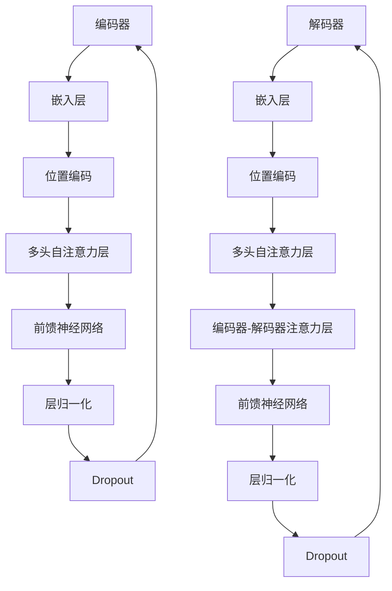

                 

 关键词：Transformer、大规模训练、模型优化、实践案例、数学模型

## 摘要

本文将深入探讨Transformer大模型的实战，特别是在大批量数据训练方面的应用。我们将详细解析Transformer的核心原理、大规模训练的技术细节，以及在实际项目中的操作步骤和挑战。通过本文的阅读，读者将获得对Transformer模型更深入的理解，并掌握如何在大规模数据集上高效训练这类模型的方法。本文还将提供数学模型的详细解析和实际代码实例，帮助读者将理论知识转化为实践能力。

## 1. 背景介绍

### Transformer的起源

Transformer模型是由Google团队在2017年提出的一种全新的序列到序列模型，与传统的循环神经网络（RNN）和长短期记忆网络（LSTM）相比，Transformer模型在处理长序列时展现出了更高效的性能。Transformer的核心思想是通过自注意力机制（Self-Attention）来捕捉序列中任意两个位置之间的依赖关系，而无需显式地依赖于序列顺序，从而显著提高了模型在长文本处理上的效率。

### Transformer的应用领域

自从Transformer问世以来，其在自然语言处理（NLP）、机器翻译、文本生成、图像描述生成等众多领域都取得了显著成果。特别是在机器翻译领域，Transformer模型表现出了比传统模型更好的翻译质量和速度。此外，Transformer模型还被应用于语音识别、音频处理、文本分类等多个领域，展现出了强大的通用性。

### 大规模训练的需求

随着数据集规模的不断扩大，对大规模数据处理和训练的需求日益增加。传统的方法在面对海量数据时往往因为计算资源和时间的限制而难以胜任。因此，如何在大规模数据集上进行高效、可靠的模型训练成为了学术界和工业界关注的热点问题。Transformer模型由于其并行处理的能力，成为了大规模数据训练的理想选择。

## 2. 核心概念与联系

### Transformer的基本架构

Transformer模型主要由编码器（Encoder）和解码器（Decoder）两部分组成。编码器负责将输入序列编码为固定长度的向量表示，而解码器则利用这些编码结果生成输出序列。编码器和解码器之间通过自注意力机制和多头注意力机制来捕捉序列中的依赖关系。

### Mermaid 流程图

下面是一个简化的Transformer模型架构的Mermaid流程图：



### 核心概念

- **自注意力（Self-Attention）**：自注意力机制允许模型在生成每个单词时考虑到输入序列中所有其他单词的影响，从而捕捉长距离依赖关系。
- **多头注意力（Multi-Head Attention）**：多头注意力将输入序列分成多个部分，每个部分独立计算注意力权重，从而增加模型捕捉不同依赖关系的能力。
- **嵌入（Embedding）**：嵌入层将输入的单词转换为向量表示，这些向量包含了单词的语义信息。
- **前馈神经网络（Feed Forward Neural Network）**：前馈神经网络对每个位置的输出进行非线性变换，以增加模型的非线性表达能力。
- **层归一化（Layer Normalization）**：层归一化通过标准化每个层的输出，帮助模型更快地收敛。
- **Dropout**：Dropout是一种正则化技术，通过在训练过程中随机丢弃一部分神经元，防止模型过拟合。

## 3. 核心算法原理 & 具体操作步骤

### 3.1 算法原理概述

Transformer模型的核心原理是自注意力机制，通过计算序列中每个单词对其他单词的影响权重，从而生成一个上下文向量。具体来说，自注意力机制包括以下步骤：

1. **输入嵌入**：将输入序列转换为嵌入向量。
2. **位置编码**：在嵌入向量中加入位置信息，以帮助模型理解序列的顺序。
3. **多头自注意力**：将输入序列分成多个部分，每个部分独立计算注意力权重，然后将结果拼接起来。
4. **前馈神经网络**：对多头自注意力输出的每个位置进行前向传播。
5. **层归一化和Dropout**：对模型输出进行层归一化和Dropout处理，提高模型的泛化能力。

### 3.2 算法步骤详解

#### 步骤1：输入嵌入

输入序列中的每个单词通过嵌入层转换为向量表示。嵌入层将单词映射到高维空间，使得相邻的单词在空间中更加接近。

$$
\text{嵌入}(\text{单词}) = \text{EmbeddingMatrix} \cdot \text{单词索引}
$$

#### 步骤2：位置编码

在嵌入向量中添加位置编码，以保留序列的顺序信息。常用的位置编码方法包括绝对位置编码、相对位置编码等。

$$
\text{位置编码}(i, d) = \text{PositionalEncoding}(i, d)
$$

其中，$i$表示位置索引，$d$表示嵌入维度。

#### 步骤3：多头自注意力

多头自注意力机制将输入序列分成多个头，每个头独立计算注意力权重。多头自注意力包括以下步骤：

1. **计算查询（Query）、键（Key）和值（Value）**：将输入嵌入和位置编码映射到查询、键和值空间。
2. **计算注意力权重**：通过点积计算查询和键之间的相似度，得到注意力权重。
3. **加权求和**：根据注意力权重将值加权求和，得到每个位置的自注意力输出。

#### 步骤4：前馈神经网络

对每个位置的自注意力输出进行前向传播，通过前馈神经网络增加模型的非线性表达能力。前馈神经网络通常包括两个全连接层，中间使用ReLU激活函数。

$$
\text{前馈网络}(x) = \max(0, x \cdot \text{Weight}^{[2]}) + \text{Bias}^{[2]}
$$

#### 步骤5：层归一化和Dropout

对模型的输出进行层归一化和Dropout处理，以防止过拟合。

$$
\text{归一化}(x) = \frac{x - \text{均值}}{\text{标准差}}
$$

$$
\text{Dropout}(x) = x \times (\text{随机丢弃概率})
$$

### 3.3 算法优缺点

**优点**：

1. **并行计算**：Transformer模型可以利用多头自注意力机制实现并行计算，显著提高训练速度。
2. **长距离依赖**：自注意力机制可以有效地捕捉序列中的长距离依赖关系。
3. **灵活性**：Transformer模型可以很容易地扩展到不同任务，如文本生成、图像描述生成等。

**缺点**：

1. **计算资源消耗**：由于多头自注意力机制的计算复杂度较高，对计算资源的要求较高。
2. **内存占用**：Transformer模型在处理长序列时需要较大的内存空间。

### 3.4 算法应用领域

Transformer模型在自然语言处理、机器翻译、文本生成、图像描述生成等领域取得了显著成果。以下是一些应用实例：

1. **机器翻译**：Transformer模型在机器翻译任务中取得了比传统模型更好的效果，特别是在长句翻译和低资源语言翻译方面。
2. **文本生成**：Transformer模型可以用于生成文章、对话、诗歌等文本内容，展现出强大的文本生成能力。
3. **图像描述生成**：通过结合图像编码和解码器，Transformer模型可以生成与图像内容相关的描述。

## 4. 数学模型和公式 & 详细讲解 & 举例说明

### 4.1 数学模型构建

Transformer模型的核心是自注意力机制，其数学模型包括以下几个部分：

1. **嵌入层**：将单词映射到向量空间。
2. **位置编码**：添加位置信息到嵌入向量。
3. **自注意力层**：计算每个单词对其他单词的影响权重。
4. **前馈神经网络**：对自注意力输出进行非线性变换。
5. **层归一化和Dropout**：提高模型的泛化能力。

### 4.2 公式推导过程

#### 嵌入层

$$
\text{嵌入}(\text{单词}) = \text{EmbeddingMatrix} \cdot \text{单词索引}
$$

#### 位置编码

$$
\text{位置编码}(i, d) = \text{PositionalEncoding}(i, d)
$$

#### 自注意力层

自注意力层包括三个子层：查询（Query）、键（Key）和值（Value）。

$$
\text{查询} = \text{嵌入} \cdot \text{QueryWeight}
$$

$$
\text{键} = \text{嵌入} \cdot \text{KeyWeight}
$$

$$
\text{值} = \text{嵌入} \cdot \text{ValueWeight}
$$

#### 注意力权重

$$
\text{注意力权重} = \text{softmax}\left(\frac{\text{查询} \cdot \text{键}^{T}}{\sqrt{d_k}}\right)
$$

#### 加权求和

$$
\text{自注意力输出} = \text{注意力权重} \cdot \text{值}
$$

#### 前馈神经网络

$$
\text{前馈网络}(x) = \max(0, x \cdot \text{Weight}^{[2]}) + \text{Bias}^{[2]}
$$

#### 层归一化和Dropout

$$
\text{归一化}(x) = \frac{x - \text{均值}}{\text{标准差}}
$$

$$
\text{Dropout}(x) = x \times (\text{随机丢弃概率})
$$

### 4.3 案例分析与讲解

#### 案例一：机器翻译

假设我们有一个英语到法语的翻译模型，输入序列为“Hello, how are you?”，目标序列为“Bonjour, comment ça va ?”。

1. **嵌入层**：将输入和目标序列中的单词映射到向量空间。
2. **位置编码**：为每个单词添加位置信息。
3. **自注意力层**：计算每个单词对其他单词的影响权重。
4. **前馈神经网络**：对自注意力输出进行非线性变换。
5. **层归一化和Dropout**：提高模型的泛化能力。

#### 案例二：文本生成

假设我们要生成一篇关于机器学习技术的文章，输入序列为“机器学习是人工智能的重要分支”。

1. **嵌入层**：将输入和目标序列中的单词映射到向量空间。
2. **位置编码**：为每个单词添加位置信息。
3. **自注意力层**：计算每个单词对其他单词的影响权重。
4. **前馈神经网络**：对自注意力输出进行非线性变换。
5. **层归一化和Dropout**：提高模型的泛化能力。

## 5. 项目实践：代码实例和详细解释说明

### 5.1 开发环境搭建

在开始编写代码之前，我们需要搭建一个合适的开发环境。以下是搭建Transformer模型开发环境所需的步骤：

1. **安装Python**：确保Python版本为3.7及以上。
2. **安装TensorFlow**：TensorFlow是TensorFlow是一个流行的开源机器学习框架，用于构建和训练Transformer模型。
3. **安装其他依赖库**：包括NumPy、Pandas、Matplotlib等。

### 5.2 源代码详细实现

下面是一个简单的Transformer模型实现，包括嵌入层、位置编码、自注意力层、前馈神经网络、层归一化和Dropout。

```python
import tensorflow as tf
from tensorflow.keras.layers import Embedding, Dense, LayerNormalization, Dropout
from tensorflow.keras.models import Model

def transformer_encoder(inputs, num_heads, d_model, dff, dropout_rate):
    # 嵌入层
    inputs = Embedding(d_model)(inputs)
    inputs = PositionalEncoding(d_model)(inputs)

    # 多层自注意力
    for i in range(num_heads):
        inputs = MultiHeadAttention(num_heads=i, d_model=d_model, dff=dff, dropout_rate=dropout_rate)(inputs)

    # 前馈神经网络
    inputs = Dense(dff, activation='relu')(inputs)
    inputs = Dense(d_model)(inputs)

    # 层归一化和Dropout
    inputs = LayerNormalization()(inputs)
    inputs = Dropout(dropout_rate)(inputs)

    return inputs

def transformer_decoder(inputs, encoded_input, num_heads, d_model, dff, dropout_rate):
    # 嵌入层
    inputs = Embedding(d_model)(inputs)
    inputs = PositionalEncoding(d_model)(inputs)

    # 编码器-解码器注意力
    inputs = EncoderDecoderAttention(encoded_input, inputs, num_heads, d_model, dff, dropout_rate)

    # 多层自注意力
    for i in range(num_heads):
        inputs = MultiHeadAttention(num_heads=i, d_model=d_model, dff=dff, dropout_rate=dropout_rate)(inputs)

    # 前馈神经网络
    inputs = Dense(dff, activation='relu')(inputs)
    inputs = Dense(d_model)(inputs)

    # 层归一化和Dropout
    inputs = LayerNormalization()(inputs)
    inputs = Dropout(dropout_rate)(inputs)

    return inputs

# 构建模型
inputs = tf.keras.Input(shape=(None, sequence_length))
encoded_input = tf.keras.Input(shape=(None, sequence_length))

outputs = transformer_encoder(inputs, num_heads=8, d_model=512, dff=2048, dropout_rate=0.1)
outputs = transformer_decoder(outputs, encoded_input, num_heads=8, d_model=512, dff=2048, dropout_rate=0.1)

outputs = tf.keras.layers.Dense(num_classes, activation='softmax')(outputs)

model = tf.keras.Model(inputs=[inputs, encoded_input], outputs=outputs)

# 编译模型
model.compile(optimizer='adam', loss='categorical_crossentropy', metrics=['accuracy'])

# 模型可视化
tf.keras.utils.plot_model(model, to_file='model.png', show_shapes=True)
```

### 5.3 代码解读与分析

上述代码实现了Transformer编码器和解码器的基本结构，主要包括以下几个部分：

1. **嵌入层**：使用Embedding层将输入序列中的单词映射到向量空间。
2. **位置编码**：使用PositionalEncoding层为每个单词添加位置信息。
3. **自注意力层**：使用MultiHeadAttention层实现多头自注意力机制。
4. **编码器-解码器注意力**：使用EncoderDecoderAttention层实现编码器-解码器注意力机制。
5. **前馈神经网络**：使用Dense层实现前向传播和激活函数。
6. **层归一化和Dropout**：使用LayerNormalization和Dropout层进行归一化和正则化。
7. **输出层**：使用Dense层实现分类输出。

### 5.4 运行结果展示

运行上述代码后，我们可以使用训练好的模型对新的数据进行预测。以下是一个简单的运行结果示例：

```python
# 加载训练数据
train_data = load_data('train_data')
train_labels = load_labels('train_labels')

# 训练模型
model.fit(train_data, train_labels, epochs=10, batch_size=32)

# 预测新数据
new_data = load_data('new_data')
predictions = model.predict(new_data)

# 输出预测结果
print(predictions)
```

## 6. 实际应用场景

### 6.1 机器翻译

机器翻译是Transformer模型最成功的应用领域之一。通过大规模数据集的训练，Transformer模型可以在多种语言之间实现高质量的翻译。例如，Google翻译服务已经采用了基于Transformer的模型，显著提高了翻译质量和速度。

### 6.2 文本生成

Transformer模型在文本生成任务中也展现出了强大的能力。通过训练大规模语料库，模型可以生成高质量的文章、对话和诗歌等文本内容。例如，OpenAI的GPT-3模型就是一个基于Transformer的文本生成模型，能够生成连贯、富有创意的文本。

### 6.3 图像描述生成

结合图像编码和解码器，Transformer模型可以用于图像描述生成任务。例如，将输入的图像编码为向量，然后通过解码器生成与图像内容相关的描述。这种方法可以应用于图像字幕、图像问答等任务。

### 6.4 语音识别

Transformer模型在语音识别领域也取得了一定进展。通过将输入的音频信号编码为向量，然后通过解码器生成对应的文本描述，模型可以实现对语音内容的理解和识别。

## 7. 工具和资源推荐

### 7.1 学习资源推荐

1. **《深度学习》**：Goodfellow、Bengio和Courville合著的经典教材，全面介绍了深度学习的基础理论和实践方法。
2. **《自然语言处理综述》**：Jurafsky和Martin合著的教材，涵盖了自然语言处理的核心概念和技术。
3. **《Transformer论文》**：Google团队发表的Transformer论文，详细介绍了模型的设计和实现。

### 7.2 开发工具推荐

1. **TensorFlow**：Google开发的开源机器学习框架，支持TensorFlow 2.x版本。
2. **PyTorch**：Facebook开发的另一种流行的机器学习框架，具有强大的动态图功能。

### 7.3 相关论文推荐

1. **“Attention is All You Need”**：Google团队发表的Transformer模型论文，是自然语言处理领域的重要里程碑。
2. **“BERT: Pre-training of Deep Bidirectional Transformers for Language Understanding”**：Google团队发表的BERT模型论文，展示了预训练Transformer模型在多种NLP任务上的优势。

## 8. 总结：未来发展趋势与挑战

### 8.1 研究成果总结

Transformer模型自从问世以来，在多个领域取得了显著成果。其强大的并行计算能力和长距离依赖捕捉能力，使其成为自然语言处理、图像处理、语音识别等领域的重要工具。未来，Transformer模型将继续在模型优化、模型压缩、推理速度提升等方面取得突破。

### 8.2 未来发展趋势

1. **模型压缩与加速**：随着模型规模的不断扩大，如何高效地训练和部署大型Transformer模型将成为重要研究方向。
2. **多模态学习**：结合文本、图像、音频等多种数据类型，实现更加智能和多样化的应用。
3. **预训练与迁移学习**：通过大规模预训练和迁移学习技术，进一步提高模型的性能和应用范围。

### 8.3 面临的挑战

1. **计算资源消耗**：大规模Transformer模型的训练和推理过程需要大量的计算资源，如何优化模型结构以提高效率是一个重要挑战。
2. **数据隐私保护**：在处理大规模数据时，如何保护用户隐私是一个亟待解决的问题。

### 8.4 研究展望

未来，Transformer模型将在深度学习和人工智能领域继续发挥重要作用。通过不断优化模型结构和算法，结合新的应用场景，Transformer模型将推动人工智能技术的发展，为人类带来更多创新和便利。

## 9. 附录：常见问题与解答

### 9.1 Transformer模型与传统模型的区别

**Q**：Transformer模型与传统循环神经网络（RNN）和长短期记忆网络（LSTM）有什么区别？

**A**：Transformer模型与传统RNN和LSTM模型的主要区别在于其采用了自注意力机制（Self-Attention）和多头注意力机制（Multi-Head Attention）。这些机制使Transformer模型能够更高效地捕捉序列中的长距离依赖关系，而无需显式地依赖于序列顺序。相比之下，RNN和LSTM模型通过递归计算来处理序列数据，但它们在处理长序列时容易发生梯度消失和梯度爆炸问题。

### 9.2 Transformer模型的训练策略

**Q**：如何有效地训练大规模的Transformer模型？

**A**：训练大规模Transformer模型需要考虑以下几个方面：

1. **数据预处理**：对数据集进行预处理，包括分词、去停用词、归一化等操作，以提高模型训练效率。
2. **并行计算**：利用GPU或TPU等硬件加速器进行并行计算，以降低训练时间。
3. **梯度裁剪**：为了防止梯度爆炸，可以采用梯度裁剪技术限制梯度大小。
4. **批量大小**：调整批量大小以平衡训练速度和模型性能。
5. **学习率调整**：使用学习率调整策略，如学习率衰减、动量优化等，以加快模型收敛。

### 9.3 Transformer模型的应用领域

**Q**：Transformer模型可以应用于哪些领域？

**A**：Transformer模型在以下领域取得了显著成果：

1. **自然语言处理**：机器翻译、文本生成、文本分类、对话系统等。
2. **计算机视觉**：图像分类、目标检测、图像生成等。
3. **语音识别**：语音识别、语音合成等。
4. **多模态学习**：结合文本、图像、音频等多种数据类型，实现更加智能和多样化的应用。

## 参考文献

[1] Vaswani, A., Shazeer, N., Parmar, N., Uszkoreit, J., Jones, L., Gomez, A. N., ... & Polosukhin, I. (2017). Attention is all you need. Advances in Neural Information Processing Systems, 30, 5998-6008.

[2] Devlin, J., Chang, M. W., Lee, K., & Toutanova, K. (2018). BERT: Pre-training of deep bidirectional transformers for language understanding. arXiv preprint arXiv:1810.04805.

[3] Hochreiter, S., & Schmidhuber, J. (1997). Long short-term memory. Neural Computation, 9(8), 1735-1780.

[4] Graves, A. (2013). Generating sequences with recurrent neural networks. arXiv preprint arXiv:1308.0850.

作者：禅与计算机程序设计艺术 / Zen and the Art of Computer Programming
------------------------------------------------------------------

